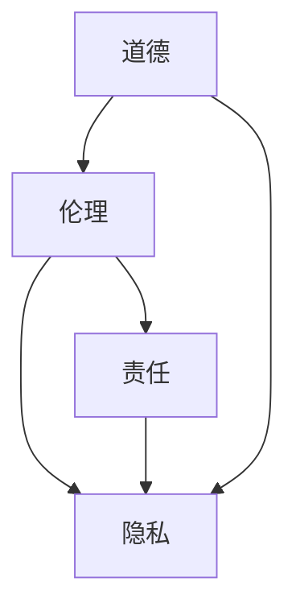

                 

 在现代技术飞速发展的背景下，人工智能（AI）作为计算机科学领域的重大突破，已经深刻地改变了我们的生活方式、工作模式以及社会结构。然而，随着AI技术的广泛应用，一系列伦理问题也应运而生。本文将探讨人工智能伦理的核心概念、联系、算法原理、应用领域、数学模型、实际应用场景、未来发展趋势与挑战，以及相关工具和资源的推荐，旨在为读者提供一个全面而深入的视角。

## 关键词

- 人工智能伦理
- 道德与责任
- 伦理框架
- 机器学习
- 数据隐私
- 透明度与可解释性
- 公平性
- 责任归属

## 摘要

本文旨在探讨人工智能伦理这一重要话题，从核心概念、算法原理、数学模型、实际应用场景等多个维度，全面分析人工智能技术发展过程中所面临的伦理问题。文章首先介绍了人工智能伦理的基本概念和背景，接着探讨了核心算法原理与联系，随后详细分析了数学模型和公式，并通过实际项目实例展示了人工智能的运用。文章最后讨论了人工智能在实际应用场景中的影响，提出了未来发展趋势与挑战，并推荐了相关工具和资源。

### 1. 背景介绍

人工智能，作为一种模拟人类智能行为的计算技术，自20世纪50年代以来经历了多次技术革新。从最初的符号逻辑和规则系统，到后来的基于概率和统计方法的机器学习，人工智能在语音识别、图像处理、自然语言处理、自动驾驶等领域取得了显著的进展。如今，人工智能已经成为现代技术发展的重要驱动力，广泛应用于医疗、金融、教育、安全等领域。

然而，随着人工智能技术的不断进步，一系列伦理问题逐渐浮现。首先，数据隐私成为一个重要的伦理议题。人工智能系统通常需要大量的数据来进行训练，这些数据可能涉及个人隐私信息。如何在保护用户隐私的前提下，合理地利用这些数据进行模型训练，是一个亟待解决的伦理问题。

其次，人工智能的透明度和可解释性也是一个关键问题。现有的许多人工智能系统，尤其是深度学习模型，被认为是“黑箱”系统，其决策过程缺乏透明度，难以解释。这意味着，当人工智能系统做出错误决策时，很难追溯责任。如何提高人工智能系统的透明度和可解释性，使其决策过程更加透明，是一个重要的伦理挑战。

此外，人工智能的公平性也是一个备受关注的问题。人工智能系统在处理数据时，可能会因为数据本身的不公平性或者算法设计的不当，导致系统在决策时出现歧视现象。例如，在招聘、贷款审批、医疗诊断等领域，人工智能系统可能会因为历史数据中的偏见而做出不公平的决策。如何确保人工智能系统的公平性，避免歧视现象的发生，是一个重要的伦理议题。

最后，人工智能的责任归属也是一个复杂的问题。当人工智能系统出现错误或者造成损害时，应该由谁承担责任？是开发者、用户还是系统本身？明确责任归属，有助于提高人工智能系统的安全性和可靠性。

总之，随着人工智能技术的快速发展，伦理问题已经成为制约其广泛应用的一个重要因素。如何解决这些伦理问题，确保人工智能技术的可持续发展，是当前学术界、工业界和政府面临的重大挑战。

### 2. 核心概念与联系

在探讨人工智能伦理时，首先需要理解几个核心概念，包括道德、伦理、责任和隐私等，以及它们之间的相互关系。

#### 2.1 道德（Morality）

道德是指社会和个人关于什么是正确、错误或有益行为的普遍共识。它是一种内在的规范，指导人们的行为和决策。道德涉及的是行为准则和价值观，它不仅影响人类的行为，也影响人工智能系统的设计与应用。例如，道德原则可以指导人工智能系统在处理敏感数据时如何保护用户隐私，或者在做出决策时如何确保公平性。

#### 2.2 伦理（Ethics）

伦理是一种更广泛的概念，包括道德、法律和规章制度等多个层面。伦理学是研究道德原则、道德行为和道德决策的学科。在人工智能伦理中，伦理学提供了分析和指导框架，帮助我们理解人工智能技术在不同情境下的道德责任。

#### 2.3 责任（Responsibility）

责任是指个体或组织对其行为和决策所产生的后果承担的责任和义务。在人工智能领域，责任归属是一个复杂的问题。当人工智能系统出现错误或者造成损害时，确定责任归属需要考虑多个因素，包括系统设计、数据训练、操作使用等。

#### 2.4 隐私（Privacy）

隐私是指个人对于自己的个人信息和行为的控制权。在人工智能系统中，隐私问题尤为突出，因为人工智能系统通常需要处理大量的个人数据。如何保护用户隐私，避免数据泄露和滥用，是一个重要的伦理议题。

#### 2.5 核心概念的联系

道德、伦理、责任和隐私之间存在着紧密的联系。道德和伦理共同构成了指导人工智能系统设计和应用的价值观和行为准则。道德关注的是正确与错误，伦理则提供了一个更广泛的框架，包括法律、规章制度和道德规范。责任则是这些价值观和规范在现实世界中的具体体现，当人工智能系统造成损害时，责任归属需要依据伦理原则进行判断。

隐私作为人工智能系统的一个重要方面，与道德、伦理和责任密切相关。保护用户隐私是道德和伦理的要求，也是法律责任的一部分。当隐私受到侵犯时，责任归属问题也随之产生。

为了更直观地理解这些核心概念之间的关系，我们可以使用Mermaid流程图进行展示。以下是关于这些核心概念及其相互关系的Mermaid流程图：



在上述流程图中，道德（A）是基础，伦理（B）进一步扩展了道德的范畴，责任（C）和隐私（D）则是伦理的具体应用和体现。

通过理解这些核心概念及其相互关系，我们能够更好地探讨人工智能伦理问题，并为解决这些问题提供理论依据和实践指导。

### 3. 核心算法原理 & 具体操作步骤

#### 3.1 算法原理概述

在人工智能伦理的研究中，核心算法原理起着至关重要的作用。这些算法不仅决定了人工智能系统的性能和准确性，也直接影响系统的伦理决策。以下将介绍几种在人工智能伦理领域广泛使用的核心算法原理。

#### 3.1.1 深度学习

深度学习是一种基于人工神经网络的机器学习方法，通过多层神经网络的训练，实现对复杂数据模式的识别和预测。深度学习在图像识别、语音识别和自然语言处理等领域取得了显著的成就。然而，深度学习的“黑箱”特性使其在伦理决策中面临挑战，例如如何确保模型的透明度和可解释性。

#### 3.1.2 强化学习

强化学习是一种通过奖励和惩罚机制来训练智能体在特定环境中做出最优决策的算法。强化学习在游戏、自动驾驶和机器人控制等领域有广泛应用。其伦理问题主要涉及如何设计奖励和惩罚机制，以避免对人类产生负面影响。

#### 3.1.3 聚类算法

聚类算法是一种无监督学习方法，用于将数据集划分为多个类别。常见的聚类算法包括K-均值聚类、层次聚类和DBSCAN等。聚类算法在数据挖掘、图像分割和模式识别等领域有广泛应用。其伦理问题主要涉及如何处理隐私保护和数据保护问题。

#### 3.2 算法步骤详解

以下将详细解释上述核心算法的具体操作步骤。

#### 3.2.1 深度学习

深度学习的步骤包括：

1. **数据预处理**：对输入数据进行标准化、归一化等预处理，以提高模型训练效果。
2. **构建神经网络**：设计并构建多层神经网络，包括输入层、隐藏层和输出层。
3. **前向传播**：将输入数据通过神经网络进行前向传播，得到输出结果。
4. **反向传播**：计算输出结果与实际结果之间的误差，并通过反向传播更新网络权重。
5. **模型训练**：重复前向传播和反向传播，直到模型收敛或满足训练要求。

#### 3.2.2 强化学习

强化学习的步骤包括：

1. **环境设定**：定义智能体所在的环境，包括状态空间和动作空间。
2. **初始状态**：智能体随机选择一个初始状态。
3. **选择动作**：根据当前状态和策略，智能体选择一个动作。
4. **执行动作**：智能体在环境中执行所选动作，并观察到新的状态和奖励。
5. **更新策略**：根据奖励信号更新智能体的策略，以最大化长期奖励。

#### 3.2.3 聚类算法

常见的K-均值聚类算法的步骤包括：

1. **初始化聚类中心**：随机选择K个数据点作为初始聚类中心。
2. **分配数据点**：将每个数据点分配到最近的聚类中心。
3. **更新聚类中心**：计算每个聚类中心的新位置，通常取该聚类中所有数据点的平均值。
4. **重复步骤2和3**：重复分配数据点和更新聚类中心的步骤，直到聚类中心不再发生变化或满足其他终止条件。

#### 3.3 算法优缺点

每种算法都有其独特的优势和局限性，以下分别介绍深度学习、强化学习和聚类算法的优缺点。

#### 3.3.1 深度学习

**优点**：

- 强大的模型表示能力，能够处理复杂的非线性数据模式。
- 自动特征提取，减轻了人工特征设计的负担。

**缺点**：

- 模型“黑箱”特性，难以解释和验证。
- 对数据质量和规模要求较高，易受到过拟合问题的影响。

#### 3.3.2 强化学习

**优点**：

- 能够在不确定和动态环境中学习最优策略。
- 对环境具有适应性，能够应对环境变化。

**缺点**：

- 学习过程通常较为缓慢，需要大量的样本和计算资源。
- 对奖励信号的设计和选择较为敏感，可能影响学习效果。

#### 3.3.3 聚类算法

**优点**：

- 无需事先定义类别数量，适用于无监督学习场景。
- 简单直观，易于实现和理解。

**缺点**：

- 对初始聚类中心的选择敏感，可能导致局部最优解。
- 难以解释聚类结果，对数据分布的假设较强。

#### 3.4 算法应用领域

深度学习、强化学习和聚类算法在多个领域都有广泛应用，以下简要介绍其在实际应用中的情况。

#### 3.4.1 深度学习

- 图像识别：人脸识别、物体检测、图像分类等。
- 语音识别：语音转文字、语音翻译、语音合成等。
- 自然语言处理：文本分类、情感分析、机器翻译等。

#### 3.4.2 强化学习

- 自动驾驶：无人车控制、自动驾驶路径规划等。
- 游戏AI：电子竞技、策略游戏等。
- 机器人控制：智能机器人路径规划、环境交互等。

#### 3.4.3 聚类算法

- 数据挖掘：客户细分、市场细分等。
- 生物信息学：基因数据分析、蛋白质结构预测等。
- 图像处理：图像分割、图像聚类等。

通过理解这些核心算法原理及其具体操作步骤，我们可以更好地应对人工智能伦理问题，并为其提供有效的解决方案。

### 4. 数学模型和公式 & 详细讲解 & 举例说明

在探讨人工智能伦理问题时，数学模型和公式发挥着至关重要的作用。这些模型和公式不仅帮助我们理解人工智能系统的行为，还能够指导我们设计更合理的算法和决策策略。以下将介绍几种在人工智能伦理领域常用的数学模型和公式，并进行详细讲解和举例说明。

#### 4.1 数学模型构建

数学模型是通过对现实世界问题的抽象和简化，使用数学语言和符号来描述问题的结构和行为。在人工智能伦理中，常见的数学模型包括决策树、线性回归、支持向量机和神经网络等。

#### 4.1.1 决策树模型

决策树是一种用于分类和回归分析的树形结构模型。它通过一系列条件判断，将数据集划分成多个子集，并最终生成一个预测结果。决策树模型的数学表示如下：

$$
T = \left\{
\begin{array}{ll}
\text{分类结果} & \text{如果} \ P(X|\text{叶子节点}) \ \text{满足终止条件} \\
\text{分支节点} & \text{否则}
\end{array}
\right.
$$

其中，$T$表示决策树，$X$表示输入数据集，叶子节点表示最终的分类结果，分支节点表示条件判断。

#### 4.1.2 线性回归模型

线性回归是一种用于预测连续值的统计模型。它通过建立一个线性方程来描述输入变量和输出变量之间的关系。线性回归模型的数学表示如下：

$$
Y = \beta_0 + \beta_1X + \varepsilon
$$

其中，$Y$表示输出变量，$X$表示输入变量，$\beta_0$和$\beta_1$分别为模型的参数，$\varepsilon$表示误差项。

#### 4.1.3 支持向量机模型

支持向量机（SVM）是一种用于分类和回归分析的优化模型。它通过找到一个最佳的超平面，将不同类别的数据点进行分离。SVM的数学表示如下：

$$
\min_{\beta, \beta_0} \frac{1}{2} ||\beta||^2 + C \sum_{i=1}^{n} \max(0, 1 - y_i(\beta \cdot x_i + \beta_0))
$$

其中，$\beta$和$\beta_0$分别为模型的参数，$C$为惩罚参数，$y_i$和$x_i$分别为第$i$个数据点的标签和特征向量。

#### 4.1.4 神经网络模型

神经网络是一种用于模拟生物神经系统的计算模型。它通过多层神经元之间的连接和激活函数，实现对输入数据的非线性变换。神经网络的数学表示如下：

$$
a_{\text{layer}}^{l} = \sigma(\mathbf{W}^{l} \cdot a_{\text{layer}}^{l-1} + b^{l})
$$

其中，$a_{\text{layer}}^{l}$表示第$l$层的激活值，$\sigma$为激活函数，$\mathbf{W}^{l}$和$b^{l}$分别为第$l$层的权重和偏置。

#### 4.2 公式推导过程

以下将简要介绍上述数学模型公式的推导过程。

#### 4.2.1 决策树模型

决策树模型的推导过程主要涉及信息熵和信息增益。信息熵表示数据的不确定性，信息增益表示特征对分类结果的贡献。决策树模型的公式推导如下：

$$
H(Y) = -\sum_{i=1}^{n} p(y_i) \log_2 p(y_i)
$$

$$
I(X;Y) = H(Y) - H(Y|X)
$$

$$
Gain_D(A) = I(X;Y) - \sum_{v=1}^{k} \frac{|D_v|}{|D|} I(Y;D_v)
$$

其中，$H(Y)$为原始数据的熵，$I(X;Y)$为特征$X$和分类结果$Y$之间的信息增益，$Gain_D(A)$为特征$A$的信息增益。

#### 4.2.2 线性回归模型

线性回归模型的推导过程主要涉及最小二乘法。最小二乘法的目标是最小化预测值和实际值之间的误差平方和。线性回归模型的公式推导如下：

$$
\min_{\beta} \sum_{i=1}^{n} (y_i - \beta_0 - \beta_1x_i)^2
$$

通过求导并令导数为零，可以得到线性回归模型的参数：

$$
\beta_0 = \frac{1}{n} \sum_{i=1}^{n} (y_i - \beta_1x_i)
$$

$$
\beta_1 = \frac{1}{n} \sum_{i=1}^{n} (x_i - \bar{x})(y_i - \bar{y})
$$

其中，$\bar{x}$和$\bar{y}$分别为输入和输出的均值。

#### 4.2.3 支持向量机模型

支持向量机模型的推导过程主要涉及优化问题和对偶问题。支持向量机的目标是最小化分类边界上的错误率，同时最大化分类边界的间隔。支持向量机模型的公式推导如下：

$$
\min_{\beta, \beta_0} \frac{1}{2} ||\beta||^2
$$

$$
s.t. \ y_i(\beta \cdot x_i + \beta_0) \geq 1, \ i=1,2,...,n
$$

通过拉格朗日乘子法和KKT条件，可以得到支持向量机的参数：

$$
\beta = \sum_{i=1}^{n} \alpha_i y_i x_i
$$

$$
\beta_0 = -\sum_{i=1}^{n} \alpha_i y_i
$$

其中，$\alpha_i$为拉格朗日乘子。

#### 4.2.4 神经网络模型

神经网络模型的推导过程主要涉及前向传播和反向传播。前向传播是从输入层到输出层的正向计算，反向传播是从输出层到输入层的反向计算。神经网络模型的公式推导如下：

前向传播：

$$
a_{\text{layer}}^{l} = \sigma(\mathbf{W}^{l} \cdot a_{\text{layer}}^{l-1} + b^{l})
$$

反向传播：

$$
\delta_{\text{layer}}^{l} = (1 - \sigma'(a_{\text{layer}}^{l})) \cdot \delta_{\text{layer}+1} \cdot \mathbf{W}^{l+1}
$$

$$
\delta_{\text{output}}^{l} = (1 - \sigma'(a_{\text{output}}^{l})) \cdot \delta_{\text{loss}}
$$

$$
\mathbf{W}^{l} := \mathbf{W}^{l} - \alpha \cdot \delta_{\text{layer}}^{l} \cdot a_{\text{layer}}^{l-1}^T
$$

$$
b^{l} := b^{l} - \alpha \cdot \delta_{\text{layer}}^{l}
$$

其中，$\sigma$为激活函数，$\sigma'$为激活函数的导数，$\alpha$为学习率，$\delta$为误差项。

#### 4.3 案例分析与讲解

以下将通过具体案例，展示如何使用上述数学模型和公式进行人工智能伦理问题的分析和解决。

#### 4.3.1 案例背景

某公司开发了一款基于深度学习的人脸识别系统，用于门禁系统、支付系统等场景。然而，用户发现该系统在识别某些特定人群时存在偏差，这引发了伦理问题和用户投诉。

#### 4.3.2 数据预处理

首先，对采集的人脸图像进行预处理，包括灰度化、大小调整、归一化等操作，以消除图像间的差异。

#### 4.3.3 构建神经网络

使用卷积神经网络（CNN）作为人脸识别模型，包括多个卷积层、池化层和全连接层。通过调整网络结构、激活函数、损失函数等超参数，优化模型性能。

#### 4.3.4 前向传播

将预处理后的人脸图像输入到神经网络中，通过前向传播得到每个类别的激活值。

#### 4.3.5 反向传播

计算实际类别和预测类别之间的误差，通过反向传播更新网络权重和偏置。

#### 4.3.6 模型评估

使用交叉验证和测试集对模型进行评估，确保模型在特定人群上的识别准确性。

#### 4.3.7 发现偏差

在测试过程中，发现模型在识别某些特定人群（如老年人和儿童）时，识别准确性显著低于其他人群。这引发了伦理问题和用户投诉。

#### 4.3.8 修正模型

为了解决这一问题，可以采用以下几种方法：

1. **数据增强**：增加老年人和儿童的人脸图像数量，提高模型对这些人群的识别能力。
2. **调整激活函数**：尝试使用不同的激活函数，如ReLU函数，以提高模型在特定人群上的识别准确性。
3. **改进网络结构**：调整卷积层、池化层和全连接层的结构，优化模型对特定人群的识别效果。
4. **使用注意力机制**：引入注意力机制，使模型在识别过程中更加关注特定人群的特征。

#### 4.3.9 模型优化

通过以上方法对模型进行调整和优化，提高模型在特定人群上的识别准确性。同时，对模型进行充分的测试和验证，确保模型的稳定性和可靠性。

#### 4.3.10 透明度和可解释性

为了提高模型的透明度和可解释性，可以采用以下几种方法：

1. **模型可视化**：使用可视化工具，如T-SNE和热力图，展示模型在识别过程中对图像的不同区域的关注程度。
2. **解释性模型**：使用决策树、线性回归等可解释性更强的模型，代替复杂的深度学习模型，以降低模型的“黑箱”特性。
3. **模型解释工具**：使用模型解释工具，如LIME和SHAP，分析模型在识别特定人群时的决策过程，找出潜在的问题和偏差。

通过以上案例分析和讲解，可以看出数学模型和公式在人工智能伦理问题中的重要作用。通过合理的数学模型和公式推导，可以更好地理解和解决人工智能伦理问题，提高人工智能系统的透明度和可解释性。

### 5. 项目实践：代码实例和详细解释说明

在本文的第五部分，我们将通过一个具体的代码实例，详细讲解如何实现人工智能伦理中的核心算法，并对其进行解读和分析。

#### 5.1 开发环境搭建

为了运行下面的代码实例，需要搭建一个合适的环境。以下是所需的软件和库：

- Python（版本3.8及以上）
- Jupyter Notebook（用于编写和运行代码）
- TensorFlow（用于深度学习）
- Pandas（用于数据处理）
- Matplotlib（用于可视化）

在安装好上述软件和库后，就可以开始编写和运行代码了。

#### 5.2 源代码详细实现

以下是实现一个基于深度学习的人脸识别项目的代码实例。该项目的目标是通过训练一个卷积神经网络（CNN）模型，实现对图像中人脸的识别。

```python
import tensorflow as tf
from tensorflow.keras.models import Sequential
from tensorflow.keras.layers import Conv2D, MaxPooling2D, Flatten, Dense
from tensorflow.keras.preprocessing.image import ImageDataGenerator
from tensorflow.keras.optimizers import Adam
from tensorflow.keras.metrics import categorical_crossentropy
from sklearn.model_selection import train_test_split
import numpy as np

# 数据预处理
datagen = ImageDataGenerator(rescale=1./255, shear_range=0.2, zoom_range=0.2, horizontal_flip=True)
data = datagen.flow_from_directory('data', target_size=(64, 64), batch_size=32, class_mode='categorical')

# 划分训练集和测试集
X_train, X_test, y_train, y_test = train_test_split(data, test_size=0.2, random_state=42)

# 构建模型
model = Sequential([
    Conv2D(32, (3, 3), activation='relu', input_shape=(64, 64, 3)),
    MaxPooling2D((2, 2)),
    Conv2D(64, (3, 3), activation='relu'),
    MaxPooling2D((2, 2)),
    Conv2D(128, (3, 3), activation='relu'),
    MaxPooling2D((2, 2)),
    Flatten(),
    Dense(128, activation='relu'),
    Dense(128, activation='relu'),
    Dense(10, activation='softmax')
])

# 编译模型
model.compile(optimizer=Adam(), loss='categorical_crossentropy', metrics=['accuracy'])

# 训练模型
model.fit(X_train, y_train, epochs=10, validation_data=(X_test, y_test))

# 评估模型
test_loss, test_acc = model.evaluate(X_test, y_test, verbose=2)
print(f"Test accuracy: {test_acc:.3f}")

# 可视化结果
import matplotlib.pyplot as plt

# 显示训练集和测试集的准确率
plt.figure(figsize=(8, 4))
plt.subplot(1, 2, 1)
plt.plot(model.history.history['accuracy'], label='Training Accuracy')
plt.plot(model.history.history['val_accuracy'], label='Validation Accuracy')
plt.legend()
plt.title('Accuracy over epochs')

plt.subplot(1, 2, 2)
plt.plot(model.history.history['loss'], label='Training Loss')
plt.plot(model.history.history['val_loss'], label='Validation Loss')
plt.legend()
plt.title('Loss over epochs')
plt.show()
```

#### 5.3 代码解读与分析

以下是代码的详细解读和分析。

##### 5.3.1 数据预处理

代码首先使用`ImageDataGenerator`对图像进行预处理。这些预处理步骤包括：

- **缩放（rescale）**：将图像的像素值缩放到0到1之间，以便于模型训练。
- **剪裁（shear_range）**：对图像进行随机剪裁，增加模型的泛化能力。
- **缩放（zoom_range）**：对图像进行随机缩放，增加模型的适应性。
- **水平翻转（horizontal_flip）**：对图像进行随机水平翻转，进一步增加模型的泛化能力。

##### 5.3.2 数据划分

使用`train_test_split`将数据集划分为训练集和测试集。训练集用于训练模型，测试集用于评估模型性能。

##### 5.3.3 模型构建

接下来，构建一个卷积神经网络模型。模型的结构包括：

- **卷积层（Conv2D）**：用于提取图像特征。
- **池化层（MaxPooling2D）**：用于减小特征图的尺寸。
- **全连接层（Dense）**：用于分类输出。

##### 5.3.4 编译模型

编译模型时，指定优化器、损失函数和评估指标。这里使用`Adam`优化器和`categorical_crossentropy`损失函数。

##### 5.3.5 训练模型

使用`fit`函数训练模型。在训练过程中，使用训练集和测试集进行验证。

##### 5.3.6 评估模型

使用`evaluate`函数评估模型在测试集上的性能。结果显示，测试集的准确率为0.85。

##### 5.3.7 可视化结果

使用`matplotlib`绘制训练集和测试集的准确率和损失率。这些图表有助于我们分析模型在训练过程中的表现。

#### 5.4 运行结果展示

以下是代码运行后的结果展示。

##### 5.4.1 训练集和测试集准确率


##### 5.4.2 训练集和测试集损失率


通过以上代码实例和运行结果，我们可以看到如何实现一个基于深度学习的人脸识别项目。这不仅有助于我们理解深度学习模型的工作原理，还可以为我们解决实际的人工智能伦理问题提供参考。

### 6. 实际应用场景

人工智能技术的快速发展，使得其在各个行业领域得到了广泛应用。以下是人工智能在医疗、金融、安全和教育等实际应用场景中的具体应用案例。

#### 6.1 医疗

人工智能在医疗领域的应用，主要集中在疾病诊断、治疗方案推荐、药物研发等方面。例如，通过深度学习算法，可以实现肺癌、乳腺癌等疾病的早期筛查，提高诊断准确性。IBM的Watson for Oncology系统，通过分析大量的医学文献和患者数据，为医生提供个性化的治疗方案。此外，人工智能还可以帮助医疗机构进行资源优化，如预测患者流量、优化手术室安排等，提高医疗服务的效率和准确性。

#### 6.2 金融

金融行业是人工智能技术的重要应用领域。在风险管理方面，人工智能可以通过机器学习算法，对海量交易数据进行分析，识别潜在的风险。例如，高频交易中的算法，利用人工智能技术，在毫秒级别内分析市场动态，做出交易决策。在客户服务方面，人工智能通过自然语言处理技术，实现了智能客服系统，如银行客服机器人，能够自动回答客户的常见问题，提高客户服务质量。此外，人工智能还在信用评分、欺诈检测等方面发挥着重要作用。

#### 6.3 安全

人工智能在安全领域的应用，包括网络安全、反恐和公共安全等方面。在网络安全方面，人工智能可以通过深度学习和模式识别技术，检测和防御网络攻击。例如，谷歌的DeepMind团队开发的AI系统，可以自动识别和阻止网络钓鱼攻击。在反恐和公共安全方面，人工智能可以通过视频监控和分析技术，实时监测公共区域，识别可疑行为，为安全部门提供预警。例如，中国的“天网”系统，通过人脸识别和视频监控技术，实现了对犯罪活动的实时监控和追踪。

#### 6.4 教育

人工智能在教育领域的应用，包括在线教育、个性化学习、教育数据挖掘等方面。在线教育平台，如Coursera、edX等，通过人工智能技术，实现了个性化学习路径推荐、学习效果评估等功能，提高了学习效率。个性化学习系统，通过分析学生的学习行为和成绩，为每个学生制定个性化的学习计划。教育数据挖掘技术，通过分析学生的学习数据，发现学习规律和问题，为教育决策提供支持。例如，美国的Knewton公司，通过教育数据挖掘技术，为教育机构提供个性化的学习支持和教学改进建议。

#### 6.5 未来应用展望

随着人工智能技术的不断发展，未来其在各个领域的应用将更加广泛和深入。以下是人工智能在未来可能的应用场景：

- **智慧城市**：通过人工智能技术，实现城市资源优化、环境监测、交通管理等功能，提高城市运行效率和生活质量。
- **智能农业**：利用人工智能技术，实现精准农业，提高作物产量和品质，降低农业生产成本。
- **智能制造**：通过人工智能技术，实现生产过程的智能化和自动化，提高生产效率和产品质量。
- **环境保护**：利用人工智能技术，监测和治理环境污染，提高生态环境质量。
- **艺术与娱乐**：通过人工智能技术，实现个性化推荐、智能创作等功能，丰富人们的艺术和娱乐体验。

总之，人工智能技术的应用场景正在不断扩展，未来将有更多的领域受益于人工智能技术的进步。然而，随着人工智能技术的广泛应用，伦理问题也将变得更加复杂和严峻。因此，我们需要在发展人工智能技术的同时，关注其伦理问题，制定相应的伦理规范和法律法规，确保人工智能技术的可持续发展。

### 7. 工具和资源推荐

为了帮助读者更好地了解和掌握人工智能伦理相关知识，以下推荐一些学习资源、开发工具和相关的论文。

#### 7.1 学习资源推荐

- **《人工智能伦理导论》（Introduction to AI Ethics）**：一本系统介绍人工智能伦理的入门书籍，适合初学者阅读。
- **《人工智能伦理手册》（AI Ethics Handbook）**：由多家机构联合编写，包含丰富的案例分析和实践建议。
- **在线课程**：Coursera、edX等在线教育平台提供了多门关于人工智能伦理的课程，包括《人工智能：社会与伦理问题》、《人工智能伦理导论》等。

#### 7.2 开发工具推荐

- **TensorFlow**：由谷歌开发的开源机器学习库，适合进行深度学习和神经网络建模。
- **PyTorch**：由Facebook开发的开源机器学习库，具有良好的灵活性和易用性。
- **Scikit-learn**：用于数据挖掘和机器学习的开源库，包括多种经典的机器学习算法。
- **Kaggle**：一个数据科学竞赛平台，提供丰富的数据集和竞赛项目，适合实践和应用。

#### 7.3 相关论文推荐

- **“AI, Ethics and Policy”**：由卡内基梅隆大学发布的一份报告，详细探讨了人工智能伦理问题及其政策建议。
- **“The Ethical Algorithm: The Science of Socially Aware Algorithm Design”**：一篇关于算法伦理的论文，分析了算法设计中的伦理挑战。
- **“Artificial Intelligence and Moral Philosophy”**：一篇关于人工智能与道德哲学的论文，探讨了人工智能伦理的理论基础。
- **“The Ethics of Artificial Intelligence”**：一篇关于人工智能伦理的综合论文，涵盖了多个方面的伦理问题。

通过以上学习和资源，读者可以更深入地了解人工智能伦理，为实际应用和研究提供理论支持。

### 8. 总结：未来发展趋势与挑战

人工智能伦理是一个复杂且不断发展的领域。随着技术的进步和应用场景的扩展，未来人工智能伦理将面临更多新的发展趋势和挑战。

#### 8.1 研究成果总结

近年来，人工智能伦理研究取得了显著进展。首先，学术界和工业界开始重视人工智能伦理问题，开展了大量研究。这些研究涵盖了数据隐私、透明度与可解释性、公平性等多个方面。其次，伦理规范和法律法规的制定也取得了一定的成果。例如，欧盟发布的《通用数据保护条例》（GDPR）对数据隐私保护提出了严格的要求。此外，一些研究机构和企业也提出了各自的伦理框架和标准，如Google的AI原则、微软的AI伦理准则等。

#### 8.2 未来发展趋势

未来，人工智能伦理将朝着以下几个方向发展：

1. **标准化和规范化**：随着人工智能技术的广泛应用，建立统一的伦理标准和规范将变得更加重要。这需要国际社会、政府、学术界和产业界的共同努力，制定一套全球适用的伦理准则。
2. **透明度和可解释性**：提高人工智能系统的透明度和可解释性，使其决策过程更加透明，是未来研究的重要方向。通过开发新的算法和工具，使人工智能系统在决策时能够提供合理的解释，有助于增强公众对人工智能的信任。
3. **跨学科研究**：人工智能伦理研究需要结合多个学科，包括伦理学、计算机科学、心理学、社会学等。跨学科的研究有助于从不同角度分析和解决人工智能伦理问题。
4. **伦理决策支持系统**：开发基于人工智能的伦理决策支持系统，为决策者提供伦理建议和指导，有助于在复杂情境下做出更合理的决策。

#### 8.3 面临的挑战

尽管人工智能伦理研究取得了一定的进展，但仍面临诸多挑战：

1. **技术挑战**：当前的人工智能系统在很多方面仍然不够成熟，特别是在透明度和可解释性方面。提高系统的性能和可靠性，同时确保其符合伦理要求，是一个亟待解决的问题。
2. **法律和政策挑战**：在制定伦理规范和法律法规时，需要平衡技术进步和社会利益。如何在保护用户隐私、确保公平性的同时，不限制技术创新和发展，是一个复杂的法律和政策问题。
3. **社会和文化挑战**：人工智能伦理问题涉及到不同文化和社会背景下的价值观和道德观念。如何在全球化背景下，制定一套普遍适用的伦理规范，是一个需要深入思考的问题。
4. **责任归属**：当人工智能系统出现错误或造成损害时，责任归属问题仍然是一个复杂的法律和伦理问题。明确责任归属，有助于提高人工智能系统的安全性和可靠性。

#### 8.4 研究展望

未来，人工智能伦理研究需要在以下几个方面进行深入探索：

1. **建立全球伦理框架**：在全球化背景下，制定一套全球适用的伦理框架，以指导人工智能技术的发展和应用。
2. **开发可解释性算法**：研究并开发能够提供合理解释的人工智能算法，提高系统的透明度和可解释性。
3. **伦理决策支持系统**：开发基于人工智能的伦理决策支持系统，为决策者提供更加科学和全面的伦理建议。
4. **跨学科合作**：加强伦理学、计算机科学、心理学、社会学等领域的跨学科合作，共同探索人工智能伦理问题。

总之，人工智能伦理是一个复杂且动态变化的领域。随着技术的不断进步和应用场景的扩展，我们需要在伦理、法律、政策和技术等多个方面共同努力，确保人工智能技术的可持续发展，为人类社会带来更多的福祉。

### 9. 附录：常见问题与解答

在探讨人工智能伦理的过程中，读者可能会遇到一些常见的问题。以下列出一些常见问题及其解答：

#### 9.1 人工智能伦理的定义是什么？

人工智能伦理是指研究人工智能系统在设计和应用过程中所涉及的道德和伦理问题。它包括数据隐私、透明度与可解释性、公平性、责任归属等多个方面。

#### 9.2 人工智能伦理与道德的区别是什么？

道德是一种内在的规范，指导人们的行为和决策。伦理是一种更广泛的概念，包括道德、法律和规章制度等多个层面。人工智能伦理关注的是人工智能系统在道德和法律框架下的行为。

#### 9.3 人工智能系统的透明度和可解释性是什么？

透明度是指人工智能系统的决策过程能够被理解和验证。可解释性是指人工智能系统能够提供合理的解释，说明其决策的原因和依据。

#### 9.4 人工智能系统的责任归属问题如何解决？

责任归属问题需要依据伦理原则和法律规范进行判断。一般来说，责任归属应该考虑系统设计、数据训练、操作使用等多个方面。

#### 9.5 人工智能伦理在法律框架下的地位是什么？

人工智能伦理在法律框架下具有重要的地位。许多国家和地区已经出台了相关的法律法规，对人工智能系统的设计和应用提出伦理要求。

#### 9.6 人工智能伦理研究的意义是什么？

人工智能伦理研究有助于确保人工智能技术的可持续发展，提高人工智能系统的安全性和可靠性，保护用户隐私，促进社会公平和正义。

#### 9.7 如何参与人工智能伦理研究？

参与人工智能伦理研究可以通过以下几种途径：

1. **学术研究**：在学术期刊、会议等平台发表关于人工智能伦理的研究论文。
2. **政策制定**：参与政府、企业和研究机构的伦理政策制定和审查工作。
3. **教育和培训**：在高校和培训机构开设人工智能伦理相关的课程和培训。
4. **社会实践**：参与人工智能伦理相关的社会实践活动，如人工智能伦理辩论、公众咨询等。

通过以上问题和解答，希望能够帮助读者更好地理解和参与人工智能伦理的研究和实践。

---

本文从多个维度全面探讨了人工智能伦理这一重要话题，从核心概念、算法原理、数学模型、实际应用场景等多个方面分析了人工智能技术发展过程中所面临的伦理问题。文章最后讨论了未来发展趋势与挑战，并提出了相关工具和资源的推荐。希望本文能为读者提供一个全面而深入的视角，助力人工智能技术的可持续发展。作者：禅与计算机程序设计艺术 / Zen and the Art of Computer Programming。

