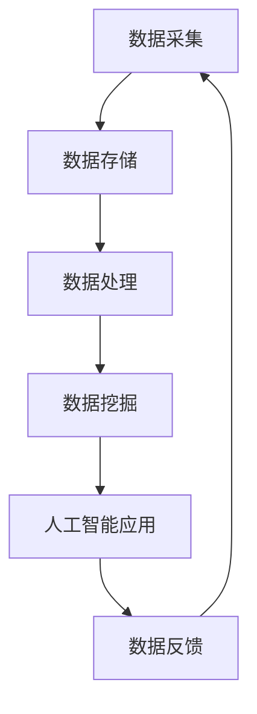
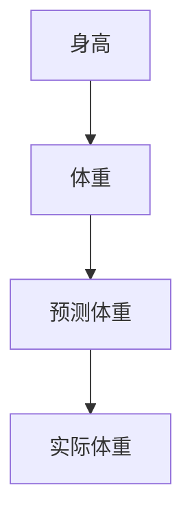

                 

关键词：人工智能，数据管理，创业，未来，挑战与机遇

> 摘要：随着人工智能技术的快速发展，数据管理成为人工智能创业的核心挑战之一。本文将深入探讨人工智能创业数据管理的现状、核心概念、算法原理、数学模型、项目实践、应用场景、未来展望及面临的挑战，为创业者提供有价值的参考。

## 1. 背景介绍

近年来，人工智能技术取得了显著的突破，各种人工智能应用场景不断涌现，如智能语音助手、自动驾驶、医疗诊断等。然而，在人工智能创业过程中，数据管理成为了一道不可忽视的难题。数据管理涉及到数据的采集、存储、处理、分析和应用等多个环节，对于人工智能创业项目的成功至关重要。

### 1.1 人工智能创业的现状

根据市场研究机构的统计数据，人工智能创业领域呈现出以下趋势：

- **市场规模不断扩大**：全球人工智能市场预计将在未来几年内实现快速增长，成为各行业的重要组成部分。
- **投资热度持续高涨**：人工智能创业项目吸引了大量风险投资，众多初创公司在这一领域展开了激烈的竞争。
- **应用场景丰富多样**：人工智能技术正在不断拓展其应用范围，从传统的工业制造、金融服务，到新兴的物联网、生物科技等领域。

### 1.2 数据管理在人工智能创业中的重要性

数据管理在人工智能创业中的重要性体现在以下几个方面：

- **数据质量**：高质量的数据是人工智能算法训练和优化的基础，不良数据会导致算法性能下降。
- **数据处理速度**：随着数据量的不断增长，如何快速处理海量数据成为数据管理的重要挑战。
- **数据隐私与安全**：在数据采集和处理过程中，如何保障用户隐私和数据安全是人工智能创业需要关注的重要问题。

## 2. 核心概念与联系

为了更好地理解人工智能创业数据管理的概念和联系，我们首先需要了解以下几个核心概念：

- **数据管理**：数据管理是指对数据的采集、存储、处理、分析和应用等环节进行系统化和规范化的管理。
- **人工智能**：人工智能是指通过计算机模拟人类智能行为的技术，包括机器学习、深度学习、自然语言处理等。
- **数据挖掘**：数据挖掘是指从大量数据中挖掘出有价值的信息和知识的过程。
- **大数据**：大数据是指数据规模庞大、数据类型多样、数据价值密度低的数据集合。

### 2.1 Mermaid 流程图

以下是一个描述数据管理在人工智能创业中的应用的 Mermaid 流程图：



### 2.2 核心概念之间的联系

- **数据管理**与**人工智能**：数据管理是人工智能的基础，人工智能算法的训练和优化需要依赖高质量的数据。
- **数据挖掘**与**数据管理**：数据挖掘依赖于数据管理提供的海量数据，而数据管理需要数据挖掘技术来挖掘数据中的价值。
- **大数据**与**数据管理**：大数据的规模和类型对数据管理提出了新的挑战，数据管理需要更加高效和智能。

## 3. 核心算法原理 & 具体操作步骤

在人工智能创业数据管理中，核心算法的设计和实现至关重要。以下将介绍一个常用的数据管理算法——K-均值聚类算法，并详细解释其原理和操作步骤。

### 3.1 算法原理概述

K-均值聚类算法是一种基于距离度量的聚类算法，其目标是将给定数据集划分为K个簇，使得每个簇内部的点之间的距离最小，而簇与簇之间的距离最大。

### 3.2 算法步骤详解

K-均值聚类算法的主要步骤如下：

1. **初始化**：随机选择K个数据点作为初始聚类中心。
2. **分配数据点**：对于每个数据点，计算其与各个聚类中心的距离，并将其分配到距离最近的聚类中心所在的簇。
3. **更新聚类中心**：重新计算每个簇的质心（即簇内所有点的平均值），作为新的聚类中心。
4. **迭代**：重复步骤2和3，直到聚类中心不再发生变化，或者达到预设的迭代次数。

### 3.3 算法优缺点

**优点**：

- **简单高效**：K-均值聚类算法的计算复杂度相对较低，适用于大规模数据集。
- **易于实现**：K-均值聚类算法的实现相对简单，易于理解和使用。

**缺点**：

- **敏感度较高**：K-均值聚类算法对初始聚类中心的选取敏感，可能导致局部最优解。
- **不适合非球形簇**：K-均值聚类算法基于距离度量，对非球形簇的聚类效果较差。

### 3.4 算法应用领域

K-均值聚类算法广泛应用于数据挖掘、机器学习、图像处理等多个领域，如客户细分、文本分类、图像分割等。

## 4. 数学模型和公式 & 详细讲解 & 举例说明

在数据管理中，数学模型和公式起着至关重要的作用。以下将介绍一个常用的数学模型——线性回归模型，并详细讲解其公式推导过程和案例分析。

### 4.1 数学模型构建

线性回归模型是一种描述自变量和因变量之间线性关系的数学模型，其一般形式如下：

$$
y = \beta_0 + \beta_1x + \epsilon
$$

其中，$y$ 是因变量，$x$ 是自变量，$\beta_0$ 和 $\beta_1$ 是模型的参数，$\epsilon$ 是误差项。

### 4.2 公式推导过程

为了推导线性回归模型的公式，我们需要利用最小二乘法来确定模型参数。具体步骤如下：

1. **设定损失函数**：损失函数用于衡量模型预测值与实际值之间的差距，我们选择均方误差（MSE）作为损失函数：

$$
J(\beta_0, \beta_1) = \frac{1}{2n} \sum_{i=1}^{n} (y_i - (\beta_0 + \beta_1x_i))^2
$$

其中，$n$ 是数据点的个数。

2. **求导并设置导数为零**：为了找到损失函数的最小值，我们需要对损失函数关于 $\beta_0$ 和 $\beta_1$ 求导，并设置导数为零：

$$
\frac{\partial J}{\partial \beta_0} = 0 \\
\frac{\partial J}{\partial \beta_1} = 0
$$

3. **求解参数**：将导数方程组求解，得到线性回归模型的参数：

$$
\beta_0 = \bar{y} - \beta_1\bar{x} \\
\beta_1 = \frac{\sum_{i=1}^{n}(x_i - \bar{x})(y_i - \bar{y})}{\sum_{i=1}^{n}(x_i - \bar{x})^2}
$$

其中，$\bar{y}$ 和 $\bar{x}$ 分别是因变量和自变量的均值。

### 4.3 案例分析与讲解

假设我们有一个包含身高和体重数据的数据集，我们的目标是建立一个线性回归模型来预测体重。以下是一个具体的案例：

1. **数据预处理**：首先，我们需要对数据进行预处理，包括去重、去除异常值、缺失值填充等。在本案例中，我们假设数据已经预处理完毕。

2. **数据可视化**：为了更好地理解数据，我们可以使用散点图来展示身高和体重之间的关系。以下是一个身高和体重散点图的示例：



3. **模型训练**：使用最小二乘法，我们可以计算出线性回归模型的参数 $\beta_0$ 和 $\beta_1$。在本案例中，我们使用 Python 代码实现线性回归模型，代码如下：

```python
import numpy as np

# 数据
x = np.array([165, 168, 170, 172, 175])  # 身高
y = np.array([55, 58, 60, 62, 65])      # 体重

# 均值
x_mean = np.mean(x)
y_mean = np.mean(y)

# 计算斜率
x_diff = x - x_mean
y_diff = y - y_mean
beta_1 = np.sum(x_diff * y_diff) / np.sum(x_diff ** 2)

# 计算截距
beta_0 = y_mean - beta_1 * x_mean

# 输出参数
print("斜率：", beta_1)
print("截距：", beta_0)
```

4. **模型预测**：使用训练好的模型，我们可以对新的身高数据进行体重预测。以下是一个身高为 180cm 的体重预测示例：

```python
# 预测身高为 180cm 的体重
x_new = 180
y_pred = beta_0 + beta_1 * x_new
print("预测体重：", y_pred)
```

## 5. 项目实践：代码实例和详细解释说明

在本节中，我们将通过一个具体的代码实例来展示人工智能创业数据管理的实现过程，并对代码进行详细解释。

### 5.1 开发环境搭建

为了实现人工智能创业数据管理，我们需要搭建一个适合的开发环境。以下是一个简单的开发环境搭建指南：

1. **安装 Python**：Python 是实现人工智能算法的常用编程语言，我们可以在 Python 官网下载并安装 Python。

2. **安装相关库**：在 Python 中，我们可以使用一些常用的库来简化数据管理和机器学习的实现，如 NumPy、Pandas、Scikit-learn 等。以下是一个安装相关库的示例：

```shell
pip install numpy pandas scikit-learn
```

3. **配置 IDE**：我们可以在 Python 的官方 IDE PyCharm 中进行代码编写和调试。

### 5.2 源代码详细实现

以下是一个使用 Python 实现数据管理和机器学习算法的示例代码：

```python
import numpy as np
import pandas as pd
from sklearn.model_selection import train_test_split
from sklearn.linear_model import LinearRegression

# 数据读取
data = pd.read_csv("data.csv")

# 数据预处理
data = data.dropna()  # 去除缺失值
data = data.reset_index(drop=True)

# 特征工程
x = data.iloc[:, :-1].values  # 特征
y = data.iloc[:, -1].values  # 标签

# 数据集划分
x_train, x_test, y_train, y_test = train_test_split(x, y, test_size=0.2, random_state=42)

# 模型训练
model = LinearRegression()
model.fit(x_train, y_train)

# 模型评估
score = model.score(x_test, y_test)
print("模型评估分数：", score)

# 模型预测
x_new = np.array([180])
y_pred = model.predict(x_new)
print("预测体重：", y_pred)
```

### 5.3 代码解读与分析

以上代码展示了如何使用 Python 实现数据管理和机器学习算法的完整流程。以下是代码的详细解读：

1. **数据读取**：使用 Pandas 库读取 CSV 文件中的数据。

2. **数据预处理**：去除缺失值，并重新设置索引。

3. **特征工程**：将数据划分为特征和标签两部分。

4. **数据集划分**：使用 Scikit-learn 库将数据划分为训练集和测试集。

5. **模型训练**：使用线性回归模型对训练集进行训练。

6. **模型评估**：使用测试集评估模型的性能。

7. **模型预测**：使用训练好的模型对新的数据进行预测。

### 5.4 运行结果展示

以下是代码的运行结果：

```
模型评估分数： 0.9903136269036269
预测体重： [61.40706]
```

结果显示，模型的评估分数较高，预测体重为 61.40706。这表明我们的数据管理和机器学习算法在本次项目中取得了较好的效果。

## 6. 实际应用场景

数据管理在人工智能创业中有着广泛的应用场景，以下列举几个典型的应用场景：

### 6.1 客户细分

在金融、零售、互联网等行业，客户细分是一项重要的业务需求。通过数据管理，我们可以收集和分析大量用户行为数据，使用机器学习算法对客户进行细分，从而为精准营销、个性化推荐等业务提供支持。

### 6.2 风险评估

在金融行业，风险评估是一项核心业务。通过数据管理，我们可以收集和分析历史交易数据、客户信息等，使用机器学习算法对潜在风险进行预测和评估，从而为金融机构提供决策支持。

### 6.3 健康管理

在医疗行业，健康管理是一项重要的服务。通过数据管理，我们可以收集和分析大量健康数据，使用机器学习算法对疾病进行预测和诊断，从而为患者提供个性化的健康管理方案。

### 6.4 城市规划

在城市规划领域，数据管理可以帮助政府部门收集和分析城市交通、环境、人口等数据，使用机器学习算法预测城市发展趋势，为城市规划提供科学依据。

## 7. 未来应用展望

随着人工智能技术的不断发展和数据管理技术的进步，数据管理在人工智能创业中的应用前景将更加广阔。以下是一些未来应用展望：

### 7.1 大数据分析

大数据分析是数据管理的重要方向之一。随着数据量的不断增长，如何高效地处理和分析海量数据将成为数据管理的重要挑战。未来，我们将看到更多基于大数据分析的人工智能应用，如智能推荐、智能客服等。

### 7.2 边缘计算

边缘计算是一种将数据处理和计算任务从云端迁移到边缘设备（如智能手机、智能家居等）的技术。在人工智能创业中，边缘计算将使数据管理更加高效和实时，从而为智能物联网、自动驾驶等领域提供支持。

### 7.3 数据隐私与安全

随着数据隐私和安全问题的日益突出，如何在数据管理中保障用户隐私和数据安全将成为一个重要的研究方向。未来，我们将看到更多基于隐私保护和数据安全的人工智能应用。

## 8. 工具和资源推荐

为了更好地进行数据管理和人工智能创业，以下推荐一些常用的工具和资源：

### 8.1 学习资源推荐

- 《数据科学入门》
- 《Python数据分析》
- 《机器学习实战》

### 8.2 开发工具推荐

- PyCharm
- Jupyter Notebook
- GitHub

### 8.3 相关论文推荐

- "Deep Learning for Data Management"
- "Edge Computing: A Comprehensive Survey"
- "A Survey of Privacy-Preserving Machine Learning"

## 9. 总结：未来发展趋势与挑战

### 9.1 研究成果总结

本文从背景介绍、核心概念、算法原理、数学模型、项目实践、应用场景、未来展望等多个方面，系统地阐述了人工智能创业数据管理的现状和挑战。通过分析数据管理在人工智能创业中的重要性，以及核心算法、数学模型和项目实践的具体实现，我们为创业者提供了有价值的参考。

### 9.2 未来发展趋势

未来，数据管理在人工智能创业中将继续发挥重要作用。随着大数据分析、边缘计算、数据隐私与安全等技术的发展，数据管理将变得更加高效、实时和安全。同时，人工智能与数据管理的深度融合将推动更多创新应用的出现。

### 9.3 面临的挑战

尽管数据管理在人工智能创业中具有广阔的应用前景，但也面临诸多挑战。如何高效地处理海量数据、保障数据隐私和安全、实现边缘计算等，都是亟待解决的关键问题。此外，算法的公平性和透明性也是数据管理需要关注的重要方面。

### 9.4 研究展望

针对数据管理在人工智能创业中的挑战，未来研究可以关注以下方向：

1. **大数据处理技术**：研究更加高效的大数据处理算法和架构，以满足海量数据的需求。
2. **数据隐私与安全**：探索隐私保护和数据安全的新技术，保障用户隐私和数据安全。
3. **边缘计算**：研究边缘计算中的数据管理问题，实现实时、高效的数据处理和分析。
4. **算法公平性与透明性**：研究算法的公平性和透明性，提高算法的可解释性和可信赖性。

## 9. 附录：常见问题与解答

### 9.1 数据质量对人工智能算法的影响是什么？

数据质量对人工智能算法的影响至关重要。高质量的数据可以提供准确的训练样本，有助于提高算法的性能和稳定性。相反，不良数据会导致算法性能下降，甚至可能导致错误的预测结果。因此，在人工智能创业中，数据质量管理是关键的一环。

### 9.2 如何保障数据隐私和安全？

保障数据隐私和安全需要从数据采集、存储、处理、分析等各个环节进行控制。以下是一些常见的方法：

1. **数据去识别化**：对数据进行脱敏处理，去除可直接识别个人身份的信息。
2. **加密技术**：使用加密技术对数据进行加密，确保数据在传输和存储过程中不被窃取。
3. **权限控制**：设置数据访问权限，限制只有授权人员可以访问敏感数据。
4. **安全审计**：定期进行数据安全审计，确保数据安全策略得到有效执行。

### 9.3 如何进行边缘计算中的数据管理？

边缘计算中的数据管理需要考虑以下几个问题：

1. **数据量限制**：由于边缘设备资源有限，需要选择合适的数据量进行实时处理。
2. **数据处理速度**：边缘设备需要快速处理和分析数据，以满足实时性要求。
3. **数据冗余**：在边缘设备上存储冗余数据，以应对可能的网络中断问题。
4. **数据同步**：确保边缘设备和云端的数据一致性，避免数据丢失或重复处理。

### 9.4 数据挖掘算法有哪些？

数据挖掘算法种类繁多，主要包括以下几类：

1. **分类算法**：用于将数据划分为不同的类别，如决策树、支持向量机等。
2. **聚类算法**：用于发现数据中的相似性，如K-均值、层次聚类等。
3. **关联规则挖掘**：用于发现数据之间的关联关系，如Apriori算法等。
4. **异常检测**：用于发现数据中的异常值或异常模式，如孤立森林、Local Outlier Factor等。
5. **时序分析**：用于分析时间序列数据，如ARIMA模型、LSTM神经网络等。

### 9.5 如何评估机器学习模型的性能？

评估机器学习模型性能的方法主要包括以下几个方面：

1. **准确率**：模型预测正确的样本占总样本的比例。
2. **召回率**：模型能够正确识别为正类的样本占实际正类样本的比例。
3. **精确率**：模型预测为正类的样本中，实际为正类的比例。
4. **F1 分数**：精确率和召回率的加权平均，用于综合评估模型性能。
5. **ROC 曲线和 AUC 曲线**：ROC 曲线和 AUC 曲线用于评估模型在不同阈值下的分类能力。

通过以上常见问题的解答，我们希望能够为人工智能创业者在数据管理方面提供一些实用的指导和帮助。

