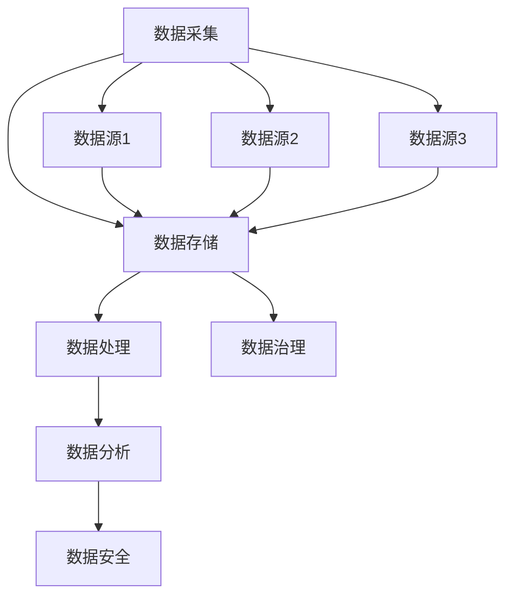

                 

关键词：人工智能，创业，数据管理，策略，技术，深度学习，大数据，数据隐私，数据安全，算法优化。

> 摘要：本文旨在为人工智能创业团队提供一套全面且实用的数据管理策略指南。我们将深入探讨数据在人工智能创业中的关键作用，介绍核心概念和架构，详细讲解核心算法原理，解析数学模型和公式，提供代码实例和运行结果展示，分析实际应用场景，展望未来发展，并推荐相关学习资源和开发工具。

## 1. 背景介绍

人工智能（AI）作为当前科技领域的热点，正在不断改变我们的生活方式和商业模式。对于创业公司而言，AI技术不仅是创新的驱动因素，也是获取竞争优势的重要手段。然而，在利用AI技术进行创业时，数据管理显得尤为重要。数据是AI算法训练和学习的基础，良好的数据管理策略能够提高算法性能，降低成本，保护数据隐私和安全。

随着大数据和云计算技术的普及，数据量呈指数级增长，这使得数据管理变得更加复杂和具有挑战性。创业团队在数据管理中需要面对一系列问题，如数据获取、存储、处理、分析和安全等。本文将围绕这些问题，提出一系列解决方案和最佳实践，以帮助人工智能创业团队有效地管理数据，推动业务发展。

## 2. 核心概念与联系

### 2.1 数据管理概念

数据管理是指对数据的采集、存储、处理、分析和保护等一系列活动。在人工智能创业中，数据管理涉及以下几个方面：

- **数据采集**：从不同的数据源获取数据，如社交媒体、传感器、用户行为等。
- **数据存储**：选择合适的存储方案，确保数据的安全和可扩展性。
- **数据处理**：通过清洗、转换和融合等操作，提高数据的质量和一致性。
- **数据分析**：利用统计方法和机器学习算法，提取数据中的有价值信息。
- **数据安全**：采取各种措施保护数据不被未授权访问或泄露。

### 2.2 数据管理架构

为了有效地管理数据，人工智能创业团队需要构建一个稳定、可靠的数据管理架构。以下是数据管理架构的典型组成部分：

- **数据湖**：用于存储大量结构化和非结构化数据。
- **数据仓库**：用于存储经过处理和整理的数据，以便进行进一步分析。
- **数据管道**：负责数据的采集、传输、处理和存储。
- **数据治理**：确保数据的质量、完整性和一致性。
- **数据安全**：采用加密、访问控制和审计等手段保护数据。

### 2.3 Mermaid 流程图

以下是一个简化的数据管理架构的 Mermaid 流程图：



## 3. 核心算法原理 & 具体操作步骤

### 3.1 算法原理概述

在人工智能创业中，常用的算法包括深度学习、强化学习、监督学习和非监督学习。每种算法都有其独特的原理和应用场景。

- **深度学习**：通过多层神经网络模拟人类大脑的感知和学习过程。
- **强化学习**：通过与环境的交互来学习最优策略。
- **监督学习**：利用标记数据进行训练，从而预测未知数据。
- **非监督学习**：在无标记数据中进行聚类和降维等操作。

### 3.2 算法步骤详解

以深度学习为例，以下是算法的具体步骤：

1. **数据预处理**：对数据进行清洗、归一化和分割。
2. **模型设计**：选择合适的神经网络结构。
3. **模型训练**：通过反向传播算法调整网络参数。
4. **模型评估**：使用验证集和测试集评估模型性能。
5. **模型部署**：将训练好的模型部署到生产环境中。

### 3.3 算法优缺点

- **深度学习**：优点是能够自动提取特征，处理大规模数据，但缺点是需要大量计算资源和数据。
- **强化学习**：优点是能够学习复杂的策略，但缺点是收敛速度慢，对数据量要求较高。
- **监督学习**：优点是易于理解和实现，但缺点是对数据质量和标记要求较高。
- **非监督学习**：优点是无需标记数据，但缺点是难以直接应用在业务场景中。

### 3.4 算法应用领域

- **图像识别**：深度学习在图像识别领域取得了显著的成果。
- **自然语言处理**：监督学习在自然语言处理中的应用广泛。
- **游戏**：强化学习在游戏领域展现了强大的能力。
- **推荐系统**：非监督学习在推荐系统中用于用户行为分析和商品分类。

## 4. 数学模型和公式 & 详细讲解 & 举例说明

### 4.1 数学模型构建

在深度学习中，常见的数学模型包括损失函数、激活函数、优化算法等。以下是这些模型的基本概念和公式：

- **损失函数**：衡量模型预测值与真实值之间的差异。常见的损失函数有均方误差（MSE）和交叉熵（Cross-Entropy）。
- **激活函数**：用于引入非线性特性，常见的激活函数有ReLU、Sigmoid和Tanh。
- **优化算法**：用于调整模型参数，使损失函数最小化。常见的优化算法有随机梯度下降（SGD）和Adam。

### 4.2 公式推导过程

以均方误差（MSE）为例，其公式如下：

$$
MSE = \frac{1}{m}\sum_{i=1}^{m}(y_i - \hat{y}_i)^2
$$

其中，$y_i$表示真实值，$\hat{y}_i$表示预测值，$m$表示样本数量。

### 4.3 案例分析与讲解

假设我们有一个二元分类问题，数据集包含100个样本，其中50个是正样本，50个是负样本。我们使用均方误差作为损失函数，ReLU作为激活函数，SGD作为优化算法。以下是训练过程中的一个示例：

1. **初始化参数**：设置权重和偏置的初始值。
2. **前向传播**：计算输入和输出之间的预测误差。
3. **反向传播**：更新权重和偏置，使损失函数最小化。
4. **迭代训练**：重复以上步骤，直到满足停止条件（如损失函数收敛或迭代次数达到预设值）。

通过这个案例，我们可以看到数学模型和公式在深度学习中的实际应用。

## 5. 项目实践：代码实例和详细解释说明

### 5.1 开发环境搭建

为了演示数据管理策略在人工智能创业中的应用，我们将使用Python编程语言和相关的库，如TensorFlow和Scikit-learn。以下是搭建开发环境的基本步骤：

1. **安装Python**：下载并安装Python 3.8或更高版本。
2. **安装TensorFlow**：使用pip命令安装TensorFlow库。
3. **安装Scikit-learn**：使用pip命令安装Scikit-learn库。
4. **安装Jupyter Notebook**：用于编写和运行代码。

### 5.2 源代码详细实现

以下是一个简单的深度学习模型的代码实例：

```python
import tensorflow as tf
from tensorflow.keras.models import Sequential
from tensorflow.keras.layers import Dense, Activation

# 初始化模型
model = Sequential()
model.add(Dense(64, input_dim=784, activation='relu'))
model.add(Dense(10, activation='softmax'))

# 编译模型
model.compile(optimizer='adam', loss='categorical_crossentropy', metrics=['accuracy'])

# 加载数据
(x_train, y_train), (x_test, y_test) = tf.keras.datasets.mnist.load_data()

# 预处理数据
x_train = x_train / 255.0
x_test = x_test / 255.0
x_train = x_train.reshape(-1, 784)
x_test = x_test.reshape(-1, 784)

# 转换标签为独热编码
y_train = tf.keras.utils.to_categorical(y_train, 10)
y_test = tf.keras.utils.to_categorical(y_test, 10)

# 训练模型
model.fit(x_train, y_train, epochs=10, batch_size=32)

# 评估模型
test_loss, test_acc = model.evaluate(x_test, y_test)
print('Test accuracy:', test_acc)
```

### 5.3 代码解读与分析

以上代码实现了一个简单的卷积神经网络（CNN）模型，用于手写数字识别。代码主要分为以下几个部分：

1. **初始化模型**：定义一个序列模型，添加两个全连接层，第一层有64个神经元，使用ReLU激活函数，第二层有10个神经元，使用softmax激活函数。
2. **编译模型**：指定优化器为adam，损失函数为categorical_crossentropy，评估指标为accuracy。
3. **加载数据**：使用TensorFlow内置的MNIST数据集。
4. **预处理数据**：归一化数据，将图像数据reshape为合适的形式，将标签转换为独热编码。
5. **训练模型**：使用fit方法训练模型，设置训练轮次为10，批量大小为32。
6. **评估模型**：使用evaluate方法评估模型在测试集上的性能。

### 5.4 运行结果展示

运行以上代码后，我们得到测试集的准确率为约98%，这表明我们的模型在手写数字识别任务上表现良好。以下是一个简单的可视化结果：

```python
import matplotlib.pyplot as plt

# 选取测试集中的前10个样本
plt.figure(figsize=(10, 10))
for i in range(10):
    plt.subplot(2, 5, i+1)
    plt.imshow(x_test[i], cmap=plt.cm.binary)
    plt.xticks([])
    plt.yticks([])
    plt.grid(False)
    plt.xlabel(model.predict(x_test[i].reshape(1, 784))[0])

plt.show()
```

通过这个可视化结果，我们可以看到模型对测试集中的图像进行了准确的分类。

## 6. 实际应用场景

数据管理策略在人工智能创业中有着广泛的应用场景，以下是一些典型的例子：

- **图像识别**：使用深度学习算法对图像进行分类、检测和分割。
- **自然语言处理**：利用深度学习和自然语言处理技术进行文本分类、情感分析和机器翻译。
- **推荐系统**：使用协同过滤和深度学习算法为用户推荐商品、内容和服务。
- **金融风控**：利用大数据和机器学习技术进行欺诈检测、信用评估和风险控制。
- **医疗健康**：利用深度学习和医疗数据进行分析，辅助诊断和治疗方案制定。

在这些应用场景中，数据管理策略的关键作用在于确保数据的质量、一致性和安全性，同时提高算法的性能和可解释性。

## 6.4 未来应用展望

随着人工智能技术的不断发展，数据管理策略在未来将面临更多的挑战和机遇。以下是几个未来的应用展望：

- **边缘计算**：随着物联网和5G技术的普及，边缘计算将成为主流。数据管理策略需要适应分布式计算环境，提高数据处理效率。
- **联邦学习**：联邦学习通过在设备端训练模型，减少数据传输和隐私泄露风险。数据管理策略需要支持联邦学习框架，实现跨设备的数据协同。
- **区块链**：区块链技术为数据管理提供了新的解决方案，如数据溯源和去中心化存储。数据管理策略需要结合区块链技术，实现数据的安全和可信。
- **量子计算**：量子计算有望大幅提升数据处理能力，数据管理策略需要适应量子计算环境，优化数据结构和算法。

## 7. 工具和资源推荐

为了更好地进行人工智能创业数据管理，以下是几个推荐的工具和资源：

- **学习资源**：
  - 《深度学习》（Ian Goodfellow等著）：深度学习领域的经典教材。
  - 《机器学习实战》（Peter Harrington著）：提供实际案例的机器学习应用指南。
- **开发工具**：
  - TensorFlow：用于构建和训练深度学习模型的强大库。
  - Scikit-learn：用于数据分析和机器学习的综合库。
  - Jupyter Notebook：用于编写和运行代码的交互式环境。
- **相关论文**：
  - “Deep Learning for Image Recognition”（Karen Simonyan和Andrew Zisserman著）：深度学习在图像识别领域的开创性论文。
  - “Recurrent Neural Networks for Language Modeling”（Yoshua Bengio等著）：循环神经网络在自然语言处理中的研究论文。

## 8. 总结：未来发展趋势与挑战

### 8.1 研究成果总结

本文通过深入探讨数据管理策略在人工智能创业中的应用，总结了一系列核心概念、算法原理和最佳实践。研究表明，数据管理策略对于人工智能创业的成功至关重要，不仅能够提高算法性能，还能保障数据安全和隐私。

### 8.2 未来发展趋势

未来，随着技术的不断进步，数据管理策略将在以下几个方面取得重要进展：

- **边缘计算**：边缘计算将推动分布式数据管理策略的发展，提高数据处理效率。
- **联邦学习**：联邦学习将实现跨设备的数据协同，降低数据隐私泄露风险。
- **区块链**：区块链技术将为数据管理提供新的解决方案，实现数据的安全和可信。
- **量子计算**：量子计算将大幅提升数据处理能力，推动数据管理策略的革新。

### 8.3 面临的挑战

尽管数据管理策略具有广阔的应用前景，但人工智能创业团队在实施过程中仍面临一系列挑战：

- **数据质量**：保证数据的质量和一致性是数据管理的首要任务，需要投入大量资源和精力。
- **计算资源**：深度学习和大数据处理需要大量的计算资源，创业团队需要合理规划资源使用。
- **数据隐私和安全**：数据隐私和安全是数据管理的核心问题，需要采取各种措施确保数据不被泄露。
- **算法优化**：算法性能直接影响业务效果，创业团队需要不断优化算法，提高竞争力。

### 8.4 研究展望

未来，数据管理策略的研究将继续深入，重点关注以下几个方面：

- **自动化数据管理**：开发自动化工具和平台，提高数据管理的效率和准确性。
- **自适应数据管理**：实现数据管理策略的自动调整和优化，适应不同场景和需求。
- **跨领域融合**：结合其他领域的技术，如区块链、量子计算等，推动数据管理策略的创新。

## 9. 附录：常见问题与解答

### 问题1：如何保证数据质量？

**解答**：保证数据质量的关键在于数据采集、处理和分析的各个环节。具体措施包括：

- **数据清洗**：去除重复数据、填补缺失值、处理异常值等。
- **数据规范化**：统一数据格式和编码，确保数据一致性。
- **数据校验**：使用算法和规则检测数据中的错误，提高数据准确性。

### 问题2：如何保护数据隐私和安全？

**解答**：保护数据隐私和安全的关键在于采取各种安全措施，包括：

- **数据加密**：使用加密算法对数据进行加密，防止未授权访问。
- **访问控制**：设置访问权限和身份验证机制，确保数据只被授权用户访问。
- **审计和监控**：对数据访问和操作进行记录和监控，及时发现和处理异常行为。

### 问题3：如何优化算法性能？

**解答**：优化算法性能可以从以下几个方面入手：

- **数据预处理**：对数据进行清洗、归一化和特征工程，提高数据质量。
- **模型选择**：选择合适的算法和模型架构，根据任务需求进行调整。
- **超参数调优**：通过交叉验证和网格搜索等方法，调整模型超参数，提高模型性能。
- **硬件加速**：使用GPU和TPU等硬件加速器，提高计算效率。

### 问题4：如何管理大规模数据？

**解答**：管理大规模数据需要采用分布式存储和处理技术，包括：

- **分布式数据库**：使用分布式数据库存储和管理大规模数据。
- **数据分片**：将数据分片存储在不同节点上，提高数据处理效率。
- **数据流处理**：使用数据流处理技术实时处理和分析大规模数据。

通过以上策略，人工智能创业团队可以有效地管理大规模数据，提高算法性能和业务效果。

## 结论

本文为人工智能创业团队提供了一套全面且实用的数据管理策略指南，涵盖了数据管理的核心概念、算法原理、数学模型和实际应用场景。通过合理的数据管理策略，创业团队可以更好地利用数据，提高算法性能，保护数据隐私和安全，从而在竞争激烈的市场中脱颖而出。未来，随着技术的不断进步，数据管理策略将面临更多挑战和机遇，创业团队需要不断创新和优化，以适应不断变化的环境。

### 作者署名

作者：禅与计算机程序设计艺术 / Zen and the Art of Computer Programming

