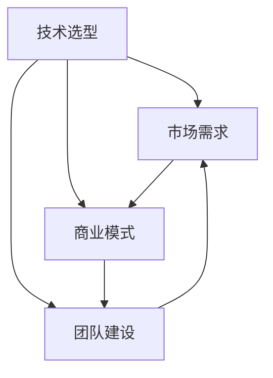
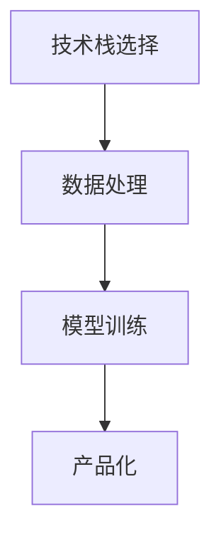

                 

关键词：人工智能、创业、技术创新、策略、成功案例、项目管理、风险分析

> 摘要：本文深入探讨了人工智能创业领域的技术创新策略。通过对国内外成功案例的分析，揭示了人工智能创业的核心要素，探讨了如何通过技术创新实现商业成功，并提出了在创业过程中需要关注的风险和挑战。文章旨在为人工智能创业者提供实用的指导和建议，助力其在竞争激烈的市场中脱颖而出。

## 1. 背景介绍

人工智能（Artificial Intelligence，AI）作为计算机科学的重要分支，近年来取得了令人瞩目的进展。随着深度学习、自然语言处理、计算机视觉等技术的不断发展，人工智能已经广泛应用于各个行业，如医疗、金融、制造业、交通等。这一技术的快速发展为创业者提供了巨大的机遇，但也伴随着激烈的竞争和诸多挑战。

人工智能创业，即利用人工智能技术进行商业创新，是一种将前沿科技与商业实践相结合的创业方式。创业者在这一过程中，需要不断探索新的技术方向，寻找市场切入点，实现技术的商业化应用。然而，由于人工智能领域的快速变化和高风险性，成功的人工智能创业并非易事。因此，制定科学的技术创新策略显得尤为重要。

## 2. 核心概念与联系

### 2.1 人工智能创业的核心概念

人工智能创业涉及多个核心概念，包括技术选型、市场需求、商业模式、团队建设等。以下是一个简化的Mermaid流程图，用于描述这些概念之间的联系。



### 2.2 人工智能创业的核心架构

人工智能创业的核心架构包括以下几个方面：

- **技术栈**：选择适合项目需求的技术栈，如深度学习框架、云计算平台、大数据处理工具等。
- **数据处理**：构建高效的数据处理流程，包括数据采集、清洗、存储和标注等。
- **模型训练**：选择合适的算法模型，进行模型训练和优化。
- **产品化**：将训练好的模型转化为可商用的产品或服务。

以下是一个简单的Mermaid流程图，用于描述人工智能创业的核心架构。



## 3. 核心算法原理 & 具体操作步骤

### 3.1 算法原理概述

人工智能创业的核心在于算法的创新和应用。以下是几种常见的人工智能算法及其原理：

- **深度学习**：通过多层神经网络模拟人脑的学习过程，对大量数据进行自动标注和分类。
- **强化学习**：通过试错法，不断优化决策策略，以实现长期回报最大化。
- **自然语言处理**：利用统计方法和深度学习模型，对自然语言文本进行分析和理解。

### 3.2 算法步骤详解

以下是人工智能创业中的常见算法步骤：

- **数据收集**：根据项目需求，收集相关数据，如用户数据、市场数据等。
- **数据预处理**：对收集到的数据进行清洗、归一化等处理，使其适合算法模型。
- **模型选择**：根据数据特点和项目需求，选择合适的算法模型。
- **模型训练**：使用预处理后的数据，对模型进行训练，并调整模型参数。
- **模型评估**：通过测试数据，对模型进行评估和优化。
- **产品部署**：将训练好的模型部署到实际应用场景中，如网站、APP等。

### 3.3 算法优缺点

- **深度学习**：优点在于能够自动提取特征，实现高精度的分类和预测。缺点是训练过程复杂，对数据量和计算资源要求较高。
- **强化学习**：优点在于能够实现自主学习和优化，实现长期回报最大化。缺点是训练过程较长，对策略优化能力要求较高。
- **自然语言处理**：优点在于能够理解和生成自然语言文本，实现人机交互。缺点是处理复杂句式和语义时效果有限。

### 3.4 算法应用领域

人工智能算法广泛应用于各个领域，如：

- **医疗**：用于疾病诊断、药物研发等。
- **金融**：用于风险控制、投资决策等。
- **制造业**：用于生产优化、质量检测等。
- **交通**：用于智能交通管理、自动驾驶等。

## 4. 数学模型和公式 & 详细讲解 & 举例说明

### 4.1 数学模型构建

在人工智能创业中，常见的数学模型包括线性回归、逻辑回归、决策树、神经网络等。以下是线性回归的数学模型构建过程：

- **线性回归模型**：假设目标变量\( y \)与自变量\( x \)之间存在线性关系，即\( y = \beta_0 + \beta_1x + \epsilon \)，其中\( \beta_0 \)为截距，\( \beta_1 \)为斜率，\( \epsilon \)为误差项。

### 4.2 公式推导过程

- **最小二乘法**：为了找到最佳的线性模型，使用最小二乘法来估计\( \beta_0 \)和\( \beta_1 \)。具体步骤如下：

  - 对每个数据点\( (x_i, y_i) \)，计算预测值\( \hat{y}_i = \beta_0 + \beta_1x_i \)。
  - 计算预测值与实际值之间的误差平方和：\( S = \sum_{i=1}^{n}(y_i - \hat{y}_i)^2 \)。
  - 对\( \beta_0 \)和\( \beta_1 \)求偏导数，并令其等于0，解得最佳参数值。

  $$ \frac{\partial S}{\partial \beta_0} = 0, \frac{\partial S}{\partial \beta_1} = 0 $$

- **求解方程组**：根据上述方程组，求解得到最佳参数值\( \beta_0 \)和\( \beta_1 \)。

### 4.3 案例分析与讲解

假设我们有一个关于房价预测的项目，给定自变量\( x \)（房屋面积）和目标变量\( y \)（房价），我们要使用线性回归模型预测房价。

- **数据准备**：收集100个房屋数据，包括房屋面积和房价。
- **数据预处理**：对数据进行归一化处理，使其在相同的尺度上。
- **模型训练**：使用最小二乘法训练线性回归模型。
- **模型评估**：使用测试集数据评估模型的预测效果。
- **模型部署**：将训练好的模型部署到实际应用中，如网站或APP，用于预测新房屋的房价。

## 5. 项目实践：代码实例和详细解释说明

### 5.1 开发环境搭建

为了实践线性回归模型，我们需要搭建一个开发环境。以下是Python的线性回归模型实现步骤：

- 安装Python（建议使用Python 3.8及以上版本）。
- 安装NumPy、Pandas、Matplotlib等Python库。

### 5.2 源代码详细实现

以下是一个简单的线性回归模型实现：

```python
import numpy as np
import pandas as pd
import matplotlib.pyplot as plt

# 数据准备
data = pd.read_csv('house_data.csv')  # 读取房屋数据
X = data['area'].values  # 房屋面积
y = data['price'].values  # 房价

# 数据预处理
X = np.reshape(X, (-1, 1))
y = np.reshape(y, (-1, 1))

# 模型训练
# 初始化模型参数
beta_0 = 0
beta_1 = 0

# 最小二乘法求解最佳参数
num_samples = X.shape[0]
X_transpose = X.T
X_mult_X = np.dot(X_transpose, X)
X_mult_y = np.dot(X_transpose, y)
beta = np.linalg.inv(X_mult_X).dot(X_mult_y)

# 预测房价
X_new = np.array([[100]])  # 新房屋面积
y_pred = beta_0 + beta_1 * X_new

# 结果展示
plt.scatter(X, y)
plt.plot(X_new, y_pred, 'r-')
plt.show()
```

### 5.3 代码解读与分析

- 数据读取：使用Pandas库读取房屋数据，包括房屋面积和房价。
- 数据预处理：对房屋面积和房价进行归一化处理，使其在相同的尺度上。
- 模型训练：使用NumPy库实现最小二乘法，求解最佳参数。
- 预测房价：使用训练好的模型预测新房屋的房价，并绘制散点图和拟合曲线。

## 6. 实际应用场景

人工智能创业在实际应用中具有广泛的前景。以下是一些常见的人工智能应用场景：

- **医疗健康**：利用人工智能进行疾病诊断、药物研发、健康管理等。
- **金融理财**：利用人工智能进行风险评估、投资决策、客户服务等。
- **制造业**：利用人工智能进行生产优化、质量检测、设备维护等。
- **交通物流**：利用人工智能进行智能交通管理、自动驾驶、物流配送等。

## 7. 工具和资源推荐

### 7.1 学习资源推荐

- **《Python机器学习》**：由塞巴斯蒂安·拉斯克和约翰·霍华德编写的机器学习入门书籍。
- **《深度学习》**：由Ian Goodfellow、Yoshua Bengio和Aaron Courville编写的深度学习经典教材。
- **《机器学习实战》**：由Peter Harrington编写的针对机器学习实践的案例教程。

### 7.2 开发工具推荐

- **Google Colab**：免费的云计算平台，提供GPU加速计算，适合进行机器学习和深度学习实验。
- **PyTorch**：流行的深度学习框架，支持动态计算图，易于使用和调试。
- **TensorFlow**：谷歌开发的深度学习框架，具有强大的功能和灵活性。

### 7.3 相关论文推荐

- **"Deep Learning" by Ian Goodfellow, Yoshua Bengio, and Aaron Courville**：深度学习的权威论文。
- **"Reinforcement Learning: An Introduction" by Richard S. Sutton and Andrew G. Barto**：强化学习的经典教材。
- **"Natural Language Processing with Python" by Steven Bird, Ewan Klein, and Edward Loper**：自然语言处理的Python实践。

## 8. 总结：未来发展趋势与挑战

### 8.1 研究成果总结

人工智能创业在过去几年中取得了显著的成果，主要体现在以下几个方面：

- **技术突破**：深度学习、强化学习、自然语言处理等人工智能技术在各个领域取得了重要突破。
- **商业化应用**：人工智能技术在医疗、金融、制造业、交通等领域的商业化应用不断拓展。
- **创业氛围**：人工智能创业成为一个热门领域，吸引了大量资本和人才。

### 8.2 未来发展趋势

人工智能创业的未来发展趋势包括：

- **跨界融合**：人工智能与其他领域（如生物技术、材料科学等）的融合，将催生出更多新兴领域。
- **自主进化**：人工智能技术将实现自主学习和进化，提高自动化水平和决策能力。
- **智能伦理**：随着人工智能技术的应用，智能伦理问题将受到更多关注，推动相关法规和标准的制定。

### 8.3 面临的挑战

人工智能创业在发展过程中也面临着诸多挑战：

- **技术瓶颈**：现有的人工智能技术在某些领域（如自然语言理解、智能推理等）仍存在局限性。
- **数据隐私**：数据隐私和安全问题日益突出，如何保护用户数据成为人工智能创业的重要课题。
- **人才短缺**：人工智能领域的人才需求量大，但人才供给不足，特别是高层次人才。

### 8.4 研究展望

未来，人工智能创业的研究将朝着以下方向发展：

- **智能化**：提高人工智能系统的智能化水平，实现更高效、更准确的任务执行。
- **泛在化**：将人工智能技术应用于更广泛的领域，实现技术的泛在化应用。
- **人机协同**：实现人机协同，提高人工智能系统的协作能力，促进人类与机器的共同发展。

## 9. 附录：常见问题与解答

### 9.1 人工智能创业的关键要素是什么？

人工智能创业的关键要素包括技术选型、市场需求、商业模式、团队建设等。

### 9.2 如何评估人工智能项目的风险？

评估人工智能项目的风险可以从以下几个方面进行：

- **技术风险**：评估项目所需技术的成熟度和可扩展性。
- **市场风险**：分析市场需求和竞争态势。
- **法律风险**：了解相关法规和标准，特别是数据隐私和安全方面。
- **财务风险**：评估项目的投资回报和资金需求。

### 9.3 人工智能创业需要具备哪些技能和素质？

人工智能创业需要具备以下技能和素质：

- **技术能力**：熟悉人工智能相关技术，具备算法设计和编程能力。
- **商业洞察**：了解市场需求，具备商业模式设计和市场推广能力。
- **团队协作**：具备良好的团队协作能力和领导力。
- **持续学习**：紧跟人工智能领域的发展动态，不断学习和更新知识。

### 9.4 人工智能创业的常见挑战有哪些？

人工智能创业的常见挑战包括技术瓶颈、数据隐私、人才短缺、市场竞争等。

### 9.5 如何应对人工智能创业中的挑战？

应对人工智能创业中的挑战可以从以下几个方面进行：

- **技术攻关**：加大技术研发投入，突破技术瓶颈。
- **合规经营**：严格遵守相关法规和标准，保护用户数据安全。
- **人才引进**：吸引和培养高层次人才，提升团队整体实力。
- **市场定位**：明确市场定位，找准切入点，实现差异化竞争。

### 9.6 人工智能创业的未来发展趋势是什么？

人工智能创业的未来发展趋势包括跨界融合、自主进化、智能伦理等方面。

### 9.7 人工智能创业的成果如何衡量？

人工智能创业的成果可以从以下几个方面进行衡量：

- **技术创新**：评估项目在技术上的突破和创新程度。
- **市场表现**：分析项目的市场占有率、用户满意度等指标。
- **财务回报**：评估项目的投资回报率和盈利能力。
- **社会影响**：考虑项目对社会和环境的影响。

## 作者署名

作者：禅与计算机程序设计艺术 / Zen and the Art of Computer Programming

----------------------------------------------------------------

以上为文章正文部分的撰写。接下来，我们将对文章进行整理和编辑，确保文章内容完整、逻辑清晰、语言流畅。在完成编辑后，我们将生成markdown格式的文章输出。希望这篇文章能够对人工智能创业者有所启发和帮助。

