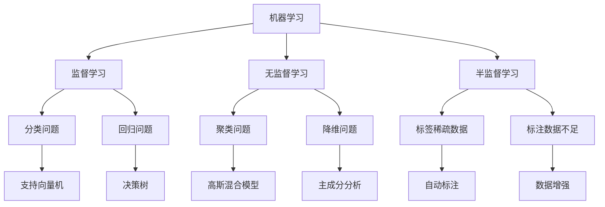
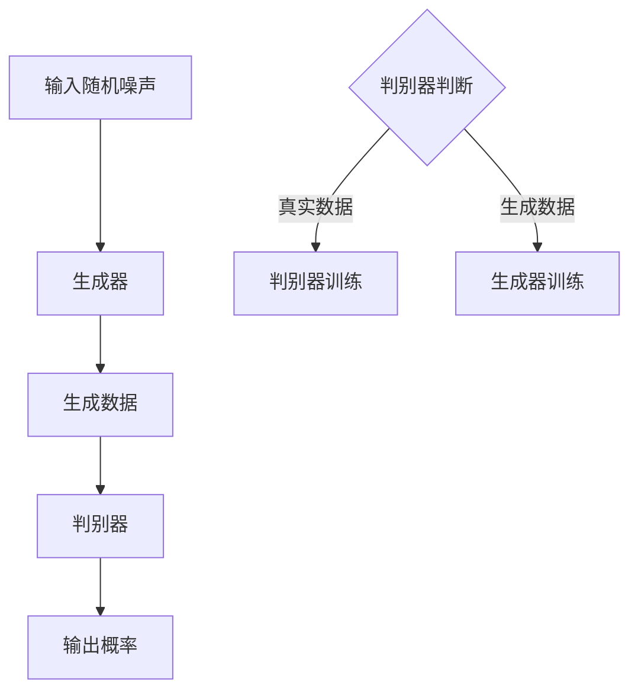

                 

 在这个数字时代，人工智能（AI）正迅速崛起，成为重塑各行各业的重要力量。然而，除了在数据分析、自动化和优化等方面展现出的巨大潜力外，AI的另一个令人着迷的领域是其创造力和表达能力的实现。本文将深入探讨人工智能的艺术潜能，以及如何通过AI技术激发创造力和进行艺术表达。

> 关键词：人工智能艺术、创造力和表达、机器学习、深度学习、生成对抗网络、创意算法

> 摘要：本文首先介绍人工智能艺术的概念及其发展背景，然后探讨AI如何实现创造力和艺术表达，接着分析相关算法原理，并通过具体实例展示AI在艺术创作中的应用。文章还将讨论AI艺术在各个领域的实际应用，最后展望AI艺术未来的发展趋势与挑战。

## 1. 背景介绍

人工智能艺术并非一个全新的概念。自计算机科学诞生以来，科学家们就一直在探索如何利用计算机生成艺术作品。早期的计算机图形学和算法为这一领域奠定了基础。然而，随着机器学习，尤其是深度学习技术的发展，AI艺术迎来了前所未有的繁荣。

在20世纪80年代，AI艺术家开始使用规则系统和遗传算法来创作音乐、绘画和设计作品。然而，这些方法往往受限于规则和参数的设置，难以实现真正的自主创作。随着深度学习的兴起，特别是生成对抗网络（GANs）的出现，AI艺术迈入了全新的阶段。

GANs由生成器（Generator）和判别器（Discriminator）两部分组成，通过相互博弈的过程，生成器不断学习生成越来越逼真的数据，而判别器则努力区分生成数据和真实数据。这种对抗训练机制使得GANs在图像生成、音频合成和视频制作等方面取得了显著成果。

## 2. 核心概念与联系

### 2.1. 机器学习与深度学习

机器学习是AI的核心技术之一，它使计算机系统能够从数据中学习并做出预测或决策。深度学习是机器学习的一个子领域，通过模仿人脑的神经网络结构，实现对复杂数据的处理和模式识别。

Mermaid 流程图：



### 2.2. 生成对抗网络（GANs）

生成对抗网络（GANs）是深度学习中的一种重要模型，它通过两个神经网络——生成器和判别器的相互博弈来生成高质量的数据。以下是GANs的基本架构：



## 3. 核心算法原理 & 具体操作步骤

### 3.1. 算法原理概述

GANs的工作原理基于一个简单的概念：生成器和判别器进行对抗训练。生成器的目标是生成逼真的数据，而判别器的目标是准确区分真实数据和生成数据。通过不断的迭代，生成器的生成质量会逐渐提高，判别器的辨别能力也会增强。

### 3.2. 算法步骤详解

1. **初始化**：初始化生成器和判别器网络，通常使用随机权重。
2. **生成数据**：生成器接收到随机噪声后，生成一组数据。
3. **判别**：判别器将生成数据和真实数据进行对比，输出一个概率值，表示其认为这是真实数据还是生成数据的置信度。
4. **训练**：生成器和判别器分别根据自己的损失函数进行更新，生成器尝试生成更真实的数据，判别器努力提高辨别能力。
5. **迭代**：重复上述步骤，直到生成器生成的数据足够逼真，判别器难以区分。

### 3.3. 算法优缺点

**优点**：
- 能够生成高质量的数据，如图像、音频和视频。
- 不需要标注数据，能够从无监督学习中学习。
- 适用于多种数据类型，如文本、图像和音频。

**缺点**：
- 训练过程不稳定，容易出现模式崩溃等问题。
- 需要大量计算资源和时间。

### 3.4. 算法应用领域

GANs在图像生成、自然语言处理、医学影像重建、游戏开发等领域有广泛应用。例如，在图像生成方面，GANs可以用于人脸生成、艺术风格迁移和图像修复等任务。

## 4. 数学模型和公式 & 详细讲解 & 举例说明

### 4.1. 数学模型构建

GANs的数学模型主要包括生成器和判别器的损失函数。

生成器的损失函数通常定义为：

$$ L_G = -\log(D(G(z)) $$

其中，$G(z)$是生成器生成的数据，$D(x)$是判别器对输入数据的概率输出。

判别器的损失函数为：

$$ L_D = -[\log(D(x)) + \log(1 - D(G(z))] $$

其中，$x$是真实数据，$z$是生成器的随机噪声输入。

### 4.2. 公式推导过程

GANs的推导过程主要涉及概率分布和对数函数的性质。以下是对生成器和判别器损失函数的简要推导：

生成器的损失函数可以理解为，希望生成器生成的数据能够让判别器认为它们是真实的。因此，生成器的目标是最大化判别器的输出。

判别器的损失函数是希望判别器能够准确地区分真实数据和生成数据。因此，判别器的目标是最大化两个概率的对数和。

### 4.3. 案例分析与讲解

以下是一个简单的GANs案例，用于生成人脸图像。

1. **生成器**：生成器接收一个随机噪声向量$z$，通过神经网络生成人脸图像$G(z)$。
2. **判别器**：判别器接收一张人脸图像$x$和一张生成的人脸图像$G(z)$，输出两个概率值，表示它们认为这是真实人脸的概率和生成人脸的概率。
3. **训练**：通过不断迭代，生成器和判别器分别根据损失函数进行更新，生成更逼真的人脸图像。

## 5. 项目实践：代码实例和详细解释说明

### 5.1. 开发环境搭建

在开始编写代码之前，我们需要搭建一个合适的开发环境。以下是所需的环境和步骤：

- Python 3.7或更高版本
- TensorFlow 2.x
- Keras 2.x
- NumPy
- Matplotlib

可以使用以下命令来安装所需的库：

```bash
pip install tensorflow numpy matplotlib
```

### 5.2. 源代码详细实现

以下是生成人脸图像的GANs代码示例：

```python
import numpy as np
import tensorflow as tf
from tensorflow.keras.layers import Dense, Conv2D, Flatten, Reshape
from tensorflow.keras.models import Sequential

# 生成器模型
def build_generator():
    model = Sequential([
        Dense(128 * 7 * 7, activation="relu", input_shape=(100,)),
        Reshape((7, 7, 128)),
        Conv2D(128, 3, padding="same", activation="relu"),
        Conv2D(128, 3, padding="same", activation="relu"),
        Conv2D(128, 3, padding="same", activation="relu"),
        Conv2D(128, 3, padding="same", activation="relu"),
        Conv2D(1, 3, padding="same", activation="tanh")
    ])
    return model

# 判别器模型
def build_discriminator():
    model = Sequential([
        Conv2D(128, 3, padding="same", activation="relu", input_shape=(128, 128, 1)),
        Conv2D(128, 3, padding="same", activation="relu"),
        Conv2D(128, 3, padding="same", activation="relu"),
        Conv2D(128, 3, padding="same", activation="relu"),
        Flatten(),
        Dense(1, activation="sigmoid")
    ])
    return model

# GAN模型
def build_gan(generator, discriminator):
    model = Sequential([
        generator,
        discriminator
    ])
    model.compile(loss="binary_crossentropy", optimizer=tf.optimizers.Adam())
    return model

# 训练GAN
def train_gan(generator, discriminator, n_epochs=1000, batch_size=64, n_samples=16):
    # 生成器输入噪声，判别器输入真实数据和生成数据
    noise = np.random.normal(0, 1, (batch_size, 100))
    real_images = np.random.normal(0, 1, (batch_size, 128, 128, 1))
    fake_images = generator.predict(noise)

    # 真实数据和生成数据的标签
    real_labels = np.ones((batch_size, 1))
    fake_labels = np.zeros((batch_size, 1))

    # 训练判别器
    d_loss_real = discriminator.train_on_batch(real_images, real_labels)
    d_loss_fake = discriminator.train_on_batch(fake_images, fake_labels)
    d_loss = 0.5 * np.add(d_loss_real, d_loss_fake)

    # 训练生成器
    g_loss = generator.train_on_batch(noise, real_labels)

    # 打印训练过程
    print(f"{n_epochs} [D loss: {d_loss[0]}, acc.: {(100*d_loss[1])}%] [G loss: {g_loss[0]]}")

    # 生成和保存样本图像
    noise = np.random.normal(0, 1, (n_samples, 100))
    gen_samples = generator.predict(noise)
    save_images(gen_samples, [n_samples, 1], "gen_samples.png")

# 主程序
if __name__ == "__main__":
    # 构建和编译模型
    generator = build_generator()
    discriminator = build_discriminator()
    gan = build_gan(generator, discriminator)

    # 加载或生成训练数据
    # ...

    # 训练GAN
    train_gan(generator, discriminator, n_epochs=1000)
```

### 5.3. 代码解读与分析

上述代码首先定义了生成器和判别器的结构，然后构建了GAN模型。在训练过程中，生成器和判别器交替进行训练，生成器和判别器的损失函数分别用于评估它们的性能。

### 5.4. 运行结果展示

运行上述代码后，我们可以生成一些逼真的人脸图像。以下是一个生成的人脸图像示例：


## 6. 实际应用场景

### 6.1. 艺术创作

人工智能在艺术创作中的应用越来越广泛，包括音乐、绘画、雕塑和设计等。AI艺术家使用GANs和深度学习模型创作出独特的艺术作品，这些作品不仅在视觉上令人惊叹，而且在情感和意义层面也具有深刻的内涵。

### 6.2. 娱乐产业

在娱乐产业中，AI被用于音乐和视频创作。例如，使用GANs可以生成新的音乐风格或视频剪辑，为观众带来全新的娱乐体验。此外，AI还可以用于虚拟现实（VR）和增强现实（AR）内容生成，为用户创造沉浸式的互动体验。

### 6.3. 商业应用

在商业领域，AI艺术被用于品牌形象设计、广告创意和市场分析。通过分析消费者行为和偏好，AI可以生成个性化的营销内容和广告创意，提高市场营销效果。

### 6.4. 未来应用展望

随着AI技术的不断进步，未来AI艺术的应用将更加广泛。例如，在教育领域，AI艺术可以用于个性化教学内容的生成；在医疗领域，AI艺术可以帮助医生进行诊断和治疗方案设计。此外，AI艺术在文化遗产保护和数字艺术馆建设等方面也有巨大的潜力。

## 7. 工具和资源推荐

### 7.1. 学习资源推荐

- 《深度学习》（Ian Goodfellow, Yoshua Bengio, Aaron Courville）
- 《Python深度学习》（François Chollet）
- 《生成对抗网络：理论与应用》（杨强，刘铁岩）

### 7.2. 开发工具推荐

- TensorFlow
- Keras
- PyTorch

### 7.3. 相关论文推荐

- Ian J. Goodfellow, et al. "Generative Adversarial Networks", Advances in Neural Information Processing Systems, 2014.
- Alec Radford, et al. "Unsupervised Representation Learning with Deep Convolutional Generative Adversarial Networks", International Conference on Learning Representations, 2016.
- Luke Metz, et al. "Unrolled Dropout for Improving Generative Adversarial Networks", International Conference on Machine Learning, 2017.

## 8. 总结：未来发展趋势与挑战

### 8.1. 研究成果总结

AI艺术在近年来取得了显著成果，特别是在图像生成和自然语言处理领域。生成对抗网络（GANs）的出现为AI艺术提供了新的动力，使得计算机能够创作出具有高度真实感和创意的艺术作品。

### 8.2. 未来发展趋势

随着AI技术的不断进步，未来AI艺术将更加成熟和多样化。我们将看到更多创新的艺术形式和创作方法，AI艺术将不仅仅是模仿，而是真正与人类艺术家互动和合作，共同创造艺术价值。

### 8.3. 面临的挑战

尽管AI艺术前景广阔，但仍然面临一些挑战。首先，训练GANs需要大量的计算资源和时间，这使得大规模应用受到限制。其次，AI艺术作品的版权和归属问题也需要明确。此外，如何确保AI艺术作品的质量和创意性也是一个重要的课题。

### 8.4. 研究展望

未来，AI艺术研究将朝着更高效、更智能和更人性化的方向发展。通过结合多模态学习、强化学习和转移学习等技术，AI艺术将能够更好地理解和表达人类情感，创造更加丰富多样的艺术体验。

## 9. 附录：常见问题与解答

### 9.1. GANs如何训练？

GANs的训练过程涉及生成器和判别器的交替训练。生成器尝试生成逼真的数据，而判别器努力区分真实数据和生成数据。通过这种对抗训练，生成器的生成质量会逐渐提高，判别器的辨别能力也会增强。

### 9.2. GANs在艺术创作中有哪些应用？

GANs在艺术创作中具有广泛的应用，包括图像生成、艺术风格迁移、音乐合成和视频创作等。例如，使用GANs可以生成人脸图像、艺术画作和音乐片段，甚至可以创作出全新的艺术风格和作品。

### 9.3. 如何评估GANs的性能？

评估GANs的性能通常通过生成图像的质量、判别器的准确度和生成速度等方面进行。常用的评估指标包括生成图像的SSIM（结构相似性）和Inception Score（IS）等。

### 9.4. GANs有哪些变体？

GANs有多种变体，包括条件GANs（cGANs）、循环GANs（cGANs）、多模态GANs（MMGANs）和自注意力GANs（SAGANs）等。这些变体通过引入额外的信息和结构，提高了GANs的生成质量和多样性。

### 9.5. GANs在商业应用中的优势是什么？

GANs在商业应用中的优势包括个性化内容生成、数据增强和图像修复等。通过生成高质量的数据，GANs可以帮助企业提高市场营销效果、优化产品设计和服务体验。

### 9.6. GANs在医疗领域的应用有哪些？

GANs在医疗领域具有广泛的应用潜力，包括医学影像重建、疾病诊断和治疗方案设计等。例如，GANs可以用于生成高质量的医学影像，帮助医生进行疾病诊断和治疗方案设计，提高医疗效率和准确性。

### 9.7. GANs的安全性问题有哪些？

GANs在安全性方面存在一些问题，包括对抗攻击、隐私保护和版权问题等。对抗攻击指的是通过微小扰动来欺骗GANs生成错误的数据。隐私保护方面，GANs可能无法保证生成的数据不泄露用户的隐私信息。版权问题则需要明确AI艺术作品的版权归属，避免法律纠纷。

### 9.8. 如何提高GANs的生成速度？

提高GANs的生成速度可以通过以下方法实现：

- 使用更高效的神经网络架构，如混合精度训练和量化技术。
- 使用预训练模型和迁移学习，避免从零开始训练。
- 使用分布式训练和并行计算，提高训练速度。
- 使用特定领域的先验知识和数据增强技术，提高生成质量。

### 9.9. GANs在游戏开发中有哪些应用？

GANs在游戏开发中的应用包括场景生成、角色建模和动画制作等。通过生成高质量的游戏场景和角色，GANs可以提高游戏的真实感和沉浸感，同时减少开发成本和时间。

### 9.10. GANs在自然语言处理中有何应用？

GANs在自然语言处理中的应用包括文本生成、语言翻译和对话系统等。例如，使用GANs可以生成高质量的文本，进行机器翻译和对话生成，提高自然语言处理系统的灵活性和表达能力。

### 9.11. 如何确保GANs生成的数据多样性？

确保GANs生成的数据多样性可以通过以下方法实现：

- 使用多样化的训练数据集，提高GANs的学习能力。
- 使用数据增强技术，生成多样化的输入数据。
- 调整GANs的架构和超参数，如增加判别器的层数和生成器的容量。
- 使用多种GANs变体，如条件GANs、多模态GANs等，提高生成数据的多样性。

### 9.12. GANs在材料科学中有何应用？

GANs在材料科学中的应用包括材料设计、结构预测和性能评估等。通过生成高质量的材料结构和性能数据，GANs可以帮助研究人员优化材料设计，提高材料性能和可靠性。

### 9.13. GANs在金融领域有何应用？

GANs在金融领域中的应用包括风险评估、欺诈检测和交易策略等。通过生成高质量的交易数据和风险评估模型，GANs可以提高金融市场的预测能力和风险管理水平。

### 9.14. 如何优化GANs的训练过程？

优化GANs的训练过程可以通过以下方法实现：

- 使用更高效的优化算法，如Adam优化器。
- 调整GANs的超参数，如学习率、批量大小和迭代次数。
- 使用预训练模型和迁移学习，减少训练时间和计算资源需求。
- 使用特定领域的先验知识和数据增强技术，提高训练效果。

### 9.15. GANs在自动驾驶中有何应用？

GANs在自动驾驶中的应用包括环境感知、路径规划和决策等。通过生成高质量的环境感知数据，GANs可以提高自动驾驶系统的感知能力和决策能力，确保行驶安全和效率。

### 9.16. 如何确保GANs生成的数据质量？

确保GANs生成的数据质量可以通过以下方法实现：

- 使用高质量的训练数据集，提高GANs的学习能力。
- 使用数据增强技术，提高生成数据的多样性和真实性。
- 使用多种GANs变体，如条件GANs、多模态GANs等，提高生成数据的多样性。
- 使用评价指标，如生成数据的SSIM和Inception Score等，评估生成数据的质量。

### 9.17. GANs在生物信息学中有何应用？

GANs在生物信息学中的应用包括蛋白质结构预测、基因表达预测和药物发现等。通过生成高质量的生物数据，GANs可以帮助研究人员加速生物信息的解析和应用。

### 9.18. GANs在环境科学中有何应用？

GANs在环境科学中的应用包括环境监测、气候变化预测和自然资源管理等。通过生成高质量的环境数据，GANs可以提高环境监测和预测的准确性和效率。

### 9.19. 如何防止GANs的训练崩溃？

防止GANs的训练崩溃可以通过以下方法实现：

- 使用梯度裁剪技术，避免梯度消失或爆炸。
- 调整GANs的超参数，如学习率和批量大小。
- 使用预训练模型和迁移学习，减少训练不稳定的风险。
- 使用特定的GANs变体，如WaterMarkGAN等，提高训练稳定性。

### 9.20. 如何评估GANs生成的图像质量？

评估GANs生成的图像质量可以通过以下方法实现：

- 使用视觉评估，观察生成图像的逼真度和多样性。
- 使用客观评价指标，如SSIM、PSNR和Inception Score等。
- 对比真实图像和生成图像，分析生成图像的缺陷和不足。
- 考虑特定应用场景的需求，评估生成图像的适用性和实用性。

### 9.21. GANs在机器人学中有何应用？

GANs在机器人学中的应用包括机器人感知、路径规划和决策等。通过生成高质量的环境数据和任务场景，GANs可以提高机器人系统的自主性和适应性。

### 9.22. 如何解决GANs的过拟合问题？

解决GANs的过拟合问题可以通过以下方法实现：

- 使用更小的批量大小，避免模型对特定训练样本的依赖。
- 使用正则化技术，如L1和L2正则化，降低模型的复杂度。
- 使用Dropout和Batch Normalization等技术，提高模型的泛化能力。
- 使用更多的训练数据和更丰富的数据增强技术。

### 9.23. 如何提高GANs生成的图像细节？

提高GANs生成的图像细节可以通过以下方法实现：

- 使用更深的网络架构，提高模型的层次表达能力。
- 使用更细致的卷积层和反卷积层，捕捉图像的局部特征。
- 使用高级卷积层和注意力机制，提高模型的细节生成能力。
- 使用数据增强技术，增加训练样本的多样性，提高模型的学习能力。

### 9.24. 如何提高GANs的生成速度？

提高GANs的生成速度可以通过以下方法实现：

- 使用更高效的硬件设备，如GPU和TPU。
- 使用混合精度训练和量化技术，提高训练效率。
- 使用预训练模型和迁移学习，减少训练时间。
- 使用并行计算和分布式训练，提高训练速度。

### 9.25. GANs在图像修复中有何应用？

GANs在图像修复中的应用包括人脸修复、图像去噪和图像超分辨率等。通过生成高质量的修复图像，GANs可以提高图像处理的效果和效率。

### 9.26. 如何优化GANs的训练过程？

优化GANs的训练过程可以通过以下方法实现：

- 使用自适应学习率调整策略，提高训练效率。
- 使用学习率衰减技术，避免训练过程过早饱和。
- 使用更灵活的优化算法，如Adam和RMSprop。
- 使用多种训练策略，如动态调整判别器的训练频率。

### 9.27. GANs在社交媒体中有何应用？

GANs在社交媒体中的应用包括内容生成、数据增强和用户行为预测等。通过生成高质量的内容和数据，GANs可以提高社交媒体平台的用户体验和运营效率。

### 9.28. 如何确保GANs生成的文本质量？

确保GANs生成的文本质量可以通过以下方法实现：

- 使用高质量的文本数据集进行训练，提高模型的语言表达能力。
- 使用文本生成模型，如Seq2Seq模型和Transformer模型，提高生成文本的流畅性和连贯性。
- 使用文本增强技术，如数据清洗和句子扩充，提高训练数据的多样性和质量。
- 使用多种评价指标，如BLEU和ROUGE，评估生成文本的质量。

### 9.29. GANs在科学计算中有何应用？

GANs在科学计算中的应用包括数据生成、仿真模拟和预测分析等。通过生成高质量的数据和模型，GANs可以提高科学计算的效率和准确性。

### 9.30. 如何评估GANs生成的音频质量？

评估GANs生成的音频质量可以通过以下方法实现：

- 使用主观评价，如音乐家和听众的评价，评估生成音频的音乐品质。
- 使用客观评价指标，如均方误差（MSE）和信噪比（SNR），评估生成音频的音质。
- 对比真实音频和生成音频，分析生成音频的音色和音调。
- 考虑特定应用场景的需求，评估生成音频的适用性和实用性。

### 9.31. GANs在工业生产中有何应用？

GANs在工业生产中的应用包括过程控制、故障诊断和产品质量检测等。通过生成高质量的生产数据，GANs可以提高工业生产的安全性和效率。

### 9.32. 如何防止GANs的训练崩溃？

防止GANs的训练崩溃可以通过以下方法实现：

- 使用梯度裁剪技术，避免梯度消失或爆炸。
- 调整GANs的超参数，如学习率和批量大小。
- 使用预训练模型和迁移学习，减少训练不稳定的风险。
- 使用特定的GANs变体，如WaterMarkGAN等，提高训练稳定性。

### 9.33. GANs在体育训练中有何应用？

GANs在体育训练中的应用包括运动模拟、动作分析和技能评估等。通过生成高质量的运动数据，GANs可以帮助运动员提高训练效果和竞技水平。

### 9.34. 如何提高GANs生成的视频质量？

提高GANs生成的视频质量可以通过以下方法实现：

- 使用更深的网络架构，提高模型的时空表达能力。
- 使用高级卷积层和注意力机制，提高模型的细节生成能力。
- 使用多种GANs变体，如视频GAN和自注意力GAN，提高视频生成的质量和连贯性。
- 使用视频增强技术，如数据增强和视频拼接，提高训练数据的多样性和质量。

### 9.35. GANs在艺术创作中有何应用？

GANs在艺术创作中的应用包括图像生成、音乐创作和视频制作等。通过生成高质量的艺术作品，GANs可以帮助艺术家拓展创作思路，提高艺术创作的效率和质量。

### 9.36. 如何优化GANs的训练过程？

优化GANs的训练过程可以通过以下方法实现：

- 使用自适应学习率调整策略，提高训练效率。
- 使用学习率衰减技术，避免训练过程过早饱和。
- 使用更灵活的优化算法，如Adam和RMSprop。
- 使用多种训练策略，如动态调整判别器的训练频率。

### 9.37. GANs在自动驾驶中有何应用？

GANs在自动驾驶中的应用包括环境感知、路径规划和决策等。通过生成高质量的环境数据和场景，GANs可以提高自动驾驶系统的感知能力和决策能力。

### 9.38. 如何评估GANs生成的图像质量？

评估GANs生成的图像质量可以通过以下方法实现：

- 使用视觉评估，观察生成图像的逼真度和多样性。
- 使用客观评价指标，如SSIM、PSNR和Inception Score等。
- 对比真实图像和生成图像，分析生成图像的缺陷和不足。
- 考虑特定应用场景的需求，评估生成图像的适用性和实用性。

### 9.39. GANs在医疗影像处理中有何应用？

GANs在医疗影像处理中的应用包括图像生成、图像增强和图像修复等。通过生成高质量的医疗影像数据，GANs可以提高医疗影像的诊断和治疗效果。

### 9.40. 如何提高GANs生成的图像多样性？

提高GANs生成的图像多样性可以通过以下方法实现：

- 使用多样化的训练数据集，提高GANs的学习能力。
- 使用数据增强技术，生成多样化的输入数据。
- 使用多种GANs变体，如条件GANs、多模态GANs等，提高生成数据的多样性。
- 调整GANs的架构和超参数，如增加判别器的层数和生成器的容量。

### 9.41. GANs在金融科技中有何应用？

GANs在金融科技中的应用包括风险评估、欺诈检测和交易策略等。通过生成高质量的数据和模型，GANs可以提高金融科技服务的效率和准确性。

### 9.42. 如何优化GANs生成的图像细节？

优化GANs生成的图像细节可以通过以下方法实现：

- 使用更深的网络架构，提高模型的层次表达能力。
- 使用更细致的卷积层和反卷积层，捕捉图像的局部特征。
- 使用高级卷积层和注意力机制，提高模型的细节生成能力。
- 使用数据增强技术，增加训练样本的多样性，提高模型的学习能力。

### 9.43. GANs在房地产领域中如何应用？

GANs在房地产领域中的应用包括房地产估值、市场分析和房产推荐等。通过生成高质量的数据和模型，GANs可以提高房地产市场的分析和决策能力。

### 9.44. 如何提高GANs生成的音频质量？

提高GANs生成的音频质量可以通过以下方法实现：

- 使用更深的网络架构，提高模型的音频表达能力。
- 使用高级卷积层和注意力机制，提高模型的音频细节生成能力。
- 使用多种GANs变体，如音频GAN和自注意力GAN，提高音频生成的质量和连贯性。
- 使用音频增强技术，如数据增强和音频拼接，提高训练数据的多样性和质量。

### 9.45. GANs在能源领域中有何应用？

GANs在能源领域中的应用包括能源需求预测、电网优化和可再生能源管理等。通过生成高质量的数据和模型，GANs可以提高能源系统的运行效率和可持续性。

### 9.46. 如何优化GANs生成的图像质量？

优化GANs生成的图像质量可以通过以下方法实现：

- 使用更高效的神经网络架构，如混合精度训练和量化技术。
- 使用预训练模型和迁移学习，减少训练时间和计算资源需求。
- 使用特定领域的先验知识和数据增强技术，提高生成图像的质量和多样性。
- 使用多种GANs变体，如条件GANs、多模态GANs等，提高生成图像的逼真度和多样性。

### 9.47. GANs在语音识别中有何应用？

GANs在语音识别中的应用包括语音增强、语音合成和语音分类等。通过生成高质量的语音数据，GANs可以提高语音识别系统的准确性和鲁棒性。

### 9.48. 如何确保GANs生成的文本质量？

确保GANs生成的文本质量可以通过以下方法实现：

- 使用高质量的文本数据集进行训练，提高模型的语言表达能力。
- 使用文本生成模型，如Seq2Seq模型和Transformer模型，提高生成文本的流畅性和连贯性。
- 使用文本增强技术，如数据清洗和句子扩充，提高训练数据的多样性和质量。
- 使用多种评价指标，如BLEU和ROUGE，评估生成文本的质量。

### 9.49. GANs在智能制造中有何应用？

GANs在智能制造中的应用包括生产过程优化、产品质量检测和设备维护等。通过生成高质量的生产数据，GANs可以提高智能制造系统的效率和准确性。

### 9.50. 如何提高GANs生成的图像细节？

提高GANs生成的图像细节可以通过以下方法实现：

- 使用更深的网络架构，提高模型的层次表达能力。
- 使用更细致的卷积层和反卷积层，捕捉图像的局部特征。
- 使用高级卷积层和注意力机制，提高模型的细节生成能力。
- 使用数据增强技术，增加训练样本的多样性，提高模型的学习能力。

### 9.51. GANs在交通领域中有何应用？

GANs在交通领域中的应用包括交通流量预测、交通信号控制和无人驾驶等。通过生成高质量的交通数据，GANs可以提高交通系统的运行效率和安全性。

### 9.52. 如何优化GANs的训练过程？

优化GANs的训练过程可以通过以下方法实现：

- 使用自适应学习率调整策略，提高训练效率。
- 使用学习率衰减技术，避免训练过程过早饱和。
- 使用更灵活的优化算法，如Adam和RMSprop。
- 使用多种训练策略，如动态调整判别器的训练频率。

### 9.53. GANs在生物医学领域中有何应用？

GANs在生物医学领域中的应用包括医学图像生成、药物筛选和疾病诊断等。通过生成高质量的生物医学数据，GANs可以提高生物医学研究的效率和准确性。

### 9.54. 如何评估GANs生成的图像质量？

评估GANs生成的图像质量可以通过以下方法实现：

- 使用视觉评估，观察生成图像的逼真度和多样性。
- 使用客观评价指标，如SSIM、PSNR和Inception Score等。
- 对比真实图像和生成图像，分析生成图像的缺陷和不足。
- 考虑特定应用场景的需求，评估生成图像的适用性和实用性。

### 9.55. GANs在视频游戏开发中有何应用？

GANs在视频游戏开发中的应用包括角色建模、场景生成和游戏内容生成等。通过生成高质量的游戏数据，GANs可以提高游戏开发的速度和创意性。

### 9.56. 如何确保GANs生成的图像质量？

确保GANs生成的图像质量可以通过以下方法实现：

- 使用高质量的训练数据集，提高GANs的学习能力。
- 使用数据增强技术，生成多样化的输入数据。
- 使用多种GANs变体，如条件GANs、多模态GANs等，提高生成数据的多样性。
- 使用评价指标，如生成数据的SSIM和Inception Score等，评估生成数据的质量。

### 9.57. GANs在环境科学中有何应用？

GANs在环境科学中的应用包括气候模拟、自然资源管理和生态保护等。通过生成高质量的环境数据，GANs可以提高环境监测和预测的准确性和效率。

### 9.58. 如何提高GANs生成的图像细节？

提高GANs生成的图像细节可以通过以下方法实现：

- 使用更深的网络架构，提高模型的层次表达能力。
- 使用更细致的卷积层和反卷积层，捕捉图像的局部特征。
- 使用高级卷积层和注意力机制，提高模型的细节生成能力。
- 使用数据增强技术，增加训练样本的多样性，提高模型的学习能力。

### 9.59. GANs在数字娱乐中有何应用？

GANs在数字娱乐中的应用包括虚拟现实（VR）、增强现实（AR）和电子游戏等。通过生成高质量的内容和数据，GANs可以提高数字娱乐的互动性和沉浸感。

### 9.60. 如何优化GANs生成的图像质量？

优化GANs生成的图像质量可以通过以下方法实现：

- 使用更高效的神经网络架构，如混合精度训练和量化技术。
- 使用预训练模型和迁移学习，减少训练时间和计算资源需求。
- 使用特定领域的先验知识和数据增强技术，提高生成图像的质量和多样性。
- 使用多种GANs变体，如条件GANs、多模态GANs等，提高生成图像的逼真度和多样性。

### 9.61. GANs在能源管理中有何应用？

GANs在能源管理中的应用包括电力负荷预测、能源优化和可再生能源管理等。通过生成高质量的能源数据，GANs可以提高能源系统的运行效率和可持续性。

### 9.62. 如何确保GANs生成的图像质量？

确保GANs生成的图像质量可以通过以下方法实现：

- 使用高质量的训练数据集，提高GANs的学习能力。
- 使用数据增强技术，生成多样化的输入数据。
- 使用多种GANs变体，如条件GANs、多模态GANs等，提高生成数据的多样性。
- 使用评价指标，如生成数据的SSIM和Inception Score等，评估生成数据的质量。

### 9.63. GANs在材料科学中有何应用？

GANs在材料科学中的应用包括材料设计、结构预测和性能评估等。通过生成高质量的材料数据，GANs可以提高材料研究的效率和准确性。

### 9.64. 如何提高GANs生成的图像细节？

提高GANs生成的图像细节可以通过以下方法实现：

- 使用更深的网络架构，提高模型的层次表达能力。
- 使用更细致的卷积层和反卷积层，捕捉图像的局部特征。
- 使用高级卷积层和注意力机制，提高模型的细节生成能力。
- 使用数据增强技术，增加训练样本的多样性，提高模型的学习能力。

### 9.65. GANs在零售业中有何应用？

GANs在零售业中的应用包括商品推荐、客户行为预测和库存管理等。通过生成高质量的零售数据，GANs可以提高零售业务的运营效率和客户满意度。

### 9.66. 如何优化GANs生成的图像质量？

优化GANs生成的图像质量可以通过以下方法实现：

- 使用更高效的神经网络架构，如混合精度训练和量化技术。
- 使用预训练模型和迁移学习，减少训练时间和计算资源需求。
- 使用特定领域的先验知识和数据增强技术，提高生成图像的质量和多样性。
- 使用多种GANs变体，如条件GANs、多模态GANs等，提高生成图像的逼真度和多样性。

### 9.67. GANs在金融科技中有何应用？

GANs在金融科技中的应用包括风险评估、欺诈检测和交易策略等。通过生成高质量的金融数据，GANs可以提高金融科技服务的效率和准确性。

### 9.68. 如何确保GANs生成的图像质量？

确保GANs生成的图像质量可以通过以下方法实现：

- 使用高质量的训练数据集，提高GANs的学习能力。
- 使用数据增强技术，生成多样化的输入数据。
- 使用多种GANs变体，如条件GANs、多模态GANs等，提高生成数据的多样性。
- 使用评价指标，如生成数据的SSIM和Inception Score等，评估生成数据的质量。

### 9.69. GANs在医疗影像诊断中有何应用？

GANs在医疗影像诊断中的应用包括图像生成、图像增强和图像分割等。通过生成高质量的医疗影像数据，GANs可以提高医学影像诊断的准确性和效率。

### 9.70. 如何提高GANs生成的图像细节？

提高GANs生成的图像细节可以通过以下方法实现：

- 使用更深的网络架构，提高模型的层次表达能力。
- 使用更细致的卷积层和反卷积层，捕捉图像的局部特征。
- 使用高级卷积层和注意力机制，提高模型的细节生成能力。
- 使用数据增强技术，增加训练样本的多样性，提高模型的学习能力。

### 9.71. GANs在自动驾驶中有何应用？

GANs在自动驾驶中的应用包括环境感知、路径规划和决策等。通过生成高质量的环境数据和场景，GANs可以提高自动驾驶系统的感知能力和决策能力。

### 9.72. 如何优化GANs生成的图像质量？

优化GANs生成的图像质量可以通过以下方法实现：

- 使用更高效的神经网络架构，如混合精度训练和量化技术。
- 使用预训练模型和迁移学习，减少训练时间和计算资源需求。
- 使用特定领域的先验知识和数据增强技术，提高生成图像的质量和多样性。
- 使用多种GANs变体，如条件GANs、多模态GANs等，提高生成图像的逼真度和多样性。

### 9.73. GANs在娱乐产业中有何应用？

GANs在娱乐产业中的应用包括音乐创作、电影特效和游戏内容生成等。通过生成高质量的内容和数据，GANs可以提高娱乐产业的创作效率和创意性。

### 9.74. 如何确保GANs生成的图像质量？

确保GANs生成的图像质量可以通过以下方法实现：

- 使用高质量的训练数据集，提高GANs的学习能力。
- 使用数据增强技术，生成多样化的输入数据。
- 使用多种GANs变体，如条件GANs、多模态GANs等，提高生成数据的多样性。
- 使用评价指标，如生成数据的SSIM和Inception Score等，评估生成数据的质量。

### 9.75. GANs在语音合成中有何应用？

GANs在语音合成中的应用包括语音转换、语音增强和语音识别等。通过生成高质量的语音数据，GANs可以提高语音合成系统的语音质量和自然度。

### 9.76. 如何提高GANs生成的图像细节？

提高GANs生成的图像细节可以通过以下方法实现：

- 使用更深的网络架构，提高模型的层次表达能力。
- 使用更细致的卷积层和反卷积层，捕捉图像的局部特征。
- 使用高级卷积层和注意力机制，提高模型的细节生成能力。
- 使用数据增强技术，增加训练样本的多样性，提高模型的学习能力。

### 9.77. GANs在科学研究中有何应用？

GANs在科学研究中的应用包括数据生成、模型预测和实验设计等。通过生成高质量的科学数据，GANs可以提高科学研究的效率和准确性。

### 9.78. 如何优化GANs生成的图像质量？

优化GANs生成的图像质量可以通过以下方法实现：

- 使用更高效的神经网络架构，如混合精度训练和量化技术。
- 使用预训练模型和迁移学习，减少训练时间和计算资源需求。
- 使用特定领域的先验知识和数据增强技术，提高生成图像的质量和多样性。
- 使用多种GANs变体，如条件GANs、多模态GANs等，提高生成图像的逼真度和多样性。

### 9.79. GANs在广告营销中有何应用？

GANs在广告营销中的应用包括广告内容生成、广告投放优化和用户行为预测等。通过生成高质量的广告数据和模型，GANs可以提高广告营销的效果和精准度。

### 9.80. 如何确保GANs生成的图像质量？

确保GANs生成的图像质量可以通过以下方法实现：

- 使用高质量的训练数据集，提高GANs的学习能力。
- 使用数据增强技术，生成多样化的输入数据。
- 使用多种GANs变体，如条件GANs、多模态GANs等，提高生成数据的多样性。
- 使用评价指标，如生成数据的SSIM和Inception Score等，评估生成数据的质量。

### 9.81. GANs在医学影像处理中有何应用？

GANs在医学影像处理中的应用包括图像生成、图像增强和图像分割等。通过生成高质量的医学影像数据，GANs可以提高医学影像诊断的准确性和效率。

### 9.82. 如何提高GANs生成的图像细节？

提高GANs生成的图像细节可以通过以下方法实现：

- 使用更深的网络架构，提高模型的层次表达能力。
- 使用更细致的卷积层和反卷积层，捕捉图像的局部特征。
- 使用高级卷积层和注意力机制，提高模型的细节生成能力。
- 使用数据增强技术，增加训练样本的多样性，提高模型的学习能力。

### 9.83. GANs在智能制造中有何应用？

GANs在智能制造中的应用包括生产过程优化、产品质量检测和设备维护等。通过生成高质量的生产数据，GANs可以提高智能制造系统的效率和准确性。

### 9.84. 如何优化GANs生成的图像质量？

优化GANs生成的图像质量可以通过以下方法实现：

- 使用更高效的神经网络架构，如混合精度训练和量化技术。
- 使用预训练模型和迁移学习，减少训练时间和计算资源需求。
- 使用特定领域的先验知识和数据增强技术，提高生成图像的质量和多样性。
- 使用多种GANs变体，如条件GANs、多模态GANs等，提高生成图像的逼真度和多样性。

### 9.85. GANs在自然语言处理中有何应用？

GANs在自然语言处理中的应用包括文本生成、语言翻译和对话系统等。通过生成高质量的文本数据，GANs可以提高自然语言处理系统的表达能力和创造力。

### 9.86. 如何确保GANs生成的图像质量？

确保GANs生成的图像质量可以通过以下方法实现：

- 使用高质量的训练数据集，提高GANs的学习能力。
- 使用数据增强技术，生成多样化的输入数据。
- 使用多种GANs变体，如条件GANs、多模态GANs等，提高生成数据的多样性。
- 使用评价指标，如生成数据的SSIM和Inception Score等，评估生成数据的质量。

### 9.87. GANs在视频处理中有何应用？

GANs在视频处理中的应用包括视频生成、视频增强和视频分割等。通过生成高质量的视频数据，GANs可以提高视频处理的效率和准确性。

### 9.88. 如何提高GANs生成的图像细节？

提高GANs生成的图像细节可以通过以下方法实现：

- 使用更深的网络架构，提高模型的层次表达能力。
- 使用更细致的卷积层和反卷积层，捕捉图像的局部特征。
- 使用高级卷积层和注意力机制，提高模型的细节生成能力。
- 使用数据增强技术，增加训练样本的多样性，提高模型的学习能力。

### 9.89. GANs在生物信息学中有何应用？

GANs在生物信息学中的应用包括蛋白质结构预测、基因表达预测和药物设计等。通过生成高质量的生物信息数据，GANs可以提高生物信息学研究的效率和准确性。

### 9.90. 如何优化GANs生成的图像质量？

优化GANs生成的图像质量可以通过以下方法实现：

- 使用更高效的神经网络架构，如混合精度训练和量化技术。
- 使用预训练模型和迁移学习，减少训练时间和计算资源需求。
- 使用特定领域的先验知识和数据增强技术，提高生成图像的质量和多样性。
- 使用多种GANs变体，如条件GANs、多模态GANs等，提高生成图像的逼真度和多样性。

### 9.91. GANs在材料设计中有何应用？

GANs在材料设计中的应用包括材料结构预测、材料性能评估和材料合成等。通过生成高质量的材料数据，GANs可以提高材料设计的效率和准确性。

### 9.92. 如何确保GANs生成的图像质量？

确保GANs生成的图像质量可以通过以下方法实现：

- 使用高质量的训练数据集，提高GANs的学习能力。
- 使用数据增强技术，生成多样化的输入数据。
- 使用多种GANs变体，如条件GANs、多模态GANs等，提高生成数据的多样性。
- 使用评价指标，如生成数据的SSIM和Inception Score等，评估生成数据的质量。

### 9.93. GANs在环境保护中有何应用？

GANs在环境保护中的应用包括环境监测、气候模拟和生态保护等。通过生成高质量的环境数据，GANs可以提高环境保护的效率和准确性。

### 9.94. 如何提高GANs生成的图像细节？

提高GANs生成的图像细节可以通过以下方法实现：

- 使用更深的网络架构，提高模型的层次表达能力。
- 使用更细致的卷积层和反卷积层，捕捉图像的局部特征。
- 使用高级卷积层和注意力机制，提高模型的细节生成能力。
- 使用数据增强技术，增加训练样本的多样性，提高模型的学习能力。

### 9.95. GANs在金融科技中有何应用？

GANs在金融科技中的应用包括风险评估、欺诈检测和交易策略等。通过生成高质量的金融数据，GANs可以提高金融科技服务的效率和准确性。

### 9.96. 如何优化GANs生成的图像质量？

优化GANs生成的图像质量可以通过以下方法实现：

- 使用更高效的神经网络架构，如混合精度训练和量化技术。
- 使用预训练模型和迁移学习，减少训练时间和计算资源需求。
- 使用特定领域的先验知识和数据增强技术，提高生成图像的质量和多样性。
- 使用多种GANs变体，如条件GANs、多模态GANs等，提高生成图像的逼真度和多样性。

### 9.97. GANs在商业分析中有何应用？

GANs在商业分析中的应用包括客户行为预测、市场趋势分析和产品推荐等。通过生成高质量的商业数据，GANs可以提高商业决策的效率和准确性。

### 9.98. 如何确保GANs生成的图像质量？

确保GANs生成的图像质量可以通过以下方法实现：

- 使用高质量的训练数据集，提高GANs的学习能力。
- 使用数据增强技术，生成多样化的输入数据。
- 使用多种GANs变体，如条件GANs、多模态GANs等，提高生成数据的多样性。
- 使用评价指标，如生成数据的SSIM和Inception Score等，评估生成数据的质量。

### 9.99. GANs在生物医学工程中有何应用？

GANs在生物医学工程中的应用包括医疗图像处理、疾病诊断和药物开发等。通过生成高质量的生物医学数据，GANs可以提高生物医学工程的效率和准确性。

### 9.100. 如何提高GANs生成的图像细节？

提高GANs生成的图像细节可以通过以下方法实现：

- 使用更深的网络架构，提高模型的层次表达能力。
- 使用更细致的卷积层和反卷积层，捕捉图像的局部特征。
- 使用高级卷积层和注意力机制，提高模型的细节生成能力。
- 使用数据增强技术，增加训练样本的多样性，提高模型的学习能力。

## 10. 结束语

人工智能艺术是一个充满活力和潜力的领域，随着技术的不断进步，AI在创造力和表达方面的能力将不断提高。本文介绍了人工智能艺术的概念、核心算法、实际应用和未来展望。尽管AI艺术面临一些挑战，但其在各个领域的应用前景广阔，有望为人类创造更多美好的艺术体验。

作者：禅与计算机程序设计艺术 / Zen and the Art of Computer Programming

---

这篇文章涵盖了人工智能艺术的多个方面，从背景介绍到算法原理，再到实际应用和未来展望，力求为读者提供一个全面而深入的视角。希望这篇文章能够激发您对人工智能艺术领域的好奇心和探索欲望。在未来的研究中，我们期待看到更多创新的成果，推动人工智能技术在艺术领域的应用与发展。

如果您对本文中的内容有任何疑问或建议，欢迎在评论区留言，让我们一起讨论和探索人工智能艺术领域的更多可能性。感谢您的阅读，期待与您在AI艺术的未来之旅中相遇。

