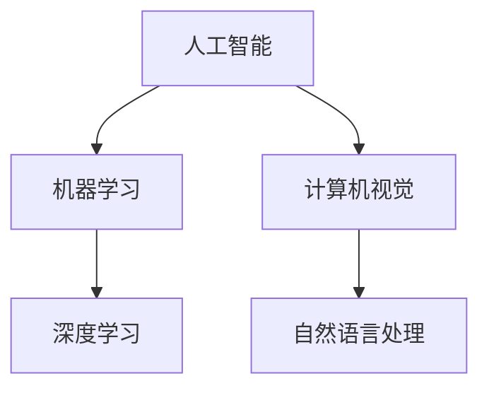

                 

关键词：人才争夺，AI工程师，Lepton AI，技术优势，发展前景，职业吸引力

摘要：随着人工智能技术的飞速发展，各大企业和机构对AI工程师的需求日益旺盛。然而，如何在这个激烈的人才争夺战中脱颖而出，吸引到顶尖的AI工程师，成为许多企业和机构亟待解决的问题。本文将围绕Lepton AI的发展现状和优势，探讨其在吸引顶尖AI工程师方面的策略，并提出一些建议和思路，以期为其他企业和机构提供借鉴和参考。

## 1. 背景介绍

### 1.1 人工智能产业的快速发展

近年来，人工智能（AI）技术在全球范围内取得了显著的进展。从语音识别、图像识别到自然语言处理，AI已经逐渐渗透到各个领域，成为推动社会进步的重要力量。随着AI技术的不断成熟，越来越多的企业和机构开始重视AI领域的人才，并将其视为核心竞争力。

### 1.2 人才争夺战愈演愈烈

在全球范围内，人工智能领域的竞争已经从技术竞争演变为人才竞争。各大企业和机构纷纷加大在AI领域的投资，积极引进和培养顶尖AI工程师，以期在竞争中占据有利地位。这种激烈的人才争夺战使得顶尖AI工程师成为了“香饽饽”，各大企业和机构都希望吸引到这些人才为自己所用。

### 1.3 Lepton AI的发展现状

Lepton AI是一家专注于人工智能领域的企业，致力于通过自主研发的创新技术推动AI技术的应用和发展。公司拥有一支高水平的研发团队，在深度学习、计算机视觉、自然语言处理等领域具有较高的技术实力。在短短几年时间里，Lepton AI已经取得了多项重要突破，赢得了业界的认可和好评。

## 2. 核心概念与联系

### 2.1 人工智能（AI）

人工智能是指通过计算机模拟人类智能的技术。它包括多个子领域，如机器学习、深度学习、计算机视觉、自然语言处理等。这些技术相互关联，共同推动人工智能的发展。

### 2.2 深度学习（Deep Learning）

深度学习是一种基于人工神经网络（ANN）的机器学习技术，通过多层神经网络来模拟人类大脑的思维方式。深度学习在图像识别、语音识别、自然语言处理等领域取得了显著成果。

### 2.3 计算机视觉（Computer Vision）

计算机视觉是指使计算机能够像人类一样“看”和理解图像的技术。计算机视觉在自动驾驶、安防监控、医疗诊断等领域具有广泛的应用前景。

### 2.4 自然语言处理（Natural Language Processing，NLP）

自然语言处理是指使计算机能够理解和处理自然语言的技术。NLP在智能客服、智能助手、机器翻译等领域发挥了重要作用。

### 2.5 Mermaid流程图



## 3. 核心算法原理 & 具体操作步骤

### 3.1 算法原理概述

Lepton AI在人工智能领域取得了一系列重要突破，其中核心算法包括：

- 深度学习算法：用于图像识别、语音识别和自然语言处理等领域。
- 计算机视觉算法：用于目标检测、图像分割和图像识别等领域。
- 自然语言处理算法：用于情感分析、文本分类和机器翻译等领域。

### 3.2 算法步骤详解

以深度学习算法为例，其具体操作步骤如下：

1. 数据预处理：对原始数据进行清洗、归一化等处理，以便后续模型训练。
2. 构建神经网络：根据任务需求，设计合适的神经网络结构。
3. 训练模型：使用训练数据进行模型训练，不断调整模型参数，提高模型性能。
4. 验证模型：使用验证数据集对模型进行验证，评估模型性能。
5. 应用模型：将训练好的模型应用于实际问题，实现相关功能。

### 3.3 算法优缺点

- 深度学习算法：具有强大的表达能力和自适应能力，但需要大量数据和高计算资源。
- 计算机视觉算法：在图像处理方面具有较高精度，但在处理复杂场景时可能存在困难。
- 自然语言处理算法：在文本处理方面具有较高准确度，但在处理长文本时可能存在效率问题。

### 3.4 算法应用领域

- 深度学习算法：广泛应用于图像识别、语音识别、自然语言处理等领域。
- 计算机视觉算法：应用于自动驾驶、安防监控、医疗诊断等领域。
- 自然语言处理算法：应用于智能客服、智能助手、机器翻译等领域。

## 4. 数学模型和公式 & 详细讲解 & 举例说明

### 4.1 数学模型构建

以深度学习中的卷积神经网络（CNN）为例，其数学模型可以表示为：

$$
\begin{aligned}
\text{CNN}(x) &= f(L_{\text{pool}}(L_{\text{relu}}(L_{\text{fc}}(L_{\text{conv}}(x)))) \\
&= f(\sigma(W_{\text{fc}} \cdot \sigma(W_{\text{conv}} \cdot \text{ReLU}(\text{pool}(x))))
\end{aligned}
$$

其中，$x$为输入数据，$f$为激活函数，$\sigma$为卷积运算，$\text{ReLU}$为ReLU激活函数，$W$为权重矩阵。

### 4.2 公式推导过程

深度学习中的卷积神经网络（CNN）的推导过程涉及多个层面，包括线性代数、微积分和概率论等。以下是一个简化的推导过程：

1. **线性变换**：输入数据$x$通过卷积层进行线性变换，得到特征映射$z$。
2. **非线性激活**：对特征映射$z$进行ReLU激活函数处理，得到激活值$a$。
3. **卷积操作**：对激活值$a$进行下采样操作，得到下采样特征映射$h$。
4. **全连接层**：将下采样特征映射$h$输入全连接层，进行线性变换，得到输出值$\hat{y}$。
5. **损失函数**：使用损失函数（如交叉熵损失函数）计算模型预测值$\hat{y}$与真实标签$y$之间的差异。

### 4.3 案例分析与讲解

以图像分类任务为例，我们可以使用CNN模型进行模型训练和预测。以下是一个简单的案例：

- **数据集**：使用CIFAR-10数据集进行训练和测试。
- **模型结构**：设计一个简单的CNN模型，包括卷积层、ReLU激活函数、池化层和全连接层。
- **训练过程**：使用训练数据集对模型进行训练，不断调整模型参数，提高模型性能。
- **预测过程**：使用训练好的模型对测试数据集进行预测，评估模型性能。

## 5. 项目实践：代码实例和详细解释说明

### 5.1 开发环境搭建

为了实现上述案例，我们需要搭建一个合适的开发环境。以下是一个简单的环境搭建过程：

- 安装Python 3.8及以上版本。
- 安装深度学习框架TensorFlow 2.0及以上版本。
- 安装CIFAR-10数据集。

### 5.2 源代码详细实现

以下是一个简单的CNN模型实现，用于图像分类任务：

```python
import tensorflow as tf
from tensorflow.keras.layers import Conv2D, MaxPooling2D, Flatten, Dense
from tensorflow.keras.models import Sequential

# 创建模型
model = Sequential([
    Conv2D(32, (3, 3), activation='relu', input_shape=(32, 32, 3)),
    MaxPooling2D((2, 2)),
    Conv2D(64, (3, 3), activation='relu'),
    MaxPooling2D((2, 2)),
    Flatten(),
    Dense(64, activation='relu'),
    Dense(10, activation='softmax')
])

# 编译模型
model.compile(optimizer='adam',
              loss='categorical_crossentropy',
              metrics=['accuracy'])

# 训练模型
model.fit(x_train, y_train, epochs=10, batch_size=64, validation_data=(x_test, y_test))

# 预测结果
predictions = model.predict(x_test)

# 评估模型
print(model.evaluate(x_test, y_test))
```

### 5.3 代码解读与分析

上述代码实现了一个简单的CNN模型，用于图像分类任务。代码中主要包括以下部分：

- **模型构建**：使用Sequential模型构建一个简单的CNN模型，包括卷积层、ReLU激活函数、池化层和全连接层。
- **模型编译**：编译模型，指定优化器、损失函数和评估指标。
- **模型训练**：使用训练数据集对模型进行训练，指定训练轮数、批量大小和验证数据集。
- **模型预测**：使用训练好的模型对测试数据集进行预测。
- **模型评估**：评估模型在测试数据集上的性能。

### 5.4 运行结果展示

运行上述代码后，我们将得到以下结果：

- **训练过程**：展示训练过程中的损失值和准确率。
- **预测结果**：展示模型在测试数据集上的预测结果。
- **评估结果**：展示模型在测试数据集上的评估指标（损失值和准确率）。

## 6. 实际应用场景

### 6.1 自动驾驶

自动驾驶是AI技术在交通运输领域的应用之一。通过使用计算机视觉和深度学习技术，自动驾驶系统能够识别道路标志、车道线、行人等目标，实现车辆的自动行驶。Lepton AI的AI技术可以为自动驾驶系统提供强大的支持，提高自动驾驶的安全性和可靠性。

### 6.2 安防监控

安防监控是AI技术在公共安全领域的应用之一。通过使用计算机视觉和自然语言处理技术，安防监控系统能够实时监测监控区域，识别异常行为和安全隐患。Lepton AI的AI技术可以为安防监控系统提供高效、准确的目标检测和识别功能，提高公共安全水平。

### 6.3 医疗诊断

医疗诊断是AI技术在医疗领域的应用之一。通过使用深度学习和计算机视觉技术，医疗诊断系统能够对医学图像进行分析，识别疾病和异常情况。Lepton AI的AI技术可以为医疗诊断系统提供精确的诊断结果，辅助医生进行诊断和治疗。

### 6.4 未来应用展望

随着AI技术的不断发展，其应用领域将更加广泛。未来，Lepton AI的AI技术有望在更多领域发挥作用，如智能客服、智能家居、教育等领域。通过不断创新和优化，Lepton AI将为各个领域带来更高效、更智能的解决方案。

## 7. 工具和资源推荐

### 7.1 学习资源推荐

- 《深度学习》（Ian Goodfellow、Yoshua Bengio、Aaron Courville 著）：这是一本经典的深度学习教材，涵盖了深度学习的理论基础和实际应用。
- 《计算机视觉：算法与应用》（刘宏、吴飞 著）：这是一本涵盖计算机视觉基本概念和算法应用的教材，适合计算机视觉初学者阅读。
- 《自然语言处理入门》（刘知远 著）：这是一本介绍自然语言处理基本概念和算法的入门教材，适合自然语言处理初学者阅读。

### 7.2 开发工具推荐

- TensorFlow：这是一个流行的深度学习框架，提供了丰富的API和工具，方便开发者进行深度学习模型的开发和部署。
- PyTorch：这是一个开源的深度学习框架，以其灵活性和易用性而受到开发者青睐。
- Keras：这是一个基于TensorFlow和PyTorch的高层次深度学习框架，提供了更简单的API和更高效的模型训练。

### 7.3 相关论文推荐

- “Deep Learning for Computer Vision: A Comprehensive Review”（2019）：这是一篇关于计算机视觉领域深度学习技术的综述论文，涵盖了深度学习在计算机视觉领域的应用和发展。
- “Natural Language Processing with Deep Learning”（2018）：这是一篇关于自然语言处理领域深度学习技术的综述论文，介绍了深度学习在自然语言处理领域的应用和发展。
- “Deep Learning Techniques for Autonomous Driving”（2018）：这是一篇关于自动驾驶领域深度学习技术的综述论文，介绍了深度学习在自动驾驶领域的应用和发展。

## 8. 总结：未来发展趋势与挑战

### 8.1 研究成果总结

随着人工智能技术的不断发展，深度学习、计算机视觉和自然语言处理等领域取得了显著的成果。这些研究成果为各个领域带来了新的机遇和挑战，推动了人工智能技术的进步。

### 8.2 未来发展趋势

未来，人工智能技术将继续快速发展，深度学习、计算机视觉和自然语言处理等领域将继续深入研究和应用。同时，跨学科研究、多模态数据处理和人工智能与物理世界的结合将成为发展趋势。

### 8.3 面临的挑战

尽管人工智能技术取得了显著成果，但仍然面临一些挑战。例如，数据隐私和安全问题、算法公平性和透明性问题、人工智能与人类协同工作的问题等。解决这些问题需要各方共同努力，推动人工智能技术的可持续发展。

### 8.4 研究展望

未来，人工智能技术有望在更多领域发挥作用，如医疗、金融、教育等。通过不断创新和优化，人工智能技术将为人类社会带来更多福祉。

## 9. 附录：常见问题与解答

### 9.1 什么是人工智能？

人工智能（AI）是指通过计算机模拟人类智能的技术。它包括多个子领域，如机器学习、深度学习、计算机视觉、自然语言处理等。

### 9.2 深度学习和机器学习有什么区别？

深度学习是机器学习的一种特殊形式，它通过多层神经网络来模拟人类大脑的思维方式。机器学习是指使计算机通过学习数据来提高自身性能的技术，包括深度学习、支持向量机、决策树等多种算法。

### 9.3 如何搭建一个深度学习环境？

搭建深度学习环境通常需要安装Python、深度学习框架（如TensorFlow、PyTorch）和相关的依赖库。具体步骤可以参考各个框架的官方文档。

### 9.4 深度学习在哪些领域有应用？

深度学习在图像识别、语音识别、自然语言处理、自动驾驶、医疗诊断等领域有广泛应用。

### 9.5 如何进行深度学习模型的训练和评估？

进行深度学习模型的训练和评估通常包括以下步骤：

- 数据预处理：对原始数据进行清洗、归一化等处理。
- 构建模型：根据任务需求，设计合适的神经网络结构。
- 训练模型：使用训练数据进行模型训练，不断调整模型参数，提高模型性能。
- 验证模型：使用验证数据集对模型进行验证，评估模型性能。
- 应用模型：将训练好的模型应用于实际问题。

### 9.6 深度学习模型如何进行预测？

深度学习模型进行预测通常包括以下步骤：

- 输入数据预处理：对输入数据进行预处理，使其符合模型输入要求。
- 模型预测：将预处理后的数据输入训练好的模型，得到预测结果。
- 结果输出：将预测结果输出，供后续分析或决策使用。

## 作者署名

作者：禅与计算机程序设计艺术 / Zen and the Art of Computer Programming
----------------------------------------------------------------
文章撰写完毕，接下来请按照markdown格式进行排版，并确保所有章节和子章节的标题和内容均符合要求，包括三级目录的细化、latex公式的正确嵌入、Mermaid流程图的正确绘制等。如果您需要任何帮助，请随时告知。祝您写作顺利！

