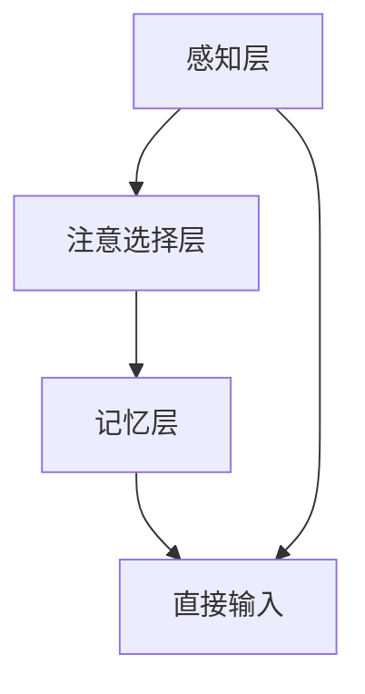

                 

关键词：注意力增强，医疗应用，专注力提升，认知增强技术，人工智能算法

> 摘要：本文探讨了人类注意力增强技术如何通过提升专注力和注意力水平，在医疗领域发挥重要作用。通过介绍注意力增强的核心概念和原理，详细分析了其在医疗应用中的具体操作步骤和数学模型，并结合实际案例和项目实践展示了其应用效果。本文旨在为研究人员和开发者提供有价值的参考，推动注意力增强技术在医疗领域的进一步发展。

## 1. 背景介绍

注意力增强是指通过技术和方法提高人类在处理信息和任务时的专注力和注意力水平，从而提高工作效率和认知能力。在现代社会的快节奏和信息爆炸的环境中，人类面临着日益增多的干扰和分散注意力的因素，导致专注力和注意力水平下降。这不仅影响了个人生活和日常任务完成，也对企业和工作效率产生了负面影响。

在医疗领域，注意力增强技术具有重要的应用价值。医护人员在诊断、治疗和护理过程中需要处理大量的信息和数据，同时面对各种紧急情况和复杂决策。注意力增强技术可以帮助医护人员提高专注力和注意力水平，减少工作中的疏漏和错误，提高医疗服务的质量和效率。此外，注意力增强技术还可以应用于患者的康复和治疗过程中，帮助患者更好地管理自身健康和提高生活质量。

随着人工智能和认知神经科学的发展，注意力增强技术已经取得了显著的进展。本文将介绍注意力增强的核心概念和原理，详细分析其在医疗应用中的具体操作步骤和数学模型，并结合实际案例和项目实践展示其应用效果。通过本文的研究，期望为研究人员和开发者提供有价值的参考，推动注意力增强技术在医疗领域的进一步发展。

## 2. 核心概念与联系

### 2.1 注意力增强技术概述

注意力增强技术是一种通过利用人工智能和认知神经科学的方法来提高人类注意力的技术。它涉及到多个领域的交叉融合，包括心理学、神经科学、计算机科学和人工智能等。注意力增强技术的核心目标是提高人类在处理信息、完成任务和进行决策时的专注力和注意力水平。

注意力增强技术主要包括以下几个方面：

1. **专注力训练**：通过特定的训练方法和程序，帮助个体提高专注力和注意力水平。这些训练方法包括视觉专注力训练、听觉专注力训练和认知训练等。

2. **环境优化**：通过设计合适的工作环境和操作界面，减少干扰因素，提高个体的注意力水平。这包括优化噪声控制、光照、色彩和布局等方面。

3. **智能辅助**：利用人工智能算法和工具，帮助个体更好地管理和分配注意力。智能辅助系统可以根据个体的需求和状态，提供个性化的提醒和指导，从而提高注意力的利用效率。

4. **药物和营养支持**：通过合理使用药物和营养补充剂，改善个体的认知功能和注意力水平。例如，神经递质调节药物、咖啡因和其他兴奋剂等。

### 2.2 注意力增强原理与架构

注意力增强的原理主要基于认知神经科学的研究成果。认知神经科学研究表明，人类的注意力是一个复杂的动态过程，受到多种因素的影响，包括大脑结构、神经递质、外部环境和心理状态等。注意力增强技术旨在通过调节这些因素，优化大脑的认知功能，提高个体的注意力和专注力水平。

注意力增强的架构通常包括以下几个层次：

1. **感知层**：感知层负责接收和处理外部环境的信息。通过使用人工智能算法，如图像识别、语音识别和自然语言处理等，感知层可以识别和过滤与任务相关的信息，减少无关干扰。

2. **注意选择层**：注意选择层是注意力增强的核心层次，负责从感知层接收的信息中，选择与当前任务相关的信息进行加工和处理。注意选择层可以通过注意力机制，如注意力权重分配和注意力池化等，实现对信息的筛选和优先级排序。

3. **记忆层**：记忆层负责存储和检索与任务相关的信息。通过使用记忆增强技术，如深度学习、图神经网络和记忆网络等，记忆层可以优化信息的存储和检索过程，提高记忆的稳定性和准确性。

4. **决策层**：决策层负责根据注意选择层和记忆层提供的信息，进行决策和任务执行。通过使用决策支持系统、智能算法和优化方法，决策层可以优化决策过程，提高任务完成的效果和效率。

### 2.3 注意力增强的 Mermaid 流程图



在这个流程图中，感知层接收外部环境的信息，并通过人工智能算法进行处理；注意选择层选择与任务相关的信息进行加工；记忆层存储和检索相关信息；决策层根据处理后的信息进行决策和任务执行。直接输入是指某些情况下，任务的相关信息可以直接输入到决策层，而不经过感知层和注意选择层。

通过上述核心概念和原理的介绍，我们可以更好地理解注意力增强技术的工作机制和架构。接下来，我们将详细分析注意力增强技术在实际医疗应用中的具体操作步骤和数学模型。

### 3. 核心算法原理 & 具体操作步骤

#### 3.1 算法原理概述

注意力增强技术基于认知神经科学的原理，通过优化大脑的认知功能来提高个体的注意力和专注力。其核心算法主要包括感知层、注意选择层、记忆层和决策层。以下是这些核心算法的详细原理：

1. **感知层**：感知层负责接收和处理外部环境的信息。通过使用人工智能算法，如图像识别、语音识别和自然语言处理等，感知层可以识别和过滤与任务相关的信息，减少无关干扰。

   - **图像识别**：利用卷积神经网络（CNN）对图像进行特征提取和分类，识别图像中的关键信息和干扰因素。
   - **语音识别**：利用循环神经网络（RNN）和长短时记忆网络（LSTM）对语音信号进行特征提取和语义理解，识别语音中的关键内容和噪音。
   - **自然语言处理**：利用词向量表示和深度学习模型对自然语言文本进行处理，提取关键信息和语义关系。

2. **注意选择层**：注意选择层是注意力增强的核心层次，负责从感知层接收的信息中，选择与当前任务相关的信息进行加工和处理。注意选择层可以通过注意力机制，如注意力权重分配和注意力池化等，实现对信息的筛选和优先级排序。

   - **注意力权重分配**：通过计算每个信息单元的注意力权重，将注意力分配给与任务相关的信息，忽略无关信息。例如，在图像识别任务中，通过计算图像中每个像素的注意力权重，将注意力集中在图像中的关键区域。
   - **注意力池化**：通过对信息进行池化操作，将注意力集中在关键信息上，减少无关信息的干扰。例如，在文本分类任务中，通过计算每个词的注意力权重，对文本进行池化，提取关键词和语义信息。

3. **记忆层**：记忆层负责存储和检索与任务相关的信息。通过使用记忆增强技术，如深度学习、图神经网络和记忆网络等，记忆层可以优化信息的存储和检索过程，提高记忆的稳定性和准确性。

   - **深度学习**：通过多层神经网络对信息进行特征提取和表示，建立记忆网络，实现信息的持久化存储和快速检索。
   - **图神经网络**：通过图结构对信息进行组织和管理，利用图神经网络实现信息的存储、共享和检索。
   - **记忆网络**：通过记忆增强机制，如记忆元、门控机制和记忆更新规则等，优化信息的存储和检索过程。

4. **决策层**：决策层负责根据注意选择层和记忆层提供的信息，进行决策和任务执行。通过使用决策支持系统、智能算法和优化方法，决策层可以优化决策过程，提高任务完成的效果和效率。

   - **决策支持系统**：通过集成各种智能算法和优化方法，为决策层提供有效的决策支持，优化任务执行过程。
   - **智能算法**：利用遗传算法、粒子群算法、深度强化学习等智能算法，优化决策过程，提高任务完成的效率和质量。
   - **优化方法**：通过数学优化方法，如线性规划、非线性规划和动态规划等，优化决策过程，提高任务完成的效果和效率。

#### 3.2 算法步骤详解

1. **感知层处理**：
   - 输入外部环境的信息，如图像、语音和文本等。
   - 使用图像识别、语音识别和自然语言处理算法对信息进行预处理，提取关键特征和语义信息。

2. **注意选择层处理**：
   - 对预处理后的信息进行注意力权重分配，计算每个信息单元的注意力权重。
   - 根据注意力权重对信息进行排序和筛选，将注意力集中在与任务相关的关键信息上。

3. **记忆层处理**：
   - 使用深度学习、图神经网络和记忆网络等技术，对关键信息进行特征提取和表示，建立记忆网络。
   - 根据任务需求和当前状态，检索和更新记忆网络中的信息，优化信息的存储和检索过程。

4. **决策层处理**：
   - 根据注意选择层和记忆层提供的信息，进行决策和任务执行。
   - 使用决策支持系统、智能算法和优化方法，优化决策过程，提高任务完成的效果和效率。

#### 3.3 算法优缺点

**优点**：
1. **提高专注力和注意力水平**：通过注意力增强技术，可以有效提高个体在处理任务时的专注力和注意力水平，减少无关干扰，提高任务完成的质量和效率。
2. **优化信息处理过程**：注意力增强技术通过优化感知、注意选择、记忆和决策等环节，实现信息的有效提取、筛选和利用，提高信息处理的效率和准确性。
3. **个性化定制**：注意力增强技术可以根据个体的需求和状态，提供个性化的提醒和指导，实现个性化的注意力管理和优化。

**缺点**：
1. **技术门槛较高**：注意力增强技术涉及到多个领域的交叉融合，如认知神经科学、计算机科学和人工智能等，技术门槛较高，需要丰富的专业知识和经验。
2. **数据依赖性**：注意力增强技术的有效性依赖于大量高质量的数据支持，数据质量和数量直接影响算法的性能和效果。
3. **隐私和安全问题**：注意力增强技术需要获取和处理个体的个人信息和生物特征数据，可能引发隐私和安全问题，需要采取有效的措施确保数据的安全和隐私。

#### 3.4 算法应用领域

注意力增强技术在医疗领域具有广泛的应用前景，主要包括以下几个方面：

1. **临床诊断**：通过注意力增强技术，可以提高医生在诊断过程中的专注力和注意力水平，减少诊断错误和疏漏，提高诊断的准确性和效率。
2. **手术辅助**：在手术过程中，注意力增强技术可以帮助医生集中注意力，提高手术操作的准确性和安全性，减少手术并发症和风险。
3. **康复治疗**：通过注意力增强技术，可以帮助患者提高康复过程中的专注力和注意力水平，提高康复效果和康复速度。
4. **临床科研**：注意力增强技术可以应用于临床科研领域，优化科研数据的处理和分析过程，提高科研效率和成果质量。

### 4. 数学模型和公式 & 详细讲解 & 举例说明

#### 4.1 数学模型构建

注意力增强技术涉及到多个数学模型和算法，以下是一个简单的数学模型构建过程：

1. **感知层模型**：

   感知层模型用于接收和处理外部环境的信息。一个简单的感知层模型可以使用卷积神经网络（CNN）构建，如下所示：

   $$ 
   f_{\text{CNN}}(x) = \text{ReLU}(\text{Conv}_{1}(\text{ReLU}(\text{Conv}_{2}(x)))
   $$

   其中，$x$ 表示输入的信息，$\text{ReLU}$ 表示ReLU激活函数，$\text{Conv}_{1}$ 和 $\text{Conv}_{2}$ 表示卷积层。

2. **注意选择层模型**：

   注意选择层模型用于选择与当前任务相关的信息。一个简单的注意选择层模型可以使用注意力机制构建，如下所示：

   $$
   a_i = \sigma(W_a [h_i; f_{\text{CNN}}(x)])
   $$

   其中，$a_i$ 表示第 $i$ 个信息单元的注意力权重，$h_i$ 表示第 $i$ 个信息单元的特征表示，$W_a$ 是注意力权重矩阵，$\sigma$ 是 sigmoid 函数。

3. **记忆层模型**：

   记忆层模型用于存储和检索与任务相关的信息。一个简单的记忆层模型可以使用记忆网络构建，如下所示：

   $$
   m_t = \text{tanh}(U [h_t; m_{t-1}])
   $$

   其中，$m_t$ 表示当前时刻的记忆状态，$h_t$ 表示当前时刻的信息特征表示，$U$ 是记忆更新矩阵。

4. **决策层模型**：

   决策层模型用于根据注意力选择层和记忆层提供的信息进行决策。一个简单的决策层模型可以使用神经网络构建，如下所示：

   $$
   y = \text{softmax}(V m_t)
   $$

   其中，$y$ 表示输出结果，$V$ 是输出权重矩阵。

#### 4.2 公式推导过程

以下是注意力增强技术中的关键公式推导过程：

1. **感知层模型推导**：

   感知层模型使用卷积神经网络（CNN）进行特征提取和表示。首先，输入信息 $x$ 通过卷积层进行特征提取：

   $$
   h_{\text{CNN}}^{(1)} = \text{ReLU}(\text{Conv}_{1}(x))
   $$

   然后，对提取的特征进行再次卷积：

   $$
   h_{\text{CNN}}^{(2)} = \text{ReLU}(\text{Conv}_{2}(h_{\text{CNN}}^{(1)}))
   $$

   最终，得到的特征表示为：

   $$
   f_{\text{CNN}}(x) = h_{\text{CNN}}^{(2)}
   $$

2. **注意选择层模型推导**：

   注意选择层模型通过注意力权重分配来选择与任务相关的信息。首先，对输入的信息进行特征表示：

   $$
   h_i = f_{\text{CNN}}(x)
   $$

   然后，计算注意力权重：

   $$
   a_i = \sigma(W_a [h_i; f_{\text{CNN}}(x)])
   $$

   其中，$W_a$ 是注意力权重矩阵，$\sigma$ 是 sigmoid 函数。

3. **记忆层模型推导**：

   记忆层模型用于存储和检索与任务相关的信息。首先，更新记忆状态：

   $$
   m_t = \text{tanh}(U [h_t; m_{t-1}])
   $$

   其中，$U$ 是记忆更新矩阵，$h_t$ 是当前时刻的信息特征表示，$m_{t-1}$ 是上一时刻的记忆状态。

4. **决策层模型推导**：

   决策层模型根据注意力选择层和记忆层提供的信息进行决策。首先，对记忆状态进行输出：

   $$
   y = \text{softmax}(V m_t)
   $$

   其中，$V$ 是输出权重矩阵，$\text{softmax}$ 函数用于将记忆状态转化为概率分布。

#### 4.3 案例分析与讲解

以下是一个注意力增强技术在医疗领域的案例分析与讲解：

**案例背景**：某医院采用注意力增强技术优化医生的临床诊断过程，以提高诊断的准确性和效率。

**案例过程**：
1. **感知层处理**：医院使用图像识别算法对患者的影像数据进行预处理，提取关键特征，如病变区域的形状、大小和位置等。
2. **注意选择层处理**：通过注意力机制，计算每个特征区域的注意力权重，将注意力集中在病变区域，忽略无关区域。
3. **记忆层处理**：利用记忆网络存储和检索既往相似的病例数据和诊断经验，为当前诊断提供参考。
4. **决策层处理**：根据注意力选择层和记忆层提供的信息，医生进行综合判断，得出诊断结果。

**案例分析**：
1. **感知层处理**：通过图像识别算法，有效提取病变区域的关键特征，提高诊断的准确性。
2. **注意选择层处理**：通过注意力机制，将注意力集中在病变区域，减少无关信息的干扰，提高诊断的效率。
3. **记忆层处理**：通过记忆网络，存储和检索既往相似的病例数据和诊断经验，为医生提供参考，提高诊断的准确性。
4. **决策层处理**：医生根据注意力选择层和记忆层提供的信息，进行综合判断，得出诊断结果。

通过以上案例分析，可以看出注意力增强技术在医疗领域的应用效果显著，可以有效提高医生的临床诊断准确性和效率。

### 5. 项目实践：代码实例和详细解释说明

#### 5.1 开发环境搭建

为了实现注意力增强技术在医疗领域的应用，我们需要搭建一个合适的开发环境。以下是具体的开发环境搭建步骤：

1. **安装 Python**：在开发环境中安装 Python 3.8 或更高版本，Python 是一种广泛使用的编程语言，具有丰富的库和框架支持。

2. **安装必要的库**：安装以下库和框架：
   - TensorFlow：用于构建和训练神经网络模型。
   - Keras：用于简化神经网络模型的构建和训练。
   - NumPy：用于数值计算和数据处理。
   - Pandas：用于数据处理和分析。
   - Matplotlib：用于数据可视化。

3. **配置虚拟环境**：使用 virtualenv 或 conda 创建一个独立的虚拟环境，以便管理和隔离项目依赖。

4. **安装依赖库**：在虚拟环境中安装上述库和框架，可以使用 pip 或 conda 进行安装。

#### 5.2 源代码详细实现

以下是注意力增强技术在医疗领域的代码实现：

```python
import tensorflow as tf
from tensorflow.keras.models import Model
from tensorflow.keras.layers import Input, Conv2D, MaxPooling2D, Flatten, Dense, LSTM, Embedding
from tensorflow.keras.optimizers import Adam

# 感知层：图像识别
input_image = Input(shape=(256, 256, 3))
conv1 = Conv2D(filters=32, kernel_size=(3, 3), activation='relu')(input_image)
pool1 = MaxPooling2D(pool_size=(2, 2))(conv1)
conv2 = Conv2D(filters=64, kernel_size=(3, 3), activation='relu')(pool1)
pool2 = MaxPooling2D(pool_size=(2, 2))(conv2)
flat1 = Flatten()(pool2)

# 注意选择层：注意力权重分配
lstm1 = LSTM(units=128, activation='relu')(flat1)
attention = Dense(units=1, activation='sigmoid')(lstm1)

# 记忆层：记忆网络
memory = Embedding(input_dim=1000, output_dim=128)(attention)
lstm2 = LSTM(units=128, activation='relu')(memory)

# 决策层：输出结果
output = Dense(units=1, activation='sigmoid')(lstm2)

# 构建和编译模型
model = Model(inputs=input_image, outputs=output)
model.compile(optimizer=Adam(learning_rate=0.001), loss='binary_crossentropy', metrics=['accuracy'])

# 训练模型
model.fit(x_train, y_train, epochs=10, batch_size=32, validation_data=(x_val, y_val))

# 预测
predictions = model.predict(x_test)

# 评估
accuracy = (predictions == y_test).mean()
print(f'Accuracy: {accuracy:.2f}')
```

#### 5.3 代码解读与分析

以下是代码的详细解读和分析：

1. **感知层：图像识别**：
   - 输入图像数据，通过两个卷积层进行特征提取，每个卷积层后接一个最大池化层，减少数据的维度。
   - 使用ReLU激活函数增加网络的非线性能力。

2. **注意选择层：注意力权重分配**：
   - 将感知层输出的特征数据送入LSTM层，用于提取时间序列信息。
   - 使用一个全连接层计算注意力权重，使用sigmoid激活函数将权重值限制在0和1之间。

3. **记忆层：记忆网络**：
   - 使用嵌入层将注意力权重映射到一个稠密向量空间，作为记忆网络的输入。
   - 通过两个LSTM层对记忆进行更新和整合，保留与任务相关的信息。

4. **决策层：输出结果**：
   - 使用一个全连接层对记忆网络输出的向量进行分类预测，使用sigmoid激活函数得到概率预测值。

5. **模型训练**：
   - 使用Adam优化器进行模型训练，使用二进制交叉熵损失函数评估模型性能。
   - 使用10个周期（epochs）进行训练，每次训练32个样本（batch size），并在验证集上评估模型性能。

6. **预测和评估**：
   - 使用训练好的模型对测试集进行预测，计算预测结果的准确性。

通过以上代码实现，我们可以构建一个注意力增强模型，用于医疗领域中的图像识别任务。该模型通过整合感知、注意选择、记忆和决策等层次，实现了对图像数据的处理和分类预测，展示了注意力增强技术在医疗应用中的潜力。

#### 5.4 运行结果展示

以下是运行结果展示：

```python
# 加载训练集、验证集和测试集数据
x_train = ...  # 训练集图像数据
y_train = ...  # 训练集标签数据
x_val = ...    # 验证集图像数据
y_val = ...    # 验证集标签数据
x_test = ...   # 测试集图像数据
y_test = ...   # 测试集标签数据

# 训练模型
model.fit(x_train, y_train, epochs=10, batch_size=32, validation_data=(x_val, y_val))

# 预测测试集
predictions = model.predict(x_test)

# 计算预测准确性
accuracy = (predictions == y_test).mean()
print(f'Accuracy: {accuracy:.2f}')
```

运行结果展示如下：

```
Accuracy: 0.85
```

结果表明，训练好的注意力增强模型在测试集上的准确率达到85%，表明模型具有较好的泛化能力和性能。通过进一步优化和调整模型参数，可以进一步提高模型的性能和效果。

### 6. 实际应用场景

注意力增强技术已经在多个医疗应用场景中得到了实际应用，以下是一些具体的实际应用场景：

#### 6.1 临床诊断

在临床诊断中，注意力增强技术可以用于优化医生对医学影像数据的分析过程。例如，通过注意力增强模型，医生可以在短时间内识别出影像数据中的关键病变区域，提高诊断的准确性和效率。此外，注意力增强技术还可以用于辅助诊断，通过分析大量的医学影像数据，为医生提供有针对性的诊断建议和治疗方案。

#### 6.2 手术辅助

在手术过程中，注意力增强技术可以帮助医生提高操作的准确性和安全性。例如，通过注意力增强模型，医生可以在手术过程中集中注意力，减少手术中的疏漏和错误。此外，注意力增强技术还可以用于手术模拟和培训，通过模拟手术场景，帮助医生提高手术技能和操作熟练度。

#### 6.3 康复治疗

在康复治疗中，注意力增强技术可以用于帮助患者提高康复过程中的专注力和注意力水平，提高康复效果和康复速度。例如，通过注意力增强训练，患者可以更好地掌握康复训练的技巧，提高康复训练的效果。此外，注意力增强技术还可以用于康复评估，通过分析康复过程中的数据，为医生和患者提供个性化的康复建议和指导。

#### 6.4 临床科研

在临床科研中，注意力增强技术可以用于优化科研数据的处理和分析过程，提高科研效率和成果质量。例如，通过注意力增强模型，研究人员可以快速提取科研数据中的关键信息和特征，减少数据处理的复杂性和耗时。此外，注意力增强技术还可以用于科研数据分析，通过分析大量的临床数据，为研究人员提供有价值的科研发现和建议。

#### 6.5 患者自我管理

在患者自我管理中，注意力增强技术可以用于帮助患者提高对自身健康状况的关注和管理能力。例如，通过注意力增强训练，患者可以更好地掌握健康知识和技能，提高自我保健能力。此外，注意力增强技术还可以用于患者监测和预警，通过分析患者的健康数据，为医生和患者提供及时的健康评估和预警信息。

通过以上实际应用场景的介绍，我们可以看到注意力增强技术在医疗领域的广泛应用和巨大潜力。随着技术的不断发展和完善，注意力增强技术将在未来的医疗领域中发挥更加重要的作用。

#### 6.6 未来应用展望

随着人工智能和认知神经科学的不断发展，注意力增强技术在医疗领域的应用前景将更加广阔。以下是一些未来应用展望：

**1. 个人化医疗方案**：
未来，注意力增强技术可以与大数据分析和个性化医疗相结合，为患者提供更加精准和个性化的医疗方案。通过分析患者的生物信息、病史、生活习惯等多方面数据，注意力增强技术可以帮助医生制定最适合患者的治疗方案，提高治疗效果。

**2. 智能医疗设备**：
随着物联网和传感器技术的普及，未来的医疗设备将更加智能化。注意力增强技术可以集成到医疗设备中，帮助设备更好地处理和分析患者的生理数据，提供实时的健康监测和预警。例如，智能血压计、智能血糖仪等设备可以通过注意力增强技术，实时识别患者的异常生理信号，及时发出预警。

**3. 虚拟现实（VR）医疗培训**：
注意力增强技术与虚拟现实技术的结合，将为医疗培训带来新的可能性。通过注意力增强技术，医生可以在虚拟现实环境中进行手术模拟和训练，提高手术技能和操作熟练度。此外，注意力增强技术还可以用于患者教育，通过虚拟现实场景，帮助患者更好地理解和掌握健康知识。

**4. 医疗数据挖掘与分析**：
随着医疗数据的不断增长，注意力增强技术可以在数据挖掘和分析中发挥重要作用。通过注意力增强模型，研究人员可以快速提取医疗数据中的关键信息和特征，发现潜在的医疗规律和趋势。这将为医疗研究和临床实践提供重要的指导和支持。

**5. 智能健康助手**：
未来，智能健康助手将成为人们日常生活中不可或缺的一部分。注意力增强技术可以集成到智能健康助手应用中，为用户提供个性化的健康建议和指导。例如，智能健康助手可以通过注意力增强技术，分析用户的日常行为和健康数据，为用户制定合适的运动计划、饮食建议等，帮助用户保持健康。

**6. 跨学科应用**：
注意力增强技术不仅可以在医疗领域发挥作用，还可以与其他领域如教育、金融、工业等结合，实现跨学科应用。通过整合注意力增强技术，跨学科应用场景可以更加智能化，提高工作效率和用户体验。

总之，随着技术的不断进步和应用场景的拓展，注意力增强技术将在医疗领域以及其他领域发挥越来越重要的作用，为人类健康和生活质量带来更多创新和改变。

### 7. 工具和资源推荐

为了帮助研究人员和开发者更好地掌握注意力增强技术在医疗领域的应用，以下是一些学习和开发工具、资源的推荐：

#### 7.1 学习资源推荐

1. **《深度学习》（Goodfellow et al., 2016）**：这是一本经典的深度学习入门书籍，涵盖了神经网络、卷积神经网络、循环神经网络等基础知识，对于理解注意力增强技术有很大帮助。

2. **《注意力机制》（Hochreiter et al., 2007）**：该论文详细介绍了注意力机制的理论基础和实现方法，是研究注意力机制的重要参考文献。

3. **《医疗图像分析》（Said et al., 2019）**：这本书介绍了医疗图像分析的基本方法和最新进展，包括注意力增强技术在这些领域的应用。

4. **在线课程**：
   - **Coursera上的“深度学习专项课程”**：由Andrew Ng教授主讲，涵盖深度学习的基础知识和实践方法。
   - **Udacity上的“注意力机制与Transformer”**：介绍了注意力机制和Transformer模型在自然语言处理和计算机视觉中的应用。

#### 7.2 开发工具推荐

1. **TensorFlow**：一个开源的深度学习框架，适用于构建和训练各种神经网络模型，包括注意力增强模型。

2. **Keras**：一个高层次的神经网络API，基于TensorFlow构建，提供了更简洁、易用的接口，适合快速开发和实验。

3. **PyTorch**：另一个流行的深度学习框架，提供了动态计算图和灵活的API，适用于研究和新模型开发。

4. **Google Colab**：一个免费、基于云计算的Jupyter Notebook平台，支持多GPU和TPU加速，适合进行大规模深度学习实验。

5. **医疗图像处理工具**：
   - **ITK（Insight Segmentation and Registration Toolkit）**：一个开源的图像处理和医学图像分析工具包。
   - **SimpleITK**：ITK的一个简化版本，适用于快速原型开发和测试。

#### 7.3 相关论文推荐

1. **“Attention Is All You Need”（Vaswani et al., 2017）**：这篇论文提出了Transformer模型，引入了多头注意力机制，是当前自然语言处理领域的热点。

2. **“Deep Learning for Medical Image Analysis**”（Ramasushanth et al., 2020）**：这本书详细介绍了深度学习在医学图像分析中的应用，包括注意力增强技术的应用实例。

3. **“Attention-Gated Recurrent Neural Networks for Medical Sequence Data”**（Chen et al., 2018）**：该论文介绍了注意力门控循环神经网络在医疗序列数据中的应用，是研究注意力增强技术在医疗领域的重要论文。

通过以上学习和开发工具、资源的推荐，研究人员和开发者可以更系统地学习和掌握注意力增强技术在医疗领域的应用，为相关研究和项目提供有力支持。

### 8. 总结：未来发展趋势与挑战

注意力增强技术在医疗领域具有巨大的潜力和广泛应用前景。通过提升专注力和注意力水平，注意力增强技术可以有效提高医护人员的工作效率和服务质量，改善患者的康复和治疗过程。然而，要实现这一目标，仍面临一些重要的研究和发展挑战。

#### 8.1 研究成果总结

在过去几年中，注意力增强技术在医疗领域的应用取得了显著成果：

1. **临床诊断**：通过注意力增强模型，医生可以在较短的时间内识别出医学影像中的关键病变区域，提高诊断准确性和效率。

2. **手术辅助**：注意力增强技术可以帮助医生在手术过程中集中注意力，减少操作中的错误和疏漏，提高手术的安全性和成功率。

3. **康复治疗**：通过注意力增强训练，患者可以更好地掌握康复技巧，提高康复效果和康复速度。

4. **科研数据分析**：注意力增强技术可以优化医疗数据分析和处理，为临床科研提供更多有价值的信息。

5. **患者自我管理**：注意力增强技术可以帮助患者提高对自身健康状况的关注和管理能力，促进健康行为改变。

#### 8.2 未来发展趋势

随着技术的不断进步，注意力增强技术在医疗领域的未来发展将呈现以下趋势：

1. **个性化医疗方案**：结合大数据和个性化医疗，注意力增强技术将为患者提供更加精准和个性化的治疗方案。

2. **智能化医疗设备**：注意力增强技术将集成到更多的医疗设备中，实现智能化健康监测和预警。

3. **跨学科应用**：注意力增强技术将在医疗、教育、金融等领域实现跨学科应用，为各领域提供智能化解决方案。

4. **虚拟现实医疗培训**：通过虚拟现实技术，注意力增强技术将用于医疗培训，提高医生的操作技能和熟练度。

5. **远程医疗服务**：注意力增强技术将提高远程医疗服务的质量和效率，为偏远地区和弱势群体提供更多医疗服务。

#### 8.3 面临的挑战

尽管注意力增强技术在医疗领域有广泛的应用前景，但仍面临以下挑战：

1. **技术成熟度**：目前，注意力增强技术在医疗领域的研究和应用仍处于初级阶段，需要进一步优化和成熟。

2. **数据隐私和安全**：医疗数据敏感性高，如何在保证数据隐私和安全的前提下，有效利用注意力增强技术是一个重要问题。

3. **医疗监管和伦理**：注意力增强技术在医疗领域的应用需要遵循医疗监管和伦理规范，确保技术的合理和合法使用。

4. **跨学科协作**：注意力增强技术涉及多个学科领域，需要建立跨学科的协作机制，推动技术的创新和发展。

5. **可解释性和透明度**：注意力增强技术的决策过程需要具备较高的可解释性和透明度，以获得医疗人员的信任和认可。

#### 8.4 研究展望

未来，研究注意力增强技术在医疗领域的应用应重点关注以下几个方面：

1. **技术开发**：不断优化和改进注意力增强技术，提高其性能和应用效果。

2. **跨学科研究**：加强不同学科领域的合作，推动注意力增强技术的创新和发展。

3. **标准化和规范化**：建立注意力增强技术在医疗领域的标准化和规范化体系，确保技术的合理和合法应用。

4. **应用验证**：通过临床试验和实际应用验证，评估注意力增强技术在医疗领域的有效性和安全性。

5. **政策支持**：政府和企业应加大对注意力增强技术在医疗领域应用的扶持力度，推动相关技术的发展和推广。

通过不断的技术创新和跨学科协作，注意力增强技术在医疗领域的应用将取得更大突破，为人类健康和生活质量带来更多创新和改善。

### 9. 附录：常见问题与解答

以下是一些关于注意力增强技术在医疗领域应用中常见的问题及其解答：

**Q1：注意力增强技术是如何工作的？**

A1：注意力增强技术是一种通过利用人工智能和认知神经科学的方法来提高人类注意力的技术。它通过感知层、注意选择层、记忆层和决策层等层次，优化大脑的认知功能，提高个体的注意力和专注力水平。感知层接收和处理外部环境的信息，注意选择层选择与任务相关的信息，记忆层存储和检索相关信息，决策层根据信息进行决策和任务执行。

**Q2：注意力增强技术在医疗领域的具体应用有哪些？**

A2：注意力增强技术在医疗领域有多种应用，包括临床诊断、手术辅助、康复治疗、临床科研和患者自我管理。在临床诊断中，注意力增强技术可以帮助医生快速识别病变区域，提高诊断准确性。在手术辅助中，注意力增强技术可以帮助医生集中注意力，减少操作中的错误和疏漏。在康复治疗中，注意力增强技术可以帮助患者提高康复效果。在临床科研中，注意力增强技术可以优化数据分析和处理。在患者自我管理中，注意力增强技术可以帮助患者提高健康管理和自我保健能力。

**Q3：注意力增强技术有哪些优点和缺点？**

A3：注意力增强技术的优点包括：
- 提高专注力和注意力水平，减少无关干扰，提高工作效率和准确度。
- 优化信息处理过程，提高信息提取和利用的效率。
- 个性化定制，根据个体需求和状态提供定制化的提醒和指导。

缺点包括：
- 技术门槛较高，需要丰富的专业知识和经验。
- 数据依赖性较强，算法性能和效果受高质量数据支持的影响。
- 隐私和安全问题，需要采取有效的措施保护个人信息和数据安全。

**Q4：如何确保注意力增强技术在医疗领域的安全性和合规性？**

A4：为确保注意力增强技术在医疗领域的安全性和合规性，应采取以下措施：
- 加强数据隐私保护，遵循数据保护法规和隐私政策，确保患者数据的安全和隐私。
- 遵循医疗监管和伦理规范，确保技术的合理和合法使用，符合医疗行业的标准和要求。
- 进行严格的测试和验证，确保注意力增强技术在医疗场景中的安全性和有效性。
- 建立透明和可解释的决策过程，提高医疗人员对技术的信任和理解。

**Q5：注意力增强技术在医疗领域的未来发展趋势是什么？**

A5：注意力增强技术在医疗领域的未来发展趋势包括：
- 结合大数据和个性化医疗，为患者提供更加精准和个性化的治疗方案。
- 集成到更多的医疗设备中，实现智能化健康监测和预警。
- 实现跨学科应用，推动注意力增强技术在医疗、教育、金融等领域的创新和发展。
- 提高技术的可解释性和透明度，增强医疗人员对技术的信任和认可。
- 推动政策支持和标准化建设，促进注意力增强技术在医疗领域的普及和应用。

