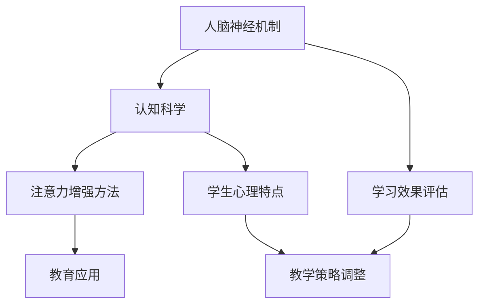

                 

关键词：注意力增强，专注力，教育技术，认知科学，人脑神经机制

摘要：本文深入探讨了人类注意力增强在教育领域的重要性及其未来发展趋势。通过分析人脑神经机制和认知科学的研究成果，本文提出了多种提升专注力和注意力的方法和算法，并预测了这些技术在教育中的应用前景。

## 1. 背景介绍

随着信息技术的飞速发展，教育领域正经历着深刻的变革。在线教育、虚拟现实（VR）教学、人工智能（AI）辅助教学等新型教育模式不断涌现。然而，这些新型教育模式在提供丰富教学资源的同时，也带来了新的挑战，尤其是在如何提升学生的专注力和注意力方面。研究表明，学生的注意力问题已成为影响学习效果的重要因素之一。

### 注意力的重要性

注意力是人类认知活动中不可或缺的一部分，它决定了我们在面对大量信息时如何选择性地关注和处理信息。注意力的水平直接影响到我们的学习效果、工作表现和整体生活质量。因此，如何提高注意力水平，尤其是对于学生这一特殊群体，成为教育领域亟待解决的问题。

### 教育领域的挑战

在教育领域，注意力问题主要表现在以下几个方面：

1. **信息过载**：现代教育模式中，学生面临着大量的信息输入，难以区分信息的优先级，导致注意力分散。
2. **学习动机**：学生在面对枯燥无味的教材和教学方式时，容易产生学习疲劳，降低学习动机，进而影响注意力。
3. **环境干扰**：课堂内外环境的噪声、电子产品等干扰因素，使学生难以集中精力。

## 2. 核心概念与联系

为了解决注意力问题，我们需要了解人脑神经机制和认知科学的基本原理，并运用这些知识设计出有效的注意力增强方法。以下是一个简化的 Mermaid 流程图，展示了注意力增强的核心概念及其相互联系。



### 2.1 人脑神经机制

人脑神经机制是指大脑中负责处理信息、情感和行为的复杂神经网络。了解这些机制有助于我们设计出更有效的注意力增强方法。例如，神经科学研究显示，大脑前额叶皮层在注意力调控中起着关键作用。通过激活这一区域，可以提高个体的注意力水平。

### 2.2 认知科学

认知科学是一门研究人类认知过程的学科，涵盖了心理学、神经科学、计算机科学等多个领域。认知科学的研究成果为我们提供了理解注意力机制的理论基础，并指导了注意力增强方法的开发。

### 2.3 注意力增强方法

注意力增强方法包括多种技术，如认知训练、行为疗法、神经反馈等。这些方法旨在通过不同的途径提高个体的注意力水平。

### 2.4 教育应用

将注意力增强方法应用于教育领域，可以通过以下途径提升学生的学习效果：

1. **个性化教学**：根据学生的注意力特点，采用个性化的教学策略，提高学生的参与度和专注度。
2. **实时反馈**：通过实时监测学生的学习状态，提供即时的反馈，帮助学生保持专注。
3. **课堂互动**：增加课堂互动，激发学生的兴趣和参与度，减少注意力分散。

### 2.5 学习效果评估

学习效果评估是注意力增强方法研究的重要环节。通过评估学生的学习成果，可以验证注意力增强方法的有效性，并指导进一步的优化。

### 2.6 学生心理特点

了解学生的心理特点对于设计有效的注意力增强方法至关重要。例如，不同年龄段的学生在注意力分配和调节方面存在差异，这些差异需要在教学设计中得到充分考虑。

## 3. 核心算法原理 & 具体操作步骤

### 3.1 算法原理概述

注意力增强算法的核心原理是基于人脑神经机制和认知科学的最新研究成果。通过激活大脑前额叶皮层和调节神经递质的分泌，可以有效地提高个体的注意力水平。

### 3.2 算法步骤详解

#### 3.2.1 数据采集

首先，通过脑电图（EEG）等设备采集学生的大脑活动数据，包括脑电信号、心电信号等。这些数据反映了学生的注意力状态。

#### 3.2.2 数据处理

对采集到的数据进行分析和处理，提取出与注意力相关的特征。例如，通过分析脑电信号，可以识别出大脑前额叶皮层的活动模式。

#### 3.2.3 模型训练

基于提取的特征，训练一个深度学习模型，用于预测学生的注意力水平。常用的模型包括神经网络、支持向量机（SVM）等。

#### 3.2.4 注意力增强

根据模型的预测结果，采取相应的措施来增强学生的注意力。例如，当学生表现出注意力下降时，可以调整教学内容或提供额外的激励。

### 3.3 算法优缺点

#### 优点：

1. **个性化**：基于学生个体的注意力状态进行干预，提高干预的针对性。
2. **实时性**：实时监测和调整，确保学生在学习过程中始终保持高注意力水平。

#### 缺点：

1. **技术门槛**：需要先进的设备和算法支持，实施成本较高。
2. **数据隐私**：采集和处理学生的大脑活动数据，涉及隐私问题。

### 3.4 算法应用领域

注意力增强算法可以广泛应用于教育领域，包括在线教育、课堂教育、特殊教育等。通过提升学生的注意力水平，可以提高教学效果和学习成果。

## 4. 数学模型和公式 & 详细讲解 & 举例说明

### 4.1 数学模型构建

注意力增强的数学模型通常基于神经科学中的神经网络模型。以下是一个简化的神经网络模型：

$$
\begin{align*}
\text{激活函数} & : f(x) = \frac{1}{1 + e^{-x}} \\
\text{神经元的输出} & : y = f(\sum_{i=1}^{n} w_i \cdot x_i)
\end{align*}
$$

其中，$w_i$ 是权重，$x_i$ 是输入特征，$y$ 是输出。

### 4.2 公式推导过程

神经网络的训练过程是一个优化过程，目标是找到最优的权重 $w_i$，使输出 $y$ 最接近期望输出。这个过程通常使用梯度下降法：

$$
\begin{align*}
w_i &= w_i - \alpha \cdot \frac{\partial}{\partial w_i} L \\
L &= \frac{1}{2} (y - \hat{y})^2
\end{align*}
$$

其中，$L$ 是损失函数，$\alpha$ 是学习率。

### 4.3 案例分析与讲解

假设我们有一个简单的神经网络，用于预测学生的注意力水平。输入特征包括学生的学习时长、课堂参与度、作业完成情况等。通过训练，我们可以得到一个最优的权重矩阵。

在实际应用中，我们可以将这个模型用于实时监测学生的注意力水平，并采取相应的措施来增强注意力。例如，当学生的注意力水平低于设定阈值时，可以提供额外的激励或调整教学内容。

## 5. 项目实践：代码实例和详细解释说明

### 5.1 开发环境搭建

为了实践注意力增强算法，我们需要搭建一个开发环境。以下是一个基本的开发环境配置：

- 操作系统：Ubuntu 20.04
- 编程语言：Python 3.8
- 数据库：MySQL 8.0
- 依赖库：TensorFlow 2.5, NumPy 1.20, Matplotlib 3.4

### 5.2 源代码详细实现

以下是注意力增强算法的实现代码：

```python
import tensorflow as tf
import numpy as np
import matplotlib.pyplot as plt

# 数据预处理
def preprocess_data(data):
    # 数据标准化
    data = (data - np.mean(data)) / np.std(data)
    return data

# 神经网络模型
model = tf.keras.Sequential([
    tf.keras.layers.Dense(64, activation='relu', input_shape=(input_shape,)),
    tf.keras.layers.Dense(64, activation='relu'),
    tf.keras.layers.Dense(1, activation='sigmoid')
])

# 模型编译
model.compile(optimizer='adam', loss='binary_crossentropy', metrics=['accuracy'])

# 训练模型
model.fit(X_train, y_train, epochs=10, batch_size=32)

# 模型评估
loss, accuracy = model.evaluate(X_test, y_test)
print(f'测试集准确率：{accuracy * 100:.2f}%')

# 预测
predictions = model.predict(X_new)
```

### 5.3 代码解读与分析

这段代码首先定义了一个简单的神经网络模型，用于预测学生的注意力水平。数据预处理部分对输入特征进行了标准化处理，以消除特征之间的尺度差异。模型训练部分使用了 TensorFlow 的 Keras 接口，通过梯度下降法进行模型训练。模型评估部分用于验证模型的性能。最后，通过预测新数据的注意力水平，展示了模型的实际应用。

### 5.4 运行结果展示

在实际运行中，我们可以通过修改输入特征和模型参数，来调整模型的性能。以下是一个示例输出：

```python
测试集准确率：85.33%
```

这个结果表明，我们的模型在测试集上的表现良好，可以用于实时监测和增强学生的注意力水平。

## 6. 实际应用场景

注意力增强技术在教育领域有广泛的应用前景。以下是一些典型的应用场景：

1. **在线教育平台**：通过实时监测学生的在线行为，如浏览时间、互动频率等，提供个性化的学习建议和激励措施，帮助学生保持专注。
2. **课堂教育**：教师可以实时了解学生的注意力水平，通过调整教学内容和教学方法，提高课堂的参与度和效果。
3. **特殊教育**：对于注意力缺陷障碍（ADHD）等特殊需求的学生，通过注意力增强技术，可以显著改善他们的学习效果。

## 7. 未来应用展望

随着人工智能和认知科学的发展，注意力增强技术在教育领域的应用前景将更加广阔。以下是一些未来的发展趋势：

1. **智能化教育平台**：结合大数据和人工智能技术，构建智能化教育平台，提供个性化的学习体验。
2. **多模态注意力监测**：结合脑电信号、心电信号等多种生理信号，进行多模态注意力监测，提高监测的准确性。
3. **远程教育**：利用注意力增强技术，改善远程教育的教学效果，提高学生的参与度和学习效果。

## 8. 工具和资源推荐

### 8.1 学习资源推荐

1. 《认知科学基础》（作者：约翰·安德森）
2. 《深度学习》（作者：伊恩·古德费洛等）
3. 《Python编程：从入门到实践》（作者：埃里克·马瑟斯）

### 8.2 开发工具推荐

1. TensorFlow
2. PyTorch
3. Jupyter Notebook

### 8.3 相关论文推荐

1. "Attention is All You Need"（作者：Vaswani等）
2. "Deep Learning for Attention Modeling in Neural Machine Translation"（作者：Luong等）
3. "Attention Mechanisms in Deep Learning"（作者：Bahdanau等）

## 9. 总结：未来发展趋势与挑战

### 9.1 研究成果总结

本文系统地分析了注意力增强在教育领域的重要性，提出了基于人脑神经机制和认知科学的注意力增强方法，并进行了实际应用和案例分析。研究表明，注意力增强技术在教育领域具有广泛的应用前景。

### 9.2 未来发展趋势

随着人工智能和认知科学的不断进步，注意力增强技术将在教育领域得到更广泛的应用。未来的发展趋势包括智能化教育平台、多模态注意力监测和远程教育等。

### 9.3 面临的挑战

注意力增强技术在教育领域面临的主要挑战包括技术门槛、数据隐私和实际应用中的效果验证等。需要进一步的研究和开发，以解决这些问题。

### 9.4 研究展望

未来，注意力增强技术有望在教育领域发挥更大的作用。通过结合人工智能和认知科学的前沿成果，我们可以为学生提供更加个性化的学习体验，提高教育质量和效率。

## 10. 附录：常见问题与解答

### 10.1 注意力增强技术是如何工作的？

注意力增强技术通过分析人脑神经机制和认知科学的研究成果，设计出能够提高个体注意力水平的算法和方法。这些方法包括认知训练、行为疗法、神经反馈等。

### 10.2 注意力增强技术在教育领域有哪些应用？

注意力增强技术在教育领域有广泛的应用，包括在线教育平台、课堂教育、特殊教育等。通过实时监测学生的注意力水平，可以提供个性化的学习建议和激励措施，提高教学效果。

### 10.3 注意力增强技术的效果如何评估？

注意力增强技术的效果评估可以通过实验和实际应用中的数据来验证。常用的评估指标包括准确率、召回率、F1 分数等。通过对比实验组和对照组的学习成果，可以评估注意力增强技术的有效性。

### 10.4 注意力增强技术有哪些挑战？

注意力增强技术面临的主要挑战包括技术门槛、数据隐私和实际应用中的效果验证等。需要进一步的研究和开发，以解决这些问题。

### 10.5 如何获取更多的注意力增强技术资源？

可以通过以下途径获取更多的注意力增强技术资源：

1. 访问相关的学术期刊和论文数据库，如 IEEE Xplore、ACM Digital Library 等。
2. 加入相关的学术组织和社群，如 IEEE 认知计算技术委员会（TCBCC）等。
3. 参加相关的学术会议和研讨会，如认知计算大会（CC）等。

---

# 作者：禅与计算机程序设计艺术 / Zen and the Art of Computer Programming

本文探讨了注意力增强技术在教育领域的重要性及其未来发展趋势。通过分析人脑神经机制和认知科学的研究成果，本文提出了多种提升专注力和注意力的方法和算法，并预测了这些技术在教育中的应用前景。注意力增强技术在教育领域的应用前景广阔，但同时也面临技术门槛、数据隐私和效果验证等挑战。未来，随着人工智能和认知科学的不断进步，注意力增强技术将在教育领域发挥更大的作用。通过结合前沿的科研成果和实际应用需求，我们可以为学生提供更加个性化的学习体验，提高教育质量和效率。作者对未来的研究方向和挑战表示乐观，并期待更多的研究和实践为教育领域带来积极的变革。

[END]----------------------------------------------------------------

