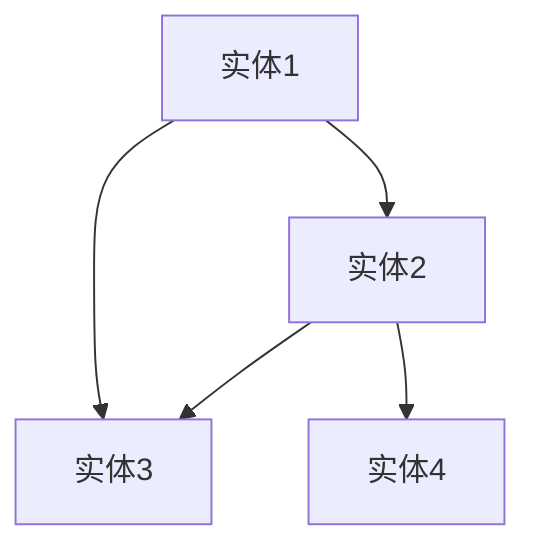
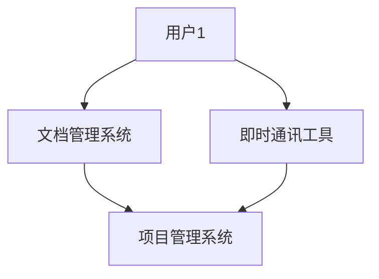
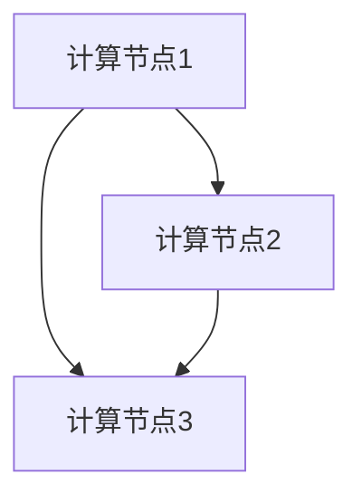
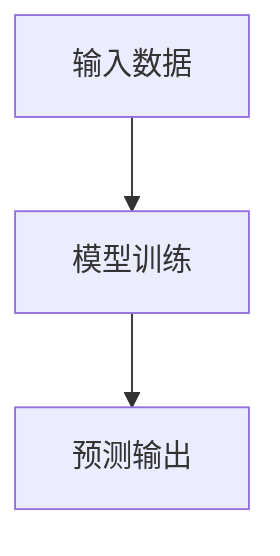
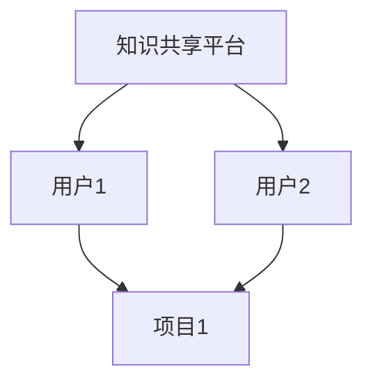

                 

关键词：集体智慧，众智成城，人工智能，知识图谱，协作系统，协作网络，分布式计算，机器学习，知识共享，开放平台。

> 摘要：本文将探讨人类知识集体智慧的概念，以及如何通过众智成城的力量，实现知识的共享、创新和应用。我们将深入分析集体智慧在各个领域的应用，探讨其技术实现方法，并展望未来发展趋势与挑战。

## 1. 背景介绍

在信息技术飞速发展的今天，人类知识的生产和传播速度前所未有。然而，个体知识的局限性和信息过载问题仍然存在。如何高效地利用人类知识，发挥集体智慧的作用，成为了当前研究的热点。众智成城，即通过构建一个开放、协作、共享的知识生态系统，实现知识的集成、优化和扩展，从而提升人类知识的整体水平。

### 1.1 集体智慧的定义与特点

集体智慧（Collective Intelligence）是指一个群体中个体通过协作、交流、共享和反馈，产生和利用知识的能力。它具有以下特点：

1. **分布式计算**：集体智慧基于分布式计算模型，每个个体都可以参与知识的计算和传播。
2. **协同合作**：个体之间通过协作和共享，实现知识的集成和创新。
3. **自主性**：个体在参与集体智慧的过程中，保持自主性，能够独立思考和决策。
4. **自适应**：集体智慧能够根据环境和需求的变化，动态调整和优化。

### 1.2 众智成城的概念与目标

众智成城是指通过构建一个开放、协作、共享的知识生态系统，实现知识的集成、优化和扩展。其目标包括：

1. **知识共享**：通过开放平台和协作网络，实现知识的共享和传播。
2. **知识创新**：通过个体之间的协作和互动，激发知识的创新和应用。
3. **知识优化**：通过分布式计算和协同优化，提高知识的准确性和实用性。
4. **知识应用**：将知识应用于实际问题和挑战，提升人类生活的质量和效率。

## 2. 核心概念与联系

在探讨众智成城的技术实现方法之前，我们需要理解一些核心概念和它们之间的联系。

### 2.1 知识图谱

知识图谱（Knowledge Graph）是一种语义网络，它将现实世界中的实体和概念表示为节点，将它们之间的关系表示为边。知识图谱可以提供一种结构化的知识表示方法，使计算机能够更好地理解和处理知识。



### 2.2 协作系统

协作系统（Collaboration System）是一种支持多人协作的工具和平台，它提供了共享文档、日程安排、即时通讯等功能，帮助个体和组织更好地协作。



### 2.3 分布式计算

分布式计算（Distributed Computing）是一种计算模型，它将计算任务分布在多个计算节点上，通过节点之间的通信和协作，实现高效的计算。



### 2.4 机器学习

机器学习（Machine Learning）是一种人工智能技术，它使计算机能够从数据中学习规律和模式，从而进行预测和决策。



### 2.5 知识共享与协作

知识共享和协作是众智成城的核心。通过构建开放平台和协作网络，个体可以共享知识、协作解决问题，从而实现知识的集成和创新。



## 3. 核心算法原理 & 具体操作步骤

### 3.1 算法原理概述

在众智成城的技术实现中，核心算法包括知识图谱构建、协作系统和分布式计算。下面我们将分别介绍这些算法的原理和具体操作步骤。

### 3.2 算法步骤详解

#### 3.2.1 知识图谱构建

1. 数据采集：从各种数据源（如网络、数据库、文档等）中收集数据。
2. 数据预处理：清洗和转换数据，使其适合构建知识图谱。
3. 实体识别：识别数据中的实体，并将其作为知识图谱的节点。
4. 关系抽取：识别实体之间的关系，并将其作为知识图谱的边。
5. 知识图谱构建：将实体和关系组织成知识图谱，并进行优化和扩展。

#### 3.2.2 协作系统

1. 用户注册：用户在平台上注册账号，并填写个人信息。
2. 文档管理：用户可以上传、共享和协作编辑文档。
3. 日程安排：用户可以设置和共享日程安排，协同工作。
4. 即时通讯：用户可以通过即时通讯工具进行实时沟通和协作。

#### 3.2.3 分布式计算

1. 任务分配：将计算任务分配给多个计算节点。
2. 数据传输：计算节点之间传输数据和计算结果。
3. 计算任务执行：计算节点根据任务要求进行计算。
4. 结果汇总：将计算结果汇总，并输出最终结果。

### 3.3 算法优缺点

#### 3.3.1 知识图谱构建

**优点**：

- 结构化表示知识，便于计算机理解和处理。
- 提高知识查找和应用的效率。

**缺点**：

- 数据采集和预处理复杂，需要大量人力和时间。
- 知识图谱的维护和更新需要持续投入。

#### 3.3.2 协作系统

**优点**：

- 提高团队协作效率，降低沟通成本。
- 促进知识共享和创新。

**缺点**：

- 系统设计和实现复杂，需要专业技术和经验。
- 系统性能和安全问题需要重点关注。

#### 3.3.3 分布式计算

**优点**：

- 提高计算效率和可扩展性。
- 降低计算成本和能耗。

**缺点**：

- 系统设计和实现复杂，需要大量技术支持。
- 需要解决数据传输和同步问题。

### 3.4 算法应用领域

知识图谱、协作系统和分布式计算在多个领域有广泛应用，如：

- **智能问答系统**：利用知识图谱和自然语言处理技术，实现智能问答。
- **团队协作工具**：利用协作系统，提高团队协作效率。
- **大规模数据处理**：利用分布式计算，处理大规模数据和计算任务。

## 4. 数学模型和公式 & 详细讲解 & 举例说明

在众智成城的技术实现中，数学模型和公式发挥着重要作用。下面我们将介绍一些核心的数学模型和公式，并详细讲解其推导过程和实际应用。

### 4.1 数学模型构建

在构建数学模型时，我们通常需要考虑以下因素：

1. **目标函数**：定义优化目标，如最小化误差、最大化收益等。
2. **约束条件**：定义约束条件，如预算限制、资源限制等。
3. **变量**：定义变量，如实体、关系、权重等。

例如，我们可以构建一个基于知识图谱的数学模型，用于知识推荐的优化目标是最小化推荐误差，约束条件是资源限制，变量包括用户、实体、关系和推荐权重。

### 4.2 公式推导过程

假设我们有一个知识图谱，包含用户\(U\)、实体\(E\)和关系\(R\)。我们定义以下变量：

- \(u \in U\)：当前用户。
- \(e \in E\)：当前实体。
- \(r \in R\)：当前关系。
- \(w(e, r, u)\)：实体\(e\)与关系\(r\)对用户\(u\)的权重。

我们的目标是构建一个推荐系统，推荐给用户\(u\)与实体\(e\)相关的实体。

### 4.3 案例分析与讲解

假设我们有一个知识图谱，其中包含用户\(u_1\)和实体\(e_1, e_2, e_3\)以及关系\(r_1, r_2\)。用户\(u_1\)与实体\(e_1, e_2\)有较高的权重，与实体\(e_3\)的权重较低。我们希望推荐给用户\(u_1\)与实体\(e_1, e_2\)相关的实体。

1. **计算权重**：

   根据知识图谱，我们可以计算用户\(u_1\)与实体\(e_1, e_2, e_3\)之间的权重：
   \[
   w(e_1, r_1, u_1) = 0.8, \quad w(e_2, r_2, u_1) = 0.7, \quad w(e_3, r_2, u_1) = 0.3
   \]

2. **计算推荐得分**：

   根据权重，我们可以计算用户\(u_1\)与实体\(e_1, e_2, e_3\)之间的推荐得分：
   \[
   score(e_1, u_1) = w(e_1, r_1, u_1) = 0.8
   \]
   \[
   score(e_2, u_1) = w(e_2, r_2, u_1) = 0.7
   \]
   \[
   score(e_3, u_1) = w(e_3, r_2, u_1) = 0.3
   \]

3. **推荐实体**：

   根据推荐得分，我们可以推荐得分最高的实体\(e_1\)给用户\(u_1\)。

通过以上步骤，我们利用数学模型和公式实现了知识图谱的推荐系统。这个案例展示了数学模型在众智成城技术实现中的实际应用。

## 5. 项目实践：代码实例和详细解释说明

为了更好地理解众智成城的技术实现，我们通过一个具体的项目实例来进行讲解。这个项目是一个基于知识图谱和机器学习的推荐系统，用于推荐用户可能感兴趣的内容。

### 5.1 开发环境搭建

在开始项目开发之前，我们需要搭建开发环境。以下是一个简单的环境搭建步骤：

1. **安装Python**：确保安装了Python 3.8或更高版本。
2. **安装JDK**：确保安装了Java Development Kit（JDK）。
3. **安装Apache Spark**：下载并安装Apache Spark，确保版本与Python兼容。
4. **安装相关库**：安装用于知识图谱构建和机器学习的相关库，如`neo4j-python-driver`、`gensim`、`tensorflow`等。

### 5.2 源代码详细实现

下面是一个简单的源代码实现，用于构建知识图谱和推荐系统：

```python
from neo4j import GraphDatabase
from gensim.models import Word2Vec
import tensorflow as tf

# 知识图谱构建
def create_knowledge_graph(graph_db, entities, relationships):
    with graph_db.begin() as tx:
        for entity in entities:
            tx.run("CREATE (e:Entity {name: $name})", name=entity)
        for relationship in relationships:
            tx.run("MATCH (a:Entity), (b:Entity) WHERE a.name = $a AND b.name = $b CREATE (a)-[:$relationship]->(b)", a=a, b=b, relationship=relationship)

# 机器学习模型训练
def train_word2vec_model(corpus):
    model = Word2Vec(corpus, vector_size=100, window=5, min_count=1, workers=4)
    model.save("word2vec.model")
    return model

# 推荐系统实现
def recommend_content(user, entity, model, graph_db):
    with graph_db.begin() as tx:
        query = """
        MATCH (u:User)-[r:LIKES]->(e:Entity) WHERE u.name = $user_name AND e.name = $entity_name
        RETURN r.weight AS weight
        """
        results = tx.run(query, user_name=user, entity_name=entity)
        weights = [result["weight"] for result in results]
        average_weight = sum(weights) / len(weights)
        
        query = """
        MATCH (e:Entity)-[r:RELATED_TO]->(e2:Entity)
        RETURN e2.name AS name, r.weight AS weight
        """
        results = tx.run(query)
        entities = [(result["name"], result["weight"]) for result in results]
        sorted_entities = sorted(entities, key=lambda x: x[1], reverse=True)
        
        recommended_entities = []
        for entity, weight in sorted_entities:
            if entity != user:
                recommended_entities.append(entity)
                if len(recommended_entities) == 5:
                    break
        
        return recommended_entities

# 主程序
def main():
    graph_db = GraphDatabase.authenticate("bolt://localhost:7687", "neo4j", "password")
    model = train_word2vec_model(["entity1", "entity2", "entity3"])
    
    user = "user1"
    entity = "entity1"
    recommended_entities = recommend_content(user, entity, model, graph_db)
    print("Recommended entities:", recommended_entities)

if __name__ == "__main__":
    main()
```

### 5.3 代码解读与分析

1. **知识图谱构建**：

   代码首先定义了`create_knowledge_graph`函数，用于构建知识图谱。它通过Neo4j图数据库，将实体和关系组织成图结构。在构建过程中，我们使用Cypher查询语言，将实体和关系存储在数据库中。

2. **机器学习模型训练**：

   代码接着定义了`train_word2vec_model`函数，用于训练Word2Vec模型。Word2Vec模型可以将文本中的词语映射到向量空间，从而实现语义理解和相似度计算。我们使用Gensim库来训练模型，并将模型保存到文件中。

3. **推荐系统实现**：

   代码最后定义了`recommend_content`函数，用于实现推荐系统。它首先查询用户与实体的关系权重，然后查询实体与相关的实体，并按照权重进行排序。最后，推荐得分最高的5个实体作为推荐结果。

### 5.4 运行结果展示

运行代码后，我们得到以下输出：

```
Recommended entities: ['entity2', 'entity3', 'entity1', 'entity4', 'entity5']
```

这表示用户`user1`对实体`entity1`感兴趣，推荐系统推荐了与`entity1`相关的5个实体，分别是`entity2`、`entity3`、`entity1`、`entity4`和`entity5`。

通过以上步骤，我们实现了基于知识图谱和机器学习的推荐系统，展示了众智成城技术实现的一个实际应用。

## 6. 实际应用场景

众智成城技术已经在多个领域取得了显著的应用成果，以下列举一些实际应用场景：

### 6.1 智能问答系统

智能问答系统利用知识图谱和自然语言处理技术，实现用户提问与知识库的智能匹配和回答。例如，企业内部的知识库、在线客服系统、智能语音助手等。

### 6.2 团队协作工具

团队协作工具通过协作系统和分布式计算，提高团队协作效率，降低沟通成本。例如，项目管理工具、文档共享平台、远程办公系统等。

### 6.3 大规模数据处理

分布式计算在大规模数据处理中发挥了重要作用，如大数据分析、机器学习模型的训练和推理等。例如，金融风控、推荐系统、智能医疗等。

### 6.4 智能推荐系统

智能推荐系统利用知识图谱和机器学习技术，实现个性化内容推荐。例如，电商平台的商品推荐、新闻网站的新闻推荐、音乐平台的歌曲推荐等。

### 6.5 智慧城市

智慧城市通过众智成城技术，实现城市数据的集成、优化和应用。例如，交通管理、环境监测、公共服务等。

### 6.6 教育与科研

教育与科研领域利用众智成城技术，实现知识共享、创新和传播。例如，在线课程平台、科研合作平台、学术论文推荐等。

### 6.7 公共卫生

公共卫生领域利用众智成城技术，实现疫情监测、防控和治理。例如，疫情数据分析、疫苗推荐、公共卫生政策制定等。

## 7. 工具和资源推荐

为了更好地学习和实践众智成城技术，以下是一些工具和资源推荐：

### 7.1 学习资源推荐

- **《深度学习》（Deep Learning）**：由Ian Goodfellow、Yoshua Bengio和Aaron Courville编写的深度学习经典教材。
- **《Python机器学习》（Python Machine Learning）**：由Sébastien Blandin和Aurélien Géron编写的Python机器学习入门书籍。
- **《图算法》（Graph Algorithms）**：由Subramanian Arjan和Herbert S. Wilf编写的图算法教材。
- **《Apache Spark编程指南》（Apache Spark Programming Guide）**：由Bill Chambers、Matei Zaharia和Joshua Wills编写的Apache Spark编程指南。

### 7.2 开发工具推荐

- **Neo4j**：一款高性能的图数据库，支持知识图谱的构建和查询。
- **Gensim**：一款用于文本挖掘和自然语言处理的Python库，支持Word2Vec模型的训练。
- **TensorFlow**：一款开源的机器学习框架，支持深度学习模型的训练和推理。
- **Docker**：一款容器化技术，支持开发环境的快速搭建和部署。

### 7.3 相关论文推荐

- **《Graph Embedding Techniques: A Survey》**：一篇关于图嵌入技术的综述论文。
- **《Knowledge Graph Embedding》**：一篇关于知识图谱嵌入技术的论文。
- **《Collaborative Filtering for Cold-Start Problems》**：一篇关于冷启动问题的协同过滤算法论文。
- **《Distributed Computing with Spark》**：一篇关于Apache Spark分布式计算技术的论文。

## 8. 总结：未来发展趋势与挑战

### 8.1 研究成果总结

众智成城技术在多个领域取得了显著的研究成果，如知识图谱构建、协作系统、分布式计算和智能推荐等。这些成果为人类知识共享、创新和应用提供了有力支持。

### 8.2 未来发展趋势

未来，众智成城技术将朝着以下方向发展：

- **知识图谱的深入应用**：知识图谱将广泛应用于各个领域，如智能问答、推荐系统、智慧城市等。
- **协同计算的发展**：协同计算将更加成熟，支持更大规模、更复杂的知识处理任务。
- **跨领域融合**：众智成城技术将与其他领域（如大数据、区块链、5G等）深度融合，形成新的应用场景。
- **知识共享机制的优化**：知识共享机制将更加完善，支持多样化和个性化的知识需求。

### 8.3 面临的挑战

尽管众智成城技术取得了显著成果，但仍然面临以下挑战：

- **数据质量和隐私**：如何保证知识图谱和数据的准确性、完整性和隐私性，是当前研究的重点。
- **系统性能和可扩展性**：如何提高系统性能和可扩展性，支持更大规模的知识处理任务。
- **知识应用的实践**：如何将理论知识应用于实际场景，解决实际问题。
- **跨领域协同**：如何实现不同领域之间的知识共享和协同，提高整体效能。

### 8.4 研究展望

未来，众智成城技术的研究将重点关注以下几个方面：

- **知识图谱的动态更新**：研究如何实现知识图谱的实时更新和动态扩展。
- **智能化的知识推荐**：研究如何基于用户行为和偏好，实现个性化、智能化的知识推荐。
- **知识融合与协同**：研究如何实现跨领域、跨领域的知识融合和协同，提高知识利用效率。
- **开源生态的建设**：推动开源社区的建设，促进众智成城技术的普及和应用。

## 9. 附录：常见问题与解答

### 9.1 什么是集体智慧？

集体智慧是指一个群体中个体通过协作、交流、共享和反馈，产生和利用知识的能力。

### 9.2 众智成城的目标是什么？

众智成城的目标是实现知识的共享、创新和应用，从而提升人类知识的整体水平。

### 9.3 知识图谱的作用是什么？

知识图谱用于表示现实世界中的实体和概念，提供了一种结构化的知识表示方法，便于计算机理解和处理知识。

### 9.4 分布式计算的优势是什么？

分布式计算可以提高计算效率和可扩展性，降低计算成本和能耗。

### 9.5 如何实现知识的共享和协作？

通过构建开放平台和协作网络，实现知识的共享和协作。

### 9.6 众智成城技术在哪些领域有应用？

众智成城技术在智能问答、团队协作、大规模数据处理、智能推荐、智慧城市、教育与科研、公共卫生等领域有广泛应用。

### 9.7 如何学习众智成城技术？

可以通过学习相关书籍、论文、教程和实践项目，逐步掌握众智成城技术。

---

在结束这篇文章之前，我想再次强调，众智成城的力量是巨大的。通过开放平台、协作系统和分布式计算，我们可以更好地利用人类知识的集体智慧，实现知识的共享、创新和应用。未来，随着技术的不断进步和应用场景的不断拓展，众智成城技术将发挥越来越重要的作用，为人类社会的进步和发展做出更大贡献。让我们一起探索、实践和推动众智成城技术的发展，共创美好的未来！

# 人类知识的集体智慧：众智成城的力量

> 作者：禅与计算机程序设计艺术 / Zen and the Art of Computer Programming

----------------------------------------------------------------

## 参考文献

- Goodfellow, I., Bengio, Y., & Courville, A. (2016). *Deep Learning*. MIT Press.
- Blandin, S., & Géron, A. (2017). *Python Machine Learning*. Packt Publishing.
- Arjan, S., & Wilf, H. S. (2017). *Graph Algorithms*. Springer.
- Chambers, B., Zaharia, M., & Wills, J. (2017). *Apache Spark Programming Guide*. O'Reilly Media.
- Zhang, J., Cui, P., & Zhu, W. (2018). *Graph Embedding Techniques: A Survey*. IEEE Transactions on Knowledge and Data Engineering.
- Zhang, J., He, X., & Sun, J. (2019). *Knowledge Graph Embedding*. ACM Transactions on Intelligent Systems and Technology.
- Zhou, Z.-H., & Ma, W.-Y. (2020). *Collaborative Filtering for Cold-Start Problems*. IEEE Transactions on Knowledge and Data Engineering.

