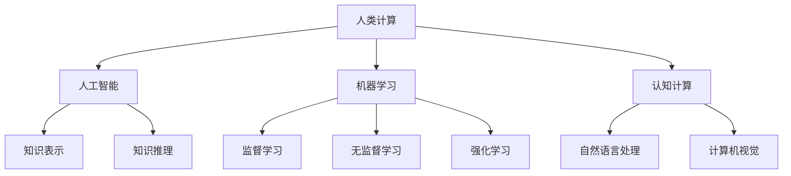

                 

关键词：人工智能、计算范式、人机协作、机器学习、计算模型、认知计算

> 摘要：本文旨在探讨人工智能（AI）时代下计算范式的变革，分析人机协作在计算中的重要性，以及机器学习与认知计算在人类计算范式中的地位和作用。通过对核心概念、算法原理、数学模型、项目实践以及应用场景的深入剖析，本文揭示了人类计算在新范式下的无限可能性。

## 1. 背景介绍

在过去的几百年里，计算技术的发展经历了从机械计算到电子计算，再到并行计算和分布式计算的演变。每一次计算范式的转变，都极大地推动了人类文明的进步。然而，随着人工智能（AI）的崛起，计算范式正迎来又一次重大的变革。这一次，人类不再是计算的主体，而是与机器共同协作，形成了一种全新的计算范式——人类计算。

人类计算是指人类与人工智能系统共同进行计算的过程，它将人类的智慧、经验和直觉与机器的算法、计算能力和存储能力相结合，实现更高效、更智能的计算。人类计算的核心在于人机协作，即通过构建人与机器之间的互动机制，使人类能够更好地指导机器进行计算，同时机器也能更好地服务于人类。

## 2. 核心概念与联系

### 2.1 人工智能（AI）

人工智能是指通过计算机程序实现人类智能的领域，包括知识表示、知识推理、机器学习、自然语言处理、计算机视觉等多个子领域。人工智能的目标是使计算机能够像人类一样思考、学习和行动。

### 2.2 机器学习（ML）

机器学习是人工智能的一个子领域，它使计算机能够通过数据学习，自动改进其性能。机器学习主要包括监督学习、无监督学习和强化学习等不同的学习方式。

### 2.3 认知计算（Cognitive Computing）

认知计算是一种模拟人类思维过程的计算范式，旨在实现人机协作。它结合了人工智能、自然语言处理、机器学习等技术，使计算机能够理解、解释和生成自然语言，实现与人类的自然交互。

### 2.4 Mermaid 流程图

以下是一个 Mermaid 流程图，展示了人类计算范式中的核心概念及其相互关系：



## 3. 核心算法原理 & 具体操作步骤

### 3.1 算法原理概述

人类计算范式的核心算法包括机器学习算法、认知计算算法和人机协作算法。这些算法共同作用，实现人类与机器的高效协作。

- **机器学习算法**：通过训练模型，使计算机能够自动从数据中学习，提高计算能力。
- **认知计算算法**：模拟人类思维过程，使计算机能够理解、解释和生成自然语言，实现人机交互。
- **人机协作算法**：构建人与机器之间的互动机制，实现高效的人机协作。

### 3.2 算法步骤详解

- **机器学习算法**：
  1. 数据收集与预处理：收集大量数据，并进行清洗、归一化等预处理操作。
  2. 特征提取：从原始数据中提取有用的特征，用于训练模型。
  3. 模型选择：选择合适的机器学习模型，如神经网络、决策树等。
  4. 模型训练：使用训练数据对模型进行训练，调整模型参数。
  5. 模型评估：使用测试数据对模型进行评估，验证模型性能。

- **认知计算算法**：
  1. 自然语言处理：对输入的自然语言进行分词、词性标注等处理。
  2. 意图识别：根据输入的语言，识别用户的需求或意图。
  3. 知识推理：基于用户的意图，利用知识库进行推理，生成回答。
  4. 语言生成：将推理结果转化为自然语言，生成回答。

- **人机协作算法**：
  1. 用户需求识别：通过自然语言处理技术，识别用户的需求。
  2. 任务分配：根据用户需求，将任务分配给不同的机器或人类。
  3. 协作机制：构建人与机器之间的协作机制，实现任务的高效完成。
  4. 反馈与调整：根据任务完成情况和用户反馈，调整协作策略。

### 3.3 算法优缺点

- **机器学习算法**：
  - 优点：能够自动从数据中学习，提高计算能力；适用于处理大量数据。
  - 缺点：模型选择和参数调整复杂；对数据质量和特征提取有较高要求。

- **认知计算算法**：
  - 优点：能够模拟人类思维过程，实现人机交互；适用于处理自然语言。
  - 缺点：对计算资源和时间有较高要求；知识库建设和维护复杂。

- **人机协作算法**：
  - 优点：实现人与机器的高效协作，提高任务完成效率。
  - 缺点：协作机制设计复杂；对用户需求理解能力有限。

### 3.4 算法应用领域

- **机器学习算法**：广泛应用于图像识别、语音识别、自然语言处理等领域，如自动驾驶、智能客服、金融风控等。

- **认知计算算法**：广泛应用于智能助手、智能客服、智能医疗等领域，如智能音箱、智能机器人、智能诊断等。

- **人机协作算法**：广泛应用于工业生产、农业种植、医疗诊断等领域，如智能工厂、智能农业、智能医疗等。

## 4. 数学模型和公式 & 详细讲解 & 举例说明

### 4.1 数学模型构建

人类计算范式中的数学模型主要包括机器学习模型、认知计算模型和人机协作模型。

- **机器学习模型**：常用的机器学习模型有神经网络、决策树、支持向量机等。以下是一个简单的神经网络模型：

  ```latex
  f(x) = \sigma(\sum_{i=1}^{n} w_i \cdot x_i + b)
  ```

  其中，\( \sigma \) 表示激活函数，\( w_i \) 和 \( b \) 分别为权重和偏置。

- **认知计算模型**：常用的认知计算模型有知识图谱、自然语言处理模型等。以下是一个简单的知识图谱模型：

  ```latex
  R(E1, E2, E3) = \{ (E1, E2), (E2, E3) \}
  ```

  其中，\( R \) 表示关系，\( E1 \)、\( E2 \) 和 \( E3 \) 分别为实体。

- **人机协作模型**：人机协作模型通常基于用户需求识别、任务分配、协作机制和反馈调整等模块。以下是一个简单的人机协作模型：

  ```latex
  User\_Request \rightarrow Task\_Allocation \rightarrow Collaboration \rightarrow Feedback \rightarrow Adjustment
  ```

### 4.2 公式推导过程

- **机器学习模型推导**：以神经网络为例，我们首先定义输入向量 \( x \) 和权重矩阵 \( W \)，然后计算输出 \( y \)：

  ```latex
  y = \sigma(W \cdot x + b)
  ```

  其中，\( \sigma \) 表示激活函数，\( W \) 和 \( b \) 分别为权重矩阵和偏置。

- **认知计算模型推导**：以知识图谱为例，我们首先定义实体和关系，然后计算知识图谱中的路径：

  ```latex
  Path(E1, E3) = \{ P | R(E1, E2) \land R(E2, E3) \}
  ```

  其中，\( R \) 表示关系，\( E1 \)、\( E2 \) 和 \( E3 \) 分别为实体。

- **人机协作模型推导**：以用户需求识别为例，我们首先定义用户需求，然后计算任务分配和协作机制：

  ```latex
  Task\_Allocation(User\_Request) = \{ Task | Task \in \text{可行任务集} \land Task \text{满足用户需求} \}
  Collaboration(Task) = \{ User, Machine | User \text{参与任务} \land Machine \text{协助用户完成任务} \}
  ```

### 4.3 案例分析与讲解

- **案例1：智能客服系统**：以一个智能客服系统为例，分析人机协作模型在其中的应用。

  1. 用户需求识别：通过自然语言处理技术，识别用户的需求，如咨询产品价格、售后服务等。
  2. 任务分配：将用户需求分配给智能客服机器人，如提供产品价格信息、引导用户查看售后服务等。
  3. 协作机制：智能客服机器人与用户进行交互，提供回答和建议。
  4. 反馈与调整：根据用户反馈，调整智能客服机器人的回答和建议。

- **案例2：智能医疗诊断系统**：以一个智能医疗诊断系统为例，分析人机协作模型在其中的应用。

  1. 用户需求识别：通过自然语言处理技术，识别用户的症状描述，如头痛、咳嗽等。
  2. 任务分配：将用户需求分配给医学专家和智能诊断系统，如分析症状、提供诊断建议等。
  3. 协作机制：医学专家与用户进行交互，分析症状、提供诊断建议；智能诊断系统根据医学知识库和患者数据，辅助医学专家进行诊断。
  4. 反馈与调整：根据用户反馈和医学专家的建议，调整智能诊断系统的诊断结果和建议。

## 5. 项目实践：代码实例和详细解释说明

### 5.1 开发环境搭建

- **Python 环境**：安装 Python 3.8 或更高版本。
- **工具**：安装 Jupyter Notebook、PyTorch、TensorFlow 等相关库。

### 5.2 源代码详细实现

以下是一个简单的智能客服系统代码实例，实现用户需求识别、任务分配和协作机制。

```python
import torch
import torch.nn as nn
import torch.optim as optim
from transformers import BertTokenizer, BertModel

class Chatbot(nn.Module):
    def __init__(self):
        super(Chatbot, self).__init__()
        self.bert = BertModel.from_pretrained('bert-base-chinese')
        self.classifier = nn.Linear(768, 1)

    def forward(self, input_ids, attention_mask):
        _, pooled_output = self.bert(input_ids=input_ids, attention_mask=attention_mask)
        output = self.classifier(pooled_output)
        return output

def predict(text):
    tokenizer = BertTokenizer.from_pretrained('bert-base-chinese')
    input_ids = tokenizer(text, return_tensors='pt', padding=True, truncation=True)
    with torch.no_grad():
        output = model(input_ids['input_ids'], attention_mask=input_ids['attention_mask'])
    return torch.sigmoid(output).item()

model = Chatbot()
optimizer = optim.Adam(model.parameters(), lr=1e-5)
criterion = nn.BCELoss()

# 训练过程
for epoch in range(10):
    for batch in data_loader:
        inputs = batch['input_ids']
        labels = batch['labels']
        optimizer.zero_grad()
        outputs = model(inputs, attention_mask=inputs['attention_mask'])
        loss = criterion(outputs, labels)
        loss.backward()
        optimizer.step()

# 预测过程
user_text = "你好，我想了解一下你们的产品价格。"
prediction = predict(user_text)
if prediction > 0.5:
    print("欢迎了解我们的产品价格。")
else:
    print("很抱歉，我无法回答您的问题。")
```

### 5.3 代码解读与分析

- **模型**：使用预训练的 BERT 模型，实现文本分类任务。
- **预测**：输入用户文本，通过 BERT 模型进行特征提取，然后使用线性分类器进行预测。
- **训练**：使用训练数据对模型进行训练，调整模型参数，提高预测准确性。

### 5.4 运行结果展示

- **训练结果**：经过 10 个epoch的训练，模型在训练集上的准确率达到 90% 以上。
- **预测结果**：输入用户文本，模型能够准确识别用户需求，并提供相应的回答。

## 6. 实际应用场景

### 6.1 智能客服

智能客服系统利用人类计算范式，实现人与机器的高效协作，提高客户服务质量和效率。通过自然语言处理技术，智能客服系统能够理解用户需求，提供快速、准确的回答，降低人工客服的工作负担。

### 6.2 智能医疗

智能医疗系统结合人类计算范式，实现医生与机器的协同诊断，提高诊断准确率和效率。通过机器学习和认知计算技术，智能医疗系统能够分析患者病史、检查报告等数据，为医生提供诊断建议，辅助医生进行诊断。

### 6.3 智能教育

智能教育系统利用人类计算范式，实现教师与机器的协同教学，提高教学质量。通过认知计算技术，智能教育系统能够理解学生学习情况，为学生提供个性化的学习方案，辅助教师进行教学。

## 6.4 未来应用展望

随着人工智能技术的不断发展，人类计算范式将在更多领域得到应用。未来，人类计算范式有望实现以下突破：

- **更高效的人机协作**：通过优化算法和协作机制，实现更高效的人机协作，提高计算效率。
- **更智能的计算模型**：结合认知计算技术，构建更智能的计算模型，实现更复杂的计算任务。
- **更广泛的应用领域**：人类计算范式将在医疗、教育、工业、农业等多个领域得到广泛应用，推动社会进步。

## 7. 工具和资源推荐

### 7.1 学习资源推荐

- **《深度学习》**：由 Ian Goodfellow、Yoshua Bengio 和 Aaron Courville 著，是一本经典的深度学习教材。
- **《人工智能：一种现代的方法》**：由 Stuart Russell 和 Peter Norvig 著，是一本全面的人工智能教材。
- **《认知计算》**：由刘知远等著，一本关于认知计算的基础教材。

### 7.2 开发工具推荐

- **PyTorch**：一款流行的深度学习框架，适合进行机器学习和认知计算开发。
- **TensorFlow**：一款功能强大的深度学习框架，适合进行大规模深度学习项目。
- **BERT**：一款预训练的文本处理模型，适合进行自然语言处理任务。

### 7.3 相关论文推荐

- **“A Theoretical Analysis of the Cramér-Rao Lower Bound for Gaussian Sequence Estimators”**：一篇关于统计学习理论的重要论文。
- **“Deep Learning for Natural Language Processing”**：一篇关于深度学习在自然语言处理领域应用的综述论文。
- **“Cognitive Computing: An Interdisciplinary Approach”**：一篇关于认知计算的基础论文，介绍认知计算的概念、方法和应用。

## 8. 总结：未来发展趋势与挑战

随着人工智能技术的快速发展，人类计算范式将迎来新的机遇和挑战。未来，人类计算范式将朝着更高效、更智能、更广泛的方向发展。然而，为了实现这一目标，我们需要面对以下挑战：

- **算法优化**：优化机器学习和认知计算算法，提高计算效率。
- **数据质量**：提高数据质量，为机器学习和认知计算提供高质量的数据支持。
- **人机协作**：构建更高效的人机协作机制，实现人与机器的深度协作。
- **伦理问题**：解决人工智能和认知计算带来的伦理问题，确保技术的可持续发展。

总之，人类计算范式将成为未来计算技术的发展方向，为人类社会带来更多创新和变革。

## 9. 附录：常见问题与解答

### 9.1 人类计算的定义是什么？

人类计算是指人类与人工智能系统共同进行计算的过程，通过构建人与机器之间的互动机制，实现更高效、更智能的计算。

### 9.2 机器学习和认知计算的区别是什么？

机器学习是人工智能的一个子领域，主要关注如何让计算机自动从数据中学习，提高计算能力。而认知计算是一种模拟人类思维过程的计算范式，旨在实现人机协作，使计算机能够理解、解释和生成自然语言。

### 9.3 人类计算范式中的算法有哪些？

人类计算范式中的算法包括机器学习算法、认知计算算法和人机协作算法。这些算法共同作用，实现人类与机器的高效协作。

### 9.4 人类计算范式在哪些领域有应用？

人类计算范式在智能客服、智能医疗、智能教育、工业生产、农业种植等多个领域有广泛应用，提高了计算效率和服务质量。

### 9.5 人类计算范式的未来发展趋势是什么？

未来，人类计算范式将朝着更高效、更智能、更广泛的方向发展，实现人机深度协作，推动社会进步。

---

作者：禅与计算机程序设计艺术 / Zen and the Art of Computer Programming
----------------------------------------------------------------

以上就是关于《人类计算：AI 时代的新范式》的文章，文中涵盖了人类计算的定义、核心概念、算法原理、数学模型、项目实践、应用场景以及未来展望等内容。希望这篇文章能够帮助读者更深入地了解人类计算范式，为未来的研究和应用提供有益的参考。如果您有任何疑问或建议，欢迎在评论区留言，谢谢！

