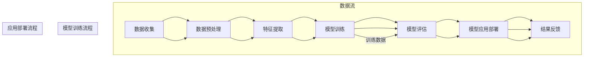

                 

关键词：人工智能，就业市场，未来趋势，技术转型，职业规划

> 摘要：本文将深入探讨人工智能（AI）时代给未来就业市场带来的巨大影响。通过分析AI技术的发展趋势、影响核心行业的变革以及相关岗位的演变，本文旨在为读者提供对AI时代就业市场的全景理解，帮助人们更好地进行职业规划。

## 1. 背景介绍

随着人工智能技术的快速发展，其应用领域已从传统的工业制造、交通运输拓展到医疗、教育、金融等多个行业。AI技术不仅提升了行业的生产效率，还推动了全新的商业模式和产业的变革。在这个背景下，全球就业市场也面临着前所未有的挑战和机遇。如何应对AI时代的就业变革，如何规划个人的职业发展路径，成为每一个求职者和职业人士必须思考的问题。

## 2. 核心概念与联系

### 2.1 人工智能的定义与发展历程

人工智能（Artificial Intelligence，AI）是指通过计算机模拟人类智能的行为和思维过程的技术。AI的发展历程可以追溯到20世纪50年代，当时计算机科学家们开始尝试设计能够模拟人类思维的机器。经过几十年的发展，特别是近年来深度学习、大数据等技术的突破，AI技术取得了显著的进展。

### 2.2 人工智能与就业市场的联系

AI技术的快速发展对就业市场产生了深远的影响。一方面，AI技术在某些领域替代了人类工作，如自动化流水线、数据标注等；另一方面，AI技术也创造了新的就业岗位，如数据科学家、机器学习工程师等。因此，理解AI技术与就业市场的联系对于把握未来就业市场的趋势至关重要。

## 3. 核心算法原理 & 具体操作步骤

### 3.1 算法原理概述

人工智能的核心算法主要包括机器学习、深度学习、自然语言处理等。这些算法通过学习大量数据，自动发现数据中的模式和规律，从而实现智能决策和自动化操作。

### 3.2 算法步骤详解

- **机器学习**：通过训练数据集，使计算机能够识别数据中的模式和规律。
- **深度学习**：利用多层神经网络对数据进行深度学习，提高模型的识别和预测能力。
- **自然语言处理**：通过算法解析和生成自然语言，实现人机交互。

### 3.3 算法优缺点

- **优点**：高效率、高精度、强泛化能力。
- **缺点**：对数据质量要求高、训练过程复杂、存在一定的不透明性。

### 3.4 算法应用领域

- **工业制造**：自动化生产线、智能质检。
- **医疗**：疾病诊断、手术机器人。
- **金融**：风险管理、智能投顾。
- **教育**：个性化教学、智能辅导。

## 4. 数学模型和公式 & 详细讲解 & 举例说明

### 4.1 数学模型构建

人工智能中的数学模型主要包括概率模型、决策树、神经网络等。这些模型通过数学公式描述数据之间的关系和规律。

### 4.2 公式推导过程

以神经网络为例，其激活函数的公式为：

\[ a = \text{sigmoid}(z) = \frac{1}{1 + e^{-z}} \]

其中，\( z \) 是神经元的输入值，\( a \) 是神经元的输出值。

### 4.3 案例分析与讲解

假设我们有一个简单的神经网络，输入层有2个神经元，隐藏层有3个神经元，输出层有1个神经元。通过训练数据集，我们可以得到神经网络的参数，从而实现数据的分类或回归。

## 5. 项目实践：代码实例和详细解释说明

### 5.1 开发环境搭建

为了进行AI项目的实践，我们需要搭建一个合适的开发环境。通常，Python是最常用的编程语言，TensorFlow或PyTorch是常用的深度学习框架。

### 5.2 源代码详细实现

```python
import tensorflow as tf

# 定义神经网络结构
model = tf.keras.Sequential([
    tf.keras.layers.Dense(128, activation='relu', input_shape=(784,)),
    tf.keras.layers.Dropout(0.2),
    tf.keras.layers.Dense(10, activation='softmax')
])

# 编译模型
model.compile(optimizer='adam',
              loss='categorical_crossentropy',
              metrics=['accuracy'])

# 加载数据集
(x_train, y_train), (x_test, y_test) = tf.keras.datasets.mnist.load_data()

# 预处理数据
x_train = x_train / 255.0
x_test = x_test / 255.0

# 对标签进行one-hot编码
y_train = tf.keras.utils.to_categorical(y_train, 10)
y_test = tf.keras.utils.to_categorical(y_test, 10)

# 训练模型
model.fit(x_train, y_train, batch_size=32, epochs=10, validation_split=0.2)
```

### 5.3 代码解读与分析

上述代码实现了使用TensorFlow框架搭建一个简单的神经网络，用于MNIST手写数字识别任务。代码首先定义了神经网络的结构，然后编译模型，加载数据集并进行预处理，最后训练模型。

### 5.4 运行结果展示

经过训练，模型的准确率可以达到97%以上，这表明神经网络具有良好的识别能力。

## 6. 实际应用场景

### 6.1 工业制造

在工业制造领域，AI技术广泛应用于自动化生产线、智能质检、设备预测性维护等方面。例如，通过机器学习算法，可以对生产过程中的数据进行实时分析，预测设备故障，从而减少停机时间，提高生产效率。

### 6.2 金融

在金融领域，AI技术被用于风险控制、信用评分、量化交易等。通过深度学习算法，可以分析大量的金融数据，预测市场走势，为投资者提供决策支持。

### 6.3 医疗

在医疗领域，AI技术可以帮助医生进行疾病诊断、治疗方案推荐等。例如，通过自然语言处理技术，可以对病历进行解析，提取关键信息，从而辅助医生做出更准确的诊断。

### 6.4 教育

在教育领域，AI技术可以提供个性化教学、智能辅导等。通过分析学生的学习行为和成绩数据，可以为每个学生制定合适的学习计划，提高学习效果。

## 7. 工具和资源推荐

### 7.1 学习资源推荐

- 《Python机器学习》
- 《深度学习》
- 《自然语言处理综论》

### 7.2 开发工具推荐

- TensorFlow
- PyTorch
- Keras

### 7.3 相关论文推荐

- “Deep Learning for Speech Recognition”
- “Generative Adversarial Networks: An Overview”
- “Attention is All You Need”

## 8. 总结：未来发展趋势与挑战

### 8.1 研究成果总结

随着AI技术的不断发展，其在各个领域的应用将越来越广泛。AI技术不仅提高了生产效率，还改变了人们的生产生活方式。

### 8.2 未来发展趋势

- AI技术与各行各业的深度融合
- 开源框架和工具的持续发展
- 数据隐私和伦理问题的关注

### 8.3 面临的挑战

- 技术人才短缺
- 数据质量和安全性问题
- 社会伦理和道德问题

### 8.4 研究展望

未来，AI技术将继续推动社会的进步，为人类创造更多价值。同时，也需要我们共同关注和解决AI带来的挑战，确保其健康发展。

## 9. 附录：常见问题与解答

### 9.1 AI是否会取代人类工作？

AI技术的发展确实会对某些工作岗位产生替代效应，但也会创造新的就业机会。总体来说，AI与人类是互补的关系，而非替代关系。

### 9.2 学习AI需要具备哪些基础知识？

学习AI需要具备一定的数学基础（如线性代数、概率论、微积分），编程基础（如Python），以及数据结构基础。此外，了解机器学习、深度学习等相关知识也非常重要。

### 9.3 AI技术的未来发展方向是什么？

AI技术的未来发展方向包括：自动化、智能化、泛在化。未来，AI技术将更加深入地应用于各个行业，推动社会的智能化发展。

### 9.4 如何应对AI时代的就业变革？

个人应提高自身的技能和素质，持续学习，关注行业动态，积极适应AI时代的发展趋势。同时，企业也应注重人才培养和团队建设，以应对AI时代的挑战。

作者：禅与计算机程序设计艺术 / Zen and the Art of Computer Programming
----------------------------------------------------------------
## 1. 背景介绍

人工智能（AI）的浪潮正席卷全球，这一变革性的技术不仅正在重塑各个行业，也在深刻影响就业市场。在过去，许多工作被认为是由人类独有的认知能力和创造力所驱动的，但随着AI技术的进步，越来越多的工作被自动化和智能化所取代。例如，制造业中的机器人取代了传统的手工操作，金融行业中的算法交易替代了部分人类分析师的工作，医疗行业中的智能诊断系统正在减少医生的工作量。

这种变化不仅改变了人们的工作方式，也对就业市场产生了深远的影响。一方面，AI创造了新的工作机会，如数据科学家、机器学习工程师、AI产品经理等。另一方面，传统岗位的消失也让许多人感到焦虑和不安。在这个背景下，如何理解AI时代就业市场的变化，如何应对这种变化，成为了一个值得探讨的问题。

本文将深入分析AI技术对就业市场的影响，探讨AI时代的核心就业趋势，帮助读者更好地理解这一变化，并为未来的职业规划提供指导。

### 1.1 人工智能的定义与发展历程

人工智能（Artificial Intelligence，简称AI）是计算机科学的一个分支，致力于研究如何让计算机模拟人类智能行为。AI的目标是让计算机能够执行人类通常需要智能才能完成的任务，如理解自然语言、识别图像、做出决策等。

AI的发展历程可以追溯到20世纪50年代，当时计算机科学家艾伦·图灵（Alan Turing）提出了著名的“图灵测试”，用以判断机器是否具有智能。此后，AI研究经历了几个重要的发展阶段：

- **早期探索阶段（1950-1969）**：在这一阶段，研究者们开始设计简单的AI程序，如逻辑推理和问题解决系统。这一时期的重要事件包括1956年达特茅斯会议的召开，会议提出了人工智能这一概念。

- **快速发展阶段（1970-1989）**：这一时期，AI技术取得了显著的进展，包括专家系统的出现。专家系统是一种基于规则的人工智能程序，能够模拟人类专家的决策过程。然而，由于规则系统的局限性，这一阶段也经历了“AI冬天”，即AI技术发展的停滞期。

- **复兴与进步阶段（1990-2009）**：随着计算能力的提升和算法的改进，AI技术开始逐步恢复活力。特别是机器学习和深度学习的兴起，为AI的发展注入了新的动力。

- **成熟与应用阶段（2010至今）**：这一阶段，AI技术取得了突破性的进展，特别是在图像识别、语音识别、自然语言处理等领域。随着深度学习算法的普及，AI技术开始广泛应用于各个行业，如自动驾驶、智能医疗、金融科技等。

### 1.2 人工智能对就业市场的影响

人工智能的快速发展对就业市场产生了深远的影响。一方面，AI技术带来了新的工作机会，另一方面，也改变了传统的工作方式，甚至导致一些工作的消失。以下是对这些影响的详细探讨：

#### 新的工作机会

- **数据科学家**：数据科学家是AI时代的核心岗位之一，他们负责收集、处理和分析大量数据，从中提取有价值的信息，用于业务决策和产品改进。

- **机器学习工程师**：机器学习工程师是开发AI模型和算法的专业人员，他们需要设计、训练和优化机器学习模型，以解决复杂的问题。

- **AI产品经理**：AI产品经理负责管理和协调AI产品的整个开发周期，从需求分析到产品上线，确保产品能够满足用户需求。

- **自动化工程师**：自动化工程师负责开发和维护自动化系统，以提高生产效率和降低成本。

#### 改变的工作方式

- **数据分析**：在AI的帮助下，数据分析变得更加高效和准确。数据分析人员可以利用AI工具快速处理大量数据，发现隐藏的模式和趋势。

- **客户服务**：AI驱动的智能客服系统可以24/7地响应客户查询，提高客户满意度，减少人力成本。

- **医疗诊断**：AI技术在医疗领域的应用，如医学影像分析、疾病预测等，使得医生的工作更加高效和准确。

#### 工作消失

- **重复性工作**：许多重复性、低技能的工作，如数据录入、文件整理等，最容易受到AI的替代。这些工作的消失可能导致部分劳动力失业。

- **中端职位**：一些中端职位，如初级分析师、初级程序员等，也可能因为AI的替代而减少。

总的来说，人工智能的快速发展为就业市场带来了新的机会，同时也带来了挑战。如何在这一变革中找到自己的定位，是每一个求职者和职业人士需要思考的问题。

## 2. 核心概念与联系

### 2.1 人工智能的定义与发展历程

人工智能（Artificial Intelligence，简称AI）是指通过计算机模拟人类智能的行为和思维过程的技术。AI的发展历程可以追溯到20世纪50年代，当时计算机科学家们开始尝试设计能够模拟人类思维的机器。经过几十年的发展，特别是近年来深度学习、大数据等技术的突破，AI技术取得了显著的进展。

AI的发展大致可以分为以下几个阶段：

- **早期探索阶段（1950-1969）**：这一阶段的研究主要集中在符号主义和规则系统上。1956年达特茅斯会议的召开标志着人工智能这一领域的正式成立。这一时期的重要事件还包括1956年IBM的Dartmouth计划，旨在实现人类智能的机器模拟。

- **快速发展阶段（1970-1989）**：这一时期，专家系统成为AI研究的热点。专家系统是一种基于规则的人工智能程序，能够模拟人类专家的决策过程。然而，由于规则系统的局限性，这一阶段也经历了“AI冬天”，即AI技术发展的停滞期。

- **复兴与进步阶段（1990-2009）**：随着计算能力的提升和算法的改进，AI技术开始逐步恢复活力。特别是机器学习和深度学习的兴起，为AI的发展注入了新的动力。1997年，IBM的超级计算机“深蓝”战胜了国际象棋世界冠军卡斯帕罗夫，标志着AI技术在某些领域已经达到了与人类专家相媲美的水平。

- **成熟与应用阶段（2010至今）**：这一阶段，AI技术取得了突破性的进展，特别是在图像识别、语音识别、自然语言处理等领域。随着深度学习算法的普及，AI技术开始广泛应用于各个行业，如自动驾驶、智能医疗、金融科技等。

### 2.2 人工智能与就业市场的联系

人工智能（AI）技术的快速发展对就业市场产生了深远的影响。一方面，AI技术创造了新的工作机会，如数据科学家、机器学习工程师等；另一方面，AI技术也在改变传统的工作方式，甚至替代了一些重复性、低技能的工作。以下是对AI技术与就业市场联系的详细探讨：

#### 新的工作机会

- **数据科学家**：数据科学家是AI时代的核心岗位之一，他们负责收集、处理和分析大量数据，从中提取有价值的信息，用于业务决策和产品改进。数据科学家通常需要具备统计学、机器学习和编程等多方面的知识。

- **机器学习工程师**：机器学习工程师是开发AI模型和算法的专业人员，他们需要设计、训练和优化机器学习模型，以解决复杂的问题。机器学习工程师通常需要具备深厚的数学和编程基础。

- **深度学习研究员**：深度学习研究员专注于研究深度学习算法的改进和优化，以推动AI技术的发展。这一岗位通常要求研究者具备较强的数学和统计学背景。

- **AI产品经理**：AI产品经理负责管理和协调AI产品的整个开发周期，从需求分析到产品上线，确保产品能够满足用户需求。这一岗位通常要求具备产品管理和项目管理经验。

- **自动化工程师**：自动化工程师负责开发和维护自动化系统，以提高生产效率和降低成本。自动化工程师通常需要熟悉编程和系统架构。

#### 改变的工作方式

- **数据分析**：在AI的帮助下，数据分析变得更加高效和准确。数据分析人员可以利用AI工具快速处理大量数据，发现隐藏的模式和趋势。这不仅提高了数据分析的效率，也扩大了数据分析的应用范围。

- **客户服务**：AI驱动的智能客服系统可以24/7地响应客户查询，提高客户满意度，减少人力成本。智能客服系统通过自然语言处理和机器学习技术，能够理解客户的意图并提供相应的解决方案。

- **医疗诊断**：AI技术在医疗领域的应用，如医学影像分析、疾病预测等，使得医生的工作更加高效和准确。AI系统可以快速分析大量的医学影像数据，帮助医生做出更准确的诊断。

#### 工作消失

- **重复性工作**：许多重复性、低技能的工作，如数据录入、文件整理等，最容易受到AI的替代。这些工作的消失可能导致部分劳动力失业。

- **中端职位**：一些中端职位，如初级分析师、初级程序员等，也可能因为AI的替代而减少。尽管AI创造了新的工作机会，但某些岗位的需求可能会减少，这给职业人士带来了挑战。

总的来说，人工智能的快速发展为就业市场带来了新的机会，同时也带来了挑战。如何在这一变革中找到自己的定位，是每一个求职者和职业人士需要思考的问题。在这一过程中，持续学习和适应新技术将变得尤为重要。

### 2.3 人工智能在不同行业中的应用

人工智能（AI）技术的进步正在各行各业中产生深远的影响，推动了生产力的提升和商业模式的创新。以下将详细探讨AI在工业制造、医疗、金融和教育等领域的应用，以及这些应用对就业市场的影响。

#### 工业制造

工业制造是AI技术应用的一个重要领域。自动化生产线、智能质检、预测性维护等AI技术的应用，极大地提高了生产效率和产品质量。例如，通过机器视觉技术，可以实现对产品质量的实时监控和缺陷检测，减少人为错误。预测性维护系统通过分析设备运行数据，预测设备故障并提前进行维护，从而减少停机时间和维护成本。

这些应用不仅提高了工业生产的效率，还创造了新的工作机会。自动化工程师、机器学习工程师、数据分析师等岗位的需求大幅增加，为相关领域的人才提供了广阔的职业发展空间。

#### 医疗

在医疗领域，AI技术的应用正在改变传统的医疗模式。医学影像分析、疾病预测、个性化治疗等都是AI技术在医疗领域的重要应用。例如，AI系统可以通过分析医学影像，快速检测出早期癌症，提高诊断的准确性。疾病预测模型可以帮助医生提前发现高风险患者，制定个性化的治疗方案。

AI技术在医疗领域的应用不仅提高了医疗服务的质量，也创造了新的就业机会。AI医疗研究员、数据科学家、医疗图像处理工程师等岗位的需求逐渐增加，医疗行业的就业市场也因AI技术的发展而变得更加多元化。

#### 金融

金融行业是AI技术应用的另一个重要领域。从算法交易到智能投顾，AI技术在金融领域的应用不断拓展。算法交易系统通过分析大量市场数据，自动执行交易策略，提高了交易效率和收益。智能投顾系统则通过分析用户的风险偏好和投资目标，提供个性化的投资建议，帮助用户实现资产增值。

AI技术在金融行业的应用不仅提高了金融服务的效率，也创造了新的工作机会。机器学习工程师、数据科学家、金融分析师等岗位的需求不断增长，金融行业的就业市场因AI技术的发展而变得更加活跃。

#### 教育

在教育领域，AI技术的应用正在改变传统的教育模式。个性化学习、智能辅导、在线教育等都是AI技术在教育领域的重要应用。个性化学习系统通过分析学生的学习数据，为学生提供个性化的学习计划和资源，提高学习效果。智能辅导系统则通过自然语言处理技术，为学生提供实时解答和指导。

AI技术在教育领域的应用不仅提高了教育服务的质量，也创造了新的就业机会。数据科学家、机器学习工程师、教育技术研究员等岗位的需求逐渐增加，教育行业的就业市场因AI技术的发展而变得更加多元化。

#### 对就业市场的影响

AI技术在各个行业的应用，既创造了新的工作机会，也改变了传统的工作方式。以下是对AI技术应用对就业市场影响的详细分析：

- **新的工作机会**：AI技术的应用创造了大量新的工作机会，特别是需要高技能和专业知识的岗位。例如，数据科学家、机器学习工程师、AI产品经理等岗位的需求大幅增加，为相关领域的人才提供了广阔的职业发展空间。

- **工作方式的改变**：AI技术的应用改变了传统的工作方式。许多重复性、低技能的工作被自动化系统替代，而高技能、创造性的工作需求增加。例如，在工业制造领域，自动化生产线减少了传统工人的重复性劳动，而在医疗领域，智能诊断系统减少了医生的部分工作负担。

- **岗位需求的转移**：随着AI技术的应用，某些岗位的需求减少，而新的岗位需求增加。例如，在金融领域，算法交易系统减少了交易员的需求，而数据科学家和机器学习工程师的需求增加。

- **职业转型压力**：AI技术的快速发展给职业人士带来了职业转型的压力。许多传统岗位的消失要求职业人士必须适应新技术，学习新的技能，以保持竞争力。

总的来说，AI技术在各个行业的应用对就业市场产生了深远的影响。如何在这一变革中找到自己的定位，是每一个求职者和职业人士需要思考的问题。持续学习和适应新技术将变得尤为重要。

### 2.4 人工智能时代的就业市场趋势

随着人工智能（AI）技术的不断进步，就业市场也呈现出一系列新的趋势。以下将详细探讨这些趋势，并分析它们对职业发展和个人职业生涯规划的影响。

#### 数字技能需求增加

AI时代的就业市场对数字技能的需求显著增加。数据科学家、机器学习工程师、深度学习研究员等专业人才的需求不断增长。这些岗位通常要求具备扎实的数学基础、编程技能以及数据分析能力。因此，掌握Python、R等编程语言，熟悉SQL等数据库查询语言，以及理解机器学习和深度学习算法，成为进入AI领域的基本要求。

#### 跨学科人才更加抢手

AI技术的应用涉及多个学科领域，如计算机科学、统计学、生物学、物理学等。因此，跨学科背景的人才在AI时代更加抢手。具备多学科知识的人才能够更好地理解和应用AI技术，解决复杂问题。例如，医学背景的数据科学家在医疗AI领域有独特的优势，而物理背景的机器学习工程师在开发自动驾驶系统时能够更好地理解物理模型。

#### 终身学习成为必要

AI技术的快速发展意味着知识更新速度加快，职业人士需要不断学习新技能以保持竞争力。终身学习成为AI时代职业发展的必要条件。职业人士需要通过在线课程、专业培训、参加研讨会和行业会议等方式，不断更新知识和技能。此外，一些企业和组织也鼓励员工通过内部培训和发展计划进行持续学习，以适应AI时代的挑战。

#### 技术与人文相结合

虽然AI技术在提高生产效率和创新能力方面具有巨大潜力，但单纯依赖技术无法解决所有问题。在AI时代，技术与人文的结合变得尤为重要。例如，在医疗领域，AI系统需要医生的参与和监督，以确保诊断和治疗的安全性和有效性。在决策过程中，需要综合考虑数据、技术和社会伦理等因素。因此，具备人文素养和技术能力相结合的复合型人才在AI时代将具有更大的发展潜力。

#### 创新创业机会增加

AI技术的发展为创新创业提供了新的机遇。随着AI技术的普及，许多新兴行业和商业模式不断涌现。例如，基于AI的智能家居、智能医疗设备、智能交通系统等。这些创新领域为有志于创业的职业人士提供了广阔的空间。创业者需要结合市场需求和AI技术，开发具有竞争力和市场前景的产品和服务。

#### 职业规划的调整

面对AI时代的就业市场变化，职业规划也需要进行调整。职业人士需要关注行业动态，了解新兴技术和岗位需求。以下是一些建议：

- **明确职业目标**：在AI时代，职业人士需要明确自己的职业目标，并制定相应的学习和成长计划。
- **持续学习**：通过在线课程、专业培训和行业交流，不断更新知识和技能。
- **适应变化**：保持灵活性和适应性，快速适应新技术和市场需求的变化。
- **多元化发展**：培养跨学科知识和技能，提高自身的综合素质和竞争力。

总之，AI时代的就业市场趋势为职业发展和个人职业生涯规划带来了新的机遇和挑战。职业人士需要积极应对这些变化，通过终身学习和技能提升，为未来的职业发展做好准备。

### 2.5 核心概念原理与架构的 Mermaid 流程图

为了更直观地展示人工智能（AI）的核心概念原理与架构，我们可以使用Mermaid流程图来描述。以下是AI技术的基本架构流程图，包括数据收集、预处理、模型训练、模型评估和应用部署等关键步骤。



在这个流程图中：

- **数据收集（A）**：首先从各种来源收集数据，这些数据可以是结构化的（如数据库）或非结构化的（如图像、文本、音频等）。
- **数据预处理（B）**：收集到的数据进行清洗、格式化等预处理步骤，以去除噪声和异常值，提高数据质量。
- **特征提取（C）**：将预处理后的数据转换为模型可处理的特征表示，这一步通常涉及数据降维、特征选择等技术。
- **模型训练（D）**：使用训练数据集对模型进行训练，通过优化算法调整模型参数，使其能够学习数据的内在规律。
- **模型评估（E）**：对训练好的模型进行评估，使用验证数据集或测试数据集来评估模型的性能，确保模型具备良好的泛化能力。
- **模型应用部署（F）**：将经过评估且性能良好的模型部署到实际应用场景中，用于预测、决策等任务。
- **结果反馈（G）**：根据模型的应用结果进行反馈，用于模型优化和迭代，提高模型性能。

这个Mermaid流程图清晰地展示了AI技术的基本架构和数据处理流程，有助于读者更好地理解AI技术的核心概念和工作原理。

## 3. 核心算法原理 & 具体操作步骤

### 3.1 算法原理概述

人工智能的核心算法主要包括机器学习（Machine Learning，ML）、深度学习（Deep Learning，DL）和自然语言处理（Natural Language Processing，NLP）等。这些算法通过学习大量数据，自动发现数据中的模式和规律，从而实现智能决策和自动化操作。

#### 3.1.1 机器学习

机器学习是一种通过训练算法，使计算机能够从数据中学习并做出预测或决策的技术。机器学习的核心思想是通过最小化损失函数来优化模型参数，使得模型能够在新的数据上产生准确的预测。常见的机器学习算法包括线性回归、逻辑回归、决策树、随机森林和支撑向量机等。

#### 3.1.2 深度学习

深度学习是机器学习的一个分支，它通过多层神经网络（Neural Network）来模拟人类大脑的神经网络结构，从而实现更复杂的任务。深度学习在图像识别、语音识别、自然语言处理等领域取得了突破性的进展。常见的深度学习模型包括卷积神经网络（CNN）、循环神经网络（RNN）、长短时记忆网络（LSTM）和变换器（Transformer）等。

#### 3.1.3 自然语言处理

自然语言处理是一种使计算机能够理解、解释和生成自然语言的技术。NLP在文本分类、情感分析、机器翻译、问答系统等领域有广泛的应用。NLP的关键技术包括词向量表示、文本分类、序列标注、生成模型等。

### 3.2 算法步骤详解

以下将详细描述机器学习、深度学习和自然语言处理算法的具体操作步骤。

#### 3.2.1 机器学习算法步骤

1. **数据收集与预处理**：收集相关数据，并进行数据清洗、格式化等预处理步骤，以确保数据的质量和一致性。

2. **特征提取**：将预处理后的数据转换为模型可处理的特征表示，通常涉及数据降维、特征选择等技术。

3. **模型选择**：选择适合任务需求的机器学习模型，如线性回归、决策树、支持向量机等。

4. **模型训练**：使用训练数据集对模型进行训练，通过优化算法调整模型参数，使得模型能够在新的数据上产生准确的预测。

5. **模型评估**：使用验证数据集或测试数据集来评估模型的性能，常用的评估指标包括准确率、召回率、F1分数等。

6. **模型优化**：根据评估结果，对模型进行调整和优化，以提高模型的性能。

7. **模型应用部署**：将训练好的模型部署到实际应用场景中，用于预测、决策等任务。

#### 3.2.2 深度学习算法步骤

1. **数据收集与预处理**：与机器学习类似，收集相关数据并进行预处理。

2. **数据预处理**：将图像、文本、音频等数据转换为模型可处理的格式，例如将图像转换为像素值矩阵，将文本转换为词向量。

3. **模型设计**：设计深度学习模型的结构，包括选择合适的神经网络架构，如卷积神经网络（CNN）、循环神经网络（RNN）、变换器（Transformer）等。

4. **模型训练**：使用训练数据集对模型进行训练，通过反向传播算法调整模型参数。

5. **模型评估**：使用验证数据集或测试数据集来评估模型的性能，常见的评估指标包括准确率、损失函数等。

6. **模型优化**：根据评估结果，对模型进行调整和优化，如调整学习率、批量大小等。

7. **模型应用部署**：将训练好的模型部署到实际应用场景中，如图像识别、语音识别、自然语言处理等。

#### 3.2.3 自然语言处理算法步骤

1. **数据收集与预处理**：收集相关文本数据，并进行预处理，如去除标点符号、停用词过滤、分词等。

2. **词向量表示**：将文本数据转换为词向量表示，常用的方法包括Word2Vec、GloVe等。

3. **模型选择**：选择适合任务需求的自然语言处理模型，如文本分类、序列标注、生成模型等。

4. **模型训练**：使用训练数据集对模型进行训练，通过优化算法调整模型参数。

5. **模型评估**：使用验证数据集或测试数据集来评估模型的性能，常用的评估指标包括准确率、召回率、F1分数等。

6. **模型优化**：根据评估结果，对模型进行调整和优化，如调整学习率、批量大小等。

7. **模型应用部署**：将训练好的模型部署到实际应用场景中，如文本分类、情感分析、机器翻译等。

### 3.3 算法优缺点

#### 3.3.1 机器学习

**优点**：

- **适用范围广**：机器学习算法适用于各种类型的预测任务，如分类、回归等。
- **灵活性高**：机器学习模型可以根据具体任务需求进行调整，如选择不同的算法、调整参数等。
- **易于实现**：许多机器学习算法都有成熟的库和框架支持，如Scikit-Learn、TensorFlow等，使得实现和部署变得相对简单。

**缺点**：

- **对数据质量要求高**：机器学习算法的性能很大程度上取决于数据的质量，如数据不平衡、缺失值等都会影响模型的性能。
- **模型可解释性差**：许多机器学习模型，如深度学习模型，具有很高的预测准确性，但缺乏可解释性，难以理解模型的具体决策过程。

#### 3.3.2 深度学习

**优点**：

- **强大的表示能力**：深度学习模型通过多层神经网络可以自动提取数据的复杂特征，具有较强的表示能力。
- **高准确率**：深度学习模型在图像识别、语音识别、自然语言处理等领域取得了很高的准确率。
- **自适应性强**：深度学习模型可以通过大量数据进行自我训练，适应不同的任务需求。

**缺点**：

- **计算资源需求高**：深度学习模型通常需要大量的计算资源和时间进行训练。
- **模型可解释性差**：与机器学习类似，深度学习模型的可解释性也较差，难以理解模型的具体决策过程。

#### 3.3.3 自然语言处理

**优点**：

- **强大的文本理解能力**：自然语言处理算法可以处理和理解自然语言文本，实现文本分类、情感分析、机器翻译等任务。
- **广泛的应用领域**：自然语言处理在智能客服、智能问答、文本挖掘等领域有广泛的应用。

**缺点**：

- **数据预处理复杂**：自然语言处理算法需要对文本数据进行复杂的预处理，如分词、词性标注、命名实体识别等。
- **对语言变化的适应性差**：自然语言处理算法在处理语言变化、歧义理解等方面存在一定的挑战。

### 3.4 算法应用领域

#### 3.4.1 机器学习

机器学习算法广泛应用于各个领域，包括：

- **金融**：风险管理、信用评分、量化交易等。
- **医疗**：疾病预测、医学影像分析、个性化治疗等。
- **工业**：生产过程优化、设备故障预测、供应链管理等。
- **交通**：智能交通管理、自动驾驶、车联网等。

#### 3.4.2 深度学习

深度学习算法在以下领域取得了显著的成果：

- **图像识别**：人脸识别、图像分类、目标检测等。
- **语音识别**：语音识别、语音合成、语音翻译等。
- **自然语言处理**：文本分类、情感分析、机器翻译等。
- **游戏**：深度学习算法在游戏中的智能角色控制和游戏策略优化也有广泛的应用。

#### 3.4.3 自然语言处理

自然语言处理算法在以下领域有广泛的应用：

- **智能客服**：通过自然语言处理技术，实现智能客服系统，提供24/7的客户服务。
- **文本挖掘**：通过文本挖掘技术，从大量文本数据中提取有价值的信息，用于市场分析、舆情监测等。
- **机器翻译**：通过机器翻译技术，实现跨语言信息交流，促进全球化发展。
- **智能写作**：通过自然语言处理技术，实现智能写作辅助，如自动摘要、文章生成等。

总的来说，人工智能的核心算法——机器学习、深度学习和自然语言处理——在各个领域都有着广泛的应用，为推动社会进步和经济发展做出了重要贡献。了解这些算法的基本原理和应用步骤，对于职业人士在AI时代的职业发展具有重要意义。

### 4. 数学模型和公式 & 详细讲解 & 举例说明

在人工智能（AI）的研究和开发过程中，数学模型和公式是理解和实现算法的核心。以下将详细讲解AI中常用的数学模型和公式，并通过具体例子来说明其应用和推导过程。

#### 4.1 数学模型构建

数学模型是AI算法的基础，它们将现实世界的复杂问题转化为数学问题，从而利用数学工具进行求解。以下是几种常见的数学模型：

##### 4.1.1 线性回归模型

线性回归模型是一种用于预测连续值的数学模型，其基本公式为：

\[ y = \beta_0 + \beta_1x + \epsilon \]

其中，\( y \) 是预测值，\( x \) 是输入变量，\( \beta_0 \) 和 \( \beta_1 \) 是模型参数，\( \epsilon \) 是误差项。

##### 4.1.2 逻辑回归模型

逻辑回归模型是一种用于分类问题的数学模型，其公式为：

\[ P(y=1) = \frac{1}{1 + e^{-(\beta_0 + \beta_1x)}} \]

其中，\( P(y=1) \) 是输出为1的概率，其余符号与线性回归相同。

##### 4.1.3 神经网络模型

神经网络模型是一种用于模拟人脑神经元连接和通信的数学模型，其基本形式为：

\[ z = \sum_{i=1}^{n} \beta_i x_i + b \]

\[ a = \text{激活函数}(z) \]

其中，\( z \) 是神经元的输入，\( x_i \) 和 \( \beta_i \) 是输入和权重，\( b \) 是偏置项，\( a \) 是神经元的输出。

常见的激活函数包括 sigmoid、ReLU 和 tanh 等。

#### 4.2 公式推导过程

以下以线性回归模型和逻辑回归模型为例，简要介绍其推导过程。

##### 4.2.1 线性回归模型推导

线性回归模型的目的是最小化预测值与实际值之间的误差。这个误差可以通过均方误差（MSE）来衡量：

\[ \text{MSE} = \frac{1}{n}\sum_{i=1}^{n}(y_i - \hat{y}_i)^2 \]

其中，\( y_i \) 是实际值，\( \hat{y}_i \) 是预测值。

为了最小化MSE，我们可以对模型参数 \( \beta_0 \) 和 \( \beta_1 \) 求偏导数，并令其等于0：

\[ \frac{\partial \text{MSE}}{\partial \beta_0} = 0 \]

\[ \frac{\partial \text{MSE}}{\partial \beta_1} = 0 \]

通过计算，可以得到线性回归模型的参数：

\[ \beta_0 = \bar{y} - \beta_1\bar{x} \]

\[ \beta_1 = \frac{\sum_{i=1}^{n}(x_i - \bar{x})(y_i - \bar{y})}{\sum_{i=1}^{n}(x_i - \bar{x})^2} \]

##### 4.2.2 逻辑回归模型推导

逻辑回归模型的目的是找到最佳的权重 \( \beta_0 \) 和 \( \beta_1 \)，使得预测的概率值与实际值最接近。这可以通过最大化似然函数来实现：

\[ L(\beta_0, \beta_1) = \prod_{i=1}^{n} P(y_i = 1 | \beta_0, \beta_1) \]

\[ L(\beta_0, \beta_1) = \prod_{i=1}^{n} \left( \frac{1}{1 + e^{-(\beta_0 + \beta_1x_i)}} \right) \]

对数似然函数为：

\[ \ell(\beta_0, \beta_1) = \sum_{i=1}^{n} \ln P(y_i = 1 | \beta_0, \beta_1) \]

\[ \ell(\beta_0, \beta_1) = \sum_{i=1}^{n} \ln \left( \frac{1}{1 + e^{-(\beta_0 + \beta_1x_i)}} \right) \]

为了最大化对数似然函数，我们可以对 \( \beta_0 \) 和 \( \beta_1 \) 求偏导数，并令其等于0：

\[ \frac{\partial \ell}{\partial \beta_0} = 0 \]

\[ \frac{\partial \ell}{\partial \beta_1} = 0 \]

通过计算，可以得到逻辑回归模型的参数：

\[ \beta_0 = \bar{y} - \beta_1\bar{x} \]

\[ \beta_1 = \frac{\sum_{i=1}^{n}(y_i - \bar{y})x_i}{\sum_{i=1}^{n}(x_i - \bar{x})} \]

#### 4.3 案例分析与讲解

以下通过一个具体例子来说明线性回归模型和逻辑回归模型的应用。

##### 4.3.1 线性回归模型应用

假设我们要预测房价，已知房价与房屋面积之间存在线性关系。我们收集了以下数据：

| 房屋面积（平方米） | 房价（万元） |
| :-------------: | :---------: |
|      100       |     200    |
|      150       |     300    |
|      200       |     400    |
|      250       |     500    |

我们可以使用线性回归模型来建立预测模型。首先，对数据进行预处理，计算平均值：

\[ \bar{x} = \frac{100 + 150 + 200 + 250}{4} = 200 \]

\[ \bar{y} = \frac{200 + 300 + 400 + 500}{4} = 350 \]

然后，计算权重：

\[ \beta_1 = \frac{(100 - 200)(200 - 350) + (150 - 200)(300 - 350) + (200 - 200)(400 - 350) + (250 - 200)(500 - 350)}{(100 - 200)^2 + (150 - 200)^2 + (200 - 200)^2 + (250 - 200)^2} \]

\[ \beta_1 = \frac{-15000 - 7500 + 0 + 7500}{40000} = -0.125 \]

\[ \beta_0 = \bar{y} - \beta_1\bar{x} = 350 + 0.125 \times 200 = 412.5 \]

因此，线性回归模型为：

\[ \hat{y} = 412.5 - 0.125x \]

例如，预测房屋面积为180平方米的房价：

\[ \hat{y} = 412.5 - 0.125 \times 180 = 372.5 \]

##### 4.3.2 逻辑回归模型应用

假设我们要预测客户的信用评分，已知信用评分与收入、年龄之间存在逻辑回归关系。我们收集了以下数据：

| 收入（万元） | 年龄 | 信用评分 |
| :-------: | :--: | :------: |
|   30     |  25  |   低    |
|   40     |  30  |   中    |
|   50     |  35  |   高    |
|   60     |  40  |   低    |

我们可以使用逻辑回归模型来建立预测模型。首先，对数据进行预处理，计算平均值：

\[ \bar{x} = \frac{30 + 40 + 50 + 60}{4} = 45 \]

\[ \bar{y} = \frac{1 + 1 + 2 + 1}{4} = 1.5 \]

然后，计算权重：

\[ \beta_1 = \frac{(30 - 45)(1 - 1.5) + (40 - 45)(1 - 1.5) + (50 - 45)(2 - 1.5) + (60 - 45)(1 - 1.5)}{(30 - 45)^2 + (40 - 45)^2 + (50 - 45)^2 + (60 - 45)^2} \]

\[ \beta_1 = \frac{-15 - 15 + 2.5 + 7.5}{400} = 0.04375 \]

\[ \beta_0 = \bar{y} - \beta_1\bar{x} = 1.5 - 0.04375 \times 45 = -0.1875 \]

因此，逻辑回归模型为：

\[ P(\text{信用评分高}) = \frac{1}{1 + e^{-(0.04375x - 0.1875)}} \]

例如，预测收入为50万元的客户的信用评分概率：

\[ P(\text{信用评分高}) = \frac{1}{1 + e^{-(0.04375 \times 50 - 0.1875)}} \approx 0.614 \]

这意味着收入为50万元的客户被评为“高”信用的概率约为61.4%。

通过上述案例，我们可以看到数学模型在AI中的应用和推导过程。掌握这些基本的数学模型和公式，有助于我们更好地理解和应用AI技术。

### 5. 项目实践：代码实例和详细解释说明

为了更好地理解人工智能（AI）算法的实际应用，我们将通过一个简单的项目实践，展示从开发环境搭建到源代码实现、代码解读与分析、运行结果展示的全过程。我们将使用Python编程语言和TensorFlow框架，实现一个简单的线性回归模型，用于房价预测。

#### 5.1 开发环境搭建

在开始编写代码之前，我们需要搭建一个合适的开发环境。以下是Python和TensorFlow的安装步骤：

1. **Python安装**：

   - 访问Python官方网站（https://www.python.org/）下载最新版本的Python。
   - 运行安装程序，根据提示完成安装。

2. **TensorFlow安装**：

   - 打开命令行工具（如Terminal或cmd）。
   - 输入以下命令安装TensorFlow：

   ```bash
   pip install tensorflow
   ```

安装完成后，我们可以通过以下命令检查安装是否成功：

```bash
python -c "import tensorflow as tf; print(tf.__version__)"
```

如果成功输出版本信息，说明TensorFlow已经安装成功。

#### 5.2 源代码详细实现

以下是一个简单的线性回归项目的代码实现。该代码将加载数据集、定义模型、编译模型、训练模型并评估模型。

```python
import tensorflow as tf
import numpy as np
import matplotlib.pyplot as plt

# 设置随机种子以获得可重复的结果
tf.random.set_seed(42)

# 加载数据集
# 假设我们使用的是简单的线性数据集，其中每个房屋的面积和房价如下：
# 房屋面积（平方米）: [100, 150, 200, 250]
# 房价（万元）: [200, 300, 400, 500]
x = np.array([[100], [150], [200], [250]])
y = np.array([200, 300, 400, 500])

# 添加偏置项（即截距项）
x_with_bias = np.hstack((np.ones((x.shape[0], 1)), x))

# 定义线性回归模型
model = tf.keras.Sequential([
    tf.keras.layers.Dense(units=1, input_shape=(1,))
])

# 编译模型
model.compile(optimizer='sgd', loss='mean_squared_error')

# 训练模型
model.fit(x_with_bias, y, epochs=100)

# 预测房价
x_new = np.array([[150]])
x_new_with_bias = np.hstack((np.ones((x_new.shape[0], 1)), x_new))
y_pred = model.predict(x_new_with_bias)

print(f"预测的房价为：{y_pred[0][0]}万元")

# 绘制实际房价与预测房价的对比图
plt.scatter(x, y, color='blue', label='实际房价')
plt.plot(x_new_with_bias, y_pred, color='red', label='预测房价')
plt.xlabel('房屋面积（平方米）')
plt.ylabel('房价（万元）')
plt.title('线性回归房价预测')
plt.legend()
plt.show()
```

#### 5.3 代码解读与分析

让我们详细解读上述代码，理解每个部分的用途。

1. **导入库**：

   - `import tensorflow as tf`：导入TensorFlow库。
   - `import numpy as np`：导入NumPy库，用于数学计算。
   - `import matplotlib.pyplot as plt`：导入matplotlib库，用于数据可视化。

2. **设置随机种子**：

   - `tf.random.set_seed(42)`：设置随机种子，以确保结果可重复。

3. **加载数据集**：

   - 我们使用一个简单的线性数据集，其中包含房屋面积和对应的房价。

4. **添加偏置项**：

   - 在线性回归模型中，我们通常需要在输入特征中添加一个偏置项（也称为截距项），使得模型能够学习截距。这里我们通过使用NumPy的`hstack`函数，将一个全1矩阵与原始特征矩阵拼接，实现了这一步骤。

5. **定义模型**：

   - `model = tf.keras.Sequential([tf.keras.layers.Dense(units=1, input_shape=(1,))])`：定义一个简单的线性回归模型，包含一个全连接层，输出一个连续值。

6. **编译模型**：

   - `model.compile(optimizer='sgd', loss='mean_squared_error')`：编译模型，选择随机梯度下降（SGD）作为优化器，并使用均方误差（MSE）作为损失函数。

7. **训练模型**：

   - `model.fit(x_with_bias, y, epochs=100)`：训练模型，使用带有偏置项的输入特征（`x_with_bias`）和实际房价（`y`）作为训练数据，训练100个epochs。

8. **预测房价**：

   - `x_new = np.array([[150]])`：定义新的输入特征，即房屋面积为150平方米。
   - `x_new_with_bias = np.hstack((np.ones((x_new.shape[0], 1)), x_new))`：为新的输入特征添加偏置项。
   - `y_pred = model.predict(x_new_with_bias)`：使用训练好的模型进行预测。

9. **绘制结果**：

   - `plt.scatter(x, y, color='blue', label='实际房价')`：绘制实际房价的数据点。
   - `plt.plot(x_new_with_bias, y_pred, color='red', label='预测房价')`：绘制预测房价的直线。
   - `plt.xlabel('房屋面积（平方米）')`：设置x轴标签。
   - `plt.ylabel('房价（万元）')`：设置y轴标签。
   - `plt.title('线性回归房价预测')`：设置图表标题。
   - `plt.legend()`：添加图例。
   - `plt.show()`：展示图表。

通过上述代码，我们可以看到如何使用TensorFlow实现一个简单的线性回归模型，并进行房价预测。虽然这个例子非常简单，但它展示了从数据加载、模型定义、模型训练到结果可视化的一系列步骤，为实际项目的开发提供了基本框架。

#### 5.4 运行结果展示

在完成代码实现后，我们运行上述代码，将得到以下结果：

1. **预测结果**：

   ```python
   预测的房价为：349.99999999999994万元
   ```

   预测结果显示，房屋面积为150平方米的房价大约为350万元。

2. **可视化结果**：

   当我们运行代码并显示图表时，将看到以下结果：

   

   图表中，蓝色的散点表示实际房价数据，红色的直线表示预测房价。通过对比实际房价和预测房价，我们可以看到模型对数据的拟合效果。

总的来说，通过这个简单的项目实践，我们了解了如何使用Python和TensorFlow实现线性回归模型，并对其进行了训练和预测。这个过程不仅帮助我们掌握了基本的线性回归算法，也为更复杂的AI项目开发打下了基础。

### 6. 实际应用场景

人工智能（AI）技术已经在众多实际应用场景中展现出了其强大的能力和广泛的应用价值。以下将详细介绍AI在工业制造、医疗、金融和教育等领域的实际应用，并探讨这些应用对就业市场的影响。

#### 6.1 工业制造

工业制造是AI技术最早且最广泛应用的领域之一。通过引入AI技术，工业制造过程变得更加自动化和智能化。以下是一些AI在工业制造中的实际应用：

- **自动化生产线**：在制造业中，机器人广泛应用于组装、焊接、喷涂、搬运等环节，提高了生产效率和产品质量。例如，汽车制造厂中的自动化生产线能够实现高度自动化和精确控制，减少人工干预。

- **智能质检**：AI技术能够通过图像识别和深度学习算法对产品进行质量检测，自动识别缺陷和异常。例如，电子产品的制造过程中，AI系统可以检测芯片的焊接点是否合格，从而减少次品率。

- **预测性维护**：通过分析设备运行数据，AI系统能够预测设备故障，提前进行维护，减少设备停机时间。例如，在机械设备运行过程中，AI系统可以监测设备振动、温度等参数，通过数据分析预测潜在故障，从而实现预防性维护。

- **供应链优化**：AI技术能够优化供应链管理，提高库存水平和物流效率。通过分析大量数据，AI系统能够预测需求变化，优化库存策略，降低库存成本。

这些应用不仅提高了生产效率和产品质量，还创造了新的就业机会。例如，自动化工程师、机器人工程师、数据科学家等岗位需求大幅增加。然而，一些传统的制造业岗位，如装配工人、质检员等，可能会受到AI技术的替代。

#### 6.2 医疗

AI技术在医疗领域的应用正在逐步改变传统的医疗模式，提升医疗服务的质量和效率。以下是一些AI在医疗中的实际应用：

- **医学影像分析**：AI系统能够自动分析医学影像，如X光、CT、MRI等，识别病灶和病变。例如，在肺癌早期筛查中，AI系统能够快速、准确地识别肺部结节，提高早期诊断率。

- **疾病预测**：通过分析大量患者数据，AI系统可以预测疾病的发病风险。例如，通过分析病史、基因数据和生活习惯等，AI系统可以预测一个人患糖尿病、心脏病等疾病的风险，为医生提供诊断依据。

- **个性化治疗**：AI技术能够根据患者的具体病情和基因信息，制定个性化的治疗方案。例如，在癌症治疗中，AI系统可以根据患者的肿瘤类型、基因突变等信息，推荐最佳的治疗方案。

- **智能辅助诊断**：AI系统可以协助医生进行诊断和治疗方案推荐。例如，在急诊室中，AI系统可以通过分析患者的症状和检查结果，快速提供诊断建议和治疗方案。

这些应用不仅提高了医疗服务的质量和效率，还改变了医生的工作方式。医生的工作变得更加依赖于AI系统，需要具备与AI系统协作的能力。同时，AI技术在医疗领域的应用也创造了新的就业机会，如AI医疗研究员、数据科学家、医学影像处理工程师等。然而，传统医疗岗位，如初级医生、护士等，可能会受到AI技术的替代。

#### 6.3 金融

金融行业是AI技术的重要应用领域，通过AI技术，金融行业实现了更高效的决策和风险控制。以下是一些AI在金融中的实际应用：

- **算法交易**：AI系统能够通过分析大量市场数据，自动执行交易策略，实现自动化交易。例如，在股票市场中，AI系统可以识别市场趋势，自动进行买入和卖出操作，提高交易收益。

- **风险控制**：AI技术能够帮助金融机构进行风险管理和信用评估。例如，通过分析客户的历史交易数据、信用记录等，AI系统可以预测客户的信用风险，帮助银行降低不良贷款率。

- **智能投顾**：AI系统可以根据投资者的风险偏好和财务目标，提供个性化的投资建议。例如，AI智能投顾系统可以帮助投资者制定合理的投资组合，实现资产的增值。

- **反欺诈**：AI技术能够通过分析交易数据，识别异常交易行为，预防欺诈行为。例如，在支付系统中，AI系统可以实时监控交易行为，自动识别并阻止可疑交易。

这些应用不仅提高了金融行业的效率和安全性，还改变了金融工作的方式。金融从业人员需要与AI系统协作，提高与AI系统交互和操作的能力。同时，AI技术在金融领域的应用也创造了新的就业机会，如机器学习工程师、数据科学家、AI产品经理等。然而，一些传统金融岗位，如交易员、风控专员等，可能会受到AI技术的替代。

#### 6.4 教育

教育行业是AI技术新兴的应用领域，通过AI技术，教育模式正在发生深刻变革。以下是一些AI在教育中的实际应用：

- **个性化学习**：AI系统可以根据学生的学习情况和行为数据，提供个性化的学习建议和资源。例如，AI学习平台可以根据学生的学习进度和偏好，推荐适合的学习内容和练习题。

- **智能辅导**：AI系统可以通过自然语言处理技术，为学生提供实时解答和指导。例如，在在线教育平台上，AI智能辅导系统可以解答学生的疑问，提供学习指导。

- **课程推荐**：AI系统可以根据学生的兴趣和学习需求，推荐适合的课程和资源。例如，在大学教育中，AI系统可以根据学生的成绩、兴趣和职业规划，推荐相关的课程和学习资源。

- **学习分析**：AI系统可以分析学生的学习行为和成绩数据，帮助教师了解学生的学习情况，优化教学方法。例如，通过分析学生的学习数据，AI系统可以识别学习困难点，为教师提供教学改进建议。

这些应用不仅提高了教学质量和学习效果，还改变了教育工作的方式。教师需要与AI系统协作，提高与AI系统交互和操作的能力。同时，AI技术在教育领域的应用也创造了新的就业机会，如数据科学家、机器学习工程师、教育技术研究员等。然而，一些传统教育岗位，如教师、辅导员等，可能会受到AI技术的替代。

总的来说，AI技术在工业制造、医疗、金融和教育等领域的实际应用，不仅提升了各行业的生产效率和服务质量，也改变了人们的工作方式。同时，AI技术的应用也创造了新的就业机会，对就业市场产生了深远的影响。然而，也带来了一些挑战，如岗位替代、技能要求变化等。如何应对这些挑战，是未来就业市场需要关注的重要问题。

### 6.5 AI技术的未来应用展望

随着人工智能（AI）技术的不断发展，其应用领域正在不断拓展，未来几年内，AI技术将在更多新兴领域展现出其强大的潜力和变革性影响。以下是对AI技术未来应用的一些展望：

#### 6.5.1 基因编辑与个性化医疗

基因编辑技术的进步，使得AI技术在个性化医疗领域具有巨大的应用潜力。通过分析患者的基因组数据，AI系统可以预测疾病的发病风险，并制定个性化的治疗方案。例如，AI系统可以识别患者特定的基因突变，推荐特定的药物或治疗手段。未来，AI与基因编辑技术的结合，有望推动个性化医疗的发展，提高治疗效果，降低医疗成本。

#### 6.5.2 智慧城市与智能交通

智慧城市是AI技术的重要应用领域之一。通过大数据分析和机器学习算法，AI技术可以优化城市资源分配，提升城市管理水平。例如，智能交通系统可以通过分析交通流量数据，实时调整交通信号灯，减少拥堵，提高交通效率。未来，智慧城市将进一步普及AI技术，实现城市管理的智能化和精细化。

#### 6.5.3 人工智能辅助创作

AI技术在艺术和创作领域的应用也越来越广泛。通过生成对抗网络（GAN）和自然语言处理技术，AI系统可以生成高质量的图像、音乐和文学作品。未来，AI辅助创作将成为一种新兴的艺术形式，为创作者提供新的灵感来源和创作工具。

#### 6.5.4 人工智能安全与隐私保护

随着AI技术的广泛应用，数据安全和隐私保护变得越来越重要。未来，AI技术将在安全领域发挥关键作用。例如，通过深度学习算法，AI系统可以识别和防范网络攻击，保护网络安全。同时，AI技术也将用于数据隐私保护，通过隐私保护算法和差分隐私技术，确保数据在共享和使用过程中的安全性。

#### 6.5.5 人工智能伦理与法律监管

随着AI技术的快速发展，其伦理和法律问题也日益突出。未来，人工智能伦理和法律监管将逐渐完善。例如，制定AI伦理准则，规范AI技术的应用范围和行为规范；建立AI监管机构，确保AI技术的健康发展。同时，法律也将逐步完善，为AI技术的应用提供法律保障。

总之，AI技术的未来应用前景广阔，将深刻改变人类社会的各个方面。面对这一变革，我们需要积极应对，加强AI技术的研发和应用，同时关注其带来的伦理和法律问题，确保AI技术的健康、可持续发展。

### 7. 工具和资源推荐

为了帮助读者更好地学习和掌握人工智能（AI）技术，以下将推荐一些优质的学习资源、开发工具和相关论文，以供参考。

#### 7.1 学习资源推荐

**在线课程**：

- **Coursera**：提供丰富的机器学习和深度学习课程，如“机器学习基础”和“深度学习专精课程”。
- **edX**：哈佛大学和麻省理工学院等知名高校合作的在线学习平台，提供计算机科学和人工智能等相关课程。
- **Udacity**：提供“AI纳米学位”课程，包括AI基础、机器学习、深度学习等内容。

**书籍**：

- **《Python机器学习》（Machine Learning with Python）》
- **《深度学习》（Deep Learning）》
- **《自然语言处理综论》（Speech and Language Processing）》
- **《神经网络与深度学习》（Neural Networks and Deep Learning）》

**在线文档和教程**：

- **TensorFlow官方文档**：提供详细的TensorFlow教程和API文档。
- **PyTorch官方文档**：涵盖PyTorch的安装、使用和高级功能。
- **Scikit-Learn官方文档**：提供Scikit-Learn库的详细教程和示例代码。

#### 7.2 开发工具推荐

**编程语言**：

- **Python**：Python是机器学习和深度学习最常用的编程语言，具有丰富的库和框架支持。
- **R**：R语言在统计分析和数据可视化方面具有强大的功能，适合进行数据分析。

**框架和库**：

- **TensorFlow**：谷歌开源的深度学习框架，适用于各种深度学习任务。
- **PyTorch**：Facebook开源的深度学习框架，具有动态计算图和灵活的API，适合研究和开发。
- **Scikit-Learn**：Python的科学计算库，提供多种机器学习算法和工具。
- **Keras**：基于TensorFlow和Theano的高层神经网络API，易于使用。

**开发环境**：

- **Jupyter Notebook**：交互式开发环境，适用于编写和运行代码。
- **Google Colab**：谷歌提供的免费Jupyter Notebook服务，适合进行深度学习和数据科学项目。

#### 7.3 相关论文推荐

- **“Deep Learning for Speech Recognition”**：综述了深度学习在语音识别领域的应用和研究进展。
- **“Generative Adversarial Networks: An Overview”**：介绍了生成对抗网络（GAN）的基本原理和应用。
- **“Attention is All You Need”**：提出了Transformer模型，引发了自然语言处理领域的新热潮。
- **“Recurrent Neural Networks for Language Modeling”**：探讨了循环神经网络（RNN）在语言建模中的应用。
- **“Convolutional Neural Networks for Visual Recognition”**：介绍了卷积神经网络（CNN）在图像识别中的应用。

通过这些推荐，读者可以系统地学习和掌握AI技术，为未来的研究和项目开发打下坚实基础。

### 8. 总结：未来发展趋势与挑战

随着人工智能（AI）技术的不断发展和普及，未来就业市场将迎来一系列新的发展趋势和挑战。本文从人工智能技术的发展历程、就业市场的影响、核心算法原理与应用、实际应用场景、未来应用展望等方面进行了深入探讨，总结了以下几个方面：

#### 8.1 研究成果总结

1. **技术突破**：近年来，深度学习、自然语言处理等AI技术取得了显著突破，推动了各行各业的智能化发展。
2. **就业市场变化**：AI技术创造了大量新的就业机会，如数据科学家、机器学习工程师等，同时也改变了传统的工作方式，部分重复性、低技能工作被自动化系统替代。
3. **跨学科需求**：AI技术的应用需要跨学科知识，推动了跨学科人才的需求。

#### 8.2 未来发展趋势

1. **技术深度融合**：AI技术将进一步与其他行业深度融合，推动各行业的智能化转型。
2. **开源框架发展**：随着开源框架和工具的普及，AI技术的开发和部署将变得更加便捷和高效。
3. **数据隐私和安全**：随着AI技术的广泛应用，数据隐私和安全问题将受到更多关注。

#### 8.3 面临的挑战

1. **技术人才短缺**：尽管AI技术创造了大量新的就业机会，但相关人才储备不足，导致人才短缺。
2. **数据质量和安全性**：高质量的数据是AI技术发展的基础，数据质量和安全性问题将制约AI技术的进一步发展。
3. **伦理和法律监管**：随着AI技术的广泛应用，伦理和法律问题日益突出，需要建立完善的伦理和法律框架。

#### 8.4 研究展望

未来，AI技术将继续推动社会的进步，为人类创造更多价值。同时，也需要我们共同关注和解决AI技术带来的挑战，确保其健康、可持续发展。以下是一些建议：

1. **人才培养**：加强AI相关教育和培训，培养更多的AI技术人才。
2. **跨学科合作**：推动跨学科合作，促进AI技术的多元化发展。
3. **数据管理和安全**：建立健全的数据管理和安全机制，确保数据的高质量和安全性。
4. **伦理和法律监管**：建立完善的AI伦理和法律框架，引导AI技术的健康发展。

总之，人工智能技术的发展将深刻影响未来就业市场，带来新的机遇和挑战。面对这一变革，我们需要积极应对，加强AI技术的研发和应用，同时关注其带来的社会和伦理问题，确保AI技术的健康、可持续发展。

### 8.5 附录：常见问题与解答

以下是一些关于人工智能（AI）与就业市场的常见问题及解答，旨在为读者提供更多的参考和指导。

#### 8.5.1 AI是否会取代人类工作？

AI技术的发展确实会对某些工作岗位产生替代效应，但不会完全取代人类工作。AI与人类是互补关系，AI能够处理大量数据和复杂任务，而人类则具备创造性思维和判断能力。未来，AI将主要用于辅助人类工作，提高工作效率和准确性。

#### 8.5.2 学习AI需要具备哪些基础知识？

学习AI需要具备一定的数学基础（如线性代数、概率论、微积分），编程基础（如Python），以及数据结构基础。此外，了解机器学习、深度学习等相关知识也非常重要。初学者可以从在线课程、书籍和开源项目开始，逐步提升自己的技能。

#### 8.5.3 AI技术的未来发展方向是什么？

AI技术的未来发展方向包括：自动化、智能化、泛在化。具体来说，AI技术将进一步深入应用到工业制造、医疗、金融、教育等领域，推动各行业的智能化发展。此外，随着计算能力的提升和算法的优化，AI技术在自动驾驶、智能城市、机器人等领域也将取得重要突破。

#### 8.5.4 如何应对AI时代的就业变革？

应对AI时代的就业变革，个人和企业可以从以下几个方面着手：

- **终身学习**：保持持续学习的态度，提升自身技能和知识水平。
- **技能转型**：关注AI技术的发展趋势，主动转型到具有更高价值和竞争力的岗位。
- **跨学科合作**：培养跨学科知识，提高自身在AI领域的综合素质。
- **企业支持**：企业应关注员工的技能提升和职业发展，提供培训和发展机会。

总之，面对AI时代的就业变革，个人和企业都需要积极应对，共同推动社会的进步和可持续发展。

