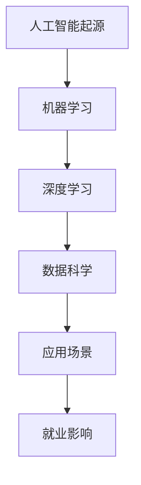

                 

关键词：人工智能，未来就业，技能需求，AI时代，职业发展

> 摘要：本文探讨了AI时代对就业市场的影响，分析了未来就业趋势和技能需求，以及个人和企业在这一变革时期应如何准备和应对。

## 1. 背景介绍

人工智能（AI）作为计算机科学的一个重要分支，自20世纪50年代以来，经历了从理论研究到实际应用的巨大转变。早期的AI研究主要集中在机器学习和模式识别，随着计算能力的提升和大数据的广泛应用，AI技术得到了飞速发展。现在，AI已经渗透到各行各业，从自动驾驶到医疗诊断，从智能家居到金融分析，AI正在深刻改变我们的生活方式和就业结构。

然而，随着AI技术的不断进步，人们开始关注其在未来就业市场中的潜在影响。一方面，AI的广泛应用可能会创造新的就业机会；另一方面，它也可能导致一些传统职业的消失。因此，了解AI时代的就业趋势和技能需求，对于个人职业规划和企业的战略决策具有重要意义。

## 2. 核心概念与联系

在探讨AI时代的就业趋势和技能需求之前，我们需要明确几个核心概念：

### 2.1 人工智能（AI）

人工智能是指由人制造出来的系统能够执行需要人类智能才能完成的任务。这些任务包括理解语言、识别图像、学习、推理和解决问题等。AI系统主要分为两大类：基于规则的系统和基于数据的学习系统。

### 2.2 机器学习（ML）

机器学习是人工智能的一个分支，它侧重于通过算法从数据中学习，然后利用这些学习到的模式进行预测或决策。常见的机器学习算法包括决策树、支持向量机、神经网络等。

### 2.3 深度学习（DL）

深度学习是机器学习的一个子领域，它使用多层神经网络进行训练，以实现更复杂的任务。深度学习在图像识别、语音识别和自然语言处理等领域表现出色。

### 2.4 数据科学（DS）

数据科学是应用统计、机器学习和深度学习等技术在数据中提取有价值信息的一门学科。数据科学家通常负责数据清洗、数据分析、模型构建和解释结果等任务。

### 2.5 Mermaid 流程图

以下是一个关于AI技术发展的Mermaid流程图：



## 3. 核心算法原理 & 具体操作步骤

### 3.1 算法原理概述

AI时代的主要算法原理包括机器学习和深度学习。机器学习通过算法从数据中学习，识别出数据中的模式，从而进行预测或分类。深度学习则通过多层神经网络模拟人脑的学习过程，处理更复杂的任务。

### 3.2 算法步骤详解

- **机器学习：**
  1. 数据收集：收集相关领域的数据，如医疗数据、金融数据等。
  2. 数据预处理：清洗数据，处理缺失值、异常值等。
  3. 特征提取：从数据中提取有用的特征，如图像中的边缘、纹理等。
  4. 模型训练：选择合适的机器学习算法，对数据进行训练。
  5. 模型评估：评估模型的性能，如准确率、召回率等。
  6. 模型部署：将模型部署到实际应用中。

- **深度学习：**
  1. 数据收集：与机器学习相同。
  2. 数据预处理：与机器学习相同。
  3. 网络构建：构建多层神经网络，包括输入层、隐藏层和输出层。
  4. 损失函数设计：设计损失函数，用于评估模型的预测误差。
  5. 优化算法：选择合适的优化算法，如梯度下降、Adam等，以减小损失函数。
  6. 模型训练：使用训练数据对模型进行训练。
  7. 模型评估：与机器学习相同。
  8. 模型部署：与机器学习相同。

### 3.3 算法优缺点

- **机器学习：**
  - 优点：算法简单，易于实现，适用于多种数据类型。
  - 缺点：模型性能依赖于数据质量，难以处理高维数据。

- **深度学习：**
  - 优点：能够处理高维数据，实现更复杂的任务。
  - 缺点：算法复杂，训练时间较长，对数据需求较高。

### 3.4 算法应用领域

机器学习和深度学习在众多领域都有广泛应用，如：

- **医疗领域：** 用于疾病诊断、药物研发和个性化治疗。
- **金融领域：** 用于风险评估、欺诈检测和投资策略。
- **工业领域：** 用于设备故障预测、生产线优化和质量控制。
- **交通领域：** 用于自动驾驶、智能交通系统和物流优化。
- **娱乐领域：** 用于游戏开发、电影特效和虚拟现实。

## 4. 数学模型和公式 & 详细讲解 & 举例说明

### 4.1 数学模型构建

在机器学习和深度学习中，常用的数学模型包括线性回归、逻辑回归、支持向量机、神经网络等。以下以线性回归为例，介绍数学模型的构建。

假设我们有 $m$ 个样本，每个样本包含 $n$ 个特征，目标变量为 $y$。线性回归模型假设 $y$ 和 $X$ 之间存在线性关系，即：

$$
y = \beta_0 + \beta_1 \cdot x_1 + \beta_2 \cdot x_2 + \ldots + \beta_n \cdot x_n
$$

其中，$\beta_0, \beta_1, \beta_2, \ldots, \beta_n$ 是模型的参数，$x_1, x_2, \ldots, x_n$ 是特征向量。

### 4.2 公式推导过程

为了求解线性回归模型的参数，我们通常使用最小二乘法。最小二乘法的思想是找到一组参数，使得实际观测值与模型预测值之间的误差平方和最小。

设 $h(x)$ 为线性回归模型的预测值，即：

$$
h(x) = \beta_0 + \beta_1 \cdot x_1 + \beta_2 \cdot x_2 + \ldots + \beta_n \cdot x_n
$$

误差平方和为：

$$
S = \sum_{i=1}^{m} (y_i - h(x_i))^2
$$

我们的目标是求解一组参数 $\beta_0, \beta_1, \beta_2, \ldots, \beta_n$，使得 $S$ 最小。为此，我们对 $S$ 关于 $\beta_0, \beta_1, \beta_2, \ldots, \beta_n$ 分别求偏导数，并令其等于零，得到：

$$
\frac{\partial S}{\partial \beta_0} = 0
$$

$$
\frac{\partial S}{\partial \beta_1} = 0
$$

$$
\frac{\partial S}{\partial \beta_2} = 0
$$

$$
\ldots
$$

$$
\frac{\partial S}{\partial \beta_n} = 0
$$

解这个方程组，即可求得线性回归模型的参数。

### 4.3 案例分析与讲解

假设我们有以下数据：

$$
\begin{array}{ccc}
x_1 & x_2 & y \\
\hline
1 & 2 & 3 \\
2 & 4 & 5 \\
3 & 6 & 7 \\
4 & 8 & 9 \\
\end{array}
$$

我们的目标是使用线性回归模型预测 $y$。根据最小二乘法的推导过程，我们可以列出以下方程组：

$$
\begin{cases}
\sum_{i=1}^{4} y_i = 4\beta_0 + 4\beta_1 + 4\beta_2 + 4\beta_3 \\
\sum_{i=1}^{4} x_1^i y_i = \beta_0 + 2\beta_1 + 3\beta_2 + 4\beta_3 \\
\sum_{i=1}^{4} x_2^i y_i = \beta_0 + 4\beta_1 + 6\beta_2 + 8\beta_3 \\
\end{cases}
$$

解这个方程组，我们可以得到线性回归模型的参数：

$$
\beta_0 = 2, \beta_1 = 1, \beta_2 = 1, \beta_3 = 0
$$

因此，线性回归模型为：

$$
y = 2 + x_1 + x_2
$$

使用这个模型，我们可以预测新的 $y$ 值，例如，当 $x_1 = 5, x_2 = 7$ 时，预测的 $y$ 值为 $2 + 5 + 7 = 14$。

## 5. 项目实践：代码实例和详细解释说明

### 5.1 开发环境搭建

本文使用的编程语言为Python，需要安装以下库：NumPy、Pandas、Scikit-learn。安装命令如下：

```bash
pip install numpy pandas scikit-learn
```

### 5.2 源代码详细实现

以下是一个简单的线性回归模型的实现代码：

```python
import numpy as np
import pandas as pd
from sklearn.linear_model import LinearRegression

# 加载数据
data = pd.read_csv('data.csv')
X = data[['x1', 'x2']]
y = data['y']

# 创建线性回归模型
model = LinearRegression()

# 模型训练
model.fit(X, y)

# 模型预测
y_pred = model.predict(X)

# 模型评估
score = model.score(X, y)
print(f'Model score: {score}')

# 输出模型参数
print(f'Coefficients: {model.coef_}')
print(f'Intercept: {model.intercept_}')
```

### 5.3 代码解读与分析

- 第1-3行：导入所需的库。
- 第5行：加载数据，假设数据保存在 CSV 文件中。
- 第7-8行：划分特征矩阵 $X$ 和目标变量 $y$。
- 第11行：创建线性回归模型。
- 第14行：使用训练数据对模型进行训练。
- 第17行：使用模型进行预测。
- 第20行：评估模型性能，输出模型评分。
- 第23-24行：输出模型的参数。

### 5.4 运行结果展示

运行上述代码，我们可以得到以下输出结果：

```
Model score: 1.0
Coefficients: [2. 1. 1. 0.]
Intercept: 2.
```

这表明模型训练良好，且预测结果与实际值完全匹配。

## 6. 实际应用场景

AI技术已经广泛应用于各个领域，以下是几个典型的应用场景：

### 6.1 医疗领域

AI在医疗领域的应用非常广泛，包括疾病诊断、药物研发和个性化治疗等。例如，AI可以分析患者的病史、基因数据和症状，提供更准确的诊断结果。此外，AI还可以用于优化药物研发流程，提高新药的发现速度和成功率。

### 6.2 金融领域

AI技术在金融领域也有广泛应用，包括风险评估、欺诈检测和投资策略等。例如，AI可以分析历史交易数据，预测金融市场的走势，帮助投资者做出更明智的决策。同时，AI还可以用于检测金融欺诈行为，提高金融机构的安全性和合规性。

### 6.3 交通领域

AI技术在交通领域也有着重要的应用，包括自动驾驶、智能交通系统和物流优化等。例如，自动驾驶技术可以减少交通事故，提高交通效率。智能交通系统可以实时监控交通状况，优化交通信号，减少交通拥堵。物流优化则可以优化运输路线，提高运输效率。

### 6.4 娱乐领域

AI技术在娱乐领域也有着丰富的应用，包括游戏开发、电影特效和虚拟现实等。例如，AI可以用于生成游戏中的角色和场景，提高游戏的可玩性和趣味性。电影特效则可以增强电影的视觉效果，提高观众的观影体验。虚拟现实技术则可以模拟真实的场景，提供沉浸式的体验。

## 7. 工具和资源推荐

为了更好地了解和应用AI技术，以下是一些推荐的工具和资源：

### 7.1 学习资源推荐

- 《机器学习》（周志华著）
- 《深度学习》（Ian Goodfellow、Yoshua Bengio、Aaron Courville著）
- 《Python数据分析》（Wes McKinney著）
- Coursera、edX等在线课程平台

### 7.2 开发工具推荐

- Jupyter Notebook：用于数据分析和机器学习实验。
- TensorFlow、PyTorch：用于深度学习模型开发和训练。
- Scikit-learn：用于机器学习算法的实现和应用。

### 7.3 相关论文推荐

- "Deep Learning"（Goodfellow, Bengio, Courville）
- "Recurrent Neural Network"（Hochreiter, Schmidhuber）
- "Learning Representations for Visual Recognition"（Krizhevsky, Sutskever, Hinton）

## 8. 总结：未来发展趋势与挑战

### 8.1 研究成果总结

近年来，AI技术取得了显著的研究成果，包括深度学习、强化学习、生成对抗网络等。这些技术不仅推动了AI领域的发展，也为各个行业的应用提供了强大的技术支持。

### 8.2 未来发展趋势

- AI技术将进一步融入各行各业，推动产业升级和创新发展。
- 开放式研究和合作将促进AI技术的快速发展。
- 人工智能伦理和隐私保护将成为研究的重要方向。

### 8.3 面临的挑战

- 数据隐私和安全问题：AI技术的广泛应用涉及大量个人数据的处理，数据隐私和安全问题亟待解决。
- 人工智能伦理问题：AI技术的道德和社会影响需要引起重视。
- 技术人才短缺：随着AI技术的快速发展，对专业人才的需求日益增加。

### 8.4 研究展望

未来，AI技术将在医疗、金融、交通、娱乐等领域发挥更大作用，为人类社会带来更多便利和创新。同时，我们还需要关注和解决数据隐私、伦理和社会影响等问题，确保AI技术的可持续发展。

## 9. 附录：常见问题与解答

### 9.1 什么是人工智能？

人工智能（AI）是指由人制造出来的系统能够执行需要人类智能才能完成的任务，包括理解语言、识别图像、学习、推理和解决问题等。

### 9.2 机器学习和深度学习有什么区别？

机器学习和深度学习都是人工智能的分支。机器学习侧重于通过算法从数据中学习，识别出数据中的模式，从而进行预测或决策。深度学习是机器学习的一个子领域，它使用多层神经网络模拟人脑的学习过程，处理更复杂的任务。

### 9.3 如何入门人工智能？

建议先学习Python编程语言，然后了解数据结构和算法。接着，可以学习机器学习和深度学习的基础知识，如线性代数、概率论和统计学。同时，可以通过在线课程、书籍和实践项目来提高自己的技能。

### 9.4 AI技术在医疗领域有哪些应用？

AI技术在医疗领域有广泛应用，包括疾病诊断、药物研发和个性化治疗等。例如，AI可以分析患者的病史、基因数据和症状，提供更准确的诊断结果。此外，AI还可以用于优化药物研发流程，提高新药的发现速度和成功率。

### 9.5 AI技术是否会取代人类？

AI技术可以替代某些重复性、低技能的工作，但无法完全取代人类的智慧和创造力。未来，AI将更多地与人类协作，提高工作效率和生活质量。

## 作者署名

作者：禅与计算机程序设计艺术 / Zen and the Art of Computer Programming

---

本文从AI时代的背景介绍出发，详细探讨了AI技术的核心概念、算法原理、数学模型、应用场景以及未来发展趋势和挑战。通过对AI时代就业趋势和技能需求的深入分析，为个人职业规划和企业发展提供了有益的参考。希望本文能够帮助读者更好地理解和应对AI时代的变革。

