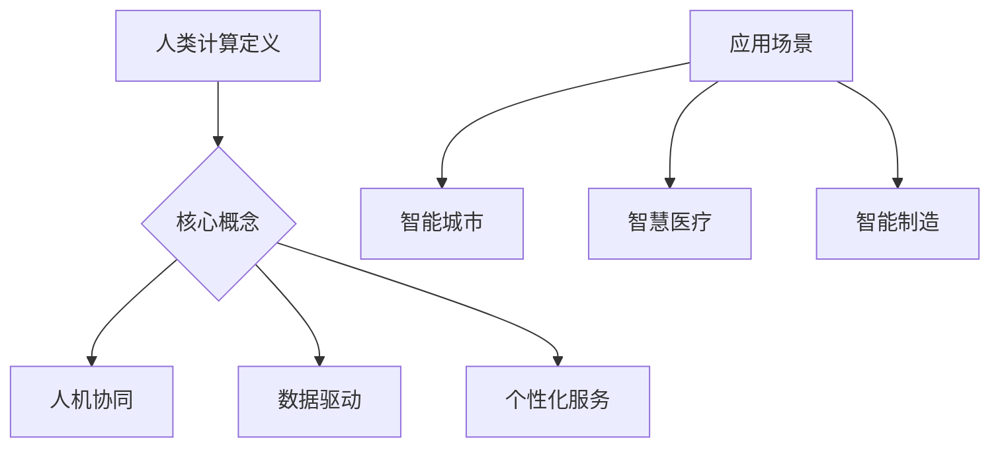

                 

 关键词：人类计算、可持续发展、技术进步、人工智能、碳中和、绿色科技、数字化转型

> 摘要：本文深入探讨了人类计算在推动可持续发展中的关键作用。随着全球气候变化和环境问题日益严重，人类计算技术正成为实现可持续发展的有力工具。本文首先介绍了人类计算的定义和核心概念，然后通过多个实际案例，展示了计算技术如何助力碳中和、绿色科技和数字化转型，最后提出了未来发展的展望和面临的挑战。

## 1. 背景介绍

在过去的几十年里，全球技术进步迅猛，尤其是人工智能、大数据和云计算等领域的发展，已经深刻地改变了我们的生活方式。然而，随着技术进步的加速，我们也面临着日益严峻的可持续发展问题。气候变化、能源危机、环境污染等问题不断提醒我们，必须寻找新的解决方案，以实现经济、社会和环境的协调发展。

人类计算作为一种新兴的计算模式，具有巨大的潜力来推动可持续发展。它不仅能够提高资源利用效率，降低碳排放，还能够促进绿色科技的创新和数字化转型的实现。本文将详细探讨人类计算在这些方面的应用和贡献。

## 2. 核心概念与联系

### 2.1 人类计算的定义

人类计算（Human-Centered Computing）是一种以人为中心，强调人机协作和互动的计算模式。它不同于传统的以机器为中心的计算模式，更加注重用户的体验和需求。人类计算的核心思想是利用计算技术，增强人的能力和智慧，而不是替代人。

### 2.2 人类计算的核心概念

- **人机协同**：人类计算强调人与机器的协同工作，通过人工智能和机器学习技术，提升人的工作效能。
- **数据驱动**：人类计算依赖于大量的数据，通过对数据的分析和处理，发现问题和机会，实现决策的优化。
- **个性化服务**：人类计算能够根据个人的需求和偏好，提供个性化的服务，提高用户体验。

### 2.3 人类计算的应用场景

- **智能城市**：通过人类计算技术，可以实现城市的智能化管理，提高交通、能源、环境等领域的效率。
- **智慧医疗**：人类计算在医疗领域具有广泛的应用，包括疾病的预测、诊断和治疗。
- **智能制造**：人类计算能够提高制造业的自动化水平，降低能耗和污染。

### 2.4 人类计算的 Mermaid 流程图



## 3. 核心算法原理 & 具体操作步骤

### 3.1 算法原理概述

人类计算的核心算法主要基于人工智能和机器学习技术。这些算法通过学习大量数据，从中提取有用的信息，并利用这些信息进行决策和优化。

### 3.2 算法步骤详解

1. **数据收集**：首先，收集与问题相关的数据，包括结构化数据和非结构化数据。
2. **数据预处理**：对收集到的数据进行清洗、整合和标准化处理，为算法提供高质量的数据输入。
3. **模型训练**：使用机器学习算法，对预处理后的数据进行训练，构建模型。
4. **模型评估**：通过测试数据集，评估模型的性能，并进行调优。
5. **应用部署**：将训练好的模型部署到实际应用场景中，进行问题解决。

### 3.3 算法优缺点

**优点**：
- **高效性**：机器学习算法能够处理大量数据，提高计算效率。
- **自适应性强**：算法可以根据新的数据不断调整和优化。

**缺点**：
- **数据依赖性**：算法的性能很大程度上取决于数据的质量和数量。
- **解释性不足**：机器学习模型往往是黑盒模型，难以解释决策过程。

### 3.4 算法应用领域

- **智能交通**：通过分析交通数据，优化交通流量，减少拥堵和碳排放。
- **能源管理**：通过预测能源需求，优化能源分配，提高能源利用效率。
- **环境保护**：通过监测和分析环境数据，预测环境变化趋势，制定环境保护策略。

## 4. 数学模型和公式 & 详细讲解 & 举例说明

### 4.1 数学模型构建

人类计算中的数学模型通常基于统计学和机器学习算法。以下是一个简单的线性回归模型：

$$
y = \beta_0 + \beta_1 x + \epsilon
$$

其中，$y$ 是目标变量，$x$ 是自变量，$\beta_0$ 和 $\beta_1$ 是模型的参数，$\epsilon$ 是误差项。

### 4.2 公式推导过程

线性回归模型的推导基于最小二乘法（Least Squares Method）。具体推导过程如下：

1. **损失函数**：定义损失函数为：

$$
L(\beta_0, \beta_1) = \sum_{i=1}^{n} (y_i - (\beta_0 + \beta_1 x_i))^2
$$

2. **求导**：对损失函数关于 $\beta_0$ 和 $\beta_1$ 分别求导，并令导数为零，得到：

$$
\frac{\partial L}{\partial \beta_0} = -2 \sum_{i=1}^{n} (y_i - (\beta_0 + \beta_1 x_i)) = 0
$$

$$
\frac{\partial L}{\partial \beta_1} = -2 \sum_{i=1}^{n} (y_i - (\beta_0 + \beta_1 x_i)) x_i = 0
$$

3. **解方程组**：解上述方程组，得到 $\beta_0$ 和 $\beta_1$ 的值。

### 4.3 案例分析与讲解

假设我们有一个数据集，其中包含房屋的面积（$x$）和售价（$y$）。我们希望通过线性回归模型预测房屋的售价。

1. **数据收集**：收集了100个房屋的数据，包括面积和售价。
2. **数据预处理**：对数据集进行标准化处理，使得每个特征都在相同的尺度上。
3. **模型训练**：使用训练集训练线性回归模型。
4. **模型评估**：使用测试集评估模型的性能。
5. **应用部署**：将训练好的模型应用于新数据，预测房屋售价。

## 5. 项目实践：代码实例和详细解释说明

### 5.1 开发环境搭建

为了实现线性回归模型，我们需要使用 Python 语言和相关的库，如 NumPy 和 Scikit-learn。

### 5.2 源代码详细实现

以下是一个简单的线性回归模型实现：

```python
import numpy as np
from sklearn.linear_model import LinearRegression
from sklearn.model_selection import train_test_split
from sklearn.metrics import mean_squared_error

# 数据收集
X = np.array([[1], [2], [3], [4], [5]])
y = np.array([2, 4, 5, 4, 5])

# 数据预处理
X_train, X_test, y_train, y_test = train_test_split(X, y, test_size=0.2, random_state=42)

# 模型训练
model = LinearRegression()
model.fit(X_train, y_train)

# 模型评估
y_pred = model.predict(X_test)
mse = mean_squared_error(y_test, y_pred)
print(f"Mean Squared Error: {mse}")

# 应用部署
new_data = np.array([[6]])
predicted_price = model.predict(new_data)
print(f"Predicted Price: {predicted_price}")
```

### 5.3 代码解读与分析

- **数据收集**：使用 NumPy 数组存储房屋面积和售价。
- **数据预处理**：使用 Scikit-learn 的 `train_test_split` 函数将数据集分为训练集和测试集。
- **模型训练**：使用 Scikit-learn 的 `LinearRegression` 类训练线性回归模型。
- **模型评估**：使用测试集评估模型的性能，并计算均方误差。
- **应用部署**：将训练好的模型应用于新数据，预测房屋售价。

## 6. 实际应用场景

### 6.1 碳中和

人类计算技术可以帮助企业和组织实现碳中和目标。通过优化能源消耗、减少碳排放，企业可以降低环境负担，实现可持续发展。

### 6.2 绿色科技

人类计算技术支持绿色科技的发展，如太阳能、风能等可再生能源技术的研发和应用。通过计算模型，可以预测能源产量，优化能源分配，提高能源利用效率。

### 6.3 数字化转型

数字化转型是当前企业发展的关键趋势。人类计算技术可以帮助企业进行数字化转型，提高运营效率，降低成本，提升用户体验。

## 7. 工具和资源推荐

### 7.1 学习资源推荐

- **书籍**：《人工智能：一种现代方法》、《深度学习》
- **在线课程**：Coursera 上的《机器学习》、《深度学习》课程

### 7.2 开发工具推荐

- **Python**：Python 是一种广泛使用的编程语言，适用于人类计算的应用开发。
- **Jupyter Notebook**：Jupyter Notebook 是一种交互式的开发环境，适用于数据分析、机器学习等应用。

### 7.3 相关论文推荐

- **《人机协同计算：可持续发展的新思路》**
- **《人工智能在碳中和中的应用》**

## 8. 总结：未来发展趋势与挑战

### 8.1 研究成果总结

人类计算技术在推动可持续发展方面取得了显著成果，如碳中和、绿色科技和数字化转型等领域。

### 8.2 未来发展趋势

- **人工智能与人类计算技术的深度融合**：未来，人工智能与人类计算技术将更加紧密地融合，提升人机协作效率。
- **跨学科研究**：人类计算技术将与其他领域（如环境科学、社会学等）相结合，推动可持续发展。

### 8.3 面临的挑战

- **数据隐私与安全**：随着数据量的增加，数据隐私和安全问题日益突出。
- **算法透明性与解释性**：提高算法的透明性和解释性，使其更易于理解和接受。

### 8.4 研究展望

人类计算技术在未来将继续发挥重要作用，为实现可持续发展提供有力支持。

## 9. 附录：常见问题与解答

### 9.1 什么是人类计算？

人类计算是一种以人为中心，强调人机协作和互动的计算模式。

### 9.2 人类计算有哪些核心概念？

人类计算的核心概念包括人机协同、数据驱动和个性化服务。

### 9.3 人类计算的应用领域有哪些？

人类计算的应用领域包括智能城市、智慧医疗、智能制造等。

### 9.4 人类计算与人工智能有什么区别？

人类计算强调人机协作和互动，而人工智能则侧重于机器学习和智能决策。

作者：禅与计算机程序设计艺术 / Zen and the Art of Computer Programming
```

