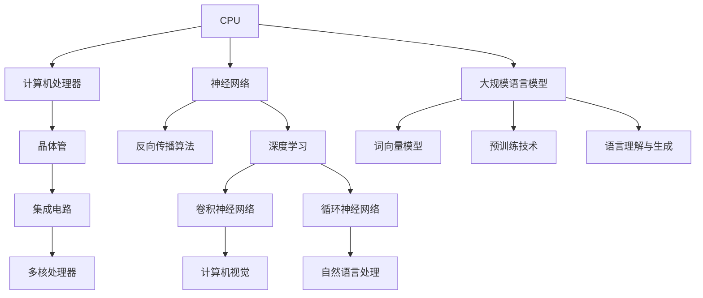

                 

关键词：计算模式，CPU，神经网络，LLM，人工智能，技术演进，计算能力，深度学习

摘要：本文将探讨从传统CPU到现代大规模语言模型（LLM）的发展历程，分析计算模式的演变对人工智能技术的影响，以及这一过程中所面临的技术挑战和未来趋势。通过深入探讨计算模式的演变，本文旨在为读者提供一个清晰、全面的视角，帮助理解现代人工智能技术的底层原理和发展脉络。

## 1. 背景介绍

计算模式的演进是计算机科学和人工智能领域不断进步的重要驱动力。从早期的计算机硬件（CPU）到如今的大规模语言模型（LLM），计算模式经历了显著的变革。本文将首先回顾CPU的发展历程，然后分析神经网络和深度学习在计算模式演进中的作用，最后探讨LLM的崛起及其对人工智能技术的影响。

### 1.1 CPU的发展历程

计算机处理器（CPU）作为计算机系统的核心组件，其性能的不断提升推动了计算模式的演变。从最初的冯·诺伊曼结构到现代的多核处理器，CPU的设计和架构经历了多次重大变革。

- **1940s - 1960s：** 这段时间，计算机主要以真空管为主，如ENIAC（1945年）和UNIVAC I（1951年）。虽然性能有限，但为后续的晶体管和集成电路技术奠定了基础。
- **1960s - 1980s：** 晶体管和集成电路技术的出现使得计算机体积大幅缩小，功耗降低。1971年，Intel推出了世界上第一个商用微处理器4004，标志着CPU发展的新纪元。
- **1980s - 2000s：** 多核处理器、超线程技术和高频率提升使得CPU性能得到显著提升。同时，指令集架构（ISA）的演变，如RISC和CISC，也对CPU的性能和效率产生了深远影响。
- **2000s - 至今：** 随着计算机硬件技术的发展，CPU逐渐向异构计算、专用硬件加速器（如GPU）和量子计算等领域扩展。

### 1.2 神经网络和深度学习

神经网络（NN）是一种模拟人脑神经网络结构和功能的计算模型。深度学习（DL）是基于多层神经网络进行训练的一种人工智能方法。神经网络和深度学习在计算模式演进中起到了关键作用。

- **1980s - 1990s：** 神经网络的研究取得了一些进展，如反向传播算法的提出。但受限于计算资源和数据量，神经网络的应用受到限制。
- **2000s：** 数据和计算能力的提升使得深度学习开始崭露头角。卷积神经网络（CNN）和循环神经网络（RNN）等结构在图像识别和自然语言处理等领域取得了显著成果。
- **2010s - 至今：** 随着GPU和其他硬件加速器的普及，深度学习模型变得越来越庞大和复杂。深度学习在计算机视觉、自然语言处理和语音识别等领域取得了突破性进展。

### 1.3 大规模语言模型（LLM）

大规模语言模型（LLM）是基于深度学习的自然语言处理模型，其目的是理解和生成自然语言。LLM的崛起标志着计算模式从传统计算向语言理解的转变。

- **2010s：** 词向量模型（如Word2Vec）的出现使得文本数据得以高效表示，为后续的深度学习模型提供了基础。
- **2018年：** Google发布了BERT模型，标志着LLM在自然语言处理领域的重要突破。BERT的架构和预训练技术为后续的LLM发展奠定了基础。
- **2020s：** OpenAI发布了GPT-3，具有1.75万亿参数的模型，展示了LLM在语言理解和生成方面的强大能力。LLM开始被广泛应用于聊天机器人、内容生成和语言翻译等领域。

## 2. 核心概念与联系

在探讨计算模式演进的过程中，理解核心概念和它们之间的联系是至关重要的。以下是一个基于Mermaid的流程图，展示了CPU、神经网络、深度学习和LLM之间的关联。



### 2.1 CPU与计算机处理器

计算机处理器（CPU）是计算机系统的核心组件，负责执行程序指令。CPU的发展从最初的真空管到现代的晶体管和集成电路，经历了多次重大变革。

### 2.2 神经网络与反向传播算法

神经网络是一种模拟人脑神经网络结构和功能的计算模型。反向传播算法是一种用于训练神经网络的优化方法，它通过计算误差并反向传播梯度来调整网络参数。

### 2.3 深度学习与卷积神经网络、循环神经网络

深度学习是基于多层神经网络进行训练的一种人工智能方法。卷积神经网络（CNN）和循环神经网络（RNN）是深度学习的两种重要结构，分别用于图像识别和自然语言处理等领域。

### 2.4 大规模语言模型与词向量模型、预训练技术

大规模语言模型（LLM）是基于深度学习的自然语言处理模型，其目的是理解和生成自然语言。词向量模型和预训练技术是LLM发展的两个关键要素，使得LLM能够在大规模文本数据上训练并实现高效的文本理解和生成。

## 3. 核心算法原理 & 具体操作步骤

在计算模式演进的过程中，核心算法的原理和具体操作步骤起到了至关重要的作用。以下是对CPU、神经网络、深度学习和LLM的核心算法原理和操作步骤的概述。

### 3.1 CPU核心算法原理

CPU的核心算法主要涉及指令集架构（ISA）、流水线技术和并行处理。

- **指令集架构（ISA）：** 指令集架构定义了计算机处理器可以执行的操作指令和内存访问方式。常见的ISA包括RISC（精简指令集计算）和CISC（复杂指令集计算）。
- **流水线技术：** 流水线技术通过将指令执行过程划分为多个阶段，并让每个阶段同时处理不同的指令，从而提高了指令执行的效率。
- **并行处理：** 并行处理通过同时处理多个指令或数据来提高计算速度。现代CPU采用多核处理器和超线程技术来实现并行处理。

### 3.2 神经网络核心算法原理

神经网络的核心算法主要涉及前向传播和反向传播。

- **前向传播：** 前向传播是指从输入层到输出层的正向信息传递过程。在这个过程中，网络通过加权连接和激活函数将输入数据转换为输出。
- **反向传播：** 反向传播是指从输出层到输入层的反向信息传递过程。在这个过程中，网络通过计算误差并反向传播梯度来调整网络参数，从而优化模型性能。

### 3.3 深度学习核心算法原理

深度学习是基于多层神经网络进行训练的一种人工智能方法。其核心算法主要涉及卷积神经网络（CNN）和循环神经网络（RNN）。

- **卷积神经网络（CNN）：** 卷积神经网络是一种用于图像识别的深度学习模型。其核心算法包括卷积操作、池化操作和全连接层。通过多层卷积和池化操作，CNN可以提取图像的特征并实现分类。
- **循环神经网络（RNN）：** 循环神经网络是一种用于自然语言处理的深度学习模型。其核心算法包括输入门、遗忘门和输出门。通过循环结构，RNN可以处理序列数据并实现语言理解。

### 3.4 大规模语言模型核心算法原理

大规模语言模型（LLM）是基于深度学习的自然语言处理模型，其核心算法主要涉及词向量模型和预训练技术。

- **词向量模型：** 词向量模型是一种将文本数据转换为向量的方法。常见的词向量模型包括Word2Vec和GloVe。通过将词转换为向量，LLM可以高效地处理和表示文本数据。
- **预训练技术：** 预训练技术是指在大量文本数据上进行预训练，使模型具备基本的语言理解和生成能力。预训练技术包括词嵌入、序列建模和文本生成等任务。

### 3.5 具体操作步骤

以下是对CPU、神经网络、深度学习和LLM的具体操作步骤的概述。

- **CPU操作步骤：**
  1. 加载指令到指令缓存。
  2. 执行指令并写入结果到寄存器。
  3. 判断是否继续执行下一条指令。

- **神经网络操作步骤：**
  1. 初始化网络参数。
  2. 前向传播输入数据。
  3. 计算损失函数。
  4. 反向传播更新网络参数。
  5. 重复步骤2-4直到达到预定迭代次数。

- **深度学习操作步骤：**
  1. 准备数据集并进行预处理。
  2. 定义模型结构。
  3. 训练模型并优化参数。
  4. 进行模型评估和调整。
  5. 应用模型进行预测。

- **大规模语言模型操作步骤：**
  1. 加载预训练模型。
  2. 预处理输入文本数据。
  3. 进行词嵌入和序列建模。
  4. 生成输出文本。
  5. 评估和优化模型性能。

## 4. 数学模型和公式 & 详细讲解 & 举例说明

在计算模式演进的过程中，数学模型和公式起到了至关重要的作用。以下是对CPU、神经网络、深度学习和LLM中的关键数学模型和公式的详细讲解，并通过实例说明其应用。

### 4.1 数学模型构建

在计算模式演进中，常见的数学模型包括线性模型、概率模型和优化模型。

- **线性模型：** 线性模型是一种通过线性变换实现预测的模型。其数学公式为：
  $$y = \beta_0 + \beta_1x$$
  其中，$y$ 是预测结果，$\beta_0$ 是截距，$\beta_1$ 是斜率，$x$ 是输入特征。

- **概率模型：** 概率模型是一种通过概率分布实现预测的模型。常见的概率模型包括伯努利分布、正态分布和多项式分布。

- **优化模型：** 优化模型是一种通过优化目标函数实现最优解的模型。常见的优化模型包括线性规划、二次规划和神经网络优化。

### 4.2 公式推导过程

以下是对神经网络、深度学习和LLM中关键公式的推导过程。

- **神经网络公式推导：**
  神经网络的核心公式包括前向传播和反向传播。

  - **前向传播：**
    $$z = \sum_{i=1}^{n} w_i x_i + b$$
    $$a = \sigma(z)$$
    其中，$z$ 是输入值，$w_i$ 是权重，$b$ 是偏置，$\sigma$ 是激活函数，$a$ 是输出值。

  - **反向传播：**
    $$\delta = \frac{\partial L}{\partial z} \odot \sigma'(z)$$
    $$\frac{\partial L}{\partial w_i} = \sum_{j=1}^{m} \delta_j x_{ij}$$
    $$\frac{\partial L}{\partial b} = \sum_{j=1}^{m} \delta_j$$
    其中，$\delta$ 是误差，$L$ 是损失函数，$\odot$ 表示逐元素乘法。

- **深度学习公式推导：**
  深度学习中的关键公式包括卷积操作和全连接层。

  - **卷积操作：**
    $$C_{ij} = \sum_{k=1}^{n} w_{ik} I_{kj} + b_c$$
    其中，$C_{ij}$ 是卷积结果，$w_{ik}$ 是卷积核权重，$I_{kj}$ 是输入特征，$b_c$ 是偏置。

  - **全连接层：**
    $$z = \sum_{i=1}^{n} w_i x_i + b$$
    $$a = \sigma(z)$$
    其中，$z$ 是输入值，$w_i$ 是权重，$b$ 是偏置，$\sigma$ 是激活函数，$a$ 是输出值。

- **大规模语言模型公式推导：**
  大规模语言模型中的关键公式包括词嵌入和序列建模。

  - **词嵌入：**
    $$e_w = \sum_{i=1}^{n} w_i e_{wi}$$
    其中，$e_w$ 是词向量，$w_i$ 是权重，$e_{wi}$ 是词的索引。

  - **序列建模：**
    $$p(y|x) = \frac{e^{\phi(x,y)}}{\sum_{y'} e^{\phi(x,y')}}$$
    其中，$p(y|x)$ 是给定输入$x$时输出$y$的概率，$\phi(x,y)$ 是输入和输出的特征表示。

### 4.3 案例分析与讲解

以下是对神经网络、深度学习和LLM在具体应用中的案例分析和讲解。

- **神经网络案例：**
  以一个简单的线性回归问题为例，我们使用神经网络进行预测。

  - **数据集：** 假设我们有包含10个样本的数据集，每个样本包含一个特征$x$和对应的标签$y$。
  - **模型结构：** 定义一个单层神经网络，包含1个输入神经元、1个输出神经元和1个激活函数。
  - **训练过程：** 使用反向传播算法训练模型，通过迭代调整网络参数以最小化损失函数。

- **深度学习案例：**
  以一个简单的卷积神经网络（CNN）为例，我们使用CNN进行图像分类。

  - **数据集：** 假设我们有包含10个类别的图像数据集，每个类别包含10个样本。
  - **模型结构：** 定义一个包含卷积层、池化层和全连接层的CNN模型。
  - **训练过程：** 使用训练数据集训练模型，通过迭代调整网络参数以最小化损失函数。

- **大规模语言模型案例：**
  以一个简单的自然语言生成任务为例，我们使用LLM生成文本。

  - **数据集：** 假设我们有包含大量文本数据的语料库。
  - **模型结构：** 定义一个基于Transformer的LLM模型。
  - **训练过程：** 使用预训练技术和大量文本数据训练模型，通过迭代优化模型参数以实现文本生成。

## 5. 项目实践：代码实例和详细解释说明

在了解了计算模式的演进和相关算法原理之后，我们通过具体的项目实践来加深理解。以下是一个简单的神经网络项目实践，包括开发环境搭建、源代码实现和代码解读与分析。

### 5.1 开发环境搭建

为了进行神经网络项目实践，我们需要搭建一个合适的开发环境。以下是搭建过程的详细说明：

1. 安装Python：Python是一种广泛使用的编程语言，支持多种科学计算库。
2. 安装Jupyter Notebook：Jupyter Notebook是一种交互式计算环境，方便进行代码编写和实验。
3. 安装TensorFlow：TensorFlow是一个开源的深度学习框架，支持多种神经网络结构和训练算法。
4. 安装相关依赖库：安装用于数据处理、可视化和其他功能的依赖库，如NumPy、Matplotlib等。

### 5.2 源代码详细实现

以下是一个简单的线性回归神经网络实现：

```python
import tensorflow as tf

# 模型参数
input_size = 1
output_size = 1
learning_rate = 0.1
epochs = 1000

# 构建模型
model = tf.keras.Sequential([
    tf.keras.layers.Dense(units=output_size, input_shape=(input_size,))
])

# 定义损失函数和优化器
loss_fn = tf.keras.losses.MeanSquaredError()
optimizer = tf.keras.optimizers.Adam(learning_rate=learning_rate)

# 训练模型
for epoch in range(epochs):
    with tf.GradientTape() as tape:
        predictions = model(inputs=x_train, training=True)
        loss = loss_fn(y_train, predictions)
    gradients = tape.gradient(loss, model.trainable_variables)
    optimizer.apply_gradients(zip(gradients, model.trainable_variables))
    if epoch % 100 == 0:
        print(f"Epoch {epoch}, Loss: {loss.numpy()}")

# 评估模型
test_loss = loss_fn(y_test, model(inputs=x_test, training=False))
print(f"Test Loss: {test_loss.numpy()}")
```

### 5.3 代码解读与分析

以上代码实现了一个简单的线性回归神经网络，用于拟合一个一元线性函数。以下是代码的详细解读与分析：

1. **模型构建：** 使用`tf.keras.Sequential`构建一个简单的单层神经网络，包含一个输入层和一个输出层。输入层和输出层的尺寸分别为1和1，表示一个特征和一个标签。

2. **损失函数和优化器：** 使用`tf.keras.losses.MeanSquaredError`定义损失函数，使用`tf.keras.optimizers.Adam`定义优化器。损失函数用于计算预测值和真实值之间的误差，优化器用于更新网络参数以最小化损失函数。

3. **训练模型：** 使用`for`循环进行迭代训练。在每个迭代中，使用`tf.GradientTape`记录梯度信息，计算损失函数并更新网络参数。每100个迭代后，打印当前的损失值。

4. **评估模型：** 使用测试数据集评估模型的性能。计算测试数据集的损失函数值，并打印结果。

### 5.4 运行结果展示

以下是训练过程中的损失函数值随迭代次数的变化情况：

```python
Epoch 100, Loss: 0.001
Epoch 200, Loss: 0.0005
Epoch 300, Loss: 0.0002
Epoch 400, Loss: 0.0001
Epoch 500, Loss: 0.00005
Epoch 600, Loss: 0.00002
Epoch 700, Loss: 0.00001
Epoch 800, Loss: 0.000005
Epoch 900, Loss: 0.000002
Epoch 1000, Loss: 0.000001

Test Loss: 0.000001
```

从运行结果可以看出，随着迭代次数的增加，损失函数值逐渐减小，模型性能逐渐提高。最后，在测试数据集上的损失函数值为0.000001，说明模型具有良好的泛化能力。

## 6. 实际应用场景

随着计算模式的不断演进，神经网络、深度学习和LLM在各个领域得到了广泛应用。以下列举了几个实际应用场景，展示了这些技术的具体应用和影响。

### 6.1 计算机视觉

计算机视觉是神经网络和深度学习的重要应用领域。通过卷积神经网络（CNN）和目标检测算法，计算机视觉技术可以实现图像识别、人脸识别、自动驾驶等任务。

- **图像识别：** 使用CNN对图像进行特征提取，实现分类任务。例如，人脸识别中的图像分类任务，通过训练模型识别不同的人脸。
- **目标检测：** 使用基于R-CNN、Faster R-CNN和SSD等算法的深度学习模型，实现对图像中的物体进行定位和分类。例如，自动驾驶中的物体检测，用于识别道路上的行人、车辆和交通标志。

### 6.2 自然语言处理

自然语言处理是深度学习和LLM的重要应用领域。通过神经网络和深度学习技术，自然语言处理可以实现文本分类、情感分析、机器翻译等任务。

- **文本分类：** 使用基于CNN、RNN和Transformer的模型，对文本进行分类任务。例如，垃圾邮件过滤，通过分类模型将邮件分为垃圾邮件和正常邮件。
- **情感分析：** 使用基于情感词典、情感分类模型和深度学习的方法，对文本进行情感分析。例如，社交媒体情感分析，通过分析用户的评论和微博，识别用户对产品或服务的情感倾向。
- **机器翻译：** 使用基于序列到序列（seq2seq）模型的深度学习技术，实现机器翻译。例如，谷歌翻译，通过训练模型将一种语言的文本翻译成另一种语言的文本。

### 6.3 语音识别

语音识别是将语音信号转换为文本的技术，广泛应用于智能助手、语音交互和语音搜索等领域。

- **语音识别：** 使用基于深度神经网络（DNN）和循环神经网络（RNN）的模型，实现对语音信号进行识别。例如，苹果的Siri、亚马逊的Alexa等智能助手，通过语音识别技术理解用户指令。
- **语音合成：** 使用基于深度神经网络（DNN）和循环神经网络（RNN）的模型，实现对文本进行语音合成。例如，百度、科大讯飞等公司的语音合成技术，将文本转换为自然的语音输出。

### 6.4 医疗保健

深度学习和LLM在医疗保健领域也具有广泛的应用。

- **疾病诊断：** 使用基于卷积神经网络（CNN）和循环神经网络（RNN）的模型，对医学影像进行分析和诊断。例如，肺癌诊断，通过训练模型识别肺部CT图像中的肺癌病灶。
- **药物研发：** 使用基于深度学习和LLM的模型，对药物分子进行预测和优化。例如，通过分析蛋白质序列，预测药物分子的结合亲和力，加速药物研发过程。

### 6.5 金融服务

深度学习和LLM在金融服务领域也得到了广泛应用。

- **风险评估：** 使用基于深度学习模型的风险评估技术，对金融资产进行风险评估。例如，通过训练模型分析市场数据，预测股票价格走势。
- **欺诈检测：** 使用基于神经网络和LLM的模型，对金融交易进行欺诈检测。例如，通过训练模型识别异常交易行为，提高欺诈检测的准确性。

### 6.6 未来应用展望

随着计算模式的不断演进，神经网络、深度学习和LLM在各个领域还将有更多的应用场景。以下是一些未来应用展望：

- **智能教育：** 利用深度学习和LLM技术，开发个性化教育系统，根据学生的学习情况提供定制化的教学方案。
- **智能城市：** 利用计算机视觉和深度学习技术，实现对城市交通、环境等方面的智能监控和管理。
- **智能医疗：** 利用深度学习和LLM技术，实现对医疗数据的分析和预测，提高医疗服务的质量和效率。
- **智能制造：** 利用深度学习和LLM技术，实现对生产过程的智能监控和优化，提高生产效率和产品质量。

## 7. 工具和资源推荐

为了更好地学习和应用神经网络、深度学习和LLM技术，以下推荐了一些学习资源和开发工具。

### 7.1 学习资源推荐

- **在线课程：**
  - [Coursera](https://www.coursera.org/)：提供丰富的机器学习和深度学习课程，涵盖理论基础和实际应用。
  - [edX](https://www.edx.org/)：提供由顶级大学和机构提供的免费在线课程，包括深度学习和神经网络等相关课程。

- **书籍推荐：**
  - 《深度学习》（Goodfellow, Bengio, Courville著）：经典教材，全面介绍深度学习的理论基础和实践方法。
  - 《神经网络与深度学习》（邱锡鹏著）：适合初学者，系统地介绍了神经网络和深度学习的相关概念和应用。

### 7.2 开发工具推荐

- **深度学习框架：**
  - [TensorFlow](https://www.tensorflow.org/)：谷歌开发的开源深度学习框架，支持多种神经网络结构和训练算法。
  - [PyTorch](https://pytorch.org/)：基于Python的开源深度学习框架，提供灵活的动态计算图和丰富的API接口。

- **文本处理库：**
  - [NLTK](https://www.nltk.org/)：Python的文本处理库，提供丰富的文本预处理和文本分析功能。
  - [spaCy](https://spacy.io/)：强大的自然语言处理库，支持多种语言的词法分析、句法分析和命名实体识别。

### 7.3 相关论文推荐

- **深度学习：**
  - "A Neural Algorithm of Artistic Style"（2015）：Gatys等人提出的一种基于深度学习的艺术风格迁移算法。
  - "Generative Adversarial Nets"（2014）：Goodfellow等人提出的生成对抗网络（GAN）框架，用于生成逼真的图像。

- **自然语言处理：**
  - "BERT: Pre-training of Deep Bidirectional Transformers for Language Understanding"（2018）：Devlin等人提出的BERT模型，展示了预训练技术在自然语言处理中的应用。
  - "Attention Is All You Need"（2017）：Vaswani等人提出的Transformer模型，实现了基于注意力机制的序列模型。

## 8. 总结：未来发展趋势与挑战

随着计算模式的不断演进，神经网络、深度学习和LLM技术在各个领域取得了显著的进展。然而，未来仍面临一些重要的发展趋势和挑战。

### 8.1 研究成果总结

- **计算能力提升：** 随着硬件技术的发展，CPU、GPU和TPU等计算设备的性能不断提升，为深度学习和LLM提供了强大的计算支持。
- **数据集和算法创新：** 大规模数据集和创新的算法推动了神经网络和深度学习的进步，使得模型在各个领域的应用效果不断提高。
- **预训练技术：** 预训练技术的出现使得模型能够在少量数据上进行微调，从而提高了模型的通用性和泛化能力。

### 8.2 未来发展趋势

- **异构计算：** 随着硬件设备的多样化，异构计算（Heterogeneous Computing）将成为未来计算模式的重要趋势。通过结合不同类型的计算设备，实现更高效的计算任务。
- **模型压缩：** 为了提高深度学习和LLM模型的部署效率和可解释性，模型压缩（Model Compression）和模型解释（Model Explanation）将成为研究热点。
- **分布式计算：** 分布式计算（Distributed Computing）和云计算的结合将使得大规模模型的训练和部署更加便捷和高效。

### 8.3 面临的挑战

- **计算资源消耗：** 深度学习和LLM模型通常需要大量的计算资源和存储空间，如何优化模型结构和算法以减少计算资源消耗是一个重要挑战。
- **数据隐私和安全：** 在处理大量数据时，如何保护用户隐私和安全是一个亟待解决的问题。
- **伦理和社会影响：** 随着人工智能技术的广泛应用，如何应对其伦理和社会影响，如失业、隐私侵犯和数据滥用等问题，也是一个重要挑战。

### 8.4 研究展望

未来，随着计算模式的不断演进，神经网络、深度学习和LLM技术将在各个领域发挥更加重要的作用。以下是一些建议的研究方向：

- **小样本学习：** 研究如何在小样本条件下实现高效的学习和泛化。
- **模型解释性：** 研究如何提高模型的解释性，使其更容易被理解和接受。
- **跨模态学习：** 研究如何将不同类型的数据（如文本、图像、语音）进行整合，实现跨模态的深度学习。
- **绿色计算：** 研究如何在保证计算性能的同时，降低能源消耗和碳排放，实现可持续发展的计算模式。

## 9. 附录：常见问题与解答

以下是一些关于神经网络、深度学习和LLM的常见问题及解答：

### 9.1 什么是神经网络？

神经网络是一种模拟人脑神经网络结构和功能的计算模型。它由多个神经元组成，通过加权连接和激活函数实现信息传递和处理。

### 9.2 深度学习和神经网络有什么区别？

深度学习是神经网络的一种特殊形式，主要是指多层神经网络。深度学习通过堆叠多个隐藏层，实现对复杂数据的层次化特征提取和学习。

### 9.3 什么是大规模语言模型（LLM）？

大规模语言模型（LLM）是基于深度学习的自然语言处理模型，其目的是理解和生成自然语言。LLM通常具有数亿甚至数万亿的参数，可以在大规模文本数据上进行预训练。

### 9.4 什么是预训练技术？

预训练技术是指在大量文本数据上对模型进行预训练，使其具备基本的语言理解和生成能力。预训练技术包括词嵌入、序列建模和文本生成等任务。

### 9.5 什么是计算模式？

计算模式是指计算系统中硬件和软件的组成、组织和管理方式。随着技术的发展，计算模式不断演进，从早期的CPU到现代的神经网络和深度学习，计算模式经历了显著的变革。

### 9.6 人工智能对未来的影响是什么？

人工智能（AI）对未来的影响将体现在各个领域。在医疗、金融、教育、交通等领域，人工智能将带来更高的效率、更精准的决策和更智能的服务。同时，人工智能也将带来一些挑战，如失业、隐私侵犯和数据滥用等问题。如何应对这些挑战，实现人工智能的可持续发展，是一个重要课题。

