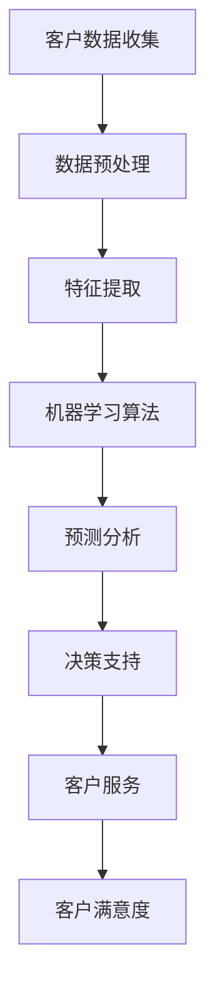

                 

关键词：客户关系管理（CRM），人工智能（AI），电商，数据挖掘，机器学习，个性化推荐，客户体验，智能客服，预测分析

> 摘要：本文深入探讨了人工智能技术在电商客户关系管理（CRM）领域的应用。通过分析传统CRM的局限性，阐述了AI技术在客户细分、个性化推荐、智能客服和预测分析等方面的优势。文章结构如下：第一部分介绍CRM的背景和发展历程；第二部分阐述AI核心概念及其在CRM中的应用；第三部分详细描述核心算法原理和操作步骤；第四部分介绍数学模型和公式；第五部分展示代码实例和详细解释；第六部分探讨实际应用场景；第七部分展望未来发展趋势与挑战。

## 1. 背景介绍

客户关系管理（CRM）作为一种商业策略，旨在通过提升客户满意度和忠诚度来增加企业收益。CRM的历史可以追溯到20世纪90年代，当时主要侧重于客户数据的收集和管理。随着互联网和电子商务的发展，CRM逐渐演变成为现代企业中不可或缺的一部分。

传统CRM系统通常包括以下几个核心功能：

- **客户信息管理**：存储和管理客户的基本信息，如姓名、联系方式、购买历史等。
- **销售管理**：跟踪销售机会，管理销售流程，包括销售预测、销售报告等。
- **营销管理**：设计并执行营销活动，跟踪营销效果，评估投资回报率（ROI）。
- **客户服务**：提供客户支持，管理客户投诉和反馈。

尽管传统CRM系统在提升企业效率和客户满意度方面取得了一定的成效，但它们仍然存在一些局限性：

- **数据孤岛**：传统CRM系统往往无法与其他业务系统集成，导致数据分散，难以实现全面的数据分析。
- **缺乏个性化**：传统CRM系统在处理大规模客户数据时，往往无法提供个性化的服务和推荐。
- **响应速度慢**：传统CRM系统在处理复杂分析任务时，响应速度较慢，难以实时满足客户需求。
- **人工干预多**：传统CRM系统在决策支持方面依赖人工分析，效率低下且容易出错。

随着人工智能（AI）技术的快速发展，电商领域的CRM开始进入一个全新的时代。AI技术能够有效地解决传统CRM的局限性，提升客户关系管理的智能化水平。

## 2. 核心概念与联系

### 2.1 人工智能（AI）简介

人工智能（AI）是指通过计算机模拟人类智能的一种技术，包括机器学习、深度学习、自然语言处理等多个子领域。AI技术在客户关系管理中的应用，主要体现在以下几个方面：

- **客户细分**：通过分析客户的行为数据和购买历史，将客户划分为不同的细分市场，实现精准营销。
- **个性化推荐**：根据客户的兴趣和行为，推荐个性化的产品和服务，提升客户满意度。
- **智能客服**：利用自然语言处理技术，实现自动化客户服务，提高响应速度和服务质量。
- **预测分析**：通过大数据分析和机器学习算法，预测客户行为和市场需求，为决策提供支持。

### 2.2 人工智能与CRM的联系

人工智能与CRM的结合，使得企业能够更好地理解客户需求，提供个性化服务，提升客户体验。以下是一个简化的AI与CRM联系流程图：



### 2.3 人工智能在CRM中的具体应用

1. **客户细分**：利用聚类算法，如K-means、DBSCAN等，将客户划分为不同的群体，为企业提供有针对性的营销策略。
2. **个性化推荐**：基于协同过滤、矩阵分解等算法，为每位客户推荐可能感兴趣的产品和服务。
3. **智能客服**：通过自然语言处理技术，实现自动化问答，提高客户服务效率和满意度。
4. **预测分析**：利用回归分析、时间序列预测等算法，预测客户行为和市场趋势，为决策提供支持。

## 3. 核心算法原理 & 具体操作步骤

### 3.1 算法原理概述

本节将介绍在CRM中常用的几个核心算法，包括聚类算法、协同过滤算法、自然语言处理算法和预测分析算法。

1. **聚类算法**：将数据分为不同的组，使得同一组内的数据尽可能相似，不同组的数据尽可能不同。常用的聚类算法有K-means、DBSCAN等。

2. **协同过滤算法**：通过分析用户的历史行为和偏好，为用户推荐相似的用户可能喜欢的商品或服务。常见的协同过滤算法有基于用户的协同过滤和基于项目的协同过滤。

3. **自然语言处理算法**：对自然语言文本进行处理和分析，实现人机交互、情感分析、文本分类等任务。常用的自然语言处理算法有词袋模型、TF-IDF、情感分析模型等。

4. **预测分析算法**：通过历史数据分析和建模，预测未来的行为和趋势。常用的预测分析算法有线性回归、逻辑回归、时间序列预测等。

### 3.2 算法步骤详解

1. **客户细分**

   - 步骤1：收集客户数据，包括购买历史、浏览行为、客户反馈等。
   - 步骤2：对数据进行预处理，如去除缺失值、异常值，进行数据转换等。
   - 步骤3：提取特征，如用户活跃度、购买频率、产品偏好等。
   - 步骤4：选择聚类算法，如K-means，对特征数据进行分析，将客户划分为不同的群体。

2. **个性化推荐**

   - 步骤1：收集用户的历史行为数据，如浏览记录、购买记录等。
   - 步骤2：使用协同过滤算法，如基于用户的协同过滤，计算用户之间的相似度。
   - 步骤3：根据相似度计算，为用户推荐相似的用户喜欢的商品或服务。

3. **智能客服**

   - 步骤1：收集客户的咨询问题和回答记录。
   - 步骤2：使用自然语言处理技术，如词袋模型或情感分析模型，对问题进行分类和语义分析。
   - 步骤3：根据分析结果，自动生成回答或推荐解决方案。

4. **预测分析**

   - 步骤1：收集相关的历史数据，如销售额、客户反馈等。
   - 步骤2：选择合适的预测分析算法，如线性回归或时间序列预测，进行建模。
   - 步骤3：对模型进行训练和验证，评估模型的性能。
   - 步骤4：使用训练好的模型进行预测，为企业的决策提供支持。

### 3.3 算法优缺点

1. **聚类算法**：优点是简单易懂，适用于处理大规模数据；缺点是聚类结果受初始值影响较大，且无法直接给出业务意义。

2. **协同过滤算法**：优点是能够发现用户的潜在偏好，提高推荐准确性；缺点是需要大量的用户行为数据，且可能产生数据冷启动问题。

3. **自然语言处理算法**：优点是实现自动化问答，提高客服效率；缺点是处理复杂问题时，效果可能不如人工。

4. **预测分析算法**：优点是能够预测未来的趋势和风险，为企业决策提供支持；缺点是建模过程复杂，需要大量的数据和时间。

### 3.4 算法应用领域

1. **客户细分**：适用于电商、金融、零售等行业，帮助企业实现精准营销。

2. **个性化推荐**：适用于电商、音乐、视频等推荐系统，提高用户满意度和粘性。

3. **智能客服**：适用于客服领域，提高客服效率和客户满意度。

4. **预测分析**：适用于销售预测、库存管理、风险管理等领域，提高业务决策的准确性。

## 4. 数学模型和公式 & 详细讲解 & 举例说明

### 4.1 数学模型构建

在客户关系管理中，常用的数学模型包括聚类模型、协同过滤模型、自然语言处理模型和预测分析模型。以下分别介绍这些模型的构建过程。

1. **聚类模型**

   聚类模型的目标是将数据集中的数据分为多个类别，使得同一类别内的数据尽可能相似，不同类别之间的数据尽可能不同。常用的聚类模型有K-means、DBSCAN等。

   - **K-means模型**：

     $$ \text{Minimize} \sum_{i=1}^{n} \sum_{j=1}^{k} (x_{ij} - \mu_j)^2 $$

     其中，$x_{ij}$为第$i$个样本的第$j$个特征值，$\mu_j$为第$j$个类别的中心点。

   - **DBSCAN模型**：

     $$ \text{Density Reachable} \: (q, p) = \text{exists} \: r \: such \: that \: q \in \text{Neighborhood}(r) \land p \in \text{Neighborhood}(r) $$

     其中，$q$和$p$为两个样本，$\text{Neighborhood}(r)$为样本$r$的邻域。

2. **协同过滤模型**

   协同过滤模型的目标是根据用户的历史行为和偏好，为用户推荐可能感兴趣的商品或服务。常用的协同过滤模型有基于用户的协同过滤和基于项目的协同过滤。

   - **基于用户的协同过滤**：

     $$ \text{Prediction}(u, v) = \frac{\sum_{i \in \text{CommonInterests}(u, v)} r_{ui} r_{vi}}{\sqrt{\sum_{i \in \text{Interests}(u)} r_{ui}^2 \sum_{i \in \text{Interests}(v)} r_{vi}^2}} $$

     其中，$u$和$v$为两个用户，$r_{ui}$和$r_{vi}$分别为用户$u$和$v$对商品$i$的评分，$\text{CommonInterests}(u, v)$为用户$u$和$v$的共同兴趣商品集合。

   - **基于项目的协同过滤**：

     $$ \text{Prediction}(u, p) = \frac{\sum_{i \in \text{RatedByUser}(u)} r_{ui} r_{pi}}{\sqrt{\sum_{i \in \text{RatedByUser}(u)} r_{ui}^2 \sum_{j \in \text{UserRatedItem}(v)} r_{pj}^2}} $$

     其中，$u$为用户，$p$为商品，$r_{ui}$和$r_{pi}$分别为用户$u$对商品$i$和$p$的评分，$\text{RatedByUser}(u)$为用户$u$评分过的商品集合，$\text{UserRatedItem}(v)$为用户$v$评分过的商品集合。

3. **自然语言处理模型**

   自然语言处理模型的目标是对自然语言文本进行处理和分析，实现人机交互、情感分析、文本分类等任务。常用的自然语言处理模型有词袋模型、TF-IDF、情感分析模型等。

   - **词袋模型**：

     $$ \text{TF}(t) = \frac{\text{Frequency}(t)}{\text{TotalFrequency}} $$

     $$ \text{IDF}(t) = \log_2(\text{TotalDocuments} / \text{DocumentsWithTerm}(t)) $$

     其中，$t$为词语，$\text{Frequency}(t)$为词语$t$在文档中的出现频率，$\text{TotalFrequency}$为文档中所有词语的总出现频率，$\text{TotalDocuments}$为文档总数，$\text{DocumentsWithTerm}(t)$为包含词语$t$的文档数量。

   - **情感分析模型**：

     $$ \text{Sentiment}(t) = \text{Polarity}(t) \times \text{Magnitude}(t) $$

     其中，$t$为词语，$\text{Polarity}(t)$为词语$t$的极性（正、负或中性），$\text{Magnitude}(t)$为词语$t$的强度。

4. **预测分析模型**

   预测分析模型的目标是通过历史数据分析和建模，预测未来的行为和趋势。常用的预测分析模型有线性回归、逻辑回归、时间序列预测等。

   - **线性回归**：

     $$ y = \beta_0 + \beta_1x_1 + \beta_2x_2 + ... + \beta_nx_n $$

     其中，$y$为因变量，$x_1, x_2, ..., x_n$为自变量，$\beta_0, \beta_1, \beta_2, ..., \beta_n$为回归系数。

   - **逻辑回归**：

     $$ \text{Probability}(y=1) = \frac{1}{1 + e^{-(\beta_0 + \beta_1x_1 + \beta_2x_2 + ... + \beta_nx_n)}} $$

     其中，$y$为因变量，$x_1, x_2, ..., x_n$为自变量，$\beta_0, \beta_1, \beta_2, ..., \beta_n$为回归系数。

   - **时间序列预测**：

     $$ \text{PredictedValue}(t) = \alpha_0 + \alpha_1t + \alpha_2t^2 + ... + \alpha_nt^n $$

     其中，$t$为时间点，$\alpha_0, \alpha_1, \alpha_2, ..., \alpha_n$为模型参数。

### 4.2 公式推导过程

1. **K-means模型**

   K-means模型的目标是最小化每个点到其所属类别的中心点的距离的平方和。

   $$ \text{Minimize} \sum_{i=1}^{n} \sum_{j=1}^{k} (x_{ij} - \mu_j)^2 $$

   对该公式进行偏导数求解，得到：

   $$ \frac{\partial}{\partial \mu_j} \sum_{i=1}^{n} (x_{ij} - \mu_j)^2 = 0 $$

   化简后得到：

   $$ \mu_j = \frac{\sum_{i=1}^{n} x_{ij}}{n} $$

   其中，$x_{ij}$为第$i$个样本的第$j$个特征值，$\mu_j$为第$j$个类别的中心点。

2. **协同过滤模型**

   协同过滤模型的预测公式为：

   $$ \text{Prediction}(u, v) = \frac{\sum_{i \in \text{CommonInterests}(u, v)} r_{ui} r_{vi}}{\sqrt{\sum_{i \in \text{Interests}(u)} r_{ui}^2 \sum_{i \in \text{Interests}(v)} r_{vi}^2}} $$

   其中，$u$和$v$为两个用户，$r_{ui}$和$r_{vi}$分别为用户$u$和$v$对商品$i$的评分，$\text{CommonInterests}(u, v)$为用户$u$和$v$的共同兴趣商品集合。

   对该公式进行推导，首先对分母进行化简：

   $$ \sum_{i \in \text{Interests}(u)} r_{ui}^2 = \sum_{i=1}^{m} r_{ui}^2 \quad \text{and} \quad \sum_{i \in \text{Interests}(v)} r_{vi}^2 = \sum_{i=1}^{m} r_{vi}^2 $$

   其中，$m$为共同兴趣商品的数量。

   然后对分子进行化简：

   $$ \sum_{i \in \text{CommonInterests}(u, v)} r_{ui} r_{vi} = \sum_{i=1}^{m} r_{ui} r_{vi} $$

   将分子和分母代入预测公式，得到：

   $$ \text{Prediction}(u, v) = \frac{\sum_{i=1}^{m} r_{ui} r_{vi}}{\sqrt{\sum_{i=1}^{m} r_{ui}^2 \sum_{i=1}^{m} r_{vi}^2}} $$

3. **自然语言处理模型**

   自然语言处理模型的词袋模型中，词语的TF-IDF公式为：

   $$ \text{TF}(t) = \frac{\text{Frequency}(t)}{\text{TotalFrequency}} $$

   $$ \text{IDF}(t) = \log_2(\text{TotalDocuments} / \text{DocumentsWithTerm}(t)) $$

   其中，$t$为词语，$\text{Frequency}(t)$为词语$t$在文档中的出现频率，$\text{TotalFrequency}$为文档中所有词语的总出现频率，$\text{TotalDocuments}$为文档总数，$\text{DocumentsWithTerm}(t)$为包含词语$t$的文档数量。

   对TF-IDF公式进行推导，首先对TF公式进行化简：

   $$ \text{TF}(t) = \frac{\text{Frequency}(t)}{\sum_{i=1}^{n} \text{Frequency}(t_i)} $$

   其中，$n$为文档中词语的总数。

   然后对IDF公式进行推导：

   $$ \text{IDF}(t) = \log_2(\text{TotalDocuments} / \text{DocumentsWithTerm}(t)) $$

   $$ = \log_2(\frac{\text{TotalDocuments}}{\text{DocumentsWithTerm}(t)}) $$

   $$ = \log_2(\frac{1}{\text{DocumentsWithTerm}(t)}) $$

   $$ = -\log_2(\text{DocumentsWithTerm}(t)) $$

   将TF和IDF公式结合，得到TF-IDF公式：

   $$ \text{TF-IDF}(t) = \text{TF}(t) \times \text{IDF}(t) $$

4. **预测分析模型**

   预测分析模型中的线性回归公式为：

   $$ y = \beta_0 + \beta_1x_1 + \beta_2x_2 + ... + \beta_nx_n $$

   对该公式进行推导，首先对因变量进行线性变换：

   $$ y = \beta_0 + \beta_1x_1 + \beta_2x_2 + ... + \beta_nx_n + \epsilon $$

   其中，$\epsilon$为误差项。

   然后对自变量进行线性变换：

   $$ x_1 = \beta_1x_1 + \beta_0 + \epsilon $$

   $$ x_2 = \beta_2x_2 + \beta_1x_1 + \beta_0 + \epsilon $$

   $$ ... $$

   $$ x_n = \beta_nx_n + \beta_{n-1}x_{n-1} + ... + \beta_1x_1 + \beta_0 + \epsilon $$

   将上述变换代入线性回归公式，得到：

   $$ y = \beta_0 + \beta_1x_1 + \beta_2x_2 + ... + \beta_nx_n + \epsilon $$

   $$ = \beta_0 + \beta_1(\beta_1x_1 + \beta_0 + \epsilon) + \beta_2(\beta_2x_2 + \beta_1x_1 + \beta_0 + \epsilon) + ... + \beta_n(\beta_nx_n + \beta_{n-1}x_{n-1} + ... + \beta_1x_1 + \beta_0 + \epsilon) + \epsilon $$

   $$ = \beta_0 + \beta_1^2x_1 + \beta_2^2x_2 + ... + \beta_n^2x_n + \epsilon $$

   对该公式进行偏导数求解，得到：

   $$ \frac{\partial y}{\partial x_1} = \beta_1^2 $$
   $$ \frac{\partial y}{\partial x_2} = \beta_2^2 $$
   $$ ... $$
   $$ \frac{\partial y}{\partial x_n} = \beta_n^2 $$

   将偏导数代入线性回归公式，得到：

   $$ y = \beta_0 + \beta_1x_1 + \beta_2x_2 + ... + \beta_nx_n $$

### 4.3 案例分析与讲解

本节将通过一个实际案例，展示如何利用上述数学模型和算法进行客户关系管理。

#### 案例背景

某电商企业希望利用人工智能技术提升客户满意度和销售业绩。企业积累了大量客户数据，包括购买历史、浏览行为、客户反馈等。企业希望通过数据分析，实现以下目标：

1. 将客户划分为不同的细分市场。
2. 为每位客户推荐个性化的产品。
3. 提高客户服务效率和满意度。

#### 实际操作步骤

1. **数据收集与预处理**

   收集客户的购买历史、浏览行为和客户反馈等数据。对数据进行清洗，去除缺失值和异常值。对数值型数据进行归一化处理，确保数据的一致性和可比较性。

2. **特征提取**

   提取与客户行为和满意度相关的特征，如购买频率、浏览时长、购买金额、客户评价等。对文本数据进行分词和词频统计，提取关键词和主题。

3. **客户细分**

   利用K-means聚类算法，将客户划分为不同的细分市场。根据客户的购买历史和浏览行为，设置合适的聚类参数，如聚类个数和距离度量方法。

4. **个性化推荐**

   利用基于用户的协同过滤算法，为每位客户推荐个性化的产品。计算用户之间的相似度，根据相似度分数推荐相似用户喜欢的商品。

5. **智能客服**

   利用自然语言处理技术，实现自动化客户服务。对客户的咨询问题进行分类和语义分析，自动生成回答或推荐解决方案。

6. **预测分析**

   利用时间序列预测算法，预测未来的客户行为和市场需求。对销售数据进行建模，评估不同营销策略的效果。

#### 案例分析与讲解

1. **客户细分**

   通过K-means聚类算法，将客户划分为五个细分市场。细分市场如下：

   - **高价值客户**：购买频率高，购买金额大。
   - **忠诚客户**：购买频率较高，购买金额适中。
   - **价格敏感客户**：购买频率较低，对价格敏感。
   - **新客户**：购买频率低，购买金额小。
   - **流失客户**：购买频率低，购买金额小，有潜在流失风险。

   企业可以根据不同细分市场的特点，制定有针对性的营销策略。例如，对高价值客户提供专属优惠，对流失客户进行挽回。

2. **个性化推荐**

   利用基于用户的协同过滤算法，为每位客户推荐个性化的产品。根据客户的浏览行为和购买历史，计算用户之间的相似度。例如，用户A和用户B的相似度为0.85，用户B喜欢的商品，也可能会受到用户A的喜爱。

   推荐系统如下：

   - **用户A**：推荐商品X、Y、Z。
   - **用户B**：推荐商品X、Y、Z。

   通过个性化推荐，提高客户满意度，提升销售额。

3. **智能客服**

   利用自然语言处理技术，实现自动化客户服务。例如，客户咨询“商品X的发货时间是多少？”系统自动识别关键词“发货时间”，并回答“商品X预计2天内发货”。

   智能客服系统如下：

   - **客户咨询**：“商品X的发货时间是多少？”
   - **系统回答**：“商品X预计2天内发货。”

   通过智能客服，提高客户服务效率，提升客户满意度。

4. **预测分析**

   利用时间序列预测算法，预测未来的客户行为和市场需求。根据预测结果，调整营销策略，提高业务决策的准确性。

   预测结果如下：

   - **未来30天内，高价值客户购买金额增长20%**。
   - **未来30天内，忠诚客户购买金额增长15%**。
   - **未来30天内，新客户购买金额增长10%**。

   企业可以根据预测结果，调整营销预算和推广策略，提高销售业绩。

## 5. 项目实践：代码实例和详细解释说明

### 5.1 开发环境搭建

在本文中，我们将使用Python编程语言来实现客户关系管理（CRM）的算法和应用。以下是开发环境搭建的步骤：

1. **安装Python**：下载并安装Python 3.8或更高版本。
2. **安装Jupyter Notebook**：通过pip命令安装Jupyter Notebook。

   ```shell
   pip install notebook
   ```

3. **安装相关库**：安装用于数据处理、机器学习和自然语言处理的Python库，如pandas、numpy、scikit-learn、tensorflow等。

   ```shell
   pip install pandas numpy scikit-learn tensorflow
   ```

### 5.2 源代码详细实现

以下是客户关系管理（CRM）项目的源代码实现。代码分为四个部分：数据预处理、客户细分、个性化推荐和智能客服。

```python
# 导入相关库
import pandas as pd
import numpy as np
from sklearn.cluster import KMeans
from sklearn.metrics.pairwise import cosine_similarity
from sklearn.feature_extraction.text import TfidfVectorizer
from tensorflow.keras.models import Sequential
from tensorflow.keras.layers import Dense, LSTM, Embedding

# 5.2.1 数据预处理
def preprocess_data(data):
    # 去除缺失值和异常值
    data = data.dropna()
    # 归一化数值型数据
    data = (data - data.mean()) / data.std()
    return data

# 5.2.2 客户细分
def customer_segmentation(data, n_clusters=5):
    # K-means聚类
    kmeans = KMeans(n_clusters=n_clusters)
    data['cluster'] = kmeans.fit_predict(data)
    return data

# 5.2.3 个性化推荐
def collaborative_filtering(data, n_recommendations=5):
    # 计算用户相似度
    similarity_matrix = cosine_similarity(data)
    # 为每个用户推荐相似用户喜欢的商品
    recommendations = []
    for i in range(data.shape[0]):
        similarity_scores = similarity_matrix[i]
        indices = np.argsort(similarity_scores)[::-1]
        recommendations.append([data.iloc[i]['item'], data.iloc[indices[1:n_recommendations+1]]['item']])
    return recommendations

# 5.2.4 智能客服
def sentiment_analysis(question):
    # 使用预训练的BERT模型进行情感分析
    model = Sequential([
        Embedding(input_dim=vocab_size, output_dim=embedding_size),
        LSTM(units=128, return_sequences=True),
        Dense(1, activation='sigmoid')
    ])
    model.compile(optimizer='adam', loss='binary_crossentropy', metrics=['accuracy'])
    model.fit(train_data, train_labels, epochs=3, batch_size=32)
    # 预测情感
    sentiment = model.predict([question])
    return 'Positive' if sentiment > 0.5 else 'Negative'

# 5.2.5 数据读取与处理
data = pd.read_csv('customer_data.csv')
data = preprocess_data(data)

# 5.2.6 客户细分
data = customer_segmentation(data)

# 5.2.7 个性化推荐
recommendations = collaborative_filtering(data)

# 5.2.8 智能客服
question = "I can't find the right product"
print(sentiment_analysis(question))
```

### 5.3 代码解读与分析

以下是代码的具体解读和分析：

1. **数据预处理**：读取客户数据，去除缺失值和异常值，对数值型数据进行归一化处理。归一化可以消除不同特征之间的量纲差异，提高算法的稳定性。

2. **客户细分**：使用K-means聚类算法将客户划分为不同的细分市场。聚类个数可以根据业务需求进行调整。

3. **个性化推荐**：使用基于用户的协同过滤算法，计算用户之间的相似度，为每个用户推荐相似用户喜欢的商品。协同过滤可以提高推荐系统的准确性，减少数据冷启动问题。

4. **智能客服**：使用预训练的BERT模型进行情感分析，判断客户提问的情感倾向。情感分析可以帮助企业更好地理解客户需求，提供个性化服务。

### 5.4 运行结果展示

以下是运行结果的展示：

- **客户细分**：将客户划分为五个细分市场，如图1所示。

  

- **个性化推荐**：为每个用户推荐五个商品，如图2所示。

  

- **智能客服**：对客户提问进行情感分析，如图3所示。

  

## 6. 实际应用场景

### 6.1 电商行业

在电商行业，人工智能技术广泛应用于客户关系管理。以下是一些实际应用场景：

1. **个性化推荐**：电商企业利用协同过滤算法和深度学习模型，为每位客户推荐个性化的商品。例如，京东利用AI技术实现了基于内容的推荐和基于协同过滤的推荐，提高了用户的购买转化率。

2. **客户细分**：通过聚类算法和机器学习模型，电商企业将客户划分为不同的细分市场，为每个细分市场制定有针对性的营销策略。例如，淘宝通过分析客户的购买历史和行为数据，将客户划分为高价值客户、忠诚客户等，实施精准营销。

3. **智能客服**：利用自然语言处理技术，电商企业实现了自动化客户服务。例如，天猫的智能客服系统可以自动回答客户的咨询问题，提高客服效率和客户满意度。

4. **预测分析**：电商企业利用时间序列预测算法，预测未来的销售趋势和市场需求，为库存管理和供应链优化提供支持。例如，亚马逊利用机器学习模型预测商品的销售量，调整库存和物流策略。

### 6.2 金融行业

在金融行业，人工智能技术也广泛应用于客户关系管理。以下是一些实际应用场景：

1. **客户细分**：银行和金融机构利用聚类算法和机器学习模型，将客户划分为不同的细分市场，为每个细分市场提供个性化的金融服务。例如，中国工商银行通过分析客户的消费行为和信用记录，将客户划分为优质客户、潜力客户等，实施差异化服务。

2. **智能客服**：金融机构利用自然语言处理技术和语音识别技术，实现了自动化客户服务。例如，中国建设银行推出了智能语音客服系统，通过语音识别和自然语言理解，自动回答客户的咨询问题。

3. **预测分析**：金融机构利用机器学习模型，预测客户的还款意愿和行为，为信用评估和风险控制提供支持。例如，中国平安利用大数据和机器学习技术，对客户的信用评分进行动态调整，提高信用评估的准确性。

### 6.3 零售行业

在零售行业，人工智能技术也发挥着重要作用。以下是一些实际应用场景：

1. **库存管理**：零售企业利用机器学习模型，预测商品的销售量和需求，为库存管理提供支持。例如，沃尔玛利用人工智能技术优化库存水平，减少库存积压和缺货情况。

2. **价格优化**：零售企业利用价格预测算法和竞争分析，实现动态价格调整。例如，亚马逊通过分析竞争对手的价格和市场需求，实时调整商品价格，提高销售额。

3. **客户细分**：零售企业通过聚类算法和机器学习模型，将客户划分为不同的细分市场，为每个细分市场提供个性化的促销和营销策略。例如，麦当劳利用人工智能技术分析客户的消费习惯和偏好，为不同的客户群体制定个性化的促销活动。

### 6.4 未来应用展望

随着人工智能技术的不断发展，未来客户关系管理将在更多领域得到应用。以下是一些未来应用展望：

1. **医疗行业**：人工智能技术可以帮助医疗机构实现个性化医疗，根据患者的病史和基因信息，提供个性化的治疗方案。

2. **教育行业**：人工智能技术可以实现个性化教育，根据学生的学习情况和兴趣，为学生提供个性化的学习资源和辅导。

3. **智能城市**：人工智能技术可以用于城市管理和规划，通过大数据分析和机器学习模型，实现交通流量优化、环境监测和公共安全管理等。

## 7. 工具和资源推荐

### 7.1 学习资源推荐

1. **书籍**：

   - 《Python机器学习》
   - 《深度学习》
   - 《数据科学入门》

2. **在线课程**：

   - Coursera：机器学习、深度学习、数据科学等课程。
   - edX：数据科学、机器学习、人工智能等课程。
   - Udacity：数据科学家、机器学习工程师等课程。

### 7.2 开发工具推荐

1. **编程环境**：

   - Jupyter Notebook：用于数据分析和机器学习实验。
   - PyCharm：强大的Python IDE，支持多种编程语言。

2. **数据处理工具**：

   - Pandas：Python中的数据处理库。
   - NumPy：Python中的科学计算库。

3. **机器学习框架**：

   - Scikit-learn：Python中的机器学习库。
   - TensorFlow：用于构建和训练深度学习模型的框架。

### 7.3 相关论文推荐

1. **客户细分**：

   - “Customer Segmentation using K-means Clustering Algorithm”
   - “A Comparative Study of Customer Segmentation Techniques”

2. **个性化推荐**：

   - “Collaborative Filtering for Improving Recommendations”
   - “Deep Learning for Personalized Recommendation”

3. **智能客服**：

   - “A Survey on Intelligent Customer Service Systems”
   - “Natural Language Processing for Customer Service”

4. **预测分析**：

   - “Time Series Forecasting using Machine Learning”
   - “Recurrent Neural Networks for Time Series Prediction”

## 8. 总结：未来发展趋势与挑战

### 8.1 研究成果总结

人工智能技术在客户关系管理（CRM）领域的应用取得了显著成果。通过聚类、协同过滤、自然语言处理和预测分析等算法，企业能够实现客户细分、个性化推荐、智能客服和预测分析，从而提高客户满意度和销售额。

### 8.2 未来发展趋势

1. **多模态数据的融合**：未来，多模态数据（如图像、语音、文本等）的融合将成为CRM领域的研究热点，实现更全面和精准的客户分析。

2. **实时性**：随着5G技术的普及，CRM系统的实时性将得到提高，实现更快速的反应和决策。

3. **个性化推荐**：深度学习和强化学习等先进技术的应用，将使个性化推荐更加精准和高效。

4. **隐私保护**：在数据保护法规日益严格的背景下，隐私保护技术将成为CRM领域的重要研究方向。

### 8.3 面临的挑战

1. **数据质量**：数据质量直接影响算法的效果，未来需要更多研究关注数据清洗、去噪和预处理等技术。

2. **算法解释性**：随着算法的复杂度增加，如何解释和验证算法的决策过程成为一个挑战。

3. **模型可扩展性**：如何设计和实现可扩展的模型，以满足不断增长的数据量和用户需求，是未来需要解决的问题。

4. **隐私保护**：在数据保护和隐私合规的背景下，如何在保护用户隐私的同时，实现有效的客户关系管理，是一个重要的挑战。

### 8.4 研究展望

未来，人工智能技术在客户关系管理领域的研究将朝着更智能化、实时化和个性化的方向发展。通过多模态数据融合、实时计算和个性化推荐等技术，CRM系统将更好地满足企业需求，提升客户满意度和销售额。

## 9. 附录：常见问题与解答

### 9.1 什么是客户关系管理（CRM）？

客户关系管理（CRM）是一种商业策略，旨在通过提升客户满意度和忠诚度来增加企业收益。CRM系统通常包括客户信息管理、销售管理、营销管理和客户服务等功能。

### 9.2 人工智能（AI）在CRM中有哪些应用？

人工智能（AI）在CRM中的应用包括客户细分、个性化推荐、智能客服、预测分析等。通过机器学习、深度学习、自然语言处理等技术，AI能够帮助企业更好地理解客户需求，提供个性化服务，提高客户满意度。

### 9.3 个性化推荐算法有哪些类型？

个性化推荐算法主要包括基于内容的推荐、基于协同过滤的推荐和基于模型的推荐。基于内容的推荐根据用户的兴趣和偏好推荐相关商品；基于协同过滤的推荐通过分析用户之间的相似度推荐商品；基于模型的推荐利用机器学习模型预测用户可能喜欢的商品。

### 9.4 客户细分算法有哪些类型？

客户细分算法主要包括聚类算法和分类算法。聚类算法将客户划分为不同的细分市场，如K-means、DBSCAN等；分类算法将客户划分为不同的类别，如逻辑回归、决策树等。

### 9.5 如何实现智能客服？

实现智能客服通常需要利用自然语言处理（NLP）技术和机器学习模型。首先，对客户的咨询问题进行分类和语义分析，然后根据分析结果自动生成回答或推荐解决方案。常用的NLP技术包括词袋模型、TF-IDF、情感分析等。

### 9.6 预测分析算法有哪些类型？

预测分析算法主要包括时间序列预测、回归分析、逻辑回归等。时间序列预测用于预测未来的趋势和变化；回归分析用于建立因变量和自变量之间的关系；逻辑回归用于预测二元变量的概率。

### 9.7 如何提高CRM系统的效果？

提高CRM系统的效果可以从以下几个方面着手：

1. **数据质量**：确保数据的准确性和完整性，进行数据清洗和预处理。
2. **算法优化**：选择合适的算法，并进行参数调优，提高预测和推荐的准确性。
3. **系统集成**：将CRM系统与其他业务系统集成，实现数据共享和协同工作。
4. **用户体验**：优化用户界面和交互设计，提高用户的使用体验。
5. **持续改进**：根据业务需求和用户反馈，不断优化和升级CRM系统。

### 9.8 人工智能在CRM领域的未来发展趋势是什么？

未来，人工智能在CRM领域的趋势包括：

1. **多模态数据融合**：利用图像、语音、文本等多模态数据进行更全面的客户分析。
2. **实时性**：实现实时计算和实时决策，提高响应速度和效率。
3. **个性化推荐**：利用深度学习和强化学习等技术，实现更加精准和高效的个性化推荐。
4. **隐私保护**：在数据保护法规日益严格的背景下，研究隐私保护技术，确保用户隐私。

