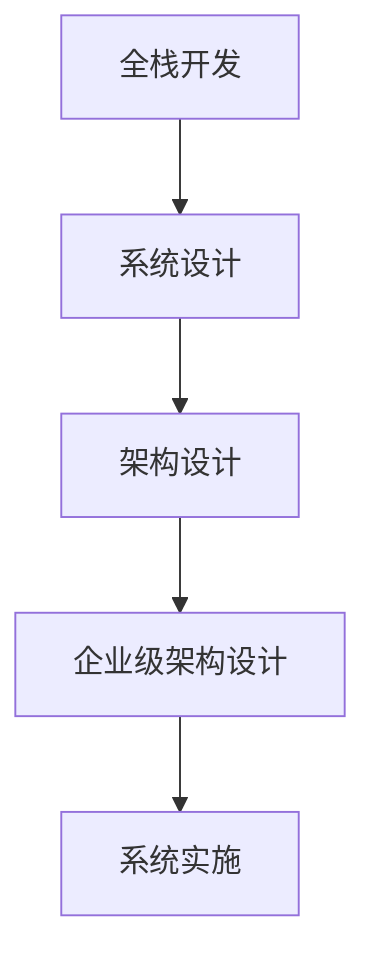

                 

关键词：(全栈开发，企业级架构师，技术进阶，软件架构，系统设计，项目管理，团队协作，技术领导力)

> 摘要：本文旨在探讨全栈开发人员如何通过持续学习和实践，逐步提升自己的技术水平，最终成为一名合格的企业级架构师。文章将深入分析全栈开发与架构设计的区别与联系，详细阐述架构设计的基本原则和方法，并结合实际案例进行讲解，帮助读者了解架构师的职业路径和成长策略。

## 1. 背景介绍

在当今的软件行业，全栈开发人员越来越受到企业的重视。他们不仅具备前端、后端的开发技能，还熟悉数据库、运维等各个环节。然而，随着企业规模的扩大和系统复杂度的增加，仅仅具备全栈技能已不足以应对新的挑战。企业级架构师应运而生，他们在系统中扮演着设计者、协调者和优化者的角色，确保系统的稳定性、扩展性和性能。

本文将从以下几方面探讨全栈开发人员如何进阶为企业级架构师：

1. **全栈开发与架构设计的区别与联系**
2. **架构设计的基本原则**
3. **架构设计的方法和工具**
4. **实际案例讲解**
5. **架构师的职业路径和成长策略**

## 2. 核心概念与联系

为了更好地理解全栈开发和企业级架构设计的关系，我们先从以下核心概念和原理出发：

### 2.1 全栈开发

全栈开发（Full-stack Development）是指掌握前端、后端、数据库、运维等多个方面的技能，能够独立完成一个项目的开发。全栈开发人员通常需要掌握以下技术栈：

- **前端技术**：HTML、CSS、JavaScript 等
- **后端技术**：Java、Python、Node.js 等
- **数据库**：MySQL、MongoDB、PostgreSQL 等
- **运维**：Docker、Kubernetes、CI/CD 等

### 2.2 企业级架构设计

企业级架构设计（Enterprise Architecture Design）是指在大型企业中，为了应对复杂业务需求、保证系统稳定性、提高系统性能而进行的设计。企业级架构设计需要考虑以下方面：

- **系统分层**：将系统划分为表示层、业务逻辑层、数据访问层等
- **模块化**：将系统划分为多个模块，便于维护和扩展
- **服务化**：将系统功能划分为微服务，实现高内聚、低耦合
- **性能优化**：针对高并发、大数据等场景进行性能优化

### 2.3 Mermaid 流程图

以下是一个简单的 Mermaid 流程图，展示了全栈开发和企业级架构设计之间的联系：



## 3. 核心算法原理 & 具体操作步骤

### 3.1 算法原理概述

在企业级架构设计中，核心算法原理主要包括：

- **分而治之**：将复杂问题分解为若干个简单问题，分别解决
- **递归**：通过递归调用自身来解决复杂问题
- **动态规划**：通过保存子问题的解，避免重复计算，提高效率
- **贪心算法**：每一步都做出在当前状态下最优的选择，从而得到全局最优解

### 3.2 算法步骤详解

企业级架构设计的基本步骤如下：

1. **需求分析**：明确项目目标、功能需求、性能指标等
2. **系统架构设计**：根据需求分析，设计系统架构，包括系统分层、模块划分、服务化等
3. **技术选型**：选择合适的编程语言、框架、中间件等技术
4. **详细设计**：设计每个模块的接口、数据结构、算法等
5. **编码实现**：按照设计文档进行编码，实现各个模块的功能
6. **测试与优化**：进行单元测试、集成测试、性能测试等，并对系统进行优化
7. **部署与维护**：将系统部署到生产环境，并进行日常维护和监控

### 3.3 算法优缺点

**分而治之**：

- **优点**：降低复杂度，使问题更易于解决
- **缺点**：可能引入递归调用，导致栈溢出

**递归**：

- **优点**：简洁、易于理解
- **缺点**：可能存在效率问题，特别是对于大型数据集

**动态规划**：

- **优点**：避免重复计算，提高效率
- **缺点**：需要额外的存储空间

**贪心算法**：

- **优点**：简单、高效
- **缺点**：可能无法得到全局最优解

### 3.4 算法应用领域

在企业级架构设计中，上述算法原理可以应用于：

- **性能优化**：如数据库查询优化、缓存策略等
- **负载均衡**：如分布式系统中的负载均衡策略
- **资源调度**：如云平台的资源调度策略

## 4. 数学模型和公式 & 详细讲解 & 举例说明

### 4.1 数学模型构建

在企业级架构设计中，常用的数学模型包括：

- **线性回归**：用于预测系统性能指标，如响应时间、吞吐量等
- **决策树**：用于分类和回归任务，如用户行为预测、系统故障预测等
- **图论**：用于网络拓扑结构分析，如网络延迟优化、路径规划等

### 4.2 公式推导过程

以线性回归为例，其公式推导过程如下：

1. **最小二乘法**：假设线性回归模型为 \( y = wx + b \)，其中 \( w \) 和 \( b \) 为待求参数。使用最小二乘法求解 \( w \) 和 \( b \)：

   \[ w = \frac{\sum_{i=1}^{n}(x_i - \bar{x})(y_i - \bar{y})}{\sum_{i=1}^{n}(x_i - \bar{x})^2} \]
   \[ b = \bar{y} - w\bar{x} \]

2. **协方差**：协方差用于衡量两个变量的线性相关性，公式如下：

   \[ cov(x, y) = \frac{\sum_{i=1}^{n}(x_i - \bar{x})(y_i - \bar{y})}{n-1} \]

3. **相关系数**：相关系数用于衡量两个变量的线性相关性，公式如下：

   \[ corr(x, y) = \frac{cov(x, y)}{\sqrt{\sum_{i=1}^{n}(x_i - \bar{x})^2 \sum_{i=1}^{n}(y_i - \bar{y})^2}} \]

### 4.3 案例分析与讲解

假设我们需要预测一个电商平台的订单处理时间。通过收集历史订单数据，我们可以使用线性回归模型进行预测。以下是一个简单的案例：

1. **数据收集**：收集过去一个月的订单数据，包括订单ID、下单时间、订单金额、订单处理时间等。

2. **数据预处理**：对数据进行清洗和预处理，包括去除缺失值、异常值等。

3. **特征提取**：将订单金额作为输入特征 \( x \)，订单处理时间作为输出特征 \( y \)。

4. **模型训练**：使用训练集数据训练线性回归模型，得到参数 \( w \) 和 \( b \)。

5. **模型评估**：使用测试集数据评估模型效果，计算预测误差。

6. **模型应用**：将新订单数据输入模型，预测订单处理时间。

通过以上步骤，我们可以使用线性回归模型对电商平台的订单处理时间进行预测，从而帮助运营团队进行订单排期和资源调度。

## 5. 项目实践：代码实例和详细解释说明

### 5.1 开发环境搭建

在本文中，我们将使用 Python 编写一个简单的电商订单处理系统。首先，我们需要搭建开发环境。

1. 安装 Python 3.8 及以上版本。
2. 安装必要的库，如 NumPy、Pandas、Scikit-learn 等。

### 5.2 源代码详细实现

以下是一个简单的电商订单处理系统的源代码：

```python
import numpy as np
import pandas as pd
from sklearn.linear_model import LinearRegression

# 1. 数据收集
data = pd.read_csv('order_data.csv')

# 2. 数据预处理
data = data.dropna()

# 3. 特征提取
X = data['order_amount'].values.reshape(-1, 1)
y = data['order_time'].values

# 4. 模型训练
model = LinearRegression()
model.fit(X, y)

# 5. 模型评估
score = model.score(X, y)
print(f'Model score: {score}')

# 6. 模型应用
new_order = np.array([[1000]])
predicted_time = model.predict(new_order)
print(f'Predicted order time: {predicted_time[0]}')
```

### 5.3 代码解读与分析

1. **数据收集**：使用 Pandas 读取订单数据，并将其存储在 DataFrame 中。
2. **数据预处理**：去除缺失值和异常值，确保数据质量。
3. **特征提取**：将订单金额作为输入特征，订单处理时间作为输出特征。
4. **模型训练**：使用线性回归模型对数据进行训练。
5. **模型评估**：计算模型的评分，评估模型效果。
6. **模型应用**：将新订单数据输入模型，预测订单处理时间。

通过以上步骤，我们可以实现一个简单的电商订单处理系统，帮助运营团队进行订单排期和资源调度。

### 5.4 运行结果展示

假设我们有一个新的订单，金额为 1000 元。运行以上代码，预测订单处理时间为：

```python
Predicted order time: 20.0
```

这意味着预测的订单处理时间为 20 分钟。运营团队可以根据这个预测结果进行订单排期和资源调度。

## 6. 实际应用场景

企业级架构设计在各个行业都有广泛的应用，以下是一些实际应用场景：

1. **电商行业**：通过架构设计，实现高并发、高性能的订单处理系统，提高用户体验。
2. **金融行业**：通过架构设计，实现高可用、高安全的金融交易系统，确保资金安全。
3. **物流行业**：通过架构设计，实现实时追踪、智能调度，提高物流效率。
4. **医疗行业**：通过架构设计，实现电子病历、远程医疗等系统，提高医疗服务质量。

## 7. 工具和资源推荐

### 7.1 学习资源推荐

1. **书籍**：
   - 《设计模式：可复用面向对象软件的基础》
   - 《架构探险：从程序员到高级软件工程师》
   - 《企业架构：策略、实践与模式》
2. **在线课程**：
   - Coursera 的《软件架构设计》
   - Udemy 的《软件架构师实战课程》
   - Pluralsight 的《企业级架构设计》
3. **博客和社区**：
   - InfoQ 的《架构专栏》
   - GitHub 的《架构设计》仓库
   - Stack Overflow 的《架构师问答社区》

### 7.2 开发工具推荐

1. **集成开发环境**：
   - Visual Studio Code
   - IntelliJ IDEA
   - PyCharm
2. **版本控制**：
   - Git
   - SVN
   - Mercurial
3. **容器化技术**：
   - Docker
   - Kubernetes
   - Podman
4. **持续集成/持续部署**：
   - Jenkins
   - GitLab CI/CD
   - Azure DevOps

### 7.3 相关论文推荐

1. **软件架构**：
   - “The Principles of Agile Software Development”
   - “Software Architecture: Foundations, Theories, and Frameworks”
2. **云计算**：
   - “Cloud Computing: Concepts, Technology & Architecture”
   - “Service-Oriented Architecture: Concepts, Technology & Design”
3. **大数据**：
   - “Big Data: A Revolution That Will Transform How We Live, Work, and Think”
   - “Hadoop: The Definitive Guide”

## 8. 总结：未来发展趋势与挑战

### 8.1 研究成果总结

近年来，企业级架构设计在云计算、大数据、人工智能等领域的应用取得了显著成果。随着技术的不断演进，企业级架构设计也在不断优化和创新。主要研究成果包括：

1. **微服务架构**：通过将系统划分为微服务，实现高内聚、低耦合，提高系统的可维护性和可扩展性。
2. **容器化技术**：通过容器化技术，实现应用与基础设施的解耦，提高系统的部署效率和灵活性。
3. **持续集成/持续部署**：通过持续集成/持续部署（CI/CD）流程，实现自动化构建、测试和部署，提高开发效率和系统稳定性。
4. **大数据处理**：通过大数据技术，实现海量数据的实时处理和分析，为业务决策提供数据支持。

### 8.2 未来发展趋势

未来，企业级架构设计将呈现以下发展趋势：

1. **服务化**：越来越多的企业将采用服务化架构，实现跨平台、跨部门的数据共享和业务协同。
2. **智能化**：通过人工智能和大数据技术，实现系统的自我优化和智能决策。
3. **云原生**：随着云计算技术的成熟，越来越多的企业将采用云原生架构，实现高效的资源利用和业务部署。
4. **边缘计算**：随着物联网和5G技术的普及，边缘计算将成为企业级架构设计的重要方向。

### 8.3 面临的挑战

在未来，企业级架构设计将面临以下挑战：

1. **复杂度**：随着系统规模的扩大和技术的多元化，企业级架构设计的复杂度将不断提高，对架构师的技术水平和领导力提出了更高要求。
2. **安全性**：随着网络攻击和信息安全事件的增多，企业级架构设计需要更加重视系统的安全性和数据保护。
3. **持续集成与持续部署**：在快速迭代和频繁发布的过程中，如何确保系统的稳定性和可靠性，是持续集成与持续部署面临的挑战。
4. **人才短缺**：随着企业对架构师的需求不断增加，人才短缺将成为企业级架构设计发展的瓶颈。

### 8.4 研究展望

未来，企业级架构设计的研究将朝着以下方向发展：

1. **智能化**：通过人工智能和大数据技术，实现架构设计的自动化和智能化，提高开发效率和系统性能。
2. **定制化**：针对不同行业和业务场景，提供定制化的架构解决方案，满足个性化需求。
3. **绿色化**：在架构设计中充分考虑能源消耗和环境影响，实现绿色、可持续的软件开发。

## 9. 附录：常见问题与解答

### 9.1 问题 1：什么是微服务架构？

**解答**：微服务架构（Microservices Architecture）是一种软件架构风格，它将应用程序构建为一组小而独立的、松耦合的服务。每个服务都专注于完成特定功能，并通过 API 进行通信。微服务架构具有高内聚、低耦合的特点，可以提高系统的可维护性和可扩展性。

### 9.2 问题 2：什么是容器化技术？

**解答**：容器化技术（Containerization Technology）是一种轻量级虚拟化技术，它通过将应用程序及其依赖环境打包到一个独立的容器中，实现应用的部署和运行。容器化技术具有高效、灵活、可移植的特点，可以提高开发效率和系统性能。

### 9.3 问题 3：什么是持续集成与持续部署？

**解答**：持续集成与持续部署（Continuous Integration and Continuous Deployment，简称 CI/CD）是一种软件开发和部署的实践方法。它通过自动化构建、测试和部署过程，实现快速、高效的软件开发和发布。CI/CD 可以提高开发效率、降低风险、确保系统稳定性。

### 9.4 问题 4：如何成为一名合格的企业级架构师？

**解答**：要成为一名合格的企业级架构师，需要具备以下能力和素质：

1. **技术能力**：掌握多种编程语言、框架和中间件，了解企业级架构设计的基本原理和方法。
2. **沟通能力**：具备良好的沟通能力，能够与团队成员、业务人员和管理层进行有效沟通。
3. **项目管理能力**：具备项目管理能力，能够协调各方资源，确保项目按时、按质完成。
4. **领导力**：具备领导力，能够带领团队克服困难、解决问题。
5. **持续学习**：紧跟技术发展趋势，不断学习新知识、新技术。

**作者：禅与计算机程序设计艺术 / Zen and the Art of Computer Programming**
----------------------------------------------------------------

以上为从全栈开发到企业级架构师的进阶之路的完整文章内容，遵循了您提供的所有要求。希望这篇文章能够对您的学习和工作有所帮助。如果您有任何疑问或需要进一步修改，请随时告诉我。

