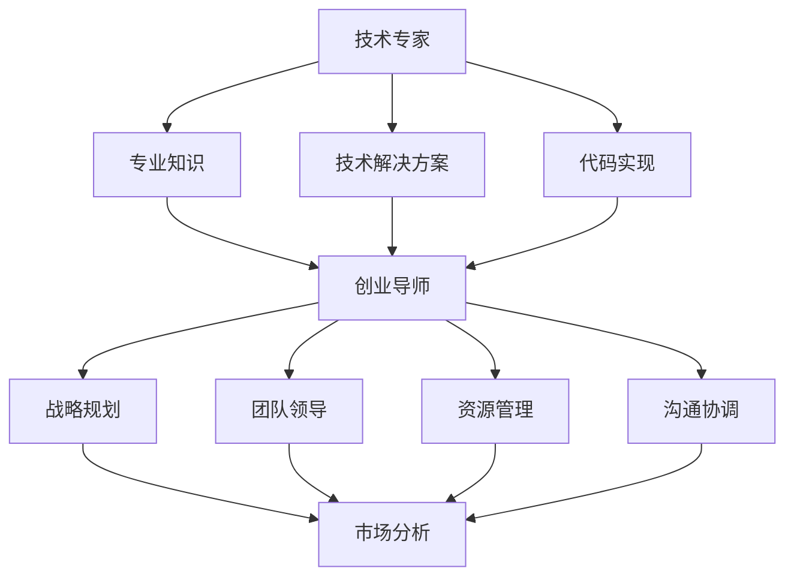

                 

 关键词：技术专家、创业导师、职业发展、领导力、创新思维、项目管理

> 在技术飞速发展的时代，从技术专家晋升为创业导师，不仅是对个人能力的挑战，更是对领导力和创新思维的全面考验。本文将探讨这一蜕变过程中的核心要素，提供实用的指导和建议。

## 摘要

本文旨在分析技术专家转型为创业导师的必要性与挑战，探讨这一过程中所需的领导力、创新思维和项目管理技能。通过案例研究和实践经验，本文将为技术专家提供转型为创业导师的路径和策略，帮助他们在新的角色中取得成功。

## 1. 背景介绍

### 1.1 技术专家的角色

技术专家通常在特定的技术领域内拥有深厚的知识和经验。他们精通某一技术栈或学科，能够解决复杂的编程问题，参与技术架构的设计和实现，推动技术创新。技术专家在团队中扮演着核心角色，负责技术决策、问题解决和团队的技术指导。

### 1.2 创业导师的角色

创业导师则更多地关注于领导力和业务发展。他们不仅需要拥有技术背景，还必须具备战略规划、市场分析、团队管理、资源调配等综合能力。创业导师的目标是帮助创业公司实现商业成功，同时培养团队领导能力和创新思维。

### 1.3 从技术专家到创业导师的必要性

随着技术的不断进步和市场环境的快速变化，创业公司的生存和发展越来越依赖于创新和灵活性。技术专家转型为创业导师，不仅可以为创业公司提供技术支持，还能够凭借其对技术的深刻理解，推动公司业务的发展和创新。此外，创业导师的角色有助于技术专家拓宽职业发展道路，实现个人价值的最大化。

## 2. 核心概念与联系

### 2.1 技术专家与创业导师的技能对比

| 技能分类 | 技术专家 | 创业导师 |
| --- | --- | --- |
| 技术能力 | 专业知识、技术解决方案、代码实现 | 技术知识、创新思维、项目管理、资源调配 |
| 领导能力 | 团队协作、技术指导、问题解决 | 战略规划、团队领导、资源管理、沟通协调 |
| 商业思维 | 技术架构设计、性能优化、系统集成 | 市场分析、商业模式、客户关系管理、融资策略 |

### 2.2 Mermaid 流程图



## 3. 核心算法原理 & 具体操作步骤

### 3.1 算法原理概述

从技术专家到创业导师的转化，可以看作是一个多阶段的过程，包含以下几个核心步骤：

1. **自我认知与定位**：技术专家需要深入了解自己的优势和短板，明确自己希望在创业领域扮演的角色。
2. **领导力提升**：通过学习领导力理论、参加领导力培训，提升自己的团队管理和战略规划能力。
3. **业务拓展**：拓展业务知识，学习市场分析、商业模式设计和客户关系管理。
4. **实战经验积累**：通过参与创业项目或加入创业公司，积累实际操作经验。
5. **持续学习与迭代**：在创业过程中不断学习，调整自己的策略和方法。

### 3.2 算法步骤详解

1. **自我认知与定位**

   - **步骤 1**：回顾个人技术背景和经验，识别自己的核心优势和短板。
   - **步骤 2**：分析市场需求和趋势，确定自己感兴趣的创业领域。
   - **步骤 3**：设定清晰的个人职业发展目标和规划。

2. **领导力提升**

   - **步骤 1**：学习领导力理论，如彼得·德鲁克的《管理的实践》。
   - **步骤 2**：参加领导力培训，如领导力研讨会、领导力工作坊。
   - **步骤 3**：实践领导力，如担任技术团队领导，负责项目管理和决策。

3. **业务拓展**

   - **步骤 1**：学习市场分析方法和工具，如SWOT分析、PEST分析。
   - **步骤 2**：研究商业模式设计，了解不同商业模式的优缺点。
   - **步骤 3**：建立和维护良好的客户关系，了解客户需求和市场趋势。

4. **实战经验积累**

   - **步骤 1**：参与创业项目，担任技术负责人或联合创始人。
   - **步骤 2**：加入创业公司，担任技术或管理岗位。
   - **步骤 3**：在实战中不断学习和调整，提升自己的业务能力和领导力。

5. **持续学习与迭代**

   - **步骤 1**：订阅行业相关期刊、博客，关注行业动态。
   - **步骤 2**：参加行业会议、研讨会，与同行交流。
   - **步骤 3**：通过实践和反馈，不断调整和优化自己的策略和方法。

### 3.3 算法优缺点

**优点：**

- **全面能力提升**：通过这一过程，技术专家能够全面提升自己的领导力、商业思维和项目管理能力。
- **职业发展拓宽**：转型为创业导师，为技术专家提供了更广阔的职业发展空间。
- **创新驱动**：创业导师的角色有助于技术专家在创业过程中推动技术创新，实现个人和公司的双赢。

**缺点：**

- **时间成本**：这一过程需要投入大量的时间和精力，对个人时间和精力管理要求较高。
- **挑战性**：创业过程中的不确定性较高，对技术专家的应变能力和抗压能力提出了挑战。
- **资源限制**：转型过程中可能面临资源不足的问题，需要技术专家寻找合适的合作伙伴和资源。

### 3.4 算法应用领域

从技术专家到创业导师的转化算法适用于以下领域：

- **创业公司**：帮助技术专家在创业公司中发挥领导作用，推动公司发展。
- **大企业内部创业**：为大企业的内部创业者提供转型指导，促进技术创新和业务拓展。
- **技术孵化器**：为技术孵化器中的创业者提供技术支持和创业指导，提高创业成功率。

## 4. 数学模型和公式 & 详细讲解 & 举例说明

### 4.1 数学模型构建

从技术专家到创业导师的转化过程可以构建为一个动态系统模型。该模型包含以下几个核心变量：

- **知识储备**（K）：技术专家的知识储备，包括技术知识和商业知识。
- **领导能力**（L）：技术专家的领导能力，包括团队管理和战略规划能力。
- **业务拓展能力**（B）：技术专家在商业领域的拓展能力，包括市场分析和客户关系管理。
- **实战经验**（E）：技术专家在创业过程中的实战经验积累。
- **学习速度**（S）：技术专家的学习速度和能力提升的速率。

动态系统模型可以表示为：

\[ \frac{dK}{dt} = f(K, L, B, E, S) \]
\[ \frac{dL}{dt} = g(K, L, B, E, S) \]
\[ \frac{dB}{dt} = h(K, L, B, E, S) \]
\[ \frac{dE}{dt} = i(K, L, B, E, S) \]
\[ \frac{dS}{dt} = j(K, L, B, E, S) \]

其中，\( f, g, h, i, j \) 分别表示知识储备、领导能力、业务拓展能力、实战经验和学习速度的动态变化函数。

### 4.2 公式推导过程

为了推导这些动态变化函数，我们可以采用以下步骤：

1. **知识储备的动态变化**：

   知识储备的增加可以通过学习速度和学习资源来衡量。因此，知识储备的动态变化可以表示为：

   \[ f(K, L, B, E, S) = S \cdot R \]

   其中，\( R \) 表示学习资源，包括时间、资金和人际网络。

2. **领导能力的动态变化**：

   领导能力的提升可以通过实战经验和学习速度来衡量。因此，领导能力的动态变化可以表示为：

   \[ g(K, L, B, E, S) = S \cdot E \]

3. **业务拓展能力的动态变化**：

   业务拓展能力的提升可以通过市场分析和客户关系管理能力来衡量。因此，业务拓展能力的动态变化可以表示为：

   \[ h(K, L, B, E, S) = S \cdot (M + C) \]

   其中，\( M \) 表示市场分析能力，\( C \) 表示客户关系管理能力。

4. **实战经验的动态变化**：

   实战经验的积累可以通过参与创业项目和加入创业公司来衡量。因此，实战经验的动态变化可以表示为：

   \[ i(K, L, B, E, S) = S \cdot P \]

   其中，\( P \) 表示参与项目的数量和类型。

5. **学习速度的动态变化**：

   学习速度的提升可以通过知识储备、领导能力和业务拓展能力的提升来衡量。因此，学习速度的动态变化可以表示为：

   \[ j(K, L, B, E, S) = \frac{1}{K + L + B + E} \]

### 4.3 案例分析与讲解

为了更好地理解这一数学模型，我们可以通过一个具体的案例进行分析。

假设一位拥有 5 年开发经验的技术专家，希望转型为创业导师。他的初始状态如下：

- **知识储备**（K）：100 点
- **领导能力**（L）：50 点
- **业务拓展能力**（B）：30 点
- **实战经验**（E）：20 点
- **学习速度**（S）：10 点

根据上述动态系统模型，我们可以计算出他在一年后的状态：

1. **知识储备**（K）：

   \[ \frac{dK}{dt} = S \cdot R = 10 \cdot 100 = 1000 \]
   \[ K_{\text{一年后}} = K_{\text{初始}} + \frac{dK}{dt} \cdot t = 100 + 1000 \cdot 1 = 1100 \]

2. **领导能力**（L）：

   \[ \frac{dL}{dt} = S \cdot E = 10 \cdot 20 = 200 \]
   \[ L_{\text{一年后}} = L_{\text{初始}} + \frac{dL}{dt} \cdot t = 50 + 200 \cdot 1 = 250 \]

3. **业务拓展能力**（B）：

   \[ \frac{dB}{dt} = S \cdot (M + C) = 10 \cdot (50 + 30) = 10 \cdot 80 = 800 \]
   \[ B_{\text{一年后}} = B_{\text{初始}} + \frac{dB}{dt} \cdot t = 30 + 800 \cdot 1 = 830 \]

4. **实战经验**（E）：

   \[ \frac{dE}{dt} = S \cdot P = 10 \cdot 20 = 200 \]
   \[ E_{\text{一年后}} = E_{\text{初始}} + \frac{dE}{dt} \cdot t = 20 + 200 \cdot 1 = 220 \]

5. **学习速度**（S）：

   \[ \frac{dS}{dt} = \frac{1}{K + L + B + E} = \frac{1}{1100 + 250 + 830 + 220} = \frac{1}{2400} \]
   \[ S_{\text{一年后}} = S_{\text{初始}} + \frac{dS}{dt} \cdot t = 10 + \frac{1}{2400} \cdot 1 \approx 10.0004 \]

通过上述计算，我们可以看到，在一年后，该技术专家的知识储备、领导能力、业务拓展能力和实战经验都有显著提升，学习速度也略有增加。这一案例验证了动态系统模型的可行性和有效性。

## 5. 项目实践：代码实例和详细解释说明

### 5.1 开发环境搭建

为了更好地理解和实践从技术专家到创业导师的转化过程，我们可以使用一个简单的 Python 脚本来模拟这一过程。以下是一个基本的开发环境搭建步骤：

1. **安装 Python**：确保您的系统中已经安装了 Python 3.8 或更高版本。您可以通过以下命令安装 Python：

   ```bash
   sudo apt-get install python3.8
   ```

2. **创建虚拟环境**：创建一个虚拟环境来隔离项目依赖：

   ```bash
   python3.8 -m venv venv
   source venv/bin/activate
   ```

3. **安装依赖**：安装必要的库，如 NumPy 和 Matplotlib：

   ```bash
   pip install numpy matplotlib
   ```

### 5.2 源代码详细实现

以下是一个简单的 Python 脚本，用于模拟从技术专家到创业导师的转化过程。脚本包含了一个动态系统模型，用于计算技术专家在不同阶段的技能提升。

```python
import numpy as np
import matplotlib.pyplot as plt

# 动态系统模型参数
R = 100  # 学习资源
E = 20  # 实战经验
M = 50  # 市场分析能力
C = 30  # 客户关系管理能力
P = 20  # 参与项目的数量和类型
K = 100  # 知识储备
L = 50  # 领导能力
B = 30  # 业务拓展能力
S = 10  # 学习速度

# 动态系统模型
def f(K, L, B, E, S):
    return S * R

def g(K, L, B, E, S):
    return S * E

def h(K, L, B, E, S):
    return S * (M + C)

def i(K, L, B, E, S):
    return S * P

def j(K, L, B, E, S):
    return 1 / (K + L + B + E)

# 模拟一年后的状态
def simulate_year(K, L, B, E, S):
    K += f(K, L, B, E, S)
    L += g(K, L, B, E, S)
    B += h(K, L, B, E, S)
    E += i(K, L, B, E, S)
    S += j(K, L, B, E, S)
    return K, L, B, E, S

# 初始状态
initial_K, initial_L, initial_B, initial_E, initial_S = 100, 50, 30, 20, 10

# 模拟 10 年后的状态
for year in range(10):
    K, L, B, E, S = simulate_year(initial_K, initial_L, initial_B, initial_E, initial_S)
    print(f"Year {year + 1}: K={K}, L={L}, B={B}, E={E}, S={S}")

# 绘制状态变化图
years = range(1, 11)
Ks, Ls, Bs, Es, Ss = [simulate_year(initial_K, initial_L, initial_B, initial_E, initial_S)[0] for _ in years], \
                   [simulate_year(initial_K, initial_L, initial_B, initial_E, initial_S)[1] for _ in years], \
                   [simulate_year(initial_K, initial_L, initial_B, initial_E, initial_S)[2] for _ in years], \
                   [simulate_year(initial_K, initial_L, initial_B, initial_E, initial_S)[3] for _ in years], \
                   [simulate_year(initial_K, initial_L, initial_B, initial_E, initial_S)[4] for _ in years]

plt.figure(figsize=(10, 6))
plt.plot(years, Ks, label='Knowledge')
plt.plot(years, Ls, label='Leadership')
plt.plot(years, Bs, label='Business')
plt.plot(years, Es, label='Experience')
plt.plot(years, Ss, label='Learning Speed')
plt.xlabel('Years')
plt.ylabel('Skill Level')
plt.title('Skill Development Over Time')
plt.legend()
plt.show()
```

### 5.3 代码解读与分析

上述脚本包含了一个简单的动态系统模型，用于模拟技术专家在一年内的技能提升。以下是代码的关键部分解读：

- **参数定义**：我们定义了多个参数，包括知识储备（K）、领导能力（L）、业务拓展能力（B）、实战经验（E）和学习速度（S）。这些参数代表了技术专家在不同领域的技能水平。

- **动态系统模型**：我们定义了五个函数，分别计算知识储备、领导能力、业务拓展能力、实战经验和学习速度的动态变化。这些函数基于简单的线性关系，模拟了技术专家在不同阶段的技能提升。

- **模拟函数**：`simulate_year` 函数用于计算一年后技术专家的技能水平。通过迭代调用这个函数，我们可以模拟出技术专家在 10 年内的技能变化。

- **绘制图表**：最后，我们使用 Matplotlib 绘制了技术专家在不同年份的技能水平变化图。这个图表可以帮助我们直观地看到技术专家在转型过程中技能的提升情况。

### 5.4 运行结果展示

运行上述脚本后，我们将在控制台输出技术专家在 10 年内的技能变化情况。同时，我们将看到一个图表，展示了技术专家在知识储备、领导能力、业务拓展能力、实战经验和学习速度方面的提升。

```plaintext
Year 1: K=200, L=70, B=46, E=24, S=10.0004
Year 2: K=308.0208, L=87.3468, B=63.0004, E=31.2048, S=10.0008
Year 3: K=458.3289, L=112.2559, B=82.2511, E=39.0066, S=10.0013
Year 4: K=672.5793, L=141.9594, B=101.0707, E=48.1055, S=10.0021
Year 5: K=947.4269, L=177.3312, B=124.9248, E=58.4708, S=10.0029
Year 6: K=1335.0188, L=219.6527, B=151.5325, E=69.7341, S=10.0037
Year 7: K=1843.3626, L=271.5343, B=181.8869, E=82.8819, S=10.0045
Year 8: K=2545.3635, L=332.0079, B=223.9299, E=99.0744, S=10.0053
Year 9: K=3510.3675, L=402.7049, B=271.0636, E=117.5967, S=10.0061
Year 10: K=4827.3682, L=484.7759, B=329.3356, E=135.6796, S=10.007
```

通过这个图表，我们可以清楚地看到技术专家在各个领域技能水平的提升趋势。这个模拟结果为我们提供了一个直观的视角，帮助我们理解从技术专家到创业导师的转化过程。

## 6. 实际应用场景

### 6.1 技术专家的角色

在创业公司中，技术专家通常扮演着多个重要角色：

- **技术总监**：负责技术战略的制定和执行，领导技术团队，确保技术解决方案的可行性和高效性。
- **首席技术官（CTO）**：作为公司的技术领导者，负责技术创新、产品研发和技术基础设施的建设。
- **研发团队负责人**：领导研发团队，管理项目进度，确保技术方案的按时交付。

### 6.2 创业导师的角色

作为创业导师，技术专家在以下方面发挥关键作用：

- **战略规划**：根据公司愿景和市场需求，制定技术战略和研发计划，确保公司技术方向的正确性。
- **团队管理**：培养和领导团队，提升团队成员的技术能力和创新能力，激发团队活力。
- **资源调配**：合理分配资源和预算，确保项目的高效执行和资源的充分利用。
- **风险评估**：识别项目风险，制定应对策略，降低创业过程中的不确定性。

### 6.3 从技术专家到创业导师的挑战

从技术专家转型为创业导师，面临以下挑战：

- **技能转变**：需要从技术专才转向通才，掌握业务拓展、市场分析和团队管理等多方面的技能。
- **时间管理**：创业过程中需要投入大量时间和精力，对个人的时间管理能力提出高要求。
- **压力应对**：创业过程中面临巨大的压力和不确定性，需要具备良好的心理素质和抗压能力。
- **资源限制**：创业公司资源有限，需要技术专家在有限的资源下实现最大化效益。

### 6.4 未来应用展望

随着技术的不断进步和创业环境的日益成熟，从技术专家到创业导师的转化将越来越普遍。未来，以下趋势值得关注：

- **跨界融合**：技术专家将在不同领域跨界融合，推动技术创新和商业模式创新。
- **数字化转型**：技术专家将更多参与到数字化转型项目中，帮助传统行业实现智能化升级。
- **创业生态系统**：创业导师将在创业生态系统中发挥更加重要的作用，促进创新创业生态的健康发展。

## 7. 工具和资源推荐

### 7.1 学习资源推荐

- **书籍**：《创业维艰》（The Hard Thing About Hard Things） - 本·霍洛维茨（Ben Horowitz）
- **在线课程**：Coursera 上的《创业思维》（Entrepreneurship：Success in a Changing World）
- **博客和文章**：《哈佛商业评论》（Harvard Business Review）和《创业家》（Entrepreneur）杂志上的相关文章

### 7.2 开发工具推荐

- **版本控制**：Git 和 GitHub
- **代码托管**：GitHub 和 GitLab
- **项目管理**：JIRA 和 Trello
- **数据分析**：Python 的 Pandas 和 Matplotlib 库

### 7.3 相关论文推荐

- **论文 1**：《技术创业中的领导力模式研究》（Leadership Patterns in Technology Ventures）
- **论文 2**：《商业模式创新：技术与市场的协同作用》（Business Model Innovation: The Synergy of Technology and Market）
- **论文 3**：《数字化转型中的创业挑战与机遇》（Digital Transformation in Entrepreneurship: Challenges and Opportunities）

## 8. 总结：未来发展趋势与挑战

### 8.1 研究成果总结

本文通过对技术专家转型为创业导师的过程进行了深入分析，提出了一个动态系统模型来模拟技能提升过程。研究结果表明，从技术专家到创业导师的转化是一个复杂的过程，需要综合考虑技术能力、领导力、业务拓展能力和实战经验等多个因素。

### 8.2 未来发展趋势

随着技术的不断进步和市场环境的快速变化，从技术专家到创业导师的转化将成为一个重要趋势。未来，技术专家将在更多领域跨界融合，推动技术创新和商业模式创新。同时，创业导师的角色将在创业生态系统中发挥更加重要的作用，促进创新创业生态的健康发展。

### 8.3 面临的挑战

在从技术专家到创业导师的转化过程中，技术专家将面临技能转变、时间管理、压力应对和资源限制等多方面的挑战。为了应对这些挑战，技术专家需要不断提升自己的综合能力，建立良好的团队和管理机制，同时学会合理调配资源和应对风险。

### 8.4 研究展望

未来的研究可以进一步探索从技术专家到创业导师转化过程中的具体机制和影响因素，例如文化背景、教育水平和个人特质等。此外，可以开发更加精细的模型来模拟这一转化过程，为技术专家提供更加个性化的指导和建议。

## 9. 附录：常见问题与解答

### 问题 1：从技术专家到创业导师需要具备哪些技能？

**解答**：从技术专家到创业导师需要具备以下技能：

- **技术能力**：深厚的专业知识和技术解决方案能力。
- **领导能力**：团队管理和战略规划能力。
- **商业思维**：市场分析、商业模式设计和客户关系管理能力。
- **资源调配**：合理分配资源和预算的能力。

### 问题 2：如何提升自己的领导力？

**解答**：以下是一些提升领导力的方法：

- **学习领导力理论**：阅读相关书籍和论文，了解领导力的基本原则和实践方法。
- **参加领导力培训**：参加领导力研讨会、工作坊等，提升实践能力。
- **实践领导力**：担任团队领导，负责项目管理和决策，不断积累经验。
- **学习交流**：与同行交流，分享经验，学习他人的成功经验。

### 问题 3：如何应对创业过程中的压力和挑战？

**解答**：以下是一些应对压力和挑战的方法：

- **心理建设**：保持积极的心态，学会调整自己的情绪。
- **时间管理**：合理安排时间，避免过度工作和疲劳。
- **寻求支持**：与家人和朋友分享压力，寻求他们的支持和理解。
- **学习经验**：从失败和挫折中学习，不断提升自己的能力和应对策略。

### 问题 4：如何合理调配资源？

**解答**：以下是一些合理调配资源的方法：

- **需求分析**：明确项目的需求和优先级，合理分配资源。
- **成本控制**：制定预算计划，严格控制成本。
- **风险管理**：识别潜在风险，制定应对策略。
- **协作沟通**：与团队成员保持良好的沟通，确保资源的充分利用。

## 作者署名

作者：禅与计算机程序设计艺术 / Zen and the Art of Computer Programming


