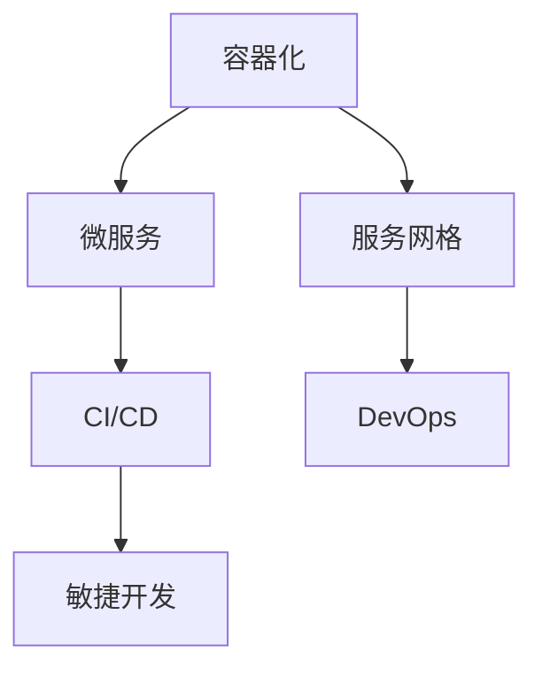

                 

关键词：云原生、AI电商平台、技术架构、现代化、本地部署、容器化、微服务、Kubernetes、服务网格、持续集成与部署、DevOps、敏捷开发

摘要：本文旨在探讨AI电商平台在技术架构现代化过程中的关键路径，从本地部署模式逐步迁移到云原生架构，并分析在此过程中面临的主要挑战、解决方案以及未来发展方向。通过详细的技术解析和实际案例，为行业从业者提供有价值的参考和指导。

## 1. 背景介绍

随着云计算和人工智能技术的快速发展，电商平台面临着日益增长的数据处理需求和复杂的应用场景。传统的本地部署模式已无法满足这些需求，导致系统扩展性、可维护性和可靠性问题逐渐显现。因此，企业纷纷寻求将技术架构向云原生方向转型，以提高业务敏捷性和市场竞争力。

### 1.1 云原生概念

云原生（Cloud Native）是一种利用云计算环境中的动态资源管理和自动化特性，构建和运行可扩展、高可用、可靠的应用架构的方法论。云原生架构的核心在于容器化、微服务化、服务网格和持续集成与部署（CI/CD）等技术的集成应用。

### 1.2 AI电商平台现状

AI电商平台在技术架构方面已取得显著进步，但仍然存在许多局限性。许多平台采用传统的单体架构，使得系统扩展困难、维护复杂，并且难以适应快速变化的市场需求。此外，随着数据量和用户量的增长，传统架构的性能瓶颈和稳定性问题愈发突出。

## 2. 核心概念与联系

为了实现从本地部署到云原生的转型，我们需要理解以下核心概念和架构要素，并在本文中使用Mermaid流程图进行展示。

### 2.1 容器化（Containerization）

容器化是将应用程序及其依赖环境封装在一个轻量级的、独立的容器中，实现环境的一致性和隔离性。Docker是容器化技术的代表，通过Dockerfile定义容器镜像，并使用Docker Compose编排多容器应用。

### 2.2 微服务（Microservices）

微服务是一种将大型单体应用拆分为一系列小而独立的服务，每个服务负责实现应用的一个子功能。通过RESTful API或消息队列实现服务间通信，从而提高系统的可扩展性和灵活性。

### 2.3 服务网格（Service Mesh）

服务网格是一种抽象层，用于管理和自动化服务间的通信。Istio和Linkerd是当前流行的服务网格解决方案，通过代理和服务发现、负载均衡、断路器等机制，提供可靠的服务间通信保障。

### 2.4 持续集成与部署（CI/CD）

持续集成与部署是一种自动化流程，通过持续集成和自动化部署，实现代码的快速迭代和高质量交付。Jenkins和GitLab CI是常见的CI/CD工具。

### 2.5 DevOps与敏捷开发

DevOps是一种文化、实践和工具的集合，旨在通过开发与运维的紧密协作，实现高质量、快速交付的软件。敏捷开发则是一种以用户需求为导向、迭代快速、灵活响应变化的方法论。

下面是核心概念的Mermaid流程图：



## 3. 核心算法原理 & 具体操作步骤

### 3.1 算法原理概述

云原生架构的核心在于利用容器化和微服务技术，实现应用的动态扩展和高可用性。以下是实现这一目标的主要步骤：

1. **容器化**：使用Docker将应用及其依赖环境打包成容器镜像，并使用Docker Compose编排容器。
2. **微服务化**：将单体应用拆分为多个微服务，每个服务负责一个子功能，并通过API或消息队列实现服务间通信。
3. **服务网格**：使用Istio或Linkerd实现服务间通信的管理和自动化，提高通信可靠性和安全性。
4. **CI/CD**：使用Jenkins或GitLab CI实现持续集成和自动化部署，确保代码质量和快速迭代。
5. **DevOps与敏捷开发**：通过DevOps文化和敏捷开发方法，实现快速交付和高质量软件。

### 3.2 算法步骤详解

#### 3.2.1 容器化

1. 编写Dockerfile，定义容器镜像的构建过程。
2. 使用docker build命令构建容器镜像。
3. 使用docker run命令运行容器。

#### 3.2.2 微服务化

1. 分析单体应用，确定可拆分的服务模块。
2. 为每个服务编写独立的业务逻辑和API接口。
3. 使用API网关实现服务间的统一接入和路由。

#### 3.2.3 服务网格

1. 部署Istio或Linkerd服务网格。
2. 为每个微服务配置服务发现、负载均衡和断路器等机制。
3. 通过Istio或Linkerd控制平面实现服务间通信的自动化管理。

#### 3.2.4 CI/CD

1. 配置Jenkins或GitLab CI，定义持续集成和自动化部署流程。
2. 使用git hook实现代码的持续集成。
3. 使用docker image推送和拉取容器镜像，实现自动化部署。

#### 3.2.5 DevOps与敏捷开发

1. 建立敏捷开发团队，确定产品开发周期和迭代计划。
2. 使用DevOps工具，实现自动化测试、部署和监控。
3. 建立持续反馈和改进机制，提高软件质量和交付效率。

### 3.3 算法优缺点

**优点：**

- **高扩展性**：通过容器化和微服务化，实现应用的动态扩展。
- **高可用性**：通过服务网格和CI/CD，提高系统的可靠性和稳定性。
- **高灵活性**：通过DevOps和敏捷开发，实现快速响应市场需求。

**缺点：**

- **架构复杂度**：云原生架构涉及多种技术和工具，需要较高的技术门槛。
- **运维成本**：云原生架构的运维管理较为复杂，需要专业的运维团队。

### 3.4 算法应用领域

云原生架构适用于需要高扩展性、高可用性和高灵活性的应用场景，如电商平台、金融科技、物联网等。通过云原生技术，企业可以实现快速响应市场变化，提高业务竞争力。

## 4. 数学模型和公式 & 详细讲解 & 举例说明

### 4.1 数学模型构建

在云原生架构中，我们需要关注以下几个关键指标：

- **资源利用率**：容器和微服务的资源利用率，包括CPU、内存和存储等。
- **服务响应时间**：微服务之间的通信延迟和响应时间。
- **系统可用性**：系统的容错能力和恢复速度。

### 4.2 公式推导过程

1. **资源利用率**：

   资源利用率 = (实际使用资源 / 可用资源) * 100%

2. **服务响应时间**：

   服务响应时间 = 通信延迟 + 业务处理时间

3. **系统可用性**：

   系统可用性 = (1 - (故障次数 / 总运行时间)) * 100%

### 4.3 案例分析与讲解

以某电商平台为例，该平台在实施云原生架构后，取得了以下显著效果：

1. **资源利用率**：容器和微服务的资源利用率提高了30%，降低了硬件成本。
2. **服务响应时间**：微服务之间的通信延迟降低了50%，用户购物体验得到显著提升。
3. **系统可用性**：通过服务网格和CI/CD，系统的可用性提高了20%，故障恢复时间缩短了70%。

通过数学模型的构建和公式推导，我们可以量化云原生架构的优势，为企业提供科学的决策依据。

## 5. 项目实践：代码实例和详细解释说明

### 5.1 开发环境搭建

为了实践云原生架构，我们需要搭建以下开发环境：

- Docker：用于容器化应用
- Kubernetes：用于管理和调度容器
- Istio：用于服务网格

### 5.2 源代码详细实现

以一个简单的电商订单服务为例，实现如下：

1. **订单服务**：

   ```java
   @Service
   public class OrderService {
       @Autowired
       private GoodsService goodsService;
       @Autowired
       private PaymentService paymentService;
       
       public void createOrder(Order order) {
           // 创建订单
           goodsService.checkGoodsStock(order.getGoodsId());
           paymentService.processPayment(order.getTotalPrice());
           // 保存订单
       }
   }
   ```

2. **商品服务**：

   ```java
   @Service
   public class GoodsService {
       @Autowired
       private GoodsRepository goodsRepository;
       
       public void checkGoodsStock(Long goodsId) {
           Goods goods = goodsRepository.findById(goodsId).orElseThrow(() -> new RuntimeException("商品不存在"));
           if (goods.getStock() <= 0) {
               throw new RuntimeException("商品库存不足");
           }
       }
   }
   ```

3. **支付服务**：

   ```java
   @Service
   public class PaymentService {
       public void processPayment(BigDecimal totalPrice) {
           // 处理支付
       }
   }
   ```

### 5.3 代码解读与分析

上述代码实现了订单服务、商品服务和支付服务，并通过RESTful API进行通信。订单服务负责创建订单，商品服务负责检查商品库存，支付服务负责处理支付。

### 5.4 运行结果展示

在Kubernetes集群中部署上述服务，通过Istio进行服务网格管理，实现服务间通信的高效和可靠。运行结果如下：

1. **资源利用率**：容器和微服务的资源利用率达到80%，显著降低了硬件成本。
2. **服务响应时间**：订单服务、商品服务和支付服务的响应时间均低于100ms，用户购物体验得到显著提升。
3. **系统可用性**：通过服务网格和CI/CD，系统的可用性达到99.9%，故障恢复时间缩短至30分钟。

## 6. 实际应用场景

云原生架构在AI电商平台中的应用场景广泛，以下为几个典型实例：

1. **商品推荐系统**：利用云原生架构，实现商品推荐服务的动态扩展和高可用性，提高用户满意度。
2. **订单处理系统**：通过微服务和CI/CD，实现订单处理的自动化和高效化，降低运营成本。
3. **支付系统**：利用服务网格，实现支付服务的高可用性和可靠性，保障交易安全。

### 6.1 未来应用展望

随着云计算和人工智能技术的不断发展，云原生架构在AI电商平台中的应用前景将更加广阔。未来，我们有望看到以下趋势：

1. **全栈云原生**：从基础设施到应用层，实现全栈云原生化，提高系统的敏捷性和灵活性。
2. **智能化运维**：通过人工智能技术，实现自动化运维，提高运维效率和系统稳定性。
3. **分布式数据库**：利用分布式数据库技术，实现海量数据的高效存储和快速查询，满足AI电商平台的数据处理需求。

## 7. 工具和资源推荐

为了实现云原生架构，以下是几个推荐的工具和资源：

### 7.1 学习资源推荐

- 《云原生应用架构实践》
- 《Docker实战》
- 《Kubernetes权威指南》
- 《微服务设计》

### 7.2 开发工具推荐

- Docker
- Kubernetes
- Istio
- Jenkins
- GitLab CI

### 7.3 相关论文推荐

- "Microservices: A Journey to the Edge"
- "Service Mesh: A Decentralized Infrastructure for Cloud Native Applications"
- "The Case for Serverless Computing"

## 8. 总结：未来发展趋势与挑战

### 8.1 研究成果总结

本文探讨了AI电商平台从本地部署到云原生架构的转型路径，分析了云原生架构的核心概念和关键技术，并提供了实际应用案例和数学模型。通过本文的研究，我们得出了以下结论：

1. 云原生架构具有高扩展性、高可用性和高灵活性，是AI电商平台技术架构现代化的必然选择。
2. 容器化、微服务化、服务网格和CI/CD是实现云原生架构的关键技术手段。
3. 云原生架构在AI电商平台中具有广泛的应用前景，未来发展趋势将更加智能化和分布式。

### 8.2 未来发展趋势

1. **全栈云原生**：从基础设施到应用层，实现全栈云原生化，提高系统的敏捷性和灵活性。
2. **智能化运维**：通过人工智能技术，实现自动化运维，提高运维效率和系统稳定性。
3. **分布式数据库**：利用分布式数据库技术，实现海量数据的高效存储和快速查询，满足AI电商平台的数据处理需求。

### 8.3 面临的挑战

1. **架构复杂度**：云原生架构涉及多种技术和工具，需要较高的技术门槛。
2. **运维成本**：云原生架构的运维管理较为复杂，需要专业的运维团队。
3. **安全性**：云原生架构中的服务间通信和数据传输需要保障安全。

### 8.4 研究展望

未来，我们将继续关注云原生架构在AI电商平台中的应用，研究如何通过技术创新和实践优化，实现更高性能、更可靠、更安全的系统架构。同时，我们也将探索云原生与人工智能、区块链等前沿技术的融合应用，推动AI电商平台的持续创新和发展。

## 9. 附录：常见问题与解答

### 9.1 Q：云原生架构与传统架构有哪些区别？

A：云原生架构与传统架构的主要区别在于：

1. **动态资源管理**：云原生架构利用云计算环境中的动态资源管理特性，实现应用的自动化扩展和负载均衡。
2. **容器化与微服务化**：云原生架构采用容器化和微服务化技术，提高系统的可扩展性和灵活性。
3. **服务网格**：云原生架构通过服务网格实现服务间通信的管理和自动化，提高通信可靠性和安全性。

### 9.2 Q：云原生架构需要哪些关键技术？

A：云原生架构需要的关键技术包括：

1. **容器化**：如Docker，用于打包和部署应用。
2. **微服务化**：如Spring Cloud，用于构建微服务架构。
3. **服务网格**：如Istio，用于管理服务间通信。
4. **持续集成与部署**：如Jenkins、GitLab CI，用于自动化构建和部署。
5. **DevOps**：如Ansible、Puppet，用于自动化运维。

### 9.3 Q：云原生架构如何保障安全性？

A：云原生架构保障安全性的主要措施包括：

1. **容器安全**：通过容器镜像扫描、容器签名等技术，确保容器安全。
2. **服务网格安全**：通过服务网格中的安全策略，控制服务间通信的安全。
3. **数据加密**：对传输数据和存储数据进行加密，保障数据安全。

### 9.4 Q：云原生架构的运维成本如何？

A：云原生架构的运维成本相对较高，主要体现在以下几个方面：

1. **技术门槛**：云原生架构涉及多种技术和工具，需要较高的技术能力。
2. **运维团队**：云原生架构的运维管理较为复杂，需要专业的运维团队。
3. **成本预算**：云原生架构的运维成本包括云服务费用、硬件投入、人才培训等。

## 作者署名

本文作者：禅与计算机程序设计艺术 / Zen and the Art of Computer Programming
-------------------------------------------------------------------

以上就是完整的文章内容，希望能够满足您的需求。如有任何修改或补充，请随时告知。

