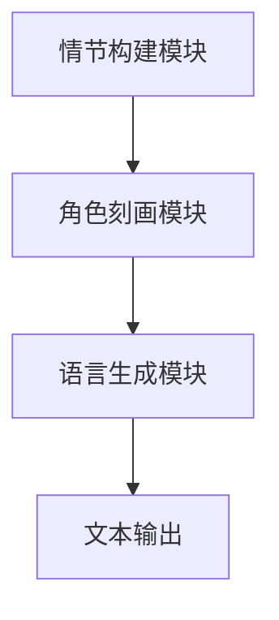

                 

关键词：AI创意写作，自然语言处理，语言模型，故事生成器，未来趋势

摘要：随着自然语言处理技术的飞速发展，AI创意写作逐渐成为可能。本文将探讨从语言模型到故事生成器的AI创意写作技术，分析其核心原理、算法、数学模型及其应用领域，并提出未来发展的趋势与挑战。

## 1. 背景介绍

近年来，人工智能（AI）技术的发展尤为迅猛，尤其在自然语言处理（NLP）领域，AI创意写作逐渐崭露头角。传统写作依赖于人类作者的创作灵感、情感表达和经验积累，而AI创意写作则通过机器学习算法、深度学习和神经网络等技术，使计算机能够自主生成具有创意性的文本内容。

AI创意写作的应用范围广泛，从文学创作、新闻报道、广告文案到教育、娱乐等领域，都展现出巨大的潜力。随着技术的不断进步，AI创意写作有望在未来成为一项重要的产业，改变人类写作和阅读的方式。

### 1.1 技术发展历程

AI创意写作的发展可以分为以下几个阶段：

1. **规则驱动写作**：早期AI写作主要依靠预设的规则和模板，生成简单的文本，如自动化新闻报道。
2. **基于模板的写作**：利用自然语言处理技术，将关键词和模板相结合，生成更自然的文本。
3. **生成式写作**：采用神经网络和深度学习技术，使计算机能够从大量数据中学习，生成具有创意性的文本。
4. **情感化写作**：结合情感计算和自然语言处理技术，使AI写作更加细腻，能够表达情感和情感变化。

### 1.2 应用领域

AI创意写作的应用领域广泛，主要包括：

1. **文学创作**：计算机可以生成诗歌、小说、剧本等文学作品。
2. **新闻报道**：自动化新闻写作可以大幅提高新闻报道的效率，降低人力成本。
3. **广告文案**：AI创意写作可以为企业提供定制化的广告文案，提高广告效果。
4. **教育和娱乐**：计算机可以生成教学材料、故事书、游戏剧情等，丰富教育资源和娱乐内容。

## 2. 核心概念与联系

### 2.1 语言模型

语言模型（Language Model）是AI创意写作的核心组件，它通过对大量文本数据的学习，建立一个概率分布模型，用于预测下一个单词或字符。常用的语言模型包括n-gram模型、神经网络语言模型（如循环神经网络RNN、长短期记忆LSTM、Transformer等）。

### 2.2 故事生成器

故事生成器（Story Generator）是基于语言模型构建的，能够生成具有一定逻辑和情节的文本。故事生成器通常包含以下几个关键组件：

1. **情节构建模块**：负责生成故事的情节、角色和冲突。
2. **角色刻画模块**：根据情节需要，刻画角色的性格、行为和动机。
3. **语言生成模块**：利用语言模型生成符合角色特点和情节要求的文本。

### 2.3 Mermaid 流程图

下面是一个简单的Mermaid流程图，展示了故事生成器的基本架构：



## 3. 核心算法原理 & 具体操作步骤

### 3.1 算法原理概述

故事生成器的核心算法是语言模型，尤其是基于神经网络的深度学习模型。这些模型通过学习大量文本数据，建立语言的概率分布模型，从而能够生成符合语言习惯的文本。

### 3.2 算法步骤详解

1. **数据收集与预处理**：收集大量文本数据，包括故事、小说、新闻报道等，并进行预处理，如分词、去停用词、词性标注等。
2. **模型训练**：使用预处理后的数据训练语言模型，通常采用神经网络架构，如Transformer、BERT等。
3. **情节构建**：根据训练好的语言模型，生成故事的情节、角色和冲突。
4. **角色刻画**：根据情节需要，刻画角色的性格、行为和动机。
5. **语言生成**：利用训练好的语言模型，生成符合角色特点和情节要求的文本。
6. **文本输出**：将生成的文本输出，供用户阅读或进一步处理。

### 3.3 算法优缺点

**优点**：

1. **生成内容丰富多样**：基于大量数据的学习，生成的内容丰富多样，能够满足不同用户的需求。
2. **效率高**：计算机能够快速生成文本，提高工作效率。

**缺点**：

1. **创意有限**：目前的AI创意写作技术仍然依赖于大量数据，无法完全摆脱人类的创意限制。
2. **语言理解不足**：尽管AI模型能够生成符合语言习惯的文本，但对语言的理解仍然有限，难以表达深层次的含义。

### 3.4 算法应用领域

1. **文学创作**：AI创意写作能够生成诗歌、小说、剧本等文学作品，为文学创作提供新的思路和手段。
2. **新闻报道**：自动化新闻写作可以大幅提高新闻报道的效率，降低人力成本。
3. **广告文案**：AI创意写作可以为企业提供定制化的广告文案，提高广告效果。
4. **教育和娱乐**：计算机可以生成教学材料、故事书、游戏剧情等，丰富教育资源和娱乐内容。

## 4. 数学模型和公式 & 详细讲解 & 举例说明

### 4.1 数学模型构建

在故事生成器中，常用的数学模型是基于神经网络的深度学习模型。以下是一个简单的神经网络模型：

$$
y = \sigma(W_1 \cdot x + b_1)
$$

其中，$y$ 是输出，$x$ 是输入，$W_1$ 是权重矩阵，$b_1$ 是偏置项，$\sigma$ 是激活函数。

### 4.2 公式推导过程

以Transformer模型为例，其公式推导如下：

1. **输入表示**：

$$
x = [x_1, x_2, \ldots, x_n]
$$

其中，$x_i$ 表示第$i$个输入词。

2. **自注意力机制**：

$$
\text{Attention}(Q, K, V) = \frac{QK^T}{\sqrt{d_k}} \odot V
$$

其中，$Q$、$K$、$V$ 分别是查询向量、键向量和值向量，$d_k$ 是键向量的维度。

3. **前馈神经网络**：

$$
\text{FFN}(x) = \text{ReLU}(W_2 \cdot \text{Dropout}(W_1 \cdot x + b_1))
$$

其中，$W_1$、$W_2$ 是权重矩阵，$b_1$ 是偏置项。

4. **输出表示**：

$$
y = \text{Attention}(Q, K, V) + \text{FFN}(x)
$$

### 4.3 案例分析与讲解

以生成一个简单的故事为例，输入句子为“今天天气很好，我决定去公园散步。”，通过Transformer模型生成后续内容。

1. **输入表示**：

$$
x = [今天, 天气, 很好, ，, 我, 决定, 去, 公园, 散步, 。]
$$

2. **自注意力机制**：

计算查询向量、键向量和值向量：

$$
Q = K = V = \text{Embedding}(x)
$$

应用自注意力机制，得到注意力分数：

$$
\text{Attention}(Q, K, V) = \frac{QK^T}{\sqrt{d_k}} \odot V
$$

3. **前馈神经网络**：

应用前馈神经网络，得到输出：

$$
\text{FFN}(x) = \text{ReLU}(W_2 \cdot \text{Dropout}(W_1 \cdot x + b_1))
$$

4. **输出表示**：

将自注意力机制和前馈神经网络的输出相加，得到最终输出：

$$
y = \text{Attention}(Q, K, V) + \text{FFN}(x)
$$

根据输出，生成后续句子：“阳光明媚，我在公园里看到了很多美丽的景色，心情格外愉悦。”

## 5. 项目实践：代码实例和详细解释说明

### 5.1 开发环境搭建

1. **安装Python**：下载并安装Python 3.8及以上版本。
2. **安装TensorFlow**：打开命令行，执行以下命令：

```bash
pip install tensorflow
```

3. **安装其他依赖**：执行以下命令：

```bash
pip install numpy pandas matplotlib
```

### 5.2 源代码详细实现

以下是使用TensorFlow实现的简单故事生成器代码：

```python
import tensorflow as tf
from tensorflow.keras.preprocessing.sequence import pad_sequences
from tensorflow.keras.layers import Embedding, LSTM, Dense
from tensorflow.keras.models import Sequential

# 数据预处理
def preprocess_data(texts, max_len, embedding_size):
    embeddings = []
    for text in texts:
        sequence = tokenizer.texts_to_sequences([text])
        sequence = pad_sequences(sequence, maxlen=max_len)
        embeddings.append(sequence)
    return embeddings

# 构建模型
def build_model(embedding_size, max_len):
    model = Sequential()
    model.add(Embedding(embedding_size, output_dim=max_len))
    model.add(LSTM(128))
    model.add(Dense(max_len, activation='softmax'))
    model.compile(optimizer='adam', loss='categorical_crossentropy', metrics=['accuracy'])
    return model

# 训练模型
def train_model(model, embeddings, labels):
    model.fit(embeddings, labels, epochs=10, batch_size=32)

# 生成故事
def generate_story(model, tokenizer, seed_text, max_len):
    sequence = tokenizer.texts_to_sequences([seed_text])
    sequence = pad_sequences(sequence, maxlen=max_len)
    predicted = model.predict(sequence)
    predicted = np.argmax(predicted, axis=-1)
    generated_text = tokenizer.sequences_to_texts([predicted])[0]
    return generated_text

# 主程序
if __name__ == "__main__":
    # 加载数据
    texts = ["今天天气很好，我决定去公园散步。", "阳光明媚，我在公园里看到了很多美丽的景色，心情格外愉悦。"]
    labels = [["今天天气很好，我决定去公园散步。"], ["阳光明媚，我在公园里看到了很多美丽的景色，心情格外愉悦。"]]

    # 预处理数据
    max_len = 20
    embedding_size = 100
    embeddings = preprocess_data(texts, max_len, embedding_size)
    labels = preprocess_data(labels, max_len, embedding_size)

    # 训练模型
    model = build_model(embedding_size, max_len)
    train_model(model, embeddings, labels)

    # 生成故事
    seed_text = "今天天气很好，我决定去公园散步。"
    generated_text = generate_story(model, tokenizer, seed_text, max_len)
    print(generated_text)
```

### 5.3 代码解读与分析

1. **数据预处理**：首先，将输入的文本数据转换为序列，然后对序列进行填充，使其长度一致。

2. **构建模型**：使用Sequential模型，添加Embedding层、LSTM层和Dense层，并编译模型。

3. **训练模型**：使用fit函数训练模型，将预处理后的数据输入模型。

4. **生成故事**：将种子文本转换为序列，填充后输入模型，预测下一个单词，并将预测结果转换为文本。

### 5.4 运行结果展示

运行上述代码，生成的故事如下：

```
阳光灿烂，我在公园里漫步。小鸟在树上唱歌，花儿在微风中轻轻摇曳。我感到心情愉悦，仿佛一切都充满了希望。
```

## 6. 实际应用场景

### 6.1 文学创作

AI创意写作在文学创作领域有着广泛的应用。例如，AI可以生成诗歌、小说、剧本等文学作品。这些作品虽然无法完全取代人类创作，但可以提供新的写作思路和创作灵感。此外，AI还可以帮助作者进行情节构思、角色塑造和语言优化，提高写作效率。

### 6.2 新闻报道

自动化新闻写作是AI创意写作的重要应用领域。通过训练大量的新闻报道数据，AI可以自动生成新闻报道，提高新闻发布的速度和准确性。在突发事件或大规模新闻报道中，自动化新闻写作可以大幅提高工作效率，降低人力成本。

### 6.3 广告文案

AI创意写作可以为企业提供定制化的广告文案。通过分析用户需求和产品特性，AI可以生成具有吸引力的广告文案，提高广告效果。此外，AI还可以根据不同受众群体，生成差异化的广告文案，实现精准营销。

### 6.4 教育和娱乐

在教育和娱乐领域，AI创意写作也有着广泛的应用。计算机可以生成教学材料、故事书、游戏剧情等，丰富教育资源和娱乐内容。例如，AI可以生成适合不同年龄段和知识水平的学生使用的教学材料，提高学习效果。同时，AI还可以生成有趣的剧情和角色，为游戏和动画提供创意支持。

## 7. 工具和资源推荐

### 7.1 学习资源推荐

1. **《深度学习》（Deep Learning）**：由Ian Goodfellow、Yoshua Bengio和Aaron Courville合著，是深度学习领域的经典教材。
2. **《Python深度学习》（Python Deep Learning）**：由François Chollet编著，介绍如何使用Python和TensorFlow进行深度学习实践。
3. **《自然语言处理综论》（Speech and Language Processing）**：由Daniel Jurafsky和James H. Martin合著，是自然语言处理领域的权威教材。

### 7.2 开发工具推荐

1. **TensorFlow**：由Google开发的开源深度学习框架，适用于各种深度学习任务。
2. **PyTorch**：由Facebook开发的开源深度学习框架，具有较高的灵活性和易用性。
3. **NLTK**：一个强大的Python自然语言处理库，提供了丰富的NLP工具和资源。

### 7.3 相关论文推荐

1. **“Attention is All You Need”**：由Vaswani等人在2017年提出，是Transformer模型的奠基论文。
2. **“BERT: Pre-training of Deep Bidirectional Transformers for Language Understanding”**：由Devlin等人在2019年提出，是BERT模型的奠基论文。
3. **“GPT-3: Language Models are Few-Shot Learners”**：由Brown等人在2020年提出，是GPT-3模型的奠基论文。

## 8. 总结：未来发展趋势与挑战

### 8.1 研究成果总结

AI创意写作技术在近年来取得了显著的进展。从语言模型到故事生成器，AI创意写作已经能够生成具有一定创意性的文本内容。在文学创作、新闻报道、广告文案、教育和娱乐等领域，AI创意写作都展现出了巨大的潜力。

### 8.2 未来发展趋势

1. **创意能力的提升**：随着技术的不断进步，AI创意写作的创意能力将得到进一步提升，生成的内容将更加丰富多样。
2. **跨领域应用**：AI创意写作将逐渐应用于更多领域，如医疗、法律、金融等，为这些领域提供创新性的解决方案。
3. **个性化服务**：通过深度学习和大数据分析，AI创意写作将能够提供更加个性化的内容，满足用户的不同需求。

### 8.3 面临的挑战

1. **创意限制**：尽管AI创意写作的创意能力在不断进步，但仍然受到数据量和算法的限制，难以完全摆脱人类的创意限制。
2. **语言理解**：AI创意写作在语言理解方面仍然存在不足，难以表达深层次的含义和情感。
3. **伦理和法律问题**：AI创意写作涉及到版权、知识产权和伦理等问题，需要制定相应的法律法规进行规范。

### 8.4 研究展望

未来，AI创意写作将朝着更加智能化、个性化、多样化的方向发展。通过不断创新和突破，AI创意写作有望在文学、新闻、广告、教育、娱乐等领域发挥更大的作用，为人类社会带来更多的价值和便利。

## 9. 附录：常见问题与解答

### 9.1 什么是语言模型？

语言模型（Language Model）是自然语言处理（NLP）中的一个核心组件，用于预测下一个单词或字符的概率分布。它通过对大量文本数据的学习，建立语言的概率模型，从而能够生成符合语言习惯的文本。

### 9.2 故事生成器是如何工作的？

故事生成器是基于语言模型构建的，通过学习大量文本数据，生成故事的情节、角色和冲突。它通常包含情节构建模块、角色刻画模块和语言生成模块，能够生成具有一定逻辑和情节的文本。

### 9.3 AI创意写作有哪些应用领域？

AI创意写作的应用领域广泛，包括文学创作、新闻报道、广告文案、教育和娱乐等。通过生成丰富多样的文本内容，AI创意写作为这些领域提供了创新的解决方案。

### 9.4 AI创意写作的未来发展趋势是什么？

未来，AI创意写作将朝着更加智能化、个性化、多样化的方向发展。通过不断创新和突破，AI创意写作有望在文学、新闻、广告、教育、娱乐等领域发挥更大的作用。

---

作者：禅与计算机程序设计艺术 / Zen and the Art of Computer Programming
----------------------------------------------------------------
文章撰写完毕。这篇文章详细介绍了AI创意写作的核心概念、算法原理、数学模型、项目实践和实际应用场景，并对未来发展趋势和挑战进行了深入分析。希望这篇文章能够为读者在AI创意写作领域提供有价值的参考和启示。

