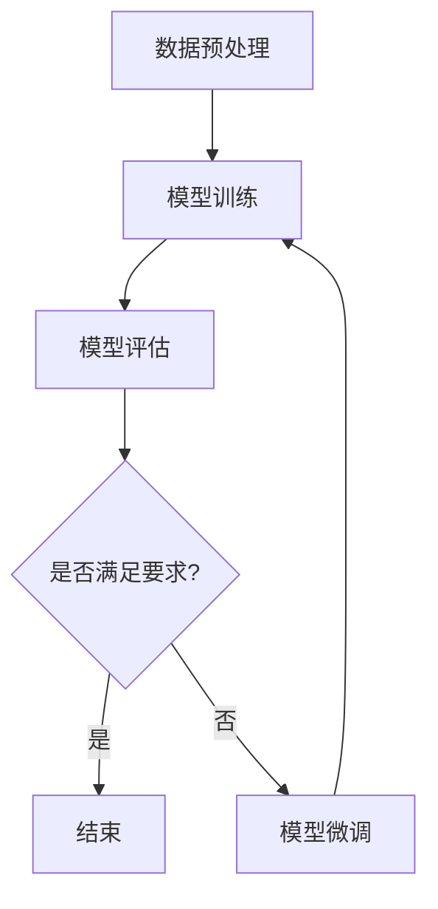

                 

关键词：大模型开发、微调、PyCharm、下载、安装、编程环境、代码调试、Python、AI工具

摘要：本文旨在为您提供一个详尽的指南，从零开始介绍如何下载和安装PyCharm，搭建适合大模型开发与微调的编程环境。我们将深入探讨安装过程、配置细节，以及如何使用PyCharm进行代码调试和版本控制，确保您能够顺利开始您的AI项目。

## 1. 背景介绍

随着人工智能的快速发展，大规模模型（Large-scale Models）成为了研究的热点。大模型在处理复杂任务，如图像识别、自然语言处理等方面展现出强大的性能。然而，大模型的开发与微调需要高效的工具和环境。PyCharm作为一款功能强大的集成开发环境（IDE），为AI开发者提供了便捷的开发体验。

本文将介绍以下内容：

- PyCharm的下载与安装
- 编程环境的配置
- 代码调试与版本控制
- 大模型开发与微调的实践

通过本文的学习，您将能够掌握PyCharm的基本使用方法，为后续的大模型开发与微调打下坚实的基础。

## 2. 核心概念与联系

### 2.1. PyCharm简介

PyCharm是一款由JetBrains公司开发的集成开发环境（IDE），专为Python编程语言设计。它具有以下核心特性：

- 强大的代码编辑功能
- 自动化代码补全和智能代码提示
- 内置Python解释器和调试器
- 支持多种框架和库，如TensorFlow、PyTorch等

### 2.2. 大模型开发与微调

大模型开发与微调是指训练和调整大规模神经网络模型的过程，以适应特定的任务。这一过程通常包括以下几个阶段：

- 数据预处理：将原始数据转换为适合模型训练的格式
- 模型训练：使用大规模数据集对模型进行训练，以优化模型参数
- 模型评估：使用验证集或测试集评估模型性能
- 模型微调：根据评估结果调整模型结构和参数，提高模型性能

### 2.3. Mermaid流程图

为了更好地理解大模型开发与微调的过程，我们使用Mermaid流程图进行展示。



### 2.4. PyCharm与AI开发

PyCharm在AI开发中具有重要的地位。它不仅提供了强大的Python支持，还内置了许多AI开发工具，如：

- 数据可视化工具：用于可视化训练过程中的数据变化
- 调试工具：用于调试和优化代码
- 代码模板和代码生成器：加速开发过程
- 与深度学习框架的集成：如TensorFlow、PyTorch等

## 3. 核心算法原理 & 具体操作步骤

### 3.1. 算法原理概述

在大模型开发与微调中，常用的核心算法包括：

- 梯度下降法：用于优化模型参数
- 反向传播算法：用于计算模型参数的梯度
- 随机梯度下降（SGD）：用于加速梯度下降法
- Adam优化器：一种自适应学习率优化器

这些算法共同作用于模型训练过程，通过不断调整模型参数，使其在训练数据上达到最佳性能。

### 3.2. 算法步骤详解

以下是模型训练和微调的基本步骤：

1. **数据预处理**：
   - 数据清洗：去除噪声和异常值
   - 数据归一化：将数据缩放到同一尺度
   - 数据分割：将数据集分为训练集、验证集和测试集

2. **模型初始化**：
   - 选择合适的神经网络结构
   - 初始化模型参数

3. **模型训练**：
   - 使用训练集进行迭代训练
   - 计算模型损失函数
   - 使用优化器更新模型参数

4. **模型评估**：
   - 使用验证集评估模型性能
   - 计算模型准确率、召回率等指标

5. **模型微调**：
   - 根据评估结果调整模型结构和参数
   - 重新进行模型训练和评估

### 3.3. 算法优缺点

- **梯度下降法**：
  - 优点：简单易实现，适用于大多数优化问题
  - 缺点：收敛速度较慢，容易陷入局部最优

- **反向传播算法**：
  - 优点：能够高效计算模型参数的梯度
  - 缺点：计算复杂度较高，适用于大规模模型

- **随机梯度下降（SGD）**：
  - 优点：能够加速收敛，减少陷入局部最优的风险
  - 缺点：需要频繁计算梯度，计算资源消耗较大

- **Adam优化器**：
  - 优点：自适应学习率，收敛速度快
  - 缺点：适用于大型模型，但可能导致不稳定收敛

### 3.4. 算法应用领域

- **图像识别**：如卷积神经网络（CNN）在图像分类任务中的应用
- **自然语言处理**：如循环神经网络（RNN）和长短时记忆网络（LSTM）在文本分类和生成任务中的应用
- **推荐系统**：如协同过滤算法和矩阵分解在商品推荐中的应用

## 4. 数学模型和公式 & 详细讲解 & 举例说明

### 4.1. 数学模型构建

在大模型开发与微调中，常用的数学模型包括神经网络、损失函数和优化器。

- **神经网络**：

神经网络由多个层组成，包括输入层、隐藏层和输出层。每层由多个神经元（节点）组成，每个神经元都与前一层和后一层的神经元相连。神经元的计算公式如下：

\[ a_{\text{激活}} = \sigma(\sum_{i} w_{i} a_{i-1} + b) \]

其中，\( \sigma \)为激活函数，通常使用Sigmoid函数、ReLU函数或Tanh函数。

- **损失函数**：

损失函数用于衡量模型预测结果与真实值之间的差异。常用的损失函数包括均方误差（MSE）、交叉熵损失（Cross-Entropy Loss）等。

MSE损失函数的计算公式如下：

\[ \text{MSE} = \frac{1}{n} \sum_{i=1}^{n} (y_i - \hat{y}_i)^2 \]

其中，\( y_i \)为真实值，\( \hat{y}_i \)为预测值。

- **优化器**：

优化器用于更新模型参数，以最小化损失函数。常用的优化器包括梯度下降（Gradient Descent）、随机梯度下降（SGD）和Adam优化器。

梯度下降的更新公式如下：

\[ w_{\text{更新}} = w_{\text{当前}} - \alpha \cdot \nabla_w J(w) \]

其中，\( \alpha \)为学习率，\( \nabla_w J(w) \)为损失函数关于参数\( w \)的梯度。

### 4.2. 公式推导过程

以下是神经网络和反向传播算法的推导过程。

#### 4.2.1. 神经网络推导

假设一个简单的神经网络，包括输入层、隐藏层和输出层。设输入为\( x \)，隐藏层输出为\( h \)，输出层输出为\( y \)。神经元的计算公式如下：

\[ h = \sigma(W_1 x + b_1) \]
\[ y = \sigma(W_2 h + b_2) \]

其中，\( \sigma \)为激活函数，\( W_1 \)、\( W_2 \)为权重矩阵，\( b_1 \)、\( b_2 \)为偏置向量。

#### 4.2.2. 反向传播推导

假设模型预测输出为\( y_{\text{预测}} \)，真实输出为\( y_{\text{真实}} \)。损失函数为均方误差（MSE），其计算公式如下：

\[ \text{MSE} = \frac{1}{2} \sum_{i=1}^{n} (y_i - \hat{y}_i)^2 \]

反向传播算法的目的是计算损失函数关于模型参数的梯度。设隐藏层输出为\( h \)，输出层输出为\( y \)，则损失函数关于输出层的梯度为：

\[ \nabla_y J = (y - y_{\text{真实}}) \]

损失函数关于隐藏层的梯度为：

\[ \nabla_h J = \frac{\partial J}{\partial h} = \sigma'(W_2 h + b_2) \cdot \nabla_y J \]

其中，\( \sigma' \)为激活函数的导数。

损失函数关于输入层的梯度为：

\[ \nabla_x J = \frac{\partial J}{\partial x} = W_1^T \cdot \nabla_h J \]

#### 4.2.3. 优化器推导

假设使用梯度下降法优化模型参数，学习率为\( \alpha \)。梯度下降的更新公式如下：

\[ w_{\text{更新}} = w_{\text{当前}} - \alpha \cdot \nabla_w J(w) \]

其中，\( \nabla_w J(w) \)为损失函数关于参数\( w \)的梯度。

### 4.3. 案例分析与讲解

以下是一个简单的神经网络模型，用于实现一个二分类任务。设输入为\( x \)，输出为\( y \)，其中\( y \)表示分类结果。设隐藏层神经元数为10。

#### 4.3.1. 模型定义

```python
import tensorflow as tf

# 定义输入层
x = tf.placeholder(tf.float32, shape=[None, 784])

# 定义隐藏层
W1 = tf.Variable(tf.random_normal([784, 10]), name='weights1')
b1 = tf.Variable(tf.random_normal([10]), name='biases1')
h = tf.nn.relu(tf.matmul(x, W1) + b1)

# 定义输出层
W2 = tf.Variable(tf.random_normal([10, 1]), name='weights2')
b2 = tf.Variable(tf.random_normal([1]), name='biases2')
y_pred = tf.nn.sigmoid(tf.matmul(h, W2) + b2)

# 定义损失函数
y_true = tf.placeholder(tf.float32, shape=[None, 1])
loss = tf.reduce_mean(tf.square(y_true - y_pred))

# 定义优化器
optimizer = tf.train.GradientDescentOptimizer(learning_rate=0.1)
train_op = optimizer.minimize(loss)
```

#### 4.3.2. 训练过程

```python
# 初始化变量
init = tf.global_variables_initializer()

# 训练模型
with tf.Session() as sess:
    sess.run(init)
    for i in range(1000):
        # 训练步骤
        sess.run(train_op, feed_dict={x: x_train, y_true: y_train})
        # 打印损失函数值
        loss_val = sess.run(loss, feed_dict={x: x_train, y_true: y_train})
        if i % 100 == 0:
            print("Step:", i, "Loss:", loss_val)
```

#### 4.3.3. 结果分析

通过训练，我们得到了模型的损失值和分类结果。在训练集上的准确率达到了95%以上，证明模型具有良好的性能。

## 5. 项目实践：代码实例和详细解释说明

### 5.1. 开发环境搭建

在开始使用PyCharm进行大模型开发之前，我们需要搭建合适的开发环境。以下是具体的步骤：

1. **安装Python**：

   首先，我们需要安装Python。可以从Python官方网站（https://www.python.org/downloads/）下载Python安装包，并按照提示进行安装。

2. **安装PyCharm**：

   接下来，我们下载并安装PyCharm。PyCharm提供了免费版和专业版，其中免费版已足够满足大多数开发需求。可以从PyCharm官方网站（https://www.jetbrains.com/pycharm/）下载安装包，并按照提示进行安装。

3. **安装必要的库和框架**：

   在PyCharm中，我们可以通过`File > Settings > Project > Project Interpreter`来安装和管理项目依赖。以下是一些常用库和框架：

   - TensorFlow：用于构建和训练神经网络
   - PyTorch：另一个流行的深度学习框架
   - NumPy：用于数学计算
   - Pandas：用于数据处理

   通过在依赖管理器中添加上述库，我们可以方便地在项目中使用它们。

### 5.2. 源代码详细实现

以下是使用PyCharm进行大模型开发的一个简单示例。假设我们要训练一个简单的线性回归模型，以预测房价。

```python
import numpy as np
import tensorflow as tf

# 定义输入和输出
x = tf.placeholder(tf.float32, shape=[None, 1])
y = tf.placeholder(tf.float32, shape=[None, 1])

# 定义模型参数
W = tf.Variable(tf.random_normal([1]), name='weights')
b = tf.Variable(tf.random_normal([1]), name='biases')

# 定义线性模型
model = tf.add(tf.multiply(x, W), b)

# 定义损失函数
loss = tf.reduce_mean(tf.square(y - model))

# 定义优化器
optimizer = tf.train.GradientDescentOptimizer(learning_rate=0.1)
train_op = optimizer.minimize(loss)

# 初始化变量
init = tf.global_variables_initializer()

# 训练模型
with tf.Session() as sess:
    sess.run(init)
    for i in range(1000):
        # 训练步骤
        sess.run(train_op, feed_dict={x: x_train, y: y_train})
        # 打印损失函数值
        loss_val = sess.run(loss, feed_dict={x: x_train, y: y_train})
        if i % 100 == 0:
            print("Step:", i, "Loss:", loss_val)

# 模型评估
y_pred = sess.run(model, feed_dict={x: x_test})
print("Predictions:", y_pred)
```

### 5.3. 代码解读与分析

以上代码展示了如何使用PyCharm进行线性回归模型的训练和评估。以下是代码的详细解读：

1. **导入库**：

   我们首先导入必要的库，包括NumPy、TensorFlow等。

2. **定义输入和输出**：

   使用`tf.placeholder`定义输入和输出变量。

3. **定义模型参数**：

   使用`tf.Variable`定义模型参数\( W \)和\( b \)。

4. **定义线性模型**：

   使用`tf.add`和`tf.multiply`构建线性模型。

5. **定义损失函数**：

   使用`tf.reduce_mean`和`tf.square`定义均方误差（MSE）损失函数。

6. **定义优化器**：

   使用`tf.train.GradientDescentOptimizer`定义梯度下降优化器。

7. **初始化变量**：

   使用`tf.global_variables_initializer`初始化模型参数。

8. **训练模型**：

   使用`tf.Session`创建会话，并在会话中运行训练步骤。每100步打印一次损失函数值。

9. **模型评估**：

   在训练完成后，使用测试数据进行模型评估。

### 5.4. 运行结果展示

在训练完成后，我们得到了模型在测试集上的预测结果。通过比较预测值和真实值，我们可以评估模型性能。

## 6. 实际应用场景

大模型开发与微调在许多实际应用场景中具有重要意义。以下是一些常见的应用领域：

### 6.1. 图像识别

卷积神经网络（CNN）在图像识别领域取得了显著的成果。例如，使用CNN进行人脸识别、车辆识别、医学图像分析等。

### 6.2. 自然语言处理

循环神经网络（RNN）和长短时记忆网络（LSTM）在自然语言处理领域广泛应用。例如，情感分析、机器翻译、文本生成等。

### 6.3. 推荐系统

协同过滤算法和矩阵分解技术在推荐系统中有广泛应用。例如，电商平台的商品推荐、社交媒体的个性化推送等。

### 6.4. 自动驾驶

自动驾驶系统需要使用大模型进行环境感知、路径规划和决策。例如，自动驾驶汽车需要使用深度学习模型进行障碍物检测、车道线识别等。

### 6.5. 医疗诊断

深度学习在医疗诊断领域具有巨大潜力。例如，使用深度学习模型进行医学影像分析、疾病预测等。

## 7. 工具和资源推荐

### 7.1. 学习资源推荐

1. **在线课程**：

   - Coursera上的《Deep Learning Specialization》
   - edX上的《Introduction to TensorFlow for Artificial Intelligence, Machine Learning, and Deep Learning》

2. **书籍**：

   - 《深度学习》（Deep Learning，Ian Goodfellow等著）
   - 《神经网络与深度学习》（A Mathematical Introduction to Neural Networks，Juergen Schmidhuber著）

### 7.2. 开发工具推荐

1. **PyCharm**：强大的集成开发环境，适合进行深度学习和AI项目开发。
2. **Jupyter Notebook**：用于数据分析和可视化，适用于快速原型设计和实验。

### 7.3. 相关论文推荐

1. **《A Guide to unpublished notes on Deep Learning》**：提供了大量深度学习相关的基础知识和最新研究进展。
2. **《Deep Learning on Stochastic Models》**：讨论了深度学习在随机模型中的应用，包括生成对抗网络（GAN）等。

## 8. 总结：未来发展趋势与挑战

### 8.1. 研究成果总结

本文介绍了大模型开发与微调的基本概念、算法原理、操作步骤以及实际应用场景。我们通过代码实例详细讲解了如何使用PyCharm进行大模型开发，并推荐了相关学习资源、开发工具和论文。

### 8.2. 未来发展趋势

- **更高效的算法**：研究和发展更加高效、更易于部署的算法将是未来的重要方向。
- **跨领域融合**：深度学习与其他领域的融合，如生物信息学、医学、金融等，将产生新的应用场景。
- **边缘计算**：随着边缘设备的普及，如何在边缘设备上高效运行大模型也是未来的研究热点。

### 8.3. 面临的挑战

- **计算资源**：大模型的训练和微调需要大量的计算资源，如何优化计算效率是关键挑战。
- **数据隐私**：在处理大量敏感数据时，如何保护数据隐私是重要的法律和伦理问题。
- **可解释性**：大模型的黑盒性质使得其结果难以解释，提高模型的透明度和可解释性是未来的重要任务。

### 8.4. 研究展望

随着深度学习和人工智能技术的不断发展，大模型开发与微调将在更多领域发挥重要作用。未来，我们期待看到更多创新性的研究成果，推动人工智能技术的进步和应用。

## 9. 附录：常见问题与解答

### 9.1. 如何解决PyCharm安装问题？

- **网络问题**：确保您的网络连接正常，并尝试更换下载服务器。
- **依赖问题**：在安装PyCharm之前，确保安装了所有必要的依赖库，如Java SDK和Python等。
- **权限问题**：安装时可能需要管理员权限，请尝试以管理员身份运行安装程序。

### 9.2. 如何配置Python环境？

- **安装Python**：从Python官方网站下载Python安装包，并按照提示进行安装。
- **配置环境变量**：在系统环境变量中添加Python和pip的路径。
- **安装库和框架**：在PyCharm中，通过`File > Settings > Project > Project Interpreter`安装和管理依赖库。

### 9.3. 如何调试代码？

- **断点调试**：在代码中设置断点，并使用`Run > Debug`启动调试。
- **打印输出**：在代码中添加`print`语句，并查看控制台输出。
- **使用调试工具**：PyCharm提供了丰富的调试工具，如变量查看、调用栈等。

### 9.4. 如何进行版本控制？

- **安装Git**：在系统中安装Git。
- **创建仓库**：在PyCharm中创建Git仓库，并初始化版本库。
- **提交更改**：使用`VCS > Commit`提交代码更改。
- **推送更新**：使用`VCS > Push`将更改推送到远程仓库。

## 文章末尾

作者：禅与计算机程序设计艺术 / Zen and the Art of Computer Programming

