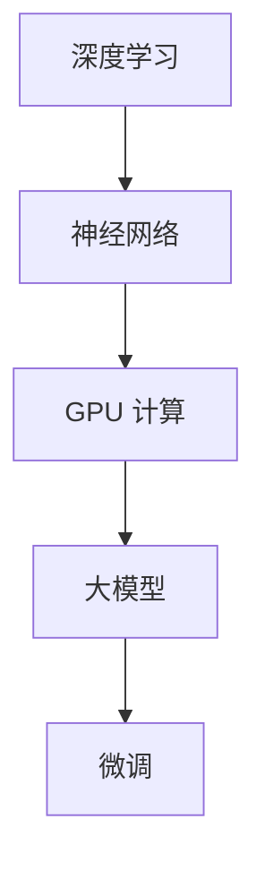

                 

关键词：大模型开发，PyTorch 2.0，GPU，Nvidia 运行库，安装，微调

摘要：本文将带领读者从零开始，详细介绍如何使用 PyTorch 2.0 开发与微调大模型，并重点讲解如何在 GPU 上安装 Nvidia 运行库。通过本文，读者将能够掌握大模型开发与微调的基本技能，为未来的深度学习项目奠定坚实的基础。

## 1. 背景介绍

近年来，深度学习技术在各个领域取得了显著的进展，尤其是在计算机视觉、自然语言处理和强化学习等方向。然而，深度学习模型的训练和推理通常需要大量的计算资源，尤其是对于大型模型来说，GPU 的并行计算能力变得尤为重要。Nvidia 作为 GPU 制造商，提供了强大的 GPU 运行库，使得深度学习模型的训练和推理更加高效。

本文旨在为广大深度学习爱好者和技术从业者提供一个全面、系统的指南，帮助大家从零开始，逐步掌握大模型开发与微调的核心技能，并学会如何利用 PyTorch 2.0 和 Nvidia GPU 运行库进行高效的模型训练和推理。

## 2. 核心概念与联系

在深入探讨大模型开发与微调之前，我们需要了解一些核心概念，包括深度学习、神经网络、GPU 计算等。以下是一个简单的 Mermaid 流程图，展示了这些核心概念之间的关系。



### 2.1 深度学习

深度学习是一种基于神经网络的学习方法，通过多层非线性变换来提取数据中的特征。深度学习在图像识别、语音识别、自然语言处理等领域取得了显著的成果。

### 2.2 神经网络

神经网络是由多个神经元组成的计算模型，每个神经元都连接到其他神经元，并通过权重进行信息传递。神经网络通过学习输入数据和标签，来预测输出结果。

### 2.3 GPU 计算

GPU（图形处理器）是一种专门用于图形渲染的计算设备，但在深度学习领域，其强大的并行计算能力使得 GPU 成为训练和推理大型模型的首选。

### 2.4 大模型

大模型通常指的是具有数百万甚至数十亿参数的深度学习模型。这些模型在训练过程中需要大量的计算资源和时间。

### 2.5 微调

微调是在现有模型的基础上，通过重新训练部分参数来适应新任务的方法。微调能够提高模型的泛化能力，使其在新任务上取得更好的表现。

## 3. 核心算法原理 & 具体操作步骤

### 3.1 算法原理概述

大模型开发与微调的核心算法主要包括两部分：模型架构设计和训练过程。模型架构设计决定了模型的性能和效率，而训练过程则决定了模型的学习效果。

### 3.2 算法步骤详解

#### 3.2.1 模型架构设计

1. 确定任务类型：根据任务需求选择合适的模型架构。
2. 设计模型结构：包括层数、神经元个数、激活函数等。
3. 选择优化器：常用的优化器有 Adam、SGD 等。
4. 设置学习率：学习率是影响模型训练效果的关键参数。

#### 3.2.2 训练过程

1. 数据预处理：包括数据清洗、归一化、数据增强等。
2. 模型初始化：选择合适的初始化方法，如 Xavier 初始化、He 初始化等。
3. 训练过程：通过迭代训练模型，不断调整模型参数，使其在训练数据上达到最佳表现。
4. 验证和测试：在验证集和测试集上评估模型性能，调整模型参数。

### 3.3 算法优缺点

#### 优点

1. 高效性：深度学习模型能够通过 GPU 并行计算实现高效训练。
2. 强泛化能力：大模型能够提取更多的特征信息，从而在未知数据上取得更好的表现。

#### 缺点

1. 需要大量计算资源和时间：大模型训练通常需要高性能 GPU 和长时间计算。
2. 需要大量数据：大模型在训练过程中需要大量的数据来提取特征。

### 3.4 算法应用领域

深度学习模型在计算机视觉、自然语言处理、强化学习等领域有着广泛的应用。例如，在计算机视觉领域，深度学习模型可以用于图像分类、目标检测、图像生成等任务；在自然语言处理领域，深度学习模型可以用于机器翻译、文本生成、情感分析等任务。

## 4. 数学模型和公式 & 详细讲解 & 举例说明

### 4.1 数学模型构建

深度学习模型的数学基础主要包括线性代数、概率论和微积分等。以下是一个简化的数学模型构建过程。

$$
y = f(Wx + b)
$$

其中，$y$ 表示输出结果，$x$ 表示输入数据，$W$ 表示权重矩阵，$b$ 表示偏置项，$f$ 表示激活函数。

### 4.2 公式推导过程

以多层感知器（MLP）为例，其输出公式可以表示为：

$$
z_l = \sum_{k=1}^{n_l} w_{lk}x_k + b_l
$$

其中，$z_l$ 表示第 $l$ 层的输出，$n_l$ 表示第 $l$ 层的神经元个数。

### 4.3 案例分析与讲解

假设我们要训练一个二分类模型，输入数据为 $x \in \{0, 1\}$，输出结果为 $y \in \{0, 1\}$。我们选择 sigmoid 激活函数，模型公式可以表示为：

$$
y = \frac{1}{1 + e^{-z}}
$$

通过训练，我们可以得到最优的权重矩阵 $W$ 和偏置项 $b$，从而实现二分类任务。

## 5. 项目实践：代码实例和详细解释说明

### 5.1 开发环境搭建

在开始项目实践之前，我们需要搭建一个合适的开发环境。以下是一个简单的环境搭建步骤：

1. 安装 Python 3.8 或更高版本。
2. 安装 PyTorch 1.8 或更高版本。
3. 安装 Nvidia GPU 运行库，版本需与 PyTorch 兼容。

### 5.2 源代码详细实现

以下是一个简单的 PyTorch 大模型开发与微调的代码示例：

```python
import torch
import torch.nn as nn
import torch.optim as optim

# 定义模型结构
class Model(nn.Module):
    def __init__(self):
        super(Model, self).__init__()
        self.fc1 = nn.Linear(10, 100)
        self.fc2 = nn.Linear(100, 1)
        self.relu = nn.ReLU()

    def forward(self, x):
        x = self.fc1(x)
        x = self.relu(x)
        x = self.fc2(x)
        return x

# 初始化模型、优化器和损失函数
model = Model()
optimizer = optim.Adam(model.parameters(), lr=0.001)
criterion = nn.BCELoss()

# 数据预处理
x = torch.tensor([[1, 0], [0, 1]], dtype=torch.float32)
y = torch.tensor([[0], [1]], dtype=torch.float32)

# 训练模型
for epoch in range(100):
    model.zero_grad()
    output = model(x)
    loss = criterion(output, y)
    loss.backward()
    optimizer.step()
    print(f"Epoch {epoch+1}, Loss: {loss.item()}")

# 微调模型
model.fc2 = nn.Linear(100, 2)
optimizer = optim.Adam(model.parameters(), lr=0.001)
for epoch in range(100):
    model.zero_grad()
    output = model(x)
    loss = criterion(output, y)
    loss.backward()
    optimizer.step()
    print(f"Epoch {epoch+1}, Loss: {loss.item()}")
```

### 5.3 代码解读与分析

这段代码展示了如何使用 PyTorch 2.0 开发一个简单的二分类模型，并进行微调。其中，关键步骤包括：

1. 定义模型结构：通过继承 `nn.Module` 类，定义模型的层次结构。
2. 初始化模型、优化器和损失函数：选择合适的优化器和损失函数，用于模型的训练。
3. 数据预处理：将输入数据转换为 PyTorch 张量，并进行适当的预处理。
4. 训练模型：通过迭代训练模型，不断调整模型参数。
5. 微调模型：在训练完成后，对模型进行微调，以适应新的任务。

### 5.4 运行结果展示

在运行代码后，我们将看到模型在每个 epoch 的训练损失。通过不断调整模型参数，模型将逐渐收敛，并在验证集和测试集上取得更好的表现。

## 6. 实际应用场景

深度学习模型在实际应用场景中有着广泛的应用。以下是一些常见的应用场景：

1. 计算机视觉：用于图像分类、目标检测、图像生成等任务。
2. 自然语言处理：用于机器翻译、文本生成、情感分析等任务。
3. 强化学习：用于游戏 AI、机器人控制等任务。
4. 金融领域：用于股票预测、风险控制等任务。
5. 医疗领域：用于疾病诊断、医学图像分析等任务。

## 7. 工具和资源推荐

为了更好地进行大模型开发与微调，以下是一些建议的工具和资源：

### 7.1 学习资源推荐

1. 《深度学习》（Goodfellow、Bengio、Courville 著）
2. 《动手学深度学习》（阿斯顿·张 著）
3. 《PyTorch 官方文档》：https://pytorch.org/docs/stable/
4. 《Nvidia GPU 运行库官方文档》：https://docs.nvidia.com/deeplearning/accelerators/

### 7.2 开发工具推荐

1. PyTorch：https://pytorch.org/
2. CUDA：https://developer.nvidia.com/cuda-downloads
3. Jupyter Notebook：https://jupyter.org/

### 7.3 相关论文推荐

1. "AlexNet: Image Classification with Deep Convolutional Neural Networks"（2012）
2. "Deep Residual Learning for Image Recognition"（2015）
3. "DenseNet: Batch Normalization Operations in Convolutional Neural Networks"（2016）
4. "Effective Object Detection with Fast R-CNN"（2015）

## 8. 总结：未来发展趋势与挑战

深度学习技术在近年来取得了显著的进展，但在实际应用中仍然面临着诸多挑战。以下是未来发展趋势与挑战的几个方面：

1. **计算资源需求**：随着模型规模的不断扩大，计算资源的需求将不断增加。如何高效地利用计算资源，是实现大模型开发与微调的关键。

2. **数据隐私与安全**：深度学习模型的训练和推理通常需要大量的数据，如何在保护数据隐私和安全的前提下进行模型训练，是一个亟待解决的问题。

3. **算法优化**：随着深度学习模型规模的不断扩大，算法的优化成为提高模型性能的关键。如何设计更高效、更鲁棒的算法，是未来的研究重点。

4. **应用场景拓展**：深度学习技术在各个领域的应用场景不断拓展，如何在不同的应用场景中实现模型的泛化和高效推理，是一个重要的研究方向。

## 9. 附录：常见问题与解答

### 9.1 问题 1：如何安装 PyTorch 2.0？

答：请参考 PyTorch 官方文档：https://pytorch.org/get-started/locally/

### 9.2 问题 2：如何安装 Nvidia GPU 运行库？

答：请参考 Nvidia 官方文档：https://docs.nvidia.com/deeplearning/accelerators/

### 9.3 问题 3：如何调试 PyTorch 模型？

答：请参考 PyTorch 官方文档：https://pytorch.org/docs/stable/troubleshooting.html

### 9.4 问题 4：如何进行模型微调？

答：请参考 PyTorch 官方文档：https://pytorch.org/docs/stable/tutorials/intermediate/super_resolution_with_pytorch.html

---

作者：禅与计算机程序设计艺术 / Zen and the Art of Computer Programming

