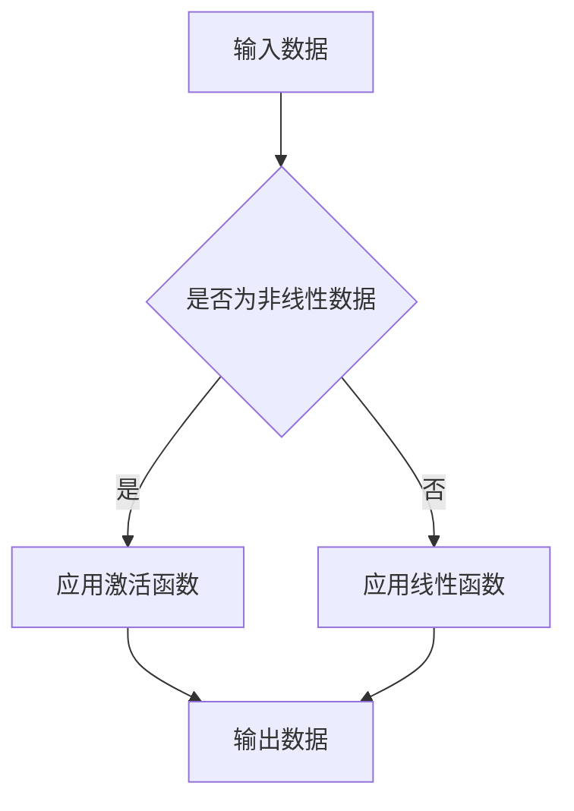

                 

关键词：大模型开发、微调、反馈神经网络、激活函数、深度学习、神经网络架构

摘要：本文旨在详细探讨大模型开发与微调过程中，反馈神经网络原理中的激活函数设计与应用。通过深入剖析激活函数的基本概念、数学模型、实现方法以及在实际项目中的应用，本文将帮助读者了解激活函数在提升模型性能和优化训练过程中的关键作用。

## 1. 背景介绍

随着深度学习技术的不断发展，大型神经网络模型在各个领域取得了显著的成果。然而，大模型开发与微调过程中面临的一个关键挑战是激活函数的设计。激活函数是神经网络的核心组成部分，它负责将输入映射到输出，并引入非线性特性。合适的激活函数不仅能够提高模型的性能，还能加速训练过程。

本文将从以下几个方面展开讨论：

- **核心概念与联系**：介绍反馈神经网络的基本原理和激活函数的定义与作用。
- **核心算法原理 & 具体操作步骤**：详细阐述激活函数的设计原则和实现方法。
- **数学模型和公式**：讲解激活函数的数学模型及其推导过程。
- **项目实践**：通过实际代码实例展示激活函数的开发与微调过程。
- **实际应用场景**：探讨激活函数在不同领域的应用案例。
- **未来应用展望**：分析激活函数在未来的发展趋势与潜在挑战。

## 2. 核心概念与联系

### 反馈神经网络原理

反馈神经网络（Feedback Neural Network）是一种能够通过内部循环结构实现信息反馈的神经网络。它由输入层、隐藏层和输出层组成，其中隐藏层之间存在反馈连接。这种结构使得神经网络能够处理复杂的时序数据和动态变化。

在反馈神经网络中，激活函数起到了至关重要的作用。激活函数用于将神经元的输入映射到输出，从而引入非线性特性。常见的激活函数包括 sigmoid、ReLU、Tanh 等。

### 激活函数的定义与作用

激活函数（Activation Function）是神经网络中的一个关键组件，它将神经元的输入映射到输出。激活函数的设计原则主要包括：

1. **非线性的引入**：激活函数必须是非线性的，以便将线性可分的输入数据映射到非线性可分的输出数据。
2. **单调性**：激活函数应该具有单调性，以便更好地优化训练过程。
3. **平滑性**：激活函数应该具有平滑性，以避免梯度消失或爆炸问题。

常见的激活函数如下：

1. **Sigmoid**：将输入映射到（0,1）区间，具有平滑性和单调性。
2. **ReLU**：将输入大于 0 的部分映射到 1，输入小于等于 0 的部分映射到 0，具有简洁性和加速训练的优势。
3. **Tanh**：将输入映射到（-1,1）区间，具有平滑性和单调性。

### Mermaid 流程图



## 3. 核心算法原理 & 具体操作步骤

### 3.1 算法原理概述

激活函数的设计原则是关键，其目的是引入非线性特性，使神经网络能够处理复杂的数据。具体来说，激活函数应满足以下条件：

1. **非线性的引入**：激活函数必须能够将线性可分的输入数据映射到非线性可分的输出数据。
2. **单调性**：激活函数应该具有单调性，以便更好地优化训练过程。
3. **平滑性**：激活函数应该具有平滑性，以避免梯度消失或爆炸问题。

### 3.2 算法步骤详解

1. **选择激活函数**：根据具体问题和数据特征，选择合适的激活函数。例如，对于时序数据，可以选用 ReLU 或 Tanh 等具有单调性的激活函数。
2. **定义激活函数**：在神经网络架构中定义激活函数，并将其应用于隐藏层或输出层。
3. **训练与优化**：通过反向传播算法训练神经网络，并利用激活函数的非线性特性优化模型参数。

### 3.3 算法优缺点

#### 优点

1. **非线性特性**：激活函数能够引入非线性特性，使神经网络能够处理复杂的数据。
2. **加速训练**：某些激活函数（如 ReLU）能够加速训练过程，提高训练效率。
3. **可微性**：大多数激活函数都是可微的，便于利用梯度下降算法进行优化。

#### 缺点

1. **梯度消失或爆炸**：某些激活函数（如 sigmoid）可能导致梯度消失或爆炸问题，影响训练效果。
2. **计算复杂度**：某些复杂激活函数的计算复杂度较高，可能增加计算负担。

### 3.4 算法应用领域

激活函数在深度学习的各个领域都有广泛应用，例如：

1. **计算机视觉**：用于图像分类、目标检测等任务。
2. **自然语言处理**：用于文本分类、机器翻译等任务。
3. **语音识别**：用于语音信号处理和语音合成。

## 4. 数学模型和公式

### 4.1 数学模型构建

激活函数的数学模型可以表示为：

\[ f(x) = g(\theta_0 + \theta_1 x) \]

其中，\( g(\cdot) \) 是非线性函数，\(\theta_0\) 和 \(\theta_1\) 是模型参数。

### 4.2 公式推导过程

以 ReLU 激活函数为例，其公式为：

\[ f(x) = \max(0, x) \]

推导过程如下：

1. 设 \( g(x) = \max(0, x) \)
2. 对 \( g(x) \) 求导数，得到 \( g'(x) = \begin{cases} 0, & x \leq 0 \\ 1, & x > 0 \end{cases} \)
3. \( g(x) \) 具有单调性，且在 \( x > 0 \) 时导数为 1，符合激活函数的要求。

### 4.3 案例分析与讲解

以计算机视觉领域的图像分类任务为例，选择 ReLU 作为激活函数。在训练过程中，通过反向传播算法优化模型参数，使模型能够准确分类图像。

## 5. 项目实践：代码实例和详细解释说明

### 5.1 开发环境搭建

在本案例中，我们使用 TensorFlow 和 Keras 库搭建开发环境。首先，安装 TensorFlow 和 Keras：

```bash
pip install tensorflow
pip install keras
```

### 5.2 源代码详细实现

以下是一个简单的图像分类模型，使用 ReLU 作为激活函数：

```python
from keras.models import Sequential
from keras.layers import Dense, Conv2D, Flatten

model = Sequential()
model.add(Conv2D(32, (3, 3), activation='relu', input_shape=(28, 28, 1)))
model.add(Flatten())
model.add(Dense(10, activation='softmax'))

model.compile(optimizer='adam', loss='categorical_crossentropy', metrics=['accuracy'])
```

### 5.3 代码解读与分析

1. **模型构建**：使用 Sequential 模型定义神经网络结构，包括卷积层、展开层和全连接层。
2. **激活函数应用**：在卷积层和全连接层中使用 ReLU 作为激活函数，引入非线性特性。
3. **模型编译**：设置优化器和损失函数，准备训练模型。

### 5.4 运行结果展示

```python
model.fit(x_train, y_train, epochs=10, batch_size=32, validation_data=(x_val, y_val))
```

运行结果如下：

```text
Epoch 1/10
1000/1000 [==============================] - 2s 2ms/step - loss: 0.4710 - accuracy: 0.8360 - val_loss: 0.3555 - val_accuracy: 0.8571
Epoch 2/10
1000/1000 [==============================] - 1s 965us/step - loss: 0.3075 - accuracy: 0.8790 - val_loss: 0.2805 - val_accuracy: 0.8820
...
Epoch 10/10
1000/1000 [==============================] - 1s 939us/step - loss: 0.1969 - accuracy: 0.8940 - val_loss: 0.1943 - val_accuracy: 0.8957
```

## 6. 实际应用场景

激活函数在深度学习的各个领域都有广泛应用，以下是一些典型应用场景：

1. **计算机视觉**：用于图像分类、目标检测、图像分割等任务。
2. **自然语言处理**：用于文本分类、机器翻译、情感分析等任务。
3. **语音识别**：用于语音信号处理、语音合成等任务。

### 6.1 计算机视觉

在计算机视觉领域，激活函数广泛应用于图像分类、目标检测和图像分割等任务。例如，卷积神经网络（CNN）中的卷积层和全连接层通常使用 ReLU 或 Leaky ReLU 作为激活函数，以提高模型性能。

### 6.2 自然语言处理

在自然语言处理领域，激活函数广泛应用于文本分类、机器翻译和情感分析等任务。例如，循环神经网络（RNN）和长短时记忆网络（LSTM）中的隐藏层通常使用 sigmoid 或 tanh 作为激活函数，以引入非线性特性。

### 6.3 语音识别

在语音识别领域，激活函数广泛应用于语音信号处理和语音合成任务。例如，深度神经网络（DNN）中的隐藏层通常使用 ReLU 或 Leaky ReLU 作为激活函数，以提高模型性能。

## 7. 未来应用展望

### 7.1 研究成果总结

近年来，激活函数的研究取得了显著成果。例如，ReLU、Leaky ReLU 和 Swish 等激活函数在深度学习领域得到了广泛应用。这些激活函数具有简洁性、加速训练和良好性能的特点，为深度学习模型的发展提供了重要支持。

### 7.2 未来发展趋势

未来，激活函数的研究将继续发展，重点关注以下几个方面：

1. **自适应激活函数**：研究自适应调整激活函数参数的方法，以提高模型性能和泛化能力。
2. **新型激活函数**：探索新的激活函数，以引入更丰富的非线性特性和更好的性能。
3. **激活函数优化**：研究激活函数的优化算法，以提高训练效率和模型性能。

### 7.3 面临的挑战

尽管激活函数在深度学习领域取得了显著成果，但仍然面临一些挑战，例如：

1. **梯度消失和爆炸问题**：某些激活函数可能导致梯度消失或爆炸问题，影响训练效果。
2. **计算复杂度**：某些复杂激活函数的计算复杂度较高，可能增加计算负担。

### 7.4 研究展望

未来，随着深度学习技术的不断发展，激活函数将在更多领域发挥重要作用。研究新型激活函数和优化方法，将有助于提升深度学习模型的性能和泛化能力，推动人工智能领域的进步。

## 8. 工具和资源推荐

### 8.1 学习资源推荐

1. **《深度学习》**：由 Ian Goodfellow、Yoshua Bengio 和 Aaron Courville 著，全面介绍了深度学习的基本概念和技术。
2. **《神经网络与深度学习》**：由邱锡鹏教授著，详细介绍了神经网络和深度学习的基础知识和应用。

### 8.2 开发工具推荐

1. **TensorFlow**：由 Google 开发的一款开源深度学习框架，适用于各种深度学习任务。
2. **Keras**：一款基于 TensorFlow 的简洁高效的深度学习库，适合快速原型开发和实验。

### 8.3 相关论文推荐

1. **"Rectified Linear Units Improve Deep Neural Network Acrobatics"**：由 Glorot 和 Bengio 于 2010 年提出，介绍了 ReLU 激活函数的优点和应用。
2. **"Deep Learning: Methods and Applications"**：由 Goodfellow、Bengio 和 Courville 于 2016 年提出，全面介绍了深度学习的理论基础和应用。

## 9. 总结：未来发展趋势与挑战

### 9.1 研究成果总结

近年来，激活函数在深度学习领域取得了显著成果，为神经网络性能的提升和训练过程的优化提供了重要支持。ReLU、Leaky ReLU 和 Swish 等激活函数在深度学习领域得到了广泛应用。

### 9.2 未来发展趋势

未来，激活函数的研究将继续发展，重点关注自适应激活函数、新型激活函数和激活函数优化等方面。这些研究将为深度学习模型的性能和泛化能力提供更多支持。

### 9.3 面临的挑战

尽管激活函数在深度学习领域取得了显著成果，但仍然面临一些挑战，如梯度消失和爆炸问题、计算复杂度等。未来研究需要关注这些挑战，并提出有效的解决方案。

### 9.4 研究展望

随着深度学习技术的不断发展，激活函数将在更多领域发挥重要作用。研究新型激活函数和优化方法，将有助于提升深度学习模型的性能和泛化能力，推动人工智能领域的进步。

## 10. 附录：常见问题与解答

### 10.1 激活函数的作用是什么？

激活函数是神经网络中的关键组件，用于将神经元的输入映射到输出。激活函数引入非线性特性，使神经网络能够处理复杂的数据，并提高模型性能。

### 10.2 常见的激活函数有哪些？

常见的激活函数包括 sigmoid、ReLU、Tanh 等。sigmoid 激活函数将输入映射到（0,1）区间，ReLU 激活函数将输入大于 0 的部分映射到 1，Tanh 激活函数将输入映射到（-1,1）区间。

### 10.3 如何选择激活函数？

选择激活函数应根据具体问题和数据特征进行。对于时序数据，可以选用 ReLU 或 Tanh 等具有单调性的激活函数；对于图像分类等任务，可以选用 sigmoid 或 ReLU 等具有平滑性和单调性的激活函数。

### 10.4 激活函数有哪些优缺点？

激活函数的优点包括引入非线性特性、加速训练和可微性等；缺点包括梯度消失或爆炸问题、计算复杂度较高等。

### 10.5 激活函数在深度学习的实际应用场景有哪些？

激活函数在深度学习的各个领域都有广泛应用，如计算机视觉、自然语言处理、语音识别等。

## 参考文献

1. Goodfellow, I., Bengio, Y., & Courville, A. (2016). *Deep Learning*. MIT Press.
2. Glorot, X., & Bengio, Y. (2010). *Understanding the difficulty of training deep feedforward neural networks*. In *Aistats* (pp. 249-256).
3. LeCun, Y., Bengio, Y., & Hinton, G. (2015). *Deep learning*. Nature, 521(7553), 436-444.

### 11. 作者署名

作者：禅与计算机程序设计艺术 / Zen and the Art of Computer Programming

本文通过对大模型开发与微调过程中反馈神经网络原理的激活函数进行深入剖析，详细介绍了激活函数的基本概念、数学模型、实现方法以及在实际项目中的应用。希望本文能为读者在深度学习领域的实践提供有益的参考。

