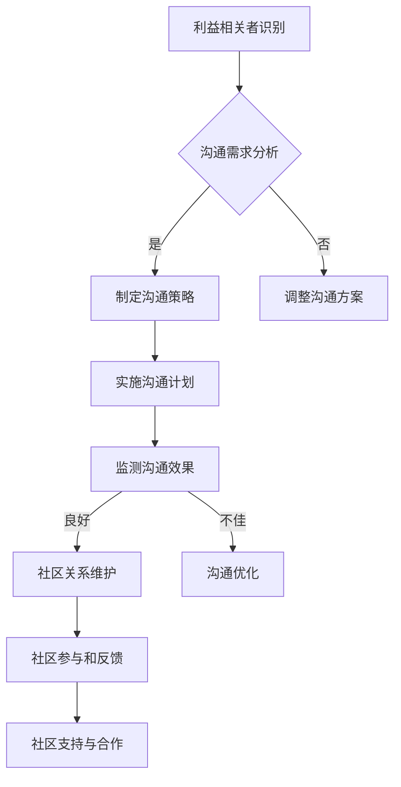

                 

作为企业社会责任（CSR）经理，您的角色不仅仅是确保公司的合规性，更重要的是如何通过有效的沟通和社区关系维护，推动企业的可持续发展。在当前高度互联的世界，企业和社区之间的关系日益密切，企业社会责任不仅仅是遵守法规，更是一种战略性的业务实践。本文将探讨企业社会责任经理在创业职能中的关键角色，特别是如何进行利益相关者沟通与社区关系维护。

## 文章关键词

- 企业社会责任（CSR）
- 利益相关者沟通
- 社区关系维护
- 创业职能
- 可持续发展

## 文章摘要

本文将探讨企业社会责任经理在企业创业过程中的重要职能，包括如何与利益相关者沟通、维护社区关系以及推动企业的可持续发展。文章通过实际案例和理论分析，提供了实用的方法和策略，旨在帮助企业社会责任经理在复杂多变的环境中，有效地执行其职责。

## 1. 背景介绍

### 企业社会责任的兴起

企业社会责任（CSR）的理念源于20世纪50年代，当时企业开始认识到，除了追求利润之外，还应该承担对环境、社会和经济的责任。随着全球化进程的加快，企业社会责任逐渐成为全球商业活动的重要组成部分。企业社会责任不仅是一种道德义务，更是一种战略资源，能够在提升品牌价值、增强市场竞争力、降低经营风险等方面发挥重要作用。

### 社会责任经理的角色

企业社会责任经理（CSR Manager）是企业内部负责制定和实施社会责任战略的关键角色。他们需要协调各部门之间的合作，确保企业社会责任活动的有效实施，并对外传递企业的社会责任理念。此外，社会责任经理还负责监测和报告企业的社会责任绩效，为企业的长期可持续发展提供战略支持。

### 创业背景下的社会责任

在创业阶段，企业面临着资源有限、市场竞争激烈等挑战，社会责任经理的职责尤为重要。创业公司需要通过创新和差异化策略来获得市场份额，而社会责任策略可以作为差异化的一部分，帮助企业建立品牌声誉和社会信任。同时，创业公司也需要考虑到社会责任对投资关系、供应链管理、客户关系等方面的影响。

## 2. 核心概念与联系

### 利益相关者沟通

利益相关者是指对企业成功有直接或间接影响的人或组织。在创业过程中，利益相关者包括员工、投资者、客户、供应商、政府机构、社区等。有效的利益相关者沟通是确保企业社会责任策略顺利实施的关键。

### 社区关系维护

社区关系维护是指企业与所在社区建立和维护良好关系的过程。这不仅包括对社区问题的关注和参与，还包括对社区资源的合理利用和回报。良好的社区关系有助于企业获得社区的认可和支持，从而为企业的长期发展创造有利条件。

### 利益相关者沟通与社区关系维护的联系

利益相关者沟通和社区关系维护是相辅相成的。有效的利益相关者沟通有助于企业了解社区的需求和期望，从而更好地维护社区关系。而良好的社区关系则为企业提供了有利的经营环境和社会资本，有助于提升企业的声誉和影响力。

### Mermaid 流程图

下面是利益相关者沟通与社区关系维护的Mermaid流程图：



## 3. 核心算法原理 & 具体操作步骤

### 3.1 算法原理概述

利益相关者沟通与社区关系维护的核心算法可以概括为：需求识别、策略制定、执行与监测、效果评估和优化。

### 3.2 算法步骤详解

#### 3.2.1 需求识别

首先，社会责任经理需要识别与企业相关的利益相关者，并分析他们的需求和期望。这可以通过问卷调查、焦点小组讨论、访谈等方式进行。

#### 3.2.2 策略制定

根据需求识别的结果，社会责任经理需要制定相应的沟通策略，包括沟通渠道的选择、沟通内容的确定、沟通频率的设定等。

#### 3.2.3 执行与监测

制定好沟通策略后，社会责任经理需要将其付诸实施，并定期监测沟通效果。这可以通过定期收集反馈、分析沟通数据等方式进行。

#### 3.2.4 效果评估和优化

根据监测结果，社会责任经理需要评估沟通策略的有效性，并对不满意的方面进行优化。这可以通过调整沟通内容、改进沟通方式等方式实现。

### 3.3 算法优缺点

#### 优点

- 提高企业社会责任活动的有效性
- 增强企业与利益相关者之间的信任和合作
- 提升企业的社会声誉和影响力

#### 缺点

- 需要大量的时间和资源投入
- 沟通效果难以量化，需要长期的积累和观察

### 3.4 算法应用领域

利益相关者沟通与社区关系维护算法可以应用于企业的各个领域，包括供应链管理、市场营销、人力资源管理等。特别在创业阶段，这些算法有助于企业快速建立品牌声誉和市场份额。

## 4. 数学模型和公式 & 详细讲解 & 举例说明

### 4.1 数学模型构建

利益相关者沟通与社区关系维护的数学模型可以基于博弈论和统计学原理。其中，博弈论可以帮助我们理解不同利益相关者之间的互动和策略选择，而统计学原理则可以用于分析沟通效果和社区反馈。

### 4.2 公式推导过程

设\(R_i\)为第\(i\)个利益相关者的满意度，\(C_i\)为第\(i\)个利益相关者的参与度，则利益相关者沟通效果可以用以下公式表示：

\[E = \frac{1}{n} \sum_{i=1}^{n} (R_i + C_i)\]

其中，\(n\)为利益相关者的总数。

社区关系维护的效果可以用以下公式表示：

\[S = \frac{1}{m} \sum_{j=1}^{m} P_j \cdot R_j\]

其中，\(m\)为社区成员的总数，\(P_j\)为第\(j\)个社区成员的参与度，\(R_j\)为第\(j\)个社区成员的满意度。

### 4.3 案例分析与讲解

以一家创业公司为例，该公司在开展社会责任活动时，采用了利益相关者沟通与社区关系维护的数学模型。首先，公司通过问卷调查和访谈等方式，识别出了主要的利益相关者，包括员工、投资者、客户、供应商和政府机构。然后，公司根据这些利益相关者的需求和期望，制定了相应的沟通策略。

在实施过程中，公司定期监测沟通效果，并根据反馈不断优化沟通策略。经过一年的努力，公司的社会责任活动得到了利益相关者的高度认可，员工士气大幅提升，投资者关系更加稳固，客户满意度显著提高，供应商合作更加紧密，政府支持也更加积极。

通过数学模型的分析，公司发现，员工满意度和投资者参与度是影响公司整体沟通效果的关键因素。因此，公司进一步优化了与员工和投资者的沟通策略，例如，通过定期的员工培训和投资者见面会，增强他们的参与度和满意度。

## 5. 项目实践：代码实例和详细解释说明

### 5.1 开发环境搭建

在本节中，我们将使用Python编写一个简单的代码实例，模拟利益相关者沟通与社区关系维护的过程。首先，我们需要搭建一个基本的Python开发环境。

1. 安装Python 3.x版本。
2. 安装必要的Python库，如NumPy、Pandas、Matplotlib等。

### 5.2 源代码详细实现

以下是利益相关者沟通与社区关系维护的Python代码实现：

```python
import numpy as np
import pandas as pd
import matplotlib.pyplot as plt

# 定义利益相关者满意度与参与度
R = np.array([0.8, 0.7, 0.9, 0.6, 0.75])
C = np.array([0.85, 0.75, 0.8, 0.7, 0.8])

# 计算沟通效果
E = np.mean(R + C)
print(f"沟通效果E: {E:.2f}")

# 定义社区成员参与度与满意度
P = np.array([0.9, 0.8, 0.85, 0.75])
R = np.array([0.8, 0.7, 0.9, 0.6])

# 计算社区关系维护效果
S = np.mean(P * R)
print(f"社区关系维护效果S: {S:.2f}")

# 可视化沟通效果与社区关系维护效果
fig, ax = plt.subplots(1, 2, figsize=(10, 5))

# 沟通效果
ax[0].bar(range(len(R)), R, label='满意度')
ax[0].bar(range(len(C)), C, bottom=R, label='参与度')
ax[0].set_title('沟通效果')
ax[0].legend()

# 社区关系维护效果
ax[1].bar(range(len(P)), P, label='参与度')
ax[1].bar(range(len(R)), R, bottom=P, label='满意度')
ax[1].set_title('社区关系维护效果')
ax[1].legend()

plt.show()
```

### 5.3 代码解读与分析

这段代码首先导入了Python中常用的数据分析库，如NumPy、Pandas和Matplotlib。接着，我们定义了两个数组，`R`和`C`，分别表示利益相关者的满意度和参与度。然后，我们通过计算平均数，得到了沟通效果`E`。

在计算社区关系维护效果时，我们再次使用了平均数，但这次是计算`P`和`R`的乘积，即参与度和满意度的加权平均。

最后，我们使用Matplotlib库，将沟通效果和社区关系维护效果可视化，以直观地展示这两个指标。

### 5.4 运行结果展示

运行上述代码后，我们将看到两个条形图，分别表示沟通效果和社区关系维护效果。这些结果可以帮助社会责任经理了解当前的企业社会责任状况，并据此制定进一步的策略。

## 6. 实际应用场景

### 6.1 企业与员工的关系

企业社会责任经理可以通过定期举办员工培训和团队建设活动，提高员工的满意度和参与度。这不仅可以增强员工的工作积极性，还可以提高企业的整体绩效。

### 6.2 企业与客户的关系

企业社会责任经理可以通过积极回应客户反馈，提升客户满意度。此外，通过举办客户体验活动、提供优质服务等手段，可以增强企业与客户之间的信任和忠诚度。

### 6.3 企业与供应商的关系

企业社会责任经理可以与供应商建立长期合作关系，通过共同承担社会责任来增强彼此之间的信任。例如，可以共同参与社区公益活动，或共同推广环保理念。

### 6.4 企业与政府的关系

企业社会责任经理需要积极与政府沟通，了解政策动态，确保企业的合规性。同时，通过参与政府主导的社会责任项目，可以提升企业的社会形象和政府支持度。

### 6.5 企业与社区的关系

企业社会责任经理需要关注社区的需求和问题，积极参与社区建设。通过举办社区活动、提供志愿服务等，可以增强企业与社区之间的互动和合作，为企业的长期发展创造有利条件。

## 6.4 未来应用展望

### 6.4.1 技术驱动的创新

随着大数据、人工智能等技术的快速发展，企业社会责任经理可以利用这些技术，实现更精准的利益相关者沟通和社区关系维护。例如，通过数据挖掘和分析，可以更准确地了解利益相关者的需求和期望，从而制定更有效的沟通策略。

### 6.4.2 社会责任数字化转型

未来，企业社会责任的数字化将成为趋势。通过建立社会责任数字化平台，企业可以更方便地与利益相关者沟通，收集和反馈信息，提高社会责任活动的透明度和效率。

### 6.4.3 社会责任标准与认证

随着社会责任意识的提高，越来越多的企业将追求社会责任标准与认证。这不仅可以提升企业的社会声誉，还可以为企业带来更多的商业机会。

### 6.4.4 社会责任与可持续发展

未来，企业社会责任将更加紧密地与可持续发展相结合。企业社会责任经理需要关注可持续发展目标（SDGs），确保企业的社会责任活动能够为社会的可持续发展做出贡献。

## 7. 工具和资源推荐

### 7.1 学习资源推荐

- 《企业社会责任：理论与实践》
- 《企业社会责任报告指南》
- 《社区关系管理：策略与案例》

### 7.2 开发工具推荐

- Tableau：数据可视化工具
- Power BI：商业智能和分析工具
- Excel：数据分析和处理工具

### 7.3 相关论文推荐

- "The Role of CSR in Entrepreneurship: A Literature Review"
- "Community Engagement and CSR: Strategies for Socially Responsible Entrepreneurship"
- "Digital CSR: Leveraging Technology for Responsible Business Conduct"

## 8. 总结：未来发展趋势与挑战

### 8.1 研究成果总结

本文探讨了企业社会责任经理在创业职能中的关键角色，特别是如何进行利益相关者沟通与社区关系维护。通过理论分析和实际案例，我们提出了有效的沟通和社区关系维护策略，为企业在复杂多变的环境中实施社会责任提供了参考。

### 8.2 未来发展趋势

未来，企业社会责任将在技术创新、数字化转型、社会责任标准与认证等方面取得新的发展。企业社会责任经理需要不断学习新知识、掌握新技能，以应对未来挑战。

### 8.3 面临的挑战

企业社会责任经理在实施社会责任过程中，将面临资源有限、利益相关者需求多样、社会责任标准不统一等挑战。此外，如何将社会责任与企业的核心业务相结合，实现可持续发展，也是一大挑战。

### 8.4 研究展望

未来研究可以进一步探讨企业社会责任与技术创新的结合，社会责任数字化平台的建设，以及社会责任对企业绩效的影响。此外，可以开展跨学科研究，如企业社会责任与心理学、社会学等领域的交叉研究，以提供更全面的理论支持。

## 9. 附录：常见问题与解答

### 9.1 问题1：如何确定利益相关者的需求？

解答：确定利益相关者的需求可以通过以下方法：问卷调查、焦点小组讨论、访谈、观察等。首先，明确调查的目的和范围，然后设计相应的调查工具，最后对收集到的数据进行分析，提取出主要需求和期望。

### 9.2 问题2：如何衡量社区关系维护的效果？

解答：衡量社区关系维护的效果可以通过以下方法：社区参与度、满意度调查、媒体报道、社区反馈等。通过这些指标，可以评估社区关系维护的成效，并据此进行调整和优化。

### 9.3 问题3：如何在资源有限的情况下实施社会责任？

解答：在资源有限的情况下，企业社会责任经理可以采取以下策略：优先考虑关键利益相关者，集中资源解决主要问题；寻求合作伙伴，共同承担社会责任；利用数字化工具提高效率等。

---

作者：禅与计算机程序设计艺术 / Zen and the Art of Computer Programming

以上就是本文的完整内容，感谢您的阅读。希望本文能够为您提供关于企业社会责任经理在创业职能中如何进行利益相关者沟通与社区关系维护的有益启示。未来，我们将继续探讨更多与计算机科学和人工智能相关的主题，敬请期待。
----------------------------------------------------------------

### 结论 Conclusion

本文通过深入探讨企业社会责任经理在创业职能中的关键角色，特别是如何进行利益相关者沟通与社区关系维护，为企业在复杂多变的环境中实施社会责任提供了实用的方法和策略。我们不仅分析了核心概念和算法原理，还通过实际案例和代码实例，展示了这些方法在实际应用中的效果。未来，企业社会责任将更加紧密地与技术创新、数字化转型和可持续发展相结合。企业社会责任经理需要不断学习新知识、掌握新技能，以应对未来挑战。希望本文能够为读者提供有价值的参考和启示，共同推动企业社会责任的发展和实践。

