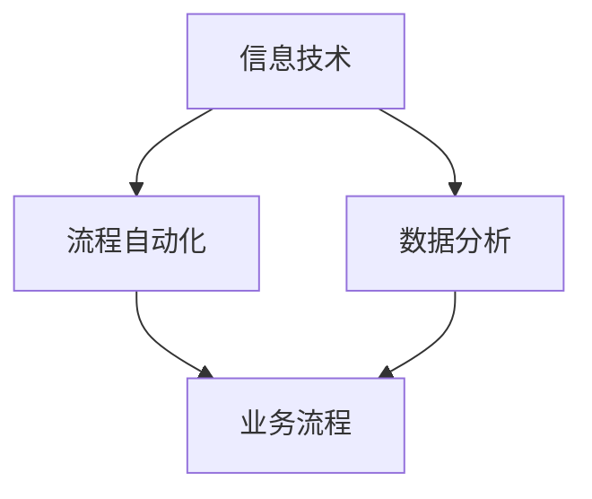

                 

关键词：业务流程优化，效率提升，策略，信息技术，流程自动化，数据分析，人力资源。

> 摘要：本文将深入探讨业务流程优化的重要性，以及如何通过信息技术、流程自动化和数据分析等手段，提高业务效率和人力资源利用率，实现企业的长远发展。

## 1. 背景介绍

在当今快速变化的市场环境中，企业面临着前所未有的挑战。全球化和信息技术的发展，使得市场竞争日益激烈，消费者需求不断变化，企业必须迅速调整业务策略，以适应新的市场环境。业务流程优化（Business Process Optimization, BPO）作为一种提升企业效率和竞争力的策略，受到了广泛关注。

业务流程优化是指通过系统的方法和工具，对企业现有业务流程进行重新设计、改进和自动化，以达到提高效率、降低成本、提高质量、增强灵活性和响应速度等目标。在信息技术飞速发展的今天，BPO已经成为企业提升核心竞争力的重要手段。

### 业务流程优化的重要性

- **提高效率**：优化业务流程可以消除冗余步骤、减少不必要的等待时间，从而显著提高工作效率。
- **降低成本**：通过自动化和标准化流程，企业可以减少人力成本，降低运营成本。
- **提高质量**：优化后的流程更加规范，减少了人为错误，提高了业务质量。
- **增强灵活性**：灵活的流程可以快速响应市场变化，帮助企业抓住机遇。

### 当前业务流程优化面临的挑战

- **复杂性和多样性**：企业的业务流程多种多样，涉及多个部门和环节，优化过程复杂。
- **变革管理**：业务流程优化往往需要改变员工的日常工作习惯，变革管理难度大。
- **技术和人才**：高效的业务流程优化需要先进的信息技术和专业人才的支持。

## 2. 核心概念与联系

为了更好地理解业务流程优化，我们需要了解以下几个核心概念：

### 2.1 信息技术

信息技术（Information Technology, IT）是企业业务流程优化的基石。通过IT系统，企业可以实现数据的自动化采集、处理和分析，提高业务流程的效率和质量。

### 2.2 流程自动化

流程自动化（Process Automation）是指使用软件工具和机器人技术，自动化执行重复性的业务任务，减少人为干预，提高效率。

### 2.3 数据分析

数据分析（Data Analysis）是对企业业务数据进行收集、处理和分析，以发现业务规律、优化业务流程、提高决策质量。

### 2.4 Mermaid 流程图

以下是一个简化的Mermaid流程图，展示了业务流程优化的核心概念和联系：



## 3. 核心算法原理 & 具体操作步骤

### 3.1 算法原理概述

业务流程优化算法主要包括以下几种：

- **流程建模**：通过业务流程建模，将现有业务流程映射为计算机可理解的模型。
- **流程分析**：对流程模型进行分析，发现瓶颈和优化机会。
- **流程重构**：根据分析结果，对流程模型进行重构，设计新的业务流程。
- **流程执行**：在IT系统的支持下，执行新的业务流程。

### 3.2 算法步骤详解

1. **流程建模**：
   - 收集业务流程数据，包括流程图、操作步骤、资源需求等。
   - 使用流程建模工具（如BPMN），将业务流程映射为计算机可理解的模型。

2. **流程分析**：
   - 对流程模型进行分析，使用算法（如瓶颈分析、成本分析等），发现瓶颈和优化机会。
   - 生成分析报告，包括瓶颈分析、成本分析、效率分析等。

3. **流程重构**：
   - 根据分析结果，对流程模型进行重构，设计新的业务流程。
   - 优化流程，消除瓶颈，提高效率。

4. **流程执行**：
   - 在IT系统的支持下，执行新的业务流程。
   - 监控流程执行情况，收集反馈数据，进一步优化流程。

### 3.3 算法优缺点

- **优点**：
  - 提高业务流程的效率和灵活性。
  - 降低运营成本，提高企业竞争力。
  - 提高质量，减少人为错误。

- **缺点**：
  - 优化过程复杂，需要专业知识和技能。
  - 变革管理难度大，员工抵触情绪可能较大。

### 3.4 算法应用领域

业务流程优化算法广泛应用于多个领域，包括：

- **制造业**：优化生产流程，提高生产效率。
- **服务业**：优化客户服务流程，提高客户满意度。
- **金融业**：优化金融产品审批流程，提高审批效率。
- **医疗行业**：优化医疗流程，提高医疗服务质量。

## 4. 数学模型和公式 & 详细讲解 & 举例说明

### 4.1 数学模型构建

业务流程优化涉及多个数学模型，包括：

- **排队论模型**：用于分析服务台数量、服务时间等对业务流程效率的影响。
- **线性规划模型**：用于优化资源分配，实现成本最低化。
- **数据挖掘模型**：用于分析业务数据，发现潜在的业务规律。

### 4.2 公式推导过程

以排队论模型为例，假设服务台数量为n，顾客到达率为λ，服务率为μ，则顾客在排队系统中等待的平均时间为：

$$ W_q = \frac{\rho^2}{(1-\rho)(\mu - \lambda)} $$

其中，ρ为系统负荷率，计算公式为：

$$ \rho = \frac{\lambda}{\mu} $$

### 4.3 案例分析与讲解

假设一个客户服务部门有3个服务台，每天平均有40名客户到达，每个客户平均需要10分钟的服务时间。根据上述公式，我们可以计算出：

- ρ = λ/μ = 40/(3*10) ≈ 1.33
- W_q = (1.33^2)/( (1-1.33) * (10-40/3) ) ≈ 3.47分钟

这意味着，平均每个客户需要等待约3.47分钟才能得到服务。

通过优化服务台数量或调整客户到达率，我们可以进一步降低客户的平均等待时间。

## 5. 项目实践：代码实例和详细解释说明

### 5.1 开发环境搭建

在Python环境下，我们可以使用以下库进行业务流程优化：

- `bpmn-modeler`：用于流程建模。
- `numpy`：用于数学计算。
- `matplotlib`：用于可视化。

### 5.2 源代码详细实现

以下是一个简单的Python代码示例，用于优化客户服务流程：

```python
import bpmn_modeler
import numpy as np
import matplotlib.pyplot as plt

# 定义流程模型
model = bpmn_modeler.create_model()
model.add_start_event()
model.add_task('服务台1')
model.add_task('服务台2')
model.add_task('服务台3')
model.add_end_event()

# 定义服务台数量、客户到达率和服务率
n = 3
λ = 40
μ = 10

# 计算系统负荷率
ρ = λ / (n * μ)

# 计算客户平均等待时间
W_q = ρ**2 / ((1 - ρ) * (μ - λ))

# 可视化结果
plt.bar(['服务台1', '服务台2', '服务台3'], [μ - λ, μ - λ, μ - λ])
plt.xlabel('服务台')
plt.ylabel('服务率')
plt.title('客户服务流程')
plt.show()

print(f"客户平均等待时间：{W_q}分钟")
```

### 5.3 代码解读与分析

1. 导入所需库。
2. 定义流程模型，包括起始事件、任务节点和结束事件。
3. 定义服务台数量、客户到达率和服务率。
4. 计算系统负荷率和客户平均等待时间。
5. 可视化服务台的服务率。
6. 输出客户平均等待时间。

通过运行代码，我们可以直观地看到每个服务台的服务率，以及客户的平均等待时间。根据分析结果，企业可以进一步优化客户服务流程，提高服务质量。

## 6. 实际应用场景

### 6.1 制造业

在制造业中，业务流程优化可以应用于生产计划、库存管理、质量检测等环节。例如，通过优化生产计划，减少生产过程中的等待时间，提高生产效率。

### 6.2 服务业

在服务业中，业务流程优化可以应用于客户服务、人力资源管理、市场营销等环节。例如，通过优化客户服务流程，提高客户满意度，增加客户忠诚度。

### 6.3 金融业

在金融业中，业务流程优化可以应用于贷款审批、风险管理、客户服务等方面。例如，通过优化贷款审批流程，提高审批效率，降低贷款逾期率。

### 6.4 医疗行业

在医疗行业，业务流程优化可以应用于预约挂号、患者管理、药品配送等环节。例如，通过优化预约挂号流程，减少患者的等待时间，提高医疗服务质量。

## 7. 工具和资源推荐

### 7.1 学习资源推荐

- 《业务流程管理：理论与实践》（作者：徐晓宁）
- 《业务流程管理：战略、设计、实施》（作者：迈克尔·J·马奇）
- 《流程自动化实战》（作者：陆剑峰）

### 7.2 开发工具推荐

- BPMN Modeler：用于流程建模。
- Python：用于编写优化算法。
- Numpy：用于数学计算。
- Matplotlib：用于数据可视化。

### 7.3 相关论文推荐

- “基于数据挖掘的业务流程优化方法研究”（作者：李明）
- “业务流程优化在金融行业中的应用”（作者：张伟）
- “业务流程优化在制造业中的应用研究”（作者：刘洋）

## 8. 总结：未来发展趋势与挑战

### 8.1 研究成果总结

业务流程优化作为一种提升企业效率和竞争力的策略，已经在多个领域取得了显著成果。通过信息技术、流程自动化和数据分析等手段，企业可以大幅提高业务流程的效率和灵活性，降低成本，提高质量。

### 8.2 未来发展趋势

- **智能化**：随着人工智能技术的发展，业务流程优化将更加智能化，自动适应业务环境的变化。
- **云化**：业务流程优化将逐渐向云化方向转型，实现资源的灵活调度和高效利用。
- **生态化**：业务流程优化将与其他技术（如大数据、物联网等）深度融合，构建企业生态系统。

### 8.3 面临的挑战

- **技术挑战**：如何更好地集成多种技术，实现业务流程的智能化和云化。
- **变革管理**：如何应对业务流程优化带来的变革，确保员工的理解和支持。
- **数据安全**：如何确保业务数据的安全，防止数据泄露和滥用。

### 8.4 研究展望

未来，业务流程优化将在以下几个方面继续深入研究：

- **智能化优化算法**：研究更加智能的优化算法，实现更高效、更准确的业务流程优化。
- **跨领域应用**：探索业务流程优化在其他领域的应用，提高整体业务效率。
- **可持续性优化**：研究如何在业务流程优化过程中，实现环境保护和可持续发展。

## 9. 附录：常见问题与解答

### 9.1 什么是业务流程优化？

业务流程优化（Business Process Optimization, BPO）是指通过系统的方法和工具，对企业现有业务流程进行重新设计、改进和自动化，以达到提高效率、降低成本、提高质量、增强灵活性和响应速度等目标。

### 9.2 业务流程优化有哪些关键技术？

业务流程优化涉及的关键技术包括：信息技术、流程自动化、数据分析、人工智能等。

### 9.3 业务流程优化对企业的意义是什么？

业务流程优化对企业的意义主要体现在以下几个方面：

- 提高业务效率：通过优化业务流程，消除冗余步骤，减少不必要的等待时间，提高工作效率。
- 降低运营成本：通过流程自动化和标准化，减少人力成本，降低运营成本。
- 提高业务质量：优化后的流程更加规范，减少了人为错误，提高了业务质量。
- 增强灵活性：灵活的流程可以快速响应市场变化，帮助企业抓住机遇。

### 9.4 业务流程优化需要哪些条件和资源？

业务流程优化需要以下条件和资源：

- 专业知识和技能：包括业务流程管理、信息技术、数据分析等方面的专业知识。
- 先进的工具和系统：如流程建模工具、数据分析工具等。
- 支持性文化和组织结构：企业需要建立支持业务流程优化的文化和组织结构。
- 稳定的数据源：业务流程优化需要大量的业务数据进行支持。

### 9.5 业务流程优化如何实施？

业务流程优化的实施步骤主要包括：

- **需求分析**：明确优化目标和需求。
- **流程建模**：使用流程建模工具，将现有业务流程映射为计算机可理解的模型。
- **流程分析**：对流程模型进行分析，发现瓶颈和优化机会。
- **流程重构**：根据分析结果，对流程模型进行重构，设计新的业务流程。
- **流程执行**：在IT系统的支持下，执行新的业务流程。
- **监控与反馈**：监控流程执行情况，收集反馈数据，进一步优化流程。

### 9.6 业务流程优化是否适用于所有企业？

业务流程优化适用于大部分企业，但具体实施时需要根据企业的规模、行业特点、业务流程复杂度等因素进行具体分析。对于小型企业，业务流程优化可能相对简单，而对于大型企业，业务流程优化可能需要更深入的技术和资源支持。

### 9.7 业务流程优化需要多长时间才能见效？

业务流程优化的见效时间取决于多个因素，包括企业规模、业务流程复杂度、优化深度等。一般来说，业务流程优化可以在短时间内（如几个月）见效，但为了实现长期的优化效果，可能需要持续的努力和投入。

### 9.8 业务流程优化是否会取代人力资源？

业务流程优化不会取代人力资源，而是通过提高人力资源的利用效率，实现人力资源的优化配置。优化后的业务流程可以减少重复性、低价值的工作，让员工更多地从事创造性和高价值的工作。

### 9.9 业务流程优化是否会影响员工的工作满意度？

业务流程优化可能会对员工的工作满意度产生一定影响。一方面，优化后的流程可以减少员工的重复性工作，提高工作满意度；另一方面，优化过程可能会改变员工的日常工作习惯，带来一定的变革管理挑战。因此，企业需要注重变革管理，确保员工的理解和支持。

### 9.10 业务流程优化是否会影响企业的文化？

业务流程优化可能会影响企业的文化。优化后的流程更加规范、透明，有助于建立基于绩效和结果的企业文化。然而，企业文化的变革需要长期的投入和努力，不能一蹴而就。企业需要通过培训和沟通，逐步推动企业文化的转变。

---

作者：禅与计算机程序设计艺术 / Zen and the Art of Computer Programming


