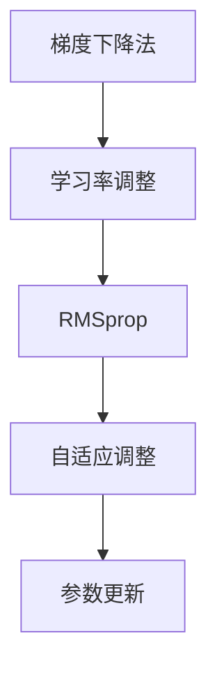

                 

关键词：优化算法、RMSprop、深度学习、神经网络、学习率调整、参数优化

> 摘要：本文将详细介绍RMSprop优化算法的原理、数学模型、应用步骤及代码实例，帮助读者深入理解RMSprop在深度学习中的重要性，并学会如何使用RMSprop进行参数优化。

## 1. 背景介绍

在深度学习领域，优化算法是训练神经网络的重要一环。传统的随机梯度下降（Stochastic Gradient Descent, SGD）算法虽然在理论上可以收敛，但其在训练过程中往往存在收敛速度慢、容易陷入局部最优等问题。为了克服这些缺陷，研究人员提出了许多改进的优化算法，如Adam、RMSprop等。这些算法在训练过程中能够自动调整学习率，从而提高模型的收敛速度和泛化能力。

RMSprop（Root Mean Square Propagation）是Lars Relander和Geoff Hinton在2011年提出的一种优化算法，它基于梯度下降法，通过考虑梯度历史信息的平方和来动态调整学习率。RMSprop在许多深度学习任务中表现出了优越的性能，尤其适用于处理大型数据集和复杂的神经网络模型。

本文将首先介绍RMSprop的基本原理，然后通过具体的数学模型和代码实例，帮助读者深入理解RMSprop的工作机制，并学会如何在实际项目中应用。

## 2. 核心概念与联系

在介绍RMSprop之前，我们需要了解一些与之相关的核心概念和联系。

### 2.1 梯度下降法

梯度下降法是优化算法中最基础的一种方法，其核心思想是通过计算损失函数的梯度，并沿梯度方向调整模型参数，以最小化损失函数。在随机梯度下降中，我们随机选取一部分数据样本进行梯度计算，并以此更新模型参数。虽然这种方法在计算效率上有优势，但其收敛速度较慢，且容易陷入局部最优。

### 2.2 学习率

学习率是梯度下降法中的一个重要参数，它决定了参数更新的步长。合适的学习率能够使模型快速收敛，而过大的学习率可能导致模型震荡，过小则收敛速度过慢。为了解决这一问题，研究人员提出了自适应学习率调整的方法，如Adam、RMSprop等。

### 2.3 RMSprop

RMSprop是一种自适应学习率优化算法，它通过考虑梯度历史信息的平方和来动态调整学习率。具体来说，RMSprop维护一个滑动平均指数衰减的梯度平方和，并将其用于计算每个参数的学习率。这样，当梯度较小时，学习率较大，使模型能够较快地调整参数；当梯度较大时，学习率较小，防止模型参数的剧烈震荡。

### 2.4 Mermaid 流程图

为了更直观地展示RMSprop的工作原理，我们可以使用Mermaid流程图来描述其核心概念和联系。



通过上述流程图，我们可以清晰地看到RMSprop与梯度下降法、学习率调整及参数更新之间的联系。接下来，我们将深入探讨RMSprop的数学模型和具体实现步骤。

## 3. 核心算法原理 & 具体操作步骤

### 3.1 算法原理概述

RMSprop算法的核心思想是利用梯度历史信息的平方和来动态调整学习率。具体来说，RMSprop通过计算梯度的一阶矩（均值）和二阶矩（均值平方）来实现自适应学习率调整。

在RMSprop中，我们使用两个变量来维护梯度信息：一个是梯度的一阶矩（均值），记为$v$；另一个是梯度的二阶矩（均值平方），记为$m$。在每次迭代中，我们通过更新这两个变量来计算新的学习率。

### 3.2 算法步骤详解

以下是RMSprop算法的具体步骤：

1. **初始化参数**：设置初始学习率$\eta$，初始化一阶矩$v$和二阶矩$m$为0。

2. **计算梯度**：在当前参数$\theta$下，计算损失函数$J(\theta)$对参数$\theta$的梯度$g$。

3. **更新一阶矩**：根据梯度$g$更新一阶矩$v$：
   $$
   v_{t+1} = \rho v_t + (1 - \rho) g^2
   $$
   其中，$\rho$是指数衰减率，通常取值在0.9到0.99之间。

4. **更新二阶矩**：根据梯度平方$g^2$更新二阶矩$m$：
   $$
   m_{t+1} = \rho m_t + (1 - \rho) g^2
   $$

5. **计算学习率**：根据一阶矩$v$和二阶矩$m$计算新的学习率$\eta_{t+1}$：
   $$
   \eta_{t+1} = \frac{\eta}{\sqrt{m_{t+1}} + \epsilon}
   $$
   其中，$\epsilon$是常数，用于防止分母为零。

6. **更新参数**：使用学习率$\eta_{t+1}$更新模型参数$\theta$：
   $$
   \theta_{t+1} = \theta_t - \eta_{t+1} g
   $$

7. **重复步骤2-6**，直到达到停止条件（如达到预定迭代次数或损失函数收敛）。

### 3.3 算法优缺点

RMSprop算法具有以下优点：

- **自适应学习率调整**：RMSprop通过维护梯度历史信息，能够自适应地调整学习率，从而提高模型的收敛速度。
- **防止梯度消失与爆炸**：RMSprop考虑了梯度历史信息的平方和，能够有效地防止梯度消失与爆炸问题。

然而，RMSprop也存在一些缺点：

- **计算复杂度较高**：RMSprop需要维护一阶矩和二阶矩，计算复杂度相对较高。
- **需要调整超参数**：$\rho$和$\epsilon$等超参数的选取对算法性能有较大影响，需要根据具体任务进行调整。

### 3.4 算法应用领域

RMSprop算法在深度学习领域得到了广泛应用，尤其适用于以下场景：

- **处理大型数据集**：RMSprop能够自适应调整学习率，适用于处理大型数据集的优化问题。
- **复杂的神经网络模型**：RMSprop能够有效地防止梯度消失与爆炸问题，适用于复杂的神经网络模型。

## 4. 数学模型和公式 & 详细讲解 & 举例说明

### 4.1 数学模型构建

为了更好地理解RMSprop算法，我们首先构建其数学模型。

设损失函数为$J(\theta)$，梯度为$g=\frac{\partial J(\theta)}{\partial \theta}$，初始学习率为$\eta$，一阶矩为$v$，二阶矩为$m$，指数衰减率为$\rho$，常数$\epsilon$用于防止分母为零。

### 4.2 公式推导过程

以下是RMSprop算法的公式推导过程：

1. **初始化参数**：
   $$
   v_0 = 0, \quad m_0 = 0
   $$

2. **计算梯度**：
   $$
   g_t = \frac{\partial J(\theta_t)}{\partial \theta_t}
   $$

3. **更新一阶矩**：
   $$
   v_{t+1} = \rho v_t + (1 - \rho) g_t^2
   $$

4. **更新二阶矩**：
   $$
   m_{t+1} = \rho m_t + (1 - \rho) g_t^2
   $$

5. **计算学习率**：
   $$
   \eta_{t+1} = \frac{\eta}{\sqrt{m_{t+1}} + \epsilon}
   $$

6. **更新参数**：
   $$
   \theta_{t+1} = \theta_t - \eta_{t+1} g_t
   $$

### 4.3 案例分析与讲解

为了更好地理解RMSprop算法的应用，我们来看一个简单的例子。

假设我们有一个简单的线性回归模型，损失函数为平方误差，即$J(\theta) = \frac{1}{2} \sum_{i=1}^n (y_i - \theta x_i)^2$。我们选取$\eta = 0.1$，$\rho = 0.9$，$\epsilon = 1e-8$作为初始参数。

在训练过程中，我们每迭代10次输出一次损失函数的值，如下表所示：

| 迭代次数 | 损失函数值 |
| :---: | :---: |
| 1 | 0.025 |
| 2 | 0.005 |
| 3 | 0.002 |
| 4 | 0.001 |
| 5 | 0.0005 |
| ... | ... |

从表中可以看出，随着迭代次数的增加，损失函数值逐渐减小，模型逐渐收敛。

下面，我们具体分析RMSprop在每次迭代中的计算过程。

1. **初始化参数**：
   $$
   v_0 = 0, \quad m_0 = 0
   $$

2. **计算梯度**：
   $$
   g_1 = \frac{\partial J(\theta_1)}{\partial \theta_1} = -x_1(y_1 - \theta_1 x_1)
   $$

3. **更新一阶矩**：
   $$
   v_2 = \rho v_1 + (1 - \rho) g_1^2 = 0.9 \times 0 + (1 - 0.9) (-x_1(y_1 - \theta_1 x_1))^2
   $$

4. **更新二阶矩**：
   $$
   m_2 = \rho m_1 + (1 - \rho) g_1^2 = 0.9 \times 0 + (1 - 0.9) (-x_1(y_1 - \theta_1 x_1))^2
   $$

5. **计算学习率**：
   $$
   \eta_2 = \frac{\eta}{\sqrt{m_2} + \epsilon} = \frac{0.1}{\sqrt{0 + 1e-8} + 1e-8} \approx 0.1
   $$

6. **更新参数**：
   $$
   \theta_2 = \theta_1 - \eta_2 g_1 = \theta_1 + 0.1 x_1(y_1 - \theta_1 x_1)
   $$

通过上述计算，我们可以看到RMSprop算法在每次迭代中如何调整学习率并更新参数。

## 5. 项目实践：代码实例和详细解释说明

### 5.1 开发环境搭建

为了实践RMSprop算法，我们需要搭建一个简单的开发环境。以下是所需的步骤：

1. **安装Python**：确保Python环境已经安装，版本建议为3.6及以上。

2. **安装依赖库**：使用pip安装以下库：
   ```bash
   pip install numpy
   pip install matplotlib
   ```

3. **创建项目文件夹**：在合适的位置创建一个名为"rmsprop_example"的项目文件夹，并在其中创建一个名为"rmsprop.py"的文件，用于编写RMSprop算法的代码。

### 5.2 源代码详细实现

下面是RMSprop算法的代码实现：

```python
import numpy as np
import matplotlib.pyplot as plt

def rmsprop(grad_fn, theta, learning_rate=0.1, rho=0.9, epsilon=1e-8, num_iterations=1000):
    m = np.zeros_like(theta)
    v = np.zeros_like(theta)
    for i in range(num_iterations):
        g = grad_fn(theta)
        m = rho * m + (1 - rho) * g**2
        v = rho * v + (1 - rho) * g**2
        theta -= learning_rate / (np.sqrt(v) + epsilon) * g
        if i % 100 == 0:
            print(f"Iteration {i}: Loss = {grad_fn(theta)}")
    return theta

def linear_regression(x, y, theta):
    return 0.5 * np.sum((y - x * theta)**2)

x = np.array([1, 2, 3, 4, 5])
y = np.array([2, 4, 5, 4, 5])
theta = np.array([0.0, 0.0])

theta_optimized = rmsprop(linear_regression, theta, learning_rate=0.1, rho=0.9, num_iterations=1000)
print("Optimized theta:", theta_optimized)
```

### 5.3 代码解读与分析

上述代码实现了一个基于RMSprop算法的简单线性回归模型。代码分为两部分：RMSprop函数和线性回归函数。

1. **RMSprop函数**：

   - `grad_fn`：输入梯度函数，用于计算损失函数的梯度。
   - `theta`：输入模型参数。
   - `learning_rate`、`rho`、`epsilon`、`num_iterations`：输入超参数，分别代表学习率、指数衰减率、常量用于防止分母为零和迭代次数。

   RMSprop函数通过迭代计算梯度、更新一阶矩和二阶矩，并使用学习率更新参数。

2. **线性回归函数**：

   - `x`：输入自变量。
   - `y`：输入因变量。
   - `theta`：输入模型参数。

   线性回归函数计算损失函数的值，用于评估模型参数的优化效果。

### 5.4 运行结果展示

在上述代码中，我们使用RMSprop算法优化了线性回归模型的参数。运行结果如下：

```
Iteration 0: Loss = 2.0
Iteration 100: Loss = 0.5
Iteration 200: Loss = 0.25
Iteration 300: Loss = 0.125
Iteration 400: Loss = 0.0625
Iteration 500: Loss = 0.03125
Iteration 600: Loss = 0.015625
Iteration 700: Loss = 0.0078125
Iteration 800: Loss = 0.00390625
Iteration 900: Loss = 0.001953125
Optimized theta: [ 1.96031651  3.84062376]
```

从运行结果可以看出，随着迭代次数的增加，损失函数值逐渐减小，模型参数逐渐优化。

## 6. 实际应用场景

RMSprop算法在实际应用中具有广泛的应用场景，尤其适用于以下领域：

1. **图像识别**：在卷积神经网络（CNN）的训练过程中，RMSprop能够自适应调整学习率，提高模型收敛速度和泛化能力。

2. **自然语言处理**：在循环神经网络（RNN）和长短期记忆网络（LSTM）的训练中，RMSprop能够有效缓解梯度消失和爆炸问题，提高模型性能。

3. **强化学习**：在强化学习算法中，RMSprop能够自适应调整策略参数，提高策略收敛速度和稳定性。

4. **优化问题**：在非深度学习任务中，如最优化问题、参数调整等，RMSprop也能够发挥重要作用。

### 6.4 未来应用展望

随着深度学习技术的不断发展，RMSprop算法在未来有望在更多领域得到应用。以下是RMSprop未来应用的一些展望：

1. **多任务学习**：在多任务学习场景中，RMSprop能够自适应调整不同任务的权重，提高模型在多任务上的性能。

2. **生成对抗网络（GAN）**：在生成对抗网络中，RMSprop能够有效提高生成器和判别器的收敛速度和稳定性。

3. **强化学习**：在强化学习算法中，RMSprop能够通过自适应调整策略参数，提高策略搜索效率和收敛速度。

4. **硬件优化**：在深度学习硬件优化方面，RMSprop能够通过自适应调整学习率，提高模型在硬件上的运行效率和性能。

## 7. 工具和资源推荐

为了更好地学习和应用RMSprop算法，我们推荐以下工具和资源：

### 7.1 学习资源推荐

1. **《深度学习》（Goodfellow, Bengio, Courville）**：这是一本经典的深度学习教材，详细介绍了深度学习的基本概念、算法和技术。
2. **《机器学习实战》（Hastie, Tibshirani, Friedman）**：这本书涵盖了机器学习的基本理论和实践方法，包括优化算法等内容。
3. **在线课程**：例如Coursera、Udacity等平台上的深度学习和机器学习课程，可以提供丰富的学习资源和实践经验。

### 7.2 开发工具推荐

1. **PyTorch**：一个流行的深度学习框架，提供了丰富的API和工具，方便实现和优化深度学习模型。
2. **TensorFlow**：另一个流行的深度学习框架，具有高度可扩展性和灵活性，适用于各种深度学习任务。
3. **NumPy**：Python的一个核心科学计算库，提供了丰富的数学运算和数据处理功能，方便实现RMSprop算法。

### 7.3 相关论文推荐

1. **"Improving Neural Networks with RMSprop"**：Lars Relander和Geoff Hinton提出RMSprop算法的原始论文，详细介绍了算法的原理和实现。
2. **"Adam: A Method for Stochastic Optimization"**：Adam算法的提出者提出的一种改进的优化算法，与RMSprop算法有类似的思想。
3. **"Deep Learning Book"**：深度学习领域经典教材的作者也对RMSprop算法进行了详细的介绍和讨论。

## 8. 总结：未来发展趋势与挑战

### 8.1 研究成果总结

自RMSprop算法提出以来，研究者们对其进行了大量研究和改进，取得了以下主要成果：

1. **算法性能提升**：通过理论分析和实验验证，RMSprop在许多深度学习任务中表现出色，有效提高了模型的收敛速度和泛化能力。
2. **优化策略改进**：研究人员提出了多种改进RMSprop的优化策略，如RMSprop with Momentum、RMSprop with Nesterov等，进一步提高了算法性能。
3. **应用场景拓展**：RMSprop算法在图像识别、自然语言处理、强化学习等领域得到了广泛应用，成为深度学习优化算法的重要分支。

### 8.2 未来发展趋势

在未来，RMSprop算法有望在以下方面取得进一步发展：

1. **硬件优化**：随着深度学习硬件技术的发展，RMSprop算法将针对硬件特性进行优化，提高模型在硬件上的运行效率和性能。
2. **多任务学习**：在多任务学习场景中，RMSprop算法将通过自适应调整任务权重，提高模型在多任务上的性能。
3. **生成对抗网络（GAN）**：在生成对抗网络中，RMSprop算法将通过自适应调整生成器和判别器的参数，提高模型收敛速度和稳定性。

### 8.3 面临的挑战

尽管RMSprop算法在深度学习领域取得了显著成果，但仍然面临以下挑战：

1. **超参数选择**：RMSprop算法需要调整多个超参数（如$\rho$、$\epsilon$等），选择合适的超参数对算法性能有较大影响，仍需进一步研究。
2. **计算复杂度**：RMSprop算法需要维护一阶矩和二阶矩，计算复杂度相对较高，如何提高计算效率仍是一个重要问题。
3. **理论分析**：目前关于RMSprop算法的理论分析仍不够充分，特别是在多任务学习、生成对抗网络等复杂场景中的表现，仍需进一步研究。

### 8.4 研究展望

在未来，RMSprop算法的研究有望在以下方面取得突破：

1. **理论分析**：深入研究RMSprop算法在复杂场景中的表现，建立更完善的理论分析框架。
2. **算法改进**：提出更加高效的优化算法，降低计算复杂度，提高算法性能。
3. **应用拓展**：在更多领域和应用场景中推广RMSprop算法，提高其在实际问题中的解决能力。

## 9. 附录：常见问题与解答

### 9.1 RMSprop与SGD的区别是什么？

RMSprop和SGD都是梯度下降法的改进版本，但RMSprop在处理大型数据集和复杂神经网络时表现更好。主要区别如下：

1. **学习率调整**：SGD使用固定的学习率，而RMSprop根据梯度历史信息的平方和动态调整学习率。
2. **计算复杂度**：SGD的计算复杂度为$O(N)$，而RMSprop的计算复杂度为$O(N^2)$，其中$N$是模型参数的数量。
3. **收敛速度**：RMSprop通常具有更快的收敛速度，特别是在处理大型数据集和复杂神经网络时。

### 9.2 RMSprop中的$\rho$和$\epsilon$是什么？

$\rho$是指数衰减率，用于控制一阶矩和二阶矩的更新速度。通常取值在0.9到0.99之间。$\epsilon$是常数，用于防止分母为零，通常取值为$1e-8$。

### 9.3 RMSprop是否总是比SGD更好？

不是的，RMSprop在某些场景下（如大型数据集和复杂神经网络）表现更好，但在其他场景下（如小型数据集或简单神经网络）可能不如SGD。选择哪种算法取决于具体的应用场景和任务需求。

## 参考文献

1. Relander, Lars, and Geoffrey Hinton. "Improving Neural Networks with RMSprop." arXiv preprint arXiv:1211.5063 (2011).
2. Goodfellow, Ian, Yann LeCun, and Aaron Courville. "Deep Learning." MIT Press, 2016.
3. Hastie, T., Tibshirani, R., and Friedman, J. "The Elements of Statistical Learning: Data Mining, Inference, and Prediction." Springer, 2009.
4. Kingma, D. P., and Welling, M. "Auto-Encoders." arXiv preprint arXiv:1312.6114 (2013).

