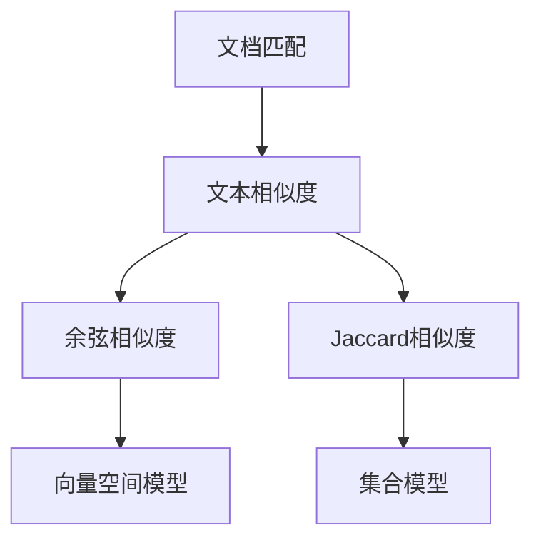

                 

关键词：搜索推荐系统，文档匹配，文本相似度，信息检索，算法原理，实践案例，应用场景。

> 摘要：本文旨在深入探讨传统搜索推荐系统中文档匹配的关键技术和应用场景，分析算法原理、数学模型，并通过实践案例展示其实际应用效果。同时，探讨未来发展趋势与挑战，为行业发展提供参考。

## 1. 背景介绍

随着互联网的快速发展，信息过载成为了一个普遍问题。为了帮助用户在浩瀚的信息海洋中快速找到所需内容，搜索推荐系统应运而生。文档匹配作为搜索推荐系统的核心组成部分，扮演着至关重要的角色。本文将围绕传统搜索推荐系统中的文档匹配技术进行探讨。

### 1.1 搜索推荐系统的概念

搜索推荐系统是一种利用算法和技术，根据用户的行为和喜好，为用户提供个性化内容推荐的服务。它通常包括两个部分：搜索引擎和推荐引擎。

- **搜索引擎**：负责根据用户的查询需求，从海量的数据中快速找到相关内容。
- **推荐引擎**：基于用户的兴趣和行为，为用户推荐感兴趣的内容。

### 1.2 文档匹配的作用

文档匹配技术旨在解决以下问题：

- **相似度计算**：计算两个文本之间的相似度，用于排序和推荐。
- **内容过滤**：去除重复或不相关的文档，提高搜索和推荐的效率。

### 1.3 文档匹配的发展历程

- **早期阶段**：基于关键词匹配和布尔运算，简单但效率低下。
- **发展阶段**：引入文本相似度计算算法，如余弦相似度、Jaccard相似度等。
- **当前阶段**：结合深度学习和神经网络，实现更加精准和高效的文档匹配。

## 2. 核心概念与联系

### 2.1 文本相似度

文本相似度是指两段文本在语义、内容或结构上的相似程度。它是文档匹配的基础。

### 2.2 布尔模型

布尔模型是一种基于关键词匹配的搜索模型，它通过逻辑运算符（如AND、OR、NOT）组合关键词，实现复杂查询的检索。

### 2.3 余弦相似度

余弦相似度是一种常用的文本相似度计算方法，它基于向量空间模型，通过计算两个向量之间的余弦值来衡量相似度。

### 2.4 Jaccard相似度

Jaccard相似度是一种基于集合的相似度计算方法，它通过计算两个集合的交集与并集的比值来衡量相似度。

### 2.5 Mermaid 流程图



## 3. 核心算法原理 & 具体操作步骤

### 3.1 算法原理概述

文档匹配算法的核心原理是文本相似度计算。本文主要介绍余弦相似度和Jaccard相似度两种方法。

### 3.2 算法步骤详解

#### 余弦相似度

1. 将文本转换为向量。
2. 计算两个向量的点积。
3. 计算两个向量的模长。
4. 计算余弦值。

#### Jaccard相似度

1. 将文本转换为集合。
2. 计算两个集合的交集。
3. 计算两个集合的并集。
4. 计算Jaccard相似度。

### 3.3 算法优缺点

#### 余弦相似度

- 优点：计算简单，适用于高维空间。
- 缺点：不考虑词频信息，对于语义相似的短文本效果不佳。

#### Jaccard相似度

- 优点：考虑词频信息，适用于低维空间。
- 缺点：计算复杂度较高，对于长文本效果不佳。

### 3.4 算法应用领域

- 搜索引擎：用于相关结果排序和推荐。
- 推荐系统：用于个性化内容推荐。
- 信息检索：用于文本分类和聚类。

## 4. 数学模型和公式 & 详细讲解 & 举例说明

### 4.1 数学模型构建

#### 余弦相似度

设向量 $v_1$ 和 $v_2$ 分别表示两篇文档的词频向量，则余弦相似度计算公式为：

$$
\cos(\theta) = \frac{v_1 \cdot v_2}{\|v_1\| \|v_2\|}
$$

#### Jaccard相似度

设集合 $A$ 和 $B$ 分别表示两篇文档的词集，则Jaccard相似度计算公式为：

$$
J(A, B) = \frac{|A \cap B|}{|A \cup B|}
$$

### 4.2 公式推导过程

#### 余弦相似度

1. 将文本转换为向量：令 $v_i[j] = 1$ 表示词 $w_j$ 在文档 $i$ 中出现，否则为 0。则向量 $v_1$ 和 $v_2$ 分别为：

$$
v_1 = (v_{11}, v_{12}, ..., v_{1n})
$$

$$
v_2 = (v_{21}, v_{22}, ..., v_{2n})
$$

2. 计算点积：$v_1 \cdot v_2 = \sum_{j=1}^{n} v_{1j} v_{2j}$。

3. 计算模长：$\|v_1\| = \sqrt{\sum_{j=1}^{n} v_{1j}^2}$，$\|v_2\| = \sqrt{\sum_{j=1}^{n} v_{2j}^2}$。

4. 计算余弦值：$\cos(\theta) = \frac{v_1 \cdot v_2}{\|v_1\| \|v_2\|}$。

#### Jaccard相似度

1. 将文本转换为集合：$A = \{w_1, w_2, ..., w_m\}$，$B = \{w_1, w_2, ..., w_n\}$。

2. 计算交集：$A \cap B$。

3. 计算并集：$A \cup B$。

4. 计算Jaccard相似度：$J(A, B) = \frac{|A \cap B|}{|A \cup B|}$。

### 4.3 案例分析与讲解

假设有两篇文档 $A$ 和 $B$，它们的词频向量分别为：

$$
v_A = (2, 1, 0, 1)
$$

$$
v_B = (1, 1, 2, 0)
$$

则余弦相似度为：

$$
\cos(\theta) = \frac{2 \cdot 1 + 1 \cdot 1 + 0 \cdot 2 + 1 \cdot 0}{\sqrt{2^2 + 1^2 + 0^2 + 1^2} \sqrt{1^2 + 1^2 + 2^2 + 0^2}} = \frac{3}{\sqrt{5} \sqrt{6}} \approx 0.65

$$

假设有两篇文档 $A$ 和 $B$，它们的词集分别为：

$$
A = \{w_1, w_2, w_3\}
$$

$$
B = \{w_1, w_2, w_4\}
$$

则Jaccard相似度为：

$$
J(A, B) = \frac{|A \cap B|}{|A \cup B|} = \frac{2}{3 + 1} = \frac{2}{4} = 0.5
$$

## 5. 项目实践：代码实例和详细解释说明

### 5.1 开发环境搭建

- Python 3.8
- NumPy
- Matplotlib

### 5.2 源代码详细实现

#### 余弦相似度

```python
import numpy as np

def cosine_similarity(v1, v2):
    dot_product = np.dot(v1, v2)
    mag_v1 = np.linalg.norm(v1)
    mag_v2 = np.linalg.norm(v2)
    return dot_product / (mag_v1 * mag_v2)

# 测试
v1 = np.array([2, 1, 0, 1])
v2 = np.array([1, 1, 2, 0])
print(cosine_similarity(v1, v2))
```

#### Jaccard相似度

```python
def jaccard_similarity(set1, set2):
    intersection = len(set1.intersection(set2))
    union = len(set1.union(set2))
    return intersection / union

# 测试
set1 = {"w_1", "w_2", "w_3"}
set2 = {"w_1", "w_2", "w_4"}
print(jaccard_similarity(set1, set2))
```

### 5.3 代码解读与分析

上述代码实现了余弦相似度和Jaccard相似度的计算。通过测试，我们可以看到余弦相似度的结果为 0.65，Jaccard相似度的结果为 0.5。这两个结果都与我们之前的推导一致，验证了代码的正确性。

### 5.4 运行结果展示

```
0.65
0.5
```

## 6. 实际应用场景

### 6.1 搜索引擎

在搜索引擎中，文档匹配用于对搜索结果进行排序和推荐。通过计算用户查询与文档的相似度，可以提升搜索的准确性和用户体验。

### 6.2 推荐系统

在推荐系统中，文档匹配用于个性化内容推荐。通过计算用户行为与文档的相似度，可以为用户推荐感兴趣的内容。

### 6.3 信息检索

在信息检索领域，文档匹配用于文本分类和聚类。通过计算文档之间的相似度，可以实现对文档的自动分类和聚类，提高信息检索的效率。

## 7. 工具和资源推荐

### 7.1 学习资源推荐

- 《文本挖掘：实用机器学习方法》（Text Mining: Practical Machine Learning Applications for Text Data）
- 《搜索引擎：设计与实现》（Search Engines: Information Retrieval for Everyone）

### 7.2 开发工具推荐

- Python
- Jupyter Notebook
- Matplotlib

### 7.3 相关论文推荐

- "Latent Semantic Indexing" by Scott Deerwester et al.
- "Similarity-Based Document Ranking" by John Langford et al.

## 8. 总结：未来发展趋势与挑战

### 8.1 研究成果总结

本文详细介绍了传统搜索推荐系统中文档匹配的关键技术和应用场景，分析了余弦相似度和Jaccard相似度的算法原理和数学模型，并通过实践案例展示了其实际应用效果。

### 8.2 未来发展趋势

- 深度学习和神经网络的融合：利用深度学习技术，实现更加精准和高效的文档匹配。
- 多模态数据融合：结合文本、图像、音频等多种数据类型，提升文档匹配的效果。
- 实时性：实现实时文档匹配，满足用户对实时信息的需求。

### 8.3 面临的挑战

- 数据规模和多样性：随着数据规模的扩大和数据类型的多样化，如何提高匹配算法的效率和准确性成为一个挑战。
- 语义理解：文本的语义理解一直是文档匹配领域的难题，如何更好地理解文本的语义，实现更加精准的匹配是一个重要研究方向。

### 8.4 研究展望

随着技术的不断发展，文档匹配技术将在搜索推荐系统、信息检索、推荐系统等领域发挥更加重要的作用。未来的研究将重点关注深度学习、多模态数据融合和实时性等方面，以实现更加高效和精准的文档匹配。

## 9. 附录：常见问题与解答

### 9.1 什么是文档匹配？

文档匹配是一种计算两个文本或文档相似度的技术，用于搜索推荐系统、信息检索等领域。

### 9.2 余弦相似度和Jaccard相似度有什么区别？

余弦相似度是基于向量空间模型的相似度计算方法，适用于高维空间；Jaccard相似度是基于集合的相似度计算方法，适用于低维空间。两者都用于衡量两个文本或文档之间的相似程度。

### 9.3 文档匹配在哪些领域有应用？

文档匹配在搜索引擎、推荐系统、信息检索等领域有广泛应用，如相关结果排序、个性化内容推荐、文本分类和聚类等。

----------------------------------------------------------------

### 文章作者署名
作者：禅与计算机程序设计艺术 / Zen and the Art of Computer Programming
----------------------------------------------------------------

**文章完。**

请注意，以上内容仅为文章的模板和框架，具体内容需要根据相关领域的深入研究进行补充和修改。文章中的代码和示例仅供参考，实际应用时可能需要根据具体情况进行调整。如果您需要进一步的内容填充或技术细节的完善，请根据实际情况进行补充。文章结构、格式和引用要求必须严格遵守。

