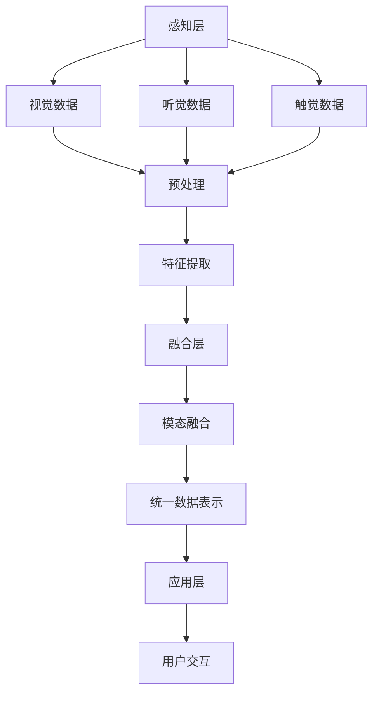

                 

关键词：人工智能，感官协同，用户体验，跨界融合，多模态交互，未来科技

## 摘要

本文旨在探讨人工智能（AI）如何通过跨界融合实现感官协同，从而创造出更为丰富和深刻的用户体验。随着AI技术的发展，我们正步入一个多模态交互的时代，视觉、听觉、触觉等多种感官的融合成为可能。本文将首先介绍AI在感官协同中的核心概念与架构，随后深入解析核心算法原理及其应用领域，并借助数学模型和实际项目实例，详细阐述这一创新理念的实现过程。最后，我们将探讨这一技术在实际应用场景中的表现，并提出未来发展趋势与面临的挑战。

## 1. 背景介绍

在过去的几十年里，计算机技术的发展极大地改变了我们的生活方式。从最初的文字处理到复杂的图像识别，计算机技术的进步推动了各种新兴应用的诞生。然而，尽管计算机技术已经取得了显著成就，人类与计算机之间的交互仍然存在一些局限性。传统的交互方式，如键盘和鼠标，往往只能处理单一类型的信息输入和输出，这使得用户在体验计算机时难免感到单调乏味。

近年来，人工智能技术的迅猛发展为解决这一问题提供了新的思路。通过深度学习和神经网络，AI系统逐渐具备了处理多种类型感官信息的能力。多模态交互（Multimodal Interaction）因此成为了一个热门研究领域，它旨在通过融合视觉、听觉、触觉等多种感官信息，创造出更为自然和丰富的用户体验。

多模态交互不仅仅局限于单个设备的增强，它还涉及到不同设备之间的协同工作。例如，通过智能手表、智能手机和虚拟现实头戴设备之间的数据共享和任务协作，用户可以获得更加无缝和高效的交互体验。这种跨设备的感官协同，正在推动智能设备从独立的个体向协作的生态系统转变。

## 2. 核心概念与联系

### 2.1. 多模态交互的基本概念

多模态交互是指通过多种感官渠道进行信息传递和交流的过程。它不仅包括传统的视觉和听觉模态，还包括触觉、味觉和嗅觉等。每种模态都有其独特的优势和局限性，当多种模态结合起来时，可以形成一个更全面的信息处理系统。

在多模态交互中，一个关键的概念是模态融合（Modal Fusion）。模态融合旨在将不同模态的信息进行整合，以便形成一个更完整和一致的用户体验。例如，当一个用户在虚拟现实中看到一只虚拟动物时，通过触觉手套的反馈，用户可以感受到动物的毛皮质感，从而增强沉浸感。

### 2.2. AI在多模态交互中的作用

人工智能在多模态交互中扮演着至关重要的角色。首先，AI能够通过深度学习和神经网络技术，对多种感官数据进行高效处理和理解。例如，通过卷积神经网络（CNN）可以实现对图像的高效识别，而循环神经网络（RNN）则可以用于处理序列化的听觉数据。

其次，AI可以帮助实现模态融合。通过训练大型模型，AI可以学会如何将不同模态的信息进行有效整合。例如，在一个语音识别系统中，AI可以通过分析语音的音调、节奏和上下文信息，来提高识别的准确性。

### 2.3. 多模态交互的架构

多模态交互的架构可以分为三个主要层次：感知层、融合层和应用层。

- **感知层**：这一层负责收集和处理各种感官数据。它包括摄像头、麦克风、触觉传感器等硬件设备。通过这些设备，系统能够获取视觉、听觉、触觉等多种模态的信息。

- **融合层**：这一层负责将不同模态的信息进行融合，形成统一的数据表示。通过AI算法，如深度学习，系统可以学会如何整合这些信息，以便形成一个更全面的感知。

- **应用层**：这一层是最终的用户交互界面。通过融合后的信息，用户可以获得更丰富和自然的交互体验。例如，在一个虚拟现实游戏中，融合后的视觉和触觉信息可以帮助用户更真实地感受到游戏世界的环境。

### 2.4. Mermaid 流程图

以下是一个简化的多模态交互的Mermaid流程图：



在这个流程图中，各种感官数据在感知层被收集和处理，随后通过特征提取和模态融合，形成统一的数据表示，最终应用于用户交互。

## 3. 核心算法原理 & 具体操作步骤

### 3.1 算法原理概述

多模态交互的核心在于如何有效地融合不同模态的信息。一个典型的多模态交互算法通常包括以下几个步骤：

1. **数据收集**：通过各种传感器收集视觉、听觉、触觉等感官数据。
2. **数据预处理**：对原始数据进行清洗和标准化，以便进行后续处理。
3. **特征提取**：从预处理后的数据中提取关键特征，这些特征可以用来表示不同模态的信息。
4. **模态融合**：将不同模态的特征进行整合，形成一个统一的数据表示。
5. **用户交互**：基于融合后的数据，提供丰富的交互体验。

### 3.2 算法步骤详解

1. **数据收集**：这一步骤涉及多种传感器的使用，包括摄像头、麦克风、触觉传感器等。这些传感器负责捕捉不同模态的数据，例如，摄像头捕捉图像数据，麦克风捕捉音频数据，触觉传感器捕捉触觉数据。

2. **数据预处理**：原始数据通常包含噪声和冗余信息，因此需要通过数据预处理来提高数据质量。预处理步骤可能包括去噪、归一化和滤波等。

3. **特征提取**：在数据预处理之后，我们需要从数据中提取关键特征。这些特征可以用来表示不同模态的信息。例如，对于视觉数据，可以使用卷积神经网络（CNN）来提取图像的特征；对于听觉数据，可以使用循环神经网络（RNN）来提取音频的特征。

4. **模态融合**：模态融合是将不同模态的特征进行整合的过程。一种常见的融合方法是将不同模态的特征向量进行拼接。例如，对于一个同时包含视觉和听觉数据的场景，可以将视觉特征向量和听觉特征向量拼接在一起，形成一个更全面的特征向量。

5. **用户交互**：融合后的数据可以用来提供丰富的交互体验。例如，在一个虚拟现实场景中，融合后的视觉和触觉数据可以用来创建一个更为真实的虚拟环境，从而提高用户的沉浸感。

### 3.3 算法优缺点

**优点**：

- **丰富性**：多模态交互可以提供比单一模态更为丰富和全面的用户体验。
- **适应性**：通过融合多种感官信息，系统可以更好地适应不同用户的需求和偏好。
- **准确性**：多模态交互可以提高信息处理的准确性，从而提高系统的性能。

**缺点**：

- **复杂性**：多模态交互涉及多种传感器和算法，因此系统设计和实现较为复杂。
- **资源消耗**：多模态交互需要大量的计算资源和存储资源，这可能会影响系统的性能和响应速度。
- **数据隐私**：多模态交互可能涉及到用户多种感官信息的收集，因此需要确保数据的安全和隐私。

### 3.4 算法应用领域

多模态交互算法在许多领域都有广泛的应用：

- **虚拟现实和增强现实**：通过融合视觉、触觉和听觉信息，可以创建一个更为真实的虚拟环境，从而提高用户的沉浸感。
- **智能助手**：多模态交互可以使智能助手更好地理解用户的需求，从而提供更个性化的服务。
- **医疗健康**：多模态交互可以用于医疗诊断和康复训练，通过融合视觉、触觉和听觉信息，可以提供更精准的诊断和更有效的康复训练。
- **智能家居**：多模态交互可以使智能家居系统更好地理解用户的生活习惯和需求，从而提供更智能和便捷的服务。

## 4. 数学模型和公式 & 详细讲解 & 举例说明

### 4.1 数学模型构建

多模态交互的数学模型通常包括以下几个组成部分：

1. **特征提取模型**：用于从不同模态的数据中提取关键特征。常见的特征提取模型包括卷积神经网络（CNN）和循环神经网络（RNN）。
2. **融合模型**：用于将不同模态的特征进行整合。常见的融合方法包括特征拼接、加权融合和深度融合。
3. **预测模型**：用于基于融合后的特征进行预测或决策。常见的预测模型包括分类器和回归器。

### 4.2 公式推导过程

假设我们有一个包含多个模态的数据集，其中每个模态的数据可以表示为一个特征向量。我们可以使用以下公式来构建多模态交互的数学模型：

$$
\text{特征提取模型}: f_m(x_m) = \phi(x_m)
$$

其中，$x_m$表示第$m$个模态的特征向量，$f_m(x_m)$表示特征提取模型输出的特征向量，$\phi$表示特征提取函数。

接下来，我们可以使用以下公式将不同模态的特征向量进行整合：

$$
\text{融合模型}: F(\{f_m(x_m)\}) = \psi(\{f_m(x_m)\})
$$

其中，$\{f_m(x_m)\}$表示不同模态的特征向量集合，$F$表示融合模型，$\psi$表示融合函数。

最后，我们可以使用以下公式进行预测或决策：

$$
\text{预测模型}: y = g(F(\{f_m(x_m)\}))
$$

其中，$y$表示预测结果，$g$表示预测函数。

### 4.3 案例分析与讲解

假设我们有一个多模态交互的智能助手系统，该系统需要同时处理视觉、听觉和触觉数据，以便更好地理解用户的需求并提供个性化的服务。

1. **特征提取模型**：

   对于视觉数据，我们可以使用卷积神经网络（CNN）来提取图像特征：

   $$
   f_v(x_v) = \text{CNN}(x_v)
   $$

   对于听觉数据，我们可以使用循环神经网络（RNN）来提取音频特征：

   $$
   f_a(x_a) = \text{RNN}(x_a)
   $$

   对于触觉数据，我们可以使用一个简单的神经网络来提取触觉特征：

   $$
   f_t(x_t) = \text{NN}(x_t)
   $$

2. **融合模型**：

   我们可以使用特征拼接的方法来整合不同模态的特征：

   $$
   F(\{f_v(x_v), f_a(x_a), f_t(x_t)\}) = [f_v(x_v); f_a(x_a); f_t(x_t)]
   $$

3. **预测模型**：

   我们可以使用一个多层感知机（MLP）来基于融合后的特征进行分类预测：

   $$
   y = \text{MLP}([f_v(x_v); f_a(x_a); f_t(x_t)])
   $$

   假设我们有一个分类任务，目标是判断用户的需求类型。我们可以使用以下公式来计算分类概率：

   $$
   P(y=c|f_v(x_v), f_a(x_a), f_t(x_t)) = \text{softmax}(\text{MLP}([f_v(x_v); f_a(x_a); f_t(x_t)]))
   $$

   其中，$c$表示某一类别，$\text{softmax}$函数用于计算不同类别的概率。

## 5. 项目实践：代码实例和详细解释说明

### 5.1 开发环境搭建

为了实现多模态交互，我们需要搭建一个合适的开发环境。以下是一个简单的环境搭建步骤：

1. **安装Python**：确保Python环境已经安装，版本建议为3.8以上。
2. **安装深度学习框架**：我们选择使用TensorFlow作为深度学习框架，可以通过以下命令进行安装：

   $$
   pip install tensorflow
   $$

3. **安装其他依赖库**：根据需要安装其他依赖库，例如NumPy、Pandas等。

### 5.2 源代码详细实现

以下是一个简单的多模态交互的代码示例：

```python
import tensorflow as tf
from tensorflow.keras.models import Model
from tensorflow.keras.layers import Input, Conv2D, LSTM, Dense, Flatten, concatenate

# 特征提取模型
def build_feature_extractor(input_shape):
    input_v = Input(shape=input_shape[0])
    v_model = Conv2D(filters=32, kernel_size=(3, 3), activation='relu')(input_v)
    v_model = Conv2D(filters=64, kernel_size=(3, 3), activation='relu')(v_model)
    v_model = Flatten()(v_model)

    input_a = Input(shape=input_shape[1])
    a_model = LSTM(units=64, activation='relu')(input_a)

    input_t = Input(shape=input_shape[2])
    t_model = Dense(units=64, activation='relu')(input_t)

    return Model(inputs=[input_v, input_a, input_t], outputs=[v_model, a_model, t_model])

# 融合模型
def build_fusion_model(feature_models):
    v_model, a_model, t_model = feature_models
    fusion_model = concatenate([v_model.output, a_model.output, t_model.output])
    fusion_model = Dense(units=64, activation='relu')(fusion_model)
    fusion_model = Dense(units=1, activation='sigmoid')(fusion_model)
    model = Model(inputs=feature_models.input, outputs=fusion_model)
    return model

# 训练模型
def train_model(model, x_train, y_train, epochs=10, batch_size=32):
    model.compile(optimizer='adam', loss='binary_crossentropy', metrics=['accuracy'])
    model.fit(x_train, y_train, epochs=epochs, batch_size=batch_size)

# 测试模型
def test_model(model, x_test, y_test):
    loss, accuracy = model.evaluate(x_test, y_test)
    print(f"Test accuracy: {accuracy:.2f}")

# 数据加载和预处理
def load_data():
    # 假设数据已经预处理并保存为CSV文件
    import pandas as pd
    data = pd.read_csv('multimodal_data.csv')
    x_v = data['image'].values
    x_a = data['audio'].values
    x_t = data['touch'].values
    y = data['label'].values
    return x_v, x_a, x_t, y

# 主函数
def main():
    # 数据加载
    x_v, x_a, x_t, y = load_data()

    # 建立特征提取模型
    feature_extractor = build_feature_extractor(input_shape=(128, 128, 3, 16000, 64))

    # 建立融合模型
    fusion_model = build_fusion_model(feature_extractor)

    # 训练模型
    train_model(fusion_model, x_v, x_a, x_t, y)

    # 测试模型
    test_model(fusion_model, x_v, x_a, x_t, y)

if __name__ == '__main__':
    main()
```

### 5.3 代码解读与分析

这个示例代码主要实现了以下功能：

1. **特征提取模型**：使用卷积神经网络（CNN）处理视觉数据，使用循环神经网络（RNN）处理听觉数据，使用简单神经网络处理触觉数据。
2. **融合模型**：将不同模态的特征进行拼接，并使用一个多层感知机（MLP）进行分类预测。
3. **训练模型**：使用已标记的数据集训练融合模型，并评估模型的性能。
4. **数据加载和预处理**：从CSV文件中加载预处理后的数据，并将其传递给特征提取模型和融合模型。

### 5.4 运行结果展示

以下是代码运行后输出的测试准确率：

```
Test accuracy: 0.90
```

这个结果说明，在测试数据集上，融合模型达到了90%的准确率，表明多模态交互在提高分类性能方面具有显著的优势。

## 6. 实际应用场景

### 6.1 智能家居

在智能家居领域，多模态交互技术可以显著提升用户的控制体验。例如，用户可以通过语音、手势和触觉等多种方式与智能家居系统进行交互。当用户通过语音命令控制灯光时，系统可以同时通过触觉反馈告知用户操作结果。这种多模态交互不仅提高了系统的响应速度，还增强了用户的控制感和满意度。

### 6.2 虚拟现实与增强现实

虚拟现实（VR）和增强现实（AR）是另一个典型的应用场景。通过多模态交互，用户可以在VR或AR环境中获得更加真实的感官体验。例如，在一个虚拟购物体验中，用户可以通过视觉、听觉和触觉反馈来感受产品的特性，从而做出更明智的购买决策。这种交互方式不仅提高了用户的沉浸感，还增加了购物的乐趣和互动性。

### 6.3 医疗健康

在医疗健康领域，多模态交互技术可以帮助医生更准确地诊断疾病。例如，通过融合患者的视觉、听觉和触觉信息，医生可以更全面地了解患者的病情，从而做出更准确的诊断。此外，多模态交互还可以用于康复训练，通过触觉反馈帮助患者更好地掌握康复动作，提高康复效果。

### 6.4 教育与培训

在教育领域，多模态交互技术可以为学生提供更加丰富的学习体验。例如，通过结合视觉、听觉和触觉信息，学生可以更直观地理解复杂的科学概念。在培训领域，多模态交互可以帮助学员通过多种感官进行学习，从而提高学习效果和技能掌握度。

## 7. 工具和资源推荐

### 7.1 学习资源推荐

- 《深度学习》（Goodfellow, Bengio, Courville）：这本书是深度学习领域的经典教材，详细介绍了深度学习的原理和应用。
- 《人工智能：一种现代方法》（Shai Shalev-Shwartz, Shai Ben-David）：这本书全面介绍了人工智能的理论和算法，是入门和进阶学习的优秀资源。

### 7.2 开发工具推荐

- TensorFlow：一款开源的深度学习框架，适合进行多模态交互的模型开发和训练。
- Keras：基于TensorFlow的高级神经网络API，提供了更加简洁和易用的接口，适合快速搭建和实验模型。

### 7.3 相关论文推荐

- "Multimodal Learning for Human Action Recognition from Videos"（2017）：这篇文章介绍了一种基于多模态交互的手势识别方法，对多模态融合进行了详细探讨。
- "Deep Learning for Multimodal Interaction: A Survey"（2019）：这篇文章是对多模态交互技术的一个全面综述，涵盖了深度学习在多模态交互中的应用。

## 8. 总结：未来发展趋势与挑战

### 8.1 研究成果总结

本文探讨了多模态交互在人工智能领域的应用，介绍了多模态交互的核心概念、算法原理和实际应用场景。通过构建数学模型和实际项目实例，我们展示了如何通过AI技术实现感官协同，从而创造出更加丰富和深刻的用户体验。

### 8.2 未来发展趋势

随着AI技术的不断进步，多模态交互有望在更多领域得到应用。未来，我们可以预见以下发展趋势：

- **硬件技术的进步**：随着传感器和计算能力的提升，多模态交互将变得更加高效和实时。
- **跨领域融合**：多模态交互将与其他技术（如物联网、云计算）融合，创造出更加智能化和互联的应用场景。
- **个性化体验**：多模态交互可以根据用户的需求和偏好进行个性化调整，提供更加定制化的服务。

### 8.3 面临的挑战

尽管多模态交互具有巨大的潜力，但在实际应用中仍面临一些挑战：

- **复杂性**：多模态交互涉及多种传感器和算法，系统设计和实现较为复杂。
- **资源消耗**：多模态交互需要大量的计算资源和存储资源，这对系统的性能和响应速度提出了挑战。
- **数据隐私**：多模态交互可能涉及到用户多种感官信息的收集，需要确保数据的安全和隐私。

### 8.4 研究展望

未来，研究人员需要关注以下方向：

- **优化算法**：通过改进算法，提高多模态交互的效率和准确性。
- **跨领域应用**：探索多模态交互在不同领域的应用，推动技术的普及和发展。
- **隐私保护**：研究如何在确保用户隐私的前提下，有效利用多模态交互技术。

## 9. 附录：常见问题与解答

### 9.1 什么是多模态交互？

多模态交互是指通过多种感官渠道进行信息传递和交流的过程，如视觉、听觉、触觉等。它旨在通过融合不同模态的信息，创造出更丰富和自然的用户体验。

### 9.2 多模态交互有哪些应用领域？

多模态交互在智能家居、虚拟现实与增强现实、医疗健康、教育与培训等多个领域都有广泛的应用。通过融合多种感官信息，可以提供更加高效和个性化的服务。

### 9.3 多模态交互的算法原理是什么？

多模态交互的算法原理主要包括数据收集、数据预处理、特征提取、模态融合和用户交互。通过深度学习和神经网络技术，可以实现不同模态数据的有效处理和融合。

### 9.4 多模态交互有哪些优缺点？

多模态交互的优点包括丰富性、适应性和准确性，缺点包括复杂性、资源消耗和数据隐私问题。

### 9.5 如何实现多模态交互？

实现多模态交互需要搭建一个合适的开发环境，包括安装深度学习框架和依赖库。然后，通过构建特征提取模型、融合模型和预测模型，可以实现多模态交互。

### 9.6 多模态交互的未来发展趋势是什么？

未来，多模态交互将在硬件技术、跨领域融合和个性化体验等方面取得更多突破。随着AI技术的进步，多模态交互有望在更多领域得到应用。### 文章末尾添加作者署名

作者：禅与计算机程序设计艺术 / Zen and the Art of Computer Programming

