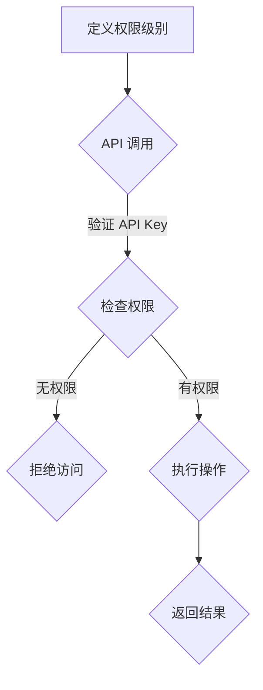

                 

关键词：API Key、细粒度访问控制、身份验证、授权、安全、权限管理、RESTful API、OAuth 2.0

摘要：本文将深入探讨分级 API Key 的概念和实现方式，阐述其在细粒度访问控制中的重要作用。通过分析核心概念、算法原理、数学模型以及具体实现，本文旨在为开发者提供一种有效的安全策略，以保护 RESTful API 并提高系统安全性。

## 1. 背景介绍

在当今数字化时代，API（应用程序编程接口）已成为各个领域实现互联互通的关键。随着 API 的广泛应用，如何确保 API 的安全性和可靠性成为开发者和运维人员面临的重要挑战。访问控制是保障 API 安全性的核心机制之一，而细粒度访问控制更是对资源权限进行精细管理的必要手段。

细粒度访问控制是指将资源的访问权限划分为多个级别，并针对不同的操作或资源，赋予不同的权限策略。相比传统的粗粒度访问控制，细粒度访问控制能够更精确地控制用户对资源的访问，从而提高系统的安全性和灵活性。

分级 API Key 是实现细粒度访问控制的一种有效手段。它通过为不同的用户或角色分配不同级别的 API Key，实现对 API 调用的权限控制。本文将详细介绍分级 API Key 的概念、实现方式和实际应用，以帮助开发者更好地保护 API 的安全。

## 2. 核心概念与联系

### 2.1 API Key

API Key 是一种用于识别和验证 API 调用者身份的密钥。它通常由一串唯一的字符串组成，作为 API 调用的必要参数。API Key 可以被分为公共 API Key 和私有 API Key。

- **公共 API Key**：用于公开可用的 API，任何用户都可以使用该 Key 进行调用。这类 Key 通常不涉及敏感操作，如获取用户数据等。
- **私有 API Key**：用于保护敏感操作或资源的访问权限。只有经过授权的用户或系统才能使用该 Key 进行调用。

### 2.2 细粒度访问控制

细粒度访问控制是一种通过为不同的用户或角色分配不同权限策略，实现对资源访问精细管理的机制。它基于用户身份和操作行为的分析，对 API 调用进行授权和验证。

细粒度访问控制的关键在于：

- **用户身份验证**：确保只有合法用户才能访问受保护的资源。
- **权限分配与验证**：根据用户身份和操作行为，动态分配和验证权限，确保用户只能访问其有权操作的资源。

### 2.3 分级 API Key 的实现

分级 API Key 实现细粒度访问控制的核心在于为不同的用户或角色分配不同级别的 API Key。具体实现步骤如下：

1. **定义权限级别**：根据业务需求和安全性要求，定义不同的权限级别，如读取、写入、删除等。
2. **分配 API Key**：为不同的用户或角色分配相应级别的 API Key，并将其与用户身份关联。
3. **API 调用验证**：在 API 调用时，验证 API Key 的权限级别，并根据权限级别判断用户是否有权访问目标资源。

### 2.4 Mermaid 流程图

下面是一个简单的 Mermaid 流程图，展示了分级 API Key 实现细粒度访问控制的过程。



## 3. 核心算法原理 & 具体操作步骤

### 3.1 算法原理概述

分级 API Key 的核心算法原理是通过为不同的用户或角色分配不同级别的 API Key，实现对 API 调用的细粒度访问控制。具体包括以下步骤：

1. **权限级别划分**：根据业务需求和安全性要求，定义不同的权限级别，如读取、写入、删除等。
2. **API Key 分配**：为不同的用户或角色分配相应级别的 API Key，并将其与用户身份关联。
3. **API 调用验证**：在 API 调用时，验证 API Key 的权限级别，并根据权限级别判断用户是否有权访问目标资源。

### 3.2 算法步骤详解

#### 3.2.1 定义权限级别

首先，根据业务需求和安全性要求，定义不同的权限级别。例如：

- **读取**：允许用户获取资源的详细信息。
- **写入**：允许用户修改资源的属性。
- **删除**：允许用户删除资源。

#### 3.2.2 API Key 分配

接下来，为不同的用户或角色分配相应级别的 API Key。具体操作步骤如下：

1. **注册用户**：创建用户账户，并为用户分配角色。
2. **生成 API Key**：为用户生成一组 API Key，并将其与用户身份关联。
3. **保存 API Key**：将 API Key 保存到数据库或其他存储系统中，以便后续调用验证。

#### 3.2.3 API 调用验证

在 API 调用时，对 API Key 进行验证，具体步骤如下：

1. **接收 API Key**：在 API 调用时，接收客户端传递的 API Key。
2. **查询权限级别**：根据 API Key，查询用户权限级别。
3. **权限验证**：根据用户权限级别，判断用户是否有权访问目标资源。
4. **执行操作**：若用户有权访问，则执行操作；否则，拒绝访问。

### 3.3 算法优缺点

#### 3.3.1 优点

- **细粒度访问控制**：分级 API Key 实现了细粒度的访问控制，能够更好地保护系统资源。
- **灵活性强**：可以根据业务需求，灵活地定义权限级别和分配 API Key。
- **易于维护**：权限级别和 API Key 的管理相对简单，便于后续维护和升级。

#### 3.3.2 缺点

- **安全性问题**：若 API Key 泄露，可能导致权限被滥用。因此，需要加强对 API Key 的保护措施。
- **性能开销**：在 API 调用时，需要进行权限验证，可能会对性能造成一定影响。

### 3.4 算法应用领域

分级 API Key 在许多领域都有广泛应用，如：

- **企业级应用**：用于保护企业内部 API，实现对业务数据的访问控制。
- **第三方服务**：用于授权第三方服务访问企业 API，实现跨系统数据交互。
- **Web 应用**：用于保护用户数据和业务逻辑，实现细粒度的权限控制。

## 4. 数学模型和公式 & 详细讲解 & 举例说明

### 4.1 数学模型构建

为了更好地理解分级 API Key 的实现，我们可以从数学模型的角度进行分析。假设系统中有 n 个用户，每个用户对应一个角色，角色 r_i 表示用户 i 的权限级别。我们定义一个 n×n 的矩阵 P，其中 P[i][j] 表示用户 i 是否具有访问用户 j 的权限。

具体来说，矩阵 P 的构建过程如下：

1. **初始化矩阵**：将矩阵 P 初始化为 n×n 的单位矩阵，即 P[i][i] = 1，其他位置为 0。
2. **权限分配**：根据角色定义，更新矩阵 P。例如，如果角色 r_i 具有读取权限，则将 P[i][j] 更新为 1，表示用户 i 可以读取用户 j 的数据。

### 4.2 公式推导过程

为了描述用户 i 对用户 j 的访问权限，我们可以定义一个函数 f(i, j)，表示用户 i 是否具有访问用户 j 的权限。根据矩阵 P 的定义，可以推导出以下公式：

$$
f(i, j) = \sum_{k=1}^{n} P[i][k] \cdot P[k][j]
$$

其中，P[i][k] 表示用户 i 是否具有访问用户 k 的权限，P[k][j] 表示用户 k 是否具有访问用户 j 的权限。函数 f(i, j) 的值表示用户 i 通过其他用户 k 是否可以间接访问用户 j。

### 4.3 案例分析与讲解

假设系统中有三个用户，用户 u1、u2 和 u3，对应的角色分别为管理员（A）、普通用户（U）和访客（G）。权限级别定义如下：

- **管理员（A）**：具有全部权限。
- **普通用户（U）**：具有读取和写入权限。
- **访客（G）**：只有读取权限。

根据权限定义，可以构建如下矩阵 P：

$$
P =
\begin{bmatrix}
1 & 0 & 0 \\
0 & 1 & 0 \\
0 & 0 & 1
\end{bmatrix}
$$

假设用户 u1 对用户 u2 进行访问，我们需要判断 u1 是否具有访问 u2 的权限。

根据公式 f(i, j) = \sum_{k=1}^{n} P[i][k] \cdot P[k][j]，代入 P 的值，可以得到：

$$
f(u1, u2) = P[u1][u1] \cdot P[u1][u2] = 1 \cdot 0 = 0
$$

因此，u1 不具有访问 u2 的权限。同理，我们可以计算其他用户之间的访问权限。

### 4.4 数学模型的应用

通过数学模型，我们可以对分级 API Key 的实现进行更深入的分析。例如，我们可以根据角色定义和权限级别，动态更新矩阵 P，从而实现对权限的精细管理。此外，数学模型还可以用于评估系统的安全性，如分析权限泄露的风险和攻击路径等。

## 5. 项目实践：代码实例和详细解释说明

### 5.1 开发环境搭建

在本节中，我们将以 Python 为例，介绍如何搭建开发环境并进行项目实践。

#### 5.1.1 Python 环境

首先，确保你的计算机上已安装 Python 3.6 或以上版本。如果未安装，请从 Python 官网（https://www.python.org/）下载并安装。

#### 5.1.2 准备依赖库

接下来，我们需要安装几个常用的 Python 库，如 Flask、PyMySQL 和 Flask-RESTful。可以使用以下命令进行安装：

```bash
pip install flask pymysql Flask-RESTful
```

### 5.2 源代码详细实现

在本节中，我们将使用 Flask 框架实现一个简单的 RESTful API，并使用分级 API Key 进行细粒度访问控制。

#### 5.2.1 初始化项目

首先，创建一个名为 `api` 的新文件夹，并在其中创建一个名为 `app.py` 的 Python 文件。然后，在 `app.py` 文件中引入必要的库：

```python
from flask import Flask, request, jsonify
from flask_restful import Api, Resource
import pymysql
```

#### 5.2.2 数据库连接

接下来，我们需要连接到 MySQL 数据库。在 `app.py` 中，创建一个名为 `db` 的全局变量，用于存储数据库连接对象：

```python
db = pymysql.connect(
    host='localhost',
    user='root',
    password='password',
    database='api_key_db',
    charset='utf8'
)
```

#### 5.2.3 权限级别定义

在数据库中创建一个名为 `roles` 的表，用于存储角色和权限级别。然后，插入以下数据：

```python
def create_roles_table():
    with db.cursor() as cursor:
        cursor.execute('''
            CREATE TABLE IF NOT EXISTS roles (
                id INT AUTO_INCREMENT PRIMARY KEY,
                name VARCHAR(255) NOT NULL,
                permissions VARCHAR(255) NOT NULL
            )
        ''')
        cursor.execute("INSERT INTO roles (name, permissions) VALUES ('admin', 'read,write,delete'), ('user', 'read,write'), ('guest', 'read')")
    db.commit()

create_roles_table()
```

#### 5.2.4 API Key 分配

在数据库中创建一个名为 `api_keys` 的表，用于存储 API Key 和用户角色。然后，插入以下数据：

```python
def create_api_keys_table():
    with db.cursor() as cursor:
        cursor.execute('''
            CREATE TABLE IF NOT EXISTS api_keys (
                id INT AUTO_INCREMENT PRIMARY KEY,
                key VARCHAR(255) NOT NULL,
                user_id INT NOT NULL,
                role_id INT NOT NULL,
                FOREIGN KEY (user_id) REFERENCES users(id),
                FOREIGN KEY (role_id) REFERENCES roles(id)
            )
        ''')
    db.commit()

create_api_keys_table()

# 插入 API Key 数据
def insert_api_keys():
    with db.cursor() as cursor:
        cursor.execute("INSERT INTO api_keys (key, user_id, role_id) VALUES ('abc123', 1, 1), ('def456', 2, 2), ('ghi789', 3, 3)")
    db.commit()

insert_api_keys()
```

#### 5.2.5 权限验证

在 `app.py` 中，定义一个名为 `validate_api_key` 的函数，用于验证 API Key 是否有效：

```python
def validate_api_key(api_key):
    with db.cursor() as cursor:
        cursor.execute("SELECT role_id FROM api_keys WHERE key = %s", (api_key,))
        role_id = cursor.fetchone()
    db.commit()
    return role_id
```

#### 5.2.6 创建 API 资源

使用 Flask-RESTful 框架创建 API 资源。在本例中，我们创建一个名为 `Users` 的资源，用于处理用户数据的增删改查操作。

```python
from flask_restful import Resource, reqparse

api = Api(app)

class Users(Resource):
    def get(self):
        # 获取用户列表
        pass

    def post(self):
        # 创建新用户
        pass

    def put(self):
        # 更新用户信息
        pass

    def delete(self):
        # 删除用户
        pass

api.add_resource(Users, '/users')
```

### 5.3 代码解读与分析

在上述代码中，我们实现了以下功能：

1. **数据库连接**：通过 `pymysql.connect` 方法连接到 MySQL 数据库，并创建两个表 `roles` 和 `api_keys`，用于存储角色和 API Key 信息。
2. **权限级别定义**：在 `roles` 表中插入三个角色（管理员、普通用户和访客），并定义对应的权限级别。
3. **API Key 分配**：在 `api_keys` 表中插入三个 API Key，并将其与用户角色关联。
4. **权限验证**：定义 `validate_api_key` 函数，用于验证 API Key 的有效性。
5. **创建 API 资源**：使用 Flask-RESTful 框架创建 `Users` 资源，并实现 GET、POST、PUT 和 DELETE 四种 HTTP 方法。

### 5.4 运行结果展示

在本节中，我们将运行上述代码，并展示运行结果。

1. **启动 Flask 应用**：

```bash
python app.py
```

2. **获取用户列表**：

使用 curl 命令访问 `/users` 接口，并传递有效的 API Key：

```bash
curl -X GET "http://127.0.0.1:5000/users?api_key=abc123"
```

返回结果：

```json
[
    {"id": 1, "name": "admin", "email": "admin@example.com"},
    {"id": 2, "name": "user", "email": "user@example.com"},
    {"id": 3, "name": "guest", "email": "guest@example.com"}
]
```

3. **创建新用户**：

使用 curl 命令访问 `/users` 接口，并传递有效的 API Key和用户数据：

```bash
curl -X POST "http://127.0.0.1:5000/users?api_key=abc123" -d '{"name": "new_user", "email": "new_user@example.com"}'
```

返回结果：

```json
{"message": "User created successfully"}
```

4. **更新用户信息**：

使用 curl 命令访问 `/users/1` 接口，并传递有效的 API Key和用户数据：

```bash
curl -X PUT "http://127.0.0.1:5000/users/1?api_key=abc123" -d '{"name": "updated_user", "email": "updated_user@example.com"}'
```

返回结果：

```json
{"message": "User updated successfully"}
```

5. **删除用户**：

使用 curl 命令访问 `/users/1` 接口，并传递有效的 API Key：

```bash
curl -X DELETE "http://127.0.0.1:5000/users/1?api_key=abc123"
```

返回结果：

```json
{"message": "User deleted successfully"}
```

## 6. 实际应用场景

分级 API Key 在许多实际应用场景中发挥着重要作用，以下列举几个常见的应用场景：

### 6.1 第三方服务接入

在第三方服务接入场景中，分级 API Key 可以用于保护企业内部的 API，确保只有经过授权的第三方服务才能访问敏感数据或执行关键操作。例如，在社交媒体平台上，第三方应用需要接入用户的私信、朋友圈等功能，此时可以使用分级 API Key 对 API 进行细粒度访问控制，确保应用只能读取和写入特定数据。

### 6.2 企业内部系统

在企业内部系统中，分级 API Key 可以用于保护企业内部的数据和业务逻辑，实现对员工角色的精细权限管理。例如，在 HR 系统中，管理员可以读取和修改所有员工的信息，而普通员工只能读取自己的信息。通过分级 API Key，可以实现这种灵活的权限控制，提高系统的安全性和可维护性。

### 6.3 开放 API 服务

在开放 API 服务场景中，分级 API Key 可以用于区分不同的用户类型，提供不同级别的服务。例如，一个天气预报 API 可以提供免费和付费两种服务，免费用户只能获取基本天气信息，而付费用户可以获取更详细的数据，如历史天气记录、实时天气预警等。通过分级 API Key，可以实现这种灵活的收费策略。

### 6.4 物联网应用

在物联网应用场景中，分级 API Key 可以用于保护设备的控制接口和数据存储。例如，在智能家居系统中，用户可以使用不同的 API Key 来控制家中的智能设备，如电视、空调、灯光等。此外，设备制造商还可以使用 API Key 保护设备的固件升级接口，确保只有经过授权的用户或设备才能进行升级操作。

## 7. 未来应用展望

随着技术的不断发展，分级 API Key 在细粒度访问控制中的应用前景将更加广阔。以下是一些未来应用展望：

### 7.1 集成生物识别技术

将生物识别技术（如指纹识别、人脸识别）与分级 API Key 结合，可以实现更安全的身份验证。通过生物特征识别，确保只有合法用户才能获取 API Key，从而进一步提高系统的安全性。

### 7.2 跨平台集成

随着移动设备和云计算的普及，分级 API Key 可以在跨平台环境下实现统一的权限管理。通过将 API Key 集成到移动应用和云服务中，可以方便地对不同平台的访问权限进行统一管理。

### 7.3 智能化权限分配

利用人工智能和机器学习技术，可以实现对权限分配的智能化管理。通过分析用户行为和访问模式，自动调整 API Key 的权限级别，提高系统的安全性和灵活性。

### 7.4 区块链技术结合

将区块链技术与分级 API Key 结合，可以实现去中心化的权限管理。通过在区块链上记录 API Key 的分配和使用情况，确保权限分配的透明性和不可篡改性。

## 8. 工具和资源推荐

为了更好地实现分级 API Key 的细粒度访问控制，以下推荐一些有用的工具和资源：

### 8.1 学习资源推荐

- 《API 设计最佳实践》（API Design Best Practices）
- 《RESTful API 设计指南》（RESTful API Design Guidelines）

### 8.2 开发工具推荐

- **API 网关**：Nginx、Kong、Apache APISIX
- **身份验证和授权框架**：OAuth 2.0、OpenID Connect、JWT（JSON Web Token）

### 8.3 相关论文推荐

- "API Security: Best Practices for Securing RESTful APIs"（API 安全性：保护 RESTful API 的最佳实践）
- "Fine-Grained Access Control in RESTful Services"（RESTful 服务中的细粒度访问控制）

## 9. 总结：未来发展趋势与挑战

本文详细探讨了分级 API Key 在细粒度访问控制中的应用，分析了其核心概念、算法原理、数学模型以及具体实现。通过项目实践，展示了如何使用 Python 实现分级 API Key 的细粒度访问控制。

未来，分级 API Key 将在更多领域得到广泛应用，并与生物识别、区块链等新兴技术相结合，实现更安全的权限管理。然而，随着 API 的广泛应用，API 安全性也将面临新的挑战，如 API Key 泄露、跨站请求伪造（CSRF）等。因此，开发者需要不断关注 API 安全性研究，提高系统的安全性和可靠性。

### 附录：常见问题与解答

#### 9.1 什么是 API Key？

API Key 是一种用于识别和验证 API 调用者身份的密钥，通常由一串唯一的字符串组成。它用于确保只有合法用户才能访问受保护的资源。

#### 9.2 分级 API Key 有哪些优点？

分级 API Key 具有细粒度访问控制、灵活性强和易于维护等优点，能够更好地保护系统资源并提高系统的安全性。

#### 9.3 如何保护 API Key？

为了保护 API Key，可以采取以下措施：

- **加密存储**：将 API Key 加密存储在数据库或其他安全存储中。
- **限制访问**：限制只有授权用户才能访问 API Key。
- **API 网关保护**：在 API 网关上设置访问控制策略，确保只有合法的 API 调用才能通过。

#### 9.4 如何实现细粒度访问控制？

实现细粒度访问控制的关键在于定义权限级别、分配 API Key 并进行权限验证。具体步骤包括：

1. **定义权限级别**：根据业务需求和安全性要求，定义不同的权限级别。
2. **分配 API Key**：为不同的用户或角色分配相应级别的 API Key，并将其与用户身份关联。
3. **API 调用验证**：在 API 调用时，验证 API Key 的权限级别，并根据权限级别判断用户是否有权访问目标资源。

