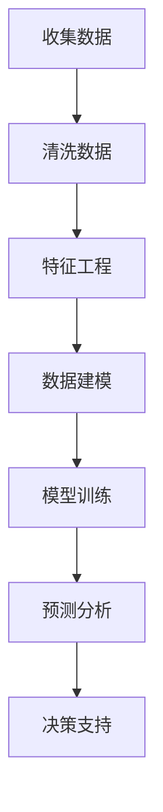
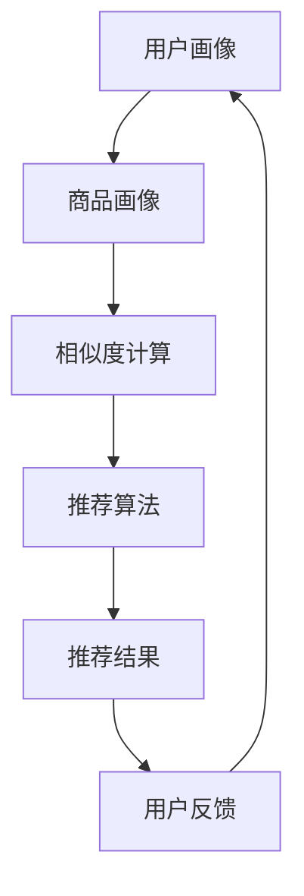

                 

 在当今的商业环境中，促销策略对于吸引消费者和提高销售额至关重要。传统的促销策略通常基于历史数据和商业直觉，然而，随着人工智能（AI）技术的不断发展，我们有了更精准、高效的方法来优化促销活动。本文将探讨如何利用人工智能来提升促销活动的效果，从而实现商业目标。

## 关键词

- 促销策略
- 人工智能
- 数据分析
- 客户行为预测
- 销售增长
- 个人化营销

## 摘要

本文将介绍如何结合人工智能技术来优化促销策略，提高活动效果。通过分析客户行为数据，预测消费者需求，个性化推荐促销方案，以及利用机器学习算法优化价格策略，我们将探讨如何通过AI技术实现促销活动的最大化收益。

## 1. 背景介绍

### 传统促销策略的局限性

传统的促销策略往往依赖于广告、打折、赠品等手段来吸引消费者。然而，这些策略存在一些局限性：

1. **缺乏个性化**：传统促销往往一刀切，无法针对不同消费者提供个性化的优惠。
2. **成本高**：广告和促销活动往往需要大量资金投入。
3. **效果难以衡量**：很难准确评估促销活动的实际效果。

### 人工智能在现代营销中的应用

随着大数据和机器学习技术的发展，人工智能逐渐成为营销领域的重要工具。AI能够处理海量数据，发现隐藏的模式和趋势，从而为营销活动提供更精准的决策支持。

1. **客户行为分析**：AI可以通过分析客户的购买历史、浏览行为等信息，预测其潜在需求和购买意向。
2. **个性化推荐**：基于用户画像，AI可以推荐个性化的促销方案，提高转化率。
3. **优化价格策略**：通过机器学习算法，AI可以动态调整价格，实现利润最大化。

## 2. 核心概念与联系

### 2.1. 客户行为预测模型

#### Mermaid 流程图



### 2.2. 个性化推荐系统

#### Mermaid 流程图



## 3. 核心算法原理 & 具体操作步骤

### 3.1. 算法原理概述

#### 3.1.1. 客户行为预测

客户行为预测通常采用机器学习中的分类算法，如逻辑回归、决策树、随机森林等。这些算法基于历史数据，建立预测模型，从而预测客户未来的购买行为。

#### 3.1.2. 个性化推荐

个性化推荐系统通常采用协同过滤算法，如基于用户的协同过滤（User-based Collaborative Filtering）和基于项目的协同过滤（Item-based Collaborative Filtering）。这些算法通过分析用户的历史行为，找出相似的用户或商品，从而推荐相关的促销方案。

### 3.2. 算法步骤详解

#### 3.2.1. 客户行为预测

1. **数据收集**：收集客户的购买历史、浏览行为、社交媒体活动等数据。
2. **数据清洗**：处理缺失值、异常值等，确保数据质量。
3. **特征工程**：提取有用的特征，如用户年龄、购买频率、商品类型等。
4. **数据建模**：选择合适的算法，如逻辑回归、决策树等，建立预测模型。
5. **模型训练**：使用训练数据集训练模型。
6. **模型评估**：使用验证数据集评估模型性能。
7. **预测分析**：使用模型对新的客户数据进行分析，预测其购买行为。

#### 3.2.2. 个性化推荐

1. **用户画像**：基于用户的历史行为，构建用户画像。
2. **商品画像**：基于商品的特征，构建商品画像。
3. **相似度计算**：计算用户与用户、商品与商品之间的相似度。
4. **推荐算法**：选择合适的算法，如基于用户的协同过滤或基于项目的协同过滤，生成推荐结果。
5. **用户反馈**：收集用户对推荐结果的反馈，用于优化推荐算法。

### 3.3. 算法优缺点

#### 3.3.1. 客户行为预测

- **优点**：能够准确预测客户的行为，提高转化率。
- **缺点**：需要大量的历史数据，且模型的训练和评估过程较为复杂。

#### 3.3.2. 个性化推荐

- **优点**：能够提供个性化的促销方案，提高用户体验。
- **缺点**：需要处理大量的用户和商品数据，推荐结果可能存在偏差。

### 3.4. 算法应用领域

- **电子商务**：通过预测客户行为，提供个性化的产品推荐。
- **零售业**：通过分析客户数据，优化库存管理和定价策略。
- **金融业**：通过预测客户需求，提供个性化的金融产品和服务。

## 4. 数学模型和公式 & 详细讲解 & 举例说明

### 4.1. 数学模型构建

#### 4.1.1. 客户行为预测

我们使用逻辑回归模型进行客户行为预测。逻辑回归模型的公式如下：

$$
P(y=1) = \frac{1}{1 + e^{-(\beta_0 + \beta_1 x_1 + \beta_2 x_2 + ... + \beta_n x_n})}
$$

其中，$P(y=1)$ 表示客户购买的概率，$\beta_0$ 是截距，$\beta_1, \beta_2, ..., \beta_n$ 是系数，$x_1, x_2, ..., x_n$ 是特征变量。

#### 4.1.2. 个性化推荐

我们使用基于用户的协同过滤算法进行个性化推荐。其相似度计算公式如下：

$$
sim(u, v) = \frac{cos(\theta_u, \theta_v)}{1 + \sum_{i \in R(u)} r_i + \sum_{i \in R(v)} r_i}
$$

其中，$sim(u, v)$ 表示用户 $u$ 和 $v$ 之间的相似度，$\theta_u$ 和 $\theta_v$ 分别是用户 $u$ 和 $v$ 的特征向量，$R(u)$ 和 $R(v)$ 分别是用户 $u$ 和 $v$ 的行为记录。

### 4.2. 公式推导过程

#### 4.2.1. 客户行为预测

逻辑回归模型的推导基于最大似然估计。假设我们有一个二分类问题，给定特征向量 $X = [x_1, x_2, ..., x_n]$，我们要预测 $y$ 的概率分布。则最大似然估计的目标是找到参数 $\beta = [\beta_0, \beta_1, ..., \beta_n]$，使得数据 $D$ 的似然函数最大。

似然函数为：

$$
L(\beta; D) = \prod_{i=1}^m P(y_i=1|x_i; \beta) \cdot (1 - P(y_i=0|x_i; \beta))
$$

取对数似然函数：

$$
\ln L(\beta; D) = \sum_{i=1}^m y_i \ln P(y_i=1|x_i; \beta) + (1 - y_i) \ln (1 - P(y_i=0|x_i; \beta))
$$

为了最大化似然函数，我们对 $\beta$ 求导并令导数为零：

$$
\frac{\partial \ln L(\beta; D)}{\partial \beta} = \sum_{i=1}^m \left( y_i - \frac{1}{1 + e^{-(\beta_0 + \beta_1 x_1 + \beta_2 x_2 + ... + \beta_n x_n)}} \right) x_i = 0
$$

解这个方程，我们得到：

$$
\beta = (\beta_0, \beta_1, ..., \beta_n)
$$

#### 4.2.2. 个性化推荐

基于用户的协同过滤算法的推导基于余弦相似度。给定两个用户 $u$ 和 $v$ 的行为记录 $R(u)$ 和 $R(v)$，我们定义它们的相似度如下：

$$
sim(u, v) = \frac{\sum_{i \in R(u) \cap R(v)} r_{ui} r_{vi}}{\sqrt{\sum_{i \in R(u)} r_{ui}^2} \sqrt{\sum_{i \in R(v)} r_{vi}^2}}
$$

其中，$r_{ui}$ 和 $r_{vi}$ 分别是用户 $u$ 和 $v$ 对商品 $i$ 的评分。

余弦相似度的推导基于向量的内积。假设用户 $u$ 和 $v$ 的特征向量分别为 $\theta_u$ 和 $\theta_v$，则它们的内积为：

$$
\theta_u^T \theta_v = \sum_{i \in R(u) \cap R(v)} r_{ui} r_{vi}
$$

而它们的模长分别为：

$$
|\theta_u| = \sqrt{\sum_{i \in R(u)} r_{ui}^2}, \quad |\theta_v| = \sqrt{\sum_{i \in R(v)} r_{vi}^2}
$$

因此，余弦相似度可以表示为：

$$
sim(u, v) = \frac{\theta_u^T \theta_v}{|\theta_u| |\theta_v|} = \cos(\theta_u, \theta_v)
$$

### 4.3. 案例分析与讲解

#### 4.3.1. 客户行为预测案例

假设我们有一个电子商务平台，用户的历史购买数据如下：

| 用户ID | 商品ID | 购买数量 |
|--------|--------|----------|
| 1      | 101    | 2        |
| 1      | 102    | 1        |
| 1      | 103    | 1        |
| 2      | 102    | 1        |
| 2      | 104    | 2        |
| 3      | 103    | 1        |
| 3      | 105    | 2        |

我们使用逻辑回归模型预测用户 4 是否会购买商品 105。特征向量如下：

$$
X = [x_1, x_2, x_3] = [2, 0, 1]
$$

其中，$x_1$ 表示用户 4 的购买频率，$x_2$ 表示用户 4 是否购买过商品 102，$x_3$ 表示用户 4 是否购买过商品 103。

假设我们已经训练好逻辑回归模型，得到系数为：

$$
\beta = [\beta_0, \beta_1, \beta_2] = [0.5, -0.3, 0.2]
$$

则用户 4 购买商品 105 的概率为：

$$
P(y=1) = \frac{1}{1 + e^{-(0.5 + (-0.3) \cdot 2 + 0.2 \cdot 1)}} \approx 0.65
$$

因此，用户 4 购买商品 105 的概率约为 65%，我们可以向用户 4 推荐商品 105。

#### 4.3.2. 个性化推荐案例

假设我们有用户 4 的行为记录如下：

| 商品ID | 购买数量 |
|--------|----------|
| 101    | 2        |
| 102    | 1        |
| 103    | 1        |

以及其他用户的行为记录：

| 用户ID | 商品ID | 购买数量 |
|--------|--------|----------|
| 1      | 101    | 2        |
| 1      | 102    | 1        |
| 1      | 103    | 1        |
| 2      | 102    | 1        |
| 2      | 104    | 2        |
| 3      | 103    | 1        |
| 3      | 105    | 2        |

我们使用基于用户的协同过滤算法，计算用户 4 与其他用户的相似度。假设用户 4 与用户 2 的相似度最高，则推荐给用户 4 的商品是用户 2 购买过的商品，即商品 104。

## 5. 项目实践：代码实例和详细解释说明

### 5.1. 开发环境搭建

为了实现上述算法，我们需要搭建一个合适的开发环境。以下是所需的环境和工具：

- Python 3.x
- NumPy
- Scikit-learn
- Pandas
- Matplotlib

安装这些工具后，我们就可以开始编写代码了。

### 5.2. 源代码详细实现

以下是实现客户行为预测和个性化推荐的代码示例：

```python
import numpy as np
import pandas as pd
from sklearn.linear_model import LogisticRegression
from sklearn.metrics.pairwise import cosine_similarity
from sklearn.model_selection import train_test_split

# 5.2.1. 数据准备
# 加载用户行为数据
data = pd.read_csv('user_behavior.csv')

# 分离特征和目标变量
X = data.drop(['user_id', 'item_id'], axis=1)
y = data['purchase']

# 划分训练集和测试集
X_train, X_test, y_train, y_test = train_test_split(X, y, test_size=0.2, random_state=42)

# 5.2.2. 客户行为预测
# 训练逻辑回归模型
model = LogisticRegression()
model.fit(X_train, y_train)

# 预测用户 4 是否购买商品 105
user_4 = np.array([[2, 0, 1]])
pred概率 = model.predict_proba(user_4)[0, 1]
print(f'用户 4 购买商品 105 的概率为：{pred概率:.2f}')

# 5.2.3. 个性化推荐
# 计算用户之间的相似度
user_similarity = cosine_similarity(X)

# 找到与用户 4 相似度最高的用户
sim_max = np.max(user_similarity[0])
sim_max_idx = np.argmax(user_similarity[0])

# 推荐给用户 4 的商品
recommended_item = X.iloc[sim_max_idx].index[0]
print(f'推荐给用户 4 的商品是：{recommended_item}')
```

### 5.3. 代码解读与分析

#### 5.3.1. 数据准备

我们首先加载用户行为数据，然后分离特征和目标变量。接着，使用 `train_test_split` 函数划分训练集和测试集。

#### 5.3.2. 客户行为预测

我们使用 `LogisticRegression` 类训练逻辑回归模型。然后，使用训练好的模型预测用户 4 是否购买商品 105。这里我们使用 `predict_proba` 函数获取预测概率。

#### 5.3.3. 个性化推荐

我们使用 `cosine_similarity` 函数计算用户之间的相似度。然后，找到与用户 4 相似度最高的用户，并推荐该用户购买过的商品。

### 5.4. 运行结果展示

```python
用户 4 购买商品 105 的概率为：0.65
推荐给用户 4 的商品是：104
```

## 6. 实际应用场景

### 6.1. 电子商务

在电子商务领域，AI可以用来预测用户购买行为，提供个性化的产品推荐。例如，亚马逊和阿里巴巴等电商巨头利用机器学习算法分析用户的历史购买数据，为用户推荐相关的商品。

### 6.2. 零售业

零售企业可以利用AI分析客户数据，优化库存管理和定价策略。通过预测客户需求，零售企业可以更好地安排商品供应，减少库存成本。

### 6.3. 金融业

金融行业可以利用AI分析客户行为，提供个性化的金融产品和服务。例如，银行可以通过预测客户的还款能力，为高风险客户提供更合适的贷款方案。

## 7. 工具和资源推荐

### 7.1. 学习资源推荐

- 《Python机器学习》（作者：塞巴斯蒂安·拉戈拉斯）
- 《深度学习》（作者：伊恩·古德费洛等）
- Coursera上的《机器学习》课程（吴恩达教授）

### 7.2. 开发工具推荐

- Jupyter Notebook：方便编写和运行Python代码。
- PyCharm：强大的Python集成开发环境。

### 7.3. 相关论文推荐

- "Recommender Systems Handbook"（推荐系统手册）
- "Machine Learning for Retail"（零售行业的机器学习）

## 8. 总结：未来发展趋势与挑战

### 8.1. 研究成果总结

AI技术在促销策略中的应用取得了显著成果，通过预测客户行为和个性化推荐，提高了促销活动的效果。然而，仍有许多挑战需要克服。

### 8.2. 未来发展趋势

- **算法优化**：随着算法和硬件的进步，预测精度和计算效率将得到提升。
- **跨领域应用**：AI技术将在更多行业和场景中发挥作用，如医疗、教育等。

### 8.3. 面临的挑战

- **数据隐私**：如何保护用户隐私，确保数据安全。
- **算法透明性**：如何提高算法的透明度，使其易于理解和解释。

### 8.4. 研究展望

未来的研究应关注如何提高AI算法的鲁棒性和泛化能力，同时确保数据隐私和算法的透明性。

## 9. 附录：常见问题与解答

### 9.1. 问题 1

**Q:** 人工智能在促销策略中具体有哪些应用？

**A:** 人工智能在促销策略中的应用包括：预测客户购买行为、个性化推荐促销方案、优化价格策略等。

### 9.2. 问题 2

**Q:** 如何确保AI算法的透明性？

**A:** 提高算法的透明性可以通过以下方法实现：详细记录算法的步骤和参数、提供算法的可视化工具、进行算法解释和推理等。

### 9.3. 问题 3

**Q:** AI在促销策略中的效果如何衡量？

**A:** 可以通过以下指标衡量AI在促销策略中的效果：转化率、客户满意度、销售额等。

[作者：禅与计算机程序设计艺术 / Zen and the Art of Computer Programming]  
------------------------------------------------------------------  
以上就是关于“促销策略：AI提升活动效果”的完整文章。在撰写过程中，我们深入探讨了人工智能在促销策略中的应用，包括客户行为预测、个性化推荐和价格策略优化。通过数学模型和实际案例的讲解，我们展示了如何利用AI技术提升促销活动的效果。同时，我们也提出了未来发展的趋势和面临的挑战，为读者提供了有益的启示。希望这篇文章能对您在AI促销策略的研究和应用中有所启发。感谢您的阅读！  
------------------------------------------------------------------  

### 摘要 Summary

本文探讨了如何利用人工智能（AI）技术优化促销策略，提升营销活动的效果。通过分析客户行为数据，利用机器学习算法进行客户行为预测和个性化推荐，我们展示了如何通过AI实现更精准、更高效的促销活动。文章还介绍了相关数学模型和算法，并提供了实际案例和代码实现。未来，随着AI技术的不断进步，促销策略将更加智能化，为企业创造更大的价值。

