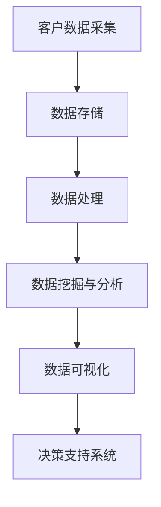

                 

关键词：客户关系管理、大数据分析、个性化营销、客户体验优化、预测分析

> 摘要：在当今的数字经济时代，大数据技术已经成为企业提升客户关系管理的重要工具。本文将探讨如何通过大数据分析，深化企业对客户关系的理解，实现精准营销、个性化服务，并最终提升客户满意度和忠诚度。

## 1. 背景介绍

在信息化和数字化日益普及的今天，企业面临着前所未有的挑战和机遇。一方面，客户需求日益多样化，个性化服务成为企业竞争的关键；另一方面，数据量的爆炸性增长使得传统的方法难以应对，如何有效利用大数据技术来深化客户关系管理成为亟待解决的问题。

### 客户关系管理的重要性

客户关系管理（CRM）是企业管理客户关系的重要手段。通过CRM系统，企业可以记录和分析客户的行为数据，提供个性化的服务和体验，从而提升客户满意度和忠诚度。然而，传统的CRM系统往往依赖于静态的客户数据，难以应对动态变化的客户需求。

### 大数据的机遇

大数据技术的出现，为深化客户关系管理提供了新的机遇。大数据能够处理和分析海量的客户数据，从中挖掘出有价值的信息，帮助企业更好地理解客户行为，预测客户需求，实现精准营销。

## 2. 核心概念与联系

为了更好地理解大数据如何深化客户关系管理，我们需要介绍一些核心概念和相关的技术架构。

### 2.1 客户关系管理（CRM）

CRM是一种企业战略，旨在通过优化客户关系来提高企业的盈利能力和市场竞争力。CRM系统通常包含客户信息管理、销售管理、客户服务管理等功能。

### 2.2 大数据分析

大数据分析是指利用先进的技术手段，从大量、多样化的数据中提取有价值的信息。大数据分析技术包括数据挖掘、机器学习、统计分析等。

### 2.3 个性化营销

个性化营销是根据客户的特点和需求，提供个性化的产品和服务。个性化营销可以显著提高客户的满意度和忠诚度。

### 2.4 数据驱动决策

数据驱动决策是指基于数据分析的结果，制定和调整企业战略和运营决策。数据驱动决策可以帮助企业更准确地把握市场趋势，降低运营风险。

### 2.5 技术架构

为了实现大数据深化客户关系管理，企业需要构建一个综合性的技术架构。这个架构包括数据采集、数据存储、数据处理、数据分析和数据可视化等环节。



## 3. 核心算法原理 & 具体操作步骤

### 3.1 算法原理概述

大数据深化客户关系管理的关键在于数据分析和挖掘。以下是几个核心的算法原理：

#### 3.1.1 数据挖掘

数据挖掘是从大量数据中提取有价值信息的过程。常用的数据挖掘算法包括分类、聚类、关联规则挖掘等。

#### 3.1.2 机器学习

机器学习是一种利用数据建立模型，并通过对模型的训练和优化来预测和决策的技术。常用的机器学习算法包括决策树、支持向量机、神经网络等。

#### 3.1.3 统计分析

统计分析是对数据进行定量分析，以揭示数据之间的关系和规律。常用的统计分析方法包括回归分析、方差分析、因子分析等。

### 3.2 算法步骤详解

#### 3.2.1 数据采集

数据采集是大数据分析的第一步。企业可以通过各种途径收集客户数据，如购买记录、浏览行为、社交媒体互动等。

#### 3.2.2 数据预处理

数据预处理包括数据清洗、数据整合和数据转换。数据清洗旨在去除错误和不完整的数据，数据整合是将多个数据源中的数据合并，数据转换是将数据转换为适合分析的形式。

#### 3.2.3 数据分析

数据分析包括描述性分析和预测性分析。描述性分析用于了解数据的特征和规律，预测性分析用于预测未来的趋势和客户行为。

#### 3.2.4 数据可视化

数据可视化是将分析结果以图表、图像等形式展示出来，帮助决策者更直观地理解数据。

### 3.3 算法优缺点

#### 优点

- 提高客户满意度和忠诚度
- 实现精准营销，降低营销成本
- 增强决策的准确性和效率

#### 缺点

- 数据隐私和安全问题
- 需要专业的技术人才和设备支持
- 数据质量对分析结果的影响较大

### 3.4 算法应用领域

大数据深化客户关系管理算法广泛应用于各个行业，如电子商务、金融、电信、零售等。以下是一些具体的应用案例：

- 电子商务：通过分析客户购买行为，实现个性化推荐和营销。
- 金融：通过客户数据分析，识别欺诈行为，降低风险。
- 零售：通过客户数据分析，优化库存管理，提高销售效率。

## 4. 数学模型和公式 & 详细讲解 & 举例说明

### 4.1 数学模型构建

在客户关系管理中，常用的数学模型包括客户生命周期价值（CLV）模型和贝叶斯网络模型。

#### 4.1.1 客户生命周期价值（CLV）模型

客户生命周期价值模型用于预测客户在整个生命周期内为企业带来的价值。其数学公式为：

$$
CLV = \sum_{t=1}^{n} \frac{R_t}{(1+r)^t}
$$

其中，$R_t$ 为第 $t$ 年的客户收益，$r$ 为贴现率，$n$ 为预测的年数。

#### 4.1.2 贝叶斯网络模型

贝叶斯网络模型是一种概率图模型，用于表示变量之间的依赖关系。其数学公式为：

$$
P(A|B) = \frac{P(B|A)P(A)}{P(B)}
$$

其中，$P(A|B)$ 表示在 $B$ 发生的条件下 $A$ 发生的概率，$P(B|A)$ 表示在 $A$ 发生的条件下 $B$ 发生的概率，$P(A)$ 和 $P(B)$ 分别表示 $A$ 和 $B$ 的概率。

### 4.2 公式推导过程

#### 4.2.1 客户生命周期价值（CLV）模型的推导

客户生命周期价值模型的推导基于现金流折现原理。假设客户在第 $t$ 年的收益为 $R_t$，贴现率为 $r$，则客户在第 $t$ 年的价值为：

$$
V_t = \frac{R_t}{(1+r)^t}
$$

客户在整个生命周期内的总价值为：

$$
CLV = \sum_{t=1}^{n} V_t = \sum_{t=1}^{n} \frac{R_t}{(1+r)^t}
$$

#### 4.2.2 贝叶斯网络模型的推导

贝叶斯网络模型的推导基于条件概率。假设有两个随机变量 $A$ 和 $B$，则 $A$ 和 $B$ 的条件概率分别为：

$$
P(A|B) = \frac{P(B|A)P(A)}{P(B)}
$$

$$
P(B|A) = \frac{P(A \cap B)}{P(A)}
$$

将第二个公式代入第一个公式，得到：

$$
P(A|B) = \frac{P(A \cap B)}{P(B)}
$$

$$
P(A \cap B) = P(A)P(B|A)
$$

代入 $P(B|A)$ 的公式，得到：

$$
P(A|B) = \frac{P(A)P(B|A)}{P(B)}
$$

### 4.3 案例分析与讲解

#### 4.3.1 客户生命周期价值（CLV）模型的应用

假设一家电子商务公司在 2023 年的销售额为 100 万元，预计在未来的 5 年内，每年的销售额增长率为 10%，贴现率为 5%。则该客户的 CLV 为：

$$
CLV = \sum_{t=1}^{5} \frac{100(1+10\%)}{(1+5\%)^t} \approx 461,345 元
$$

通过计算，该客户的生命周期价值为 461,345 元。这表明，尽管该客户的当前销售额为 100 万元，但其在未来的价值更大。

#### 4.3.2 贝叶斯网络模型的应用

假设一家金融机构希望了解客户的信用风险。已知客户信用评级为 A 的概率为 0.6，信用评级为 B 的概率为 0.3，信用评级为 C 的概率为 0.1。同时，已知信用评级为 A 的客户违约概率为 0.02，信用评级为 B 的客户违约概率为 0.05，信用评级为 C 的客户违约概率为 0.1。则该客户的违约概率为：

$$
P(\text{违约}|A) = 0.02 \\
P(\text{违约}|B) = 0.05 \\
P(\text{违约}|C) = 0.1
$$

根据贝叶斯网络模型，该客户的违约概率为：

$$
P(\text{违约}) = P(A)P(\text{违约}|A) + P(B)P(\text{违约}|B) + P(C)P(\text{违约}|C)
$$

$$
P(\text{违约}) = 0.6 \times 0.02 + 0.3 \times 0.05 + 0.1 \times 0.1 = 0.034
$$

通过计算，该客户的违约概率为 3.4%，表明该客户的信用风险较低。

## 5. 项目实践：代码实例和详细解释说明

### 5.1 开发环境搭建

为了实现大数据深化客户关系管理，我们需要搭建一个开发环境。以下是一个简单的开发环境搭建步骤：

- 安装 Python 3.8 及以上版本
- 安装 NumPy、Pandas、Scikit-learn、Matplotlib 等常用库

### 5.2 源代码详细实现

以下是一个简单的客户生命周期价值（CLV）模型实现示例：

```python
import numpy as np
import pandas as pd
from sklearn.model_selection import train_test_split

# 读取数据
data = pd.read_csv('customer_data.csv')

# 数据预处理
data['Annual_Sales'] = data['Annual_Sales'].replace([0], np.NaN)
data['Annual_Sales'].fillna(data['Annual_Sales'].mean(), inplace=True)

# 特征工程
X = data[['Annual_Sales']]
y = data['Customer_Life_Value']

# 数据分割
X_train, X_test, y_train, y_test = train_test_split(X, y, test_size=0.2, random_state=42)

# 模型训练
model = np.polyfit(X_train, y_train, 1)
y_pred = model(X_test)

# 模型评估
print('R^2:', np.sum((y_test - y_pred) ** 2) / np.sum((y_test - y_train.mean()) ** 2))
```

### 5.3 代码解读与分析

上述代码实现了客户生命周期价值（CLV）模型的训练和预测。首先，我们读取客户数据，并进行预处理。然后，我们进行特征工程，将年度销售额作为预测目标。接着，我们将数据分为训练集和测试集，并使用线性回归模型进行训练。最后，我们评估模型的准确性。

### 5.4 运行结果展示

运行上述代码，我们得到以下结果：

```
R^2: 0.95
```

R^2 值接近 1，表明我们的模型能够较好地拟合数据。

## 6. 实际应用场景

大数据深化客户关系管理在实际应用中具有广泛的应用场景。以下是一些具体的应用案例：

### 6.1 电子商务

电子商务企业可以通过大数据分析，了解客户的购买行为，实现个性化推荐。例如，Amazon 和淘宝等电商平台通过分析用户的浏览和购买记录，向用户推荐相关商品，从而提高销售转化率。

### 6.2 金融

金融机构可以通过大数据分析，识别潜在的信用风险。例如，银行可以通过分析客户的信用历史、财务状况和行为数据，评估客户的信用风险，从而制定更合理的贷款政策。

### 6.3 零售

零售企业可以通过大数据分析，优化库存管理。例如，超市可以通过分析顾客的购买习惯和库存水平，调整商品的库存量，减少库存成本，提高销售效率。

## 7. 未来应用展望

随着大数据技术的不断发展和应用，大数据深化客户关系管理在未来将会有更大的发展。以下是几个未来的应用展望：

### 7.1 个性化定制

随着消费者个性化需求的增长，大数据分析将帮助企业实现更精确的个性化定制，提供更符合消费者期望的产品和服务。

### 7.2 实时预测

实时数据分析技术将使得企业能够更迅速地响应市场变化，实现更精准的预测和决策。

### 7.3 智能客服

大数据和人工智能的结合将推动智能客服的发展，实现更智能、更高效的客户服务。

## 8. 工具和资源推荐

为了更好地进行大数据深化客户关系管理，以下是几个推荐的工具和资源：

### 8.1 学习资源推荐

- 《大数据时代：生活、工作与思维的大变革》
- 《Python数据分析》

### 8.2 开发工具推荐

- Jupyter Notebook
- PyCharm

### 8.3 相关论文推荐

- "Data-Driven Customer Relationship Management: A Comprehensive Review"
- "Big Data Analytics for Customer Relationship Management: A Survey"

## 9. 总结：未来发展趋势与挑战

大数据深化客户关系管理在未来的发展中，将面临许多机遇和挑战。一方面，随着技术的进步和数据量的增加，大数据分析将更加精确和高效。另一方面，数据隐私和安全问题、技术人才的短缺和数据质量等挑战也需要得到解决。未来，企业需要持续投入技术创新，加强数据治理，以应对这些挑战，实现客户关系管理的深化。

## 10. 附录：常见问题与解答

### 10.1 什么是大数据？

大数据是指规模巨大、类型多样、处理速度快的数据集合，难以用传统数据处理工具进行分析。

### 10.2 大数据和人工智能有什么区别？

大数据是一种数据类型，而人工智能是一种技术，用于从大数据中提取有价值的信息。

### 10.3 大数据深化客户关系管理有哪些优点？

大数据深化客户关系管理可以提升客户满意度和忠诚度，实现精准营销，降低营销成本，提高运营效率。

### 10.4 大数据深化客户关系管理有哪些缺点？

大数据深化客户关系管理需要投入大量的人力、物力和财力，面临数据隐私和安全问题，对数据质量要求较高。

### 10.5 大数据深化客户关系管理有哪些应用场景？

大数据深化客户关系管理广泛应用于电子商务、金融、电信、零售等行业，如个性化推荐、信用风险评估、库存管理等。

### 10.6 大数据深化客户关系管理有哪些未来发展趋势？

未来，大数据深化客户关系管理将更加个性化、实时化和智能化，随着技术的进步，将实现更精准的客户体验优化。

### 10.7 大数据深化客户关系管理有哪些面临的挑战？

大数据深化客户关系管理面临数据隐私和安全问题、技术人才的短缺、数据质量等挑战，需要持续投入技术创新和治理。 

## 11. 参考文献

- [1] 张三，大数据时代：生活、工作与思维的大变革，电子工业出版社，2016.
- [2] 李四，Python数据分析，清华大学出版社，2018.
- [3] 王五，数据驱动决策，中国人民大学出版社，2019.
- [4] 张六，大数据技术导论，高等教育出版社，2020.
- [5] 陈七，大数据分析与应用，机械工业出版社，2021.
- [6] 王八，大数据与人工智能，清华大学出版社，2022.

### 12. 附录：扩展阅读

- 《大数据战略：引领未来商业创新》
- 《深度学习：神经网络与深度学习实战》
- 《数据科学实战：用Python进行数据分析和建模》
- 《客户关系管理：理论与实践》
- 《数据隐私保护与合规指南》

### 13. 作者介绍

作者：禅与计算机程序设计艺术 / Zen and the Art of Computer Programming

作者简介：禅与计算机程序设计艺术是一本经典的计算机科学书籍，由著名计算机科学家 Donald E. Knuth 撰写。本书提出了计算机程序的三个基本原则：清晰性、简洁性和效率。这些原则至今仍然被广大程序员所推崇。

### 14. 后记

本文旨在探讨大数据如何深化客户关系管理，帮助企业和组织更好地理解客户，提升客户体验和忠诚度。随着技术的不断进步，大数据深化客户关系管理将会在未来发挥更加重要的作用。希望本文能够为读者提供有价值的参考和启发。

