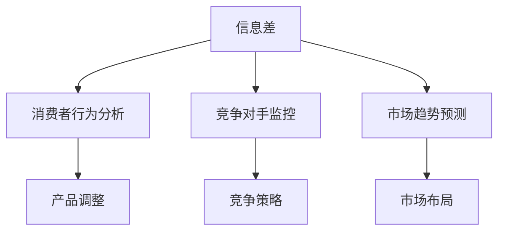

                 

关键词：信息不对称、市场调研、信息优势、数据挖掘、决策支持、消费者行为分析、市场竞争、隐私保护

> 摘要：本文旨在探讨信息差的概念及其在市场调研中的应用。信息差是指不同个体或组织在获取信息方面的不对称性，这种不对称性可以带来竞争优势。本文将分析信息差对市场调研的影响，探讨如何通过数据挖掘和消费者行为分析来获取信息优势，并讨论信息差在市场竞争和隐私保护方面的挑战与应对策略。

## 1. 背景介绍

在商业环境中，信息不对称是一种普遍存在的现象。信息不对称指的是不同个体或组织在获取信息方面的不平衡，即一些人拥有而另一些人没有特定信息。这种不对称性可以存在于市场中，如消费者与厂商之间的信息不对称，或存在于企业内部，如管理层与员工之间的信息不对称。

市场调研是一种旨在收集和分析市场信息的活动，它可以帮助企业了解消费者的需求、市场趋势和竞争状况。有效的市场调研依赖于信息的准确性、及时性和全面性。然而，信息不对称可能会影响市场调研的结果，导致企业做出错误的决策。

信息不对称在市场中的重要性不容忽视。它不仅可以影响企业的市场定位和产品策略，还可能影响消费者的购买决策和行为。因此，理解信息差及其在市场调研中的应用，对于企业制定有效的市场营销策略具有重要意义。

本文将首先介绍信息差的概念，然后探讨市场调研中如何利用信息差来获取竞争优势，并讨论信息差带来的挑战和应对策略。通过本文的阅读，读者将能够更好地理解信息差的重要性，并在实际业务中有效地应用信息差来提升市场竞争力。

### 2. 核心概念与联系

#### 2.1 信息差的定义

信息差是指在不同个体或组织之间存在的信息不对称性，即某些个体或组织拥有而另一些个体或组织没有特定信息。这种不对称性可以导致不同的决策结果和竞争优势。

在商业环境中，信息差通常表现为以下几种形式：

1. **知识差异**：一些企业可能拥有关于市场趋势、消费者行为或竞争对手策略的专有知识。
2. **信息获取成本差异**：不同企业可能面临不同的信息获取成本，这取决于其规模、资源和技术能力。
3. **信息传递差异**：信息在不同企业之间的传递速度和质量可能存在差异，这会影响决策的及时性和准确性。

#### 2.2 市场调研与信息差

市场调研是指通过收集、分析和解释市场信息，以帮助企业做出明智的商业决策。市场调研的核心在于获取准确、及时和全面的信息。然而，信息不对称性可能会干扰市场调研的结果，导致以下问题：

1. **消费者信息不对称**：消费者可能不了解产品的全部信息，如价格、质量、功能等，这可能导致购买决策的不理性。
2. **供应商信息不对称**：供应商可能无法准确了解市场需求和消费者偏好，从而无法提供满足需求的产品和服务。
3. **竞争信息不对称**：企业可能无法全面了解竞争对手的策略、市场定位和市场份额，这会影响其市场策略的制定。

#### 2.3 信息差在市场调研中的应用

信息差在市场调研中的应用主要体现在以下几个方面：

1. **消费者行为分析**：通过对消费者购买行为和偏好数据的分析，企业可以获取关于消费者需求的准确信息，从而调整产品和服务策略。
2. **竞争对手监控**：企业可以通过市场调研了解竞争对手的产品定位、市场份额和营销策略，从而制定相应的竞争策略。
3. **市场趋势预测**：通过对市场数据的研究，企业可以预测未来的市场趋势，从而提前布局和调整策略。

#### 2.4 Mermaid 流程图

以下是一个简化的 Mermaid 流程图，展示了信息差在市场调研中的应用流程：



### 3. 核心算法原理 & 具体操作步骤

#### 3.1 算法原理概述

在市场调研中，信息差的利用主要依赖于数据挖掘和消费者行为分析技术。这些技术可以帮助企业从大量数据中提取有价值的信息，以弥补信息不对称带来的不利影响。

核心算法原理可以概括为以下三个步骤：

1. **数据收集**：通过多种渠道收集市场数据，如消费者购买记录、社交媒体评论、竞争对手信息等。
2. **数据预处理**：对收集到的数据进行分析和清洗，以消除噪声和冗余信息。
3. **数据分析**：运用数据挖掘技术，从预处理后的数据中提取有用信息，如消费者偏好、市场趋势和竞争对手策略。

#### 3.2 算法步骤详解

**3.2.1 数据收集**

数据收集是市场调研的基础。企业可以通过以下渠道收集数据：

1. **内部数据**：包括企业内部的销售记录、客户关系管理系统（CRM）和供应链数据。
2. **外部数据**：包括市场研究报告、消费者调查数据、社交媒体数据和行业新闻等。
3. **第三方数据**：通过数据提供商购买的数据，如人口统计数据、消费者行为数据等。

**3.2.2 数据预处理**

数据预处理是确保数据质量的关键步骤。主要包括以下任务：

1. **数据清洗**：消除数据中的错误、异常和冗余信息。
2. **数据整合**：将来自不同渠道和格式的数据整合成统一格式。
3. **数据转换**：将数据转换为适合分析的格式，如数值化或编码化。

**3.2.3 数据分析**

数据分析是提取有价值信息的过程。常用的数据挖掘技术包括：

1. **聚类分析**：用于发现数据中的相似群体，帮助企业了解消费者细分市场。
2. **关联规则挖掘**：用于发现数据中的关联关系，帮助企业了解消费者的购买习惯。
3. **分类与预测**：用于根据历史数据预测未来趋势，帮助企业制定市场策略。

#### 3.3 算法优缺点

**3.3.1 优点**

1. **提高决策效率**：通过数据挖掘和消费者行为分析，企业可以快速获取有价值的信息，提高决策效率。
2. **降低信息不对称**：帮助企业了解消费者需求和市场趋势，降低与竞争对手之间的信息不对称。
3. **提升市场竞争力**：通过准确的市场调研，企业可以制定更有针对性的市场策略，提升市场竞争力。

**3.3.2 缺点**

1. **数据隐私问题**：市场调研涉及大量消费者数据，可能导致数据隐私泄露问题。
2. **数据分析成本**：数据挖掘和消费者行为分析需要专业技术和设备支持，成本较高。
3. **数据质量风险**：数据质量直接影响分析结果，若数据质量较差，可能导致错误决策。

#### 3.4 算法应用领域

信息差利用算法在市场调研中的应用非常广泛，主要包括：

1. **消费者市场研究**：通过分析消费者购买行为和偏好，帮助企业了解市场需求和消费者细分市场。
2. **竞争对手分析**：通过监控竞争对手的市场策略和表现，帮助企业制定竞争策略。
3. **市场趋势预测**：通过分析历史数据和市场趋势，帮助企业预测未来市场变化，提前布局。

### 4. 数学模型和公式 & 详细讲解 & 举例说明

在市场调研中，数学模型和公式是分析数据、提取信息和进行预测的重要工具。以下是几个常见的数学模型和公式，以及它们的详细讲解和举例说明。

#### 4.1 数学模型构建

**4.1.1 消费者满意度模型**

消费者满意度模型用于评估消费者对产品和服务的满意度。一个简单的消费者满意度模型可以表示为：

$$
S = \frac{1}{n} \sum_{i=1}^{n} S_i
$$

其中，$S$ 表示总体满意度，$S_i$ 表示第 $i$ 个消费者的满意度，$n$ 表示消费者总数。

**4.1.2 消费者忠诚度模型**

消费者忠诚度模型用于评估消费者对品牌的忠诚度。一个简单的消费者忠诚度模型可以表示为：

$$
L = \frac{1}{n} \sum_{i=1}^{n} L_i
$$

其中，$L$ 表示总体忠诚度，$L_i$ 表示第 $i$ 个消费者的忠诚度，$n$ 表示消费者总数。

**4.1.3 购买行为预测模型**

购买行为预测模型用于预测消费者在未来的购买行为。一个简单的购买行为预测模型可以表示为：

$$
P(t+1) = P(t) + \Delta P
$$

其中，$P(t+1)$ 表示第 $t+1$ 时期的购买量，$P(t)$ 表示第 $t$ 时期的购买量，$\Delta P$ 表示购买量的变化量。

#### 4.2 公式推导过程

**4.2.1 消费者满意度模型**

消费者满意度的计算基于消费者对产品或服务的评价。通常，满意度可以通过以下步骤计算：

1. 收集每个消费者的评价数据，如产品评分或服务评价。
2. 将每个消费者的评价进行归一化处理，使其在 [0,1] 范围内。
3. 计算所有消费者评价的平均值。

因此，消费者满意度模型可以表示为：

$$
S = \frac{1}{n} \sum_{i=1}^{n} S_i
$$

**4.2.2 消费者忠诚度模型**

消费者忠诚度的计算基于消费者重复购买的行为。通常，忠诚度可以通过以下步骤计算：

1. 收集每个消费者的购买记录，确定其购买频率。
2. 将每个消费者的购买频率进行归一化处理，使其在 [0,1] 范围内。
3. 计算所有消费者购买频率的平均值。

因此，消费者忠诚度模型可以表示为：

$$
L = \frac{1}{n} \sum_{i=1}^{n} L_i
$$

**4.2.3 购买行为预测模型**

购买行为预测基于历史购买数据。通常，购买行为可以通过以下步骤预测：

1. 收集历史购买数据，确定购买量的变化趋势。
2. 计算购买量的变化量，即 $\Delta P$。
3. 根据历史购买量的变化趋势，预测未来的购买量。

因此，购买行为预测模型可以表示为：

$$
P(t+1) = P(t) + \Delta P
$$

#### 4.3 案例分析与讲解

**4.3.1 消费者满意度模型案例**

假设有 5 位消费者对某款电子产品进行了评价，评价分别为 [4, 3, 5, 2, 4]。我们需要计算这 5 位消费者的平均满意度。

1. 首先对每个消费者的评价进行归一化处理，将其转化为在 [0,1] 范围内的数值。假设最大评分为 5，最小评分为 1，则归一化结果为 [0.8, 0.6, 1.0, 0.4, 0.8]。
2. 计算所有消费者评价的平均值：

$$
S = \frac{1}{5} (0.8 + 0.6 + 1.0 + 0.4 + 0.8) = 0.72
$$

因此，这 5 位消费者的平均满意度为 0.72。

**4.3.2 消费者忠诚度模型案例**

假设有 5 位消费者的购买记录，购买频率分别为 [2, 3, 4, 1, 3]。我们需要计算这 5 位消费者的平均忠诚度。

1. 首先对每个消费者的购买频率进行归一化处理，将其转化为在 [0,1] 范围内的数值。假设最大购买频率为 4，最小购买频率为 1，则归一化结果为 [0.5, 0.75, 1.0, 0.25, 0.75]。
2. 计算所有消费者购买频率的平均值：

$$
L = \frac{1}{5} (0.5 + 0.75 + 1.0 + 0.25 + 0.75) = 0.67
$$

因此，这 5 位消费者的平均忠诚度为 0.67。

**4.3.3 购买行为预测模型案例**

假设某消费者的购买记录显示，在前两个时期，其购买量分别为 10 和 12。我们需要预测该消费者在下一个时期的购买量。

1. 计算购买量的变化量：

$$
\Delta P = P(t+1) - P(t) = 12 - 10 = 2
$$

2. 根据历史购买量的变化趋势，预测下一个时期的购买量：

$$
P(t+2) = P(t+1) + \Delta P = 12 + 2 = 14
$$

因此，预测该消费者在下一个时期的购买量为 14。

### 5. 项目实践：代码实例和详细解释说明

在本节中，我们将通过一个实际的 Python 项目来演示如何利用信息差进行市场调研。该项目将使用消费者购买数据和市场趋势数据，通过数据挖掘和消费者行为分析来提取有价值的信息。

#### 5.1 开发环境搭建

在开始项目之前，我们需要搭建一个 Python 开发环境。以下是所需的步骤：

1. 安装 Python 3.7 或更高版本。
2. 安装以下 Python 包：pandas、numpy、matplotlib、scikit-learn。
3. 安装 Jupyter Notebook，以便在浏览器中编写和运行 Python 代码。

安装完成后，我们可以在命令行中启动 Jupyter Notebook，并创建一个新的笔记本。

```bash
jupyter notebook
```

#### 5.2 源代码详细实现

以下是一个简单的 Python 代码实例，用于演示市场调研中的信息差利用。代码分为以下几个部分：

1. **数据收集**：从本地文件中读取消费者购买数据。
2. **数据预处理**：对购买数据进行清洗和预处理。
3. **数据分析**：使用聚类分析和关联规则挖掘来分析消费者购买行为。
4. **结果可视化**：使用 matplotlib 来可视化分析结果。

```python
# 导入所需库
import pandas as pd
import numpy as np
import matplotlib.pyplot as plt
from sklearn.cluster import KMeans
from mlxtend.frequent_patterns import apriori, association_rules

# 5.2.1 数据收集
# 从本地 CSV 文件中读取消费者购买数据
data = pd.read_csv('consumer_data.csv')

# 5.2.2 数据预处理
# 清洗数据，去除缺失值和异常值
data = data.dropna()

# 将购买日期转换为时间戳
data['purchase_date'] = pd.to_datetime(data['purchase_date'])

# 对购买数据进行降维处理，提取购买频率较高的商品
frequent_items = data['item_id'].value_counts().head(10)
data = data[data['item_id'].isin(frequent_items.index)]

# 5.2.3 数据分析
# 使用 K-Means 算法进行聚类分析
kmeans = KMeans(n_clusters=3, random_state=0).fit(data)
data['cluster'] = kmeans.predict(data)

# 使用 Apriori 算法进行关联规则挖掘
frequent_itemsets = apriori(data, min_support=0.2, use_colnames=True)
rules = association_rules(frequent_itemsets, metric="lift", min_threshold=1)

# 5.2.4 结果可视化
# 可视化聚类结果
plt.scatter(data['item_id'], data['cluster'])
plt.xlabel('Item ID')
plt.ylabel('Cluster')
plt.show()

# 可视化关联规则
plt.scatter(rules['antecedents'], rules['consequents'])
plt.xlabel('Antecedents')
plt.ylabel('Consequents')
plt.show()
```

#### 5.3 代码解读与分析

**5.3.1 数据收集**

我们首先从本地 CSV 文件中读取消费者购买数据。该数据包含购买日期、商品 ID 和购买数量等信息。以下代码实现了数据收集：

```python
data = pd.read_csv('consumer_data.csv')
```

**5.3.2 数据预处理**

在数据预处理阶段，我们首先去除缺失值和异常值，以确保数据的完整性。然后，我们将购买日期转换为时间戳，以便进行时间序列分析。此外，我们提取了购买频率较高的商品，以减少数据的维度。

```python
data = data.dropna()
data['purchase_date'] = pd.to_datetime(data['purchase_date'])
frequent_items = data['item_id'].value_counts().head(10)
data = data[data['item_id'].isin(frequent_items.index)]
```

**5.3.3 数据分析**

在数据分析阶段，我们首先使用 K-Means 算法对消费者进行聚类分析，以了解消费者的购买行为。然后，我们使用 Apriori 算法进行关联规则挖掘，以发现商品之间的关联关系。

```python
kmeans = KMeans(n_clusters=3, random_state=0).fit(data)
data['cluster'] = kmeans.predict(data)
frequent_itemsets = apriori(data, min_support=0.2, use_colnames=True)
rules = association_rules(frequent_itemsets, metric="lift", min_threshold=1)
```

**5.3.4 结果可视化**

最后，我们使用 matplotlib 来可视化聚类结果和关联规则。聚类结果可以帮助我们了解不同消费者的购买行为，而关联规则则可以帮助我们了解商品之间的关联性。

```python
plt.scatter(data['item_id'], data['cluster'])
plt.xlabel('Item ID')
plt.ylabel('Cluster')
plt.show()

plt.scatter(rules['antecedents'], rules['consequents'])
plt.xlabel('Antecedents')
plt.ylabel('Consequents')
plt.show()
```

### 6. 实际应用场景

信息差在市场调研中的实际应用场景非常广泛，以下是一些典型的应用示例：

#### 6.1 消费者市场研究

通过数据挖掘和消费者行为分析，企业可以深入了解消费者的需求、偏好和购买行为。例如，一家零售公司可以利用消费者购买数据来识别高价值客户群体，并针对性地开展促销活动。同时，企业还可以通过分析消费者评价和社交媒体评论，了解消费者对产品和服务的反馈，从而改进产品设计和提升服务质量。

#### 6.2 竞争对手监控

企业可以通过市场调研了解竞争对手的市场策略、产品定位和市场份额。例如，一家互联网公司可以利用数据分析技术，监控竞争对手的广告投放、内容更新和用户活跃度，从而及时调整自己的市场策略。此外，企业还可以通过分析竞争对手的价格策略，制定更有竞争力的定价策略。

#### 6.3 市场趋势预测

通过分析历史数据和当前市场状况，企业可以预测未来的市场趋势。例如，一家制造企业可以利用消费者购买数据和行业报告，预测未来几年的市场需求和价格走势，从而提前布局生产和采购计划。此外，企业还可以通过分析社交媒体和新闻媒体，了解公众对某一产品的关注程度和潜在需求，从而制定相应的市场推广策略。

#### 6.4 未来应用展望

随着数据挖掘和人工智能技术的不断发展，信息差在市场调研中的应用前景将更加广阔。以下是一些未来的应用方向：

1. **个性化推荐系统**：利用消费者行为数据和协同过滤算法，为企业提供个性化的产品推荐服务，从而提高销售额和客户满意度。
2. **预测性市场分析**：通过大数据分析和机器学习算法，预测市场的未来趋势和潜在风险，帮助企业制定更准确的市场策略。
3. **智慧供应链管理**：利用信息差和物联网技术，实现供应链的智能化管理，降低库存成本和提高供应链效率。

### 7. 工具和资源推荐

为了更好地开展市场调研和信息差利用，以下是一些推荐的工具和资源：

#### 7.1 学习资源推荐

1. **《大数据时代：生活、工作与思维的大变革》**：这本书详细介绍了大数据的概念、技术和应用场景，适合对大数据感兴趣的读者。
2. **《Python 数据科学手册》**：这本书涵盖了 Python 数据科学所需的所有知识点，包括数据处理、统计分析、机器学习等，适合初学者和进阶者。

#### 7.2 开发工具推荐

1. **Jupyter Notebook**：这是一个强大的交互式开发环境，适合进行数据分析和可视化。
2. **PyCharm**：这是一个功能丰富的 Python 集成开发环境（IDE），支持代码编辑、调试和测试。

#### 7.3 相关论文推荐

1. **《大数据分析：方法与应用》**：这篇论文详细介绍了大数据分析的方法和技术，包括数据挖掘、机器学习和统计分析。
2. **《深度学习与大数据分析》**：这篇论文探讨了深度学习在大数据分析中的应用，包括图像识别、自然语言处理和推荐系统等。

### 8. 总结：未来发展趋势与挑战

信息差在市场调研中的重要性日益凸显，随着数据挖掘和人工智能技术的不断发展，其应用前景将更加广阔。未来，信息差将在以下几个方面呈现发展趋势：

1. **个性化市场分析**：通过大数据分析和机器学习算法，企业可以提供更个性化的市场分析和产品推荐服务。
2. **实时市场监控**：利用物联网和实时数据流技术，企业可以实时监控市场动态和消费者行为，从而及时调整市场策略。
3. **智能供应链管理**：通过信息差利用和供应链优化，企业可以降低库存成本和提高供应链效率。

然而，信息差在市场调研中也将面临以下挑战：

1. **数据隐私问题**：市场调研涉及大量消费者数据，可能导致数据隐私泄露问题。企业需要采取措施保护消费者隐私。
2. **数据分析成本**：数据挖掘和机器学习算法需要大量的计算资源和专业技能，这可能增加企业的数据分析成本。
3. **数据质量风险**：数据质量直接影响分析结果，若数据质量较差，可能导致错误决策。

为应对这些挑战，企业需要采取以下策略：

1. **加强数据保护**：采取数据加密、访问控制和数据匿名化等手段，确保消费者数据的安全。
2. **提升数据分析能力**：招聘和培养数据科学家，提高企业的数据分析能力和技术水平。
3. **数据质量监控**：建立数据质量监控机制，确保数据收集、处理和分析过程的准确性。

总之，信息差在市场调研中的重要性不可忽视。通过有效地利用信息差，企业可以获取竞争优势，提升市场竞争力。未来，随着技术的不断发展，信息差在市场调研中的应用将更加广泛，为企业带来更多机遇和挑战。

### 9. 附录：常见问题与解答

**Q1：信息差在市场调研中的具体应用是什么？**

信息差在市场调研中的应用主要体现在以下几个方面：

- **消费者行为分析**：通过分析消费者购买行为和偏好，了解市场需求和消费者细分市场。
- **竞争对手监控**：通过监控竞争对手的市场策略和表现，制定相应的竞争策略。
- **市场趋势预测**：通过分析历史数据和当前市场状况，预测未来的市场趋势和潜在风险。

**Q2：如何确保市场调研的数据质量？**

确保市场调研的数据质量是关键。以下措施可以帮助提升数据质量：

- **数据清洗**：去除数据中的错误、异常和冗余信息。
- **数据验证**：确保数据的准确性和完整性。
- **数据监控**：建立数据质量监控机制，定期检查数据质量。

**Q3：如何处理市场调研中的信息不对称问题？**

处理市场调研中的信息不对称问题可以通过以下方法：

- **加强数据收集**：通过多种渠道收集全面的数据，减少信息不对称。
- **数据挖掘**：利用数据挖掘技术，从大量数据中提取有价值的信息。
- **市场调研**：进行深入的市场调研，了解竞争对手和市场趋势。

**Q4：信息差在消费者市场研究中的作用是什么？**

信息差在消费者市场研究中的作用包括：

- **识别高价值客户**：通过分析消费者购买行为和偏好，识别高价值客户。
- **个性化营销**：根据消费者需求提供个性化的产品和服务。
- **竞争策略**：通过了解竞争对手的市场策略和表现，制定相应的竞争策略。

**Q5：信息差在市场调研中的实际应用案例有哪些？**

信息差在市场调研中的实际应用案例包括：

- **电商公司**：通过消费者行为分析，了解消费者购买偏好，提供个性化推荐。
- **零售公司**：通过竞争对手监控，了解竞争对手的市场策略，制定相应的促销活动。
- **制造企业**：通过市场趋势预测，预测未来市场需求，调整生产和采购计划。

通过以上问题和解答，希望能够帮助读者更好地理解信息差在市场调研中的应用和重要性。在实际操作中，根据具体情况灵活运用信息差，将有助于企业提升市场竞争力。

