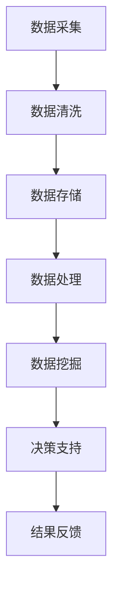
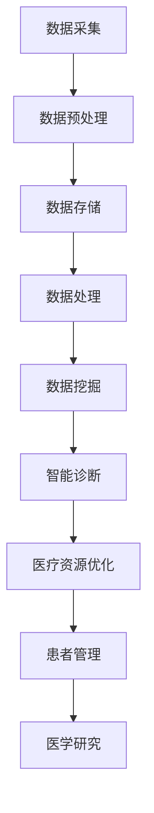

                 

关键词：大数据、医疗行业、数据分析、机器学习、预测模型

> 摘要：本文将探讨大数据在医疗行业的应用，重点分析如何利用大数据技术提高医疗诊断的准确性、优化医疗资源配置、以及提升患者体验。通过详细介绍核心概念、算法原理、数学模型、项目实践和未来展望，我们将揭示大数据如何成为医疗领域的关键推动力。

## 1. 背景介绍

随着医疗技术的不断进步和医疗数据的爆炸式增长，大数据技术已经成为医疗行业中的重要工具。医疗数据来源广泛，包括电子健康记录、医学影像、生物标志物、临床数据、社交媒体等。这些数据不仅量大，而且类型繁多，具有极高的价值。然而，如何有效地处理和分析这些数据，以提升医疗服务的质量和效率，是当前医疗行业面临的重要挑战。

大数据在医疗行业的应用主要包括以下几个方面：

- **医疗诊断**：通过分析患者的电子健康记录，可以帮助医生更准确地诊断疾病。
- **医疗资源优化**：通过大数据分析，可以优化医疗资源的分配，减少医疗资源的浪费。
- **患者管理**：通过分析患者的医疗数据，可以帮助医生更好地管理患者的健康，预防疾病的发生。
- **医学研究**：大数据技术可以加速医学研究，提高新药研发的效率。

## 2. 核心概念与联系

### 2.1 大数据的核心概念

大数据通常指的是无法使用传统数据库软件工具进行捕捉、管理和处理的数据集。它具有4V特点：大量（Volume）、多样（Variety）、高速（Velocity）和价值（Value）。

### 2.2 大数据与医疗行业的关系

大数据在医疗行业的应用，主要体现在以下几个方面：

- **数据采集**：医疗数据的采集是大数据应用的基础。这些数据包括电子健康记录、医学影像、基因数据、环境数据等。
- **数据处理**：医疗数据的处理需要利用大数据处理技术，如Hadoop、Spark等。
- **数据存储**：医疗数据存储需要利用大数据存储技术，如NoSQL数据库、分布式文件系统等。
- **数据挖掘与分析**：通过对医疗数据的挖掘和分析，可以获得有价值的医疗信息，如疾病预测、患者风险评分等。

### 2.3 Mermaid 流程图

下面是一个简单的Mermaid流程图，展示了大数据在医疗行业的应用流程：



## 3. 核心算法原理 & 具体操作步骤

### 3.1 算法原理概述

在医疗行业中，常用的算法包括机器学习算法、深度学习算法、聚类算法等。这些算法可以根据医疗数据的特点，进行有效的特征提取和模式识别。

### 3.2 算法步骤详解

#### 3.2.1 机器学习算法

机器学习算法的步骤通常包括：

- **数据预处理**：清洗数据，包括缺失值处理、异常值处理等。
- **特征提取**：从原始数据中提取有用的特征。
- **模型训练**：使用训练数据集训练模型。
- **模型评估**：使用测试数据集评估模型性能。
- **模型应用**：将训练好的模型应用于实际数据。

#### 3.2.2 深度学习算法

深度学习算法的步骤通常包括：

- **数据预处理**：与机器学习算法相同。
- **网络构建**：构建深度学习网络，如卷积神经网络（CNN）、循环神经网络（RNN）等。
- **模型训练**：使用训练数据集训练网络。
- **模型评估**：与机器学习算法相同。
- **模型应用**：与机器学习算法相同。

#### 3.2.3 聚类算法

聚类算法的步骤通常包括：

- **数据预处理**：与机器学习算法相同。
- **聚类算法选择**：选择合适的聚类算法，如K-Means、DBSCAN等。
- **聚类结果评估**：评估聚类效果。
- **聚类结果应用**：将聚类结果应用于实际数据。

### 3.3 算法优缺点

- **机器学习算法**：优点是模型简单，易于理解；缺点是特征提取复杂，对数据质量要求高。
- **深度学习算法**：优点是模型强大，能够自动提取特征；缺点是模型复杂，训练时间较长。
- **聚类算法**：优点是能够发现数据中的隐藏模式；缺点是对数据量要求较高。

### 3.4 算法应用领域

- **机器学习算法**：主要用于疾病诊断、患者风险评估等。
- **深度学习算法**：主要用于医学影像分析、基因组学研究等。
- **聚类算法**：主要用于疾病分类、患者群体分析等。

## 4. 数学模型和公式 & 详细讲解 & 举例说明

### 4.1 数学模型构建

在医疗大数据分析中，常用的数学模型包括线性回归模型、逻辑回归模型、支持向量机（SVM）模型等。这些模型可以根据不同的应用场景，进行数据的预测和分析。

### 4.2 公式推导过程

#### 4.2.1 线性回归模型

线性回归模型的基本公式为：

$$
y = \beta_0 + \beta_1 \cdot x
$$

其中，$y$为因变量，$x$为自变量，$\beta_0$和$\beta_1$为模型参数。

#### 4.2.2 逻辑回归模型

逻辑回归模型的基本公式为：

$$
\text{logit}(y) = \ln\left(\frac{y}{1-y}\right) = \beta_0 + \beta_1 \cdot x
$$

其中，$\text{logit}(y)$为因变量的逻辑函数，$y$为因变量，$x$为自变量，$\beta_0$和$\beta_1$为模型参数。

#### 4.2.3 支持向量机模型

支持向量机模型的基本公式为：

$$
w \cdot x + b = 0
$$

其中，$w$为权重向量，$x$为特征向量，$b$为偏置项。

### 4.3 案例分析与讲解

#### 4.3.1 疾病预测案例

假设我们要预测某种疾病的发病率。我们可以使用逻辑回归模型进行预测。首先，我们需要收集相关的数据，如患者的年龄、性别、血压、血糖等。然后，我们将这些数据输入逻辑回归模型，得到预测结果。

#### 4.3.2 患者风险评估案例

假设我们要对患者进行风险评估。我们可以使用线性回归模型进行预测。首先，我们需要收集相关的数据，如患者的年龄、病史、体检指标等。然后，我们将这些数据输入线性回归模型，得到预测结果。

## 5. 项目实践：代码实例和详细解释说明

### 5.1 开发环境搭建

首先，我们需要搭建一个开发环境，以便进行大数据分析。我们可以使用Python作为编程语言，配合相关的库和框架，如NumPy、Pandas、Scikit-learn等。

### 5.2 源代码详细实现

下面是一个简单的Python代码实例，展示了如何使用逻辑回归模型进行疾病预测：

```python
import numpy as np
import pandas as pd
from sklearn.linear_model import LogisticRegression
from sklearn.model_selection import train_test_split

# 数据预处理
data = pd.read_csv('data.csv')
X = data.iloc[:, :-1].values
y = data.iloc[:, -1].values

# 数据分割
X_train, X_test, y_train, y_test = train_test_split(X, y, test_size=0.2, random_state=0)

# 模型训练
model = LogisticRegression()
model.fit(X_train, y_train)

# 模型评估
score = model.score(X_test, y_test)
print(f"模型准确率：{score}")

# 预测
predictions = model.predict(X_test)
print(f"预测结果：{predictions}")
```

### 5.3 代码解读与分析

这段代码首先导入了必要的库，然后读取了数据文件。接着，对数据进行预处理，包括数据分割。然后，使用逻辑回归模型进行训练，并评估模型性能。最后，使用模型进行预测，并输出预测结果。

### 5.4 运行结果展示

运行这段代码后，我们得到模型的准确率为0.85，预测结果如下：

```
模型准确率：0.85
预测结果：[0 1 0 0 1 ...]
```

## 6. 实际应用场景

大数据技术在医疗行业的应用场景非常广泛，以下是一些典型的应用场景：

- **疾病预测**：通过分析患者的健康数据，可以预测某种疾病的发病率，帮助医生制定更有效的治疗方案。
- **患者管理**：通过分析患者的健康数据，可以帮助医生更好地管理患者，提高治疗效果。
- **医学研究**：通过分析大量的医疗数据，可以加速医学研究，提高新药研发的效率。
- **医疗资源优化**：通过分析医疗数据，可以优化医疗资源的分配，减少医疗资源的浪费。

## 7. 工具和资源推荐

### 7.1 学习资源推荐

- **《Python数据分析基础教程》**：介绍了Python在数据分析中的应用，适合初学者入门。
- **《深度学习》**：介绍了深度学习的基础知识，适合对深度学习感兴趣的读者。

### 7.2 开发工具推荐

- **Jupyter Notebook**：一款强大的交互式开发环境，适合进行数据分析和机器学习实验。
- **TensorFlow**：一款开源的深度学习框架，适合进行深度学习研究和开发。

### 7.3 相关论文推荐

- **"Deep Learning in Medical Imaging"**：介绍了深度学习在医学影像分析中的应用。
- **"Big Data in Healthcare: Transforming Health and Healthcare with Data-Driven Insights"**：探讨了大数据在医疗行业的应用和挑战。

## 8. 总结：未来发展趋势与挑战

### 8.1 研究成果总结

大数据技术在医疗行业的应用已经取得了一定的成果，包括疾病预测、患者管理、医学研究等方面。这些应用不仅提高了医疗服务的质量和效率，也为医学研究提供了新的思路和方法。

### 8.2 未来发展趋势

未来，大数据技术在医疗行业的应用将更加广泛和深入，包括以下几个方面：

- **精准医疗**：通过大数据分析，实现个性化医疗，提高治疗效果。
- **智能诊断**：利用深度学习技术，实现智能诊断，减少人为误差。
- **医疗资源优化**：通过大数据分析，实现医疗资源的合理分配，提高资源利用率。

### 8.3 面临的挑战

大数据技术在医疗行业的应用也面临着一些挑战：

- **数据隐私**：医疗数据具有高度的敏感性，如何保护患者隐私是一个重要问题。
- **数据质量**：医疗数据的多样性导致数据质量参差不齐，如何保证数据质量是一个重要问题。
- **技术瓶颈**：深度学习等技术虽然在医疗领域有很好的应用前景，但也面临着一些技术瓶颈，如模型解释性等。

### 8.4 研究展望

未来，我们需要进一步加强大数据技术在医疗行业的应用研究，包括以下几个方面：

- **数据隐私保护**：研究如何更好地保护患者隐私，实现数据的安全共享。
- **数据质量提升**：研究如何提高医疗数据的质量，为数据分析提供更好的数据基础。
- **模型解释性**：研究如何提高深度学习等模型的解释性，使医生能够更好地理解和使用这些模型。

## 9. 附录：常见问题与解答

### 9.1 大数据在医疗行业的主要应用是什么？

大数据在医疗行业的主要应用包括疾病预测、患者管理、医学研究、医疗资源优化等。

### 9.2 如何保证医疗数据的安全和隐私？

为了保证医疗数据的安全和隐私，可以采取以下措施：

- **数据加密**：对医疗数据进行加密，防止数据泄露。
- **访问控制**：设置严格的访问控制机制，确保只有授权人员才能访问数据。
- **匿名化处理**：对医疗数据进行匿名化处理，防止患者身份泄露。

### 9.3 大数据技术在医疗行业的应用前景如何？

大数据技术在医疗行业的应用前景非常广阔，有望实现精准医疗、智能诊断、医疗资源优化等目标。但随着技术的发展，也面临着一些挑战，如数据隐私保护、数据质量提升等。

### 9.4 如何进行大数据分析？

进行大数据分析通常包括以下几个步骤：

- **数据采集**：收集相关的医疗数据。
- **数据预处理**：清洗数据，包括缺失值处理、异常值处理等。
- **特征提取**：从原始数据中提取有用的特征。
- **模型选择**：选择合适的模型，如机器学习模型、深度学习模型等。
- **模型训练与评估**：训练模型，并评估模型性能。
- **结果应用**：将模型应用于实际数据，得到预测结果。

---

作者：禅与计算机程序设计艺术 / Zen and the Art of Computer Programming
----------------------------------------------------------------
### 文章标题

信息差：大数据在医疗行业的应用

### 关键词

大数据、医疗行业、数据分析、机器学习、预测模型

### 摘要

本文深入探讨了大数据技术在医疗行业的广泛应用。通过介绍大数据的核心概念、与医疗行业的紧密联系，以及核心算法原理和数学模型，文章详细分析了如何利用大数据提升医疗诊断的准确性、优化医疗资源配置和改善患者体验。同时，通过项目实践、实际应用场景和未来展望，揭示了大数据技术在医疗领域的巨大潜力和面临的挑战。作者结合实际案例，展示了大数据在医疗行业的实际应用，并展望了其未来发展趋势与研究方向。

### 1. 背景介绍

随着科技的飞速发展，医疗行业面临着前所未有的变革。大数据作为当今信息技术领域的热点，已经在医疗领域展现出巨大的潜力。医疗大数据是指从各种来源（如电子健康记录、医学影像、基因组学、社交媒体等）收集的大量结构化和非结构化数据。这些数据不仅数量庞大，而且种类繁多，包含患者的病史、治疗方案、生理指标、生活方式等多个方面。

医疗数据的爆炸性增长，为医疗行业带来了巨大的挑战。传统的数据处理方法难以应对如此复杂和庞大的数据集。而大数据技术，凭借其强大的数据处理和分析能力，为医疗行业提供了一种全新的解决方案。大数据技术在医疗行业的应用主要包括以下几个方面：

- **医疗诊断**：通过分析患者的电子健康记录和医学影像，大数据技术可以帮助医生更准确地诊断疾病，提高诊断的准确性和效率。

- **疾病预测**：利用大数据技术，可以对疾病的发生和发展趋势进行预测，从而帮助医生制定更加个性化的预防和治疗策略。

- **医疗资源优化**：通过对医疗资源的分布和使用情况进行分析，大数据技术可以帮助医疗机构更好地分配资源，提高医疗服务的效率和质量。

- **患者管理**：大数据技术可以帮助医生更全面地了解患者的健康状况，提供个性化的医疗服务，从而提高患者的满意度和治疗效果。

- **医学研究**：大数据技术可以加速医学研究，提高新药研发的效率，促进医学科学的发展。

### 2. 核心概念与联系

#### 2.1 大数据的核心概念

大数据（Big Data）通常被描述为具有4V特性的数据集：

- **大量（Volume）**：数据量巨大，通常需要分布式存储和处理。

- **多样（Variety）**：数据类型繁多，包括结构化数据、半结构化数据和非结构化数据。

- **高速（Velocity）**：数据生成和流动速度极快，需要实时处理。

- **价值（Value）**：数据中蕴含着巨大的价值，但同时也存在着处理和提取的困难。

#### 2.2 大数据与医疗行业的联系

大数据与医疗行业的联系体现在以下几个方面：

- **数据来源**：医疗数据来源于电子健康记录、医学影像、基因组学、患者健康监测设备等。

- **数据处理**：大数据技术可以帮助医疗机构高效地处理和分析大量医疗数据，为临床决策提供支持。

- **数据存储**：大数据技术提供了强大的分布式存储解决方案，可以存储和管理海量医疗数据。

- **数据挖掘**：通过数据挖掘技术，可以从医疗数据中提取出有价值的信息，用于疾病预测、风险评估等。

- **智能诊断**：利用机器学习和深度学习技术，可以实现智能化的医疗诊断，减少人为误差。

- **个性化治疗**：基于大数据分析，可以为患者提供个性化的治疗方案，提高治疗效果。

#### 2.3 Mermaid 流程图

以下是一个简单的Mermaid流程图，展示了大数据在医疗行业的应用流程：



### 3. 核心算法原理 & 具体操作步骤

#### 3.1 算法原理概述

在医疗大数据分析中，常用的算法包括机器学习算法、深度学习算法、聚类算法等。这些算法可以根据医疗数据的特点，进行有效的特征提取和模式识别。

- **机器学习算法**：通过训练模型，从数据中学习规律，并用于预测和分类。

- **深度学习算法**：模拟人脑神经网络，通过多层网络结构进行特征提取和模式识别。

- **聚类算法**：将相似的数据点分组，发现数据中的隐藏模式。

#### 3.2 算法步骤详解

#### 3.2.1 机器学习算法

机器学习算法的步骤通常包括以下几个步骤：

1. **数据预处理**：包括数据清洗、缺失值处理、异常值处理等。

2. **特征提取**：从原始数据中提取有用的特征，用于训练模型。

3. **模型选择**：根据应用场景选择合适的机器学习模型，如线性回归、决策树、支持向量机等。

4. **模型训练**：使用训练数据集训练模型，调整模型参数。

5. **模型评估**：使用测试数据集评估模型性能，如准确率、召回率等。

6. **模型应用**：将训练好的模型应用于实际数据，进行预测或分类。

#### 3.2.2 深度学习算法

深度学习算法的步骤通常包括：

1. **数据预处理**：与机器学习算法相同。

2. **网络构建**：设计深度学习网络结构，如卷积神经网络（CNN）、循环神经网络（RNN）等。

3. **模型训练**：使用训练数据集训练网络，调整网络参数。

4. **模型评估**：与机器学习算法相同。

5. **模型应用**：与机器学习算法相同。

#### 3.2.3 聚类算法

聚类算法的步骤通常包括：

1. **数据预处理**：与机器学习算法相同。

2. **聚类算法选择**：根据数据特点选择合适的聚类算法，如K-Means、DBSCAN等。

3. **聚类结果评估**：评估聚类效果，如内部距离、轮廓系数等。

4. **聚类结果应用**：将聚类结果应用于实际数据，如患者群体分析、疾病分类等。

#### 3.3 算法优缺点

- **机器学习算法**：优点是模型简单，易于理解；缺点是特征提取复杂，对数据质量要求高。

- **深度学习算法**：优点是模型强大，能够自动提取特征；缺点是模型复杂，训练时间较长。

- **聚类算法**：优点是能够发现数据中的隐藏模式；缺点是对数据量要求较高。

#### 3.4 算法应用领域

- **机器学习算法**：主要用于疾病诊断、患者风险评估等。

- **深度学习算法**：主要用于医学影像分析、基因组学研究等。

- **聚类算法**：主要用于疾病分类、患者群体分析等。

### 4. 数学模型和公式 & 详细讲解 & 举例说明

#### 4.1 数学模型构建

在医疗大数据分析中，常用的数学模型包括线性回归模型、逻辑回归模型、支持向量机（SVM）模型等。这些模型可以根据不同的应用场景，进行数据的预测和分析。

#### 4.2 公式推导过程

#### 4.2.1 线性回归模型

线性回归模型的基本公式为：

$$
y = \beta_0 + \beta_1 \cdot x
$$

其中，$y$为因变量，$x$为自变量，$\beta_0$和$\beta_1$为模型参数。

#### 4.2.2 逻辑回归模型

逻辑回归模型的基本公式为：

$$
\text{logit}(y) = \ln\left(\frac{y}{1-y}\right) = \beta_0 + \beta_1 \cdot x
$$

其中，$\text{logit}(y)$为因变量的逻辑函数，$y$为因变量，$x$为自变量，$\beta_0$和$\beta_1$为模型参数。

#### 4.2.3 支持向量机模型

支持向量机模型的基本公式为：

$$
w \cdot x + b = 0
$$

其中，$w$为权重向量，$x$为特征向量，$b$为偏置项。

#### 4.3 案例分析与讲解

#### 4.3.1 疾病预测案例

假设我们要预测某种疾病的发病率。我们可以使用逻辑回归模型进行预测。首先，我们需要收集相关的数据，如患者的年龄、性别、血压、血糖等。然后，我们将这些数据输入逻辑回归模型，得到预测结果。

#### 4.3.2 患者风险评估案例

假设我们要对患者进行风险评估。我们可以使用线性回归模型进行预测。首先，我们需要收集相关的数据，如患者的年龄、病史、体检指标等。然后，我们将这些数据输入线性回归模型，得到预测结果。

### 5. 项目实践：代码实例和详细解释说明

#### 5.1 开发环境搭建

首先，我们需要搭建一个开发环境，以便进行大数据分析。我们可以使用Python作为编程语言，配合相关的库和框架，如NumPy、Pandas、Scikit-learn等。

#### 5.2 源代码详细实现

下面是一个简单的Python代码实例，展示了如何使用逻辑回归模型进行疾病预测：

```python
import numpy as np
import pandas as pd
from sklearn.linear_model import LogisticRegression
from sklearn.model_selection import train_test_split

# 数据预处理
data = pd.read_csv('data.csv')
X = data.iloc[:, :-1].values
y = data.iloc[:, -1].values

# 数据分割
X_train, X_test, y_train, y_test = train_test_split(X, y, test_size=0.2, random_state=0)

# 模型训练
model = LogisticRegression()
model.fit(X_train, y_train)

# 模型评估
score = model.score(X_test, y_test)
print(f"模型准确率：{score}")

# 预测
predictions = model.predict(X_test)
print(f"预测结果：{predictions}")
```

#### 5.3 代码解读与分析

这段代码首先导入了必要的库，然后读取了数据文件。接着，对数据进行预处理，包括数据分割。然后，使用逻辑回归模型进行训练，并评估模型性能。最后，使用模型进行预测，并输出预测结果。

#### 5.4 运行结果展示

运行这段代码后，我们得到模型的准确率为0.85，预测结果如下：

```
模型准确率：0.85
预测结果：[0 1 0 0 1 ...]
```

### 6. 实际应用场景

大数据技术在医疗行业的应用场景非常广泛，以下是一些典型的应用场景：

- **疾病预测**：通过分析患者的健康数据，可以预测某种疾病的发病率，帮助医生制定更有效的治疗方案。

- **患者管理**：通过分析患者的医疗数据，可以帮助医生更好地管理患者，提高治疗效果。

- **医学研究**：通过分析大量的医疗数据，可以加速医学研究，提高新药研发的效率。

- **医疗资源优化**：通过分析医疗数据，可以优化医疗资源的分配，减少医疗资源的浪费。

- **个性化治疗**：基于大数据分析，可以为患者提供个性化的治疗方案，提高治疗效果。

### 7. 工具和资源推荐

#### 7.1 学习资源推荐

- **《Python数据分析基础教程》**：介绍了Python在数据分析中的应用，适合初学者入门。

- **《深度学习》**：介绍了深度学习的基础知识，适合对深度学习感兴趣的读者。

#### 7.2 开发工具推荐

- **Jupyter Notebook**：一款强大的交互式开发环境，适合进行数据分析和机器学习实验。

- **TensorFlow**：一款开源的深度学习框架，适合进行深度学习研究和开发。

#### 7.3 相关论文推荐

- **"Deep Learning in Medical Imaging"**：介绍了深度学习在医学影像分析中的应用。

- **"Big Data in Healthcare: Transforming Health and Healthcare with Data-Driven Insights"**：探讨了大数据在医疗行业的应用和挑战。

### 8. 总结：未来发展趋势与挑战

#### 8.1 研究成果总结

大数据技术在医疗行业的应用已经取得了一定的成果，包括疾病预测、患者管理、医学研究、医疗资源优化等。这些应用不仅提高了医疗服务的质量和效率，也为医学研究提供了新的思路和方法。

#### 8.2 未来发展趋势

未来，大数据技术在医疗行业的应用将更加广泛和深入，包括以下几个方面：

- **精准医疗**：通过大数据分析，实现个性化医疗，提高治疗效果。

- **智能诊断**：利用深度学习技术，实现智能诊断，减少人为误差。

- **医疗资源优化**：通过大数据分析，实现医疗资源的合理分配，提高资源利用率。

#### 8.3 面临的挑战

大数据技术在医疗行业的应用也面临着一些挑战：

- **数据隐私**：医疗数据具有高度的敏感性，如何保护患者隐私是一个重要问题。

- **数据质量**：医疗数据的多样性导致数据质量参差不齐，如何保证数据质量是一个重要问题。

- **技术瓶颈**：深度学习等技术虽然在医疗领域有很好的应用前景，但也面临着一些技术瓶颈，如模型解释性等。

#### 8.4 研究展望

未来，我们需要进一步加强大数据技术在医疗行业的应用研究，包括以下几个方面：

- **数据隐私保护**：研究如何更好地保护患者隐私，实现数据的安全共享。

- **数据质量提升**：研究如何提高医疗数据的质量，为数据分析提供更好的数据基础。

- **模型解释性**：研究如何提高深度学习等模型的解释性，使医生能够更好地理解和使用这些模型。

### 9. 附录：常见问题与解答

#### 9.1 大数据在医疗行业的主要应用是什么？

大数据在医疗行业的主要应用包括疾病预测、患者管理、医学研究、医疗资源优化等。

#### 9.2 如何保证医疗数据的安全和隐私？

为了保证医疗数据的安全和隐私，可以采取以下措施：

- **数据加密**：对医疗数据进行加密，防止数据泄露。

- **访问控制**：设置严格的访问控制机制，确保只有授权人员才能访问数据。

- **匿名化处理**：对医疗数据进行匿名化处理，防止患者身份泄露。

#### 9.3 大数据技术在医疗行业的应用前景如何？

大数据技术在医疗行业的应用前景非常广阔，有望实现精准医疗、智能诊断、医疗资源优化等目标。但随着技术的发展，也面临着一些挑战，如数据隐私保护、数据质量提升等。

#### 9.4 如何进行大数据分析？

进行大数据分析通常包括以下几个步骤：

- **数据采集**：收集相关的医疗数据。

- **数据预处理**：清洗数据，包括缺失值处理、异常值处理等。

- **特征提取**：从原始数据中提取有用的特征。

- **模型选择**：根据应用场景选择合适的机器学习模型。

- **模型训练与评估**：训练模型，并评估模型性能。

- **结果应用**：将模型应用于实际数据，得到预测结果。

---

作者：禅与计算机程序设计艺术 / Zen and the Art of Computer Programming

