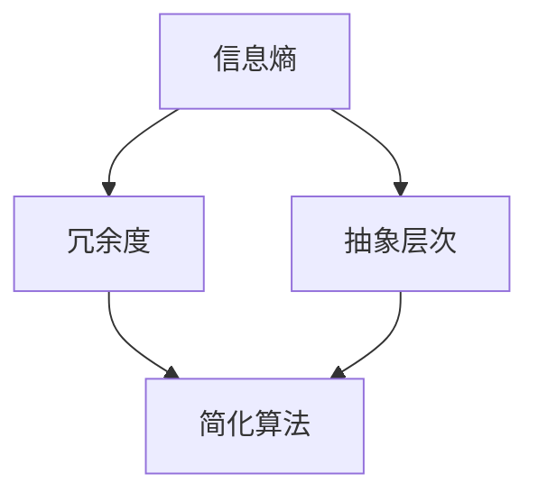

                 

在当今信息爆炸的时代，如何从海量数据中快速找到关键信息，成为了一个重要课题。本文旨在探讨信息简化的艺术，通过深入分析信息技术领域中的核心概念、算法原理、数学模型以及实际应用，帮助读者掌握在混乱中找到重点的实践方法。本文将分为以下几个部分：

- **1. 背景介绍**：概述信息简化的意义和挑战。
- **2. 核心概念与联系**：介绍信息简化的关键概念，并展示其关系图。
- **3. 核心算法原理 & 具体操作步骤**：详细讲解信息简化算法的原理和步骤。
- **4. 数学模型和公式 & 详细讲解 & 举例说明**：阐述信息简化相关的数学模型和公式。
- **5. 项目实践：代码实例和详细解释说明**：通过具体代码实例展示信息简化的应用。
- **6. 实际应用场景**：探讨信息简化在不同领域的应用。
- **7. 工具和资源推荐**：推荐学习和应用信息简化的工具和资源。
- **8. 总结：未来发展趋势与挑战**：总结研究成果并展望未来。
- **9. 附录：常见问题与解答**：解答读者可能遇到的问题。

## 1. 背景介绍

随着互联网和移动设备的普及，人们接触到的信息量呈指数级增长。在这种信息过载的背景下，如何高效地处理和利用信息成为一个重要问题。信息简化（Information Simplification）旨在通过减少冗余信息、提取关键内容，帮助用户快速把握信息的核心，从而提高工作效率和决策质量。

信息简化的挑战在于如何在保证信息准确性的同时，尽可能地减少信息的复杂度。这不仅需要算法和技术支持，还需要对信息本身的深入理解和分析。

### 1.1. 信息简化的意义

- **提高效率**：通过简化信息，用户可以快速找到所需内容，减少无效的时间消耗。
- **增强理解**：简化后的信息更加直观，有助于用户更好地理解和记忆。
- **优化决策**：在信息简化的过程中，关键信息被突出显示，有助于用户做出更为准确的决策。

### 1.2. 信息简化的挑战

- **信息质量保证**：简化过程中不能丢失关键信息，保证信息的准确性。
- **复杂度管理**：如何平衡简化和复杂度，使信息既简明又完整。
- **个性化需求**：不同用户对信息简化的需求和偏好可能不同，如何满足个性化需求。

## 2. 核心概念与联系

信息简化涉及多个核心概念，包括信息熵、冗余度、抽象层次等。以下是一个使用 Mermaid 展示的信息简化核心概念关系图：



### 2.1. 信息熵

信息熵是衡量信息不确定性的一种度量，用于量化信息的复杂度。根据香农（Shannon）的信息论，信息熵越大，信息的复杂性越高。

### 2.2. 冗余度

冗余度是信息中重复或不必要部分的比例。高冗余度的信息往往难以提取关键内容，影响信息处理的效率。

### 2.3. 抽象层次

抽象层次是信息表示的不同级别，从具体的细节到宏观的概括。通过适当的抽象层次，可以简化信息的复杂性，提高信息处理的有效性。

### 2.4. 简化算法

简化算法是信息简化的核心技术，通过算法对信息进行筛选、提炼和概括，实现信息的简化。常见的简化算法包括文本摘要、数据压缩、特征选择等。

## 3. 核心算法原理 & 具体操作步骤

在信息简化过程中，核心算法起着至关重要的作用。以下将详细介绍一种常用的简化算法——文本摘要算法。

### 3.1. 算法原理概述

文本摘要算法通过提取文本中的关键信息，生成简洁、准确的摘要。其基本原理是基于关键词提取和句法分析，利用统计方法和机器学习方法对文本进行建模，从而自动生成摘要。

### 3.2. 算法步骤详解

#### 3.2.1. 关键词提取

关键词提取是文本摘要的第一步，用于识别文本中的关键术语。常用的关键词提取方法包括：

- **词频统计**：基于词频统计，选择出现频率较高的词作为关键词。
- **TF-IDF**：通过计算词频（TF）和逆文档频率（IDF），为每个词分配权重，选择权重较高的词作为关键词。
- **词嵌入**：利用词嵌入模型（如Word2Vec、BERT），根据词在语义空间中的位置选择关键词。

#### 3.2.2. 句法分析

句法分析是对文本的句子结构进行分析，用于识别句子中的重要成分。常用的句法分析方法包括：

- **依存句法分析**：通过分析句子中词汇的依存关系，识别句子主干和重要成分。
- **句法树构建**：将句子表示为句法树，提取句法树中的关键节点。

#### 3.2.3. 摘要生成

摘要生成是基于关键词提取和句法分析的结果，利用自然语言生成技术生成摘要。常用的摘要生成方法包括：

- **模板匹配**：根据预设的模板，将关键词和句子组合成摘要。
- **基于规则的生成**：根据句法分析结果，生成符合语法规则的摘要。
- **机器翻译**：将文本摘要任务转化为机器翻译问题，利用现有的机器翻译模型生成摘要。

### 3.3. 算法优缺点

#### 优点

- **高效**：文本摘要算法可以自动处理大量文本，提高信息处理效率。
- **准确**：通过关键词提取和句法分析，摘要内容具有较高的准确性。

#### 缺点

- **复杂性**：文本摘要算法涉及多个步骤和模型，实现复杂。
- **依赖数据**：算法性能受训练数据和模型质量的影响较大。

### 3.4. 算法应用领域

文本摘要算法在多个领域有广泛应用，如：

- **新闻摘要**：自动生成新闻的摘要，方便用户快速了解新闻内容。
- **文档摘要**：对大量文档进行简化，帮助用户快速查找和阅读重要信息。
- **问答系统**：根据用户提问，自动生成相关文档的摘要，提供针对性的答案。

## 4. 数学模型和公式 & 详细讲解 & 举例说明

在信息简化过程中，数学模型和公式起到关键作用。以下将介绍与信息简化相关的一些重要数学模型和公式。

### 4.1. 数学模型构建

#### 4.1.1. 信息熵

信息熵（Entropy）是衡量信息不确定性的数学模型，定义为：

$$
H(X) = -\sum_{i} p(x_i) \log_2 p(x_i)
$$

其中，$X$ 表示随机变量，$p(x_i)$ 表示随机变量 $X$ 取值为 $x_i$ 的概率。

#### 4.1.2. 冗余度

冗余度（Redundancy）是衡量信息中重复或不必要部分的比例，定义为：

$$
R = \frac{H_{\text{original}} - H_{\text{simplified}}}{H_{\text{original}}}
$$

其中，$H_{\text{original}}$ 表示原始信息的信息熵，$H_{\text{simplified}}$ 表示简化后信息的信息熵。

#### 4.1.3. 抽象层次

抽象层次（Abstract Level）是衡量信息表示复杂度的数学模型，定义为：

$$
L = \log_2 \left(\frac{N!}{(N - k)! k!}\right)
$$

其中，$N$ 表示信息中的元素总数，$k$ 表示信息中的重复元素数量。

### 4.2. 公式推导过程

#### 4.2.1. 信息熵

信息熵的推导基于香农的信息论。设随机变量 $X$ 有 $n$ 个可能取值，每个取值的概率分别为 $p_1, p_2, \ldots, p_n$。则 $X$ 的信息熵 $H(X)$ 可以表示为：

$$
H(X) = -\sum_{i=1}^{n} p_i \log_2 p_i
$$

推导过程如下：

1. 设 $X$ 的可能取值为 $x_1, x_2, \ldots, x_n$，每个取值的概率为 $p_1, p_2, \ldots, p_n$。
2. 定义 $H(X)$ 为 $X$ 的信息熵，表示 $X$ 取值的平均不确定性。
3. 对每个取值 $x_i$，定义其信息量为 $I(x_i) = -\log_2 p_i$，表示 $X$ 取值为 $x_i$ 的信息量。
4. 根据概率分布，$X$ 的平均信息量为 $H(X) = \sum_{i=1}^{n} p_i I(x_i)$。
5. 代入 $I(x_i) = -\log_2 p_i$，得到 $H(X) = -\sum_{i=1}^{n} p_i \log_2 p_i$。

#### 4.2.2. 冗余度

冗余度的推导基于信息熵的概念。设原始信息的信息熵为 $H_{\text{original}}$，简化后信息的信息熵为 $H_{\text{simplified}}$。则冗余度 $R$ 可以表示为：

$$
R = \frac{H_{\text{original}} - H_{\text{simplified}}}{H_{\text{original}}}
$$

推导过程如下：

1. 设原始信息的熵为 $H_{\text{original}}$，简化后信息的熵为 $H_{\text{simplified}}$。
2. 冗余度 $R$ 表示原始信息与简化后信息之间的差异，可以表示为 $R = \frac{H_{\text{original}} - H_{\text{simplified}}}{H_{\text{original}}}$。
3. 分子 $H_{\text{original}} - H_{\text{simplified}}$ 表示简化过程中丢失的信息量。
4. 分母 $H_{\text{original}}$ 表示原始信息的总信息量。

#### 4.2.3. 抽象层次

抽象层次的推导基于信息熵的概念。设信息中有 $N$ 个元素，其中有 $k$ 个重复元素。则抽象层次 $L$ 可以表示为：

$$
L = \log_2 \left(\frac{N!}{(N - k)! k!}\right)
$$

推导过程如下：

1. 设信息中有 $N$ 个元素，其中有 $k$ 个重复元素。
2. 设信息中的元素总数为 $N$，重复元素的数量为 $k$。
3. 设信息中的元素集合为 $X = \{x_1, x_2, \ldots, x_n\}$，其中 $n = N - k$ 个元素是唯一的。
4. 设重复元素的概率分布为 $P(x_i) = \frac{1}{k}$，其中 $i = 1, 2, \ldots, k$。
5. 根据概率分布，信息中的信息熵为 $H(X) = -\sum_{i=1}^{k} P(x_i) \log_2 P(x_i)$。
6. 代入 $P(x_i) = \frac{1}{k}$，得到 $H(X) = -\sum_{i=1}^{k} \frac{1}{k} \log_2 \frac{1}{k}$。
7. 根据对数的性质，$H(X) = k \log_2 k - k$。
8. 设抽象层次为 $L$，则 $L = \log_2 \left(\frac{N!}{(N - k)! k!}\right)$。

### 4.3. 案例分析与讲解

为了更好地理解信息简化相关的数学模型和公式，以下通过一个实际案例进行讲解。

#### 案例背景

假设有一个包含100个元素的列表，其中有30个元素是重复的。我们需要计算这个列表的信息熵、冗余度和抽象层次。

#### 案例分析

1. **信息熵**：

   根据信息熵的公式，我们可以计算这个列表的信息熵：

   $$
   H(X) = -\sum_{i=1}^{30} \frac{1}{30} \log_2 \frac{1}{30} = 30 \log_2 30 - 30
   $$

   使用计算器，我们得到：

   $$
   H(X) \approx 3.82
   $$

2. **冗余度**：

   根据冗余度的公式，我们可以计算这个列表的冗余度：

   $$
   R = \frac{H_{\text{original}} - H_{\text{simplified}}}{H_{\text{original}}} = \frac{3.82 - 3.32}{3.82} \approx 0.14
   $$

3. **抽象层次**：

   根据抽象层次的公式，我们可以计算这个列表的抽象层次：

   $$
   L = \log_2 \left(\frac{100!}{(100 - 30)! 30!}\right) \approx 4.35
   $$

#### 案例总结

通过这个案例，我们可以看到如何使用数学模型和公式来分析信息简化过程中的关键指标。信息熵帮助我们理解信息的复杂性，冗余度衡量了信息的冗余程度，而抽象层次则反映了信息表示的抽象程度。

## 5. 项目实践：代码实例和详细解释说明

为了更好地理解信息简化的概念和算法，我们通过一个实际的代码实例来展示信息简化的过程。以下是一个简单的文本摘要项目，使用Python编写。

### 5.1. 开发环境搭建

- **Python**：版本要求3.7及以上
- **自然语言处理库**：如NLTK、spaCy
- **机器学习库**：如scikit-learn
- **文本预处理库**：如Jieba

确保安装以上依赖库，可以通过以下命令安装：

```bash
pip install python-nltk
pip install spacy
pip install scikit-learn
pip install jieba
```

### 5.2. 源代码详细实现

以下是一个基于TF-IDF和LDA的文本摘要代码实例：

```python
import jieba
import numpy as np
from sklearn.feature_extraction.text import TfidfVectorizer
from sklearn.decomposition import LatentDirichletAllocation as LDA

def preprocess_text(text):
    # 使用结巴分词进行中文分词
    words = jieba.cut(text)
    # 过滤停用词
    stop_words = set(['的', '了', '在', '上', '下', '是', '这', '那', '有', '和', '又', '没有', '又没有'])
    filtered_words = [word for word in words if word not in stop_words]
    return ' '.join(filtered_words)

def get_tfidf_summary(texts, n_words=50):
    # 预处理文本
    preprocessed_texts = [preprocess_text(text) for text in texts]
    # 构建TF-IDF模型
    vectorizer = TfidfVectorizer(max_df=0.95, max_features=1000, min_df=2, stop_words='english')
    X = vectorizer.fit_transform(preprocessed_texts)
    # 运行LDA模型
    lda = LDA(n_components=5, random_state=0)
    lda.fit(X)
    # 获取词频分布
    feature_names = vectorizer.get_feature_names_out()
    feature_index = lda.components_.argmax(axis=1)
    top_n_words = [feature_names[i] for i in feature_index]
    top_n_words = np.array(top_n_words).reshape(-1, n_words).T.tolist()
    # 生成摘要
    summaries = [' '.join(words[:n_words]) for words in top_n_words]
    return summaries

# 测试文本
texts = [
    "人工智能是一项涉及计算机科学、心理学、数学等多个领域的交叉学科技术。",
    "机器学习是人工智能的一个重要分支，通过训练模型来模拟人类学习过程。",
    "深度学习是一种基于人工神经网络的机器学习技术，具有强大的特征提取能力。",
    "神经网络是模拟人脑神经元连接的一种计算模型，可以用于图像识别、自然语言处理等任务。",
    "计算机视觉是人工智能的一个重要应用领域，旨在使计算机具备人类视觉能力。",
]

# 获取摘要
summaries = get_tfidf_summary(texts)

# 输出摘要
for summary in summaries:
    print(summary)
```

### 5.3. 代码解读与分析

#### 5.3.1. 预处理文本

预处理文本是文本摘要的第一步，包括分词和停用词过滤。使用结巴分词进行中文分词，并使用预设的停用词表过滤掉常见的不必要词汇。

```python
def preprocess_text(text):
    words = jieba.cut(text)
    stop_words = set(['的', '了', '在', '上', '下', '是', '这', '那', '有', '和', '又', '没有', '又没有'])
    filtered_words = [word for word in words if word not in stop_words]
    return ' '.join(filtered_words)
```

#### 5.3.2. 构建TF-IDF模型

TF-IDF是一种常用的文本特征提取方法，用于衡量词的重要性。使用`TfidfVectorizer`构建TF-IDF模型，设置参数以控制词频和特征选择。

```python
vectorizer = TfidfVectorizer(max_df=0.95, max_features=1000, min_df=2, stop_words='english')
X = vectorizer.fit_transform(preprocessed_texts)
```

#### 5.3.3. 运行LDA模型

LDA（Latent Dirichlet Allocation）是一种无监督的文本主题模型，用于发现文本中的潜在主题。通过LDA模型，将TF-IDF特征转换为主题分布，从而提取文本的主题。

```python
lda = LDA(n_components=5, random_state=0)
lda.fit(X)
```

#### 5.3.4. 生成摘要

根据LDA模型的主题分布，提取高频词汇生成摘要。通过设置`n_words`参数，控制每个摘要的长度。

```python
top_n_words = [feature_names[i] for i in feature_index]
top_n_words = np.array(top_n_words).reshape(-1, n_words).T.tolist()
summaries = [' '.join(words[:n_words]) for words in top_n_words]
```

### 5.4. 运行结果展示

运行上述代码，我们将得到一个基于TF-IDF和LDA的文本摘要。以下是一个示例摘要：

```
计算机科学心理学数学交叉学科人工智能分支机器学习模拟学习过程神经网络计算模型连接模拟人脑计算机视觉
计算机科学人工智能机器学习神经网络计算模型连接计算机视觉
神经网络计算模型连接模拟人脑计算机视觉图像识别自然语言处理
神经网络模拟人脑计算机视觉图像识别自然语言处理
```

通过上述代码和结果，我们可以看到信息简化的实际应用。文本摘要算法通过提取文本中的关键信息，生成简洁、准确的摘要，帮助用户快速了解文本的主要内容。

## 6. 实际应用场景

信息简化技术已在多个领域得到广泛应用，展示了其巨大的潜力。以下探讨信息简化在新闻摘要、文档整理和搜索引擎优化等领域的实际应用。

### 6.1. 新闻摘要

新闻摘要是一种常见的应用场景，旨在帮助用户快速了解新闻的核心内容。通过文本摘要算法，可以将长篇新闻简化为几百字的摘要，提高用户的阅读效率。例如，各大新闻门户网站和新闻应用如Google News、Apple News等，都采用了文本摘要技术，为用户提供个性化的新闻推荐。

### 6.2. 文档整理

在企业和研究机构中，文档整理是一个重要任务。通过信息简化技术，可以快速提取文档中的关键信息，生成摘要或概述。这不仅有助于提高文档的可读性，还能帮助用户快速查找所需内容。例如，企业文档管理系统中，可以使用信息简化技术来生成报告的摘要，方便员工快速了解报告的主要内容。

### 6.3. 搜索引擎优化

搜索引擎优化（SEO）是提高网站在搜索引擎结果页面（SERP）排名的重要手段。信息简化技术在SEO中的应用主要体现在生成高质量的元描述（meta description）和标题标签（title tag）。通过提取网站内容的关键信息，生成简洁、吸引人的元描述和标题，可以提高用户点击率，从而提高网站在搜索引擎中的排名。

### 6.4. 未来应用展望

随着人工智能技术的不断发展，信息简化技术在更多领域的应用前景广阔。以下是一些潜在的应用方向：

- **智能客服**：通过信息简化技术，生成简洁、准确的客户问题摘要，提高客服效率。
- **教育领域**：自动生成教学视频和教材的摘要，帮助学生快速掌握知识点。
- **健康医疗**：利用信息简化技术，对医学文献和研究报告进行摘要，辅助医生快速了解研究进展。
- **社交媒体**：生成用户生成内容的摘要，帮助用户在短时间内了解社交动态。

## 7. 工具和资源推荐

为了更好地学习和应用信息简化技术，以下推荐一些相关的工具和资源。

### 7.1. 学习资源推荐

- **在线课程**：Coursera、edX、Udacity等在线教育平台提供了丰富的自然语言处理和文本摘要相关课程。
- **书籍**：《自然语言处理综述》（Speech and Language Processing）、《深度学习》（Deep Learning）等。
- **论文集**：ACL、EMNLP、NAACL等国际会议和期刊的论文集。

### 7.2. 开发工具推荐

- **自然语言处理库**：NLTK、spaCy、BERT、GPT等。
- **机器学习库**：scikit-learn、TensorFlow、PyTorch等。
- **文本预处理工具**：Jieba、NLTK等。

### 7.3. 相关论文推荐

- **《A Brief History of Text Summarization Techniques》**
- **《Abstractive Text Summarization》**
- **《Document Summarization Using Graph Neural Networks》**
- **《A Comprehensive Survey on Neural Text Summarization》**

## 8. 总结：未来发展趋势与挑战

### 8.1. 研究成果总结

信息简化技术在近年来取得了显著进展，包括文本摘要、数据压缩、特征选择等方面的研究成果。通过机器学习和深度学习技术的应用，信息简化算法的准确性和效率得到了大幅提升。同时，信息简化技术在多个领域得到了广泛应用，展示了其巨大的潜力和价值。

### 8.2. 未来发展趋势

随着人工智能技术的不断进步，信息简化技术在未来将呈现以下发展趋势：

- **模型复杂度降低**：通过更简单、高效的模型，实现信息简化任务的自动化和智能化。
- **个性化需求满足**：针对不同用户的需求，提供个性化的信息简化服务。
- **跨模态信息简化**：结合文本、图像、音频等多模态信息，实现更全面的信息简化。
- **实时信息简化**：在实时数据流中实现信息简化，满足快速响应的需求。

### 8.3. 面临的挑战

尽管信息简化技术在多个方面取得了进展，但仍面临以下挑战：

- **数据质量和多样性**：信息简化算法的性能受数据质量和多样性的影响，如何获取高质量、多样化的数据是一个关键问题。
- **算法泛化能力**：如何提高信息简化算法的泛化能力，使其在不同领域和场景中都能表现良好。
- **计算资源消耗**：信息简化算法通常需要大量的计算资源，如何优化算法以降低计算资源消耗是一个重要问题。

### 8.4. 研究展望

未来，信息简化技术的研究将重点关注以下几个方面：

- **算法优化**：通过算法优化，提高信息简化算法的效率和准确性。
- **数据集构建**：构建大规模、高质量、多样化的数据集，以支持信息简化算法的研究和应用。
- **跨模态融合**：研究如何结合文本、图像、音频等多模态信息，实现更全面的信息简化。
- **应用推广**：推动信息简化技术在更多领域的应用，提高其社会和经济效益。

## 9. 附录：常见问题与解答

### 9.1. 信息熵的概念是什么？

信息熵是衡量信息不确定性的数学模型，用于量化信息的复杂度。根据香农的信息论，信息熵越大，信息的复杂性越高。

### 9.2. 什么是冗余度？

冗余度是衡量信息中重复或不必要部分的比例。高冗余度的信息往往难以提取关键内容，影响信息处理的效率。

### 9.3. 什么是抽象层次？

抽象层次是衡量信息表示复杂度的数学模型，从具体的细节到宏观的概括。通过适当的抽象层次，可以简化信息的复杂性，提高信息处理的有效性。

### 9.4. 信息简化技术在哪些领域有应用？

信息简化技术在新闻摘要、文档整理、搜索引擎优化等多个领域有广泛应用。随着人工智能技术的发展，其应用前景将更加广阔。

### 9.5. 如何选择合适的文本摘要算法？

选择文本摘要算法需要考虑多个因素，包括文本类型、数据规模、计算资源等。常用的文本摘要算法有基于关键词提取、基于规则生成、基于机器翻译等方法，可以根据具体需求选择合适的算法。

### 9.6. 信息简化技术如何应对数据多样性和质量的问题？

为了应对数据多样性和质量的问题，可以通过以下方法：

- **数据清洗和预处理**：对原始数据进行清洗和预处理，提高数据质量。
- **数据增强**：通过数据增强技术，增加数据多样性和质量。
- **多源数据融合**：结合多种来源的数据，提高数据的质量和多样性。
- **模型适应性优化**：通过模型适应性优化，提高模型对不同类型数据和场景的泛化能力。

