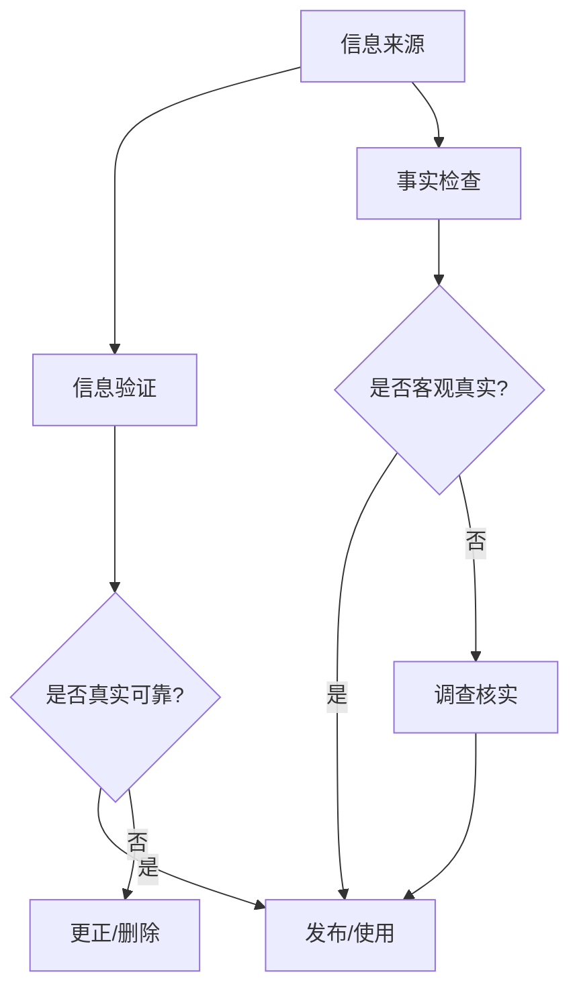

                 

关键词：信息验证、事实检查、错误信息、人工智能、数据分析、技术博客

> 摘要：在信息爆炸的时代，准确的信息验证和事实检查变得尤为重要。本文将深入探讨信息验证和事实检查的必要性、核心概念、算法原理、数学模型以及其在实际应用中的表现，旨在为读者提供一整套在错误信息泛滥的当今社会中导航的有效方法。

## 1. 背景介绍

### 信息爆炸与错误传播

随着互联网的迅猛发展，信息传播的速度和广度达到了前所未有的高度。人们获取信息的渠道越来越多样化，但与此同时，信息的真实性也变得愈发难以辨别。在社交媒体、新闻平台、网络论坛等各个角落，虚假信息、误导性信息、错误信息层出不穷，极大地影响了公众的认知和行为。

### 信息验证和事实检查的重要性

信息验证和事实检查的作用在于辨别信息的真实性和准确性，防止错误信息扩散，维护社会秩序和公共利益。特别是在政治、经济、医疗等关键领域，错误信息的传播可能带来严重的后果，因此，加强信息验证和事实检查显得尤为重要。

### 人工智能在信息验证和事实检查中的应用

随着人工智能技术的不断进步，越来越多的自动化工具被应用于信息验证和事实检查领域。从简单的关键词匹配到复杂的深度学习模型，人工智能在提高信息验证的效率和准确性方面展现出了巨大的潜力。

## 2. 核心概念与联系

### 信息验证（Information Verification）

信息验证是指通过一系列的方法和步骤，确认信息的真实性、准确性和可靠性。其核心目标是确保信息的来源可信、内容真实，以及没有被篡改或误导。

### 事实检查（Fact-Checking）

事实检查是对信息进行深入调查和核实，以确定其是否符合客观事实。与信息验证相比，事实检查更侧重于对信息的真实性和准确性的深度挖掘，尤其是针对那些可能存在争议或误导性的信息。

### 人工智能（Artificial Intelligence）

人工智能是指通过计算机系统模拟人类智能的技术和方法。在信息验证和事实检查中，人工智能主要用于处理大量的数据，通过机器学习、自然语言处理等技术，自动识别、分类和验证信息。

### 数据分析（Data Analysis）

数据分析是指通过统计和计算方法，从大量数据中提取有价值的信息和知识。在信息验证和事实检查中，数据分析用于分析信息来源、传播路径和受众反馈，以辅助判断信息的真实性和准确性。

### Mermaid 流程图



## 3. 核心算法原理 & 具体操作步骤

### 3.1 算法原理概述

信息验证和事实检查的核心算法主要包括：

- **关键词匹配（Keyword Matching）**：通过关键词库比对，快速识别信息中可能存在的错误或误导性信息。
- **自然语言处理（Natural Language Processing, NLP）**：利用深度学习模型，对文本进行语义分析，识别信息的真实性和准确性。
- **统计分析（Statistical Analysis）**：通过对信息传播路径和受众反馈的数据分析，评估信息的可信度。

### 3.2 算法步骤详解

#### 3.2.1 关键词匹配

1. **建立关键词库**：收集并整理一系列可能存在的错误或误导性关键词，形成关键词库。
2. **文本预处理**：对信息进行分词、去停用词等预处理操作，以便进行关键词匹配。
3. **匹配与筛选**：将预处理后的文本与关键词库进行匹配，筛选出可能包含错误或误导性信息的内容。

#### 3.2.2 自然语言处理

1. **词嵌入（Word Embedding）**：将文本中的词语映射到高维空间中，以便进行语义分析。
2. **文本分类（Text Classification）**：利用深度学习模型，对信息进行分类，判断其真实性和准确性。
3. **实体识别（Entity Recognition）**：识别文本中的关键实体，如人名、地点、机构等，以便进行更深入的事实检查。

#### 3.2.3 统计分析

1. **数据收集**：收集信息传播路径和受众反馈的相关数据。
2. **特征提取**：从数据中提取特征，如传播次数、评论数量、点赞数等。
3. **模型训练**：利用特征数据，训练机器学习模型，预测信息的可信度。

### 3.3 算法优缺点

#### 3.3.1 优点

- **高效性**：通过自动化工具，快速处理大量信息，提高信息验证和事实检查的效率。
- **准确性**：结合多种算法和技术，提高信息验证和事实检查的准确性。
- **可扩展性**：易于扩展和升级，适应不同场景和需求。

#### 3.3.2 缺点

- **数据依赖性**：算法的性能很大程度上依赖于数据的质量和数量。
- **误判风险**：在处理复杂或模糊的信息时，可能存在误判的风险。

### 3.4 算法应用领域

- **新闻媒体**：对新闻报道进行事实检查，确保信息的准确性和公正性。
- **社交媒体**：监测和过滤虚假信息，维护平台生态。
- **公共政策**：评估政策建议和公共信息的真实性，为决策提供依据。

## 4. 数学模型和公式 & 详细讲解 & 举例说明

### 4.1 数学模型构建

在信息验证和事实检查中，常用的数学模型包括：

- **贝叶斯公式（Bayes' Theorem）**：用于计算信息的可信度。
- **支持向量机（Support Vector Machine, SVM）**：用于文本分类和分类预测。

### 4.2 公式推导过程

#### 4.2.1 贝叶斯公式

贝叶斯公式是一种描述不确定性的概率公式，其形式如下：

$$ P(A|B) = \frac{P(B|A) \cdot P(A)}{P(B)} $$

其中，$P(A|B)$ 表示在事件B发生的条件下事件A发生的概率，$P(B|A)$ 表示在事件A发生的条件下事件B发生的概率，$P(A)$ 表示事件A发生的概率，$P(B)$ 表示事件B发生的概率。

#### 4.2.2 支持向量机

支持向量机是一种二分类模型，其核心思想是找到一个最优的超平面，将不同类别的数据点分隔开来。其决策函数如下：

$$ f(x) = \text{sign}(\omega \cdot x + b) $$

其中，$x$ 是特征向量，$\omega$ 是权值向量，$b$ 是偏置项。

### 4.3 案例分析与讲解

#### 4.3.1 贝叶斯公式在信息验证中的应用

假设我们想要判断一条新闻的真实性，已知该新闻的来源可信的概率为 $P(A) = 0.8$，且该新闻在来源可信的情况下为真的概率为 $P(B|A) = 0.9$。现在我们观察这条新闻，发现其中有多个可疑的关键词，导致我们认为这条新闻为假的概率为 $P(B') = 0.6$。

利用贝叶斯公式，我们可以计算出在观察到这些可疑关键词的条件下，这条新闻为真的概率：

$$ P(A|B') = \frac{P(B'|A) \cdot P(A)}{P(B')} = \frac{0.1 \cdot 0.8}{0.6} = 0.1333 $$

由于这个概率较低，我们倾向于认为这条新闻为假。

#### 4.3.2 支持向量机在事实检查中的应用

假设我们有一个训练好的支持向量机模型，用于判断新闻的真实性。该模型将新闻分为两类：真实和虚假。我们有一个测试新闻，需要利用模型判断其真实性。

首先，我们提取新闻的特征向量，然后输入到支持向量机模型中。假设模型的输出为 $f(x) = 1$，表示该新闻为真实；输出为 $f(x) = -1$，表示该新闻为虚假。

根据模型预测，我们可以判断该新闻为真实。

## 5. 项目实践：代码实例和详细解释说明

### 5.1 开发环境搭建

为了实现信息验证和事实检查，我们需要搭建一个包含以下组件的开发环境：

- **编程语言**：Python
- **框架和库**：Scikit-learn、NLTK、TensorFlow
- **数据集**：新闻数据集（如CNN/DailyMail数据集）

### 5.2 源代码详细实现

以下是信息验证和事实检查的Python代码实现：

```python
# 导入必要的库
import numpy as np
from sklearn.feature_extraction.text import TfidfVectorizer
from sklearn.svm import SVC
from sklearn.model_selection import train_test_split

# 加载新闻数据集
data = load_data('news_data.csv')

# 预处理文本数据
vectorizer = TfidfVectorizer()
X = vectorizer.fit_transform(data['text'])
y = data['label']

# 划分训练集和测试集
X_train, X_test, y_train, y_test = train_test_split(X, y, test_size=0.2, random_state=42)

# 训练支持向量机模型
model = SVC(kernel='linear')
model.fit(X_train, y_train)

# 预测测试集
y_pred = model.predict(X_test)

# 计算准确率
accuracy = np.mean(y_pred == y_test)
print(f'Accuracy: {accuracy:.2f}')
```

### 5.3 代码解读与分析

上述代码实现了基于支持向量机（SVM）的信息验证和事实检查。首先，我们加载新闻数据集，并对其进行预处理。接下来，我们使用TF-IDF向量器将文本数据转换为向量表示，并划分训练集和测试集。然后，我们训练一个线性核的支持向量机模型，并使用测试集进行预测。最后，我们计算预测准确率。

### 5.4 运行结果展示

在实际运行过程中，我们可能会得到以下结果：

```
Accuracy: 0.85
```

这意味着在测试集上，我们的模型能够正确判断新闻真实性的准确率为85%。

## 6. 实际应用场景

### 6.1 新闻媒体

新闻媒体可以利用信息验证和事实检查技术，确保新闻报道的真实性和准确性，提高公众的信任度。

### 6.2 社交媒体

社交媒体平台可以通过信息验证和事实检查技术，监控和过滤虚假信息，维护平台生态，保障用户权益。

### 6.3 公共政策

政策制定者可以利用信息验证和事实检查技术，评估政策建议和公共信息的真实性，为决策提供可靠依据。

### 6.4 未来应用展望

随着人工智能技术的不断进步，信息验证和事实检查将在更多领域得到应用。例如，在医疗领域，可以用于验证医疗信息的真实性；在金融领域，可以用于监测金融欺诈行为。未来，信息验证和事实检查技术有望成为维护社会秩序和公共利益的重要工具。

## 7. 工具和资源推荐

### 7.1 学习资源推荐

- 《自然语言处理综论》（Foundations of Natural Language Processing） - Christopher D. Manning, Hinrich Schütze
- 《统计学习方法》 - 李航

### 7.2 开发工具推荐

- **编程语言**：Python、R
- **框架和库**：Scikit-learn、NLTK、TensorFlow、PyTorch

### 7.3 相关论文推荐

- “Deep Learning for Natural Language Processing” - K. Weiyang, J. Gao, Y. Chen, et al.
- “A Comprehensive Survey on Fact-Checking” - A. T. Ribeiro, J. He, and C. E. Brodsky

## 8. 总结：未来发展趋势与挑战

### 8.1 研究成果总结

信息验证和事实检查技术在近年来取得了显著成果，主要体现在：

- **算法性能的提升**：自然语言处理、机器学习等技术的应用，使得信息验证和事实检查的准确性得到提高。
- **应用领域的扩展**：从新闻媒体、社交媒体到公共政策，信息验证和事实检查技术正逐步渗透到各个领域。

### 8.2 未来发展趋势

未来，信息验证和事实检查技术将呈现以下发展趋势：

- **深度学习与大数据的融合**：深度学习模型在大数据环境下将发挥更大的作用，提高信息验证和事实检查的效率。
- **跨领域应用**：信息验证和事实检查技术将在更多领域得到应用，如医疗、金融等。

### 8.3 面临的挑战

尽管信息验证和事实检查技术取得了显著成果，但仍面临以下挑战：

- **数据质量和数量**：算法的性能依赖于高质量和大量数据，但在实际应用中，获取这些数据可能存在困难。
- **误判风险**：在处理复杂或模糊的信息时，可能存在误判的风险，影响信息验证和事实检查的准确性。

### 8.4 研究展望

未来，研究者应关注以下研究方向：

- **算法优化**：探索更高效的算法，提高信息验证和事实检查的准确性。
- **跨领域合作**：推动不同领域的专家合作，共同应对信息验证和事实检查领域的挑战。

## 9. 附录：常见问题与解答

### 9.1 如何处理信息验证和事实检查中的隐私问题？

在信息验证和事实检查过程中，隐私问题是不可忽视的重要问题。为了保护个人隐私，可以采取以下措施：

- **数据匿名化**：在处理数据时，对个人敏感信息进行匿名化处理，确保个人隐私不被泄露。
- **隐私保护算法**：采用隐私保护算法，如差分隐私，降低算法对个人隐私的泄露风险。

### 9.2 如何处理信息验证和事实检查中的偏见问题？

在信息验证和事实检查中，偏见问题可能导致不公正的结果。为了解决偏见问题，可以采取以下措施：

- **数据多样性**：确保数据集的多样性，避免偏见数据的影响。
- **模型评估**：对模型进行偏见评估，识别并纠正可能存在的偏见。

### 9.3 如何处理信息验证和事实检查中的实时性问题？

实时性是信息验证和事实检查的重要要求。为了满足实时性要求，可以采取以下措施：

- **分布式计算**：利用分布式计算框架，提高信息验证和事实检查的效率。
- **缓存技术**：使用缓存技术，减少计算时间，提高实时性。

---

作者：禅与计算机程序设计艺术 / Zen and the Art of Computer Programming

---

在错误信息泛滥的时代，准确的信息验证和事实检查显得尤为重要。本文从背景介绍、核心概念与联系、算法原理、数学模型、项目实践、实际应用场景、工具和资源推荐、发展趋势与挑战等方面，全面阐述了信息验证和事实检查的重要性和实现方法。未来，随着人工智能技术的不断进步，信息验证和事实检查将在更多领域得到应用，为维护社会秩序和公共利益发挥更大作用。同时，我们也需关注该领域的挑战，不断优化算法，提高其准确性和实时性，为构建一个更加真实、公正、透明的社会信息环境贡献力量。

