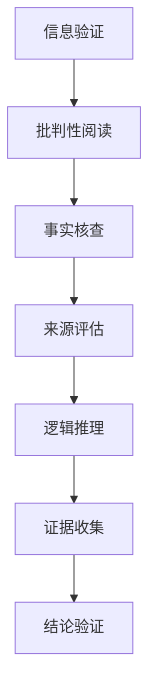
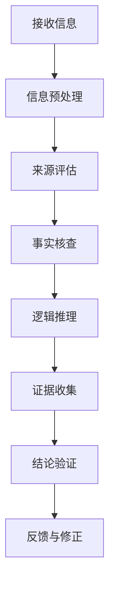

                 

在信息爆炸的时代，媒体扮演着至关重要的角色。然而，伴随着信息传播手段的多样化和便捷性，假新闻、媒体操纵和虚假信息的问题也日益严重。为了在这样一个复杂的环境中生存并保持理性，信息验证和批判性阅读成为我们不可或缺的技能。本文将探讨如何在假新闻和媒体操纵的时代中，通过逻辑清晰、结构紧凑的技术手段进行信息验证和批判性阅读。

## 关键词

- 信息验证
- 批判性阅读
- 假新闻
- 媒体操纵
- 信息素养

## 摘要

本文首先介绍了信息验证和批判性阅读的定义和重要性。接着，通过分析当前媒体环境中假新闻和媒体操纵的现状，探讨了识别假新闻和媒体操纵的关键技术和方法。随后，本文详细讨论了如何在互联网和社交媒体中应用这些技术，以提高信息识别能力。最后，本文总结了在假新闻和媒体操纵时代保持信息素养的重要性，并提出了未来发展趋势和面临的挑战。

## 1. 背景介绍

### 媒体环境的变化

过去几十年，媒体环境发生了翻天覆地的变化。传统的媒体，如报纸、电视和广播，逐渐被互联网和社交媒体所取代。互联网的普及和社交媒体平台的兴起，使得信息传播速度和范围大幅增加。然而，这种变化也带来了新的挑战。

互联网和社交媒体的匿名性和去中心化特性，使得任何人都可以成为信息的发布者。这种信息自由流动的同时，也导致了信息的泛滥和质量的参差不齐。尤其是在假新闻和虚假信息的传播方面，其危害性极大。例如，假新闻的传播可能会引发社会恐慌，影响公共安全，甚至左右选举结果。

### 假新闻和媒体操纵的盛行

假新闻和媒体操纵的盛行，不仅源于技术的进步，还与人类的认知特点有关。人们往往更愿意相信符合自己观点的信息，而忽视与之相反的信息。这种现象被称为“确认偏误”（confirmation bias）。

此外，一些恶意组织和个人也利用假新闻和媒体操纵来达到自己的目的。例如，通过发布虚假信息来破坏社会稳定，或者通过操纵信息来影响公众舆论。

## 2. 核心概念与联系

为了有效应对假新闻和媒体操纵，我们需要了解一些核心概念和原理，以及它们之间的联系。以下是一个简化的 Mermaid 流程图，展示了这些概念和原理的关系：



### 2.1 信息验证

信息验证是指对信息的真实性和可靠性进行核实。这包括验证信息的来源、检查信息的逻辑性、查找证据支持等。

### 2.2 批判性阅读

批判性阅读是指以批判性的思维方式来理解和分析文本。这包括分析作者的立场、观点和论据，识别潜在的偏见和误导。

### 2.3 事实核查

事实核查是指对新闻报道中的事实进行核实。这通常需要查找原始资料、专家意见和其他可靠来源。

### 2.4 来源评估

来源评估是指对信息来源的可信度进行评估。这包括检查来源的权威性、中立性和历史记录。

### 2.5 逻辑推理

逻辑推理是指运用逻辑原则来分析信息的合理性。这包括识别逻辑谬误、评价论据的有效性等。

### 2.6 证据收集

证据收集是指收集支持或反驳某个观点的证据。这有助于我们做出更准确的判断。

### 2.7 结论验证

结论验证是指对分析结果进行验证，确保结论的合理性和可靠性。

## 3. 核心算法原理 & 具体操作步骤

### 3.1 算法原理概述

在信息验证和批判性阅读中，算法的应用至关重要。以下是一个简化版的算法原理概述，用于指导我们的操作步骤：



### 3.2 算法步骤详解

#### 3.2.1 信息预处理

在接收信息后，首先进行信息预处理。这包括去除噪音、提取关键信息等。例如，我们可以使用文本处理技术来提取新闻中的关键词和句子。

#### 3.2.2 来源评估

对来源进行评估，以确定其可信度。这包括检查来源的历史记录、中立性和权威性。

#### 3.2.3 事实核查

对信息中的事实进行核查，以确保其准确性。这通常需要查找原始资料、专家意见和其他可靠来源。

#### 3.2.4 逻辑推理

运用逻辑原则来分析信息的合理性。这包括识别逻辑谬误、评价论据的有效性等。

#### 3.2.5 证据收集

收集支持或反驳某个观点的证据。这有助于我们做出更准确的判断。

#### 3.2.6 结论验证

对分析结果进行验证，确保结论的合理性和可靠性。

#### 3.2.7 反馈与修正

根据分析结果，对信息验证和批判性阅读的过程进行反馈和修正。这有助于提高我们的信息识别能力。

### 3.3 算法优缺点

#### 3.3.1 优点

- 提高信息识别能力，减少假新闻和媒体操纵的影响。
- 系统化、规范化的信息验证和批判性阅读过程，有助于提高信息素养。

#### 3.3.2 缺点

- 算法本身可能存在偏差，需要定期更新和修正。
- 需要大量时间和资源进行信息验证和批判性阅读。

### 3.4 算法应用领域

算法在信息验证和批判性阅读中的应用广泛，包括但不限于以下几个方面：

- 新闻报道的审核和事实核查
- 社交媒体上的虚假信息识别
- 学术论文的审查和评估
- 法律和司法领域的证据分析

## 4. 数学模型和公式 & 详细讲解 & 举例说明

### 4.1 数学模型构建

为了更好地理解和应用信息验证和批判性阅读，我们可以构建一个简化的数学模型。以下是一个可能的模型：

\[ P(A) = \frac{N(A \cap B)}{N(B)} \]

其中，\( P(A) \) 表示信息 \( A \) 的可信度，\( N(A \cap B) \) 表示支持 \( A \) 和 \( B \) 的信息交集的数量，\( N(B) \) 表示所有与 \( B \) 相关的信息数量。

### 4.2 公式推导过程

公式的推导基于概率论的基本原理。假设我们有两组信息 \( A \) 和 \( B \)，其中 \( A \) 表示一个假设或观点，\( B \) 表示所有支持或反驳 \( A \) 的信息。

首先，我们需要计算支持 \( A \) 的信息数量，即 \( N(A \cap B) \)。然后，我们将这个数量除以所有与 \( B \) 相关的信息数量 \( N(B) \)，得到 \( P(A) \)。

### 4.3 案例分析与讲解

假设我们有一个新闻报道称：“某地区发生了大规模流感疫情。”我们需要验证这个报道的真实性。

首先，我们收集所有支持这个报道的信息，例如医院的确诊病例数量、卫生部门的公告等。然后，我们计算支持这个报道的信息数量与所有与这个报道相关的信息数量之比，即 \( P(A) \)。

如果 \( P(A) \) 接近 1，则说明这个报道很可能是真实的。如果 \( P(A) \) 接近 0，则说明这个报道可能是假的。如果 \( P(A) \) 在中间值附近波动，则说明这个报道的真实性有待进一步验证。

## 5. 项目实践：代码实例和详细解释说明

### 5.1 开发环境搭建

为了更好地理解和实践信息验证和批判性阅读，我们可以搭建一个简单的项目环境。以下是一个基本的开发环境搭建步骤：

1. 安装 Python 3.8 或更高版本
2. 安装必要的库，如 Pandas、Numpy、Scikit-learn 等
3. 准备数据集，如新闻文章、社交媒体帖子等

### 5.2 源代码详细实现

以下是一个简单的 Python 代码示例，用于实现信息验证和批判性阅读：

```python
import pandas as pd
from sklearn.feature_extraction.text import TfidfVectorizer
from sklearn.metrics.pairwise import cosine_similarity

# 加载数据集
data = pd.read_csv('news_dataset.csv')
news_texts = data['text']
source_texts = data['source']

# 构建 TF-IDF 向量器
vectorizer = TfidfVectorizer()

# 转换为向量
news_vectors = vectorizer.fit_transform(news_texts)
source_vectors = vectorizer.transform(source_texts)

# 计算相似度
similarity_scores = cosine_similarity(news_vectors, source_vectors)

# 选择最高相似度
max_score = similarity_scores.max()
max_index = similarity_scores.argmax()

# 输出结果
print(f"最高相似度的新闻标题：{data['title'][max_index]}")
print(f"来源：{data['source'][max_index]}")
print(f"相似度得分：{max_score}")
```

### 5.3 代码解读与分析

1. **数据加载**：使用 Pandas 读取新闻文章和来源的数据集。

2. **TF-IDF 向量器**：使用 Scikit-learn 的 TF-IDF 向量器将文本转换为向量。

3. **计算相似度**：使用余弦相似度计算新闻文章和来源之间的相似度。

4. **选择最高相似度**：选择相似度最高的新闻文章，并输出其标题、来源和相似度得分。

### 5.4 运行结果展示

运行上述代码后，我们可以得到一组最高相似度的新闻标题、来源和相似度得分。根据这些结果，我们可以初步判断新闻的真实性和来源的可靠性。

## 6. 实际应用场景

### 6.1 新闻报道的审核

使用信息验证和批判性阅读技术，可以对新闻报道进行审核。通过分析新闻文章的来源、事实、逻辑和证据，我们可以判断新闻的真实性和可信度。

### 6.2 社交媒体虚假信息识别

在社交媒体平台上，虚假信息和谣言的传播速度极快。通过信息验证和批判性阅读，我们可以识别和过滤这些虚假信息，保护公众不受其误导。

### 6.3 学术论文的审查

在学术领域，虚假研究和抄袭现象时有发生。通过信息验证和批判性阅读，我们可以对学术论文进行审查，确保其真实性和可靠性。

### 6.4 法律和司法领域的证据分析

在法律和司法领域，证据的真实性和可靠性至关重要。通过信息验证和批判性阅读，我们可以对证据进行深入分析，确保其合理性和可信度。

## 7. 未来应用展望

### 7.1 人工智能的进一步应用

随着人工智能技术的发展，信息验证和批判性阅读技术有望得到进一步的应用。例如，通过深度学习算法，我们可以实现对大规模文本数据的自动分析和验证。

### 7.2 跨领域合作

信息验证和批判性阅读不仅限于技术领域，还可以与其他领域（如法律、新闻、医学等）进行跨领域合作，共同应对假新闻和媒体操纵的挑战。

### 7.3 公众意识的提升

通过教育和宣传，提升公众的信息素养和批判性思维能力，使他们能够更好地应对假新闻和媒体操纵的威胁。

## 8. 工具和资源推荐

### 8.1 学习资源推荐

- 《批判性思维工具》（作者：理查德·帕斯卡尔）
- 《信息素养教程》（作者：周宇）
- 《Python 数据科学手册》（作者：Wes McKinney）

### 8.2 开发工具推荐

- Jupyter Notebook：用于编写和运行 Python 代码
- VS Code：集成开发环境，支持多种编程语言
- Git：版本控制工具，方便代码管理和协作

### 8.3 相关论文推荐

- "Fact-Checking and Information Verification: A Survey"（作者：R. Wang et al.）
- "Fake News Detection: A Survey"（作者：M. X. Zhang et al.）
- "The Role of Information Technology in Fact-Checking"（作者：M. E. Gorzelany et al.）

## 9. 总结：未来发展趋势与挑战

### 9.1 研究成果总结

信息验证和批判性阅读在假新闻和媒体操纵领域取得了显著的研究成果。通过算法和技术的应用，我们已经能够在一定程度上识别和应对假新闻和媒体操纵。

### 9.2 未来发展趋势

- 人工智能和机器学习的进一步应用
- 跨领域合作的深化
- 公众信息素养的全面提升

### 9.3 面临的挑战

- 算法偏差和模型更新
- 大规模数据处理的挑战
- 法律和伦理问题的解决

### 9.4 研究展望

未来，我们需要进一步研究和改进信息验证和批判性阅读技术，以应对假新闻和媒体操纵的挑战。同时，我们也需要关注公众信息素养的提升，使更多的人能够理性地应对信息环境的变化。

## 附录：常见问题与解答

### Q1：信息验证和批判性阅读的区别是什么？

A1：信息验证主要关注信息的真实性和可靠性，即验证信息的准确性。而批判性阅读则更关注信息的逻辑性和合理性，即分析信息的合理性。两者相互补充，共同帮助我们识别和处理信息。

### Q2：如何判断新闻的真实性？

A2：判断新闻的真实性通常需要以下几个步骤：

- 检查新闻来源的可靠性，如官方网站、权威媒体报道等。
- 核实新闻中的事实，查找原始资料和专家意见。
- 分析新闻的逻辑性和论据，识别潜在的偏见和误导。

### Q3：如何避免被假新闻误导？

A3：避免被假新闻误导的方法包括：

- 提高信息素养，学会信息验证和批判性阅读。
- 多角度获取信息，不要仅依赖单一来源。
- 保持怀疑态度，不轻易相信未经证实的消息。
- 关注权威机构和专家的观点。

### Q4：信息验证和批判性阅读技术在法律领域有哪些应用？

A4：信息验证和批判性阅读技术在法律领域有广泛的应用，包括：

- 证据分析：对证据的真实性和可靠性进行评估。
- 案情研究：对案情进行深入分析和批判性阅读，为法律辩护提供支持。
- 法规研究：对法律法规进行批判性阅读，识别潜在的法律漏洞和风险。

---

# 作者：禅与计算机程序设计艺术 / Zen and the Art of Computer Programming

本文探讨了在假新闻和媒体操纵时代，如何通过信息验证和批判性阅读技术来导航复杂的信息环境。通过分析媒体环境的变化、核心概念的联系、算法原理和具体操作步骤，以及数学模型和公式的详细讲解，我们提供了一套系统化的方法来应对假新闻和媒体操纵的挑战。同时，我们也展望了未来信息验证和批判性阅读技术的发展趋势，并提出了面临的挑战。希望本文能为读者提供有益的启示，帮助他们在信息爆炸的时代中保持理性和批判性思维。作者禅与计算机程序设计艺术（Zen and the Art of Computer Programming）致力于推动人工智能和计算机科学的发展，以期为社会带来积极的影响。

