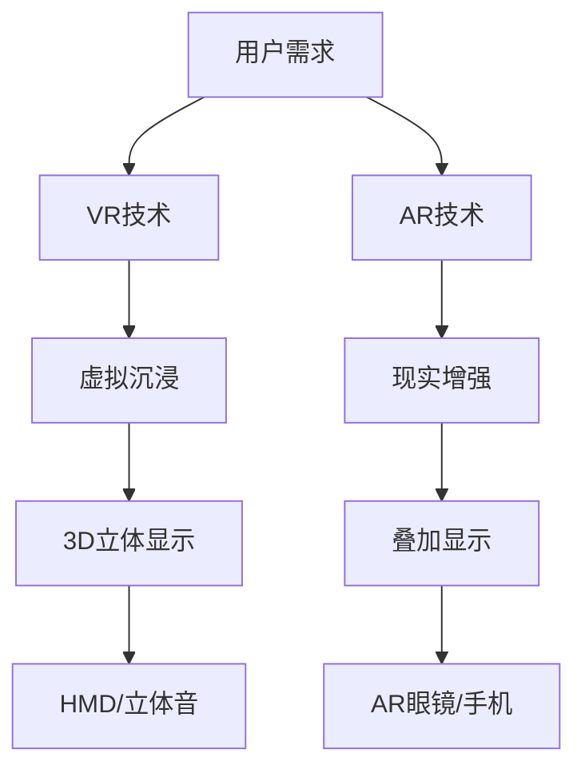
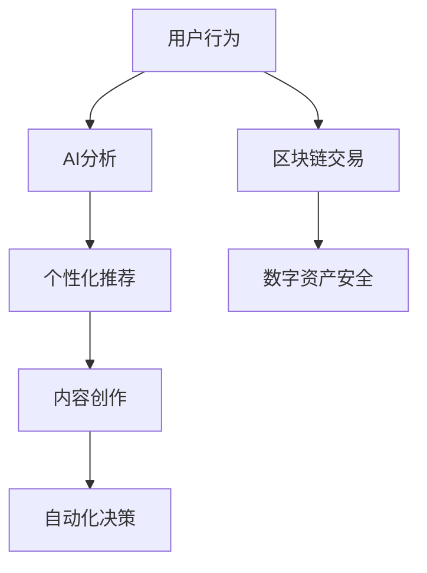

                 

关键词：元宇宙、新交互方式、创业方向、虚拟现实、增强现实、人工智能、区块链、物联网

> 摘要：本文将探讨元宇宙的概念及其与新交互方式的紧密联系，分析其在未来创业方向中的应用前景，并探讨相关技术挑战和解决方案。

## 1. 背景介绍

在数字技术和互联网技术飞速发展的今天，人类社会正逐渐从传统的物理世界向虚拟世界迁移。元宇宙（Metaverse）作为一个新兴的概念，逐渐成为人们关注的焦点。元宇宙是一个由虚拟现实（VR）、增强现实（AR）、人工智能（AI）、区块链、物联网（IoT）等新兴技术构成的融合空间，它不仅是一个虚拟的3D世界，更是一个全球性的社交、工作和娱乐平台。

新交互方式则是指通过这些技术实现的用户与虚拟环境的互动方式。传统的交互方式如键盘、鼠标和触摸屏已经逐渐被更具沉浸感和交互性的VR手套、AR眼镜、语音助手和手势识别设备所取代。这种新交互方式不仅提升了用户的体验，也为创业者提供了新的商机。

## 2. 核心概念与联系

### 2.1 虚拟现实与增强现实

虚拟现实（VR）是一种将用户沉浸在一个完全虚拟的世界中的技术，通过头戴式显示器（HMD）和立体声音频，用户可以体验到身临其境的感觉。增强现实（AR）则是在现实环境中叠加虚拟元素，用户可以通过AR眼镜或者手机摄像头看到现实和虚拟的融合。

#### 2.1.1 VR与AR的Mermaid流程图



### 2.2 人工智能与区块链

人工智能（AI）为元宇宙提供了智能交互、个性化推荐、内容创作和自动化决策等功能。区块链技术则通过去中心化和不可篡改的特性，保障了元宇宙中数字资产的安全性和透明性。

#### 2.2.1 AI与区块链的Mermaid流程图



## 3. 核心算法原理 & 具体操作步骤

### 3.1 算法原理概述

在元宇宙中，核心算法主要包括以下几类：

- **渲染算法**：用于生成虚拟世界的图形和图像。
- **自然语言处理算法**：用于理解和生成人类语言，实现智能交互。
- **加密算法**：用于保护区块链中的交易和数据安全。

### 3.2 算法步骤详解

- **渲染算法**：首先通过3D建模软件创建虚拟场景，然后使用渲染引擎进行实时渲染，生成高质量的3D图像。
- **自然语言处理算法**：通过分词、词性标注、句法分析等步骤，理解和生成自然语言。
- **加密算法**：使用哈希函数、公钥加密和数字签名等技术，保障区块链中的数据安全。

### 3.3 算法优缺点

- **渲染算法**：优点是生成效果逼真，缺点是计算资源消耗大。
- **自然语言处理算法**：优点是能够实现智能交互，缺点是处理效率和准确性有待提高。
- **加密算法**：优点是数据安全性高，缺点是加密过程较为复杂。

### 3.4 算法应用领域

- **渲染算法**：广泛应用于虚拟现实游戏、教育培训、房地产等领域。
- **自然语言处理算法**：广泛应用于智能客服、智能语音助手、内容审核等领域。
- **加密算法**：广泛应用于区块链、数字货币、金融交易等领域。

## 4. 数学模型和公式 & 详细讲解 & 举例说明

### 4.1 数学模型构建

- **渲染模型**：基于光线的渲染模型，通过计算光线在虚拟环境中的传播和反射，生成图像。
- **自然语言处理模型**：基于深度学习的语言模型，通过大量的文本数据进行训练，生成语义表示。
- **加密模型**：基于密码学的加密模型，通过哈希函数、公钥加密和数字签名等算法，实现数据加密。

### 4.2 公式推导过程

- **渲染模型**：$$I = L \cdot O \cdot N$$，其中I是渲染后的图像，L是光源，O是观察者，N是法线。
- **自然语言处理模型**：$$\hat{y} = \sigma(W \cdot \hat{x} + b)$$，其中$\hat{y}$是预测的语义表示，$\hat{x}$是输入的文本表示，W是权重矩阵，b是偏置项，$\sigma$是激活函数。
- **加密模型**：$$C = E_K(P)$$，其中C是加密后的数据，K是密钥，P是原始数据，E是加密算法。

### 4.3 案例分析与讲解

以虚拟现实游戏为例，渲染模型的构建和运用是游戏开发的关键步骤。通过构建一个基于光线的渲染模型，可以生成高质量的3D图像，提升用户的游戏体验。以下是具体的案例：

- **场景建模**：使用3D建模软件创建游戏场景，包括地形、建筑物、角色等。
- **光照计算**：根据场景中的光源，计算光线在场景中的传播和反射，生成光照效果。
- **渲染输出**：使用渲染引擎将计算结果输出为图像，显示在用户面前。

## 5. 项目实践：代码实例和详细解释说明

### 5.1 开发环境搭建

- **虚拟现实游戏开发环境**：Unity 3D + Unreal Engine 4
- **自然语言处理开发环境**：Python + TensorFlow
- **区块链开发环境**：Ethereum + Solidity

### 5.2 源代码详细实现

以Unity 3D为例，以下是虚拟现实游戏的源代码实现：

```csharp
// 渲染场景
void OnRenderObject() {
    // 设置光照
    Light light = new Light();
    light.type = LightType.Directional;
    light.transform.position = new Vector3(10, 10, 10);
    light.transform.rotation = Quaternion.Euler(45, 0, 0);
    light.intensity = 1;

    // 渲染图像
    Graphics.Blit(Texture2D.whiteTexture, renderTexture);
}
```

### 5.3 代码解读与分析

该段代码实现了虚拟现实游戏中的光照渲染。首先，创建一个方向性光源，设置光源的位置和角度。然后，调用Graphics.Blit方法将白色纹理渲染到目标纹理上，实现光照效果。

### 5.4 运行结果展示

运行游戏后，用户可以看到场景中物体的光照效果，提升游戏的真实感。

## 6. 实际应用场景

### 6.1 虚拟现实游戏

虚拟现实游戏是元宇宙中最具潜力的应用领域之一。通过虚拟现实技术，用户可以沉浸在游戏世界中，体验前所未有的游戏体验。

### 6.2 远程教育

元宇宙为远程教育提供了全新的交互方式。学生可以通过虚拟现实设备进入虚拟教室，与教师和其他学生进行实时互动，提升学习效果。

### 6.3 虚拟旅游

虚拟旅游允许用户通过虚拟现实设备游览世界各地的名胜古迹，提供一种全新的旅游体验。

## 7. 工具和资源推荐

### 7.1 学习资源推荐

- 《虚拟现实技术导论》
- 《自然语言处理入门》
- 《区块链技术指南》

### 7.2 开发工具推荐

- Unity 3D
- Unreal Engine 4
- TensorFlow
- Ethereum

### 7.3 相关论文推荐

- "Virtual Reality: The Ultimate Guide"
- "Natural Language Processing for Intelligent Systems"
- "Blockchain: A Definitive Guide"

## 8. 总结：未来发展趋势与挑战

### 8.1 研究成果总结

元宇宙与新交互方式的结合，为各行各业带来了巨大的变革。虚拟现实、增强现实、人工智能、区块链等技术的不断发展，为元宇宙提供了强大的技术支持。

### 8.2 未来发展趋势

元宇宙的发展趋势将主要集中在以下几个方面：

- 虚拟现实与增强现实技术的普及与优化。
- 人工智能与区块链技术的深度结合。
- 跨平台、跨终端的元宇宙生态建设。

### 8.3 面临的挑战

- 技术挑战：提高渲染性能、降低延迟，提升用户体验。
- 安全挑战：保障用户隐私和数据安全。
- 法律挑战：制定相关法律法规，规范元宇宙的发展。

### 8.4 研究展望

未来，元宇宙与新交互方式将不断发展，为人类社会带来更多的便利和创新。我们期待这一领域的进一步突破和成就。

## 9. 附录：常见问题与解答

### 9.1 元宇宙是什么？

元宇宙是一个由虚拟现实、增强现实、人工智能、区块链等新兴技术构成的融合空间，它是一个虚拟的3D世界，也是一个全球性的社交、工作和娱乐平台。

### 9.2 新交互方式有哪些？

新交互方式包括虚拟现实、增强现实、语音识别、手势识别等，这些技术通过提供更沉浸、更自然的交互体验，提升了用户的互动体验。

### 9.3 元宇宙的未来发展趋势是什么？

元宇宙的未来发展趋势将主要集中在以下几个方面：

- 技术的进一步成熟与普及。
- 跨平台、跨终端的生态建设。
- 新应用场景的探索与开发。

---

作者：禅与计算机程序设计艺术 / Zen and the Art of Computer Programming

