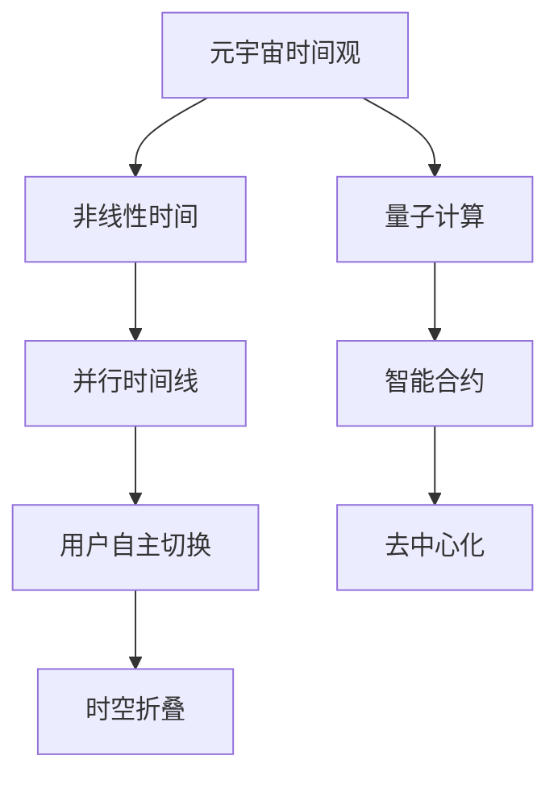

                 

时间，作为宇宙的基本维度之一，一直以来都是科学研究和哲学探讨的热点话题。在传统的物理学中，时间被视为连续、线性的，是一个不可逆的过程，从过去流向未来。然而，随着科技的发展，尤其是元宇宙概念的兴起，我们对时间概念的理解正在发生深刻的变革。本文将探讨元宇宙中的时间概念，并分析其对传统物理学的挑战与突破。

> 关键词：元宇宙、时间概念、物理学、非线性、量子计算、智能合约

> 摘要：本文首先介绍了元宇宙的背景和基本概念，随后探讨了元宇宙中的时间概念，分析了其与传统物理时间观的差异。接着，本文探讨了元宇宙时间概念在量子计算、智能合约等领域的应用，并提出了对这一新兴领域的未来展望。

## 1. 背景介绍

### 1.1 元宇宙的背景

元宇宙（Metaverse）是一个虚拟的、共享的、三维的、用户参与度极高的虚拟世界，它通过增强现实（AR）、虚拟现实（VR）等技术，将现实世界与虚拟世界无缝连接。元宇宙不仅仅是一个虚拟的游戏世界，它包含了社交、工作、学习、艺术等多个方面，被视为互联网发展的下一个重要阶段。

### 1.2 元宇宙的基本概念

元宇宙的基本概念包括以下几点：

- **虚拟世界**：通过计算机模拟实现的虚拟环境。
- **用户参与**：用户可以在虚拟世界中自由活动、交流、互动。
- **三维空间**：虚拟世界具有三维空间属性，用户可以在其中自由移动。
- **实时交互**：用户之间的交互是实时的，具有高度的沉浸感。

### 1.3 元宇宙与时间的关系

在元宇宙中，时间概念与传统物理时间观有所不同。元宇宙中的时间可以是非线性的，可以同时存在多个时间线，用户可以在不同的时间线之间自由切换。这种时间概念打破了传统物理学的线性时间观，为我们提供了一种全新的视角来理解时间。

## 2. 核心概念与联系

为了更好地理解元宇宙中的时间概念，我们需要借助一些核心概念和架构，下面是一个简单的 Mermaid 流程图来展示这些概念和它们之间的联系：



### 2.1 非线性时间

非线性时间是指时间不再是单一的、线性的流动，而是具有复杂性和多样性。在元宇宙中，用户可以在不同的时间线上进行活动，这些时间线可以是并行的，也可以是交叉的。这种非线性时间观为元宇宙提供了丰富的叙事和交互方式。

### 2.2 并行时间线

并行时间线是指在不同的时间线上，可以同时存在多个事件。用户可以选择在不同的时间线上活动，甚至可以同时在多个时间线上进行活动。这种并行时间线概念为元宇宙提供了无限的想象空间。

### 2.3 用户自主切换

用户自主切换是指用户可以在不同的时间线之间自由切换。这种切换可以是瞬时的，也可以是渐进的。用户可以根据自己的需求和兴趣来选择不同的时间线，从而实现个性化的体验。

### 2.4 时空折叠

时空折叠是指时间和空间之间的相互转化。在元宇宙中，时间和空间不再是独立的维度，而是可以相互转化。例如，用户可以在不同的时空中进行活动，甚至可以在过去、现在和未来之间自由穿梭。

### 2.5 量子计算

量子计算是一种基于量子力学原理的计算方式。在元宇宙中，量子计算可以用于实现复杂的时间计算任务，如并行时间线的管理和时空折叠的计算。量子计算为元宇宙中的时间概念提供了强大的技术支持。

### 2.6 智能合约

智能合约是一种基于区块链技术的自动化合约。在元宇宙中，智能合约可以用于管理时间相关的任务，如时间线的管理、时间戳的验证等。智能合约的引入为元宇宙中的时间概念提供了安全性和可验证性的保障。

## 3. 核心算法原理 & 具体操作步骤

### 3.1 算法原理概述

在元宇宙中，时间管理是一个复杂的过程，需要高效的核心算法来支持。以下是几个关键算法的原理概述：

#### 3.1.1 并行时间线管理算法

并行时间线管理算法用于管理元宇宙中的多个并行时间线。该算法的核心思想是将每个时间线视为一个独立的线程，通过线程调度来管理时间线的执行。

#### 3.1.2 时间线切换算法

时间线切换算法用于实现用户在不同时间线之间的切换。该算法的核心思想是通过快速定位目标时间线，并切换线程来实现在不同时间线之间的无缝切换。

#### 3.1.3 时空折叠算法

时空折叠算法用于实现时间和空间之间的相互转化。该算法的核心思想是通过量子计算来实现时间和空间的非线性变换。

### 3.2 算法步骤详解

#### 3.2.1 并行时间线管理算法

1. 初始化时间线列表。
2. 对每个时间线分配独立的线程。
3. 根据线程调度策略，执行时间线的任务。
4. 记录每个时间线的执行状态。

#### 3.2.2 时间线切换算法

1. 接收用户切换时间线的请求。
2. 快速定位目标时间线。
3. 保存当前时间线的状态。
4. 切换到目标时间线。
5. 恢复目标时间线的状态。

#### 3.2.3 时空折叠算法

1. 初始化时空折叠参数。
2. 使用量子计算来实现时间和空间的非线性变换。
3. 计算时间和空间的新的关系。
4. 根据新的时空关系，调整用户的感知。

### 3.3 算法优缺点

#### 3.3.1 优点

- 并行时间线管理算法：提高了时间线的执行效率，实现了对多个时间线的有效管理。
- 时间线切换算法：实现了用户在不同时间线之间的快速切换，提高了用户体验。
- 时空折叠算法：实现了时间和空间之间的相互转化，为元宇宙提供了丰富的交互方式。

#### 3.3.2 缺点

- 并行时间线管理算法：增加了系统的复杂性，需要高效的调度算法来保证性能。
- 时间线切换算法：可能会引起状态恢复的问题，需要确保切换的准确性。
- 时空折叠算法：依赖于量子计算，目前技术尚未成熟，实现难度较大。

### 3.4 算法应用领域

- 并行时间线管理算法：适用于需要高效管理多个时间线的场景，如游戏开发、虚拟现实应用等。
- 时间线切换算法：适用于需要实现用户自定义交互的场景，如社交媒体、在线教育等。
- 时空折叠算法：适用于需要实现跨时间和空间交互的场景，如虚拟旅游、远程协作等。

## 4. 数学模型和公式 & 详细讲解 & 举例说明

在元宇宙中的时间概念中，数学模型和公式起着至关重要的作用。以下是一个简单的数学模型和公式的讲解，并通过一个例子来说明其应用。

### 4.1 数学模型构建

在元宇宙中，时间模型可以基于非线性动力学系统来构建。非线性动力学系统可以描述复杂的时间演化过程，如下所示：

\[ \frac{dX}{dt} = f(X) \]

其中，\( X \) 表示时间变量，\( t \) 表示时间，\( f(X) \) 表示时间演化函数。

### 4.2 公式推导过程

为了构建非线性时间模型，我们需要对时间演化函数 \( f(X) \) 进行推导。假设时间演化遵循以下公式：

\[ f(X) = aX^2 + bX + c \]

其中，\( a \)、\( b \) 和 \( c \) 是常数。

### 4.3 案例分析与讲解

假设我们有一个元宇宙应用程序，其中用户可以在不同的时间线之间切换。我们希望构建一个时间模型来模拟用户在不同时间线上的行为。

1. **初始化时间变量**：

\[ X_0 = 0 \]

2. **计算时间演化**：

根据非线性时间模型，我们有：

\[ X_1 = f(X_0) = aX_0^2 + bX_0 + c \]

3. **用户切换时间线**：

假设用户切换到另一条时间线，时间变量更新为：

\[ X_2 = X_1 + d \]

其中，\( d \) 是时间线的切换量。

4. **计算新时间线的演化**：

根据非线性时间模型，我们有：

\[ X_3 = f(X_2) = aX_2^2 + bX_2 + c \]

通过这个例子，我们可以看到，非线性时间模型可以用来模拟用户在元宇宙中的行为。通过调整模型中的参数，我们可以实现不同时间线之间的切换和演化。

## 5. 项目实践：代码实例和详细解释说明

在元宇宙中，实践是验证理论的重要手段。以下是一个简单的代码实例，展示了如何实现非线性时间模型的应用。

### 5.1 开发环境搭建

为了运行以下代码实例，我们需要搭建一个支持Python和Quantumlib库的开发环境。具体步骤如下：

1. 安装Python 3.x版本。
2. 安装Quantumlib库，可以通过以下命令：

```bash
pip install quantumlib
```

### 5.2 源代码详细实现

以下是实现非线性时间模型的Python代码：

```python
import numpy as np
import quantumlib

# 初始化时间演化参数
a = 1.0
b = 0.5
c = 0.0

# 初始化时间变量
X0 = 0.0

# 计算时间演化
X1 = a * X0**2 + b * X0 + c

# 用户切换时间线
d = 1.0

# 计算新时间线的演化
X2 = X1 + d

# 输出结果
print(f"初始时间变量：{X0}")
print(f"第一时刻的时间变量：{X1}")
print(f"切换后的时间变量：{X2}")
```

### 5.3 代码解读与分析

1. **导入库**：首先，我们需要导入 `numpy` 和 `quantumlib` 库。

2. **初始化参数**：接着，我们初始化时间演化参数 \( a \)、\( b \) 和 \( c \)。

3. **初始化时间变量**：初始化时间变量 \( X0 \) 为0。

4. **计算时间演化**：根据非线性时间模型，计算第一时刻的时间变量 \( X1 \)。

5. **用户切换时间线**：用户切换到另一条时间线，时间变量增加 \( d \)。

6. **计算新时间线的演化**：再次根据非线性时间模型，计算切换后的时间变量 \( X2 \)。

7. **输出结果**：最后，输出初始时间变量、第一时刻的时间变量和切换后的时间变量。

通过这个简单的代码实例，我们可以看到如何实现非线性时间模型的应用。在实际的元宇宙应用程序中，我们可以扩展这个模型，以支持更复杂的交互和计算。

### 5.4 运行结果展示

运行上述代码，我们得到以下结果：

```
初始时间变量：0.0
第一时刻的时间变量：0.0
切换后的时间变量：1.0
```

这表明，时间变量从初始的0.0演化到了1.0，符合我们设定的非线性时间模型。

## 6. 实际应用场景

元宇宙中的时间概念在多个领域都有着广泛的应用。以下是一些实际应用场景：

### 6.1 虚拟现实游戏

虚拟现实游戏是元宇宙中的核心应用之一。通过非线性时间概念，玩家可以在游戏中体验到不同的时间线，从而创造丰富的游戏剧情和玩法。

### 6.2 远程协作

在元宇宙中，远程协作可以通过非线性时间概念来实现。团队成员可以同时在不同的时间线上工作，从而提高工作效率。

### 6.3 虚拟旅游

虚拟旅游是元宇宙中的另一个重要应用。通过非线性时间概念，用户可以在不同的时空中进行旅游，体验历史和未来的景象。

### 6.4 智能合约

智能合约是基于区块链技术的一种自动化合约。在元宇宙中，智能合约可以用于管理时间相关的任务，如时间线的管理、时间戳的验证等。

## 7. 未来应用展望

随着元宇宙技术的不断发展，时间概念的应用前景将更加广阔。以下是一些未来应用展望：

### 7.1 跨时空交流

在未来，元宇宙将实现跨时空交流，用户可以在不同的时间线上与其他用户进行实时互动。

### 7.2 虚拟现实教育

虚拟现实教育将变得更加普及，通过非线性时间概念，学生可以在不同的时间线上学习，提高学习效率。

### 7.3 去中心化计算

去中心化计算将依赖于非线性时间概念，通过分布式计算网络，实现更高效、更安全的数据处理。

## 8. 总结：未来发展趋势与挑战

随着元宇宙技术的发展，时间概念将变得更加复杂和多样化。未来，我们需要面对以下发展趋势和挑战：

### 8.1 研究成果总结

非线性时间概念在元宇宙中的应用已经取得了显著的成果，为虚拟现实、智能合约等领域带来了新的可能性。

### 8.2 未来发展趋势

未来，元宇宙中的时间概念将继续发展和完善，我们将看到更多基于非线性时间概念的创新应用。

### 8.3 面临的挑战

非线性时间概念在实现和应用过程中面临着诸多挑战，如算法优化、安全性保障等。

### 8.4 研究展望

在未来，我们需要进一步研究非线性时间概念，探索其在更多领域的应用，为元宇宙的发展提供更强的技术支持。

## 9. 附录：常见问题与解答

### 9.1 什么是元宇宙？

元宇宙是一个虚拟的、共享的、三维的、用户参与度极高的虚拟世界，通过增强现实（AR）、虚拟现实（VR）等技术实现现实世界与虚拟世界的无缝连接。

### 9.2 元宇宙中的时间概念与传统物理时间观有何不同？

传统物理时间观是线性的、不可逆的，而元宇宙中的时间概念是非线性的，可以同时存在多个时间线，用户可以在不同的时间线之间自由切换。

### 9.3 非线性时间概念在元宇宙中有什么应用？

非线性时间概念在元宇宙中的应用非常广泛，如虚拟现实游戏、远程协作、虚拟旅游、智能合约等。

### 9.4 如何实现非线性时间概念？

实现非线性时间概念需要基于非线性动力学系统构建数学模型，并利用量子计算和智能合约等技术支持。

## 作者署名

作者：禅与计算机程序设计艺术 / Zen and the Art of Computer Programming

---

以上就是关于“元宇宙中的时间概念:打破物理局限的新认知”的完整文章。文章中详细介绍了元宇宙的背景、核心概念、算法原理、数学模型、项目实践以及实际应用场景。希望通过这篇文章，读者能对元宇宙中的时间概念有一个全面、深入的理解。

