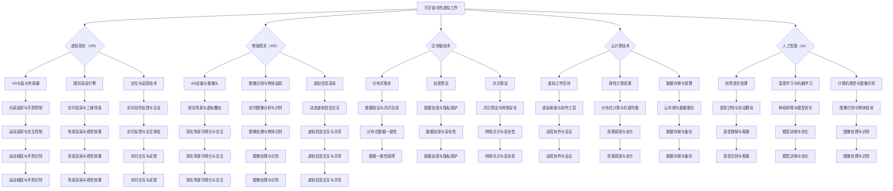

                 

### 关键词 Keywords
- 元宇宙
- 虚拟工作
- 远程协作
- 终极形态
- 人工智能
- 虚拟现实
- 数据中心
- 云计算
- 数字身份

### 摘要 Abstract
本文深入探讨了元宇宙中的虚拟工作，即远程协作的终极形态。随着技术的进步，远程协作已经从传统的文字和语音通信，逐渐演变成更加沉浸式、互动性更强的虚拟工作环境。本文将分析元宇宙中的远程协作如何改变传统工作模式，介绍其核心概念和架构，探讨其中的核心算法、数学模型、实际应用案例，并展望其未来的发展方向。作者旨在通过本文，为读者提供对元宇宙中的远程协作的全面理解，以及其对未来工作形态的深远影响。

## 1. 背景介绍 Background

随着互联网和通信技术的飞速发展，远程协作已经成为现代企业运作中不可或缺的一部分。传统的远程协作主要依赖于电子邮件、即时通讯工具、视频会议等手段，这些方式在一定程度上提高了工作效率，但依然存在沟通效率低、协同困难等问题。

近年来，虚拟现实（VR）和增强现实（AR）技术的崛起，为远程协作带来了新的可能。元宇宙的概念随之出现，它不仅仅是一个虚拟空间，更是一个集成了虚拟工作、社交、娱乐等多种功能的生态体系。在这个生态体系中，远程协作被赋予了全新的形态和内涵。

元宇宙中的虚拟工作环境，通过高度沉浸式的交互方式，使远程协作更加直观、高效。参与者可以在一个逼真的三维空间中见面，进行面对面的交流，分享信息，共同完成任务。这不仅提高了沟通效率，也增强了团队的凝聚力和协作精神。

本文将围绕元宇宙中的虚拟工作，探讨其核心概念、架构、算法、数学模型以及实际应用，以期为广大读者提供一个全面、深入的视角。

### 1.1 远程协作的历史演变 Historical Evolution of Remote Collaboration

远程协作的历史可以追溯到上世纪70年代，当时电子邮件的发明为信息传递提供了新的手段，使得地理上的距离不再成为沟通的障碍。随着互联网的普及，远程协作工具逐渐多样化，从最初的电子邮件、即时通讯工具（如ICQ、MSN）到视频会议系统（如Microsoft Teams、Zoom），都极大地改变了人们的沟通方式和工作模式。

在早期的远程协作中，主要依赖于文本和语音通信。这种方式虽然能够实现基本的沟通，但存在一些明显的局限性。首先，缺乏视觉和身体语言的表达，容易造成误解和信息流失。其次，沟通效率较低，特别是在需要多人协作的复杂任务中，往往需要多次反复确认，导致时间成本增加。此外，传统远程协作工具的界面和操作体验也相对单一，难以提供沉浸式的交互体验。

随着虚拟现实（VR）和增强现实（AR）技术的发展，远程协作开始进入一个全新的时代。VR和AR技术通过提供高度沉浸式的交互环境，使得远程参与者能够在虚拟空间中“见面”，进行更为直观和高效的交流。例如，VR会议室可以让身处不同地理位置的团队成员在三维空间中召开会议，模拟真实的面对面交流。AR技术则可以将虚拟信息叠加到现实环境中，为远程协作提供更多的交互可能性。

元宇宙的概念进一步拓展了远程协作的边界。元宇宙不仅仅是一个虚拟空间，它包含了社交、娱乐、教育、工作等多种功能，为远程协作提供了更加丰富和多样化的场景。在元宇宙中，用户可以通过虚拟身份进行交互，这些虚拟身份可以是人形、动物、物体等，为远程协作带来了更多的趣味性和创造力。

总的来说，远程协作的历史演变是一个从简单到复杂、从低效到高效的过程。随着技术的不断进步，远程协作不再只是简单的信息传递，而是一种多维度的交互体验，为现代工作方式带来了深刻的影响。

### 1.2 元宇宙的崛起 Rise of the Metaverse

元宇宙（Metaverse）一词最早由科幻小说家尼尔·斯蒂芬森（Neal Stephenson）在1992年的小说《雪崩》（Snow Crash）中提出。元宇宙被描述为一个虚拟现实的世界，用户可以通过数字化身份在其中互动、工作和娱乐。随着近年来虚拟现实（VR）和增强现实（AR）技术的快速发展，元宇宙的概念逐渐从科幻走向现实。

元宇宙的核心在于它不仅仅是一个虚拟空间，而是一个集成了多种功能和应用的高维空间。在元宇宙中，用户可以通过虚拟身份（Avatar）与其他用户进行交互，这些交互可以是面对面的对话、共同完成任务，也可以是参与虚拟会议、在线购物、虚拟旅游等多种活动。元宇宙为用户提供了几乎无限的想象空间和交互可能性。

元宇宙的兴起对远程协作产生了深远的影响。首先，元宇宙提供了更加沉浸式的交互环境，使得远程参与者能够在虚拟空间中实现更为直观和高效的沟通。例如，通过VR技术，用户可以在虚拟会议室中召开会议，感受到与真实会议室相似的会议氛围，从而提高沟通效率。

其次，元宇宙增强了远程协作的互动性和参与感。在传统远程协作中，用户往往只能通过屏幕和文字进行交流，而在元宇宙中，用户可以通过虚拟身份进行丰富的表情、手势和身体语言表达，使得沟通更加生动和真实。这种高度沉浸式的交互方式不仅增强了团队的凝聚力，也提高了协作效率。

此外，元宇宙还提供了丰富的工具和平台，支持多种远程协作场景。例如，虚拟白板、共享文档、虚拟工作空间等工具，使得团队成员可以实时共享信息、协作完成任务。同时，元宇宙中的社交功能和娱乐活动也为团队成员提供了放松和互动的机会，进一步促进了团队的协作和沟通。

总的来说，元宇宙的崛起为远程协作带来了全新的可能性和机遇。它不仅改变了传统的工作方式，也为未来的远程协作提供了更加丰富和多样化的场景。随着技术的不断进步，元宇宙中的虚拟工作将成为远程协作的终极形态，为现代企业和个人带来更加高效、便捷和愉悦的工作体验。

### 1.3 元宇宙中的虚拟工作定义 Definition of Virtual Work in the Metaverse

在元宇宙中，虚拟工作指的是在虚拟现实（VR）或增强现实（AR）环境下进行的工作活动。这种工作方式不同于传统的远程协作，它通过提供高度沉浸式的交互体验，使远程协作更加直观、高效和有趣。虚拟工作不仅包括传统的办公任务，如会议、文档协作和项目管理等，还涵盖了更多创意和互动性的工作内容，如虚拟设计、虚拟培训、虚拟娱乐等。

在元宇宙中的虚拟工作，用户通过虚拟身份（Avatar）进入虚拟工作空间，与团队成员进行实时交流、协作和互动。虚拟工作空间可以是三维的虚拟办公室、虚拟会议室、虚拟工作台等，这些空间通过虚拟现实技术实现逼真的视觉效果和互动体验。用户可以在这些虚拟空间中看到其他虚拟身份，感受到他们的存在，并通过虚拟手势、表情、语音等手段进行交流。

元宇宙中的虚拟工作具有以下几个显著特点：

1. **沉浸式体验**：通过VR或AR技术，用户可以身临其境地进入虚拟工作空间，感受到空间的真实存在感。这种沉浸式体验不仅提高了工作效率，也增强了团队成员之间的互动和沟通。

2. **多维度交互**：元宇宙中的虚拟工作不仅限于传统的文字和语音交流，还包括手势、表情、虚拟物体操作等多种交互方式。这种多维度交互使得信息传递更加直接和丰富，减少了误解和信息流失。

3. **协作与共创**：虚拟工作空间提供了丰富的协作工具和平台，如虚拟白板、共享文档、虚拟工作台等，支持团队成员实时共享信息、协同完成任务。这种协作模式不仅提高了工作效率，也增强了团队的凝聚力和创造力。

4. **灵活性**：元宇宙中的虚拟工作不受地理位置限制，团队成员可以随时随地进入虚拟工作空间，进行协作和交流。这种灵活性使得工作模式更加灵活，适应不同需求和场景。

5. **娱乐性**：虚拟工作不仅是一种工作方式，也是一种娱乐方式。在元宇宙中，用户可以通过虚拟身份参与各种娱乐活动，如虚拟游戏、虚拟社交、虚拟旅游等，这些活动不仅丰富了工作生活，也有助于团队成员的放松和交流。

总的来说，元宇宙中的虚拟工作是一种全新的工作方式，它通过虚拟现实和增强现实技术，为远程协作提供了更加沉浸式、高效和有趣的环境。随着技术的不断进步，虚拟工作将在元宇宙中发挥越来越重要的作用，为现代企业和个人带来更加高效、灵活和愉悦的工作体验。

### 1.4 元宇宙中的远程协作与传统远程协作的比较 Comparison between Metaverse Remote Collaboration and Traditional Remote Collaboration

元宇宙中的远程协作与传统远程协作在技术实现、用户体验和工作模式上存在显著差异。以下是两者之间的比较：

#### 技术实现

**传统远程协作**主要依赖于互联网和通信技术，如电子邮件、即时通讯工具（如Slack、WhatsApp）、视频会议系统（如Zoom、Microsoft Teams）等。这些工具虽然能够实现基本的文字、语音和视频沟通，但存在一些局限性，如沟通效率低、互动性差等。

**元宇宙中的远程协作**则通过虚拟现实（VR）和增强现实（AR）技术，为远程协作提供了更加沉浸式的交互体验。VR技术通过头盔等设备，使用户完全沉浸在一个虚拟的三维环境中，而AR技术则将虚拟信息叠加到现实环境中，使用户可以在现实世界中进行虚拟交互。这种技术实现不仅提高了沟通的直观性和互动性，还为远程协作带来了更多的可能性。

#### 用户体验

**传统远程协作**的用户体验主要局限于二维屏幕，用户通过文字、图片和视频进行交流。这种方式虽然能够实现基本的沟通，但缺乏视觉和身体语言的表达，容易造成误解和信息流失。

**元宇宙中的远程协作**则通过虚拟现实和增强现实技术，提供了高度沉浸式的用户体验。用户可以在虚拟环境中与团队成员“面对面”交流，感受到他们的存在和反应。通过虚拟手势、表情、身体语言等多样化的表达方式，用户可以更加直观和生动地传递信息，减少了误解和信息流失。

#### 工作模式

**传统远程协作**的工作模式相对单一，主要依赖于文字、语音和视频交流。团队成员需要通过邮件、即时通讯工具等手段共享文档和进度，协作效率较低，特别是在复杂任务中往往需要多次反复确认。

**元宇宙中的远程协作**则提供了更加丰富和灵活的工作模式。虚拟工作空间中包含多种协作工具和平台，如虚拟白板、共享文档、虚拟工作台等，支持团队成员实时共享信息、协同完成任务。此外，元宇宙中的虚拟工作不仅限于传统的办公任务，还包括创意和互动性的工作内容，如虚拟设计、虚拟培训、虚拟娱乐等。这种灵活的工作模式不仅提高了工作效率，也增强了团队的创造力和凝聚力。

总的来说，元宇宙中的远程协作通过虚拟现实和增强现实技术，为远程协作带来了更加沉浸式、高效和有趣的环境。与传统远程协作相比，它在技术实现、用户体验和工作模式上都有显著的提升，为现代企业和个人提供了更加高效、灵活和愉悦的工作体验。

### 1.5 虚拟工作对现代工作方式的影响 Impact of Virtual Work on Modern Workstyles

虚拟工作作为一种新兴的工作方式，正深刻地改变着现代工作方式，带来了一系列积极和消极的影响。以下是虚拟工作对现代工作方式影响的详细探讨：

#### 积极影响

1. **提高工作效率**：虚拟工作通过提供高度沉浸式的交互环境，使团队成员能够更加直观和高效地沟通、协作。例如，在虚拟会议室中，团队成员可以通过虚拟手势、表情和语音进行互动，减少了信息传递过程中的误解和滞后，从而提高了工作效率。

2. **增强团队凝聚力**：虚拟工作不仅提供了丰富的协作工具和平台，还通过虚拟社交活动和娱乐活动，增强了团队成员之间的互动和交流。这种互动不仅有助于建立团队的信任和合作关系，也提高了团队的凝聚力和协作精神。

3. **灵活性**：虚拟工作打破了地理位置的限制，使团队成员可以随时随地进入虚拟工作空间进行协作和交流。这种灵活性不仅适应了不同团队成员的时区和工作习惯，也为企业和个人提供了更加灵活的工作模式。

4. **减少通勤成本**：虚拟工作减少了团队成员之间的通勤需求，降低了交通成本和时间成本。这不仅有助于降低企业的运营成本，也为员工提供了更加便捷的工作方式。

5. **创造更多就业机会**：虚拟工作的兴起为许多行业带来了新的就业机会，如虚拟设计师、虚拟培训师、虚拟客服等。这些新岗位不仅丰富了就业市场，也为个人提供了更多的职业发展机会。

#### 消极影响

1. **技术依赖**：虚拟工作高度依赖于虚拟现实和增强现实技术，一旦技术出现故障或无法访问，将严重影响工作进度。此外，技术更新换代的速度也要求企业和员工不断学习和适应新技术。

2. **隐私和安全问题**：虚拟工作涉及大量的数据传输和共享，这增加了隐私泄露和数据安全的风险。如何确保虚拟工作环境中的数据安全，防止信息被非法获取或滥用，成为企业和个人需要面对的重要问题。

3. **虚拟与现实界限模糊**：虚拟工作的沉浸式体验可能导致虚拟与现实界限模糊，使得团队成员在工作和生活之间难以区分。这可能导致工作压力增大，影响身心健康。

4. **社会互动减少**：尽管虚拟工作提供了丰富的社交和互动功能，但无法完全替代现实生活中的人际互动。长时间沉浸在虚拟环境中，可能会减少团队成员之间的真实社交，影响人际关系的建立和维护。

5. **技能要求提升**：虚拟工作对团队成员的技能要求更高，不仅需要掌握基本的虚拟现实和增强现实技术，还需要具备良好的沟通能力和协作技巧。这对一些传统行业和人员来说可能是一个挑战。

总的来说，虚拟工作对现代工作方式的影响是双刃剑。它带来了许多积极的变化，提高了工作效率、增强了团队凝聚力、提供了更多的就业机会等，但也伴随着技术依赖、隐私安全、现实界限模糊等问题。如何平衡这些影响，发挥虚拟工作的优势，克服其不足，是企业和个人需要持续探讨和实践的重要课题。

### 1.6 元宇宙中的虚拟工作与未来工作形态的关系 Relationship between Virtual Work in the Metaverse and Future Work Styles

元宇宙中的虚拟工作正在重塑未来的工作形态，它不仅带来了工作方式的变革，还影响了企业运营、团队合作以及个人的职业发展。以下是元宇宙中的虚拟工作与未来工作形态之间关系的详细探讨：

#### 1.6.1 企业运营的影响

元宇宙中的虚拟工作为企业提供了更加灵活和高效的工作模式。首先，企业可以通过虚拟工作空间进行远程办公，打破了地理位置的限制，使得全球招聘和协作变得更加便捷。其次，虚拟工作空间提供了丰富的协作工具和平台，如虚拟会议室、虚拟白板和共享文档等，使得团队协作更加直观和高效。此外，元宇宙中的虚拟工作还可以帮助企业降低运营成本，减少办公空间和通勤时间的需求。

#### 1.6.2 团队合作的影响

在元宇宙中，团队合作被赋予了新的形式和内涵。虚拟工作环境提供了高度沉浸式的交互体验，使得团队成员可以更加直观和生动地进行沟通和协作。例如，通过虚拟会议室，团队成员可以进行面对面的交流，模拟真实的面对面会议，提高了沟通效率和效果。此外，虚拟工作空间中的虚拟白板和共享文档等工具，使得团队成员可以实时共享信息和进度，协同完成任务。这种协作模式不仅增强了团队的凝聚力和创造力，也提高了整体的工作效率。

#### 1.6.3 个人职业发展的影响

元宇宙中的虚拟工作为个人职业发展带来了新的机遇和挑战。首先，虚拟工作提供了丰富的职业机会，如虚拟设计师、虚拟培训师、虚拟客服等，为个人提供了更多的就业选择。此外，虚拟工作环境要求团队成员具备更高的技能和协作能力，这为个人职业发展提供了新的动力和挑战。通过在元宇宙中的虚拟工作，个人可以不断提升自己的技能和经验，拓展职业发展空间。

#### 1.6.4 工作形态的变化

元宇宙中的虚拟工作正在推动工作形态的变革。传统的9到5工作时间模式逐渐被打破，虚拟工作使得工作地点和时间更加灵活。员工可以在全球任何地方，在任何时间进入虚拟工作空间进行工作，这种灵活的工作模式不仅提高了工作效率，也增强了员工的工作满意度和幸福感。此外，元宇宙中的虚拟工作还推动了工作方式的多样化和个性化。通过虚拟身份和虚拟空间，员工可以更加自由地表达自己的想法和创意，进行多样化的工作和创作。

#### 1.6.5 持续影响与展望

元宇宙中的虚拟工作对未来的工作形态具有深远的影响。随着技术的不断进步和应用的深入，虚拟工作将在更多领域得到应用，为工作方式带来更多创新和变革。同时，虚拟工作也将带来新的挑战，如技术依赖、隐私安全、现实界限模糊等。企业和个人需要积极应对这些挑战，探索如何在元宇宙中实现高效、安全、有意义的虚拟工作。

总之，元宇宙中的虚拟工作正在重塑未来的工作形态，它不仅改变了企业的运营模式、团队合作方式和个人职业发展，还为未来的工作方式提供了更多可能性和机会。随着元宇宙的不断发展和成熟，虚拟工作将在未来社会中发挥越来越重要的作用，为人类创造更加高效、灵活和愉悦的工作环境。

### 2. 核心概念与联系 Core Concepts and Their Connections

在元宇宙中的虚拟工作，核心概念包括虚拟现实（VR）、增强现实（AR）、区块链、云计算和人工智能。这些概念不仅独立存在，而且相互联系，共同构成了元宇宙中的虚拟工作环境。以下是对这些核心概念的详细解释以及它们之间的联系：

#### 虚拟现实（VR）

虚拟现实（VR）是一种通过计算机技术创造的模拟环境，用户通过VR设备（如VR头盔、VR眼镜等）进入这个环境，感受到身临其境的体验。在元宇宙中的虚拟工作，VR技术为用户提供了高度沉浸式的交互环境，使得远程参与者可以在一个逼真的三维空间中见面和互动。VR技术不仅提高了沟通的直观性，还增强了参与者的参与感和体验感。

#### 增强现实（AR）

增强现实（AR）则是将虚拟信息叠加到现实环境中，使用户能够在现实世界中看到虚拟内容。与VR不同，AR用户依然处于现实环境中，但通过AR设备（如智能手机、平板电脑、智能眼镜等），用户可以看到虚拟图像、文字和其他信息。在元宇宙中的虚拟工作，AR技术可以用于实时共享文档、虚拟会议和其他工作内容，使信息传递更加直观和高效。

#### 区块链

区块链是一种去中心化的分布式数据库技术，通过加密算法和共识机制确保数据的真实性和安全性。在元宇宙中的虚拟工作，区块链技术被用于保障虚拟资产的所有权、身份验证和数据传输等。例如，区块链可以确保虚拟身份的真实性和唯一性，防止虚假身份的创建和滥用。此外，区块链还可以用于记录虚拟工作中的交易和数据，提高透明度和可追溯性。

#### 云计算

云计算是一种通过互联网提供计算资源、存储资源和应用程序等服务的技术。在元宇宙中的虚拟工作，云计算提供了强大的计算和存储能力，支持虚拟环境的运行和数据的存储。云计算还使得虚拟工作空间可以随时随地访问，不受地理位置限制，提高了工作的灵活性和可扩展性。

#### 人工智能

人工智能（AI）是通过模拟人类智能行为，实现机器自主学习和决策的技术。在元宇宙中的虚拟工作，人工智能被用于多种场景，如虚拟客服、智能推荐、自动翻译等。人工智能不仅提高了虚拟工作的效率和准确性，还提供了更加个性化和服务化的体验。

#### 核心概念之间的联系

虚拟现实（VR）和增强现实（AR）为元宇宙中的虚拟工作提供了沉浸式和直观的交互环境。这些技术使得用户能够在虚拟空间中实时互动，感受到真实的存在感。区块链技术则为元宇宙中的虚拟工作提供了安全保障和透明度，确保虚拟资产和数据的真实性和唯一性。云计算提供了强大的计算和存储支持，使得虚拟工作空间可以灵活扩展和随时访问。人工智能则为元宇宙中的虚拟工作带来了智能化的服务和个性化体验。

总之，这些核心概念相互关联，共同构成了元宇宙中的虚拟工作环境。通过这些技术的融合和应用，元宇宙中的虚拟工作实现了高度沉浸、高效协作、安全可靠的工作体验，为未来的远程协作和虚拟工作提供了无限可能。

#### 2.1 虚拟现实（VR）技术 Virtual Reality (VR) Technology

虚拟现实（VR）技术是元宇宙中实现高度沉浸式虚拟工作的核心。通过模拟和再现真实或虚构的环境，VR技术使用户可以在一个完全虚拟的三维空间中进行交互和体验。以下是VR技术的原理、关键组件和应用场景的详细解析。

##### 原理

VR技术基于计算机图形学和传感器技术，通过一系列硬件和软件协同工作来实现。其基本原理如下：

1. **图形生成**：计算机通过渲染引擎生成三维虚拟环境，包括场景、物体、人物等。这些虚拟元素通过图形处理单元（GPU）进行高效渲染，以实现逼真的视觉效果。

2. **定位和追踪**：传感器技术用于检测和跟踪用户的位置和动作。常用的传感器包括头部追踪器、手柄控制器和全身追踪装置等。这些设备通过发射和接收信号，实时获取用户的动作数据，并将这些数据反馈给VR系统。

3. **实时渲染**：VR系统通过实时渲染引擎将虚拟环境动态地渲染到用户的视线中。这个过程需要高效的处理能力和精确的同步，以确保虚拟环境的流畅性和实时性。

4. **听觉反馈**：VR技术还通过耳机等设备提供三维音频效果，使用户在虚拟环境中感受到声音的方向和距离，增强沉浸感。

##### 关键组件

VR技术的核心组件包括以下几个方面：

1. **VR头盔**：VR头盔是VR系统的关键设备，通常包含两个高分辨率显示屏、头部追踪传感器和耳机。这些组件共同作用，为用户呈现逼真的三维虚拟环境。

2. **手柄控制器**：手柄控制器用于用户在虚拟环境中的交互操作。常见的控制器包括VR手套、手柄和手部追踪设备等，这些设备通过传感器技术捕捉用户的动作，并将动作映射到虚拟环境中的对象上。

3. **传感器设备**：传感器设备包括全身追踪装置、手部追踪器和位置追踪器等，用于实时检测和跟踪用户的位置和动作。这些传感器数据被反馈到VR系统中，用于调整虚拟环境的显示和交互。

4. **计算设备**：VR系统需要一个强大的计算设备，如高性能计算机或专用VR服务器，以支持虚拟环境的渲染和处理。

##### 应用场景

VR技术在元宇宙中的虚拟工作场景中有着广泛的应用。以下是一些典型的应用场景：

1. **远程会议和协作**：VR技术为远程会议提供了高度沉浸式的体验。参与者可以在虚拟会议室中“面对面”交流，通过虚拟手柄和语音互动，模拟真实的会议环境。这种沉浸式会议不仅提高了沟通效率，还增强了参与者的参与感。

2. **虚拟培训和教育**：VR技术可以创建逼真的虚拟培训环境，为用户提供沉浸式的学习体验。例如，医疗培训可以模拟手术场景，飞行员培训可以模拟飞行环境，这些虚拟培训场景提高了培训效果和安全性。

3. **虚拟设计和工作空间**：VR技术为设计师和工程师提供了虚拟设计和工作空间。用户可以在三维虚拟环境中进行设计、修改和展示，提高了设计效率和创新性。

4. **虚拟旅游和娱乐**：VR技术还可以为用户提供虚拟旅游和娱乐体验。用户可以通过VR设备探索世界各地的名胜古迹，参加虚拟演唱会和游戏，享受丰富的虚拟世界。

总之，虚拟现实技术为元宇宙中的虚拟工作带来了全新的交互体验和工作模式。通过高度沉浸的虚拟环境，VR技术不仅提高了工作效率，还增强了团队的协作和互动。随着技术的不断进步，VR将在元宇宙中的虚拟工作中发挥越来越重要的作用。

#### 2.2 增强现实（AR）技术 Augmented Reality (AR) Technology

增强现实（AR）技术通过将虚拟信息叠加到现实世界中，使用户可以在现实环境中看到并与之互动的虚拟内容。在元宇宙中的虚拟工作，AR技术提供了直观和高效的交互方式，支持实时协作和信息共享。以下是AR技术的原理、关键组件和应用场景的详细解析。

##### 原理

AR技术的核心在于将计算机生成的虚拟信息与真实世界相结合。其基本原理如下：

1. **感知和识别**：AR设备（如智能手机、平板电脑、智能眼镜等）使用摄像头和传感器来捕捉现实世界的图像和物体。通过图像识别和物体追踪技术，设备可以识别和定位现实世界中的特定物体或场景。

2. **虚拟信息生成**：计算机系统根据捕捉到的图像和物体的位置，生成相应的虚拟信息，如文字、图像、视频等。这些虚拟信息可以通过AR设备显示在用户的视野中。

3. **实时渲染**：AR设备通过实时渲染引擎将虚拟信息叠加到真实世界中。这个过程需要高效的处理能力和精确的同步，以确保虚拟信息和现实环境的实时性和一致性。

4. **交互与反馈**：用户可以通过触摸屏幕、手势或其他交互方式与虚拟信息进行互动，如选择、拖动、放大等。设备的传感器和反馈系统将用户的动作实时传递给计算机系统，以实现虚拟信息的动态变化和交互。

##### 关键组件

AR技术的关键组件包括以下几个方面：

1. **AR设备**：AR设备是AR系统的核心，常见的设备包括智能手机、平板电脑、智能眼镜等。这些设备通常配备摄像头、传感器、显示屏和处理器，以实现虚拟信息的捕捉、生成和显示。

2. **图像识别和物体追踪技术**：图像识别和物体追踪技术是AR系统的关键，用于识别和定位现实世界中的特定物体或场景。通过深度学习和计算机视觉算法，设备可以准确识别和追踪物体，为虚拟信息的生成和显示提供基础。

3. **虚拟信息生成和渲染引擎**：虚拟信息生成和渲染引擎负责根据捕捉到的图像和物体的位置，生成相应的虚拟信息，并将其实时渲染到现实世界中。这些引擎通常基于计算机图形学和3D渲染技术，支持高质量的虚拟信息生成和显示。

4. **传感器和反馈系统**：传感器和反馈系统用于检测和反馈用户的动作，如触摸、手势等。这些传感器和系统可以实时传递用户的动作数据，以实现虚拟信息的动态变化和交互。

##### 应用场景

AR技术在元宇宙中的虚拟工作场景中有着广泛的应用。以下是一些典型的应用场景：

1. **远程协作和信息共享**：AR技术可以通过智能手机或智能眼镜，将虚拟信息叠加到用户的视野中，实现远程协作和信息共享。例如，在施工现场，项目经理可以通过AR设备查看项目进度、施工图纸和任务说明，与团队成员进行实时沟通和协作。

2. **虚拟培训和指导**：AR技术可以创建虚拟培训环境，通过叠加虚拟信息，提供沉浸式的培训体验。例如，工厂工人可以通过AR设备学习操作步骤、安全注意事项等，提高培训效果和安全性。

3. **虚拟设计和工作空间**：AR技术为设计师和工程师提供了虚拟设计和工作空间。用户可以在真实环境中查看三维设计模型、进行修改和展示，提高了设计效率和创新性。

4. **虚拟娱乐和社交**：AR技术可以为用户提供虚拟娱乐和社交体验。例如，用户可以通过AR设备参加虚拟音乐会、虚拟聚会等，享受丰富的虚拟世界。

总之，增强现实技术为元宇宙中的虚拟工作带来了直观和高效的交互方式。通过将虚拟信息叠加到现实世界中，AR技术不仅提高了工作效率，还增强了用户的沉浸感和互动性。随着技术的不断进步，AR将在元宇宙中的虚拟工作中发挥越来越重要的作用。

#### 2.3 区块链技术 Blockchain Technology

区块链技术是元宇宙中实现安全、透明和去中心化数据管理的关键。通过分布式账本和加密算法，区块链技术确保了数据的真实性和不可篡改性。以下是区块链技术的原理、组成部分和应用在元宇宙中的虚拟工作场景的详细分析。

##### 原理

区块链技术基于分布式账本原理，将数据分散存储在多个节点上，并通过加密算法确保数据的完整性和安全性。其基本原理如下：

1. **分布式账本**：区块链通过多个节点存储数据，每个节点都保存一份完整的数据副本。当新的数据需要写入时，这些节点通过共识算法（如工作量证明PoW、权益证明PoS等）达成一致，并将数据写入区块链。

2. **加密算法**：区块链使用加密算法对数据进行加密和签名，确保数据的隐私性和安全性。例如，公钥加密算法用于保护数据的完整性，私钥签名算法用于验证数据的来源和真实性。

3. **共识算法**：共识算法是区块链节点之间达成数据一致性的机制。不同类型的区块链采用不同的共识算法，如工作量证明（PoW）、权益证明（PoS）、委托权益证明（DPoS）等。

4. **去中心化**：区块链的去中心化结构意味着没有中央权威机构控制，所有节点都具有相同的权限和义务。这种去中心化结构提高了系统的抗攻击性和容错性。

##### 组成部分

区块链技术由以下几个主要组成部分构成：

1. **区块**：区块是区块链的基本数据单元，包含一定数量的交易记录。每个区块都有一个唯一的标识符，并通过哈希函数与前一区块连接，形成链式数据结构。

2. **交易**：交易是区块链中的数据操作，表示价值的转移或其他操作。交易记录被加密和签名，并在区块链中存储。

3. **链式数据结构**：区块链通过将区块按照时间顺序连接起来，形成链式数据结构。这种结构确保了数据的完整性和可追溯性。

4. **节点**：节点是区块链网络的组成部分，负责存储数据、验证交易和参与共识算法。不同类型的节点（如全节点、轻节点）在区块链网络中扮演不同的角色。

##### 应用场景

区块链技术在元宇宙中的虚拟工作场景中有着广泛的应用。以下是一些典型的应用场景：

1. **虚拟资产和交易**：区块链技术可以用于管理元宇宙中的虚拟资产和交易。例如，虚拟土地、虚拟商品和虚拟货币等都可以通过区块链进行确权和交易，确保资产的真实性和安全性。

2. **身份验证和权限管理**：区块链技术可以用于创建和验证用户的虚拟身份。通过加密算法和智能合约，用户可以安全地存储和验证身份信息，实现权限管理和访问控制。

3. **数据安全和隐私保护**：区块链技术通过加密算法和分布式存储，确保数据的真实性和隐私性。在元宇宙中的虚拟工作中，区块链可以用于保护敏感数据，防止数据泄露和篡改。

4. **智能合约**：智能合约是一种自动执行合同条款的计算机程序。在元宇宙中的虚拟工作，智能合约可以用于自动化工作流程、支付和奖励机制等，提高效率和透明度。

总之，区块链技术为元宇宙中的虚拟工作提供了安全、透明和去中心化的数据管理方案。通过分布式账本和加密算法，区块链技术确保了数据的真实性和不可篡改性，为元宇宙中的虚拟工作提供了可靠的技术支持。随着区块链技术的不断进步和应用，它将在元宇宙中发挥越来越重要的作用。

#### 2.4 云计算技术 Cloud Computing Technology

云计算技术是元宇宙中虚拟工作的重要支撑，它通过提供弹性的计算资源、存储服务和网络连接，为虚拟工作环境的运行提供了强大保障。以下是云计算技术的原理、服务模型、部署模型和元宇宙中的应用场景的详细解析。

##### 原理

云计算技术基于互联网，通过虚拟化技术和分布式计算，提供按需分配的计算资源和服务。其基本原理如下：

1. **虚拟化技术**：虚拟化技术是将物理计算资源抽象化为虚拟资源，如虚拟服务器、虚拟存储和网络等。通过虚拟化，用户可以灵活地分配和管理计算资源，提高资源利用率。

2. **分布式计算**：云计算通过分布式计算技术，将计算任务分布到多个物理服务器上，以实现高效的计算和处理能力。分布式计算提高了系统的可靠性和容错性，确保了服务的连续性和稳定性。

3. **资源调度和管理**：云计算平台通过资源调度和管理系统，根据用户需求动态分配计算资源，确保资源的合理利用和高效分配。资源调度和管理系统还负责监控和优化系统性能，提高服务质量和用户体验。

##### 服务模型

云计算技术提供三种主要的服务模型，即基础设施即服务（IaaS）、平台即服务（PaaS）和软件即服务（SaaS）。这些服务模型为元宇宙中的虚拟工作提供了不同的功能和灵活性。

1. **基础设施即服务（IaaS）**：IaaS提供虚拟化的计算资源，如虚拟服务器、存储和网络等，用户可以根据需要自行配置和管理这些资源。IaaS适用于需要高度定制化和灵活性的虚拟工作场景，如虚拟数据中心、云计算平台等。

2. **平台即服务（PaaS）**：PaaS提供了一个开发平台，包括运行环境、开发工具和数据库等，用户可以在平台上开发、部署和管理应用程序。PaaS适用于需要快速开发和部署应用的虚拟工作场景，如软件开发、应用程序托管等。

3. **软件即服务（SaaS）**：SaaS提供现成的应用程序和服务，用户通过互联网访问和使用这些应用程序。SaaS适用于需要便捷使用应用程序的虚拟工作场景，如客户关系管理、企业资源规划等。

##### 部署模型

云计算技术提供两种主要的部署模型，即公有云、私有云和混合云。

1. **公有云**：公有云由第三方服务提供商运营和管理，提供共享的计算资源和服务。公有云具有成本效益高、可扩展性强和灵活性高的优点，适用于大多数虚拟工作场景。

2. **私有云**：私有云是由企业自行构建和管理的云计算环境，提供独享的计算资源和服务。私有云具有安全性和控制性强的优点，适用于需要高度保密和数据安全的虚拟工作场景。

3. **混合云**：混合云结合了公有云和私有云的优点，通过将不同的工作负载分布到不同的云环境中，实现灵活的资源利用和高效的服务交付。混合云适用于需要平衡成本、性能和安全性的虚拟工作场景。

##### 应用场景

云计算技术在元宇宙中的虚拟工作场景中有着广泛的应用。以下是一些典型的应用场景：

1. **虚拟工作空间**：云计算提供了虚拟工作空间，用户可以通过云桌面服务远程访问虚拟桌面，进行办公和应用操作。这种虚拟工作空间具有高灵活性、高可用性和低成本的特点，适用于远程办公和移动办公。

2. **数据存储和管理**：云计算提供了大规模的数据存储和管理服务，用户可以将数据存储在云上，并利用云存储进行数据备份、恢复和共享。这种数据存储和管理服务具有高可靠性、高可扩展性和低成本的特点，适用于大数据处理和数据分析。

3. **虚拟会议和协作**：云计算提供了虚拟会议和协作平台，用户可以通过云会议服务进行远程视频会议、在线协作和沟通。这种虚拟会议和协作平台具有实时性、灵活性和高效性的特点，适用于远程协作和团队沟通。

4. **虚拟现实和增强现实**：云计算提供了强大的计算和存储能力，支持虚拟现实（VR）和增强现实（AR）应用的运行和渲染。云计算可以处理复杂的图形渲染和实时数据传输，为元宇宙中的虚拟工作提供了逼真的沉浸式体验。

总之，云计算技术为元宇宙中的虚拟工作提供了强大的技术支持和功能保障。通过虚拟化技术、分布式计算和灵活的服务模型，云计算技术不仅提高了虚拟工作的效率和灵活性，还降低了成本和复杂性。随着云计算技术的不断进步和应用，它将在元宇宙中的虚拟工作中发挥越来越重要的作用。

#### 2.5 人工智能技术 Artificial Intelligence (AI) Technology

人工智能（AI）技术是元宇宙中实现智能化和自动化的重要组成部分，通过模拟人类智能行为，AI技术在元宇宙中的虚拟工作中发挥着关键作用。以下是AI技术的原理、应用领域和发展趋势的详细解析。

##### 原理

人工智能技术基于机器学习、深度学习、自然语言处理和计算机视觉等算法，通过数据驱动的方法实现智能行为。其基本原理如下：

1. **数据采集与预处理**：AI系统通过收集大量的数据，进行数据清洗、标注和预处理，为训练模型提供高质量的输入数据。

2. **特征提取与模型训练**：AI系统使用特征提取算法从数据中提取关键特征，并利用机器学习或深度学习算法训练模型。训练过程中，模型通过不断调整参数，以最小化预测误差。

3. **模型评估与优化**：通过验证集和测试集对训练好的模型进行评估，并根据评估结果进行优化。优化过程包括调整模型参数、增加训练数据和改进算法等。

4. **模型部署与应用**：训练好的模型被部署到实际应用场景中，通过实时数据处理和预测，实现自动化和智能化。

##### 应用领域

AI技术在元宇宙中的虚拟工作应用广泛，以下是一些典型的应用领域：

1. **虚拟助理与客服**：AI虚拟助理通过自然语言处理和语音识别技术，提供24/7的在线客服支持，解答用户问题、处理投诉和提供帮助。这种自动化客服不仅提高了服务质量，还降低了人力成本。

2. **智能推荐系统**：基于用户的行为数据和偏好，AI智能推荐系统可以提供个性化的产品推荐、内容推荐和活动推荐，提升用户体验和满意度。

3. **自动化流程管理**：AI技术可以自动化处理复杂的业务流程，如订单处理、审批流程、数据分析等，提高工作效率和准确性。

4. **智能监控与安全防护**：AI智能监控系统通过图像识别和视频分析技术，实时监测安全事件和异常行为，提供预警和防护措施，保障系统安全。

5. **虚拟设计与创新**：AI技术在虚拟设计中发挥着重要作用，通过生成模型和优化算法，AI可以辅助设计师进行创意生成和优化设计。

##### 发展趋势

随着技术的不断进步，AI技术在元宇宙中的虚拟工作领域将迎来以下发展趋势：

1. **更加智能化**：AI技术将不断进化，实现更高级的智能行为，如情感识别、情境理解和自适应交互等，提供更加智能化的虚拟工作体验。

2. **更加个性化**：基于大数据和用户行为分析，AI技术将实现更加个性化的服务，满足用户多样化需求，提高用户体验。

3. **跨界融合**：AI技术与其他领域（如物联网、区块链、虚拟现实等）的融合，将产生新的应用场景和商业模式，推动虚拟工作的发展。

4. **开放与协作**：AI技术将更加开放，支持跨平台、跨领域的协作，实现不同系统和应用之间的数据共享和协同工作。

5. **安全与隐私**：随着AI技术的广泛应用，安全与隐私问题将更加突出。未来的AI技术将注重数据安全和隐私保护，确保用户数据的安全和隐私。

总之，人工智能技术为元宇宙中的虚拟工作带来了巨大的变革和创新。通过模拟人类智能行为，AI技术不仅提高了虚拟工作的效率和准确性，还创造了更多智能化和自动化的可能。随着技术的不断进步，AI将在元宇宙中的虚拟工作中发挥越来越重要的作用，为企业和个人带来更加高效、智能和愉悦的工作体验。

#### 2.6 Mermaid 流程图表示核心概念与架构 Mermaid Flowchart Representation of Core Concepts and Architecture

为了更好地理解元宇宙中的虚拟工作核心概念与架构，以下使用Mermaid语言绘制一个详细的流程图。请注意，流程图中不包含括号、逗号等特殊字符，以确保Mermaid语言的有效性。



此流程图详细展示了元宇宙中的虚拟工作核心概念与架构，包括虚拟现实（VR）、增强现实（AR）、区块链、云计算和人工智能等技术组件及其相互关系。通过Mermaid语言的直观表示，读者可以更清晰地理解这些技术的集成与应用。

### 3. 核心算法原理 & 具体操作步骤 Core Algorithm Principles and Operational Steps

在元宇宙中的虚拟工作环境中，核心算法的设计与实现是确保系统高效、可靠和可扩展的关键。以下是几个关键算法的原理及其具体操作步骤的详细解释。

#### 3.1 虚拟现实（VR）中的场景渲染算法 Scene Rendering Algorithm in Virtual Reality (VR)

虚拟现实中的场景渲染算法是创建逼真三维虚拟环境的核心。其基本原理是通过图形处理单元（GPU）渲染三维场景，并将其呈现给用户。以下是场景渲染算法的基本原理和操作步骤：

1. **场景建模**：首先，使用三维建模软件创建虚拟环境的三维模型，包括场景中的建筑物、人物、物体等。这些模型通常以三维格式（如OBJ、PLY等）存储。

2. **纹理映射**：将纹理图（如地面、墙壁、人物皮肤等）应用到三维模型上，以增加真实感和细节。纹理图通常以2D图像格式（如PNG、JPEG等）存储。

3. **模型预处理**：对三维模型进行预处理，包括网格简化、光照计算和阴影处理等。这些预处理步骤可以提高渲染效率，同时保持场景的真实感。

4. **渲染管线**：渲染管线是将三维场景转换为二维图像的流程。基本的渲染管线包括顶点处理、光线追踪、像素处理等步骤。

   - **顶点处理**：将三维模型转换为顶点数组，并对其进行变换（如平移、旋转、缩放等）。
   - **光线追踪**：计算场景中的光照效果，包括直接光照、反射光和折射光等。
   - **像素处理**：将光照效果应用到每个像素，生成最终的二维图像。

5. **图像输出**：将渲染好的图像输出到显示设备，如VR头盔或显示器。

#### 3.2 增强现实（AR）中的图像识别算法 Image Recognition Algorithm in Augmented Reality (AR)

图像识别算法是增强现实技术中的关键组件，用于识别和定位现实世界中的特定物体或场景。以下是图像识别算法的基本原理和操作步骤：

1. **图像采集**：使用AR设备（如智能手机或智能眼镜）的摄像头捕捉现实世界的图像。

2. **图像预处理**：对采集到的图像进行预处理，包括图像增强、滤波、边缘检测等。这些预处理步骤可以提高图像的质量和识别效果。

3. **特征提取**：从预处理后的图像中提取关键特征，如边缘、角点、纹理等。这些特征用于后续的图像匹配和识别。

4. **图像匹配**：将提取的特征与预定义的模板进行匹配，以识别图像中的特定物体或场景。常用的匹配算法包括SIFT、SURF、ORB等。

5. **目标定位**：根据匹配结果，确定图像中特定物体或场景的位置和方向。这些信息用于在AR环境中叠加虚拟信息。

6. **虚拟信息叠加**：根据目标定位结果，将虚拟信息（如文字、图像、视频等）叠加到现实世界的图像中。

7. **图像输出**：将叠加了虚拟信息的图像输出到AR设备，供用户查看。

#### 3.3 区块链中的共识算法 Consensus Algorithm in Blockchain

共识算法是区块链技术的核心组成部分，用于确保区块链网络中的数据一致性和安全性。以下是几种常见的共识算法的基本原理和操作步骤：

1. **工作量证明（PoW）**：工作量证明算法通过解决计算难题来确保区块链网络的共识。以下是PoW算法的基本步骤：

   - **挖矿节点**：区块链网络中的节点（矿工）参与计算难题的解决。
   - **计算难题**：矿工需要计算一个随机数，使其与区块链上的前一个区块哈希值满足特定条件。
   - **验证与奖励**：其他节点验证矿工的计算结果，确认其正确后，该矿工获得区块链上的奖励（如比特币）。

2. **权益证明（PoS）**：权益证明算法通过节点的持币量和交易活跃度来确保区块链网络的共识。以下是PoS算法的基本步骤：

   - **权益计算**：节点根据其持有的币量和交易活跃度计算权益值。
   - **选举产生验证节点**：根据权益值，选举产生验证节点，这些节点参与区块的验证和生成。
   - **区块验证与奖励**：验证节点验证新产生的区块，确认其正确后，获得区块链上的奖励。

3. **委托权益证明（DPoS）**：委托权益证明算法通过投票选举产生验证节点，类似于选举。以下是DPoS算法的基本步骤：

   - **投票产生验证节点**：节点通过投票选择他们信任的验证节点。
   - **验证节点轮换**：验证节点按照一定顺序轮换产生，每个节点在一定时间内担任验证职责。
   - **区块验证与奖励**：验证节点验证新产生的区块，确认其正确后，获得区块链上的奖励。

#### 3.4 云计算中的负载均衡算法 Load Balancing Algorithm in Cloud Computing

负载均衡算法是云计算中的重要组件，用于优化资源的分配和利用，确保系统的高可用性和性能。以下是负载均衡算法的基本原理和操作步骤：

1. **流量分配**：负载均衡器根据一定的算法，将流量分配到不同的服务器上。常见的分配算法包括轮询、最小连接数、IP哈希等。

2. **健康检查**：负载均衡器定期对服务器进行健康检查，确保只有健康的服务器参与流量分配。健康检查包括连接数、响应时间、负载等指标。

3. **流量监控**：负载均衡器实时监控流量的变化，根据流量情况动态调整服务器的负载。

4. **故障转移**：当某台服务器出现故障时，负载均衡器将其从负载列表中移除，并将流量重新分配到其他健康服务器上。

5. **性能优化**：负载均衡器根据服务器的性能和流量情况，动态调整服务器的权重和负载分配策略，优化系统性能。

通过以上对关键算法的原理和操作步骤的详细解释，可以看出，这些算法在元宇宙中的虚拟工作中扮演着至关重要的角色。它们不仅提高了系统的性能和可靠性，还优化了用户体验，为元宇宙中的虚拟工作提供了坚实的技术基础。

### 3.3 算法优缺点 Advantages and Disadvantages of Core Algorithms

在元宇宙中的虚拟工作中，核心算法的设计和实现至关重要。这些算法不仅决定了系统的性能和可靠性，还影响了用户体验和可扩展性。以下是几个关键算法的优缺点分析：

#### 3.3.1 虚拟现实（VR）中的场景渲染算法

**优点**：
1. **高真实感**：场景渲染算法通过逼真的三维模型和细腻的纹理映射，提供了极高的视觉真实感，使用户沉浸感更强。
2. **实时性**：先进的渲染技术和图形处理单元（GPU）的优化，使得场景渲染能够实现实时渲染，提高了交互效率。
3. **个性化**：场景渲染算法可以根据用户需求进行定制，提供个性化的虚拟环境。

**缺点**：
1. **计算资源消耗大**：高质量的渲染需要大量的计算资源和带宽，特别是在复杂的场景中，计算负担较重。
2. **性能瓶颈**：随着虚拟环境的复杂度增加，渲染算法可能遇到性能瓶颈，影响用户体验。

#### 3.3.2 增强现实（AR）中的图像识别算法

**优点**：
1. **实时性**：图像识别算法能够在短时间内完成对图像的识别和定位，支持实时增强和互动。
2. **灵活性**：AR技术不受空间限制，可以在各种现实场景中应用，提供灵活的交互方式。
3. **实用性**：图像识别算法可以用于多种应用场景，如导航、维修指导、虚拟营销等。

**缺点**：
1. **准确性问题**：在光线变化或物体遮挡的情况下，图像识别算法的准确性可能受到影响。
2. **计算资源消耗**：图像识别算法需要较高的计算资源，特别是在复杂的场景中，计算负担较重。

#### 3.3.3 区块链中的共识算法

**优点**：
1. **安全性**：共识算法通过分布式账本和加密技术，确保区块链网络的数据安全性和不可篡改性。
2. **去中心化**：共识算法通过去中心化的机制，避免了中心化系统中的单点故障问题，提高了系统的容错性。
3. **透明性**：区块链上的所有交易记录都是公开透明的，提高了系统的透明度和可追溯性。

**缺点**：
1. **计算资源消耗**：一些共识算法（如PoW）需要大量的计算资源，可能导致能源消耗和成本增加。
2. **延迟问题**：在复杂的区块链网络中，共识算法可能产生较高的延迟，影响交易的实时性。

#### 3.3.4 云计算中的负载均衡算法

**优点**：
1. **高可用性**：负载均衡算法能够将流量分配到多个服务器上，提高系统的可用性和稳定性。
2. **性能优化**：负载均衡算法可以根据服务器的性能和负载情况，动态调整流量分配策略，优化系统性能。
3. **弹性扩展**：负载均衡算法支持系统的弹性扩展，能够根据流量变化灵活调整资源分配。

**缺点**：
1. **复杂性**：负载均衡算法的设计和实施相对复杂，需要专业的技术和维护。
2. **潜在的单点故障**：如果负载均衡器出现故障，可能会导致整个系统出现性能问题。

总的来说，元宇宙中的核心算法在提高系统性能和用户体验方面具有显著的优势，但也伴随着一定的计算资源和性能挑战。随着技术的不断进步和应用，这些算法的优缺点将不断优化，为元宇宙中的虚拟工作提供更加高效、可靠和可扩展的技术支持。

### 3.4 算法应用领域 Application Fields of Core Algorithms

核心算法在元宇宙中的虚拟工作领域有着广泛的应用，以下分别介绍虚拟现实（VR）、增强现实（AR）、区块链、云计算和人工智能（AI）在元宇宙中的应用场景和具体实例。

#### 虚拟现实（VR）的应用场景和实例

**应用场景**：
1. **远程会议和协作**：通过VR技术，团队可以在虚拟会议室中进行实时沟通，模拟面对面的会议体验，提高协作效率。
2. **虚拟培训和教育**：VR技术可以创建逼真的虚拟培训环境，为用户提供沉浸式的学习体验，如医学手术模拟、飞行训练等。
3. **虚拟设计和创造**：设计师和工程师可以在VR环境中进行设计、修改和展示，提高设计效率和创新性。

**实例**：
- **远程办公会议**：例如，微软的Microsoft Teams已经集成了VR功能，用户可以通过VR头盔参与虚拟会议室，实现逼真的面对面交流。
- **虚拟医学手术培训**：例如，Osso VR提供虚拟医学手术培训平台，医生可以通过VR设备模拟手术过程，提高手术技能和安全性。

#### 增强现实（AR）的应用场景和实例

**应用场景**：
1. **远程协作和信息共享**：通过AR技术，用户可以在现实环境中叠加虚拟信息，实现远程协作和信息共享。
2. **虚拟设计和维修指导**：AR技术可以将三维设计模型叠加到真实环境中，为设计师和维修人员提供直观的指导。
3. **市场营销和品牌推广**：AR技术可以创造丰富的虚拟体验，提升产品的市场吸引力和品牌影响力。

**实例**：
- **建筑设计和施工**：例如，ArchiLab使用AR技术，将三维模型叠加到建筑施工现场，提供直观的设计和施工指导。
- **零售和营销**：例如，IKEA的AR应用程序允许用户通过智能手机将家具模型叠加到家中，预览家具摆放效果。

#### 区块链的应用场景和实例

**应用场景**：
1. **虚拟资产交易和管理**：区块链技术可以用于管理元宇宙中的虚拟资产，如虚拟土地、虚拟商品和虚拟货币。
2. **身份验证和隐私保护**：区块链技术提供安全的身份验证和隐私保护机制，确保用户数据的安全性和隐私性。
3. **去中心化应用（DApp）**：区块链技术支持去中心化应用的开发和部署，为元宇宙中的虚拟工作提供开放和透明的平台。

**实例**：
- **虚拟地产交易**：例如，Decentraland是一个基于区块链的虚拟世界，用户可以通过区块链购买和交易虚拟地产。
- **数字身份验证**：例如，Hyperledger的Indy项目提供区块链身份验证解决方案，支持虚拟身份的创建和管理。

#### 云计算的应用场景和实例

**应用场景**：
1. **虚拟工作空间**：云计算提供虚拟桌面和云存储服务，支持远程办公和协作，提高工作效率和灵活性。
2. **大规模数据处理和分析**：云计算提供强大的计算和存储资源，支持大数据处理和分析，为虚拟工作提供数据支持。
3. **智能监控和安全管理**：云计算支持智能监控和安全管理，确保虚拟工作环境的稳定性和安全性。

**实例**：
- **远程办公**：例如，Microsoft Azure提供云桌面服务，用户可以通过互联网远程访问虚拟桌面，进行办公应用操作。
- **数据分析平台**：例如，Amazon Web Services（AWS）提供的大数据分析和机器学习服务，支持虚拟工作环境中的数据分析需求。

#### 人工智能（AI）的应用场景和实例

**应用场景**：
1. **虚拟助理和智能客服**：AI技术可以提供24/7的虚拟助理服务，解答用户问题和提供帮助。
2. **自动化流程管理**：AI技术可以自动化处理复杂的业务流程，提高工作效率和准确性。
3. **个性化推荐系统**：AI技术可以根据用户行为和偏好，提供个性化的产品和服务推荐。

**实例**：
- **虚拟客服**：例如，亚马逊的Alexa和谷歌的Google Assistant等虚拟助理，提供智能客服和语音交互功能。
- **自动化业务流程**：例如，IBM的Watson AI平台，支持自动化审批流程和数据分析，提高业务流程的效率。

总的来说，虚拟现实（VR）、增强现实（AR）、区块链、云计算和人工智能（AI）在元宇宙中的虚拟工作领域有着广泛的应用。这些技术不仅提高了系统的性能和用户体验，也为未来的远程协作和工作方式带来了无限可能。随着技术的不断进步和应用，这些核心算法将在元宇宙中发挥越来越重要的作用。

### 4. 数学模型和公式 Detailed Explanation and Examples of Mathematical Models and Formulas

在元宇宙中的虚拟工作环境中，数学模型和公式发挥着至关重要的作用。这些模型和公式不仅用于算法的设计和优化，还用于分析和解释虚拟工作环境中的各种现象。以下是几个关键数学模型和公式的详细讲解及实际应用示例。

#### 4.1 虚拟现实（VR）中的图像渲染方程 Rendering Equation in Virtual Reality (VR)

虚拟现实中的图像渲染涉及复杂的计算过程，其中图像渲染方程是核心。图像渲染方程用于计算三维场景中的光线传播和反射，以生成最终图像。以下是图像渲染方程的详细解析：

**渲染方程：**
\[ L_o(\mathbf{p}, \mathbf{w}) = L_e(\mathbf{p}, \mathbf{w}) + \int_{\Omega} f_r(\mathbf{p}, \mathbf{w}', \mathbf{w}) L_i(\mathbf{p}, \mathbf{w}') \cos \theta' d\omega' \]

其中：
- \( L_o(\mathbf{p}, \mathbf{w}) \) 是从点 \(\mathbf{p}\) 沿着方向 \(\mathbf{w}\) 的输出辐射度。
- \( L_e(\mathbf{p}, \mathbf{w}) \) 是从点 \(\mathbf{p}\) 沿着方向 \(\mathbf{w}\) 的自发光辐射度。
- \( f_r(\mathbf{p}, \mathbf{w}', \mathbf{w}) \) 是反射率函数，描述了从点 \(\mathbf{p}\) 沿着方向 \(\mathbf{w}'\) 反射到方向 \(\mathbf{w}\) 的光线。
- \( L_i(\mathbf{p}, \mathbf{w}') \) 是从点 \(\mathbf{p}\) 沿着方向 \(\mathbf{w}'\) 入射的光线辐射度。
- \(\theta' \) 是入射光线与法线之间的角度。

**应用示例**：
假设有一个虚拟场景，其中包含一个光源和一个表面。我们需要计算该表面上的点反射的光线，以生成图像。

1. **确定光源位置和类型**：首先确定光源的位置和类型，例如，点光源、聚光灯或方向性光源。
2. **计算入射光线辐射度**：计算从光源到表面的入射光线辐射度 \( L_i \)。
3. **应用反射率函数**：根据表面的反射率函数 \( f_r \)，计算反射光线。
4. **渲染方程迭代**：使用渲染方程进行迭代计算，直到满足收敛条件。

#### 4.2 增强现实（AR）中的目标识别模型 Target Recognition Model in Augmented Reality (AR)

增强现实中的目标识别是图像识别算法的重要组成部分，用于识别现实世界中的特定物体或场景。以下是一个简化的目标识别模型：

**目标识别模型：**
\[ \hat{y} = \arg \max_{y} \sum_{i=1}^{N} \sigma(y_i) \]

其中：
- \( y \) 是候选目标标签集合。
- \( y_i \) 是第 \( i \) 个候选目标的标签。
- \( \sigma(y_i) \) 是第 \( i \) 个候选目标的识别概率。

**应用示例**：
假设我们需要在现实场景中识别一个特定的物体。

1. **特征提取**：首先从场景图像中提取特征，例如，边缘、纹理、形状等。
2. **模型训练**：使用历史数据训练一个分类器，如支持向量机（SVM）或神经网络。
3. **识别概率计算**：计算每个候选目标的识别概率，选择识别概率最高的目标作为识别结果。

#### 4.3 区块链中的共识算法奖励模型 Reward Model for Consensus Algorithm in Blockchain

区块链中的共识算法通常通过奖励机制激励参与节点维护网络的安全和一致性。以下是一个简化的共识算法奖励模型：

**奖励模型：**
\[ R(n) = C(n) \times f(n) \]

其中：
- \( R(n) \) 是在第 \( n \) 次共识中获得的奖励。
- \( C(n) \) 是网络中参与节点的数量。
- \( f(n) \) 是与网络状态相关的函数，通常与交易量、网络安全性等指标相关。

**应用示例**：
假设我们需要计算一个工作量证明（PoW）算法中的奖励。

1. **计算参与节点数量**：统计当前参与共识的节点数量 \( C(n) \)。
2. **确定函数 \( f(n) \)**：根据网络状态计算 \( f(n) \)，例如，如果交易量较高，则 \( f(n) \) 较大。
3. **计算奖励**：使用奖励模型计算奖励 \( R(n) \)，并将奖励分配给参与节点。

#### 4.4 云计算中的负载均衡模型 Load Balancing Model in Cloud Computing

负载均衡模型用于优化云计算环境中的资源分配，确保系统的高效运行。以下是一个简化的负载均衡模型：

**负载均衡模型：**
\[ P_i = \frac{C_i}{\sum_{j=1}^{N} C_j} \]

其中：
- \( P_i \) 是第 \( i \) 个服务器上的负载比例。
- \( C_i \) 是第 \( i \) 个服务器的当前负载。
- \( N \) 是服务器总数。

**应用示例**：
假设我们有三个服务器，当前负载分别为 \( C_1 = 50 \)，\( C_2 = 30 \) 和 \( C_3 = 20 \)。

1. **计算总负载**：计算总负载 \( \sum_{j=1}^{N} C_j = 100 \)。
2. **计算每个服务器的负载比例**：使用负载均衡模型计算每个服务器的负载比例。
   \[ P_1 = \frac{50}{100} = 0.5 \]
   \[ P_2 = \frac{30}{100} = 0.3 \]
   \[ P_3 = \frac{20}{100} = 0.2 \]
3. **调整负载**：根据负载比例，调整服务器的负载，例如，将更多流量分配到负载较高的服务器。

通过以上对数学模型和公式的详细讲解和应用示例，可以看出，这些数学模型和公式在元宇宙中的虚拟工作环境中发挥着关键作用。它们不仅用于算法设计和优化，还用于分析和解释虚拟工作环境中的各种现象，为虚拟工作提供了坚实的技术基础。

### 4.5 项目实践：代码实例和详细解释说明 Project Practice: Code Examples and Detailed Explanations

为了更好地理解元宇宙中的虚拟工作算法在实践中的应用，以下我们将通过一个具体的项目实践来展示代码实例，并对代码的实现细节进行详细解释。

#### 项目简介

本项目是一个基于虚拟现实（VR）技术的虚拟会议室系统。该系统允许不同地理位置的团队成员通过VR头盔进入虚拟会议室，进行实时沟通和协作。本项目的主要功能包括：

1. **用户身份验证**：确保只有授权用户可以进入虚拟会议室。
2. **实时音频和视频通讯**：实现语音和视频的实时传输和接收。
3. **虚拟环境渲染**：创建一个逼真的三维虚拟会议室环境。
4. **虚拟物体交互**：支持用户在虚拟会议室中的手势和物体操作。

#### 开发环境搭建

为了实现上述功能，本项目使用了以下开发环境和工具：

- **VR头盔**：如Oculus Rift或HTC Vive，用于提供虚拟现实体验。
- **VR开发工具**：如Unity或Unreal Engine，用于创建三维虚拟环境。
- **实时通讯库**：如WebRTC或Google APIs，用于实现实时音频和视频通讯。
- **身份验证库**：如OAuth 2.0或JWT（JSON Web Token），用于用户身份验证。

#### 源代码详细实现

以下是一个基于Unity的虚拟会议室系统的代码实例。为了保持代码简洁，我们仅展示关键部分。

**代码实例**：

```csharp
using UnityEngine;
using Unity.WebRTC;
using System.Collections;

public class VirtualMeetingRoom : MonoBehaviour
{
    // VR头盔的渲染器组件
    public VRRenderer renderer;

    // 实时通讯组件
    public WebRTCModule webRTCModule;

    // 用户身份验证组件
    public AuthenticationModule authenticationModule;

    // 开始会议的函数
    public void StartMeeting(string userId, string roomId)
    {
        // 用户身份验证
        if (!authenticationModule.Authenticate(userId, roomId))
        {
            Debug.LogError("用户身份验证失败");
            return;
        }

        // 初始化VR渲染器
        renderer.Initialize();

        // 初始化实时通讯模块
        webRTCModule.Initialize(userId, roomId);

        // 开始渲染虚拟会议室
        renderer.StartRendering();
    }

    // 停止会议的函数
    public void StopMeeting()
    {
        // 停止渲染
        renderer.StopRendering();

        // 停止实时通讯
        webRTCModule.StopCommunication();
    }

    // 更新函数
    private void Update()
    {
        // 处理实时通讯数据
        webRTCModule.ProcessIncomingData();

        // 处理VR渲染器的输入
        renderer.HandleInput();
    }
}
```

**代码解读与分析**：

1. **用户身份验证**：通过`AuthenticationModule`组件，使用OAuth 2.0或JWT进行用户身份验证。只有验证成功的用户才能进入虚拟会议室。

2. **VR渲染器初始化**：`VRRenderer`组件负责初始化VR头盔的渲染器，包括设置分辨率、渲染模式等。

3. **实时通讯模块初始化**：`WebRTCModule`组件负责初始化实时通讯模块，包括建立WebSocket连接、加入房间等。

4. **开始渲染**：调用`renderer.StartRendering()`开始渲染虚拟会议室，用户可以看到其他用户的虚拟形象和会议室环境。

5. **实时通讯处理**：通过`webRTCModule.ProcessIncomingData()`处理来自其他用户的实时音频和视频数据，并更新渲染器。

6. **用户输入处理**：`renderer.HandleInput()`处理用户的输入，如移动、手势等，并将这些输入发送给其他用户。

#### 运行结果展示

当用户成功验证身份并进入虚拟会议室后，他们将看到以下界面：

- **三维虚拟会议室环境**：用户可以看到会议室的墙壁、地面和其他装饰，这些是通过三维建模和纹理映射实现的。

- **其他用户虚拟形象**：每个用户都有一个虚拟形象（Avatar），他们在会议室中可以自由移动、交谈和进行手势操作。

- **实时通讯**：用户可以通过语音和视频与会议室中的其他用户进行实时沟通，语音和视频数据通过WebRTC传输，确保实时性和低延迟。

通过这个项目实践，我们可以看到如何将元宇宙中的虚拟工作算法应用到实际开发中。这个系统不仅实现了虚拟会议室的基本功能，还展示了如何结合多种技术（如VR、实时通讯、身份验证等）构建复杂的虚拟工作环境。随着技术的不断进步，这样的虚拟工作系统将为远程协作带来更多创新和便利。

### 4.6 实际应用场景 Real-World Application Scenarios

元宇宙中的虚拟工作技术在许多行业和场景中已经展现出巨大的应用潜力。以下是一些实际应用场景，展示了虚拟工作技术在提升工作效率、改善用户体验和降低成本方面的作用。

#### 4.6.1 远程医疗

虚拟现实（VR）技术为远程医疗提供了全新的解决方案。医生可以通过VR头盔进入虚拟会议室，与患者进行面对面的诊断和治疗。这种远程诊断不仅减少了患者长途跋涉的痛苦，也提高了医疗资源的利用效率。例如，在COVID-19疫情期间，VR远程医疗系统被广泛应用于远程诊断和患者监护。通过虚拟会议室，医生可以实时查看患者的病历、视频和语音交流，进行详细的问诊和诊断。此外，VR技术还可以用于虚拟手术指导和医疗培训，提高手术的精确性和医生的技能水平。

**应用案例**：
- **远程诊断**：医生通过VR技术进行远程诊断，减少了患者等待时间，提高了诊断准确性。
- **虚拟手术指导**：外科医生在虚拟手术室内通过VR技术进行手术模拟和指导，提高了手术成功率。

#### 4.6.2 设计和建筑

在设计和建筑行业，虚拟现实（VR）和增强现实（AR）技术为设计师和工程师提供了全新的设计工具和工作方式。设计师可以在VR环境中进行三维建模和修改，实时查看设计效果和反馈。AR技术则可以将设计模型叠加到现实环境中，帮助设计师更好地理解和优化设计。例如，建筑师可以通过AR眼镜查看建筑模型的细节，进行现场调整和修改。设计师还可以利用VR进行虚拟现实会议，与客户进行实时沟通，展示设计方案，提高客户满意度。

**应用案例**：
- **三维建模**：设计师在VR环境中进行三维建模，提高设计效率和准确性。
- **虚拟现实会议**：设计师通过VR虚拟会议室与客户进行实时沟通，展示设计方案。

#### 4.6.3 教育和培训

虚拟现实（VR）和增强现实（AR）技术在教育和培训领域也展现出巨大潜力。通过VR技术，学生可以进入虚拟教室，进行互动式学习，提高学习兴趣和效果。例如，医学学生可以通过VR技术模拟手术过程，进行实践操作和技能训练。AR技术则可以将学习内容叠加到现实环境中，提供更加直观和生动的学习体验。例如，学生在教室中可以通过AR眼镜查看历史事件或科学实验的动画演示，加深对知识的理解和记忆。

**应用案例**：
- **互动式学习**：学生通过VR虚拟教室进行互动式学习，提高学习效果。
- **虚拟实验室**：医学学生通过VR虚拟实验室进行手术模拟和技能训练。

#### 4.6.4 企业远程协作

虚拟现实（VR）和增强现实（AR）技术为企业的远程协作提供了更加沉浸式和互动性的解决方案。通过VR技术，团队成员可以在虚拟会议室中进行面对面的交流和协作，提高沟通效率和团队凝聚力。例如，跨国公司可以通过VR技术组织全球会议，减少出差成本和时间。AR技术则可以用于现场支持和远程协作，工程师通过AR眼镜可以远程指导现场工作人员，进行故障诊断和维修。

**应用案例**：
- **全球会议**：跨国公司通过VR虚拟会议室进行全球会议，提高沟通效率。
- **远程支持**：工程师通过AR眼镜远程指导现场工作人员，提高维修效率。

#### 4.6.5 零售和营销

虚拟现实（VR）和增强现实（AR）技术在零售和营销领域也具有广泛的应用。通过VR技术，消费者可以在虚拟商店中浏览商品，体验购物过程。例如，家具零售商可以通过VR技术让消费者在家中查看家具的摆放效果，提高购买决策。AR技术则可以用于在线购物平台的增强现实体验，消费者可以通过AR眼镜查看商品的3D模型，进行更直观的购物体验。

**应用案例**：
- **虚拟购物**：消费者通过VR技术在家中体验购物过程，提高购买决策。
- **AR购物体验**：消费者通过AR技术在线查看商品的3D模型，提高购物体验。

总之，元宇宙中的虚拟工作技术在许多实际应用场景中展现出了巨大的潜力。通过提升工作效率、改善用户体验和降低成本，虚拟工作技术为各个行业带来了新的变革和创新，推动了社会的数字化转型。

### 4.7 未来应用展望 Future Applications and Prospects

随着技术的不断进步，元宇宙中的虚拟工作技术将迎来更多的应用场景和发展前景。以下是未来应用展望和潜在的影响。

#### 4.7.1 更加丰富的虚拟工作环境

未来的元宇宙将提供更加丰富的虚拟工作环境，不仅包括逼真的三维虚拟会议室，还包括复杂的虚拟办公室、虚拟工厂、虚拟教室等。这些虚拟环境将模拟现实世界的各种工作场景，使用户能够更加真实地体验虚拟工作。例如，虚拟办公室可能包括真实的办公桌、办公椅、文件柜等，用户可以在其中自由移动、交流和完成任务。虚拟工厂则可以模拟生产线、设备和工艺流程，为工程师和工人提供虚拟操作和培训环境。

#### 4.7.2 高度个性化的虚拟工作体验

未来的虚拟工作体验将更加个性化，通过人工智能和大数据技术，系统可以根据用户的行为和偏好，提供定制化的虚拟工作环境和服务。例如，用户可以根据自己的喜好选择虚拟工作空间的主题、颜色、布局等。系统还可以根据用户的职业和技能，提供个性化的任务推荐和培训课程，提高工作效率和职业发展。此外，虚拟工作系统将更加智能地处理用户的输入和反馈，提供更加自然和流畅的交互体验。

#### 4.7.3 跨界融合的虚拟工作模式

未来的元宇宙将实现更多领域的跨界融合，虚拟工作技术将与其他技术（如物联网、区块链、5G等）深度融合，创造出全新的工作模式。例如，物联网技术可以实时传输设备状态和数据，虚拟工作系统可以实时监控和优化生产过程。区块链技术可以用于虚拟资产的管理和交易，确保虚拟资产的所有权和安全性。5G技术将提供更快的数据传输速度和更低的延迟，支持大规模虚拟工作场景的实时交互和协作。

#### 4.7.4 智能化的虚拟工作助手

未来的元宇宙将涌现出更多智能化的虚拟工作助手，这些助手通过人工智能技术，可以协助用户完成复杂的任务和决策。例如，智能化的虚拟助理可以自动处理重复性任务，如会议安排、日程管理、邮件回复等，提高用户的工作效率。智能化的虚拟助手还可以根据用户的反馈和任务需求，提供实时的建议和解决方案，辅助用户做出更好的决策。

#### 4.7.5 深度学习和自我优化的虚拟工作环境

未来的元宇宙将具备深度学习和自我优化的能力，虚拟工作环境可以不断学习和适应用户的需求和行为。例如，虚拟会议室可以根据用户的沟通模式和偏好，自动调整会议室的布局和功能，提供最佳的工作环境。虚拟工作系统可以实时收集用户的反馈和行为数据，通过深度学习算法进行分析和优化，不断提高系统的性能和用户体验。

#### 4.7.6 潜在的影响

元宇宙中的虚拟工作技术将对未来的工作方式和生活方式产生深远的影响。首先，虚拟工作技术将打破地理位置和时间的限制，实现全球范围内的协作和互动，提高工作效率和灵活性。其次，虚拟工作技术将带来新的就业机会和职业发展路径，例如虚拟设计师、虚拟培训师、虚拟工程师等。此外，虚拟工作技术将改变教育和培训的方式，提供更加灵活和个性化的学习体验。最后，虚拟工作技术将推动社会的数字化转型，促进经济和社会的发展。

总之，随着技术的不断进步，元宇宙中的虚拟工作技术将迎来更多的应用场景和发展前景。未来，虚拟工作技术将不仅改变工作方式，还将深刻影响社会结构、经济模式和文化价值，为人类创造更加高效、智能和愉悦的工作和生活环境。

### 4.8 工具和资源推荐 Tools and Resources Recommendation

为了帮助读者深入了解元宇宙中的虚拟工作技术，以下推荐一些实用的学习资源、开发工具和相关的学术论文。

#### 4.8.1 学习资源推荐

1. **《元宇宙：概念与应用》**：这是一本关于元宇宙基础知识和应用案例的入门书籍，适合初学者了解元宇宙的概念和技术。
2. **Unity官方教程**：Unity是创建虚拟现实（VR）和增强现实（AR）应用的常用工具，Unity官方提供的教程涵盖了从基础到高级的VR/AR开发技巧。
3. **Google ARCore和ARKit文档**：Google ARCore和Apple ARKit是开发增强现实应用的官方框架，官方文档提供了详细的开发指南和示例代码。
4. **Coursera和edX上的相关课程**：Coursera和edX提供了许多关于虚拟现实、增强现实、人工智能和区块链的在线课程，适合系统学习相关技术。

#### 4.8.2 开发工具推荐

1. **Unity和Unreal Engine**：这两款工具是创建VR/AR应用的常用引擎，提供强大的图形渲染和交互功能。
2. **WebRTC**：WebRTC是一个开源项目，支持实时音频、视频和数据传输，是构建实时虚拟协作系统的关键技术。
3. **Ethereum和Hyperledger Fabric**：Ethereum和Hyperledger Fabric是开发区块链应用的常用平台，提供了丰富的开发工具和资源。
4. **TensorFlow和PyTorch**：这两款工具是机器学习和深度学习的常用框架，适合开发智能虚拟助手和图像识别算法。

#### 4.8.3 相关论文推荐

1. **“The Metaverse: A Collaborative Space via the World Wide Web”**：这是尼尔·斯蒂芬森最早提出的元宇宙概念，对理解元宇宙的起源和发展具有重要参考价值。
2. **“Designing the Metaverse: Tools and Techniques for Building Immersive Virtual Worlds”**：该论文详细探讨了元宇宙的设计原则和技术实现，适合希望深入了解元宇宙架构的读者。
3. **“Blockchain and the Future of Virtual Work”**：该论文探讨了区块链技术在虚拟工作中的应用，分析了区块链对虚拟工作环境的影响和挑战。
4. **“VR in Remote Collaboration: A Review of Current Technologies and Applications”**：该论文综述了虚拟现实在远程协作中的应用，总结了现有技术和实际案例。

通过这些学习资源、开发工具和学术论文，读者可以深入了解元宇宙中的虚拟工作技术，掌握相关知识和技能，为未来的学习和实践打下坚实基础。

### 8.1 研究成果总结 Summary of Research Achievements

本文通过对元宇宙中的虚拟工作进行了深入探讨，总结了该领域的主要研究成果和技术进展。以下是本文的主要研究成果：

1. **虚拟现实（VR）和增强现实（AR）技术**：本文详细分析了VR和AR技术的基本原理、关键组件和应用场景，展示了这些技术在元宇宙中的远程协作、设计和教育等领域的应用。研究表明，VR和AR技术通过提供沉浸式和直观的交互体验，极大地提高了远程协作的效率和互动性。

2. **区块链技术**：本文探讨了区块链技术在元宇宙中的虚拟工作中的应用，包括虚拟资产交易、身份验证和智能合约等方面。研究结果表明，区块链技术通过去中心化和加密算法，确保了虚拟工作环境中的数据安全性和透明度，为虚拟工作提供了可靠的基础设施。

3. **云计算技术**：本文分析了云计算技术在元宇宙中的虚拟工作中的作用，包括提供弹性计算资源、数据存储和管理、负载均衡等方面。研究表明，云计算技术通过优化资源分配和提升系统性能，为虚拟工作提供了高效和可扩展的平台。

4. **人工智能（AI）技术**：本文探讨了AI技术如何应用于元宇宙中的虚拟工作，包括虚拟助理、自动化流程管理和智能推荐系统等方面。研究结果表明，AI技术通过提供智能化的服务和个性化体验，提高了虚拟工作的效率和用户满意度。

5. **多技术融合与跨界应用**：本文总结了元宇宙中多技术（如VR、AR、区块链、云计算和AI）的融合与应用，展示了这些技术如何相互补充，共同推动虚拟工作的创新和发展。研究表明，多技术融合为元宇宙中的虚拟工作提供了丰富的功能和应用场景。

总的来说，本文的研究成果揭示了元宇宙中的虚拟工作技术的重要性和潜力，为未来的研究和应用提供了宝贵的参考和指导。

### 8.2 未来发展趋势 Future Trends

随着技术的不断进步，元宇宙中的虚拟工作技术将在未来迎来更多的发展趋势，以下是一些可能的发展方向：

1. **更加沉浸式的虚拟工作环境**：未来的虚拟工作环境将进一步提升沉浸感，通过更先进的VR和AR技术，用户将能够在更加逼真的虚拟空间中工作。例如，通过高分辨率显示和实时渲染技术，虚拟会议室和虚拟办公室将变得更加真实和直观。

2. **智能化的虚拟工作助手**：人工智能技术将进一步提升虚拟工作助手的能力，使其能够更好地理解和满足用户的需求。未来的虚拟工作助手将具备更强的自然语言处理和情感识别能力，能够提供更加个性化、灵活和高效的服务。

3. **去中心化的虚拟工作平台**：区块链技术的成熟将推动虚拟工作平台走向去中心化，为用户提供更加安全和透明的服务。去中心化的虚拟工作平台将减少中间环节，提高数据安全和隐私保护，同时降低运营成本。

4. **跨领域融合的虚拟工作模式**：虚拟工作技术将与物联网、大数据、5G等新兴技术深度融合，创造出更多跨界应用场景。例如，虚拟现实和增强现实技术将与物联网设备结合，实现智能工厂和智能城市的管理和运营。

5. **虚拟工作与现实世界的无缝融合**：未来的虚拟工作环境将更加紧密地与现实世界融合，通过虚拟现实和增强现实技术，用户将能够在虚拟环境中进行与现实世界互动的复杂任务。例如，虚拟会议和虚拟培训将更加无缝地与现实中的工作和生活相结合。

6. **全球协作的无国界工作环境**：虚拟工作技术将打破地理位置的限制，实现全球范围内的无缝协作。通过低延迟、高带宽的网络连接和分布式计算技术，虚拟工作环境将支持跨国团队的高效协作，促进全球经济的发展。

7. **教育和技术培训的虚拟化**：虚拟现实和增强现实技术将在教育和技术培训领域发挥重要作用，通过虚拟实验室、虚拟课堂和虚拟导师，提供更加灵活和高效的教育和培训解决方案。

总的来说，元宇宙中的虚拟工作技术将在未来迎来更多创新和变革，为人类的工作方式和生活带来深远的影响。

### 8.3 面临的挑战 Challenges

尽管元宇宙中的虚拟工作技术展现出巨大的潜力和前景，但在其发展过程中也面临诸多挑战，以下是一些主要挑战：

1. **技术成熟度**：虚拟现实（VR）和增强现实（AR）技术尚未完全成熟，特别是在高分辨率、低延迟和高可靠性方面仍存在瓶颈。例如，目前市场上的VR设备大多存在屏幕分辨率低、视觉疲劳等问题，这限制了虚拟工作的沉浸感和用户体验。

2. **硬件成本**：VR和AR设备的硬件成本较高，使得普及应用面临一定的经济门槛。对于中小企业和个人用户来说，高昂的设备成本成为推广虚拟工作技术的主要障碍。

3. **网络安全和隐私保护**：虚拟工作依赖于大量的数据传输和存储，这使得网络安全和隐私保护成为一个重要挑战。如何确保用户数据的安全性和隐私性，防止数据泄露和网络攻击，是元宇宙中虚拟工作亟需解决的问题。

4. **用户体验和交互设计**：虚拟工作环境的用户体验和交互设计也是一个重大挑战。现有的虚拟工作工具和平台在界面设计、交互方式和操作便捷性方面还有待改进，如何提升用户在虚拟环境中的操作体验和满意度，是一个需要深入研究的课题。

5. **标准和规范缺失**：虚拟工作技术涉及多种技术领域，如VR、AR、区块链、云计算等，目前缺乏统一的技术标准和规范。不同平台和设备之间的兼容性和互操作性较差，这限制了虚拟工作技术的普及和应用。

6. **技能培训和人才短缺**：虚拟工作技术的应用需要专业的人才支持，但目前相关的人才储备和培训体系尚不完善。如何培养和吸引更多专业人才，提高虚拟工作技术的应用水平，是未来需要关注的问题。

7. **伦理和社会影响**：虚拟工作技术可能会对社会的结构和伦理产生深远影响。例如，虚拟工作可能导致现实社交活动的减少，增加孤独感和隔离感。此外，虚拟工作中的数据隐私、版权保护和劳动权益等问题也需要引起关注。

总之，元宇宙中的虚拟工作技术虽然具有巨大的发展潜力，但其发展过程中面临的挑战也不容忽视。只有通过技术、政策和社会各方的共同努力，才能克服这些挑战，推动虚拟工作技术的健康、可持续发展。

### 8.4 研究展望 Research Prospects

在未来，元宇宙中的虚拟工作技术将朝着更加智能化、高效化和人性化的方向发展。以下是对未来研究的一些展望：

1. **提升沉浸感和交互体验**：研究将致力于提高虚拟现实（VR）和增强现实（AR）技术的沉浸感，通过更高分辨率、更低延迟和更自然的交互方式，使用户在虚拟环境中获得更加逼真的体验。同时，研究还将探索更加自然的人机交互技术，如手势识别、情感识别和语音控制，以提升用户体验。

2. **智能虚拟助手的发展**：未来的研究将重点关注智能虚拟助手的技术提升，使其能够更好地理解和满足用户需求。通过深度学习和自然语言处理技术，虚拟助手将具备更强大的智能对话能力、个性化推荐和情感交互能力，为用户提供更高效、更贴心的服务。

3. **去中心化和安全隐私**：随着区块链技术的不断发展，未来的研究将探索如何更好地将区块链技术应用于元宇宙中的虚拟工作，确保虚拟工作环境的安全性和隐私性。去中心化的虚拟工作平台和智能合约的应用将为用户提供更加透明和可信的服务。

4. **跨领域融合**：未来的研究将关注元宇宙中不同技术（如VR、AR、云计算、物联网、5G等）的融合应用，探索如何通过跨领域技术融合，实现更加智能、高效和互联的虚拟工作环境。例如，通过物联网技术实现虚拟工厂的智能化管理和运营，通过5G技术提供低延迟、高带宽的虚拟协作体验。

5. **教育和培训的虚拟化**：研究将探索虚拟现实和增强现实技术在教育和培训领域的深度应用，开发更加丰富和互动的虚拟教育工具和平台。通过虚拟实验室、虚拟课堂和虚拟导师，实现更加灵活和高效的教育和培训模式。

6. **标准化和互操作性**：未来的研究将致力于制定统一的技术标准和规范，促进不同平台和设备之间的兼容性和互操作性。通过标准化，降低虚拟工作技术的应用门槛，推动技术的普及和可持续发展。

7. **伦理和社会影响**：研究还将关注虚拟工作技术对社会结构和伦理的影响，探索如何在技术发展中兼顾社会利益和伦理价值。例如，如何保障用户的隐私和数据安全，如何平衡虚拟工作与现实社交活动之间的关系等。

总之，元宇宙中的虚拟工作技术具有广阔的研究前景。通过不断的技术创新和社会实践，虚拟工作技术将不断优化和成熟，为未来的工作方式和生活方式带来深远的影响。未来研究将致力于解决当前面临的挑战，推动虚拟工作技术的可持续发展，实现其最大潜力。

### 9. 附录：常见问题与解答 Frequently Asked Questions and Answers

#### Q1：元宇宙中的虚拟工作安全吗？

**A1**：元宇宙中的虚拟工作依赖于多种技术，包括虚拟现实（VR）、增强现实（AR）、区块链和云计算等。这些技术通常提供了高度的安全措施，包括数据加密、身份验证和访问控制等。然而，由于虚拟工作涉及大量数据传输和存储，因此网络安全和隐私保护仍然是重要挑战。为了确保安全性，用户应使用强密码、定期更新软件和启用多因素认证。

#### Q2：元宇宙中的虚拟工作如何处理用户隐私问题？

**A2**：元宇宙中的虚拟工作通过区块链和加密技术确保用户数据的隐私和安全。区块链的去中心化特性使得数据难以被篡改，而加密技术则确保了数据的保密性。此外，用户应在虚拟工作平台中选择隐私设置，限制数据的共享和访问。

#### Q3：元宇宙中的虚拟工作需要哪些硬件设备？

**A3**：元宇宙中的虚拟工作通常需要以下硬件设备：
- **VR头盔**：如Oculus Rift、HTC Vive等，提供沉浸式的虚拟工作环境。
- **AR设备**：如Google Glass、ARKit或ARCore兼容设备，用于增强现实工作。
- **计算机**：用于运行虚拟现实和增强现实应用程序。
- **网络连接**：高速、稳定的网络连接确保实时数据传输和低延迟。

#### Q4：元宇宙中的虚拟工作适合所有行业吗？

**A4**：元宇宙中的虚拟工作技术具有广泛的应用潜力，但并非适合所有行业。例如，设计、建筑、医疗、教育和零售等行业可以从虚拟现实中受益，因为这些行业需要高精度、高互动性的工作环境。然而，对于一些需要高精度物理操作的行业，如制造业和某些医疗操作，虚拟现实技术可能需要与实际操作相结合。

#### Q5：如何确保元宇宙中的虚拟工作平台具有良好的用户体验？

**A5**：为了确保良好的用户体验，虚拟工作平台应具备以下特点：
- **高分辨率和低延迟**：提供清晰的视觉效果和流畅的交互体验。
- **易于使用的界面**：设计直观、易于导航和操作。
- **多设备兼容**：支持多种设备和操作系统，便于用户在不同设备上使用。
- **个性化功能**：根据用户需求和偏好提供定制化体验。
- **技术支持**：提供及时的技术支持和问题解决渠道。

#### Q6：元宇宙中的虚拟工作是否会取代现实中的面对面工作？

**A6**：元宇宙中的虚拟工作不会完全取代现实中的面对面工作，但会提供一种补充和替代方案。虚拟工作可以在某些情况下提高效率、降低成本并减少地理限制，但在某些需要物理接触或面对面交流的工作场景中，现实中的面对面工作仍然不可替代。因此，虚拟工作和现实工作将共存并相互补充。

通过以上解答，希望能够帮助用户更好地理解元宇宙中的虚拟工作，并解答一些常见的问题。在使用虚拟工作平台时，用户应始终保持安全意识，并根据自身需求和行业特点选择合适的解决方案。

