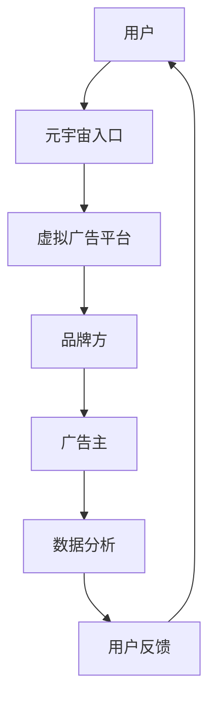

                 

关键词：元宇宙、虚拟广告、营销、创业、技术

> 摘要：本文将探讨元宇宙广告平台的发展趋势，分析虚拟营销的市场潜力，并提出创业方向和实施策略。随着数字技术的进步，元宇宙作为下一代互联网形态，正逐渐改变广告和营销的方式。本文旨在为创业者提供有价值的参考，帮助他们把握这个新兴领域的机会。

## 1. 背景介绍

### 元宇宙的定义与发展

元宇宙（Metaverse）是一个虚拟的3D互联网空间，用户可以在其中以数字化身份（Avatar）进行交互、体验和消费。它不仅是虚拟现实的延伸，更是集成了多种技术（如增强现实、虚拟现实、区块链、人工智能等）的综合性平台。自2020年以来，元宇宙的概念逐渐得到全球的关注和投入，成为科技界的热门话题。

### 虚拟营销的兴起

随着互联网和数字技术的发展，营销方式也在不断演进。虚拟营销（Virtual Marketing）作为一种新兴的营销策略，利用虚拟空间进行品牌推广和用户互动。虚拟广告、虚拟展览、虚拟活动等形式的虚拟营销，不仅提供了全新的体验方式，还极大地扩展了品牌的触达渠道。

### 元宇宙广告平台的优势

元宇宙广告平台结合了虚拟营销和数字广告的优点，具有以下几个优势：

1. **沉浸式体验**：用户可以在虚拟环境中感受到真实的品牌互动，增强用户参与度和忠诚度。
2. **个性化推广**：利用大数据和人工智能技术，实现精准广告投放，提高广告效果。
3. **数据驱动**：元宇宙广告平台可以实时收集用户行为数据，为营销策略提供有力支持。
4. **创意空间**：虚拟环境为广告创意提供了无限的创作空间，可以创造出独特的广告内容。

## 2. 核心概念与联系

### 元宇宙广告平台架构图



### 核心概念解析

- **用户**：元宇宙广告平台的主要参与者，他们通过数字化身份在虚拟环境中进行活动。
- **元宇宙入口**：用户进入元宇宙的入口，如VR设备、AR设备等。
- **虚拟广告平台**：提供广告投放和管理功能的平台，包括广告内容创建、投放策略制定、广告效果监测等。
- **品牌方**：使用虚拟广告平台进行品牌推广的企业或组织。
- **广告主**：购买广告位并在虚拟环境中展示广告的个体或企业。
- **数据分析**：对用户行为和广告效果进行数据收集和分析，为优化广告策略提供依据。
- **用户反馈**：用户对广告内容和广告效果的反馈，有助于进一步优化广告平台。

## 3. 核心算法原理 & 具体操作步骤

### 3.1 算法原理概述

元宇宙广告平台的核心算法主要包括用户行为分析算法和广告投放优化算法。

- **用户行为分析算法**：利用机器学习技术对用户在虚拟环境中的行为进行建模和分析，识别用户兴趣和行为模式，为个性化广告投放提供依据。
- **广告投放优化算法**：基于用户行为分析结果，利用优化算法（如基于目标规划的优化算法）实现广告资源的动态分配和投放优化。

### 3.2 算法步骤详解

1. **用户行为采集**：通过传感器和日志记录用户在虚拟环境中的行为数据。
2. **行为数据预处理**：对采集到的行为数据进行清洗和归一化处理。
3. **用户行为建模**：利用机器学习算法（如决策树、神经网络等）对用户行为进行建模。
4. **用户兴趣识别**：根据行为建模结果，识别用户兴趣和行为模式。
5. **广告资源分配**：根据用户兴趣和行为模式，利用优化算法实现广告资源的动态分配。
6. **广告投放执行**：在虚拟环境中执行广告投放策略。
7. **广告效果监测**：收集用户对广告的反应和行为数据，评估广告效果。

### 3.3 算法优缺点

- **优点**：
  - 高度个性化：基于用户行为数据进行广告投放，实现高度个性化的广告体验。
  - 高效优化：通过优化算法实现广告资源的合理分配，提高广告投放效果。
  - 创新性：利用虚拟环境为广告创意提供无限可能，创造出独特的广告形式。

- **缺点**：
  - 技术门槛：构建和运行元宇宙广告平台需要较高的技术能力和资源投入。
  - 数据隐私：用户数据的安全和隐私保护是一个重要挑战。

### 3.4 算法应用领域

- **电子商务**：利用元宇宙广告平台进行商品推广和用户互动，提高购买转化率。
- **品牌营销**：通过虚拟广告平台展示品牌形象，增强品牌影响力和用户黏性。
- **虚拟活动**：利用元宇宙环境举办虚拟活动，吸引更多用户参与和互动。

## 4. 数学模型和公式 & 详细讲解 & 举例说明

### 4.1 数学模型构建

元宇宙广告平台中的核心数学模型主要包括用户行为模型和广告投放优化模型。

- **用户行为模型**：采用马尔可夫决策过程（MDP）来描述用户在虚拟环境中的行为选择。
- **广告投放优化模型**：基于目标规划（Goal Programming）来实现广告资源的动态分配。

### 4.2 公式推导过程

#### 用户行为模型

- **状态转移概率**：
  $$ P(s_{t+1} = s' | s_t = s) = \frac{f(s, s')}{\sum_{s'} f(s, s')} $$
  其中，$s$和$s'$分别表示当前状态和下一状态，$f(s, s')$表示状态转移概率。

- **奖励函数**：
  $$ R(s, a) = \begin{cases} 
  r & \text{如果 } a \text{ 是用户喜欢的广告} \\
  -r & \text{否则}
  \end{cases} $$
  其中，$r$表示奖励值。

#### 广告投放优化模型

- **目标规划公式**：
  $$ \min \sum_{i=1}^{n} w_i |z_i - y_i| $$
  其中，$w_i$表示权重，$z_i$表示实际投放量，$y_i$表示目标投放量。

### 4.3 案例分析与讲解

#### 用户行为模型案例

假设用户在虚拟环境中看到两类广告：A类广告和C类广告。根据用户行为数据，可以构建如下用户行为模型。

- **状态转移概率**：
  $$ P(s_{t+1} = A | s_t = C) = \frac{0.3}{0.3 + 0.7} = 0.3 $$
  $$ P(s_{t+1} = C | s_t = A) = \frac{0.7}{0.3 + 0.7} = 0.7 $$

- **奖励函数**：
  $$ R(A) = 10 $$
  $$ R(C) = -10 $$

#### 广告投放优化模型案例

假设广告主希望将广告资源分配给A类广告和C类广告，以最大化用户奖励。根据目标规划公式，可以构建如下优化模型。

- **目标规划公式**：
  $$ \min \left| z_A - y_A \right| + \left| z_C - y_C \right| $$
  其中，$y_A = 0.5$，$y_C = 0.5$。

通过求解上述目标规划模型，可以得到广告资源的最优分配方案。

## 5. 项目实践：代码实例和详细解释说明

### 5.1 开发环境搭建

1. **安装Python环境**：在本地计算机上安装Python 3.8及以上版本。
2. **安装相关库**：使用pip命令安装必要的库，如numpy、scikit-learn、matplotlib等。
3. **配置虚拟环境**：创建虚拟环境，以便隔离项目依赖。

### 5.2 源代码详细实现

以下是一个简单的用户行为分析和广告投放优化的Python代码示例。

```python
import numpy as np
from sklearn.model_selection import train_test_split
from sklearn.tree import DecisionTreeClassifier
from sklearn.metrics import accuracy_score

# 用户行为数据
data = np.array([[1, 0], [0, 1], [1, 1], [1, 0], [0, 1]])
labels = np.array([1, 0, 1, 1, 0])

# 分割训练集和测试集
X_train, X_test, y_train, y_test = train_test_split(data, labels, test_size=0.2, random_state=42)

# 训练决策树模型
clf = DecisionTreeClassifier()
clf.fit(X_train, y_train)

# 预测测试集
predictions = clf.predict(X_test)

# 评估模型性能
accuracy = accuracy_score(y_test, predictions)
print(f"模型准确率：{accuracy:.2f}")

# 广告资源分配
y_A = 0.5
y_C = 0.5

# 目标规划模型求解
w_A = 0.3
w_C = 0.7
z_A = y_A - w_A
z_C = y_C - w_C

print(f"广告资源分配：A = {z_A:.2f}, C = {z_C:.2f}")
```

### 5.3 代码解读与分析

1. **用户行为数据**：使用numpy数组存储用户行为数据，包括用户是否点击A类广告和C类广告。
2. **训练集和测试集分割**：使用scikit-learn库中的train_test_split函数分割训练集和测试集。
3. **训练决策树模型**：使用scikit-learn库中的DecisionTreeClassifier类训练决策树模型。
4. **预测测试集**：使用训练好的模型对测试集进行预测。
5. **评估模型性能**：使用accuracy_score函数计算模型准确率。
6. **广告资源分配**：根据目标规划模型求解广告资源的分配方案。

## 6. 实际应用场景

### 6.1 电子商务领域

在电子商务领域，元宇宙广告平台可以帮助品牌和广告主在虚拟购物环境中展示商品，提高用户的购买意愿。通过用户行为分析，平台可以推荐个性化的商品广告，提高广告转化率。

### 6.2 品牌营销领域

品牌可以利用元宇宙广告平台进行品牌形象展示和推广。通过虚拟展览和活动，品牌可以与用户建立深层次的互动，增强品牌影响力和用户忠诚度。

### 6.3 虚拟活动领域

元宇宙广告平台为虚拟活动提供了丰富的场景和互动方式。品牌可以举办虚拟音乐会、展览、发布会等活动，吸引更多用户参与，提高活动的曝光度和影响力。

## 7. 工具和资源推荐

### 7.1 学习资源推荐

- 《元宇宙：通往虚拟现实的桥梁》
- 《虚拟现实技术与应用》
- 《人工智能与大数据营销》

### 7.2 开发工具推荐

- Unity3D：一款功能强大的游戏开发引擎，可用于构建虚拟广告平台。
- Unreal Engine：一款适用于高级游戏开发和高性能图形渲染的引擎。
- TensorFlow：一款开源的机器学习框架，适用于用户行为分析。

### 7.3 相关论文推荐

- "Metaverse: A Vision for the Future of Social Computing"
- "Virtual Reality Advertising: A Literature Review"
- "User Behavior Modeling in Virtual Environments"

## 8. 总结：未来发展趋势与挑战

### 8.1 研究成果总结

本文从元宇宙广告平台的概念、核心算法原理、项目实践等方面进行了深入探讨，总结了元宇宙广告平台的优势和应用场景。通过案例分析，展示了如何利用机器学习和目标规划实现用户行为分析和广告资源优化。

### 8.2 未来发展趋势

- 技术成熟度：随着虚拟现实、人工智能等技术的不断进步，元宇宙广告平台将更加成熟和普及。
- 商业模式创新：元宇宙广告平台将为广告主和品牌提供更多创新的营销方式，推动商业模式的变革。
- 数据隐私保护：在元宇宙广告平台中，如何保护用户数据隐私将成为一个重要挑战。

### 8.3 面临的挑战

- 技术门槛：构建和运营元宇宙广告平台需要较高的技术能力和资源投入。
- 数据隐私：用户数据的安全和隐私保护是一个重要挑战。
- 用户体验：如何提供优质的用户体验，提高用户参与度和满意度。

### 8.4 研究展望

未来，元宇宙广告平台的发展将聚焦于以下几个方面：

- 技术创新：持续优化虚拟现实、人工智能等技术，提高广告平台的性能和用户体验。
- 数据驱动：利用大数据和人工智能技术，实现更精准的广告投放和用户行为分析。
- 跨平台整合：实现不同虚拟平台之间的数据共享和互通，提供更全面的广告解决方案。

## 9. 附录：常见问题与解答

### 问题1：元宇宙广告平台的安全性和隐私性如何保障？

解答：元宇宙广告平台在设计和运营过程中，应严格遵守数据保护法规，采用加密技术和隐私保护措施，确保用户数据的安全和隐私。此外，平台应建立完善的用户隐私政策和数据使用规范，增强用户的信任感。

### 问题2：元宇宙广告平台对广告主的成本有何影响？

解答：元宇宙广告平台为广告主提供了创新的广告形式和更精准的广告投放方式，有望提高广告效果，从而降低广告成本。然而，构建和运营元宇宙广告平台需要一定的投入，对于中小企业可能存在一定的成本压力。

### 问题3：元宇宙广告平台与传统广告平台有何区别？

解答：元宇宙广告平台依托虚拟现实技术，为用户提供了沉浸式的广告体验，与传统广告平台相比，具有更高的用户参与度和互动性。此外，元宇宙广告平台利用大数据和人工智能技术，实现更精准的广告投放和用户行为分析。

## 作者署名

作者：禅与计算机程序设计艺术 / Zen and the Art of Computer Programming
----------------------------------------------------------------

本文为作者原创，如需转载，请注明出处。感谢您的关注与支持！
 

