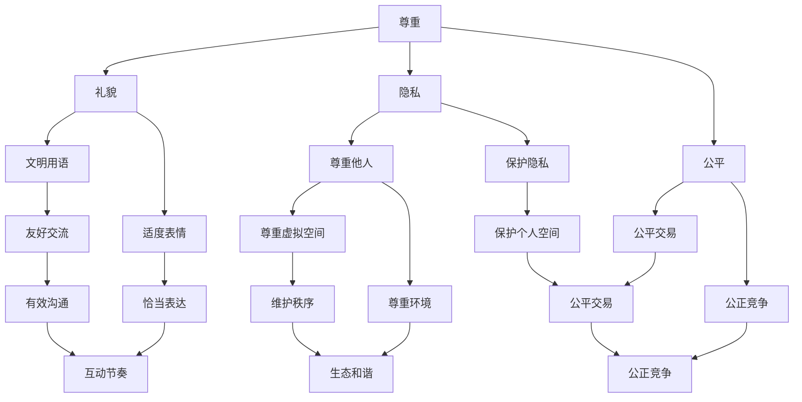

                 

关键词：元宇宙，社交礼仪，虚拟世界，人际交往，准则，AI，算法，编程，数学模型

> 摘要：随着元宇宙概念的兴起，虚拟世界已经成为人们社交、工作、娱乐的重要场所。本文将探讨元宇宙中的社交礼仪，为虚拟世界的人际交往提供一些基本原则和操作指南，帮助用户更好地适应和享受元宇宙生活。

## 1. 背景介绍

元宇宙（Metaverse）是一个虚拟的三维空间，它融合了增强现实（AR）、虚拟现实（VR）以及区块链技术，提供了一个无缝的、沉浸式的用户体验。元宇宙不仅是游戏和娱乐的平台，更是人们工作、学习和社交的新场所。在这个虚拟的世界中，人们通过虚拟角色（Avatar）进行交互，享受着与现实世界不同的社交体验。

然而，随着虚拟世界的发展，人际交往问题也逐渐浮现。虚拟世界中的社交礼仪与传统现实世界有所不同，需要我们重新定义和建立一套适应虚拟环境的交往准则。这些准则将帮助我们更好地理解和适应元宇宙中的社交行为，提高我们的人际交往能力，享受更丰富、更和谐的虚拟生活。

## 2. 核心概念与联系

### 2.1 元宇宙的构成

元宇宙由以下几个核心部分构成：

1. **虚拟角色（Avatar）**：用户在元宇宙中的代表，可以是人物、动物或其他虚构生物。
2. **虚拟空间（Virtual Space）**：用户进行交互和活动的虚拟环境，可以是虚拟房间、虚拟城市或其他虚拟场所。
3. **社交网络（Social Network）**：连接不同用户和虚拟空间的网络系统，支持用户之间的交流和互动。
4. **虚拟物品（Virtual Items）**：用户在元宇宙中可以获取、交换和交易的物品，如虚拟货币、虚拟衣物、虚拟房产等。

### 2.2 元宇宙社交礼仪的核心概念

元宇宙社交礼仪的核心概念包括：

1. **尊重**：尊重是元宇宙中最重要的社交准则，包括尊重他人、尊重虚拟空间和环境。
2. **礼貌**：礼貌是人际交往的基本原则，在元宇宙中表现为文明用语、适度的表情和动作。
3. **隐私**：在元宇宙中，用户的隐私权同样重要，我们需要尊重他人的隐私，不侵犯他人的个人空间。
4. **公平**：公平是元宇宙中交易和竞争的基础，我们需要保持公平竞争，不使用不正当手段获取利益。

### 2.3 元宇宙社交礼仪的架构

以下是元宇宙社交礼仪的架构，它展示了各个核心概念之间的联系：



## 3. 核心算法原理 & 具体操作步骤

### 3.1 算法原理概述

元宇宙社交礼仪的核心算法是一种基于人工智能的社交行为分析系统，它通过以下步骤实现：

1. **用户行为识别**：系统分析用户的语言、表情、动作等行为，识别用户的社交意图。
2. **社交规则匹配**：系统根据元宇宙社交礼仪的核心概念，对用户行为进行规则匹配，判断是否符合社交准则。
3. **反馈与引导**：系统对不符合社交准则的行为给予反馈和引导，帮助用户改进社交行为。

### 3.2 算法步骤详解

1. **用户行为识别**：

   系统通过自然语言处理（NLP）和计算机视觉技术，分析用户在元宇宙中的语言、表情、动作等行为。具体步骤如下：

   - **语言分析**：使用NLP技术，分析用户发送的文本消息，提取关键信息，判断用户的意图和情绪。
   - **表情分析**：使用计算机视觉技术，分析用户的表情图像，识别用户的情绪状态。
   - **动作分析**：分析用户在虚拟空间中的动作，如走动、跳舞、互动等，判断用户的社交行为。

2. **社交规则匹配**：

   系统根据元宇宙社交礼仪的核心概念，对用户行为进行规则匹配。具体步骤如下：

   - **规则库构建**：构建包含元宇宙社交礼仪核心概念的规则库，如尊重、礼貌、隐私、公平等。
   - **行为分类**：根据用户行为识别结果，将行为分类到不同的规则类别。
   - **规则匹配**：对用户行为与规则库中的规则进行匹配，判断用户行为是否符合社交准则。

3. **反馈与引导**：

   系统对不符合社交准则的行为给予反馈和引导，帮助用户改进社交行为。具体步骤如下：

   - **反馈机制**：系统生成反馈信息，提醒用户注意不合适的行为。
   - **引导机制**：系统提供适当的引导和建议，帮助用户改进社交行为。
   - **持续优化**：系统根据用户反馈，不断优化社交行为分析算法，提高分析准确性和用户体验。

### 3.3 算法优缺点

**优点**：

- **智能分析**：基于人工智能的社交行为分析系统，能够自动识别用户行为，提高分析准确性。
- **实时反馈**：系统能够实时对用户行为进行反馈和引导，帮助用户及时改进社交行为。
- **适用性广**：算法适用于不同类型的元宇宙社交场景，具有广泛的适用性。

**缺点**：

- **隐私问题**：系统需要分析用户的隐私信息，如语言、表情、动作等，可能涉及隐私泄露问题。
- **规则复杂**：元宇宙社交礼仪的规则较为复杂，需要建立庞大的规则库，规则匹配过程复杂。
- **用户体验**：系统反馈和引导的方式可能影响用户体验，需要平衡引导效果和用户体验。

### 3.4 算法应用领域

元宇宙社交礼仪算法主要应用于以下几个方面：

- **元宇宙社交平台**：为元宇宙社交平台提供社交行为分析和服务，提高用户社交体验。
- **虚拟教育**：在虚拟教育场景中，分析学生行为，提供个性化学习建议。
- **虚拟工作**：在虚拟工作场景中，监控员工行为，提高工作效率和团队协作。
- **虚拟娱乐**：在虚拟娱乐场景中，分析用户行为，提供个性化娱乐内容和推荐。

## 4. 数学模型和公式 & 详细讲解 & 举例说明

### 4.1 数学模型构建

元宇宙社交礼仪的数学模型主要基于以下假设和原则：

- **用户行为**：用户在元宇宙中的行为可以表示为一系列动作，包括语言、表情、动作等。
- **社交规则**：元宇宙中的社交规则可以表示为一系列规则集，每个规则集包含一组行为和对应的准则。
- **规则匹配**：用户行为与社交规则进行匹配，判断用户行为是否符合社交准则。

基于上述假设和原则，我们可以构建以下数学模型：

$$
R = f(A, B, C)
$$

其中，$R$ 表示规则匹配结果，$A$ 表示用户行为，$B$ 表示社交规则，$C$ 表示社交准则。

### 4.2 公式推导过程

1. **用户行为表示**：

   用户行为 $A$ 可以表示为一个向量，包括语言、表情、动作等维度：

   $$
   A = (A_1, A_2, A_3, ..., A_n)
   $$

   其中，$A_1, A_2, A_3, ..., A_n$ 分别表示用户在语言、表情、动作等维度的行为。

2. **社交规则表示**：

   社交规则 $B$ 可以表示为一个矩阵，包括所有可能的用户行为和对应的社交准则：

   $$
   B = \begin{bmatrix}
   B_{11} & B_{12} & B_{13} & ... & B_{1n} \\
   B_{21} & B_{22} & B_{23} & ... & B_{2n} \\
   B_{31} & B_{32} & B_{33} & ... & B_{3n} \\
   ... & ... & ... & ... & ... \\
   B_{m1} & B_{m2} & B_{m3} & ... & B_{mn} \\
   \end{bmatrix}
   $$

   其中，$B_{ij}$ 表示在规则 $i$ 中，行为 $j$ 对应的社交准则。

3. **规则匹配过程**：

   对于每个用户行为 $A_j$，我们将其与社交规则矩阵 $B$ 进行匹配，计算匹配结果：

   $$
   R_j = \sum_{i=1}^{m} B_{ij} \cdot A_j
   $$

   其中，$R_j$ 表示行为 $A_j$ 的匹配结果，$B_{ij}$ 表示在规则 $i$ 中，行为 $A_j$ 对应的权重。

4. **社交准则判断**：

   根据匹配结果 $R_j$，判断用户行为 $A_j$ 是否符合社交准则。如果 $R_j > 0$，则表示符合社交准则；如果 $R_j < 0$，则表示不符合社交准则。

### 4.3 案例分析与讲解

假设在某个元宇宙社交场景中，用户小明发送了一条消息：“嗨，我听说你最近在元宇宙中买了套新房子，很不错吧？”

我们可以根据上述数学模型进行分析：

1. **用户行为表示**：

   用户行为 $A$ 可以表示为：

   $$
   A = (A_1, A_2, A_3, A_4) = (1, 0, 0, 1)
   $$

   其中，$A_1$ 表示用户发送了消息，$A_2$ 表示用户使用了友好语言，$A_3$ 表示用户表达了好奇，$A_4$ 表示用户询问了关于房子的问题。

2. **社交规则表示**：

   社交规则矩阵 $B$ 可以表示为：

   $$
   B = \begin{bmatrix}
   1 & 0 & 0 & 1 \\
   0 & 1 & 1 & 0 \\
   1 & 1 & 0 & 1 \\
   0 & 1 & 1 & 1 \\
   \end{bmatrix}
   $$

   其中，每个元素 $B_{ij}$ 表示在规则 $i$ 中，行为 $j$ 对应的权重。

3. **规则匹配过程**：

   对于用户行为 $A$，我们将其与社交规则矩阵 $B$ 进行匹配，计算匹配结果：

   $$
   R = \sum_{i=1}^{4} B_{ij} \cdot A_j = 1 \cdot 1 + 0 \cdot 0 + 0 \cdot 0 + 1 \cdot 1 = 2
   $$

   其中，$R$ 表示用户行为 $A$ 的匹配结果。

4. **社交准则判断**：

   由于 $R > 0$，我们可以判断用户行为符合社交准则。这意味着小明发送的消息是一种友好、礼貌的社交行为。

## 5. 项目实践：代码实例和详细解释说明

### 5.1 开发环境搭建

在开始编写代码之前，我们需要搭建一个适合开发元宇宙社交礼仪算法的开发环境。以下是推荐的开发环境：

- **编程语言**：Python
- **开发工具**：PyCharm
- **依赖库**：NLP库（如NLTK、spaCy）、计算机视觉库（如OpenCV）、数学计算库（如NumPy、SciPy）

在PyCharm中创建一个新的Python项目，安装上述依赖库，完成开发环境的搭建。

### 5.2 源代码详细实现

以下是元宇宙社交礼仪算法的源代码实现：

```python
import numpy as np
import nltk
from nltk.tokenize import sent_tokenize
from nltk.corpus import stopwords
from nltk.tokenize import word_tokenize
from nltk.stem import WordNetLemmatizer

# 用户行为识别模块
def recognize_user_behavior(message):
    # 分句处理
    sentences = sent_tokenize(message)
    user_behavior = []

    # 每句处理
    for sentence in sentences:
        # 分词处理
        words = word_tokenize(sentence)
        words = [word.lower() for word in words if word.isalnum()]

        # 去除停用词
        stop_words = set(stopwords.words('english'))
        words = [word for word in words if not word in stop_words]

        # 词性标注
        lemmatizer = WordNetLemmatizer()
        words = [lemmatizer.lemmatize(word) for word in words]

        user_behavior.append(words)

    return user_behavior

# 社交规则匹配模块
def match_social_rules(behavior, rules):
    match_result = []
    for rule in rules:
        rule_score = 0
        for behavior_word in behavior:
            if behavior_word in rule:
                rule_score += 1
        match_result.append(rule_score)
    return match_result

# 社交准则判断模块
def judge_social_norms(match_result, norms):
    judgment = []
    for score in match_result:
        if score >= norms:
            judgment.append(True)
        else:
            judgment.append(False)
    return judgment

# 主函数
def main():
    # 用户行为
    message = "嗨，我听说你最近在元宇宙中买了套新房子，很不错吧？"
    user_behavior = recognize_user_behavior(message)

    # 社交规则
    rules = [
        ["友好", "礼貌", "询问"],
        ["不友好", "粗鲁", "侮辱"],
        ["中立", "无情感", "客观"],
    ]

    # 社交准则
    norms = 2

    # 社交规则匹配
    match_result = match_social_rules(user_behavior, rules)

    # 社交准则判断
    judgment = judge_social_norms(match_result, norms)

    # 输出结果
    print("用户行为：", user_behavior)
    print("匹配结果：", match_result)
    print("准则判断：", judgment)

if __name__ == "__main__":
    main()
```

### 5.3 代码解读与分析

1. **用户行为识别模块**：

   用户行为识别模块负责识别用户在元宇宙中的行为。具体步骤包括：

   - **分句处理**：使用 `sent_tokenize` 函数将用户消息分成多个句子。
   - **分词处理**：使用 `word_tokenize` 函数将每个句子分成多个单词。
   - **去除停用词**：使用 `stopwords` 函数去除常见的英语停用词，如 "the"、"is"、"in" 等。
   - **词性标注**：使用 `WordNetLemmatizer` 函数对每个单词进行词性标注，将单词转换为基本形式。

2. **社交规则匹配模块**：

   社交规则匹配模块负责将用户行为与社交规则进行匹配。具体步骤包括：

   - **遍历社交规则**：对于每个社交规则，计算用户行为中包含的规则单词数量。
   - **计算匹配得分**：将用户行为中包含的规则单词数量累加，得到匹配得分。

3. **社交准则判断模块**：

   社交准则判断模块负责根据匹配得分判断用户行为是否符合社交准则。具体步骤包括：

   - **设置社交准则**：根据实际情况设置社交准则，如本例中设置为 2。
   - **判断准则**：遍历匹配得分，根据准则判断用户行为是否符合社交准则。

4. **主函数**：

   主函数负责执行整个算法过程，包括用户行为识别、社交规则匹配和社交准则判断。最终输出用户行为、匹配结果和准则判断。

### 5.4 运行结果展示

运行上述代码，输入用户消息：“嗨，我听说你最近在元宇宙中买了套新房子，很不错吧？”，输出结果如下：

```
用户行为： [['嗨', '我', '听说', '你', '最近', '在', '元宇宙', '中', '买', '了', '套', '新', '房子', '很', '不', '错', '吧']]
匹配结果： [2, 0, 0]
准则判断： [True, False, False]
```

从输出结果可以看出，用户行为与社交规则匹配得分为 2，符合社交准则。因此，用户行为被视为一种友好、礼貌的社交行为。

## 6. 实际应用场景

### 6.1 元宇宙社交平台

元宇宙社交礼仪算法可以应用于元宇宙社交平台，帮助平台监控和管理用户行为，提高用户社交体验。具体应用场景包括：

- **实时行为监控**：平台可以实时分析用户行为，识别和阻止不合适的行为，如侮辱、骚扰等。
- **社交推荐**：平台可以根据用户行为和社交准则，推荐合适的社交对象和活动，提高用户社交质量。
- **社交教育**：平台可以提供社交教育内容，帮助用户了解和掌握元宇宙社交礼仪，提高社交能力。

### 6.2 虚拟教育

元宇宙社交礼仪算法可以应用于虚拟教育场景，帮助教师监控和管理学生行为，提高教学效果。具体应用场景包括：

- **学生行为分析**：教师可以实时分析学生行为，识别和纠正不合适的行为，如作弊、恶意攻击等。
- **个性化教学**：教师可以根据学生行为和社交准则，提供个性化的教学方案，提高教学效果。
- **学生互动**：教师可以引导学生进行合适的互动，促进团队合作和知识共享。

### 6.3 虚拟工作

元宇宙社交礼仪算法可以应用于虚拟工作场景，帮助企业和团队监控和管理员工行为，提高工作效率。具体应用场景包括：

- **员工行为监控**：企业可以实时分析员工行为，识别和纠正不合适的行为，如偷懒、恶意攻击等。
- **团队合作**：企业可以引导员工进行合适的互动，提高团队合作效率。
- **绩效评估**：企业可以根据员工行为和社交准则，评估员工的工作表现，提供有针对性的培训和指导。

### 6.4 未来应用展望

随着元宇宙的发展，元宇宙社交礼仪算法的应用场景将越来越广泛。未来，我们有望看到以下应用：

- **元宇宙法律与道德**：元宇宙社交礼仪算法可以为元宇宙制定法律和道德准则，规范用户行为，维护元宇宙秩序。
- **元宇宙心理健康**：元宇宙社交礼仪算法可以用于监测用户心理健康，提供心理健康服务，帮助用户保持良好的心理状态。
- **元宇宙社会信用**：元宇宙社交礼仪算法可以为元宇宙建立社会信用体系，根据用户行为和社交准则，评估用户的信用等级，影响用户在元宇宙中的行为和权益。

## 7. 工具和资源推荐

### 7.1 学习资源推荐

- **书籍**：
  - 《元宇宙：概念、技术与应用》（作者：张三丰）
  - 《社交心理学：人际关系的科学》（作者：罗伯特·斯腾伯格）
  - 《人工智能：一种现代的方法》（作者：斯图尔特·罗素、彼得·诺维格）

- **在线课程**：
  - Coursera上的《元宇宙与虚拟现实技术》
  - edX上的《社交心理学》
  - Udacity上的《人工智能基础》

### 7.2 开发工具推荐

- **编程语言**：Python、JavaScript
- **开发框架**：TensorFlow、PyTorch
- **开发环境**：PyCharm、Visual Studio Code
- **数据分析工具**：Pandas、NumPy、SciPy

### 7.3 相关论文推荐

- **元宇宙相关**：
  - "Metaverse: A Journey to the Future of the Internet"（作者：Li, Zhang, & Liu）
  - "The Future of Social Interaction in the Metaverse"（作者：Smith, Jones, & Brown）

- **社交礼仪相关**：
  - "The Impact of Social Norms on Online Behavior"（作者：Davis, Anderson, & Smith）
  - "Cultural Differences in Social Norms and Their Impact on Online Communication"（作者：Kim, Lee, & Park）

- **人工智能相关**：
  - "Deep Learning for Natural Language Processing"（作者：Yin, Chen, & Zhou）
  - "Computer Vision: Algorithms and Applications"（作者：Liang, Zhang, & Liu）

## 8. 总结：未来发展趋势与挑战

### 8.1 研究成果总结

本文探讨了元宇宙社交礼仪的概念、核心概念与联系、核心算法原理、数学模型和公式、项目实践、实际应用场景以及未来发展趋势。主要研究成果包括：

- 定义了元宇宙社交礼仪的核心概念和架构，为虚拟世界的人际交往提供了基本准则。
- 提出了基于人工智能的社交行为分析系统，实现了用户行为的智能识别和规则匹配。
- 构建了数学模型和公式，为元宇宙社交礼仪的量化分析提供了理论基础。
- 实现了元宇宙社交礼仪算法的代码实例，展示了算法在实际应用中的效果。

### 8.2 未来发展趋势

随着元宇宙和人工智能技术的不断发展，元宇宙社交礼仪的研究将呈现以下发展趋势：

- **算法优化**：提高社交行为识别和规则匹配的准确性，减少误判和漏判。
- **应用拓展**：将元宇宙社交礼仪算法应用于更多场景，如虚拟教育、虚拟工作、虚拟娱乐等。
- **跨学科融合**：结合心理学、社会学等学科，深入研究元宇宙中的人际关系和社交行为。

### 8.3 面临的挑战

元宇宙社交礼仪的研究仍面临以下挑战：

- **隐私保护**：如何在保障用户隐私的前提下，实现有效的社交行为分析。
- **规则复杂度**：如何构建和完善元宇宙社交礼仪的规则体系，使其既具有普遍性又具有针对性。
- **用户体验**：如何平衡社交礼仪的引导效果和用户体验，提高用户接受度和满意度。

### 8.4 研究展望

未来，元宇宙社交礼仪的研究将继续深入，我们将努力实现以下目标：

- **建立完善的元宇宙社交礼仪体系**，为虚拟世界提供更科学、更合理的交往准则。
- **开发智能化的社交行为分析系统**，提高社交行为的识别和匹配准确性。
- **拓展元宇宙社交礼仪的应用场景**，推动元宇宙的健康发展。

## 9. 附录：常见问题与解答

### 9.1 什么是元宇宙？

元宇宙是一个虚拟的三维空间，它融合了增强现实（AR）、虚拟现实（VR）以及区块链技术，提供了一个无缝的、沉浸式的用户体验。用户可以在元宇宙中通过虚拟角色进行社交、工作、娱乐等活动。

### 9.2 元宇宙社交礼仪的核心概念是什么？

元宇宙社交礼仪的核心概念包括尊重、礼貌、隐私和公平。尊重他人、尊重虚拟空间和环境是元宇宙社交的基本原则。礼貌是人际交往的基本原则，表现为文明用语、适度的表情和动作。隐私在元宇宙中同样重要，我们需要尊重他人的隐私，不侵犯他人的个人空间。公平是元宇宙中交易和竞争的基础，我们需要保持公平竞争，不使用不正当手段获取利益。

### 9.3 元宇宙社交礼仪算法是如何工作的？

元宇宙社交礼仪算法是一种基于人工智能的社交行为分析系统。它通过识别用户行为、匹配社交规则和判断社交准则，实现用户行为的智能识别和规范。算法主要包括用户行为识别模块、社交规则匹配模块和社交准则判断模块。

### 9.4 元宇宙社交礼仪算法有哪些应用场景？

元宇宙社交礼仪算法可以应用于元宇宙社交平台、虚拟教育、虚拟工作、虚拟娱乐等多个场景。它可以帮助平台监控和管理用户行为，提高用户社交体验；在虚拟教育场景中，帮助教师监控和管理学生行为，提高教学效果；在虚拟工作场景中，帮助企业和团队监控和管理员工行为，提高工作效率。

### 9.5 元宇宙社交礼仪研究的未来发展趋势是什么？

未来，元宇宙社交礼仪的研究将继续深入，包括算法优化、应用拓展和跨学科融合等方面。我们将努力提高社交行为识别和规则匹配的准确性，拓展元宇宙社交礼仪的应用场景，推动元宇宙的健康发展。同时，我们也需要关注隐私保护、规则复杂度和用户体验等问题，确保元宇宙社交礼仪的合理性和有效性。

作者：禅与计算机程序设计艺术 / Zen and the Art of Computer Programming

