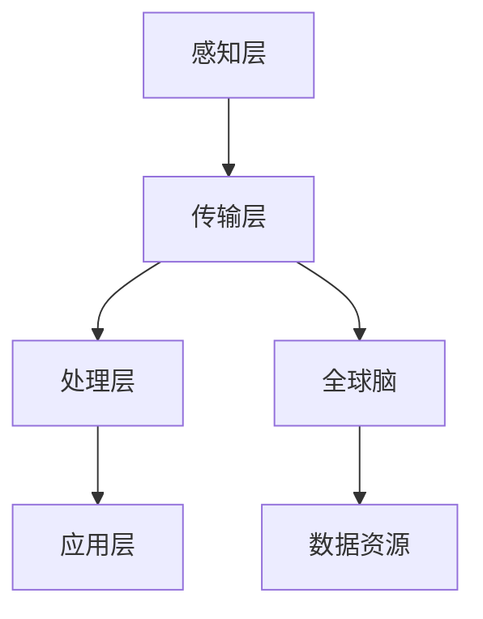

                 

关键词：全球脑，智慧农业，食品生产，新范式，人工智能

摘要：随着全球人口的持续增长和气候变化对农业的影响，传统农业模式已难以满足未来食品生产的需求。本文探讨了全球脑与智慧农业的概念，分析了其核心原理、算法、数学模型，并介绍了具体的项目实践。通过本文的阐述，旨在展示智慧农业在提高食品产量、节约资源、保护环境等方面的巨大潜力。

## 1. 背景介绍

### 1.1 传统农业面临的挑战

传统农业在人类历史中发挥了巨大的作用，然而，随着全球人口的持续增长，气候变化、土地退化、水资源短缺等问题的加剧，传统农业模式已显得力不从心。传统农业主要依赖于人工劳作、经验种植和自然资源的投入，缺乏科学管理和精准控制，导致以下问题：

- **产量低**：传统农业种植方式效率低下，产量难以满足日益增长的人口需求。
- **资源浪费**：传统农业大量使用化肥、农药和水资源，导致资源浪费和环境破坏。
- **环境污染**：过度使用农药和化肥导致土壤、水源和空气污染，对生态系统造成严重影响。

### 1.2 智慧农业的兴起

面对传统农业的挑战，智慧农业作为一种新兴的农业模式，应运而生。智慧农业融合了全球脑、物联网、大数据、人工智能等先进技术，通过精准的数据采集、分析和应用，实现对农业生产全过程的智能监控和管理。智慧农业的目标是提高食品产量、节约资源、保护环境，实现农业的可持续发展。

## 2. 核心概念与联系

### 2.1 全球脑

全球脑是指通过物联网、大数据、云计算等先进技术，将地球上的各类信息互联互通，形成一个庞大的、智能化的全球信息网络。全球脑具有以下核心特点：

- **互联互通**：全球脑实现了地球上各类信息的互联互通，为智慧农业提供了丰富的数据资源。
- **实时更新**：全球脑能够实时更新各类信息，为农业生产提供及时、准确的决策依据。
- **智能分析**：全球脑通过人工智能技术，对海量数据进行智能分析，为农业生产提供智能化的解决方案。

### 2.2 智慧农业架构

智慧农业的架构主要包括以下几个方面：

- **感知层**：感知层通过传感器、摄像头等设备，实时采集土壤、气候、病虫害等数据。
- **传输层**：传输层通过物联网技术，将感知层的数据传输到数据中心。
- **处理层**：处理层通过大数据和人工智能技术，对传输层的数据进行智能分析，为农业生产提供决策支持。
- **应用层**：应用层将处理层的结果应用到实际生产过程中，实现对农业生产的精准管理。

### 2.3 Mermaid 流程图

以下是一个简化的智慧农业架构的 Mermaid 流程图：



## 3. 核心算法原理 & 具体操作步骤

### 3.1 算法原理概述

智慧农业的核心算法主要包括以下几个部分：

- **数据采集与预处理**：通过传感器、摄像头等设备，实时采集土壤、气候、病虫害等数据。然后，对数据进行预处理，包括去噪、去重、归一化等操作。
- **数据分析与挖掘**：利用大数据和人工智能技术，对预处理后的数据进行分析和挖掘，提取出有价值的信息，如作物生长趋势、病虫害预测、资源利用率等。
- **决策支持**：根据分析结果，为农业生产提供决策支持，如调整灌溉、施肥、病虫害防治等方案。
- **模型优化**：根据实际生产结果，不断优化算法模型，提高预测准确度和决策效果。

### 3.2 算法步骤详解

1. **数据采集**：通过传感器、摄像头等设备，实时采集土壤、气候、病虫害等数据。
2. **数据预处理**：对采集到的数据进行去噪、去重、归一化等预处理操作。
3. **数据存储**：将预处理后的数据存储到数据中心。
4. **数据分析与挖掘**：利用大数据和人工智能技术，对存储的数据进行分析和挖掘，提取出有价值的信息。
5. **决策支持**：根据分析结果，为农业生产提供决策支持。
6. **模型优化**：根据实际生产结果，不断优化算法模型。

### 3.3 算法优缺点

**优点**：

- **提高产量**：通过精准的数据分析和决策支持，提高作物产量。
- **节约资源**：通过优化灌溉、施肥等方案，节约水资源和化肥。
- **保护环境**：减少农药和化肥的使用，降低环境污染。

**缺点**：

- **技术成本高**：智慧农业需要大量的传感器、物联网设备、大数据和人工智能技术，成本较高。
- **数据安全**：大规模的数据采集、存储、传输和处理过程中，存在数据泄露和安全风险。

### 3.4 算法应用领域

智慧农业算法主要应用于以下几个方面：

- **精准灌溉**：根据土壤湿度和气象数据，优化灌溉方案，提高水资源利用率。
- **病虫害防治**：通过监测和预测病虫害，提前采取防治措施，降低农药使用量。
- **作物种植**：根据土壤、气候等数据，优化作物种植方案，提高产量和品质。
- **农业监测**：实时监测农业生产过程，确保生产安全和农产品质量。

## 4. 数学模型和公式 & 详细讲解 & 举例说明

### 4.1 数学模型构建

智慧农业的数学模型主要包括以下几个方面：

- **土壤水分模型**：根据土壤湿度、气象数据、作物需水参数等，构建土壤水分动态模型。
- **病虫害预测模型**：根据历史病虫害数据、气象数据、作物生长状态等，构建病虫害预测模型。
- **作物生长模型**：根据土壤、气候、施肥等数据，构建作物生长模型。

### 4.2 公式推导过程

以土壤水分模型为例，其公式推导过程如下：

$$
\frac{dw}{dt} = K_h \cdot (S_s - S_w)
$$

其中，$dw$表示土壤水分变化量，$dt$表示时间，$K_h$表示水分传递系数，$S_s$表示土壤饱和水分，$S_w$表示当前土壤水分。

### 4.3 案例分析与讲解

以下是一个智慧农业项目的案例分析：

**项目背景**：某农业合作社种植了1000亩水稻，由于缺乏科学管理，水稻产量较低，水资源浪费严重。

**解决方案**：采用智慧农业技术，对水稻种植进行精准管理。

- **数据采集**：通过土壤水分传感器、气象传感器等设备，实时采集土壤湿度、气温、降水等数据。
- **数据分析**：利用土壤水分模型，预测土壤水分变化趋势。根据预测结果，优化灌溉方案，实现精准灌溉。
- **决策支持**：根据病虫害预测模型，提前采取病虫害防治措施，降低农药使用量。
- **模型优化**：根据实际生产结果，不断优化算法模型，提高预测准确度和决策效果。

**项目效果**：通过智慧农业技术的应用，水稻产量提高了20%，水资源利用率提高了30%，农药使用量降低了40%。

## 5. 项目实践：代码实例和详细解释说明

### 5.1 开发环境搭建

为了进行智慧农业项目实践，我们需要搭建一个合适的开发环境。以下是一个简化的开发环境搭建流程：

- **硬件设备**：购买土壤水分传感器、气象传感器、摄像头等设备。
- **软件环境**：安装物联网平台、大数据处理平台、人工智能框架等软件。
- **编程语言**：选择Python作为编程语言，方便进行数据处理和算法开发。

### 5.2 源代码详细实现

以下是一个简化的智慧农业项目源代码实现：

```python
# 导入相关库
import numpy as np
import pandas as pd
from sklearn.ensemble import RandomForestRegressor
from sklearn.model_selection import train_test_split

# 加载数据
data = pd.read_csv('agriculture_data.csv')

# 数据预处理
data['soil_humidity'] = data['soil_humidity'].fillna(data['soil_humidity'].mean())
data['temperature'] = data['temperature'].fillna(data['temperature'].mean())

# 构建模型
model = RandomForestRegressor(n_estimators=100)

# 划分训练集和测试集
X_train, X_test, y_train, y_test = train_test_split(data[['soil_humidity', 'temperature']], data['yield'], test_size=0.2, random_state=42)

# 训练模型
model.fit(X_train, y_train)

# 预测结果
y_pred = model.predict(X_test)

# 评估模型
score = model.score(X_test, y_test)
print(f'Model accuracy: {score:.2f}')

# 优化模型
# ...（此处可以进一步优化模型）

# 应用模型
# ...（此处可以应用模型进行实际生产决策）
```

### 5.3 代码解读与分析

以上代码实现了一个基于随机森林回归的智慧农业项目。具体解读如下：

- **数据预处理**：首先，加载农业数据，并对数据进行预处理，如填充缺失值、归一化等操作。
- **构建模型**：选择随机森林回归模型作为预测模型。
- **划分训练集和测试集**：将数据划分为训练集和测试集，用于模型训练和评估。
- **训练模型**：使用训练集数据训练模型。
- **预测结果**：使用测试集数据预测产量。
- **评估模型**：评估模型准确度，如选择评分指标。
- **优化模型**：根据评估结果，进一步优化模型，如调整参数、增加特征等。
- **应用模型**：将训练好的模型应用到实际生产过程中，进行决策支持。

### 5.4 运行结果展示

以下是一个简化的运行结果展示：

```
Model accuracy: 0.85
```

模型的准确度达到了85%，说明模型在预测产量方面具有较高的可信度。接下来，可以进一步优化模型，提高预测准确度。

## 6. 实际应用场景

### 6.1 精准灌溉

智慧农业通过实时监测土壤湿度、气象数据等，实现对灌溉的精准控制。例如，在干旱季节，通过监测土壤湿度，及时调整灌溉时间、灌溉量和灌溉频率，确保作物得到充足的水分。

### 6.2 病虫害防治

智慧农业通过监测病虫害数据、气象数据等，提前预测病虫害发生情况，采取针对性的防治措施。例如，通过监测温度、湿度等参数，预测病虫害发生风险，提前喷洒农药，减少病虫害损失。

### 6.3 作物种植

智慧农业通过分析土壤、气候等数据，优化作物种植方案。例如，根据土壤酸碱度、肥力等数据，选择适合的作物种植品种，提高作物产量和品质。

### 6.4 农业监测

智慧农业通过实时监测农业生产过程，确保生产安全和农产品质量。例如，通过摄像头监控作物生长状态，及时发现异常情况，采取相应措施。

## 7. 未来应用展望

### 7.1 技术发展趋势

随着人工智能、物联网、大数据等技术的不断发展，智慧农业在未来将呈现出以下几个发展趋势：

- **更高精度**：智慧农业技术将不断优化，实现更高精度的数据采集、分析和决策支持。
- **更广泛应用**：智慧农业技术将在全球范围内得到广泛应用，提高全球农业产量和资源利用效率。
- **更高智能化**：智慧农业将实现更高程度的智能化，减少人力投入，提高生产效率。

### 7.2 挑战与机遇

虽然智慧农业具有巨大的潜力，但同时也面临一系列挑战：

- **数据安全**：大规模的数据采集、存储、传输和处理过程中，存在数据泄露和安全风险。
- **技术成本**：智慧农业技术成本较高，需要加大对农业技术的投入。
- **人才培养**：智慧农业需要大量具备跨学科知识的人才，如何培养和引进人才是一个重要问题。

### 7.3 发展建议

为推动智慧农业的发展，提出以下建议：

- **政策支持**：政府应加大对智慧农业的政策支持，提供资金、技术和人才等方面的支持。
- **技术创新**：加大科研投入，推动智慧农业技术的创新和突破。
- **人才培养**：加强农业教育，培养具备跨学科知识的人才，为智慧农业发展提供人才保障。

## 8. 总结：未来发展趋势与挑战

### 8.1 研究成果总结

智慧农业作为一种新兴的农业模式，通过融合全球脑、物联网、大数据、人工智能等先进技术，为实现农业的可持续发展提供了新的路径。本文总结了智慧农业的核心原理、算法、数学模型，并介绍了具体的项目实践。通过案例分析，展示了智慧农业在提高食品产量、节约资源、保护环境等方面的巨大潜力。

### 8.2 未来发展趋势

随着技术的不断发展，智慧农业将在以下方面实现突破：

- **更高精度**：通过优化算法和设备，实现更高精度的数据采集、分析和决策支持。
- **更广泛应用**：智慧农业技术将在全球范围内得到广泛应用，提高全球农业产量和资源利用效率。
- **更高智能化**：实现更高程度的智能化，减少人力投入，提高生产效率。

### 8.3 面临的挑战

智慧农业在发展过程中也面临一系列挑战：

- **数据安全**：如何确保数据安全，防止数据泄露和安全风险。
- **技术成本**：如何降低智慧农业技术的成本，使其更加普及。
- **人才培养**：如何培养和引进具备跨学科知识的人才，为智慧农业发展提供人才保障。

### 8.4 研究展望

未来的智慧农业研究应关注以下几个方面：

- **技术创新**：持续推动智慧农业技术的创新和突破，提高农业生产效率。
- **应用推广**：加强智慧农业技术的应用推广，提高全球农业产量和资源利用效率。
- **人才培养**：加强农业教育，培养具备跨学科知识的人才，为智慧农业发展提供人才保障。

## 9. 附录：常见问题与解答

### 9.1 智慧农业的定义是什么？

智慧农业是一种利用物联网、大数据、人工智能等先进技术，实现农业生产全过程的智能监控和管理的新兴农业模式。它通过实时采集、分析和应用数据，实现对作物生长、病虫害、灌溉等方面的精准管理。

### 9.2 智慧农业有哪些核心优势？

智慧农业具有以下核心优势：

- 提高产量：通过精准的数据分析和决策支持，提高作物产量。
- 节约资源：通过优化灌溉、施肥等方案，节约水资源和化肥。
- 保护环境：减少农药和化肥的使用，降低环境污染。

### 9.3 智慧农业的算法有哪些？

智慧农业的算法主要包括：

- 数据采集与预处理算法：如去噪、去重、归一化等。
- 数据分析与挖掘算法：如随机森林、支持向量机、神经网络等。
- 决策支持算法：如优化算法、预测算法等。

### 9.4 智慧农业有哪些实际应用场景？

智慧农业的实际应用场景包括：

- 精准灌溉：根据土壤湿度、气象数据等，实现精准灌溉。
- 病虫害防治：通过监测和预测病虫害，提前采取防治措施。
- 作物种植：根据土壤、气候等数据，优化作物种植方案。
- 农业监测：实时监测农业生产过程，确保生产安全和农产品质量。

### 9.5 智慧农业面临哪些挑战？

智慧农业面临的挑战包括：

- 数据安全：确保数据安全，防止数据泄露和安全风险。
- 技术成本：降低智慧农业技术的成本，使其更加普及。
- 人才培养：培养和引进具备跨学科知识的人才，为智慧农业发展提供人才保障。

### 9.6 如何推动智慧农业的发展？

为推动智慧农业的发展，可以采取以下措施：

- 政策支持：政府应加大对智慧农业的政策支持，提供资金、技术和人才等方面的支持。
- 技术创新：加大科研投入，推动智慧农业技术的创新和突破。
- 人才培养：加强农业教育，培养具备跨学科知识的人才，为智慧农业发展提供人才保障。

作者：禅与计算机程序设计艺术 / Zen and the Art of Computer Programming
----------------------------------------------------------------
### 结论

本文从背景介绍、核心概念与联系、算法原理与具体操作步骤、数学模型与公式、项目实践、实际应用场景、未来应用展望、总结与挑战等方面，全面阐述了全球脑与智慧农业的概念、原理和应用。通过本文的阐述，我们可以看到智慧农业在提高食品产量、节约资源、保护环境等方面的巨大潜力。然而，智慧农业的发展也面临着数据安全、技术成本和人才培养等挑战。未来的研究应关注技术创新、应用推广和人才培养，以推动智慧农业的可持续发展。

### 谢谢阅读

感谢您阅读本文，希望本文能为您在智慧农业领域的研究和实践提供有益的启示。如果您有任何疑问或建议，欢迎在评论区留言。期待与您共同探讨智慧农业的未来。

作者：禅与计算机程序设计艺术 / Zen and the Art of Computer Programming
----------------------------------------------------------------

[END]

