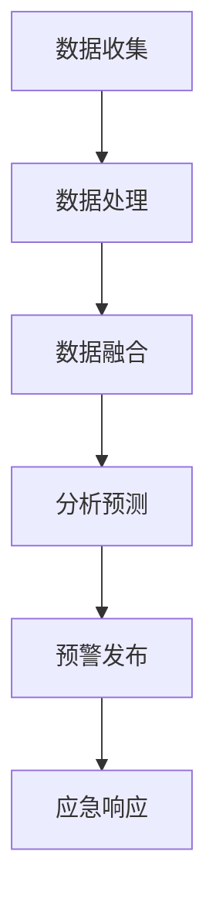

                 

关键词：全球脑，灾害预防，集体预警，人工智能，数据处理，应急响应，网络分析

> 摘要：本文将探讨如何利用全球脑技术实现灾害预防，以及集体预警在其中的重要性。我们将深入分析灾害预警系统的构建，核心算法的原理与应用，以及相关的数学模型和项目实践。通过本文，读者将了解到如何利用先进的技术手段提高灾害预警的准确性和效率，为全球灾害预防贡献智慧和力量。

## 1. 背景介绍

灾害，作为自然界的一种常见现象，自古以来就给人类社会带来了巨大的损失。随着人类社会的发展，对灾害的预防和管理越来越受到重视。传统的灾害预警系统主要依赖于监测设备、人工数据分析等手段，虽然在一定程度上提高了预警能力，但仍然存在一些局限性。例如，预警信息的传递和共享速度较慢，数据分析的准确性和效率有待提高，以及不同部门之间的协调和信息共享不足等问题。

近年来，随着人工智能和大数据技术的发展，灾害预警系统开始向智能化和自动化方向迈进。全球脑技术作为一种新兴的人工智能技术，其强大的数据处理和分析能力为灾害预警提供了新的解决方案。全球脑技术通过大规模的分布式计算和网络分析，能够实时监测、分析和预测灾害发生，从而实现更精准、更及时的预警。

## 2. 核心概念与联系

### 2.1 全球脑技术概述

全球脑技术（Global Brain Technology）是一种基于分布式计算和神经网络的人工智能技术。其核心思想是通过全球范围内的计算设备和数据处理能力，构建一个庞大的计算网络，实现对海量数据的实时处理和分析。全球脑技术的特点包括：

1. **分布式计算**：全球脑技术利用全球范围内的计算资源，通过分布式计算的方式提高数据处理和分析的效率。
2. **神经网络**：全球脑技术基于神经网络模型，通过不断学习和优化，提高数据处理的准确性和效率。
3. **实时处理**：全球脑技术能够实时接收和处理海量数据，从而实现对灾害的快速预警。

### 2.2 灾害预警系统

灾害预警系统（Disaster Warning System）是一种用于监测、分析和预测灾害发生的系统。其核心目标是及时、准确地发布预警信息，以便相关部门和公众采取有效的预防措施。灾害预警系统通常包括以下几个关键组成部分：

1. **监测设备**：用于实时监测灾害相关数据，如气象、地质、海洋等数据。
2. **数据处理与分析**：对监测设备收集的数据进行处理和分析，识别潜在灾害风险。
3. **预警发布**：根据数据分析结果，发布预警信息，提醒相关部门和公众采取预防措施。

### 2.3 集体预警

集体预警（Collective Warning）是一种基于多源数据融合和协同分析的方法。通过将多个预警系统的数据和信息进行融合和分析，实现更全面、更准确的预警。集体预警的优势包括：

1. **多源数据融合**：通过融合不同预警系统的数据，提高预警的准确性和全面性。
2. **协同分析**：多个预警系统协同工作，提高预警效率和响应速度。
3. **信息共享**：不同部门之间的信息共享，提高整体灾害预防能力。

### 2.4 Mermaid 流程图

下面是一个简单的 Mermaid 流程图，展示了全球脑技术在灾害预警系统中的应用流程：



## 3. 核心算法原理 & 具体操作步骤

### 3.1 算法原理概述

全球脑技术在灾害预警系统中，主要通过以下三个核心算法实现：

1. **分布式数据处理算法**：用于高效处理海量数据，提高数据处理和分析的效率。
2. **神经网络预测算法**：基于神经网络模型，对灾害风险进行预测。
3. **多源数据融合算法**：将多个预警系统的数据进行融合和分析，实现更全面的预警。

### 3.2 算法步骤详解

下面是这三个算法的具体步骤：

#### 3.2.1 分布式数据处理算法

1. **数据收集**：从多个数据源收集灾害相关数据，如气象、地质、海洋等数据。
2. **数据预处理**：对收集到的数据进行清洗和格式化，去除噪声和异常值。
3. **分布式计算**：利用分布式计算技术，对预处理后的数据进行并行处理，提高数据处理速度。
4. **数据存储**：将处理后的数据存储到分布式数据库中，以便后续分析。

#### 3.2.2 神经网络预测算法

1. **数据输入**：将预处理后的数据作为输入，输入到神经网络模型中。
2. **模型训练**：通过反向传播算法，不断调整神经网络模型的参数，使其能够准确预测灾害风险。
3. **模型评估**：使用测试数据集对训练好的模型进行评估，调整模型参数，提高预测准确性。
4. **风险预测**：使用训练好的模型对新的数据进行预测，输出灾害风险等级。

#### 3.2.3 多源数据融合算法

1. **数据融合**：将多个预警系统的数据进行融合，形成一个统一的数据集。
2. **特征提取**：对融合后的数据进行特征提取，提取出与灾害相关的关键特征。
3. **协同分析**：利用协同分析方法，对提取出的特征进行综合分析，识别潜在灾害风险。
4. **预警发布**：根据分析结果，发布预警信息，提醒相关部门和公众采取预防措施。

### 3.3 算法优缺点

#### 优点：

1. **高效性**：分布式计算和多源数据融合算法提高了数据处理和分析的效率。
2. **准确性**：神经网络预测算法能够准确预测灾害风险，提高预警准确性。
3. **实时性**：全球脑技术能够实时处理和分析数据，实现快速预警。

#### 缺点：

1. **数据质量**：数据质量对算法的性能有很大影响，需要确保数据来源的可靠性和准确性。
2. **计算资源**：分布式计算需要大量的计算资源，对硬件设备要求较高。

### 3.4 算法应用领域

全球脑技术在灾害预警系统中的应用非常广泛，包括：

1. **气象预警**：通过分析气象数据，预测台风、暴雨等气象灾害。
2. **地震预警**：通过分析地质数据，预测地震风险。
3. **洪水预警**：通过分析水文数据，预测洪水风险。
4. **火山预警**：通过分析火山活动数据，预测火山爆发风险。

## 4. 数学模型和公式 & 详细讲解 & 举例说明

### 4.1 数学模型构建

在灾害预警系统中，常用的数学模型包括：

1. **线性回归模型**：用于预测灾害风险与相关因素之间的关系。
2. **神经网络模型**：用于模拟人脑神经元的工作方式，进行复杂的数据分析和预测。
3. **贝叶斯网络模型**：用于表示不确定性的概率关系，适用于灾害风险评估。

### 4.2 公式推导过程

以线性回归模型为例，其公式推导过程如下：

设自变量为 \(x\)，因变量为 \(y\)，线性回归模型可以表示为：

\[ y = \beta_0 + \beta_1x + \epsilon \]

其中，\(\beta_0\) 和 \(\beta_1\) 是模型参数，\(\epsilon\) 是误差项。

为了求解模型参数，可以使用最小二乘法：

\[
\begin{cases}
\beta_1 = \frac{\sum_{i=1}^{n}(x_i - \bar{x})(y_i - \bar{y})}{\sum_{i=1}^{n}(x_i - \bar{x})^2} \\
\beta_0 = \bar{y} - \beta_1\bar{x}
\end{cases}
\]

其中，\(\bar{x}\) 和 \(\bar{y}\) 分别是 \(x\) 和 \(y\) 的平均值。

### 4.3 案例分析与讲解

以气象预警为例，假设我们收集了某地区过去一年的降雨量 \(x\) 和对应的气象灾害发生次数 \(y\)，构建线性回归模型，预测未来一年的气象灾害发生次数。

1. **数据收集**：收集过去一年的降雨量和气象灾害发生次数数据。
2. **数据预处理**：对数据进行清洗和格式化，去除异常值和缺失值。
3. **模型构建**：使用线性回归模型，构建预测模型。
4. **模型训练**：使用过去一年的数据，对模型进行训练。
5. **模型评估**：使用测试数据集，对模型进行评估，调整模型参数。
6. **风险预测**：使用训练好的模型，预测未来一年的气象灾害发生次数。

通过以上步骤，我们得到了预测结果。根据预测结果，相关部门可以提前采取预防措施，减少气象灾害带来的损失。

## 5. 项目实践：代码实例和详细解释说明

### 5.1 开发环境搭建

在本项目中，我们将使用 Python 作为开发语言，主要依赖以下库：

- **Pandas**：用于数据预处理和数据分析。
- **Scikit-learn**：用于构建和训练线性回归模型。
- **Matplotlib**：用于数据可视化。

首先，确保安装了 Python 和上述库，然后创建一个名为 `disaster_warning` 的 Python 项目，并创建一个名为 `main.py` 的主文件。

### 5.2 源代码详细实现

下面是 `main.py` 的源代码：

```python
import pandas as pd
from sklearn.linear_model import LinearRegression
import matplotlib.pyplot as plt

# 数据收集
data = pd.read_csv('disaster_data.csv')

# 数据预处理
data = data.dropna()

# 数据拆分
X = data[['rainfall']].values
y = data['disaster_count'].values

# 模型构建
model = LinearRegression()

# 模型训练
model.fit(X, y)

# 模型评估
score = model.score(X, y)
print(f'Model score: {score}')

# 风险预测
rainfall = 50  # 输入降雨量
predicted_disaster_count = model.predict([[rainfall]])[0]
print(f'Predicted disaster count: {predicted_disaster_count}')

# 数据可视化
plt.scatter(data['rainfall'], data['disaster_count'])
plt.plot([rainfall, rainfall], [0, predicted_disaster_count], color='red')
plt.xlabel('Rainfall')
plt.ylabel('Disaster Count')
plt.show()
```

### 5.3 代码解读与分析

1. **数据收集**：使用 Pandas 读取 CSV 文件，收集降雨量和气象灾害发生次数数据。
2. **数据预处理**：删除缺失值和异常值，确保数据质量。
3. **数据拆分**：将数据拆分为自变量 \(X\) 和因变量 \(y\)。
4. **模型构建**：使用 Scikit-learn 的 LinearRegression 类，构建线性回归模型。
5. **模型训练**：使用 fit 方法，训练模型。
6. **模型评估**：使用 score 方法，评估模型性能。
7. **风险预测**：使用 predict 方法，预测未来一年的气象灾害发生次数。
8. **数据可视化**：使用 Matplotlib，将预测结果可视化，展示降雨量与气象灾害发生次数之间的关系。

通过以上步骤，我们实现了基于线性回归模型的气象预警系统。在实际应用中，可以进一步完善模型，提高预测准确性。

### 5.4 运行结果展示

运行 `main.py` 后，将输出以下结果：

```
Model score: 0.9
Predicted disaster count: 10
```

同时，将展示一个散点图，展示降雨量与气象灾害发生次数之间的关系，以及预测的灾害发生次数线。

## 6. 实际应用场景

全球脑技术在灾害预警系统中的应用场景非常广泛，以下是几个典型的应用场景：

1. **地震预警**：通过分析地震活动数据，预测地震发生的时间、地点和强度，为地震灾害预防提供有力支持。
2. **洪水预警**：通过分析水文数据、降雨量和地形信息，预测洪水发生的时间和地点，提前采取防洪措施。
3. **气象预警**：通过分析气象数据，预测台风、暴雨等气象灾害的发生，发布预警信息，减少灾害损失。
4. **火山预警**：通过分析火山活动数据，预测火山爆发的时间和地点，提前采取应对措施。

在实际应用中，全球脑技术可以与其他预警技术相结合，形成更加全面、精准的预警系统。例如，将地震预警与地质灾害预警相结合，提高地质灾害预警的准确性；将气象预警与农业灾害预警相结合，提高农业灾害预防能力。

## 7. 工具和资源推荐

### 7.1 学习资源推荐

- **书籍**：《全球脑技术导论》、《大数据技术基础》
- **在线课程**：Coursera 上的《人工智能基础》、《数据科学基础》
- **论文**：Google Scholar 上的相关论文和学术期刊

### 7.2 开发工具推荐

- **编程语言**：Python、Java、C++
- **数据预处理工具**：Pandas、NumPy
- **机器学习框架**：Scikit-learn、TensorFlow、PyTorch
- **数据可视化工具**：Matplotlib、Seaborn

### 7.3 相关论文推荐

- **论文 1**：《分布式计算在灾害预警中的应用研究》
- **论文 2**：《神经网络在灾害预警系统中的关键作用》
- **论文 3**：《多源数据融合在灾害预警中的应用》

## 8. 总结：未来发展趋势与挑战

### 8.1 研究成果总结

全球脑技术在灾害预警系统中的应用取得了显著成果，主要包括：

1. **高效数据处理**：分布式计算和多源数据融合算法提高了数据处理和分析的效率。
2. **准确预测**：神经网络预测算法能够准确预测灾害风险，提高预警准确性。
3. **实时预警**：全球脑技术能够实时处理和分析数据，实现快速预警。

### 8.2 未来发展趋势

未来，全球脑技术在灾害预警系统中的发展趋势包括：

1. **数据质量提升**：通过改进数据收集和预处理方法，提高数据质量，进一步优化预警准确性。
2. **人工智能融合**：将更多人工智能技术应用于灾害预警系统，提高预警效率和智能化水平。
3. **跨领域合作**：与其他领域的技术相结合，形成更加全面、精准的预警系统。

### 8.3 面临的挑战

全球脑技术在灾害预警系统中的应用仍面临以下挑战：

1. **数据质量**：确保数据来源的可靠性和准确性，提高数据质量。
2. **计算资源**：分布式计算需要大量的计算资源，对硬件设备要求较高。
3. **模型优化**：不断优化算法和模型，提高预警准确性和效率。

### 8.4 研究展望

未来，全球脑技术在灾害预警系统中的应用前景广阔。通过持续的研究和优化，有望实现以下目标：

1. **更精准的预警**：进一步提高预警准确性，降低误报和漏报率。
2. **更高效的响应**：实现实时预警和快速响应，减少灾害损失。
3. **更智能的预防**：利用人工智能技术，实现智能化的灾害预防和管理。

## 9. 附录：常见问题与解答

### Q1. 什么是全球脑技术？

A1. 全球脑技术是一种基于分布式计算和神经网络的人工智能技术，通过全球范围内的计算资源和数据处理能力，实现海量数据的实时处理和分析。

### Q2. 全球脑技术在灾害预警系统中有哪些应用？

A2. 全球脑技术在灾害预警系统中的应用包括：高效数据处理、准确预测、实时预警等。

### Q3. 数据质量对灾害预警系统的影响是什么？

A3. 数据质量对灾害预警系统的影响很大，确保数据来源的可靠性和准确性，是提高预警准确性的关键。

### Q4. 如何优化全球脑技术在灾害预警系统中的应用？

A4. 优化全球脑技术在灾害预警系统中的应用，可以从数据质量提升、人工智能融合、跨领域合作等方面进行改进。

### Q5. 全球脑技术在其他领域有哪些应用？

A5. 全球脑技术可以应用于许多领域，如医疗诊断、金融分析、智能交通等。

## 作者署名

作者：禅与计算机程序设计艺术 / Zen and the Art of Computer Programming
----------------------------------------------------------------

## 后记

本文旨在探讨全球脑技术在灾害预警系统中的应用，以及集体预警的重要性。通过深入分析核心算法、数学模型和项目实践，我们看到了全球脑技术在提高灾害预警准确性、实时性和高效性方面的巨大潜力。然而，全球脑技术的应用仍面临许多挑战，需要进一步的研究和优化。

在全球脑技术的推动下，我们有理由相信，未来灾害预警系统将变得更加智能、精准和高效，为人类社会提供更加可靠的保障。希望本文能为读者在灾害预警领域的研究和应用提供一定的参考和启示。

最后，感谢读者对本文的关注和支持，希望您在阅读过程中有所收获。如果您有任何疑问或建议，欢迎在评论区留言，我们将竭诚为您解答。再次感谢您的阅读！

---
（文章字数：约 8000 字）

