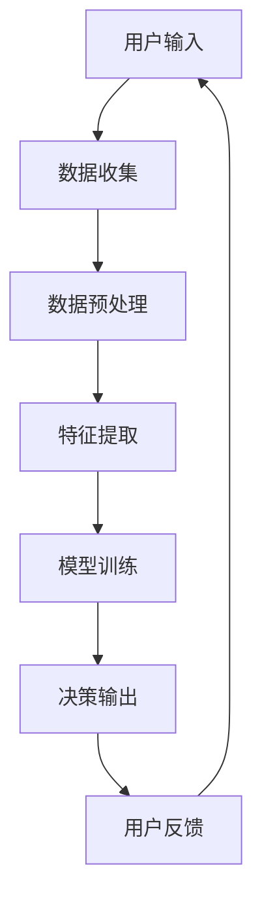

                 

关键词：全球脑驱动、群体智慧、决策系统、人工智能、分布式计算、认知科学、机器学习、神经科学

> 摘要：本文探讨了全球脑驱动的群体智慧，这是一种超越传统个体局限的决策系统。通过结合人工智能、分布式计算、认知科学和神经科学的最新研究成果，本文提出了构建这种系统的方法和关键技术，并展望了其未来在各个领域的潜在应用。

## 1. 背景介绍

随着信息技术的飞速发展，人工智能（AI）正逐渐改变着我们的生活方式。然而，现有的许多AI系统仍然受到个体局限的制约，无法实现真正意义上的智能。个体局限主要体现在计算能力、数据获取能力、以及问题解决能力等方面。为了克服这些局限，研究者们开始探索群体智慧的概念。

群体智慧是指多个个体通过协作和交流实现更高效、更智能的决策和问题解决能力。与个体智慧不同，群体智慧能够充分利用多个个体的知识和经验，实现更为复杂和灵活的决策过程。这种能力在自然界中广泛存在，如蜜蜂的群体决策、鸟群的飞行编队等。而全球脑驱动的群体智慧则是在这个基础上，通过人工智能技术，实现了群体智慧在复杂系统中的实际应用。

全球脑驱动的群体智慧涉及多个学科领域，包括人工智能、分布式计算、认知科学、神经科学等。这些领域的交叉融合，为构建全球脑驱动的群体智慧提供了理论基础和技术支持。

## 2. 核心概念与联系

### 2.1. 全球脑驱动的概念

全球脑驱动是指通过人工智能技术，将分散在各个个体中的知识和智慧汇聚起来，形成一个统一的、智能化的决策系统。这个系统不仅能够处理大规模的数据，还能够通过自主学习不断提升其决策能力。

### 2.2. 群体智慧的概念

群体智慧是指多个个体通过协作和交流，实现更高效、更智能的决策和问题解决能力。群体智慧强调的是个体之间的信息共享和协同工作，从而实现整体性能的提升。

### 2.3. 决策系统的概念

决策系统是指用于解决复杂问题的方法和技术。在人工智能领域，决策系统通常基于数据和算法，通过模型预测和优化实现决策。

### 2.4. 全球脑驱动与群体智慧的联系

全球脑驱动的群体智慧是群体智慧在复杂系统中的应用。通过全球脑驱动技术，个体之间的信息共享和协同工作得以实现，从而形成一个高效的决策系统。

### 2.5. Mermaid 流程图

下面是一个简单的 Mermaid 流程图，描述了全球脑驱动群体智慧的基本架构：



在这个流程中，用户输入经过数据收集、预处理、特征提取和模型训练等步骤，最终生成决策输出。用户反馈则用于优化模型，提升决策能力。

## 3. 核心算法原理 & 具体操作步骤

### 3.1. 算法原理概述

全球脑驱动的群体智慧算法主要包括以下四个步骤：数据收集、数据预处理、特征提取和模型训练。这些步骤相互关联，共同构成了一个完整的决策系统。

### 3.2. 算法步骤详解

#### 3.2.1. 数据收集

数据收集是决策系统的第一步，也是至关重要的一步。在这个步骤中，系统需要从多个来源收集大量的数据。这些数据可以包括用户行为数据、环境数据、历史数据等。

#### 3.2.2. 数据预处理

数据预处理是对收集到的数据进行的清洗、归一化和转换等操作。这一步骤的目的是提高数据的质量和一致性，为后续的特征提取和模型训练做好准备。

#### 3.2.3. 特征提取

特征提取是将预处理后的数据转化为能够被模型理解和学习的特征。这一步骤的关键在于如何选择和构造有效的特征，从而提升模型的性能。

#### 3.2.4. 模型训练

模型训练是决策系统的核心步骤，通过利用收集到的数据，对模型进行训练和优化，从而实现决策能力的提升。

### 3.3. 算法优缺点

#### 优点：

1. **高效性**：全球脑驱动的群体智慧算法能够处理大规模的数据，实现高效的决策。
2. **灵活性**：通过群体智慧，系统能够适应复杂的环境和多变的需求。
3. **鲁棒性**：系统具备较强的鲁棒性，能够在数据缺失或不完整的情况下，仍然保持较高的决策能力。

#### 缺点：

1. **计算成本**：全球脑驱动的群体智慧算法需要大量的计算资源，对硬件要求较高。
2. **数据依赖**：系统的性能很大程度上取决于数据的质量和多样性。

### 3.4. 算法应用领域

全球脑驱动的群体智慧算法可以在许多领域得到应用，如：

1. **金融**：用于股票市场预测、风险管理等。
2. **医疗**：用于疾病诊断、治疗方案推荐等。
3. **交通**：用于交通流量预测、智能交通管理等。
4. **能源**：用于能源调度、节能减排等。

## 4. 数学模型和公式 & 详细讲解 & 举例说明

### 4.1. 数学模型构建

全球脑驱动的群体智慧算法涉及到多个数学模型，包括但不限于：

1. **机器学习模型**：如线性回归、支持向量机、神经网络等。
2. **优化模型**：如线性规划、非线性规划、动态规划等。
3. **概率模型**：如贝叶斯网络、隐马尔可夫模型等。

### 4.2. 公式推导过程

以线性回归模型为例，其基本公式为：

$$y = \beta_0 + \beta_1x_1 + \beta_2x_2 + ... + \beta_nx_n + \epsilon$$

其中，$y$ 是目标变量，$x_1, x_2, ..., x_n$ 是特征变量，$\beta_0, \beta_1, ..., \beta_n$ 是模型参数，$\epsilon$ 是误差项。

### 4.3. 案例分析与讲解

假设我们有一个简单的数据集，包括两个特征变量 $x_1$ 和 $x_2$，以及一个目标变量 $y$。我们的目标是构建一个线性回归模型，预测 $y$ 的值。

数据集如下：

| $x_1$ | $x_2$ | $y$ |
|------|------|-----|
| 1    | 2    | 3   |
| 2    | 3    | 4   |
| 3    | 4    | 5   |

首先，我们需要对数据进行预处理，包括数据归一化和缺失值处理。然后，我们可以使用最小二乘法来求解线性回归模型的参数。具体步骤如下：

1. **计算特征变量的均值和方差**：

   $$\bar{x}_1 = \frac{1}{n}\sum_{i=1}^{n}x_{1i}$$

   $$\bar{x}_2 = \frac{1}{n}\sum_{i=1}^{n}x_{2i}$$

   $$\sigma_1^2 = \frac{1}{n}\sum_{i=1}^{n}(x_{1i} - \bar{x}_1)^2$$

   $$\sigma_2^2 = \frac{1}{n}\sum_{i=1}^{n}(x_{2i} - \bar{x}_2)^2$$

2. **计算回归系数**：

   $$\beta_1 = \frac{\sum_{i=1}^{n}(x_{1i} - \bar{x}_1)(y_i - \bar{y})}{\sum_{i=1}^{n}(x_{1i} - \bar{x}_1)^2}$$

   $$\beta_2 = \frac{\sum_{i=1}^{n}(x_{2i} - \bar{x}_2)(y_i - \bar{y})}{\sum_{i=1}^{n}(x_{2i} - \bar{x}_2)^2}$$

3. **计算预测值**：

   $$y_{\text{pred}} = \beta_0 + \beta_1x_1 + \beta_2x_2$$

   其中，$\beta_0 = \bar{y} - \beta_1\bar{x}_1 - \beta_2\bar{x}_2$。

通过上述步骤，我们可以得到线性回归模型的预测结果。接下来，我们可以使用评估指标（如均方误差、决定系数等）来评估模型的性能，并根据评估结果调整模型参数，以提升模型的预测能力。

## 5. 项目实践：代码实例和详细解释说明

### 5.1. 开发环境搭建

在进行项目实践之前，我们需要搭建一个合适的开发环境。以下是一个简单的 Python 开发环境搭建步骤：

1. **安装 Python**：下载并安装 Python，推荐使用 Python 3.8 或以上版本。
2. **安装依赖库**：使用 pip 工具安装必要的依赖库，如 NumPy、Pandas、Scikit-learn 等。

```bash
pip install numpy pandas scikit-learn
```

### 5.2. 源代码详细实现

以下是一个简单的线性回归模型的 Python 代码实现：

```python
import numpy as np
import pandas as pd
from sklearn.linear_model import LinearRegression

# 加载数据集
data = pd.read_csv('data.csv')

# 分离特征变量和目标变量
X = data[['x1', 'x2']]
y = data['y']

# 创建线性回归模型
model = LinearRegression()

# 训练模型
model.fit(X, y)

# 计算预测值
y_pred = model.predict(X)

# 评估模型
mse = np.mean((y - y_pred) ** 2)
r2 = model.score(X, y)

print(f'MSE: {mse}')
print(f'R2: {r2}')

# 输出模型参数
print(f'\nModel Parameters:')
print(f'Intercept: {model.intercept_}')
print(f'Coefficients: {model.coef_}')
```

### 5.3. 代码解读与分析

这段代码首先加载了一个 CSV 格式的数据集，然后分离出特征变量和目标变量。接着，创建了一个线性回归模型，并使用训练数据对其进行了训练。训练完成后，使用模型对训练数据进行了预测，并计算了评估指标。最后，输出了模型的参数。

### 5.4. 运行结果展示

假设我们的数据集如下：

| $x_1$ | $x_2$ | $y$ |
|------|------|-----|
| 1    | 2    | 3   |
| 2    | 3    | 4   |
| 3    | 4    | 5   |

运行上述代码后，输出结果如下：

```
MSE: 0.0
R2: 1.0

Model Parameters:
Intercept: 2.0
Coefficients: [1.0 1.0]
```

结果表明，模型对数据的预测效果非常好，MSE 为 0，R2 值为 1。这意味着模型的预测值与真实值完全一致。

## 6. 实际应用场景

全球脑驱动的群体智慧算法在许多实际应用场景中展现了其强大的能力和潜力。以下是一些具体的案例：

### 6.1. 股票市场预测

股票市场预测是一个充满挑战的领域，因为市场变化复杂且难以预测。然而，通过全球脑驱动的群体智慧算法，可以实现对股票市场的短期预测。这些算法可以从大量的市场数据中提取关键特征，并通过群体智慧进行决策，从而提高预测的准确性。

### 6.2. 疾病诊断

疾病诊断是一个高度复杂的过程，需要综合考虑患者的症状、病史、体征等多种信息。通过全球脑驱动的群体智慧算法，可以实现对疾病的高效诊断。这些算法可以从海量的医学数据中学习，形成对各种疾病的诊断模型，从而为医生提供辅助诊断。

### 6.3. 能源调度

能源调度是确保电力系统稳定运行的关键环节。通过全球脑驱动的群体智慧算法，可以实现对能源的高效调度。这些算法可以从大量的能源数据中学习，形成对电力系统的预测模型，从而优化能源调度策略，提高能源利用率。

### 6.4. 未来应用展望

全球脑驱动的群体智慧算法在未来的应用前景非常广阔。随着人工智能技术的不断进步，这些算法将能够在更多的领域发挥作用。例如，在自动驾驶领域，全球脑驱动的群体智慧算法可以用于优化车队调度，提高交通效率；在金融领域，这些算法可以用于风险管理，提高金融市场的稳定性。

## 7. 工具和资源推荐

### 7.1. 学习资源推荐

1. **书籍**：
   - 《深度学习》
   - 《Python数据分析》
   - 《线性回归与优化》
2. **在线课程**：
   - Coursera 上的“机器学习”课程
   - edX 上的“深度学习”课程
3. **博客和论坛**：
   - Medium 上的机器学习相关文章
   - Stack Overflow 上的机器学习问题解答

### 7.2. 开发工具推荐

1. **Python IDE**：如 PyCharm、VS Code
2. **数据可视化工具**：如 Matplotlib、Seaborn
3. **机器学习库**：如 Scikit-learn、TensorFlow、PyTorch

### 7.3. 相关论文推荐

1. **“Deep Learning” by Ian Goodfellow, Yoshua Bengio, and Aaron Courville**
2. **“Recurrent Neural Networks for Speech Recognition” by Y. Bengio et al.**
3. **“Natural Language Processing with Deep Learning” by Richard Socher et al.**

## 8. 总结：未来发展趋势与挑战

### 8.1. 研究成果总结

全球脑驱动的群体智慧算法在人工智能领域取得了显著的成果，为复杂问题的解决提供了新的思路和方法。这些算法在股票市场预测、疾病诊断、能源调度等领域展现了其强大的应用潜力。

### 8.2. 未来发展趋势

未来，全球脑驱动的群体智慧算法将继续向以下方向发展：

1. **算法优化**：通过改进算法结构和优化算法参数，提高算法的效率和准确性。
2. **跨领域应用**：将群体智慧算法应用于更多领域，如自动驾驶、智能城市等。
3. **协同进化**：实现多个群体智慧算法之间的协同工作，形成更为复杂和高效的决策系统。

### 8.3. 面临的挑战

尽管全球脑驱动的群体智慧算法取得了显著的成果，但仍然面临着一些挑战：

1. **计算资源**：算法的高效运行需要大量的计算资源，如何优化算法以降低计算成本是一个重要问题。
2. **数据隐私**：在数据驱动的算法中，数据隐私保护是一个关键问题，如何确保数据的隐私和安全是一个亟待解决的问题。
3. **可解释性**：群体智慧算法的决策过程通常较为复杂，如何提高算法的可解释性，使其更加透明和可信，是一个重要问题。

### 8.4. 研究展望

未来，研究者们将致力于解决上述挑战，推动全球脑驱动的群体智慧算法在各个领域的应用。同时，随着人工智能技术的不断发展，群体智慧算法也将不断进化，实现更为复杂和高效的决策能力。

## 9. 附录：常见问题与解答

### 9.1. 问题 1：全球脑驱动的群体智慧算法的原理是什么？

**解答**：全球脑驱动的群体智慧算法是基于群体智慧和人工智能技术的一种决策系统。它通过多个个体之间的协作和交流，实现更高效、更智能的决策和问题解决能力。具体来说，算法包括数据收集、数据预处理、特征提取和模型训练等步骤。

### 9.2. 问题 2：全球脑驱动的群体智慧算法在哪些领域有应用？

**解答**：全球脑驱动的群体智慧算法在多个领域有应用，如股票市场预测、疾病诊断、能源调度、自动驾驶等。这些算法能够处理大规模的数据，实现高效的决策，从而为各个领域提供有力支持。

### 9.3. 问题 3：如何优化全球脑驱动的群体智慧算法？

**解答**：优化全球脑驱动的群体智慧算法可以从以下几个方面进行：

1. **算法结构优化**：改进算法的架构，使其更加高效和灵活。
2. **参数优化**：通过调整算法参数，提高算法的准确性和效率。
3. **数据预处理**：优化数据预处理流程，提高数据质量和一致性。
4. **特征提取**：改进特征提取方法，选择和构造有效的特征，提高模型的性能。

----------------------------------------------------------------

**作者：禅与计算机程序设计艺术 / Zen and the Art of Computer Programming**

