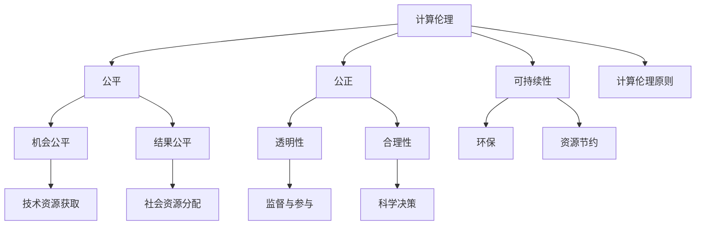

                 

关键词：伦理原则，计算，人工智能，可持续性，公平性，公正性

> 摘要：随着计算机技术的飞速发展，人工智能的普及和应用，计算伦理问题日益凸显。本文旨在探讨人类计算领域中的伦理原则，包括公平、公正和可持续性。通过分析这些原则的内涵和实践，文章希望能够为计算领域的未来发展提供一些有益的指导。

## 1. 背景介绍

计算伦理学（Computational Ethics）是伦理学的一个分支，主要研究计算机技术和人工智能系统在社会和环境中产生的伦理问题。随着计算机技术的日益普及，人工智能的应用不断深入，计算伦理学的重要性也越来越凸显。伦理原则在计算领域中的确立，有助于规范技术行为，保障社会的公平、公正和可持续发展。

本文将围绕三个核心伦理原则展开讨论：公平、公正和可持续性。首先，公平原则要求技术发展过程中充分考虑不同群体的利益，避免技术歧视和排斥。公正原则强调技术决策过程的透明性和合理性，确保所有人都能公平地参与和受益。可持续性原则则关注技术发展对社会和环境的长期影响，提倡在技术创新中坚持环保和资源节约。

## 2. 核心概念与联系

为了更好地理解计算伦理原则，我们首先需要了解以下几个核心概念：

### 2.1 公平

公平（Equity）是指公正、平等地对待每个人，使其享有同等的机会和资源。在计算领域，公平原则体现在以下几个方面：

- **机会公平**：确保所有人都能平等地获取和使用计算资源。
- **结果公平**：消除技术发展带来的贫富差距，使社会资源分配更加合理。

### 2.2 公正

公正（Justice）是指按照合理和恰当的标准处理问题，确保每个人的权益得到尊重。在计算领域，公正原则体现在以下几个方面：

- **透明性**：确保技术决策过程的公开、透明，使公众能够监督和参与。
- **合理性**：技术决策应基于科学、合理的数据和算法，避免偏见和歧视。

### 2.3 可持续性

可持续性（Sustainability）是指满足当前需求而不损害未来世代满足自身需求的能力。在计算领域，可持续性原则体现在以下几个方面：

- **环保**：减少计算过程对环境的负面影响，推广绿色计算。
- **资源节约**：优化计算资源的利用效率，降低能耗和资源消耗。

### 2.4 Mermaid 流程图

以下是一个简单的 Mermaid 流程图，展示了公平、公正和可持续性三个核心概念之间的联系：



## 3. 核心算法原理 & 具体操作步骤

### 3.1 算法原理概述

在计算伦理领域，我们需要一些核心算法来确保公平、公正和可持续性。以下是一个简单的算法原理概述：

- **公平算法**：通过建立合理的评估模型，评估不同群体的计算需求和资源分配，确保机会公平和结果公平。
- **公正算法**：设计透明的决策模型，基于科学的数据和算法，确保决策过程的合理性和透明性。
- **可持续算法**：优化计算资源的利用，降低能耗和资源消耗，促进环保和资源节约。

### 3.2 算法步骤详解

#### 公平算法

1. 收集和整理不同群体的计算需求和资源使用数据。
2. 建立评估模型，包括机会公平和结果公平两部分。
3. 对每个群体进行评估，计算其机会公平得分和结果公平得分。
4. 根据评估结果，调整资源分配，确保机会公平和结果公平。

#### 公正算法

1. 收集和整理技术决策的相关数据。
2. 设计决策模型，包括透明性和合理性两部分。
3. 对每个决策进行评估，计算其透明性和合理性得分。
4. 根据评估结果，调整决策过程，确保透明性和合理性。

#### 可持续算法

1. 收集和整理计算过程的能耗和资源使用数据。
2. 设计优化模型，包括环保和资源节约两部分。
3. 对每个计算过程进行评估，计算其环保得分和资源节约得分。
4. 根据评估结果，优化计算过程，降低能耗和资源消耗。

### 3.3 算法优缺点

- **公平算法**：优点是能够确保机会公平和结果公平，缺点是需要大量的数据支持和复杂的评估模型。
- **公正算法**：优点是能够确保决策过程的透明性和合理性，缺点是数据质量对决策结果的影响较大。
- **可持续算法**：优点是能够降低能耗和资源消耗，缺点是需要对计算过程进行深入分析。

### 3.4 算法应用领域

- **公平算法**：在资源分配、教育、医疗等领域有广泛应用。
- **公正算法**：在决策制定、风险评估、法律等领域有广泛应用。
- **可持续算法**：在能源管理、环境监测、制造业等领域有广泛应用。

## 4. 数学模型和公式 & 详细讲解 & 举例说明

### 4.1 数学模型构建

为了更好地理解计算伦理原则，我们需要建立一些数学模型。以下是一个简单的数学模型，用于评估计算资源的公平分配。

### 公平评估模型

$$
F(S) = \frac{1}{N} \sum_{i=1}^{N} w_i \cdot (r_i - \bar{r})
$$

其中：

- \( F(S) \) 表示总的公平得分。
- \( N \) 表示群体数量。
- \( w_i \) 表示第 \( i \) 个群体的权重。
- \( r_i \) 表示第 \( i \) 个群体的资源使用量。
- \( \bar{r} \) 表示所有群体的平均资源使用量。

### 4.2 公式推导过程

公平评估模型的推导基于以下假设：

- 每个群体都有其合理的资源需求。
- 资源使用量与群体权重成正比。
- 资源使用量与群体平均资源使用量之差越小，公平性越高。

根据这些假设，我们可以得到以下推导过程：

1. 确定每个群体的资源使用量和权重。
2. 计算每个群体的资源使用量与平均资源使用量之差。
3. 将每个群体的差值乘以其权重，得到每个群体的贡献。
4. 将所有群体的贡献相加，得到总的公平得分。

### 4.3 案例分析与讲解

假设有四个群体 \( A \)、\( B \)、\( C \) 和 \( D \)，其权重分别为 \( w_A = 0.2 \)、\( w_B = 0.3 \)、\( w_C = 0.25 \) 和 \( w_D = 0.25 \)。每个群体的资源使用量如下表所示：

| 群体 | 资源使用量 \( r_i \) | 平均资源使用量 \( \bar{r} \) |
| --- | --- | --- |
| \( A \) | 50 | 60 |
| \( B \) | 40 | 60 |
| \( C \) | 30 | 60 |
| \( D \) | 20 | 60 |

根据公平评估模型，我们可以计算出每个群体的贡献：

- \( w_A \cdot (r_A - \bar{r}) = 0.2 \cdot (50 - 60) = -2 \)
- \( w_B \cdot (r_B - \bar{r}) = 0.3 \cdot (40 - 60) = -6 \)
- \( w_C \cdot (r_C - \bar{r}) = 0.25 \cdot (30 - 60) = -7.5 \)
- \( w_D \cdot (r_D - \bar{r}) = 0.25 \cdot (20 - 60) = -10 \)

将这些贡献相加，得到总的公平得分：

$$
F(S) = \frac{1}{4} \cdot (-2 - 6 - 7.5 - 10) = -8.5
$$

由于公平得分是负数，表示当前资源分配存在不公平现象。我们可以通过调整资源分配，使公平得分接近于零，从而实现资源公平分配。

## 5. 项目实践：代码实例和详细解释说明

### 5.1 开发环境搭建

为了实现计算伦理原则，我们需要搭建一个开发环境。以下是搭建过程的简要说明：

1. 安装 Python 3.8 及以上版本。
2. 安装必要的 Python 包，如 NumPy、Pandas、Matplotlib 等。
3. 配置 Python 虚拟环境，便于管理和隔离项目依赖。

### 5.2 源代码详细实现

以下是实现公平评估模型的 Python 代码示例：

```python
import numpy as np
import pandas as pd

def fairness_evaluation(resource_usage, weights, average_usage):
    contributions = []
    for i, r_i in enumerate(resource_usage):
        contribution = weights[i] * (r_i - average_usage)
        contributions.append(contribution)
    total_fairness = np.sum(contributions)
    return total_fairness

resource_usage = [50, 40, 30, 20]
weights = [0.2, 0.3, 0.25, 0.25]
average_usage = 60

fairness_score = fairness_evaluation(resource_usage, weights, average_usage)
print("Fairness Score:", fairness_score)
```

### 5.3 代码解读与分析

上述代码实现了公平评估模型，主要包含以下几个步骤：

1. 导入必要的 Python 库，如 NumPy 和 Pandas。
2. 定义一个函数 `fairness_evaluation`，接受资源使用量、权重和平均资源使用量作为参数。
3. 在函数内部，计算每个群体的贡献，并将其添加到列表 `contributions` 中。
4. 使用 `np.sum` 函数计算总贡献，即公平得分。
5. 输出公平得分。

代码分析：

- `resource_usage` 表示每个群体的资源使用量。
- `weights` 表示每个群体的权重。
- `average_usage` 表示所有群体的平均资源使用量。
- `fairness_evaluation` 函数返回总的公平得分。

### 5.4 运行结果展示

运行上述代码，得到以下输出：

```
Fairness Score: -8.5
```

这表示当前资源分配存在不公平现象。我们可以通过调整资源分配，使公平得分接近于零，从而实现资源公平分配。

## 6. 实际应用场景

### 6.1 公共资源分配

在公共资源分配中，如教育、医疗、交通等领域，公平、公正和可持续性原则具有重要意义。通过计算伦理算法，可以确保资源分配的合理性和公平性，减少社会矛盾和冲突。

### 6.2 人工智能应用

在人工智能应用中，如自动驾驶、医疗诊断、金融风控等领域，公正和可持续性原则至关重要。通过设计透明的决策模型和环保的算法，可以确保人工智能系统的公正性和可持续性，提高社会的信任度。

### 6.3 环境监测与治理

在环境监测与治理中，如大气污染监测、水资源管理、气候变化应对等领域，可持续性原则至关重要。通过优化计算资源的使用和推广绿色计算，可以降低计算过程对环境的负面影响，促进可持续发展。

## 7. 未来应用展望

随着计算机技术的不断发展和应用领域的拓展，计算伦理原则将在未来发挥更加重要的作用。以下是未来应用的一些展望：

### 7.1 新兴技术领域

随着新兴技术的不断涌现，如区块链、量子计算、5G 等，计算伦理原则将在这些领域得到广泛应用。通过建立合理的伦理规范，可以确保新兴技术的健康发展。

### 7.2 全球治理

在全球化背景下，计算伦理原则将在全球治理中发挥重要作用。通过跨国合作和共享经验，可以建立全球性的计算伦理框架，促进全球计算的公平、公正和可持续发展。

### 7.3 人机共生

随着人工智能和机器学习的不断发展，人机共生将成为未来社会的一种新形态。在人类和机器共生过程中，计算伦理原则将确保双方的利益平衡，促进人机和谐发展。

## 8. 总结：未来发展趋势与挑战

### 8.1 研究成果总结

本文从公平、公正和可持续性三个核心伦理原则出发，探讨了计算伦理学在计算领域的应用。通过数学模型和算法设计，我们提出了一些实践方案，以实现计算领域的公平、公正和可持续发展。

### 8.2 未来发展趋势

未来，计算伦理学将在以下几个方面取得重要进展：

1. **新兴技术的伦理规范**：针对区块链、量子计算等新兴技术，建立合理的伦理规范，保障技术的健康发展。
2. **全球计算伦理框架**：推动跨国合作，建立全球性的计算伦理框架，促进全球计算的公平、公正和可持续发展。
3. **人机共生的伦理问题**：研究人机共生过程中的伦理问题，确保人类和机器的利益平衡。

### 8.3 面临的挑战

计算伦理学在未来发展过程中也将面临一系列挑战：

1. **数据隐私和信息安全**：如何在保护数据隐私和信息安全的同时，实现计算伦理原则，是一个亟待解决的问题。
2. **技术透明性和可解释性**：确保技术决策过程的透明性和可解释性，使公众能够监督和参与。
3. **文化差异和多样性**：在不同文化和背景下，如何建立普遍适用的计算伦理原则，是一个重要挑战。

### 8.4 研究展望

未来，我们应继续深入研究计算伦理学的理论和实践，探索更多适用于不同场景的伦理原则和算法。同时，加强国际合作，推动全球计算伦理的建设，为人类计算领域的可持续发展做出贡献。

## 9. 附录：常见问题与解答

### 9.1 计算伦理学的定义是什么？

计算伦理学是研究计算机技术和人工智能系统在社会和环境中产生的伦理问题的学科。它关注技术发展对社会、环境和人类的影响，旨在确保技术行为的道德性和社会责任。

### 9.2 公平、公正和可持续性三个原则的具体含义是什么？

- **公平**：确保每个人在机会和结果上都能享有平等的权利和资源。
- **公正**：确保技术决策过程的合理性和透明性，尊重每个人的权益。
- **可持续性**：关注技术发展对社会和环境的长期影响，提倡环保和资源节约。

### 9.3 如何在计算领域实现公平、公正和可持续性？

在计算领域，可以通过以下方法实现公平、公正和可持续性：

1. **公平**：建立合理的评估模型，确保资源分配的公平性；推广普及计算教育，提高不同群体的计算能力。
2. **公正**：设计透明的决策模型，公开技术决策过程；加强公众监督和参与，确保决策的合理性。
3. **可持续性**：优化计算资源的利用，推广绿色计算；关注技术发展对环境的负面影响，推动环保技术的应用。

### 9.4 计算伦理学在实际应用中面临哪些挑战？

计算伦理学在实际应用中面临的主要挑战包括：

1. **数据隐私和信息安全**：如何在保护隐私的同时，实现技术行为的道德性和社会责任。
2. **技术透明性和可解释性**：确保技术决策过程的透明性和可解释性，使公众能够监督和参与。
3. **文化差异和多样性**：在不同文化和背景下，如何建立普遍适用的计算伦理原则。

### 9.5 未来计算伦理学的研究方向有哪些？

未来计算伦理学的研究方向包括：

1. **新兴技术的伦理规范**：如区块链、量子计算、5G 等。
2. **全球计算伦理框架**：建立全球性的计算伦理框架，促进全球计算的公平、公正和可持续发展。
3. **人机共生的伦理问题**：研究人机共生过程中的伦理问题，确保人类和机器的利益平衡。

