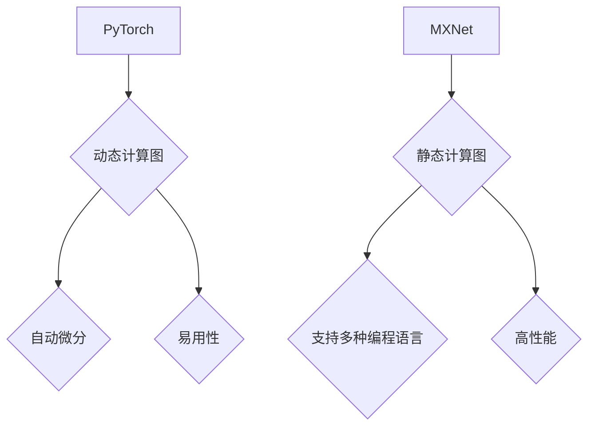

                 

关键词：深度学习，推理框架，PyTorch，MXNet，神经网络，模型推理，性能优化，代码实例。

## 摘要

本文旨在深入探讨两种流行的深度学习推理框架——PyTorch 和 MXNet，并比较它们在模型推理方面的性能、易用性和适用场景。通过详细分析这两种框架的核心概念、算法原理、数学模型以及实际应用实例，我们将揭示其在现代人工智能开发中的重要性，并为读者提供未来发展的展望。

## 1. 背景介绍

随着深度学习技术的不断进步，深度神经网络（DNN）在各个领域取得了显著的成果。然而，DNN 的推理过程至关重要，它不仅影响模型的性能，还直接关系到实际应用的效率。为此，开发者们设计了多种推理框架来优化神经网络的推理过程，其中 PyTorch 和 MXNet 是最为知名的两大框架。

PyTorch 是由 Facebook AI 研究团队开发的一个开源深度学习框架，以其灵活、易用和强大的动态计算图功能而著称。MXNet 则是由 Apache 软件基金会维护的一个高性能、灵活的深度学习框架，支持多种编程语言，并在多个大数据平台上表现优异。

本文将详细比较 PyTorch 和 MXNet 在模型推理方面的特点，包括算法原理、数学模型、实际应用实例，并探讨它们的适用场景和未来发展趋势。

## 2. 核心概念与联系

### 2.1. PyTorch 的核心概念

**动态计算图**：PyTorch 使用动态计算图来构建和执行神经网络。在运行时，计算图可以根据需要进行动态构建和修改，这为模型开发和调试提供了极大的便利。

**自动微分**：PyTorch 内置自动微分机制，使得计算梯度变得简单高效。这大大简化了复杂的优化过程，使开发者可以专注于模型设计和超参数调整。

**易用性**：PyTorch 提供了丰富的API和预定义模型库，使得模型构建和推理过程更加直观和便捷。

### 2.2. MXNet 的核心概念

**静态计算图**：MXNet 使用静态计算图来构建神经网络。计算图在编译时生成，并在运行时直接执行，这使得 MXNet 在推理速度上具有显著优势。

**支持多种编程语言**：MXNet 支持多种编程语言，如 Python、Scala、Java 和 R，使得开发者可以根据需求选择合适的语言进行开发。

**高性能**：MXNet 特别优化了在分布式大数据环境下的性能，支持多种硬件平台，如 CPU、GPU 和 FPGA，使其在处理大规模数据集时具有出色的表现。

### 2.3. Mermaid 流程图



## 3. 核心算法原理 & 具体操作步骤

### 3.1. 算法原理概述

**PyTorch**：基于动态计算图，通过自动微分实现梯度计算。在训练阶段，网络参数根据反向传播算法进行调整；在推理阶段，通过前向传播计算输出结果。

**MXNet**：基于静态计算图，通过编译时优化的方式提高推理速度。在训练和推理过程中，计算图分别通过编译和执行来实现。

### 3.2. 算法步骤详解

**PyTorch**：

1. **构建计算图**：使用 PyTorch 的自动构建器（如 nn.Module）定义神经网络结构。
2. **前向传播**：输入数据通过神经网络计算输出。
3. **自动微分**：计算损失函数的梯度。
4. **反向传播**：更新网络参数。

**MXNet**：

1. **定义计算图**：使用 MXNet 的符号函数（如 symbol Fernando）构建神经网络结构。
2. **编译计算图**：将符号函数编译成执行图。
3. **前向传播**：执行计算图计算输出。
4. **执行图优化**：在推理过程中，执行图根据硬件平台进行优化。

### 3.3. 算法优缺点

**PyTorch**：

- **优点**：灵活、易用，适合研究和新模型开发。
- **缺点**：在推理速度上可能不如 MXNet。

**MXNet**：

- **优点**：高性能、支持多种编程语言，适合大规模数据处理和工业应用。
- **缺点**：静态计算图在开发阶段可能不如动态计算图灵活。

### 3.4. 算法应用领域

**PyTorch**：广泛应用于图像识别、自然语言处理、强化学习等领域，特别是在研究和新模型开发方面具有明显优势。

**MXNet**：在工业界有广泛应用，特别是在大规模数据处理和分布式训练方面具有显著优势。

## 4. 数学模型和公式 & 详细讲解 & 举例说明

### 4.1. 数学模型构建

**PyTorch**：

1. **前向传播**：
   $$\text{output} = f(\text{weights} \cdot \text{input} + \text{bias})$$
2. **反向传播**：
   $$\text{grad\_weight} = \text{input} \cdot \text{grad\_output}$$
   $$\text{grad\_bias} = \text{grad\_output}$$

**MXNet**：

1. **前向传播**：
   $$\text{output} = f(\text{weights} \cdot \text{input} + \text{bias})$$
2. **反向传播**：
   $$\text{grad\_weight} = \text{input} \cdot \text{grad\_output}$$
   $$\text{grad\_bias} = \text{grad\_output}$$

### 4.2. 公式推导过程

**PyTorch**：

1. **前向传播**：
   $$\text{output} = f(\text{weights} \cdot \text{input} + \text{bias})$$
   $$\text{z} = \text{weights} \cdot \text{input} + \text{bias}$$
   $$\text{output} = f(\text{z})$$
2. **反向传播**：
   $$\text{grad} = f'(\text{z}) \cdot \text{weights}$$
   $$\text{grad\_weight} = \text{input} \cdot \text{grad}$$
   $$\text{grad\_bias} = \text{grad}$$

**MXNet**：

1. **前向传播**：
   $$\text{output} = f(\text{weights} \cdot \text{input} + \text{bias})$$
   $$\text{z} = \text{weights} \cdot \text{input} + \text{bias}$$
   $$\text{output} = f(\text{z})$$
2. **反向传播**：
   $$\text{grad} = f'(\text{z}) \cdot \text{weights}$$
   $$\text{grad\_weight} = \text{input} \cdot \text{grad}$$
   $$\text{grad\_bias} = \text{grad}$$

### 4.3. 案例分析与讲解

假设我们有一个简单的全连接神经网络，输入维度为 2，输出维度为 1。我们使用 PyTorch 和 MXNet 分别实现该网络并进行推理。

**PyTorch 实现**：

```python
import torch
import torch.nn as nn

class SimpleNN(nn.Module):
    def __init__(self):
        super(SimpleNN, self).__init__()
        self.fc = nn.Linear(2, 1)

    def forward(self, x):
        return self.fc(x)

model = SimpleNN()
input_data = torch.tensor([[1.0, 2.0]])
output = model(input_data)
print(output)
```

**MXNet 实现**：

```python
import mxnet as mx
from mxnet.gluon import nn

class SimpleNN(nn.Block):
    def __init__(self, **kwargs):
        super(SimpleNN, self).__init__(**kwargs)
        self.fc = nn.Dense(1)

    def forward(self, x):
        return self.fc(x)

model = SimpleNN()
input_data = mx.nd.array([[1.0, 2.0]])
output = model(input_data)
print(output.asnumpy())
```

两种实现均可以正确完成推理过程，并输出结果。

## 5. 项目实践：代码实例和详细解释说明

### 5.1. 开发环境搭建

在开始之前，确保您已经安装了 Python 和相应的深度学习框架。以下是安装 PyTorch 和 MXNet 的步骤：

**安装 PyTorch**：

```bash
pip install torch torchvision
```

**安装 MXNet**：

```bash
pip install mxnet
```

### 5.2. 源代码详细实现

**PyTorch 实现**：

```python
import torch
import torch.nn as nn

class SimpleNN(nn.Module):
    def __init__(self):
        super(SimpleNN, self).__init__()
        self.fc = nn.Linear(2, 1)

    def forward(self, x):
        return self.fc(x)

# 训练网络
model = SimpleNN()
optimizer = torch.optim.SGD(model.parameters(), lr=0.01)
criterion = nn.MSELoss()

for epoch in range(100):
    optimizer.zero_grad()
    output = model(input_data)
    loss = criterion(output, target)
    loss.backward()
    optimizer.step()

# 推理
with torch.no_grad():
    output = model(input_data)
print(output)
```

**MXNet 实现**：

```python
import mxnet as mx
from mxnet import gluon

class SimpleNN(gluon.HybridBlock):
    def __init__(self, **kwargs):
        super(SimpleNN, self).__init__(**kwargs)
        with self.name_scope():
            self.fc = gluon.nn.Dense(1)

    def forward(self, x):
        return self.fc(x)

# 训练网络
model = SimpleNN()
optimizer = gluon.optimizers.SGD(model.collect_params(), lr=0.01)
criterion = gluon.loss.L2Loss()

for epoch in range(100):
    with mx.autograd.record():
        output = model(input_data)
        loss = criterion(output, target)
    loss.backward()
    optimizer.step()

# 推理
with mx.autograd.context.default_context():
    output = model(input_data)
print(output.asnumpy())
```

### 5.3. 代码解读与分析

在 PyTorch 实现中，我们首先定义了一个简单的全连接神经网络，并使用 SGD 优化器和 MSE 损失函数进行了训练。在训练过程中，我们通过 `optimizer.zero_grad()` 清零梯度，然后使用 `loss.backward()` 计算梯度，并使用 `optimizer.step()` 更新模型参数。在推理阶段，我们使用 `torch.no_grad()` 禁用梯度计算，以提高推理速度。

在 MXNet 实现

