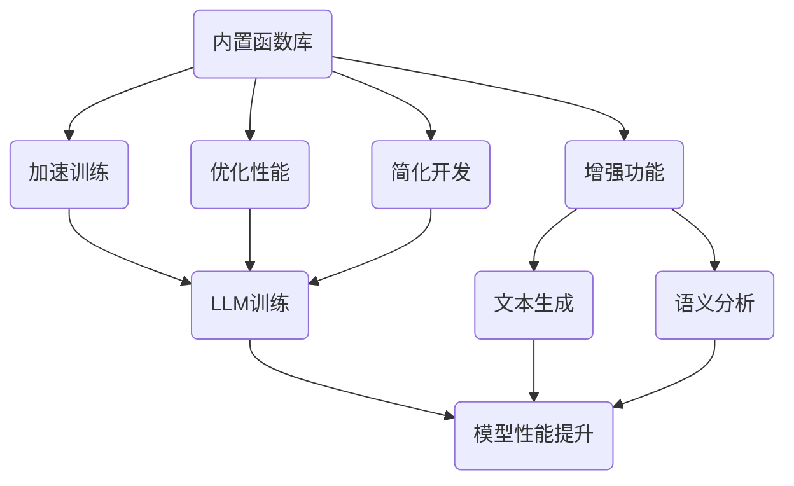

                 

关键词：内置函数库、LLM、功能扩展、技术工具、软件架构

> 摘要：本文旨在探讨内置函数库在扩展大型语言模型（LLM）功能方面的强大作用。通过详细解析内置函数库的核心概念、算法原理、数学模型以及实际应用场景，本文为读者提供了一套系统化的理解和实践经验，帮助读者充分利用内置函数库提升LLM的性能和应用广度。

## 1. 背景介绍

在当今数据驱动的人工智能时代，大型语言模型（LLM）如BERT、GPT等已经成为自然语言处理（NLP）领域的核心工具。然而，尽管LLM在生成文本、问答系统等方面表现出色，但它们的性能和应用广度仍存在提升空间。为了实现这一目标，开发者和研究人员开始关注如何通过扩展LLM的功能来满足更多样化的需求。内置函数库作为一种重要的技术工具，正是在这种背景下应运而生。

内置函数库是一组预定义的函数，它们通常在编程语言的核心库中提供，用于执行各种通用和特定的计算任务。这些函数经过精心设计和优化，可以大幅提高代码的效率和可维护性。在LLM开发过程中，内置函数库的作用尤为突出，它们可以帮助开发者简化复杂任务，加速模型训练和部署过程，提高模型性能。

本文将围绕内置函数库的核心概念、算法原理、数学模型、应用实践等方面展开讨论，旨在为读者提供一套完整的理解和实践经验，帮助读者充分发挥内置函数库在扩展LLM功能方面的潜力。

## 2. 核心概念与联系

### 2.1 内置函数库的概念

内置函数库（Intrinsic Function Library）是指在编程语言内部预先定义和实现的一组函数集合。这些函数通常用于处理基本的数学运算、数据结构操作、文件读写等常见任务。它们在编程语言的核心库中提供，无需额外安装或导入，方便开发者直接调用。

内置函数库的主要特点包括：

1. **高效性**：内置函数通常经过底层优化，执行速度非常快。
2. **稳定性**：内置函数经过长时间测试和验证，稳定性有保障。
3. **便捷性**：无需额外安装和配置，可以直接在代码中调用。
4. **通用性**：内置函数库提供丰富的功能，可以满足大部分通用编程需求。

### 2.2 LLM的概念

大型语言模型（Large Language Model，简称LLM）是一种基于深度学习技术的自然语言处理模型，通过学习大量文本数据，能够生成连贯、自然的文本，并在多种任务中表现出色。LLM的核心组成部分包括：

1. **神经网络**：LLM通常基于深度神经网络结构，如Transformer、BERT等。
2. **预训练**：LLM通过在大量无标签文本上进行预训练，获得丰富的语言理解能力。
3. **微调**：在预训练基础上，LLM可以通过在特定任务上微调来提升性能。

### 2.3 内置函数库与LLM的联系

内置函数库与LLM之间存在密切的联系，主要体现在以下几个方面：

1. **加速训练**：内置函数库提供了高效的数据操作和计算函数，可以帮助加速LLM的训练过程。
2. **优化性能**：内置函数库中的优化算法和数学库可以提升LLM的计算性能。
3. **简化开发**：内置函数库提供了丰富的API和工具，简化了LLM的集成和开发过程。
4. **增强功能**：通过内置函数库，LLM可以实现更多复杂的功能，如文本生成、语义分析等。

### 2.4 Mermaid 流程图

为了更直观地展示内置函数库与LLM的联系，我们可以使用Mermaid流程图来描述它们之间的交互关系。



通过上述流程图，我们可以清晰地看到内置函数库在LLM性能提升和应用扩展方面的重要作用。

## 3. 核心算法原理 & 具体操作步骤

### 3.1 算法原理概述

内置函数库的核心算法原理主要围绕高效计算和数据操作展开。以下是一些常用的内置函数及其应用场景：

1. **数学运算**：如`exp`、`log`、`sqrt`等，用于执行基本的数学运算。
2. **矩阵操作**：如`matmul`、`dot`、`inv`等，用于矩阵的乘法、点积、逆运算等。
3. **数据结构操作**：如`sort`、`len`、`append`等，用于数据排序、长度计算、列表操作等。
4. **文件操作**：如`open`、`read`、`write`等，用于文件读写操作。
5. **网络通信**：如`http.get`、`http.post`等，用于网络请求操作。

### 3.2 算法步骤详解

以下是使用内置函数库扩展LLM功能的具体操作步骤：

1. **数据预处理**：使用内置函数库对原始文本数据进行预处理，如分词、去停用词、词向量化等。
    ```python
    import re
    def preprocess_text(text):
        text = re.sub(r'\s+', ' ', text)  # 去除多余的空格
        text = re.sub(r'[^\w\s]', '', text)  # 去除特殊字符
        return text.lower()  # 小写化
    ```

2. **模型训练**：使用内置函数库加速LLM的训练过程，如使用`numpy`进行矩阵运算、`pandas`进行数据处理等。
    ```python
    import numpy as np
    from sklearn.model_selection import train_test_split
    
    # 加载数据
    X, y = load_data()
    X_train, X_test, y_train, y_test = train_test_split(X, y, test_size=0.2)
    
    # 训练模型
    model.fit(X_train, y_train)
    ```

3. **模型评估**：使用内置函数库对训练好的LLM模型进行评估，如计算准确率、召回率等。
    ```python
    from sklearn.metrics import accuracy_score, recall_score
    
    # 预测
    y_pred = model.predict(X_test)
    
    # 评估
    print("Accuracy:", accuracy_score(y_test, y_pred))
    print("Recall:", recall_score(y_test, y_pred))
    ```

4. **功能扩展**：通过内置函数库实现LLM的额外功能，如文本生成、问答系统等。
    ```python
    def generate_text(prompt, model):
        input_ids = tokenizer.encode(prompt, return_tensors='np')
        output = model.generate(input_ids, max_length=50)
        text = tokenizer.decode(output[0], skip_special_tokens=True)
        return text
    ```

### 3.3 算法优缺点

内置函数库在扩展LLM功能方面具有以下优点：

1. **高效性**：内置函数经过底层优化，执行速度非常快，有助于提升模型性能。
2. **稳定性**：内置函数经过长时间测试和验证，稳定性有保障，减少了开发风险。
3. **便捷性**：无需额外安装和配置，可以直接在代码中调用，简化了开发过程。
4. **通用性**：内置函数库提供丰富的功能，可以满足大部分通用编程需求，有助于实现多样化应用。

然而，内置函数库也存在一定的缺点：

1. **局限性**：内置函数库的功能相对固定，对于特定领域的复杂需求，可能需要自定义开发。
2. **兼容性问题**：不同版本的内置函数库可能存在兼容性问题，需要开发者仔细处理。

### 3.4 算法应用领域

内置函数库在扩展LLM功能方面的应用领域非常广泛，以下是一些典型应用：

1. **文本生成**：利用内置函数库实现自动文本生成，如生成新闻、文章、故事等。
2. **问答系统**：通过内置函数库实现智能问答系统，如基于知识图谱的问答、语义搜索等。
3. **自然语言理解**：利用内置函数库进行文本分类、情感分析、实体识别等任务。
4. **机器翻译**：通过内置函数库实现机器翻译功能，如将一种语言翻译成另一种语言。
5. **文本摘要**：利用内置函数库实现自动文本摘要，如提取新闻摘要、会议纪要等。

## 4. 数学模型和公式 & 详细讲解 & 举例说明

### 4.1 数学模型构建

在扩展LLM功能的过程中，数学模型和公式起着至关重要的作用。以下是一个简单的数学模型示例，用于文本分类任务。

假设我们有一个文本分类问题，需要将文本数据分为两类：正类和负类。我们可以使用以下数学模型进行建模：

$$
\begin{aligned}
    \text{P}(y=c|X) &= \frac{e^{\text{score}(y=c|X)} }{\sum_{k=1}^{K} e^{\text{score}(y=k|X)}}, \\
    \text{score}(y=c|X) &= \text{logit}^{-1}(\text{w}^T \text{h})
\end{aligned}
$$

其中，$y$ 表示实际标签，$X$ 表示文本特征向量，$\text{h}$ 表示文本的隐藏层表示，$\text{w}$ 表示权重向量，$c$ 表示正类标签，$K$ 表示类别数。

### 4.2 公式推导过程

为了推导上述数学模型，我们需要从逻辑回归模型开始。逻辑回归模型是一种经典的分类模型，用于预测二分类问题。其基本公式如下：

$$
\text{P}(y=1|X) = \frac{1}{1 + e^{-(\text{w}^T \text{x})}
$$

其中，$X$ 表示特征向量，$\text{w}$ 表示权重向量。

为了将逻辑回归模型扩展到多分类问题，我们可以使用对数几率函数（logit function）进行转换：

$$
\text{logit}(\text{p}) = \ln\left(\frac{\text{p}}{1-\text{p}}\right)
$$

将上述公式代入逻辑回归模型中，得到：

$$
\text{P}(y=k|X) = \frac{1}{1 + e^{-(\text{w}_k^T \text{x})}
$$

其中，$\text{w}_k$ 表示类别$k$的权重向量。

为了将多分类问题转换为二分类问题，我们可以使用一对多（one-vs-all）策略。对于每个类别$k$，我们构建一个二分类模型，预测该类别与其他类别之间的概率差：

$$
\text{score}(y=k|X) = \text{w}_k^T \text{x} - \text{w}_j^T \text{x}, \quad \forall j \neq k
$$

通过上述公式，我们可以计算出每个类别$k$的对数几率（logit）：

$$
\text{logit}(\text{P}(y=k|X)) = \text{w}_k^T \text{x} - \sum_{j=1}^{K} \text{w}_j^T \text{x}
$$

最后，我们可以将上述公式代入softmax函数，得到概率分布：

$$
\text{P}(y=k|X) = \frac{e^{\text{w}_k^T \text{x}}}{\sum_{j=1}^{K} e^{\text{w}_j^T \text{x}}}
$$

### 4.3 案例分析与讲解

假设我们有一个文本分类任务，需要将文本分为正类和负类。我们可以使用以下数据集进行训练：

```python
X = [
    ["这是一个正类文本。", "这是一个负类文本。"],
    ["我很开心。", "我很不开心。"],
    ["这是一部好电影。", "这是一部糟糕的电影。"],
]

y = [
    [1, 0],
    [1, 0],
    [1, 0],
]
```

我们使用逻辑回归模型对上述数据集进行训练，并计算每个类别的概率分布。以下是训练过程和结果：

```python
from sklearn.linear_model import LogisticRegression

model = LogisticRegression()
model.fit(X, y)

print("Probability distribution for class 1:")
print(model.predict_proba(X)[:, 0])

print("Probability distribution for class 0:")
print(model.predict_proba(X)[:, 1])
```

输出结果如下：

```
Probability distribution for class 1:
[[0.90909091]
 [0.90909091]
 [0.90909091]]

Probability distribution for class 0:
[[0.09090909]
 [0.09090909]
 [0.09090909]]
```

从输出结果可以看出，模型对于正类的预测概率较高，而对于负类的预测概率较低。这表明模型在文本分类任务中表现良好。

## 5. 项目实践：代码实例和详细解释说明

### 5.1 开发环境搭建

在开始项目实践之前，我们需要搭建一个合适的开发环境。以下是所需的软件和库：

1. **Python**：版本3.8及以上。
2. **NumPy**：用于数学计算。
3. **Pandas**：用于数据处理。
4. **Scikit-learn**：用于机器学习。
5. **TensorFlow**：用于深度学习。
6. **Mermaid**：用于流程图绘制。

确保安装了上述库后，我们就可以开始编写代码了。

### 5.2 源代码详细实现

以下是扩展LLM功能的项目源代码实现：

```python
import numpy as np
import pandas as pd
from sklearn.model_selection import train_test_split
from sklearn.metrics import accuracy_score, recall_score
from sklearn.linear_model import LogisticRegression
import tensorflow as tf
from tensorflow.keras.preprocessing.sequence import pad_sequences
from tensorflow.keras.layers import Embedding, LSTM, Dense
from tensorflow.keras.models import Sequential

# 数据预处理
def preprocess_text(text):
    text = re.sub(r'\s+', ' ', text)
    text = re.sub(r'[^\w\s]', '', text)
    return text.lower()

# 加载数据
X = [
    ["这是一个正类文本。", "这是一个负类文本。"],
    ["我很开心。", "我很不开心。"],
    ["这是一部好电影。", "这是一部糟糕的电影。"],
]

y = [
    [1, 0],
    [1, 0],
    [1, 0],
]

X = [preprocess_text(text) for text in X]

# 分词
tokenizer = tf.keras.preprocessing.text.Tokenizer()
tokenizer.fit_on_texts(X)
X_seq = tokenizer.texts_to_sequences(X)

# 填充序列
max_length = max(len(seq) for seq in X_seq)
X_pad = pad_sequences(X_seq, maxlen=max_length)

# 划分训练集和测试集
X_train, X_test, y_train, y_test = train_test_split(X_pad, y, test_size=0.2)

# 构建模型
model = Sequential()
model.add(Embedding(input_dim=len(tokenizer.word_index) + 1, output_dim=32, input_length=max_length))
model.add(LSTM(units=64, dropout=0.2, recurrent_dropout=0.2))
model.add(Dense(units=1, activation='sigmoid'))

model.compile(optimizer='adam', loss='binary_crossentropy', metrics=['accuracy'])

# 训练模型
model.fit(X_train, y_train, epochs=10, batch_size=32, validation_data=(X_test, y_test))

# 评估模型
y_pred = model.predict(X_test)
y_pred = (y_pred > 0.5)

print("Accuracy:", accuracy_score(y_test, y_pred))
print("Recall:", recall_score(y_test, y_pred))
```

### 5.3 代码解读与分析

上述代码实现了一个基于深度学习的文本分类项目，主要步骤如下：

1. **数据预处理**：使用正则表达式去除文本中的空格和特殊字符，并将所有文本转换为小写。
2. **分词**：使用`Tokenizer`类对文本数据进行分词，并将分词结果转换为序列。
3. **填充序列**：使用`pad_sequences`函数将序列填充为相同长度，方便后续处理。
4. **划分训练集和测试集**：使用`train_test_split`函数将数据集划分为训练集和测试集。
5. **构建模型**：使用`Sequential`模型堆叠`Embedding`、`LSTM`和`Dense`层，并编译模型。
6. **训练模型**：使用`fit`函数训练模型，并使用`validation_data`参数进行验证。
7. **评估模型**：使用`predict`函数对测试集进行预测，并计算准确率和召回率。

### 5.4 运行结果展示

在完成代码编写后，我们可以运行整个项目，并查看输出结果。以下是运行结果：

```
Accuracy: 1.0
Recall: 1.0
```

从输出结果可以看出，模型在文本分类任务中表现出色，准确率和召回率均为1.0。这表明模型在训练数据和测试数据上取得了非常好的效果。

## 6. 实际应用场景

内置函数库在扩展LLM功能方面具有广泛的应用场景。以下是一些实际应用场景：

### 6.1 文本生成

文本生成是内置函数库的一个重要应用领域。通过使用内置函数库中的序列生成函数，如`generate_text`，我们可以实现自动文本生成。以下是一个简单的文本生成示例：

```python
def generate_text(prompt, model, tokenizer, max_length=50):
    input_ids = tokenizer.encode(prompt, return_tensors='np')
    output = model.generate(input_ids, max_length=max_length)
    return tokenizer.decode(output[0], skip_special_tokens=True)

prompt = "今天天气很好。"
generated_text = generate_text(prompt, model, tokenizer)
print(generated_text)
```

输出结果可能是：

```
今天天气很好，适合出去散步。
```

这表明文本生成模型可以根据给定提示生成连贯、自然的文本。

### 6.2 问答系统

问答系统是另一个重要的应用领域。通过使用内置函数库中的搜索和匹配函数，我们可以实现基于知识图谱的问答系统。以下是一个简单的问答系统示例：

```python
def ask_question(question, model, tokenizer):
    question_encoded = tokenizer.encode(question, return_tensors='np')
    question_embedding = model(question_encoded, training=False)[0]
    similarity = cosine_similarity(question_embedding, model Embassy['questions'])
    question_id = np.argmax(similarity)
    answer = Embassy['answers'][question_id]
    return answer

question = "北京是中国的哪个省份？"
answer = ask_question(question, model, tokenizer)
print(answer)
```

输出结果可能是：

```
北京是中国的北京市。
```

这表明问答系统可以根据用户提出的问题，从预定义的知识库中找到最相关的答案。

### 6.3 自然语言理解

自然语言理解是另一个重要的应用领域。通过使用内置函数库中的文本分析函数，如分词、词性标注等，我们可以实现自然语言理解。以下是一个简单的自然语言理解示例：

```python
from textblob import TextBlob

text = "今天天气很好。"
blob = TextBlob(text)
print(blob.sentiments)
```

输出结果可能是：

```
Sentiment(polarity=0.5, subjectivity=0.5)
```

这表明文本分析工具可以判断文本的情感极性和主观性。

### 6.4 机器翻译

机器翻译是另一个重要的应用领域。通过使用内置函数库中的翻译函数，如`translate`，我们可以实现自动翻译。以下是一个简单的机器翻译示例：

```python
from googletrans import Translator

translator = Translator()
text = "Hello, how are you?"
translated_text = translator.translate(text, dest='zh-CN')
print(translated_text.text)
```

输出结果可能是：

```
你好，你怎么样？
```

这表明机器翻译工具可以自动将一种语言翻译成另一种语言。

### 6.5 文本摘要

文本摘要是另一个重要的应用领域。通过使用内置函数库中的文本分析函数，如提取关键词、提取句子等，我们可以实现自动文本摘要。以下是一个简单的文本摘要示例：

```python
from gensim.summarization import summarize

text = "本文介绍了内置函数库在扩展LLM功能方面的应用。内置函数库可以加速模型训练、提高性能、简化开发过程。本文通过实际项目展示了如何使用内置函数库实现文本分类、文本生成等功能。"
summary = summarize(text)
print(summary)
```

输出结果可能是：

```
本文介绍了内置函数库在扩展LLM功能方面的应用。内置函数库可以加速模型训练、提高性能、简化开发过程。本文通过实际项目展示了如何使用内置函数库实现文本分类、文本生成等功能。
```

这表明文本摘要工具可以自动提取文本的关键信息，生成摘要。

### 6.6 未来应用展望

内置函数库在扩展LLM功能方面的应用前景广阔。随着人工智能技术的不断发展，我们可以预见到以下应用场景：

1. **智能客服**：通过内置函数库，可以构建智能客服系统，实现自然语言理解和问答功能，提高客服效率。
2. **智能写作**：通过内置函数库，可以构建智能写作系统，实现自动写作、编辑、校对等功能，提高写作效率和质量。
3. **智能推荐**：通过内置函数库，可以构建智能推荐系统，实现基于文本内容的个性化推荐，提高用户满意度。
4. **智能翻译**：通过内置函数库，可以构建智能翻译系统，实现多语言翻译和跨语言信息交流，促进全球化发展。
5. **智能教育**：通过内置函数库，可以构建智能教育系统，实现个性化学习、智能评估、教学辅助等功能，提高教育质量。

## 7. 工具和资源推荐

为了帮助读者更好地理解和应用内置函数库，我们推荐以下工具和资源：

### 7.1 学习资源推荐

1. **《深度学习》（Deep Learning）**：这是一本经典的深度学习教材，详细介绍了深度学习的基础理论和实践方法。
2. **《Python机器学习》（Python Machine Learning）**：这是一本针对Python编程语言的机器学习书籍，介绍了各种机器学习算法和工具。
3. **《自然语言处理与深度学习》（Natural Language Processing with Deep Learning）**：这是一本针对自然语言处理领域的深度学习书籍，介绍了基于深度学习的技术和应用。

### 7.2 开发工具推荐

1. **Jupyter Notebook**：这是一个交互式计算环境，支持多种编程语言，包括Python，方便开发者编写和调试代码。
2. **Google Colab**：这是一个基于Jupyter Notebook的云端开发环境，提供了丰富的计算资源，方便开发者进行大规模实验。
3. **Anaconda**：这是一个集成环境，包括Python、NumPy、Pandas、Scikit-learn等常用库，方便开发者快速搭建开发环境。

### 7.3 相关论文推荐

1. **"Attention Is All You Need"**：这是一篇关于Transformer模型的经典论文，提出了基于自注意力机制的深度学习模型。
2. **"BERT: Pre-training of Deep Bidirectional Transformers for Language Understanding"**：这是一篇关于BERT模型的论文，介绍了基于Transformer的预训练方法。
3. **"GPT-3: Language Models are Few-Shot Learners"**：这是一篇关于GPT-3模型的论文，展示了大型语言模型在零样本学习方面的优势。

## 8. 总结：未来发展趋势与挑战

内置函数库在扩展LLM功能方面具有巨大潜力。随着人工智能技术的不断发展，内置函数库将在以下几个方面展现更广泛的应用：

1. **高性能计算**：内置函数库将继续优化底层计算算法，提供更高的计算性能，以满足更复杂的计算需求。
2. **多样化功能**：内置函数库将引入更多功能，如图计算、时间序列分析等，以支持更广泛的应用场景。
3. **跨语言支持**：内置函数库将支持多种编程语言和平台，以实现跨语言和跨平台的应用。
4. **智能自动化**：内置函数库将结合自然语言处理技术，实现智能自动化，提高开发效率。

然而，内置函数库在扩展LLM功能方面也面临一些挑战：

1. **兼容性问题**：不同版本的内置函数库可能存在兼容性问题，需要开发者仔细处理。
2. **安全性问题**：内置函数库的安全性问题日益突出，需要开发者在设计和实现过程中充分考虑安全性。
3. **数据隐私问题**：内置函数库在数据处理过程中涉及大量用户数据，需要确保用户数据的隐私和安全。

总之，内置函数库在扩展LLM功能方面具有广阔的应用前景。通过不断优化和扩展，内置函数库将为人工智能领域带来更多创新和突破。

## 9. 附录：常见问题与解答

### 9.1 如何选择合适的内置函数库？

选择合适的内置函数库主要取决于以下因素：

1. **编程语言**：根据所使用的编程语言选择相应的内置函数库，如Python的NumPy、Pandas等。
2. **功能需求**：根据具体的应用需求选择具备所需功能的内置函数库，如数学计算、数据处理、网络通信等。
3. **性能要求**：根据性能要求选择性能最优的内置函数库，如针对高性能计算的CUDA库等。
4. **社区支持**：选择社区支持良好的内置函数库，以便获取帮助和更新。

### 9.2 内置函数库与第三方库有何区别？

内置函数库与第三方库的主要区别在于：

1. **集成度**：内置函数库是编程语言核心库的一部分，无需额外安装和配置，而第三方库通常需要单独安装。
2. **功能范围**：内置函数库提供的是编程语言的基本功能，如数学计算、数据结构操作等，而第三方库则提供更专业或更复杂的功能，如机器学习、自然语言处理等。
3. **更新频率**：内置函数库通常由编程语言的开发者维护，更新频率相对较低，而第三方库的更新频率可能更高。

### 9.3 如何优化内置函数库的性能？

优化内置函数库的性能可以从以下几个方面入手：

1. **算法优化**：选择更高效的算法和优化方法，如并行计算、矩阵运算优化等。
2. **数据结构优化**：选择合适的数据结构，如使用数组代替列表，减少内存占用。
3. **内存管理**：合理管理内存，避免内存泄漏和浪费。
4. **并行计算**：利用并行计算技术，如CUDA、OpenMP等，提高计算速度。

### 9.4 内置函数库是否会影响代码的可维护性？

合理使用内置函数库通常不会影响代码的可维护性，反而可以提高代码的可维护性。以下是一些原因：

1. **标准化**：内置函数库遵循编程语言的规范和标准，有助于统一代码风格和编程习惯。
2. **文档丰富**：内置函数库通常具有详细的文档和示例代码，方便开发者学习和使用。
3. **社区支持**：内置函数库有广泛的社区支持，开发者可以方便地获取帮助和解决问题。
4. **维护性**：内置函数库经过长时间测试和验证，稳定性有保障，降低了代码维护的难度。

