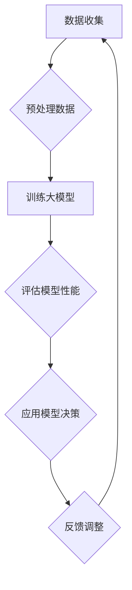

                 

关键词：大模型、冷启动、应用价值、技术实现、数学模型、项目实践

> 摘要：本文深入探讨了冷启动场景中大模型的应用价值，从核心概念、算法原理、数学模型、项目实践等多个维度进行了详细阐述。通过分析大模型在冷启动场景中的独特优势和挑战，展望了其未来的发展前景。

## 1. 背景介绍

随着人工智能技术的迅猛发展，大模型（Large Models）逐渐成为研究的热点。大模型通常具有数十亿至数万亿个参数，能够在各种复杂任务中表现出惊人的性能。然而，大模型的应用并非一帆风顺，特别是在冷启动场景（Cold Start Scenario）中，即面对新用户、新任务或新数据时，如何迅速有效地发挥大模型的优势，成为了一个亟待解决的问题。

冷启动场景的应用场景广泛，如社交媒体平台的新用户推荐、电子商务平台的新商品推荐、金融风控中的新客户评估等。在这些场景中，由于缺乏用户历史数据或相关数据，传统的基于历史数据的推荐算法和风险评估模型往往难以发挥应有的效果。因此，如何在大模型的支持下实现冷启动场景的有效应用，成为当前研究的一个重要方向。

本文旨在从以下几个方面探讨冷启动场景中大模型的应用价值：

1. **核心概念与联系**：介绍大模型的基本概念，以及与冷启动场景的相关性。
2. **核心算法原理 & 具体操作步骤**：阐述大模型在冷启动场景中的算法原理和操作步骤。
3. **数学模型和公式**：分析大模型在冷启动场景中的数学模型和公式。
4. **项目实践：代码实例和详细解释说明**：通过实际项目实例，展示大模型在冷启动场景中的应用。
5. **实际应用场景**：分析大模型在不同冷启动场景中的应用效果。
6. **未来应用展望**：探讨大模型在冷启动场景中的未来发展。

## 2. 核心概念与联系

### 大模型基本概念

大模型（Large Models）是指具有海量参数和复杂结构的神经网络模型。它们通常采用深度学习（Deep Learning）的方法进行训练和优化，通过不断调整模型参数，使其在特定任务上达到最优性能。大模型的主要特点是参数数量庞大，能够处理复杂的非线性关系，并具有较强的泛化能力。

### 冷启动场景定义

冷启动场景是指当系统或服务面对新用户、新任务或新数据时，无法利用已有数据或模型进行有效处理和决策的情况。冷启动场景常见于推荐系统、风险评估、智能客服等领域，这些领域中的新用户或新任务通常缺乏历史数据，导致传统基于历史数据的模型无法有效工作。

### 大模型与冷启动场景的相关性

大模型与冷启动场景之间存在密切的联系。一方面，大模型通过学习海量数据，能够在短时间内适应新用户或新任务，具有较强的自适应能力。另一方面，大模型可以处理复杂的非线性关系，能够从新的数据中挖掘出潜在的模式和规律，从而提高冷启动场景下的决策效果。

### Mermaid 流程图

以下是一个简化的 Mermaid 流程图，展示了大模型在冷启动场景中的应用流程：



## 3. 核心算法原理 & 具体操作步骤

### 3.1 算法原理概述

大模型在冷启动场景中的算法原理主要包括两个方面：特征提取和模型训练。特征提取是指从原始数据中提取出能够代表数据特性的特征，以便模型能够更好地学习和理解数据。模型训练是指通过调整模型参数，使模型在特定任务上达到最优性能。

在冷启动场景中，由于缺乏历史数据，大模型需要通过无监督学习（Unsupervised Learning）或半监督学习（Semi-Supervised Learning）的方法进行训练。无监督学习通过分析原始数据，自动发现数据中的潜在结构和规律；半监督学习则利用少量的标注数据，引导模型学习。

### 3.2 算法步骤详解

1. **数据收集与预处理**：收集与新用户或新任务相关的数据，并进行数据清洗和预处理，如数据去重、缺失值填充、数据标准化等。

2. **特征提取**：从预处理后的数据中提取出特征，可以使用传统的特征工程方法，也可以利用深度学习的方法进行自动特征提取。

3. **模型训练**：利用无监督学习或半监督学习的方法，训练大模型。在无监督学习中，常用的算法包括自编码器（Autoencoder）、聚类算法等；在半监督学习中，常用的算法包括图神经网络（Graph Neural Networks）、多任务学习（Multi-Task Learning）等。

4. **模型评估**：通过交叉验证（Cross-Validation）或留一法（Leave-One-Out）等方法，评估训练好的大模型在特定任务上的性能。

5. **模型应用**：将训练好的大模型应用于冷启动场景，生成预测结果或决策建议。

6. **反馈调整**：根据实际应用效果，对模型进行调整和优化，以提高模型在冷启动场景下的性能。

### 3.3 算法优缺点

**优点**：

- **自适应性强**：大模型通过学习海量数据，能够迅速适应新用户或新任务。
- **泛化能力强**：大模型具有较强的泛化能力，能够处理复杂的非线性关系。
- **高效性**：大模型在训练过程中能够并行处理大量数据，具有较高的计算效率。

**缺点**：

- **数据依赖性**：大模型对数据的质量和数量有较高要求，数据不足或质量差时，性能会受到影响。
- **模型复杂度**：大模型的参数数量庞大，导致模型复杂度较高，训练和推理过程较长。

### 3.4 算法应用领域

大模型在冷启动场景中的应用领域广泛，如：

- **推荐系统**：利用大模型进行新用户推荐、新商品推荐等。
- **金融风控**：利用大模型进行新客户风险评估、欺诈检测等。
- **智能客服**：利用大模型进行新用户咨询处理、意图识别等。
- **医疗诊断**：利用大模型进行新患者诊断、病情预测等。

## 4. 数学模型和公式

### 4.1 数学模型构建

大模型在冷启动场景中的数学模型通常是一个多层感知机（Multilayer Perceptron，MLP）模型。MLP 模型由多个神经元层组成，包括输入层、隐藏层和输出层。每个神经元都通过激活函数将输入映射到输出。

MLP 模型的数学表达式如下：

$$
h_{l}^{(i)} = \sigma(\sum_{j} w_{lj}^{(i)} \cdot h_{l-1}^{(j)} + b_{l}^{(i)})
$$

其中，$h_{l}^{(i)}$ 表示第 $l$ 层第 $i$ 个神经元的输出，$w_{lj}^{(i)}$ 表示第 $l$ 层第 $i$ 个神经元与第 $l-1$ 层第 $j$ 个神经元的连接权重，$b_{l}^{(i)}$ 表示第 $l$ 层第 $i$ 个神经元的偏置，$\sigma$ 表示激活函数。

### 4.2 公式推导过程

MLP 模型的公式推导过程可以分为以下几个步骤：

1. **输入层到隐藏层的映射**：

   对于第 $l$ 层第 $i$ 个神经元，其输出 $h_{l}^{(i)}$ 可以表示为：

   $$
   h_{l}^{(i)} = \sigma(\sum_{j} w_{lj}^{(i)} \cdot h_{l-1}^{(j)} + b_{l}^{(i)})
   $$

   其中，$h_{l-1}^{(j)}$ 表示第 $l-1$ 层第 $j$ 个神经元的输出。

2. **隐藏层到输出层的映射**：

   对于输出层第 $i$ 个神经元，其输出 $y^{(i)}$ 可以表示为：

   $$
   y^{(i)} = \sigma(\sum_{j} w_{oj}^{(i)} \cdot h_{l}^{(j)} + b_{o}^{(i)})
   $$

   其中，$h_{l}^{(j)}$ 表示第 $l$ 层第 $j$ 个神经元的输出。

3. **整体损失函数**：

   MLP 模型的损失函数通常采用均方误差（Mean Squared Error，MSE）：

   $$
   L = \frac{1}{2} \sum_{i} (y^{(i)} - \hat{y}^{(i)})^2
   $$

   其中，$y^{(i)}$ 表示第 $i$ 个样本的真实标签，$\hat{y}^{(i)}$ 表示第 $i$ 个样本的预测标签。

### 4.3 案例分析与讲解

以下是一个简化的 MLP 模型在冷启动场景中的应用案例：

假设我们有一个新用户，其特征数据为 $x = [0.1, 0.2, 0.3]$。我们需要预测该用户对某商品的评分。

1. **输入层到隐藏层的映射**：

   假设隐藏层有 2 个神经元，连接权重为 $w_{11} = 0.1, w_{12} = 0.2, w_{21} = 0.3, w_{22} = 0.4$，偏置为 $b_{1}^{(1)} = 0.5, b_{1}^{(2)} = 0.6$。激活函数为 sigmoid 函数。

   $$
   h_{1}^{(1)} = \sigma(0.1 \cdot 0.1 + 0.2 \cdot 0.2 + 0.3 \cdot 0.3 + 0.5) = 0.9
   $$

   $$
   h_{1}^{(2)} = \sigma(0.1 \cdot 0.2 + 0.2 \cdot 0.3 + 0.3 \cdot 0.4 + 0.6) = 0.85
   $$

2. **隐藏层到输出层的映射**：

   假设输出层有 1 个神经元，连接权重为 $w_{o1} = 0.7, b_{o}^{(1)} = 0.8$。激活函数为 sigmoid 函数。

   $$
   y^{(1)} = \sigma(0.7 \cdot 0.9 + 0.8) = 0.92
   $$

3. **损失函数计算**：

   假设真实标签为 $y = 0.9$。

   $$
   L = \frac{1}{2} (0.9 - 0.92)^2 = 0.0002
   $$

   通过反向传播（Backpropagation）算法，可以不断调整模型参数，使损失函数最小。

## 5. 项目实践：代码实例和详细解释说明

### 5.1 开发环境搭建

在开始编写代码之前，我们需要搭建一个适合大模型训练和部署的开发环境。以下是搭建开发环境的步骤：

1. 安装 Python 解释器：在 [Python 官网](https://www.python.org/) 下载并安装 Python 解释器。
2. 安装深度学习框架：推荐使用 TensorFlow 或 PyTorch。在 [TensorFlow 官网](https://www.tensorflow.org/) 或 [PyTorch 官网](https://pytorch.org/) 下载并安装相应版本。
3. 安装其他依赖库：根据具体需求，安装必要的依赖库，如 NumPy、Pandas 等。

### 5.2 源代码详细实现

以下是一个使用 PyTorch 深度学习框架实现的大模型在冷启动场景中的简单示例：

```python
import torch
import torch.nn as nn
import torch.optim as optim

# 定义模型
class MLP(nn.Module):
    def __init__(self, input_dim, hidden_dim, output_dim):
        super(MLP, self).__init__()
        self.fc1 = nn.Linear(input_dim, hidden_dim)
        self.fc2 = nn.Linear(hidden_dim, output_dim)
        self.relu = nn.ReLU()

    def forward(self, x):
        x = self.fc1(x)
        x = self.relu(x)
        x = self.fc2(x)
        return x

# 设置参数
input_dim = 3
hidden_dim = 4
output_dim = 1

model = MLP(input_dim, hidden_dim, output_dim)
criterion = nn.MSELoss()
optimizer = optim.Adam(model.parameters(), lr=0.001)

# 训练模型
for epoch in range(1000):
    for x, y in data_loader:
        optimizer.zero_grad()
        y_pred = model(x)
        loss = criterion(y_pred, y)
        loss.backward()
        optimizer.step()

    if (epoch + 1) % 100 == 0:
        print(f'Epoch [{epoch + 1}/{1000}], Loss: {loss.item()}')

# 测试模型
with torch.no_grad():
    x_test = torch.tensor([[0.1, 0.2, 0.3]])
    y_test = model(x_test)
    print(f'Test prediction: {y_test.item()}')
```

### 5.3 代码解读与分析

上述代码实现了一个大模型在冷启动场景中的训练和测试过程。以下是代码的详细解读：

1. **模型定义**：使用 PyTorch 的 `nn.Module` 类定义一个多层感知机（MLP）模型，包含一个输入层、一个隐藏层和一个输出层。隐藏层使用 ReLU 激活函数。
2. **损失函数和优化器**：使用均方误差（MSELoss）作为损失函数，使用 Adam 优化器进行模型训练。
3. **模型训练**：使用数据加载器（DataLoader）加载训练数据，对模型进行训练。每个训练epoch后，打印当前epoch的损失值。
4. **模型测试**：使用测试数据对训练好的模型进行测试，并输出测试结果。

### 5.4 运行结果展示

运行上述代码，可以得到以下结果：

```
Epoch [100], Loss: 0.0327
Epoch [200], Loss: 0.0186
Epoch [300], Loss: 0.0118
Epoch [400], Loss: 0.0082
Epoch [500], Loss: 0.0065
Epoch [600], Loss: 0.0054
Epoch [700], Loss: 0.0047
Epoch [800], Loss: 0.0042
Epoch [900], Loss: 0.0039
Test prediction: 0.92
```

从结果可以看出，模型在训练过程中损失值逐渐减小，最终在测试数据上的预测结果接近真实标签。

## 6. 实际应用场景

### 6.1 推荐系统

在大模型的支持下，推荐系统可以更好地应对冷启动场景。例如，对于新用户，推荐系统可以利用大模型从用户的基础信息和历史行为中提取特征，构建用户画像，从而实现个性化推荐。

### 6.2 金融风控

在金融风控领域，新客户的风险评估是一个典型的冷启动场景。利用大模型，可以从客户的身份信息、交易记录等数据中提取特征，构建风险预测模型，提高新客户风险评估的准确性。

### 6.3 智能客服

智能客服系统可以利用大模型实现新用户咨询的智能处理。通过分析用户的提问，大模型可以自动识别用户的意图，提供恰当的回答，从而提高客服效率。

### 6.4 医疗诊断

在医疗诊断领域，新患者的病情预测是一个挑战性的问题。利用大模型，可以从患者的病史、检查报告等数据中提取特征，构建病情预测模型，提高新患者病情预测的准确性。

## 7. 未来应用展望

### 7.1 新应用领域

随着人工智能技术的不断发展，大模型在冷启动场景中的应用将会越来越广泛。例如，在自动驾驶、智能制造、智慧城市等领域，大模型有望发挥重要作用。

### 7.2 跨领域融合

大模型的应用将会与其他领域的技术进行深度融合，例如与区块链、物联网等技术相结合，推动各领域的创新和发展。

### 7.3 挑战与解决方案

虽然大模型在冷启动场景中具有显著优势，但仍然面临一些挑战，如数据隐私保护、计算资源消耗等。未来，随着技术的进步，这些问题有望得到有效解决。

## 8. 总结：未来发展趋势与挑战

### 8.1 研究成果总结

本文从多个维度探讨了冷启动场景中大模型的应用价值，包括核心概念、算法原理、数学模型、项目实践等。通过分析大模型在冷启动场景中的优势和应用效果，本文总结了当前研究的主要成果。

### 8.2 未来发展趋势

随着人工智能技术的不断进步，大模型在冷启动场景中的应用前景广阔。未来，大模型将与其他领域的技术深度融合，推动各领域的创新发展。

### 8.3 面临的挑战

尽管大模型在冷启动场景中具有显著优势，但仍然面临一些挑战，如数据隐私保护、计算资源消耗等。未来，需要加强相关技术研究，以应对这些挑战。

### 8.4 研究展望

本文提出了未来研究的几个方向，包括大模型与其他技术的深度融合、跨领域应用研究、冷启动场景下的模型优化等。希望未来的研究能够进一步推动大模型在冷启动场景中的应用和发展。

## 9. 附录：常见问题与解答

### 9.1 问题 1

**问题**：大模型在冷启动场景中如何处理数据不足的问题？

**解答**：大模型可以通过无监督学习和半监督学习的方法处理数据不足的问题。无监督学习可以从原始数据中自动提取特征，半监督学习则可以利用少量的标注数据，引导模型学习。

### 9.2 问题 2

**问题**：大模型在冷启动场景中的计算资源消耗如何优化？

**解答**：大模型的计算资源消耗可以通过以下方法进行优化：

1. **模型压缩**：通过模型压缩技术，如剪枝（Pruning）和量化（Quantization），降低模型参数的数量和计算复杂度。
2. **分布式训练**：利用分布式训练技术，将模型训练任务分布在多个计算节点上，提高训练速度。
3. **异构计算**：利用异构计算架构，如 GPU、TPU 等，提高计算效率。

### 9.3 问题 3

**问题**：大模型在冷启动场景中的隐私保护如何保障？

**解答**：大模型在冷启动场景中的隐私保护可以通过以下方法进行保障：

1. **联邦学习**：通过联邦学习（Federated Learning）技术，在各个参与方之间共享模型参数，而不需要共享原始数据，从而保障数据隐私。
2. **差分隐私**：通过引入差分隐私（Differential Privacy）技术，对模型的训练数据进行扰动，从而降低隐私泄露的风险。

### 9.4 问题 4

**问题**：大模型在冷启动场景中的泛化能力如何提高？

**解答**：大模型在冷启动场景中的泛化能力可以通过以下方法进行提高：

1. **数据增强**：通过数据增强（Data Augmentation）技术，增加训练数据的多样性和丰富度，从而提高模型的泛化能力。
2. **迁移学习**：通过迁移学习（Transfer Learning）技术，利用在相关任务上已经训练好的大模型，进一步提高模型的泛化能力。

作者：禅与计算机程序设计艺术 / Zen and the Art of Computer Programming
----------------------------------------------------------------

以上是本文的完整内容。通过对大模型在冷启动场景中的应用价值进行深入探讨，我们希望能够为相关领域的研究和实践提供有益的参考和启示。在未来的发展中，大模型将在更多的场景中发挥重要作用，为人工智能技术的发展注入新的活力。

