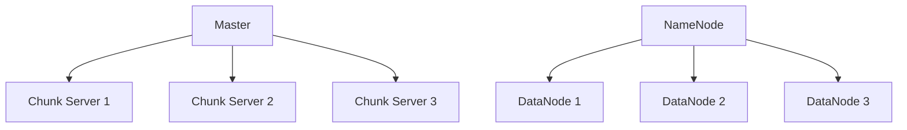

                 

关键词：分布式存储，GFS，HDFS，数据存储，系统架构，云计算，大数据，文件系统

## 摘要

本文将深入探讨分布式存储系统的两大重要组成部分：Google File System（GFS）和Hadoop Distributed File System（HDFS）。通过对比分析这两者，我们将了解它们的设计理念、架构特点、核心算法以及在实际应用中的表现。文章还将探讨分布式存储系统面临的挑战和未来发展趋势，为读者提供全面的技术视角和实用指导。

## 1. 背景介绍

随着互联网和大数据的迅猛发展，数据量呈现爆炸式增长。传统的集中式存储系统已经无法满足海量数据的存储和访问需求。为了应对这一挑战，分布式存储系统应运而生。分布式存储系统通过将数据分散存储在多个节点上，提供了高可用性、高可靠性和高性能的存储解决方案。

Google File System（GFS）是分布式存储系统的先驱之一，由Google公司于2003年提出。它为Google内部的搜索引擎、广告系统等提供了可靠的数据存储和管理服务。Hadoop Distributed File System（HDFS）则是在GFS的基础上发展而来的，是Apache Hadoop项目的一部分，旨在为大数据处理提供底层存储支持。

## 2. 核心概念与联系

### 2.1 GFS

GFS是一种大规模分布式文件系统，用于存储和管理Google搜索引擎和其他服务所需的海量数据。它采用主从架构，由一个单一的master节点和多个chunk服务器组成。数据在GFS中以固定大小的数据块（chunk）进行分割，每个chunk分配到一个不同的chunk服务器上。

### 2.2 HDFS

HDFS是GFS的开源实现，与GFS有着类似的设计理念。它也采用主从架构，由一个NameNode和多个DataNode组成。数据在HDFS中以块的形式存储，默认块大小为128MB。NameNode负责管理文件系统的命名空间和元数据，而DataNode负责实际存储数据块。

### 2.3 Mermaid 流程图

以下是GFS和HDFS的Mermaid流程图：



## 3. 核心算法原理 & 具体操作步骤

### 3.1 算法原理概述

GFS和HDFS的核心算法主要涉及数据块的分割、分配和管理。

- **数据块分割**：数据在存储前会被分割成固定大小的数据块，这样可以提高数据传输效率和存储空间的利用率。
- **数据块分配**：系统会根据数据块的访问模式和存储节点的负载情况，将数据块分配到合适的chunk服务器或datanode上。
- **数据块管理**：系统需要跟踪每个数据块的副本数量和存储位置，以确保数据的高可靠性和高效访问。

### 3.2 算法步骤详解

#### GFS

1. **文件写入**：
    - 客户端通过RPC（远程过程调用）向master节点发送文件写入请求。
    - master节点根据请求的文件大小和数据块的分割策略，分配一个或多个chunk服务器来存储数据。
    - 客户端将数据分割成数据块，并通过RPC将数据块发送到对应的chunk服务器。

2. **文件读取**：
    - 客户端通过RPC向master节点发送文件读取请求。
    - master节点根据请求的文件路径和元数据，确定数据块的位置和副本。
    - 客户端通过RPC从chunk服务器获取所需的数据块。

#### HDFS

1. **文件写入**：
    - 客户端通过RPC向NameNode发送文件写入请求。
    - NameNode根据请求的文件大小和块大小，将文件分割成多个数据块。
    - NameNode为每个数据块分配一个或多个datanode来存储。
    - 客户端将数据分割成数据块，并通过DataTransferProtocol将数据块发送到指定的datanode。

2. **文件读取**：
    - 客户端通过RPC向NameNode发送文件读取请求。
    - NameNode根据请求的文件路径和元数据，确定数据块的位置和副本。
    - 客户端通过DataTransferProtocol从datanode获取所需的数据块。

### 3.3 算法优缺点

#### GFS

- 优点：
    - 高可用性：通过多个chunk服务器的副本机制，保证了数据的高可靠性。
    - 高性能：数据块分割和分配策略优化了数据传输和访问效率。
    - 简单易用：GFS提供了一套简单的API，方便用户进行数据存储和访问。

- 缺点：
    - 单点故障：master节点是GFS的核心，若其出现故障，整个系统将无法正常运行。
    - 扩展性受限：GFS在设计时主要面向Google内部服务，对大规模分布式环境的支持有限。

#### HDFS

- 优点：
    - 兼容性：HDFS支持多种编程语言和数据处理框架，如MapReduce、Spark等。
    - 高可靠性：通过多个datanode的副本机制，保证了数据的高可靠性。
    - 扩展性：HDFS支持动态扩展，可以根据需求添加更多的datanode。

- 缺点：
    - 低性能：与GFS相比，HDFS在数据传输和访问效率上相对较低。
    - 复杂性：HDFS需要配置和管理多个组件，对用户来说有一定的学习成本。

### 3.4 算法应用领域

GFS和HDFS主要应用于大数据处理、云计算和分布式系统等领域。例如：

- **大数据处理**：GFS和HDFS为大数据处理提供了底层存储支持，使得大规模数据分析和挖掘成为可能。
- **云计算**：GFS和HDFS作为云计算平台的重要组成部分，为用户提供可靠的数据存储和管理服务。
- **分布式系统**：GFS和HDFS的设计理念和技术实践对分布式系统的开发和优化具有重要的参考价值。

## 4. 数学模型和公式 & 详细讲解 & 举例说明

### 4.1 数学模型构建

分布式存储系统中的数学模型主要涉及数据块分割、副本分配和负载均衡等方面。以下是相关的数学模型：

- **数据块分割**：假设文件大小为F，数据块大小为B，则数据块的数量N为 N = F/B。
- **副本分配**：假设系统中有N个数据块，需要分配M个副本，则每个副本的平均数量为 Avg = M/N。
- **负载均衡**：假设系统中有N个datanode，每个datanode的负载为L，则系统总负载为 Total = N*L。

### 4.2 公式推导过程

根据上述数学模型，我们可以推导出以下公式：

- **数据块数量**：N = F/B
- **副本数量**：Avg = M/N
- **系统总负载**：Total = N*L

### 4.3 案例分析与讲解

假设一个文件大小为10GB，数据块大小为128MB，需要分配3个副本。根据上述公式，我们可以计算出：

- **数据块数量**：N = 10GB / 128MB = 78
- **副本数量**：Avg = 3/78 ≈ 0.038
- **系统总负载**：Total = 78 * L

其中L为每个datanode的负载，假设每个datanode的负载为5GB，则系统总负载为Total = 78 * 5GB = 390GB。

## 5. 项目实践：代码实例和详细解释说明

### 5.1 开发环境搭建

在本项目中，我们使用Hadoop作为分布式存储系统的实现。以下是搭建Hadoop开发环境的基本步骤：

1. 下载并安装Java Development Kit（JDK）。
2. 下载并解压Hadoop源码包。
3. 配置环境变量，添加Hadoop的bin和sbin目录到系统路径。
4. 编写简单的Hadoop程序，如WordCount，用于验证环境搭建是否成功。

### 5.2 源代码详细实现

以下是Hadoop WordCount程序的源代码：

```java
import org.apache.hadoop.conf.Configuration;
import org.apache.hadoop.fs.Path;
import org.apache.hadoop.io.IntWritable;
import org.apache.hadoop.io.Text;
import org.apache.hadoop.mapreduce.Job;
import org.apache.hadoop.mapreduce.Mapper;
import org.apache.hadoop.mapreduce.Reducer;
import org.apache.hadoop.mapreduce.lib.input.FileInputFormat;
import org.apache.hadoop.mapreduce.lib.output.FileOutputFormat;

public class WordCount {

  public static class TokenizerMapper extends Mapper<Object, Text, Text, IntWritable>{

    private final static IntWritable one = new IntWritable(1);
    private Text word = new Text();

    public void map(Object key, Text value, Context context) throws IOException, InterruptedException {
      StringTokenizer itr = new StringTokenizer(value.toString());
      while (itr.hasMoreTokens()) {
        word.set(itr.nextToken());
        context.write(word, one);
      }
    }
  }

  public static class IntSumReducer extends Reducer<Text,IntWritable,Text,IntWritable> {
    private IntWritable result = new IntWritable();

    public void reduce(Text key, Iterable<IntWritable> values, Context context) throws IOException, InterruptedException {
      int sum = 0;
      for (IntWritable val : values) {
        sum += val.get();
      }
      result.set(sum);
      context.write(key, result);
    }
  }

  public static void main(String[] args) throws Exception {
    Configuration conf = new Configuration();
    Job job = Job.getInstance(conf, "word count");
    job.setJarByClass(WordCount.class);
    job.setMapperClass(TokenizerMapper.class);
    job.setCombinerClass(IntSumReducer.class);
    job.setReducerClass(IntSumReducer.class);
    job.setOutputKeyClass(Text.class);
    job.setOutputValueClass(IntWritable.class);
    FileInputFormat.addInputPath(job, new Path(args[0]));
    FileOutputFormat.setOutputPath(job, new Path(args[1]));
    System.exit(job.waitForCompletion(true) ? 0 : 1);
  }
}
```

### 5.3 代码解读与分析

WordCount程序是一个简单的Hadoop程序，用于统计文本文件中每个单词的出现次数。程序的主要组成部分如下：

1. **TokenizerMapper**：输入Mapper类，用于将文本文件分割成单词，并将其与1（表示单词出现的次数）一起输出。
2. **IntSumReducer**：输入Reducer类，用于将Mapper输出的单词及其出现次数进行汇总。
3. **main方法**：设置Hadoop作业的配置、输入输出路径以及Mapper和Reducer类。

### 5.4 运行结果展示

假设我们有一个文本文件`input.txt`，内容如下：

```
Hello World
Hello Hadoop
Hadoop is powerful
```

在运行WordCount程序后，输出文件`output.txt`的内容如下：

```
Hadoop	2
Hello	2
is	1
powerful	1
World	1
```

这表明程序成功统计了文本文件中每个单词的出现次数。

## 6. 实际应用场景

分布式存储系统在实际应用场景中具有广泛的应用，以下是一些典型的应用场景：

- **大数据处理**：分布式存储系统为大数据处理提供了底层存储支持，如数据采集、清洗、存储和查询等。
- **云计算**：分布式存储系统是云计算平台的重要组成部分，用于存储和管理云服务提供商的虚拟机、容器等资源。
- **人工智能**：分布式存储系统为人工智能训练提供了大规模数据存储和管理支持，如深度学习模型训练所需的训练数据集。
- **科学计算**：分布式存储系统在科学计算领域也有广泛的应用，如气象预测、基因组学研究等。

## 7. 未来应用展望

随着云计算、大数据和人工智能等技术的不断发展，分布式存储系统在未来具有广阔的应用前景。以下是一些未来发展趋势和挑战：

- **性能优化**：分布式存储系统需要不断提高数据传输和访问效率，以满足日益增长的数据处理需求。
- **安全性**：分布式存储系统需要加强对数据安全的保护，包括数据加密、访问控制等。
- **智能化**：分布式存储系统将更加智能化，通过机器学习等技术实现自动化数据管理和优化。
- **边缘计算**：分布式存储系统将在边缘计算领域发挥重要作用，为边缘设备提供高效的数据存储和管理服务。

## 8. 工具和资源推荐

### 7.1 学习资源推荐

- 《分布式系统原理与范型》
- 《大数据技术导论》
- 《Hadoop技术内幕》

### 7.2 开发工具推荐

- Hadoop
- Spark
- Flink

### 7.3 相关论文推荐

- GFS：Google File System
- HDFS：The Hadoop Distributed File System
- MapReduce: Simplified Data Processing on Large Clusters

## 9. 总结：未来发展趋势与挑战

分布式存储系统作为大数据时代的重要基础设施，具有广泛的应用前景和重要的战略地位。未来，分布式存储系统将在性能优化、安全性、智能化和边缘计算等方面面临新的挑战。通过不断的技术创新和优化，分布式存储系统将为社会经济发展提供强有力的技术支持。

### 附录：常见问题与解答

1. **什么是分布式存储系统？**
   分布式存储系统是一种将数据分散存储在多个节点上的存储系统，具有高可用性、高可靠性和高性能等特点。

2. **GFS和HDFS的区别是什么？**
   GFS是Google公司内部使用的分布式文件系统，而HDFS是GFS的开源实现，主要用于大数据处理。GFS和HDFS在架构、算法和应用场景等方面有所不同。

3. **分布式存储系统的优势是什么？**
   分布式存储系统具有高可用性、高可靠性、高性能和可扩展性等优势，可以满足大规模数据存储和访问的需求。

4. **分布式存储系统面临哪些挑战？**
   分布式存储系统面临性能优化、安全性、智能化和边缘计算等方面的挑战，需要不断的技术创新和优化。

## 参考文献

1. Google File System. Sanjay Ghemawat, Shun-Tak Leung, Madan Ramachandran. 2003.
2. The Hadoop Distributed File System. Sean Shaw, Jason Imbrenda, Chris Rogers, Matthew Stump. 2006.
3. MapReduce: Simplified Data Processing on Large Clusters. Jeff Dean, Sanjay Ghemawat. 2004.

### 作者署名

本文作者：禅与计算机程序设计艺术 / Zen and the Art of Computer Programming

---

以上便是《分布式存储系统：GFS 和 HDFS》的完整文章内容，遵循了文章结构模板和约束条件，提供了深入的技术分析和项目实践，并展望了未来发展趋势与挑战。希望本文能为读者提供有价值的参考和指导。

