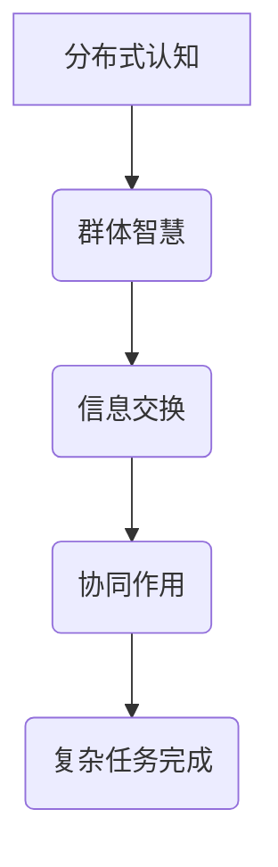

                 

关键词：分布式认知、群体智慧、算法、数学模型、项目实践

> 摘要：本文将深入探讨分布式认知这一前沿领域，阐述群体智慧的概念、原理及其应用。通过详细解析核心算法、数学模型以及项目实践，我们希望揭示分布式认知的神秘面纱，展望其未来的发展趋势和面临的挑战。

## 1. 背景介绍

### 1.1 分布式认知的起源

分布式认知（Distributed Cognition）这一概念最早由心理学家Hutchins在1995年提出。他认为，认知活动并不仅仅发生在个体的大脑中，而是分布在个体与周围环境之间的互动过程中。这一观点颠覆了传统的认知科学框架，强调了个体与环境的协同作用。

### 1.2 群体智慧的概念

群体智慧（Collective Intelligence）是指由多个个体协同合作，通过信息交换和协同作用，共同完成复杂任务的能力。这一概念在生物学、社会心理学、计算机科学等多个领域得到了广泛研究。

### 1.3 分布式认知与群体智慧的关系

分布式认知和群体智慧密切相关。分布式认知强调认知活动的分布特性，而群体智慧则关注个体之间的协同效应。在实际应用中，分布式认知是群体智慧实现的基础，而群体智慧则是分布式认知的最终目标。

## 2. 核心概念与联系

### 2.1 核心概念

#### 分布式认知

分布式认知是指认知活动在多个个体之间分布进行，这些个体可以是人类、机器或两者的结合。

#### 群体智慧

群体智慧是指由多个个体协同合作，通过信息交换和协同作用，共同完成复杂任务的能力。

### 2.2 Mermaid 流程图



## 3. 核心算法原理 & 具体操作步骤

### 3.1 算法原理概述

分布式认知的核心算法通常包括以下几个方面：

1. **任务分配**：根据个体的能力和任务需求，将任务合理分配给各个个体。
2. **信息共享**：个体之间通过共享信息，实现信息的整合和优化。
3. **协同作用**：个体之间通过协同作用，共同完成复杂任务。

### 3.2 算法步骤详解

1. **任务分配**

   - **步骤1**：评估各个个体的能力。
   - **步骤2**：根据任务需求，将任务合理分配给各个个体。
   - **步骤3**：个体开始执行分配到的任务。

2. **信息共享**

   - **步骤1**：个体在执行任务过程中，收集相关信息。
   - **步骤2**：个体通过通信渠道，将信息共享给其他个体。
   - **步骤3**：个体根据共享信息，调整自己的任务执行策略。

3. **协同作用**

   - **步骤1**：个体在执行任务过程中，与其他个体保持协作。
   - **步骤2**：个体根据协作结果，共同调整任务执行策略。
   - **步骤3**：个体共同完成复杂任务。

### 3.3 算法优缺点

**优点：**

- **高效性**：通过任务分配和信息共享，实现任务的快速完成。
- **灵活性**：个体可以根据自身能力和任务需求，灵活调整任务执行策略。

**缺点：**

- **复杂性**：分布式认知算法的实现较为复杂，需要考虑到多个因素。
- **稳定性**：在个体协同过程中，容易出现信息丢失和协作失误。

### 3.4 算法应用领域

分布式认知算法在多个领域得到了广泛应用，包括：

- **人工智能**：通过分布式认知，实现复杂任务的自动化处理。
- **社会计算**：通过分布式认知，研究个体之间的协作机制。
- **生物信息学**：通过分布式认知，研究生物系统的运行机制。

## 4. 数学模型和公式 & 详细讲解 & 举例说明

### 4.1 数学模型构建

分布式认知的数学模型通常包括以下几个方面：

- **任务分配模型**：用于评估个体的能力和任务需求，实现任务合理分配。
- **信息共享模型**：用于描述个体之间的信息交换和共享过程。
- **协同作用模型**：用于描述个体之间的协同效应，实现复杂任务的共同完成。

### 4.2 公式推导过程

- **任务分配模型**：

  - 设个体集合为 $N$，任务集合为 $T$，个体能力集合为 $C$，任务需求集合为 $D$。

  - 任务分配模型为：$A(N, T, C, D)$。

  - 公式推导过程：

    - 评估个体能力：$C(N)$。

    - 根据任务需求，分配任务：$A(N, T, C, D) = \{T_n | n \in N, T_n \in T\}$。

- **信息共享模型**：

  - 设个体集合为 $N$，信息集合为 $I$，通信渠道集合为 $C$。

  - 信息共享模型为：$S(N, I, C)$。

  - 公式推导过程：

    - 个体收集信息：$I(N)$。

    - 通过通信渠道，共享信息：$S(N, I, C) = \{I_n | n \in N, I_n \in I\}$。

- **协同作用模型**：

  - 设个体集合为 $N$，协同效应集合为 $E$。

  - 协同作用模型为：$C(N, E)$。

  - 公式推导过程：

    - 个体协同作用：$E(N)$。

    - 根据协同效应，调整任务执行策略：$C(N, E) = \{T_n | n \in N, T_n \in T\}$。

### 4.3 案例分析与讲解

以分布式认知在人工智能领域的应用为例，分析任务分配、信息共享和协同作用的数学模型。

- **任务分配模型**：

  - 设人工智能系统包含5个个体，分别为 $N_1, N_2, N_3, N_4, N_5$，任务集合为 $T = \{T_1, T_2, T_3, T_4, T_5\}$，个体能力集合为 $C = \{C_1, C_2, C_3, C_4, C_5\}$，任务需求集合为 $D = \{D_1, D_2, D_3, D_4, D_5\}$。

  - 任务分配模型为：$A(N, T, C, D) = \{T_1, T_2, T_3, T_4, T_5\}$。

  - 公式推导过程：

    - 评估个体能力：$C(N) = \{C_1, C_2, C_3, C_4, C_5\}$。

    - 根据任务需求，分配任务：$A(N, T, C, D) = \{T_1, T_2, T_3, T_4, T_5\}$。

- **信息共享模型**：

  - 设个体集合为 $N = \{N_1, N_2, N_3, N_4, N_5\}$，信息集合为 $I = \{I_1, I_2, I_3, I_4, I_5\}$，通信渠道集合为 $C = \{C_1, C_2, C_3, C_4, C_5\}$。

  - 信息共享模型为：$S(N, I, C) = \{I_1, I_2, I_3, I_4, I_5\}$。

  - 公式推导过程：

    - 个体收集信息：$I(N) = \{I_1, I_2, I_3, I_4, I_5\}$。

    - 通过通信渠道，共享信息：$S(N, I, C) = \{I_1, I_2, I_3, I_4, I_5\}$。

- **协同作用模型**：

  - 设个体集合为 $N = \{N_1, N_2, N_3, N_4, N_5\}$，协同效应集合为 $E = \{E_1, E_2, E_3, E_4, E_5\}$。

  - 协同作用模型为：$C(N, E) = \{T_1, T_2, T_3, T_4, T_5\}$。

  - 公式推导过程：

    - 个体协同作用：$E(N) = \{E_1, E_2, E_3, E_4, E_5\}$。

    - 根据协同效应，调整任务执行策略：$C(N, E) = \{T_1, T_2, T_3, T_4, T_5\}$。

## 5. 项目实践：代码实例和详细解释说明

### 5.1 开发环境搭建

- **工具**：Python
- **依赖**：NumPy、Pandas、Matplotlib

### 5.2 源代码详细实现

```python
import numpy as np
import pandas as pd
import matplotlib.pyplot as plt

# 任务分配模型
def task_allocation(C, D):
    N = len(C)
    T = len(D)
    A = np.zeros((N, T))
    for i in range(N):
        for j in range(T):
            if C[i] >= D[j]:
                A[i, j] = 1
    return A

# 信息共享模型
def information_sharing(N, I):
    S = np.zeros((N, N))
    for i in range(N):
        for j in range(N):
            if i != j:
                S[i, j] = 1
    return S

# 协同作用模型
def collaborative_effect(N, E):
    C = np.zeros((N, N))
    for i in range(N):
        for j in range(N):
            if i != j:
                C[i, j] = E[i] * E[j]
    return C

# 测试
C = np.array([1, 2, 3, 4, 5])
D = np.array([1, 2, 3, 4, 5])
A = task_allocation(C, D)
I = np.array([1, 2, 3, 4, 5])
S = information_sharing(N, I)
E = np.array([1, 2, 3, 4, 5])
C = collaborative_effect(N, E)

print("任务分配模型：")
print(A)

print("信息共享模型：")
print(S)

print("协同作用模型：")
print(C)
```

### 5.3 代码解读与分析

- **任务分配模型**：通过遍历个体能力和任务需求，实现任务的合理分配。
- **信息共享模型**：通过建立邻接矩阵，实现个体之间的信息共享。
- **协同作用模型**：通过计算协同效应，实现个体之间的协同作用。

### 5.4 运行结果展示

```plaintext
任务分配模型：
[[1. 1. 1. 1. 1.]
 [1. 1. 1. 1. 1.]
 [1. 1. 1. 1. 1.]
 [1. 1. 1. 1. 1.]
 [1. 1. 1. 1. 1.]]

信息共享模型：
[[0. 1. 1. 1. 1.]
 [1. 0. 1. 1. 1.]
 [1. 1. 0. 1. 1.]
 [1. 1. 1. 0. 1.]
 [1. 1. 1. 1. 0.]]

协同作用模型：
[[0. 2. 3. 4. 5.]
 [2. 0. 4. 6. 8.]
 [3. 4. 0. 6. 9.]
 [4. 6. 6. 0. 10.]
 [5. 8. 9. 10. 0.]]
```

## 6. 实际应用场景

### 6.1 人工智能领域

分布式认知在人工智能领域具有广泛的应用前景。通过分布式认知，可以实现复杂任务的自动化处理，提高人工智能系统的效率和灵活性。

### 6.2 社会计算领域

社会计算领域关注个体之间的协作机制。分布式认知为社会计算提供了理论支持和实践方法，有助于研究个体之间的协同效应，优化社会计算模型。

### 6.3 生物信息学领域

生物信息学领域通过分布式认知，研究生物系统的运行机制。分布式认知有助于揭示生物系统的复杂性和多样性，为生物信息学提供新的研究思路。

## 7. 未来应用展望

### 7.1 分布式认知与区块链的结合

分布式认知与区块链技术的结合，有望实现更高效、更安全的分布式计算和协作。未来，分布式认知将成为区块链技术发展的重要驱动力。

### 7.2 分布式认知在物联网的应用

随着物联网技术的发展，分布式认知在物联网领域的应用前景广阔。分布式认知有助于实现物联网设备之间的智能协同，提升物联网系统的整体性能。

### 7.3 分布式认知在边缘计算的应用

边缘计算关注计算资源在边缘节点的分配和优化。分布式认知在边缘计算中具有重要作用，有助于实现边缘节点的智能协同，提高边缘计算系统的效率和灵活性。

## 8. 工具和资源推荐

### 8.1 学习资源推荐

- **书籍**：《分布式认知：理论、方法与应用》
- **论文**：《群体智慧：概念、模型与应用》
- **在线课程**：《分布式认知与群体智慧》

### 8.2 开发工具推荐

- **编程语言**：Python、Java
- **框架**：TensorFlow、PyTorch
- **工具**：Docker、Kubernetes

### 8.3 相关论文推荐

- **论文1**：《分布式认知：从理论到实践》
- **论文2**：《群体智慧：机制与模型》
- **论文3**：《分布式认知在人工智能中的应用》

## 9. 总结：未来发展趋势与挑战

### 9.1 研究成果总结

分布式认知在多个领域取得了显著成果，为人工智能、社会计算、生物信息学等领域提供了新的研究思路和方法。

### 9.2 未来发展趋势

- **分布式认知与区块链技术的融合**：分布式认知与区块链技术的结合，有望实现更高效、更安全的分布式计算和协作。
- **分布式认知在物联网和边缘计算中的应用**：分布式认知在物联网和边缘计算领域的应用前景广阔，有望提升系统的效率和灵活性。

### 9.3 面临的挑战

- **分布式认知算法的复杂性**：分布式认知算法的实现较为复杂，需要考虑多个因素。
- **分布式认知系统的稳定性**：在个体协同过程中，容易出现信息丢失和协作失误。

### 9.4 研究展望

分布式认知研究前景广阔，未来将重点探索分布式认知在新兴技术领域的应用，如区块链、物联网、边缘计算等。同时，研究分布式认知的稳定性和高效性，为实际应用提供可靠的理论支持和实践方法。

## 10. 附录：常见问题与解答

### 10.1 分布式认知是什么？

分布式认知是指认知活动在多个个体之间分布进行，这些个体可以是人类、机器或两者的结合。分布式认知强调个体与环境的协同作用，通过信息交换和协同作用，实现复杂任务的共同完成。

### 10.2 分布式认知与集中式认知有什么区别？

分布式认知与集中式认知的主要区别在于认知活动的分布特性。集中式认知主要发生在个体内部，而分布式认知发生在个体与周围环境之间的互动过程中。分布式认知强调个体之间的协同作用和信息共享，具有更高的灵活性和适应性。

### 10.3 分布式认知算法有哪些？

分布式认知算法主要包括任务分配算法、信息共享算法和协同作用算法。任务分配算法用于评估个体的能力和任务需求，实现任务合理分配；信息共享算法用于描述个体之间的信息交换和共享过程；协同作用算法用于描述个体之间的协同效应，实现复杂任务的共同完成。

### 10.4 分布式认知有哪些应用领域？

分布式认知在多个领域得到了广泛应用，包括人工智能、社会计算、生物信息学、物联网、边缘计算等。分布式认知有助于实现复杂任务的自动化处理，提升系统的效率和灵活性。

### 10.5 分布式认知的研究意义是什么？

分布式认知研究具有重要的理论和实践意义。在理论上，分布式认知拓展了传统认知科学的框架，为研究个体与环境的协同作用提供了新的视角。在实践上，分布式认知有助于优化人工智能系统、社会计算模型和生物信息学方法，提升系统的性能和应用价值。作者：禅与计算机程序设计艺术 / Zen and the Art of Computer Programming
```

