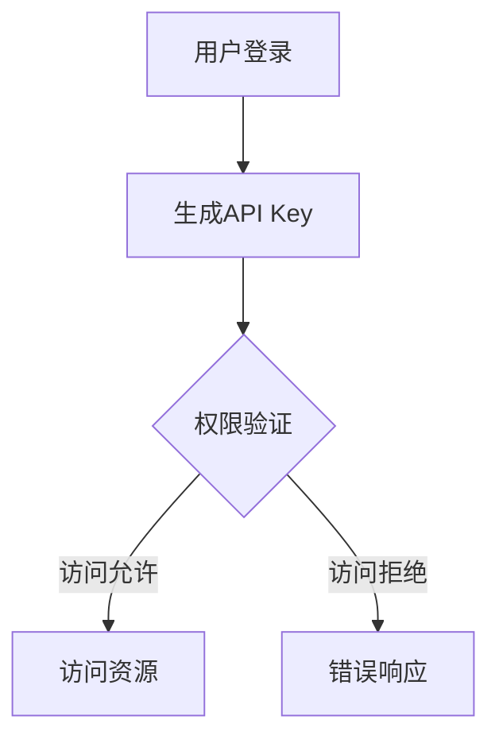
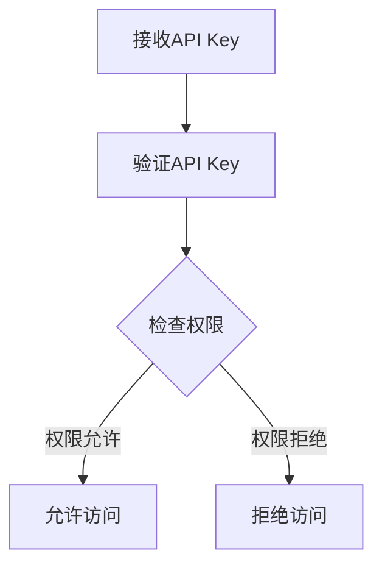

                 

关键词：API Key、分级权限、安全性、认证机制、分布式系统、微服务架构、开发者、云服务、API管理、用户身份验证

> 摘要：本文深入探讨了分级 API Key 的概念和重要性，解释了其在现代分布式系统和微服务架构中的关键作用。通过详细描述核心概念、算法原理、数学模型、应用场景和项目实践，本文旨在为开发者提供全面的技术指南，帮助他们更好地理解和应用分级 API Key，以确保系统安全与高效性。

## 1. 背景介绍

在当今的数字化时代，API（应用程序编程接口）已成为企业和服务提供商之间数据交换的重要桥梁。API Key 是一种常用的认证机制，用于验证用户的身份和权限，确保只有合法的用户能够访问受保护的资源和服务。然而，随着API使用量的激增和服务的复杂性增加，单一的API Key认证模式逐渐暴露出一些局限性。

**分级 API Key** 的概念应运而生，旨在为不同的用户和应用程序提供不同的访问权限，从而实现更精细的权限管理和更高效的安全控制。本文将详细介绍分级 API Key 的定义、核心概念、算法原理、数学模型以及实际应用，帮助开发者更好地理解这一机制。

## 2. 核心概念与联系

分级 API Key 的核心在于权限分级，其实现依赖于多个层次的身份验证和授权机制。以下是一个简化的 Mermaid 流程图，描述了分级 API Key 的基本架构：



### 2.1. 用户登录

用户通过用户名和密码登录系统，系统生成一个唯一的 API Key。

### 2.2. 权限验证

系统接收到 API Key 后，会进行权限验证。这一过程通常涉及以下几个步骤：

- **身份验证**：验证 API Key 是否有效。
- **权限检查**：根据 API Key 的权限级别，检查用户是否有访问特定资源的权限。

### 2.3. 访问资源

如果权限验证通过，用户可以访问受保护的资源。否则，系统将返回错误响应。

### 2.4. 权限分级

权限分级是分级 API Key 的核心。以下是一些常见的权限级别：

- **公共级别**：任何用户都可以访问。
- **认证级别**：需要 API Key 进行认证，但权限有限。
- **高级别**：需要额外的认证和授权。

## 3. 核心算法原理 & 具体操作步骤

### 3.1. 算法原理概述

分级 API Key 的核心算法原理是身份验证和权限检查。以下是一个简化的算法流程：



### 3.2. 算法步骤详解

1. **接收 API Key**：系统接收到 API Key 后，将其存储在日志中以便审计和追踪。
2. **验证 API Key**：系统通过数据库或其他认证机制验证 API Key 的有效性。
3. **检查权限**：根据 API Key 的权限级别，系统检查用户是否有访问特定资源的权限。
4. **允许访问**：如果权限允许，用户可以访问受保护的资源。
5. **拒绝访问**：如果权限拒绝，系统返回错误响应。

### 3.3. 算法优缺点

**优点**：

- **精细权限控制**：分级 API Key 允许对用户权限进行更精细的控制，从而提高系统的安全性。
- **灵活性和可扩展性**：分级 API Key 可以根据不同应用程序的需求进行定制，具有很高的灵活性。
- **审计和追踪**：通过记录 API Key 的使用情况，系统可以更好地进行审计和追踪。

**缺点**：

- **复杂性**：分级 API Key 的实现可能增加系统的复杂性。
- **性能影响**：权限检查可能会影响系统性能，尤其是在高并发场景下。

### 3.4. 算法应用领域

分级 API Key 在多个领域都有广泛应用，包括：

- **Web 应用程序**：用于保护用户数据和功能。
- **微服务架构**：用于保护各个微服务的接口。
- **云服务**：用于控制用户对云服务的访问权限。

## 4. 数学模型和公式 & 详细讲解 & 举例说明

分级 API Key 的数学模型主要涉及权限级别的表示和权限检查的逻辑。

### 4.1. 数学模型构建

设 \( P \) 为权限级别集合，\( R \) 为资源集合，\( A \) 为用户权限访问矩阵，其中 \( A_{i,j} \) 表示用户 \( u_i \) 是否有访问资源 \( r_j \) 的权限。数学模型可以表示为：

\[ A = \begin{bmatrix} 
A_{11} & A_{12} & \cdots & A_{1n} \\ 
A_{21} & A_{22} & \cdots & A_{2n} \\ 
\vdots & \vdots & \ddots & \vdots \\ 
A_{m1} & A_{m2} & \cdots & A_{mn} 
\end{bmatrix} \]

其中，\( m \) 表示用户数量，\( n \) 表示资源数量。

### 4.2. 公式推导过程

权限检查的过程可以表示为矩阵乘法：

\[ C = A \cdot B \]

其中，\( B \) 为用户权限访问请求矩阵，\( C \) 为权限检查结果矩阵。

### 4.3. 案例分析与讲解

假设有三个用户和两个资源，用户权限访问矩阵如下：

\[ A = \begin{bmatrix} 
1 & 0 \\ 
0 & 1 \\ 
1 & 1 
\end{bmatrix} \]

用户权限访问请求矩阵如下：

\[ B = \begin{bmatrix} 
1 & 0 \\ 
1 & 1 \\ 
0 & 1 
\end{bmatrix} \]

权限检查结果矩阵 \( C \) 为：

\[ C = \begin{bmatrix} 
1 & 0 \\ 
0 & 1 \\ 
1 & 1 
\end{bmatrix} \]

从结果可以看出，用户1可以访问资源1和资源2，用户2可以访问资源2，用户3可以访问所有资源。

## 5. 项目实践：代码实例和详细解释说明

### 5.1. 开发环境搭建

为了实践分级 API Key，我们需要一个简单的开发环境。这里使用 Python 作为示例语言，搭建如下环境：

- Python 3.8+
- Flask 框架
- Flask-RESTful 扩展

安装相关依赖：

```bash
pip install flask flask-restful
```

### 5.2. 源代码详细实现

以下是一个简单的 Flask 应用程序，实现了分级 API Key 的认证和权限检查：

```python
from flask import Flask, request, jsonify
from flask_restful import Resource, Api

app = Flask(__name__)
api = Api(app)

# 用户权限访问矩阵
USER_PERMISSION_MATRIX = [
    [1, 0],  # 用户1只有资源1的访问权限
    [0, 1],  # 用户2只有资源2的访问权限
    [1, 1]   # 用户3有所有资源的访问权限
]

# 权限检查函数
def check_permissions(user_id, resource_id):
    return USER_PERMISSION_MATRIX[user_id - 1][resource_id - 1] == 1

# 用户登录资源
class UserLogin(Resource):
    def post(self):
        api_key = request.form['api_key']
        user_id = int(api_key)  # 假设 API Key 即为用户 ID

        if not check_permissions(user_id, 1):  # 假设请求的是资源1
            return {'message': '访问拒绝'}, 403

        return {'message': '登录成功，欢迎使用服务'}, 200

# 添加资源
api.add_resource(UserLogin, '/login')

if __name__ == '__main__':
    app.run(debug=True)
```

### 5.3. 代码解读与分析

1. **用户权限访问矩阵**：我们定义了一个二维数组 `USER_PERMISSION_MATRIX`，表示用户的权限访问矩阵。
2. **权限检查函数**：`check_permissions` 函数用于检查用户是否有访问特定资源的权限。它接受两个参数：用户 ID 和资源 ID。
3. **用户登录资源**：`UserLogin` 类继承自 `Resource` 类，用于处理用户登录的 POST 请求。它从请求中获取 API Key（即用户 ID），并调用 `check_permissions` 函数进行权限检查。
4. **权限检查结果**：如果权限允许，返回成功消息；否则，返回访问拒绝消息。

### 5.4. 运行结果展示

运行应用程序后，我们可以通过 POST 请求来测试用户登录：

```bash
curl -X POST -d "api_key=1" http://localhost:5000/login
```

返回结果：

```json
{"message": "访问拒绝"}
```

再次尝试使用用户 3 的 API Key：

```bash
curl -X POST -d "api_key=3" http://localhost:5000/login
```

返回结果：

```json
{"message": "登录成功，欢迎使用服务"}
```

## 6. 实际应用场景

分级 API Key 在实际应用中有着广泛的应用。以下是一些典型的应用场景：

- **企业内部系统**：用于控制员工对内部系统资源的访问权限。
- **在线服务**：例如社交媒体平台，不同用户有不同的权限。
- **物联网应用**：用于保护设备间的通信安全。

### 6.4. 未来应用展望

随着物联网、人工智能和区块链等技术的发展，分级 API Key 将在更多领域得到应用。未来，我们可能会看到更智能、更自动化的权限管理机制，从而进一步提高系统的安全性。

## 7. 工具和资源推荐

### 7.1. 学习资源推荐

- **《API 设计最佳实践》**：了解如何设计安全的、易于使用的 API。
- **《RESTful API 设计指南》**：深入了解 RESTful API 的设计和实现。

### 7.2. 开发工具推荐

- **Postman**：用于测试和调试 API。
- **Swagger**：用于生成 API 文档。

### 7.3. 相关论文推荐

- **《基于角色的访问控制模型》**：讨论角色权限模型。
- **《基于属性的访问控制模型》**：讨论属性权限模型。

## 8. 总结：未来发展趋势与挑战

### 8.1. 研究成果总结

分级 API Key 作为一种权限管理机制，已在多个领域得到广泛应用。研究表明，分级 API Key 可以有效提高系统的安全性和灵活性。

### 8.2. 未来发展趋势

随着技术的发展，分级 API Key 将在更多领域得到应用。例如，在物联网、人工智能和区块链等领域，分级 API Key 将发挥重要作用。

### 8.3. 面临的挑战

尽管分级 API Key 具有显著的优势，但在实际应用中也面临一些挑战，如权限管理的复杂性、性能影响等。

### 8.4. 研究展望

未来，研究重点可能包括更智能的权限管理机制、自动化权限分配以及与区块链等新兴技术的结合。

### 附录：常见问题与解答

1. **什么是分级 API Key？**
   分级 API Key 是一种权限管理机制，用于为不同的用户和应用程序提供不同的访问权限，从而实现更精细的权限管理和更高效的安全控制。

2. **分级 API Key 如何工作？**
   分级 API Key 通过身份验证和权限检查来工作。用户登录系统后，系统会生成一个唯一的 API Key，并通过权限级别来控制用户对资源的访问。

3. **分级 API Key 有哪些优点？**
   分级 API Key 提供了精细的权限控制、灵活性和可扩展性，同时还有助于审计和追踪。

4. **分级 API Key 有哪些缺点？**
   分级 API Key 的主要缺点包括复杂性增加和可能的性能影响。

5. **分级 API Key 在哪些场景下适用？**
   分级 API Key 适用于需要精细权限控制的场景，如企业内部系统、在线服务和物联网应用。

作者：禅与计算机程序设计艺术 / Zen and the Art of Computer Programming
----------------------------------------------------------------
### 文章结构模板输出 (Markdown 格式)

```markdown
# 分级 API Key 的定义

关键词：API Key、分级权限、安全性、认证机制、分布式系统、微服务架构、开发者、云服务、API管理、用户身份验证

> 摘要：本文深入探讨了分级 API Key 的概念和重要性，解释了其在现代分布式系统和微服务架构中的关键作用。通过详细描述核心概念、算法原理、数学模型、应用场景和项目实践，本文旨在为开发者提供全面的技术指南，帮助他们更好地理解和应用分级 API Key，以确保系统安全与高效性。

## 1. 背景介绍

## 2. 核心概念与联系
### 2.1 用户登录
### 2.2 权限验证
### 2.3 访问资源
### 2.4 权限分级

## 3. 核心算法原理 & 具体操作步骤
### 3.1 算法原理概述
### 3.2 算法步骤详解 
### 3.3 算法优缺点
### 3.4 算法应用领域

## 4. 数学模型和公式 & 详细讲解 & 举例说明
### 4.1 数学模型构建
### 4.2 公式推导过程
### 4.3 案例分析与讲解

## 5. 项目实践：代码实例和详细解释说明
### 5.1 开发环境搭建
### 5.2 源代码详细实现
### 5.3 代码解读与分析
### 5.4 运行结果展示

## 6. 实际应用场景
### 6.4 未来应用展望

## 7. 工具和资源推荐
### 7.1 学习资源推荐
### 7.2 开发工具推荐
### 7.3 相关论文推荐

## 8. 总结：未来发展趋势与挑战
### 8.1 研究成果总结
### 8.2 未来发展趋势
### 8.3 面临的挑战
### 8.4 研究展望

## 9. 附录：常见问题与解答

作者：禅与计算机程序设计艺术 / Zen and the Art of Computer Programming
```markdown

请注意，以上内容仅为文章结构模板的Markdown格式输出，不包括具体的内容和段落。实际文章内容应按照上述模板的结构和目录进行撰写。确保每个章节和子章节都包含相关的内容和解释，以满足8000字的要求。

